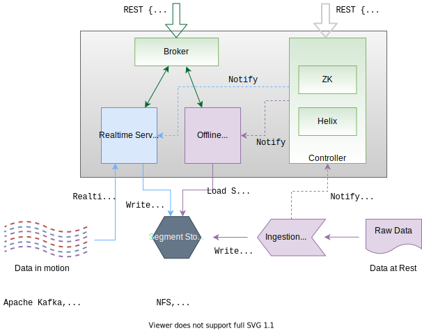
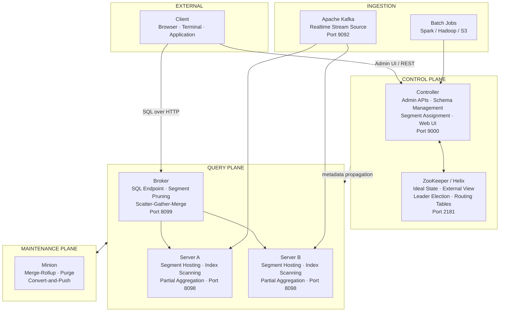

# Apache Pinot Playbook

<p align="center">
  
</p>

<p align="center"><em>Source: <a href="https://docs.pinot.apache.org/basics/architecture">Apache Pinot Documentation</a></em></p>


The Apache Pinot Playbook is a graduate-level guide to [Apache Pinot](https://pinot.apache.org/), a real-time distributed OLAP datastore engineered for user-facing analytics at massive scale. Twenty-two chapters, twenty-one hands-on labs and a complete capstone project take you from first principles through production-grade deployment.

This repository is designed to be read **as a book** and operated **as a working codebase**. Every chapter pairs deep technical narrative with runnable artifacts: a Docker Compose topology, Pinot schemas, table configurations, Kafka streaming pipelines, batch ingestion jobs, OpenAPI and AsyncAPI data contracts, SQL query packs and Python simulations that make segment pruning, star-tree pre-aggregation and upsert behavior observable and measurable.


## Architecture at a Glance

Pinot divides its responsibilities across three distinct planes. The **control plane** governs metadata, schema management and cluster state. The **query plane** handles all analytical workload, including routing, scanning and result aggregation. The **maintenance plane** manages background data operations that keep the cluster healthy over time.




## Table of Contents

### Getting Started

| Chapter | Title | What You Will Learn |
|:-------:|-------|---------------------|
| 0 | [Preface](docs/00-preface.md) | Learning philosophy, target audiences and how to navigate this guide |
| 1 | [Apache Pinot at a Glance](docs/01-apache-pinot-at-a-glance.md) | Positioning, use cases, design principles and when not to use Pinot |
| 2 | [Architecture and Components](docs/02-architecture-and-components.md) | Control plane, query plane, component responsibilities and query lifecycle |
| 3 | [Storage Model](docs/03-storage-model-segments-tenants-clusters.md) | Segments, tenants, deep store and cluster topology patterns |

### Core Concepts

| Chapter | Title | What You Will Learn |
|:-------:|-------|---------------------|
| 4 | [Schema Design and Data Modeling](docs/04-schema-design-and-data-modeling.md) | Field categorization, cardinality, null handling and schema evolution |
| 5 | [Table Config Deep Dive](docs/05-table-config-deep-dive.md) | Table types, ingestion configuration, routing and retention policies |
| 6 | [Indexing Cookbook](docs/06-indexing-cookbook.md) | Inverted, sorted, range, bloom filter, star-tree and geospatial indexes |

### Data Ingestion

| Chapter | Title | What You Will Learn |
|:-------:|-------|---------------------|
| 7 | [Batch Ingestion](docs/07-batch-ingestion.md) | Segment generation, push jobs and Hadoop integration |
| 8 | [Stream Ingestion](docs/08-stream-ingestion.md) | Kafka consumption, consuming segments and low-level ingestion |
| 9 | [Upsert, Dedup and CDC Patterns](docs/09-upsert-dedup-cdc.md) | Primary keys, upsert strategies and changelog processing |

### Querying

| Chapter | Title | What You Will Learn |
|:-------:|-------|---------------------|
| 10 | [Querying: v1 SQL](docs/10-querying-v1-and-sql.md) | Single-stage engine, aggregation functions and practical query patterns |
| 11 | [Multi-Stage Engine (v2)](docs/11-multi-stage-engine-v2.md) | Distributed joins, window functions and subquery planning |
| 12 | [Time Series Engine](docs/12-time-series-engine.md) | Time-bucketed analytics and specialized time series patterns |

### Integration and Deployment

| Chapter | Title | What You Will Learn |
|:-------:|-------|---------------------|
| 13 | [APIs, Clients and Contracts](docs/13-apis-clients-and-contracts.md) | REST APIs, client libraries, OpenAPI and AsyncAPI contracts |
| 14 | [Deployment](docs/14-deployment-docker-kubernetes-cloud.md) | Docker, Kubernetes, cloud topology and production patterns |
| 15 | [Security and Governance](docs/15-security-and-governance.md) | Authentication, authorization, TLS and data access controls |

### Operations

| Chapter | Title | What You Will Learn |
|:-------:|-------|---------------------|
| 16 | [Routing, Partitioning and Rebalancing](docs/16-routing-partitioning-rebalancing.md) | Replica groups, partition routing and segment rebalancing |
| 17 | [Performance Engineering](docs/17-performance-engineering.md) | Query profiling, index tuning and memory planning |
| 18 | [Observability and Minions](docs/18-observability-operations-and-minions.md) | Metrics, alerting and Minion task automation |
| 19 | [Failure Modes and Troubleshooting](docs/19-failure-modes-and-troubleshooting.md) | Runbooks, failure classification and recovery procedures |

### Practice and Reference

| Chapter | Title | What You Will Learn |
|:-------:|-------|---------------------|
| 20 | [Patterns and Decision Framework](docs/20-patterns-antipatterns-and-decision-framework.md) | When to use Pinot, anti-patterns and architectural trade-offs |
| 21 | [Capstone](docs/21-capstone-building-a-rides-platform.md) | End-to-end rides analytics platform from design through deployment |
| 22 | [Exercises](docs/22-exercises.md) | Scenario-based practice problems |
| 23 | [Solution Key](docs/23-solution-key.md) | Worked solutions with explanations |
| 24 | [Glossary](docs/24-glossary.md) | Canonical definitions for all terms used in this guide |
| 99 | [References](docs/99-references.md) | Curated papers, talks and documentation links |


## Hands-On Labs

Twenty-one labs organized across five progressive phases. Every lab contains a conceptual diagram, a challenge section that asks you to design before you build, a measurement tracking table with before/after numbers and four reflection prompts. See the full [Lab Index](labs/README.md) for suggested learning paths by goal.

### Phase 1: Foundation

| Lab | Title | Primary Skill                                                                 |
|:---:|-------|-------------------------------------------------------------------------------|
| 01 | [Local Cluster](labs/lab-01-local-cluster.md) | Bootstrap the full Pinot topology; verify every component and health endpoint |
| 02 | [Schemas and Tables](labs/lab-02-schemas-and-tables.md) | Classify fields, create REALTIME and OFFLINE tables, inspect via REST and UI  |
| 03 | [Stream Ingestion](labs/lab-03-stream-ingestion.md) | Connect Kafka, observe consuming segments, read BrokerResponse statistics     |
| 04 | [Index Tuning](labs/lab-04-index-tuning.md) | Apply indexes, use `SET skipIndexes` for direct A/B performance measurement   |

### Phase 2: Advanced Data Modeling

| Lab | Title | Primary Skill                                                                      |
|:---:|-------|------------------------------------------------------------------------------------|
| 05 | [Upsert and CDC](labs/lab-05-upsert-cdc.md) | Configure primary keys; validate state convergence from a changelog stream         |
| 09 | [Hybrid Tables](labs/lab-09-hybrid-tables.md) | Combine realtime and offline segments; observe the time boundary API               |
| 10 | [Schema Evolution](labs/lab-10-schema-evolution.md) | Add and modify columns without downtime; classify safe vs breaking changes         |
| 18 | [Multi-Value Column Analytics](labs/lab-18-multi-value-columns.md) | Query array-valued fields with `countMV`, `valueIn`, `arrayLength`, `percentileMV` |
| 19 | [JSON and Text Index Workshop](labs/lab-19-json-text-index.md) | Query JSON columns with `json_match`; full text search with `text_match` and FST   |

### Phase 3: Query Engineering

| Lab | Title | Primary Skill                                                                 |
|:---:|-------|-------------------------------------------------------------------------------|
| 06 | [Multi-Stage Queries](labs/lab-06-multi-stage-queries.md) | Execute distributed joins and window functions with the v2 engine             |
| 07 | [Time Series Analytics](labs/lab-07-time-series.md) | Compare pre computed bucketing, SQL FLOOR and the native time series engine   |
| 12 | [SQL Optimization Workshop](labs/lab-12-sql-optimization.md) | Diagnose and fix eight progressively complex query problems                   |
| 16 | [Star-Tree Design Workshop](labs/lab-16-star-tree-workshop.md) | Design an optimal star-tree from first principles; validate with EXPLAIN PLAN |

### Phase 4: Operations and Reliability

| Lab | Title | Primary Skill                                                                         |
|:---:|-------|---------------------------------------------------------------------------------------|
| 11 | [Minion Tasks and Compaction](labs/lab-11-minion-tasks.md) | Compact fragmented segments, configure MergeRollup and Purge tasks                    |
| 13 | [Chaos Engineering](labs/lab-13-chaos-engineering.md) | Kill each component, measure blast radius, execute structured recovery                |
| 15 | [Multi-Tenancy](labs/lab-15-multi-tenancy.md) | Isolate workloads across teams; verify segment placement                              |
| 20 | [Ingestion Methods and Transforms](labs/lab-20-ingestion-methods.md) | Ingest data via API, CLI, UI and `INSERT INTO FROM FILE`; master transform functions |
| 21 | [Storage Tiers](labs/lab-21-storage-tiers.md) | Configure hot/cold tiers with per tier index overrides; manage segment relocation     |
| 08 | [SLO and Incident Drill](labs/lab-08-slo-incident.md) | Define SLOs; run structured incident investigations; produce runbook artifacts        |
| 17 | [Grafana Integration](labs/lab-17-grafana-integration.md) | Build a six panel operational dashboard with city filter variable and freshness gauge |

### Phase 5: Domain Use Cases

| Lab | Title | Domain |
|:---:|-------|--------|
| 14 | [Fraud Detection Analytics](labs/lab-14-fraud-detection.md) | Financial services, specifically velocity checks, anomaly detection and concentration analysis |


## Repository Structure

```
.
├── docs/           22 playbook chapters from preface through capstone
├── labs/           21 hands-on labs across 5 progressive phases
├── diagrams/       Mermaid source files for architecture and flow diagrams
├── schemas/        Pinot schema definitions for trip_events, trip_state, merchants_dim
├── tables/         Annotated Pinot table configurations
├── jobs/           Batch ingestion job specifications
├── contracts/      OpenAPI, AsyncAPI and JSON Schema data contracts
├── sql/            Query packs covering smoke tests, KPIs, joins and time series
├── src/            Python package — data generators, Pinot client, simulations
├── app/            FastAPI demo analytics service
├── scripts/        Bootstrap, streaming, validation and benchmarking scripts
├── tests/          Unit tests and contract validation
└── docker-compose.yml   Complete local stack — ZooKeeper, Kafka, Controller, Broker, Server
```


## Quick Start

The following sequence bootstraps a fully functional local Pinot environment. A typical first run takes under ten minutes on a standard broadband connection.

**Step 1.** Install Python dependencies.

```bash
python3 -m pip install -r requirements.txt
```

**Step 2.** Generate sample datasets and data contracts.

```bash
make generate-data
make generate-contracts
```

**Step 3.** Start the local stack.

```bash
docker compose up -d
```

**Step 4.** Create Kafka topics and upload schemas and table configurations.

```bash
bash scripts/create_topics.sh
python scripts/setup_pinot.py --wait
```

**Step 5.** Load the offline merchant dimension and begin streaming trip events.

```bash
bash scripts/load_merchants.sh
bash scripts/stream_trip_events.sh
```

**Step 6.** Run the smoke query pack to verify the end-to-end pipeline is live.

```bash
python scripts/query_pinot.py --file sql/01_smoke.sql
python scripts/query_pinot.py --file sql/02_kpis_by_city.sql
python scripts/query_pinot.py --file sql/04_multistage_join.sql --query-type multistage
```

**Step 7.** Explore the analytics API.

```bash
curl -s http://localhost:8010/health
curl -s "http://localhost:8010/api/v1/kpis?window_minutes=240"
curl -s http://localhost:8010/api/v1/trips/trip_000001
```

For a fully automated single-command environment setup, use the bootstrap script instead.

```bash
bash scripts/bootstrap_demo.sh
```


## Repository Artifacts

| File | Purpose                                                                               |
|------|---------------------------------------------------------------------------------------|
| [`docker-compose.yml`](docker-compose.yml) | Complete local Pinot stack with ZooKeeper, Kafka, Controller, Broker, Server and API |
| [`schemas/trip_events.schema.json`](schemas/trip_events.schema.json) | Append only fact table schema for ride events                                         |
| [`schemas/trip_state.schema.json`](schemas/trip_state.schema.json) | Upsert enabled state table schema tracking latest trip status                         |
| [`schemas/merchants_dim.schema.json`](schemas/merchants_dim.schema.json) | Dimension table schema for merchant reference data                                    |
| [`tables/trip_events_rt.table.json`](tables/trip_events_rt.table.json) | Annotated realtime table configuration for trip events                                |
| [`jobs/merchants.job.yml`](jobs/merchants.job.yml) | Batch ingestion job specification for the merchants dimension                         |
| [`contracts/openapi/analytics-api.yaml`](contracts/openapi/analytics-api.yaml) | OpenAPI contract for the analytics REST API                                           |
| [`contracts/asyncapi/trip-events.asyncapi.yaml`](contracts/asyncapi/trip-events.asyncapi.yaml) | AsyncAPI contract for the Kafka trip events stream                                    |
| [`src/pinot_playbook_demo/data_gen.py`](src/pinot_playbook_demo/data_gen.py) | Deterministic data generators for reproducible test environments                      |
| [`src/pinot_playbook_demo/simulations.py`](src/pinot_playbook_demo/simulations.py) | Interactive tools for segment pruning and star-tree intuition                         |
| [`app/main.py`](app/main.py) | FastAPI analytics service with Pinot and in memory sample backends                    |


## Sample-Mode Operation

The FastAPI service supports `PINOT_MODE=auto` and falls back to a deterministic in memory provider when Pinot is unavailable. Documentation, tests, data contracts and the API layer are fully explorable without Docker running.


## Validation

Run the full repository validation suite to confirm schema alignment, contract consistency and configuration integrity.

```bash
python scripts/validate_repo.py
pytest -q
```


## Suggested Reading Sequence

For readers new to Apache Pinot, this sequence provides the fastest path to practical understanding. Experienced users may jump directly to any chapter. The [Glossary](docs/24-glossary.md) and [References](docs/99-references.md) serve as useful companions for any reading path.

| Order | Chapter | Why Here                                                                    |
|:-----:|---------|-----------------------------------------------------------------------------|
| 1 | [Preface](docs/00-preface.md) | Calibrate scope, prerequisites and learning pathway                        |
| 2 | [Apache Pinot at a Glance](docs/01-apache-pinot-at-a-glance.md) | Establish the problem space and design philosophy                           |
| 3 | [Architecture and Components](docs/02-architecture-and-components.md) | Build the foundational mental model. Everything downstream depends on this. |
| 4 | [Schema Design and Data Modeling](docs/04-schema-design-and-data-modeling.md) | Learn to structure data before touching ingestion                           |
| 5 | [Indexing Cookbook](docs/06-indexing-cookbook.md) | Understand query acceleration before writing queries                        |
| 6 | [Stream Ingestion](docs/08-stream-ingestion.md) | Connect the data path from Kafka to queryable segments                      |
| 7 | [Upsert, Dedup and CDC](docs/09-upsert-dedup-cdc.md) | Extend the model to mutable state                                           |
| 8 | [Multi-Stage Engine](docs/11-multi-stage-engine-v2.md) | Add distributed joins and window functions                                  |
| 9 | [Deployment](docs/14-deployment-docker-kubernetes-cloud.md) | Plan production topology                                                    |
| 10 | [Patterns and Decision Framework](docs/20-patterns-antipatterns-and-decision-framework.md) | Know when Pinot is the right choice                                         |
| 11 | [Capstone](docs/21-capstone-building-a-rides-platform.md) | Apply everything in a complete end-to-end design                            |


## Contributing

See [CONTRIBUTING.md](CONTRIBUTING.md).
