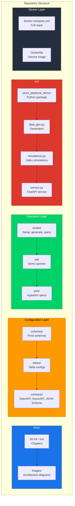

# Preface

## The Age of Real Time
There was a time when waiting hours for a dashboard to refresh was acceptable. Business teams would submit a query before lunch and review the results in the afternoon. Data pipelines ran overnight and **fresh data** meant yesterday's numbers. **That era is over.**

### The Demand for Immediacy

The modern engineering organization does not have the luxury of stale analytics. Users expect immediacy, operations demand visibility and the competitive landscape punishes latency.

Consider three modern requirements that illustrate the stakes. Ride hailing platforms must detect a surge in cancellations within seconds, not hours. Fintech companies must flag suspicious transactions before the money leaves the account. Ecommerce marketplaces must surface trending products to millions of users while those trends are still forming.

### The Tooling Gap

This shift from batch oriented reporting to real time, user facing analytics has exposed a massive gap in the tooling landscape.

| System | The Limitation |
| :--- | :--- |
| **Traditional Data Warehouses** | Excel at deep, complex analysis over historical data, but were never designed to serve thousands of concurrent queries with sub second latency on data that arrived moments ago. |
| **Operational Databases** | Handle transactions beautifully, but buckle under analytical workloads at massive scale. |
| **Search Engines** | Offer impressive speed, but lack the rich aggregation semantics that complex analytics demands. |

> [!NOTE]
> **Apache Pinot was built to fill exactly this gap.** And this guide was written to help you master it.

## The Philosophy Behind This Guide

The Apache Pinot playbook is not a repackaging of the official documentation. It is not a quickstart tutorial that ends after running your first `COUNT(*)` query. It is a **complete learning system** designed to take from first principles to production grade expertise.

### The Learning Loop

Every chapter in this guide follows a deliberate pattern.
1. Establish the **mental model**.
2. Translate that model into concrete **configuration**.
3. Validate the configuration through **queries and measurement**.
4. Stress test the understanding with **exercises and simulations**.

> [!IMPORTANT]
> This loop of **mental model, configuration, query and measurement** is the backbone of the entire guide.

### Opinionated by Design

Where the official documentation presents options neutrally, this guide tells you which option to pick and why. Rather than staying on the happy path, it walks through failure modes, edge cases and the tradeoffs that only surface under production load. Every recommendation names its tradeoff and every design pattern comes with the context needed to decide whether it applies to a given situation.

### The Companion Repository

The repository that accompanies this guide is equally intentional. It includes a deterministic data generator that ensures repeatable experiments across environments, targeted table patterns with clear separation between append only facts and latest state views, contract definitions providing standardized structures for APIs and streaming payloads, simulation utilities that demonstrate why specific design choices matter and a capstone architecture that ties ingestion, indexing, querying and operations into a cohesive whole.

# Who This Guide Is For

This guide serves multiple audiences simultaneously. Each reader will find different chapters most valuable depending on their role and experience level.

### 1. Engineers Evaluating Pinot for the First Time
If you are exploring whether Apache Pinot is the right technology for your use case, this guide will give you a clear mental model of what Pinot does well, where it struggles and how it compares to alternatives like Druid, ClickHouse and Elasticsearch. You will leave with a concrete decision framework rather than a vague impression. Begin with Chapters 1 and 2, then jump to Chapter 20 for the decision checklist.

### 2. Data Platform Engineers
If you are responsible for designing and deploying a Pinot based analytics platform, this guide covers everything from schema design and indexing strategies to cluster sizing, multi tenancy, security and observability. You will find production tested configurations, capacity planning heuristics and operational runbooks that translate directly into your infrastructure as code pipelines. Focus on Chapters 3 through 6 for foundations, then Chapters 14 through 18 for deployment and operations.

### 3. Analytics and Data Engineers
If you write SQL, design ingestion pipelines or model data for analytical consumption, this guide provides deep coverage of Pinot's query engines (including the multi stage engine), ingestion patterns for both batch and streaming and the nuances of upsert, dedup and CDC workflows. You will gain fluency in Pinot SQL and learn how to structure your data models for optimal query performance. Chapters 7 through 12 are your primary territory.

### 4. Site Reliability Engineers and Operators
If you are on call for a Pinot cluster, this guide arms you with the operational knowledge you need. From rebalance strategies and segment management to failure mode analysis and monitoring dashboards, you will gain the practical, hands on guidance that keeps clusters healthy under pressure. Chapters 14, 15, 17 and 18 are written with you in mind.

### 5. Architects and Technical Decision Makers
If you need to justify technology choices, design system boundaries or evaluate Pinot against competing solutions, this guide provides the analytical rigor you need. Every chapter addresses trade offs explicitly and the capstone chapter offers a complete decision framework grounded in real workload characteristics rather than marketing slogans.

## How to Navigate This Guide

Rather than reading front to back, choose the path that matches your immediate goal.

### Path A: Fast Evaluation (One Afternoon)

Read Chapters 1, 2, 6, 8, 9 and 20. Then run `make generate-data` and `make generate-contracts` and inspect the SQL examples in the `sql/` directory. This path gives you a working mental model, a feel for the query experience and enough operational context to make a preliminary technology decision.

### Path B: Building a Local Demo

Work through the lab files in sequence:

1. [`labs/lab-01-local-cluster.md`](labs/lab-01-local-cluster.md) to stand up a local Pinot cluster
2. [`labs/lab-02-schemas-and-tables.md`](labs/lab-02-schemas-and-tables.md) to create your first schema and table
3. [`labs/lab-03-stream-ingestion.md`](labs/lab-03-stream-ingestion.md) to ingest data from Kafka in real time
4. [`labs/lab-05-upsert-cdc.md`](labs/lab-05-upsert-cdc.md) to explore upsert and CDC patterns

This path is ideal if you learn best by doing and want to build muscle memory with Pinot's tooling.

### Path C: Production Design Review

Read Chapters 14 through 20 in order, then adapt the decision checklist in Chapter 20 to your own workload. Cross-reference with Chapters 3 and 6 for storage and indexing trade-offs that affect capacity planning.

### Path D: Deep Technical Mastery

Read every chapter in sequence, complete every lab, run every simulation and attempt every practice prompt. This is the path for engineers who want to become the Pinot expert on their team.

### Reading Map

For quick reference, here is how the chapters are organized:

| Topic | Chapter |
| :--- | :--- |
| **Architecture** | [`docs/02-architecture-and-components.md`](docs/02-architecture-and-components.md) |
| **Storage Model** | [`docs/03-storage-model-segments-tenants-clusters.md`](docs/03-storage-model-segments-tenants-clusters.md) |
| **Data Modeling** | [`docs/04-schema-design-and-data-modeling.md`](docs/04-schema-design-and-data-modeling.md) |
| **Indexes** | [`docs/06-indexing-cookbook.md`](docs/06-indexing-cookbook.md) |
| **Batch Ingestion** | [`docs/07-batch-ingestion.md`](docs/07-batch-ingestion.md) |
| **Stream Ingestion** | [`docs/08-stream-ingestion.md`](docs/08-stream-ingestion.md) |
| **CDC and Upsert** | [`docs/09-upsert-dedup-cdc.md`](docs/09-upsert-dedup-cdc.md) |
| **Query Engines** | [`docs/10-querying-v1-and-sql.md`](docs/10-querying-v1-and-sql.md), [`docs/11-multi-stage-engine-v2.md`](docs/11-multi-stage-engine-v2.md), [`docs/12-time-series-engine.md`](docs/12-time-series-engine.md) |
| **Deployment and Ops** | [`docs/14-deployment-docker-kubernetes-cloud.md`](docs/14-deployment-docker-kubernetes-cloud.md) onward |

## What Sets This Guide Apart

Most Pinot tutorials stop after "start the quickstart and run a count query." This guide goes further in five specific ways.

### 1. Every idea maps to an artifact
If the text discusses an index type, there is a table configuration in the repository that demonstrates it. If a chapter explains a query pattern, there is a SQL file you can run against the demo cluster. Abstract concepts are always grounded in runnable code.

### 2. Every production recommendation names its trade-off
This guide never tells you to **just use a star tree index** without explaining the ingestion cost, the segment size implications and the query patterns where a simpler inverted index would actually perform better. Honest tradeoff analysis is a first class concern.

### 3. Exercises are answerable from the repository itself
You do not need access to a production cluster or proprietary data to work through the practice prompts. The deterministic data generator produces consistent, reproducible datasets that make every experiment repeatable.

### 4. Failure modes are treated as first class content
The guide does not only show you the happy path. It walks through what happens when a server goes down during a rebalance, when an upsert table runs into comparison column conflicts, when a segment is corrupted and when a query times out under load. Understanding failure is as important as understanding success.

### 5. The repository remains useful even when Pinot is not running
The in-memory sample provider, the contract definitions and the simulation utilities all work without a live cluster. You can study, plan and prototype even in environments where standing up a full Pinot deployment is impractical.

## Conventions and Terminology

The following conventions and terminology are used throughout this guide to ensure clarity and consistency.

### Core Terminology

| Term | Definition |
| :--- | :--- |
| **Fact Table** | An append only table storing analytics events. Data is immutable once written (e.g., `trip_events`). |
| **State Table** | A latest row or current state representation, typically maintained through upsert semantics (e.g., `trip_state`). |
| **MSE (Multi-Stage Engine)** | The newer distributed query engine in Pinot supporting inter server data shuffling for joins and window functions. |
| **Control Plane** | Components responsible for metadata management, specifically the **Controller** and **ZooKeeper**. |
| **Query Plane** | The **Brokers** and **Servers** that serve live query requests. |
| **Deep Store** | The persistent storage layer (S3, GCS, HDFS, etc.) where segment files are durably stored. |
| **Segment** | The fundamental unit of data storage in Pinot; a self contained, columnar data file with its own indexes. |

### Formatting Conventions

To make code and configurations easy to read, this guide follows these strict formatting rules:

| Convention | Format |
| :--- | :--- |
| **Code Examples** | Presented in fenced code blocks with appropriate language annotations. |
| **SQL Queries** | Standardized with uppercase keywords (`SELECT`, `FROM`, `WHERE`) for readability. |
| **Configuration Files** | Shown in standard JSON format. |
| **Shell Commands** | Prefixed with a `$` prompt to clearly distinguish executable commands from their output. |

> [!NOTE]
> **Version Specifics:** When a configuration option or system behavior varies between Pinot versions, this guide explicitly notes the version where the behavior was introduced or changed.

## Essential Resources

This guide is designed to be self contained, but the following external resources are invaluable companions.

The [Apache Pinot Official Documentation](https://docs.pinot.apache.org/) is the authoritative reference for configuration options, API endpoints and release specific behavior. The [Apache Pinot GitHub Repository](https://github.com/apache/pinot) is the source of truth for the codebase, issue tracker and community discussions. The [StarTree Blog](https://startree.ai/blog) publishes in depth technical articles on Pinot internals, best practices and real world case studies from the team that maintains the commercial distribution of Pinot.

## Video Resources

Video content can be particularly helpful for building intuition about distributed systems concepts. [Apache Pinot: Introduction](https://www.youtube.com/watch?v=T70jnJzS2Ks) offers a comprehensive overview of Pinot's architecture, design goals and core capabilities and is the best starting point if you prefer visual learning. [Real-Time Analytics with Apache Pinot](https://www.youtube.com/watch?v=JV0WxBwJqKE) dives deeper into real time ingestion patterns, query execution and the performance characteristics that make Pinot unique in the analytics landscape.

## What This Guide Does Not Try to Do

This guide does not replace the official Apache Pinot documentation or release notes. It does not track every configuration parameter or API change across versions. Instead, it organizes the core concepts, patterns and operational wisdom into a practical, end to end narrative and gives a production oriented implementation scaffold that can be adopted to own workloads.

## A Note Before We Begin

Real time analytics is one of the most demanding and rewarding areas of modern data engineering. It sits at the intersection of distributed systems, storage engine design, query optimization and operational excellence.

Mastering it requires more than just reading documentation. It demands building mental models, testing them against real systems, breaking things deliberately and developing the judgment to know which trade-off is right for which situation.

### The Goal of This Guide

This guide is built around that core conviction. Every chapter is designed not just to inform you, but to make you **dangerous in the best possible sense**: the engineer who understands not only *what* to configure, but *why* that configuration matters and what will happen when conditions change.

> [!NOTE]
> The journey from "I have heard of Pinot" to "I can design, deploy and operate a production Pinot cluster with confidence" is not trivial. But it is achievable and **this guide is your map.**

Let's begin.

*Next chapter: [1. Apache Pinot at a Glance](./01-apache-pinot-at-a-glance.md)*
