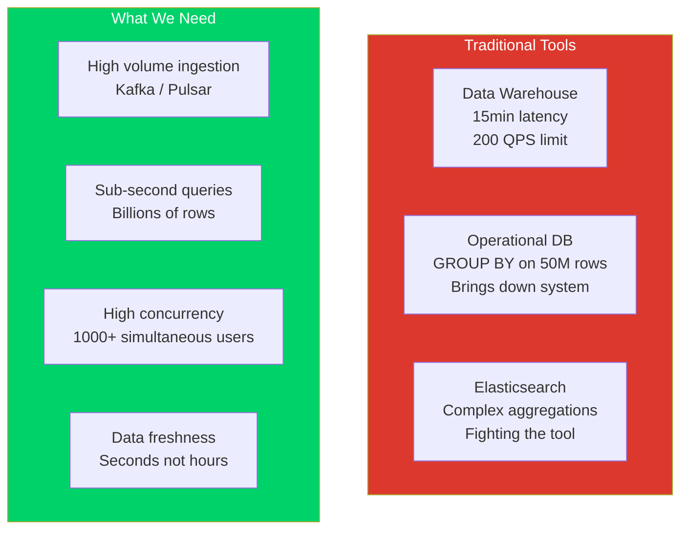
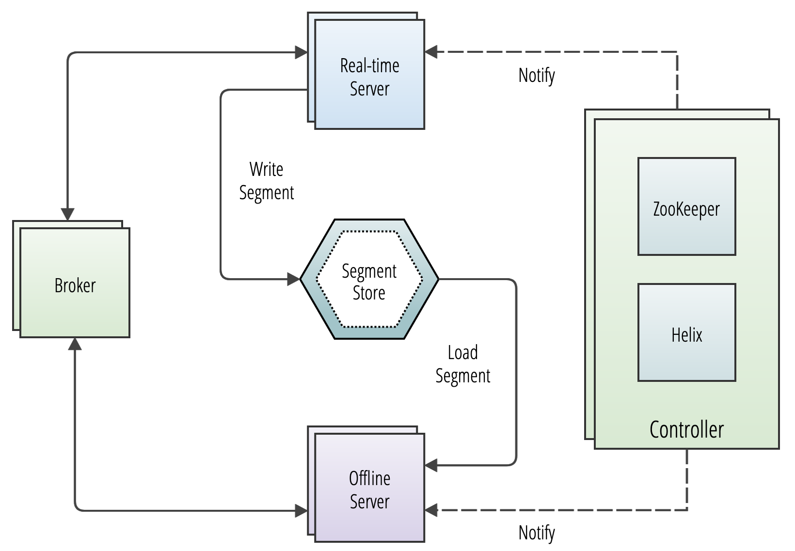
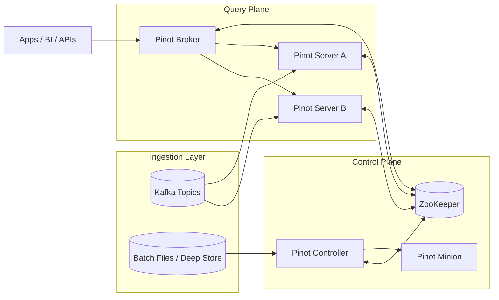

# 1. Apache Pinot at a Glance

## The Real Time Analytics Challenge

Imagine you are the **Lead Engineer** at a ride hailing company operating in 50 cities. Every second, your platform generates thousands of events: driver location pings, fare calculations and cancellation and surge signals.

### The Requirements

Three teams each have distinct and demanding analytical needs. The operations team needs dashboards updated every few seconds. The product team wants real time analytics surfaced directly to riders and drivers within the app. The fraud team must detect anomalous patterns before a trip ends.

### Why Traditional Tools Fail
You've tried the usual suspects, but they weren't built for this:



| Tool | The Bottleneck |
| :--- | :--- |
| **Data Warehouse** | Data is **15 minutes old**; concurrency collapses under 200 users. |
| **Operational DB** | Great for lookups. **`GROUP BY`** on 50M rows brings it to its knees. |
| **Elasticsearch** | Writing complex analytical aggregations feel like fighting the tool. |

### The Solution
What you need is a system purpose built for
1. **High volume data ingestion** from streams (Kafka/Pulsar).
2. **Sub second analytical queries** at scale.
3. **High concurrency** for thousands of simultaneous users.
4. **Data freshness** measured in seconds, not hours.

> [!TIP]
> ## That system is **Apache Pinot**.

## What is Apache Pinot?

Apache Pinot is a **distributed, columnar OLAP datastore** designed to deliver low latency analytical queries on large scale, high throughput data.

### History and Origins

| Timeline | Journey |
| :--- | :--- |
| **2013** | Originally built at **LinkedIn** to power real time analytics for products like "Who Viewed Your Profile", company analytics dashboards and ad campaign performance views. |
| **2018** | Donated to the **Apache Software Foundation**. |
| **2021** | Graduated as a **top level Apache project**. |


### A Specialized Analytics Serving Layer
Pinot occupies a specific and deliberate position in the data infrastructure landscape. It is not a general purpose database, a data warehouse or a search engine. Instead, it is an **analytics serving layer** optimized for a specific workload profile defined by three characteristics.

| Characteristic | Description | Conflict |
| :--- | :--- | :--- |
| **Large Data Volume** | Data scale is massive, requiring efficient storage and retrieval. | Row oriented serving systems become **prohibitively expensive**. |
| **Aggressive Freshness** | Data must be available for querying almost immediately after ingestion. | Traditional batch warehouses **cannot satisfy** real time requirements. |
| **Analytical Query Shape** | Workload focuses on complex operations like aggregations, filters and group bys. | Not suitable for **transactional** point lookups or row level mutations. |

> [!IMPORTANT]
> When all three characteristics are present, Pinot is in its element.

# The Problem Pinot Solves

To understand why Pinot exists, it helps to walk through the limitations of the systems that came before it and the systems that often sit alongside it.

### Why Traditional Architectures Fall Short?

| System Type | Primary Strength | The Analytical Breaking Point |
| :--- | :--- | :--- |
| **Traditional OLTP** (Postgres, MySQL) | ACID transactions & point reads. | **Row oriented storage** forces unnecessary data scans. Concurrency degrades under aggregation load. |
| **Data Warehouses** (Snowflake, BigQuery) | Massive throughput & complex joins. | **Latency is too high** (seconds vs. milliseconds), cost models penalize high concurrency user facing traffic. |
| **Search Engines** (Elasticsearch, Solr) | Full text search & keyword queries. | **Inverted indexes** aren't optimized for columnar scans. SQL standard analytical semantics are awkward/imprecise. |
| **Other OLAP** (Druid, ClickHouse) | High performance analytics. | Pinot differentiates with **native upserts**, pluggable indexing and massive scale external serving. |


### Detailed Limitations

#### Traditional OLTP Databases
Relational databases are exceptional at transactional workloads, but analytical queries expose their fundamental architecture. A `SELECT city, SUM(fare)` query must read entire rows even though it only needs two columns. This row store tax accumulates rapidly at scale. Beyond storage inefficiency, long running aggregation queries compete with concurrent transactional operations, creating resource contention that kills performance for both workload types.

#### Data Warehouses
Warehouses are optimized for throughput, not latency. A 3 second response is fast for a warehouse but a failure for a user facing API requiring sub-100ms response times. Most warehouse architectures operate on micro batches measured in minutes rather than true real time ingestion measured in seconds. At scale, 10,000 queries per second becomes both technically challenging and financially painful.

#### Search Engines
Designed for information retrieval, not deep analytics. Inverted indexes do not naturally extend to the columnar scans that analytical queries demand, and complex calculations with SQL standard semantics are difficult to express accurately.

> [!NOTE]
> ### The Gap Pinot Fills
> Pinot was designed from the ground up to serve **fresh analytical queries at low latency and high concurrency**. It achieves this through a combination of architectural decisions that allow it to serve both internal dashboards and external, customer facing analytics from the same cluster at massive scale.

## Core Design Principles

Pinot's architecture is built on four foundational design principles that work together to deliver its unique performance characteristics.


### 1. Columnar Storage
Pinot stores data in a columnar format within each segment. This architectural choice is the bedrock of its efficiency. A query selecting `city` and `fare_amount` from a 50 column table reads only two columns, skipping the other 48 entirely. Values within a single column typically have similar data types and distributions, enabling highly efficient compression. The result is dramatically reduced I/O for analytical queries compared to traditional row oriented storage.

### 2. Segment Based Architecture
Data in Pinot is organized into **Segments**, the fundamental unit of storage, replication and execution. Each segment is an immutable columnar file including its own indexes, metadata and data dictionaries, making it fully self contained. The architecture scales horizontally by adding more servers and distributing more segments, with each server processing its local segments independently and simultaneously. This design also simplifies lifecycle management: retiring old segments or rebalancing across the cluster are straightforward operations.

### 3. Scatter Gather Query Execution
When a query hits a **Pinot Broker**, it follows a high efficiency distributed pattern.
1. **Scatter:** The broker identifies which servers host the relevant segments and sends the query to all of them in parallel.
2. **Local Execution:** Each server runs the query against its local segments and performs local aggregation.
3. **Gather:** Servers return partial results to the broker, which merges them into the final answer.

This model delivers consistent low latency responses even as data grows. Adding servers distributes the load without changing the execution model.

### 4. Pluggable Indexing
Unlike one size fits all systems, Pinot allows you to tune indexing to specific query patterns.

| Index Type | Best Use Case |
| :--- | :--- |
| **Inverted Index** | High performance filtering. |
| **Sorted Index** | Efficient range scans. |
| **Range Index** | Numeric predicates and boundaries. |
| **Text/JSON Index** | Full text search and semi structured data. |
| **Geospatial Index** | Location based queries. |
| **Star Tree Index** | Pre aggregated analytical queries (The **Magic** of Pinot). |

> [!TIP]
> This pluggable approach means you can optimize storage and indexing strategy specifically for your workload rather than accepting a generic performance profile.


# Architecture Overview

The following diagram illustrates the high level architecture of a Pinot cluster, showing how data flows from ingestion sources through the control plane and into the query plane.


*Source: [Apache Pinot Documentation](https://docs.pinot.apache.org/basics/architecture)*




*Source: [Apache Pinot Documentation](https://docs.pinot.apache.org/basics/architecture)*

### Ingestion Layer

Data enters Pinot from two primary sources, catering to both real time and historical needs. Streaming data is typically sourced from Apache Kafka (also Kinesis or Pulsar) and consumed directly by Pinot servers, which build real time segments from incoming records on the fly. Batch data is ingested through the controller, which coordinates segment creation from files stored in the deep store (S3, GCS, HDFS or local filesystems).

### Control Plane

The **brain** of the cluster manages metadata and orchestration across three components. The Pinot Controller manages cluster metadata, orchestrates segment assignment, coordinates rebalance operations and manages the lifecycle of minion tasks. ZooKeeper serves as the source of truth, storing the cluster state including table configurations, schema definitions, segment assignments and routing tables. Minions are optional worker processes that execute essential background tasks such as segment merging, purging and data conversion.

### Query Plane

The execution layer handles client requests through two component types. Pinot Brokers are the entry point for clients: they receive queries, determine which servers host the relevant segments, scatter the query to those servers and gather partial results into a final response. Pinot Servers host the actual data segments, execute queries against local data and return partial results back to the broker.

> [!NOTE]
> This decoupled architecture allows you to scale the Ingestion, Control and Query planes independently based on your specific workload requirements.

## Where Pinot Excels

Pinot is a strong fit when your workload combines high volume data ingestion, low latency query requirements, high query concurrency and a need for data freshness measured in seconds. The following table compares Pinot against other commonly considered systems across key workload dimensions.

| Dimension | Apache Pinot | Apache Druid | ClickHouse | Elasticsearch |
|---|---|---|---|---|
| **Primary strength** | Real time OLAP serving at scale | Real time OLAP with time series focus | Fast analytical queries, single node efficiency | Full text search, log analytics |
| **Query latency** | Sub second (p99 typically <200ms) | Sub second | Sub second to seconds | Sub second for simple queries |
| **Ingestion freshness** | Seconds (real time from Kafka) | Seconds (real time from Kafka) | Seconds (with materialized views) | Near real time |
| **Concurrency** | Thousands of QPS (proven at LinkedIn, Uber scale) | Hundreds to thousands of QPS | Hundreds of QPS (improves with clustering) | Thousands of QPS for search workloads |
| **Upsert / Mutable rows** | Native support | Limited | ReplacingMergeTree (eventual) | Native document updates |
| **SQL support** | Full SQL (single stage + multi stage engine) | SQL via Druid SQL (translated to native) | Full SQL (ClickHouse dialect) | SQL via xpack (limited) |
| **Pluggable indexes** | Extensive (inverted, range, text, JSON, star tree, geospatial) | Bitmap, spatial | Primary, secondary, skip indexes | Inverted, BKD tree |
| **Join support** | Multi stage engine (v2), lookup joins | Limited (lookup joins) | Full join support | Not designed for joins |
| **Cloud native deployment** | Kubernetes native, deep store on S3/GCS/HDFS | Kubernetes native | Kubernetes compatible | Kubernetes compatible |
| **Operational complexity** | Moderate (ZooKeeper dependency) | Moderate (ZooKeeper dependency) | Lower (fewer components) | Moderate |
| **Best for** | User facing analytics, operational dashboards, high concurrency APIs | Time series analytics, event driven dashboards | Internal analytics, adhoc exploration | Log search, full text search |

## Where Pinot Is Not the Right Choice

Intellectual honesty about a technology's limitations is more valuable than enthusiasm about its strengths. Pinot is not the right tool for every analytical workload. The following table summarizes scenarios where other systems are better suited, followed by detailed explanations.

| Scenario | Better Alternative | Why Pinot Isn't the Fit |
| :--- | :--- | :--- |
| **Transactional Workloads** | PostgreSQL, MySQL, TiDB | Needs ACID, FK constraints and frequent single row updates. |
| **Heavyweight ETL** | Snowflake, BigQuery, Spark | Requires multi way joins, recursive CTEs or minutes long logic. |
| **Full Text Search** | Elasticsearch, Solr | Focus is on relevance scoring, fuzzy matching and document retrieval. |
| **Small Datasets** | Single Instance RDS | Distributed architecture adds unnecessary operational complexity. |
| **Strong Consistency** | CockroachDB, Spanner | Application requires read after write or linearizable consistency. |


### Transactional Workloads with Row Level Mutations
If your application needs ACID transactions and frequent single row updates as its primary access pattern, stick to a relational database. Pinot's upsert support handles mutable state for analytical purposes, but it is not a replacement for a transactional database.

### Complex, Long Running ETL and Transformations
If your queries involve multi way joins across dozens of tables, stored procedures or transformation logic that runs for minutes, data warehouses are the appropriate choice. They are optimized for throughput and complex logic. Pinot's multi stage engine supports joins, but it is optimized for serving layer patterns, not heavyweight data transformation.

### Full Text Search as the Primary Use Case
If your workload is dominated by keyword search and relevance scoring, Elasticsearch or Solr will serve better. Pinot supports text indexes, but it is an analytics engine first and a search engine second.

### Small Datasets with Simple Query Patterns
If your dataset fits in a single PostgreSQL instance and concurrency is modest, introducing Pinot adds overhead without meaningful benefit. Pinot shines at scale and is over engineered for a 10 GB dataset serving 10 queries per minute.

### Workloads Requiring Strong Consistency
Pinot is an eventually consistent system optimized for availability and partition tolerance (AP in the CAP theorem). If your application requires absolute read after write consistency, Pinot is not the right choice for that specific access pattern.

> [!CAUTION]
> Choosing the right tool for the job prevents **fighting the architecture** later in your development lifecycle.

# Real World Adopters

Apache Pinot powers real time analytics at some of the world's most demanding engineering organizations. Understanding how these companies use Pinot provides valuable context for evaluating whether it fits your own workload.

### Adopters at a Glance

| Organization | Primary Use Case | Key Driver for Pinot |
| :--- | :--- | :--- |
| **LinkedIn** | User facing analytics & ad dashboards | Massive concurrency (millions of QPS). |
| **Uber** | Ride operations & Uber Eats analytics | High ingestion (millions of events/sec) with strict SLAs. |
| **Stripe** | Merchant payment & revenue dashboards | High availability for external, user facing workloads. |
| **Walmart** | Inventory & supply chain visibility | Sub second analytics on fresh retail data at massive scale. |
| **Slack** | Platform health & delivery metrics | Scales to monitor millions of concurrent users. |
| **Confluent** | Customer usage & billing metrics | Native integration with Kafka stream processing. |

### Deployment Deep Dives

#### LinkedIn
As the birthplace of Pinot, LinkedIn uses it to power over 50 user facing analytics applications, including "Who Viewed Your Profile," company page analytics, ad campaign performance dashboards and content engagement metrics. LinkedIn's Pinot deployment handles millions of queries per second across hundreds of nodes, serving both internal dashboards and external, member facing analytics products.

#### Uber
Uber operates one of the largest Pinot deployments in the world, using it to power real time dashboards for ride operations, restaurant analytics for Uber Eats, financial reporting and marketplace health monitoring. Uber's deployment ingests millions of events per second and serves analytics across multiple business lines with strict latency SLAs.

#### Stripe
Stripe uses Pinot to deliver real time analytics to its merchants, powering the dashboards where businesses track payment volumes, success rates and revenue trends. The user facing nature of this workload demands both low latency and high availability.

#### Walmart
Walmart leverages Pinot for real time inventory analytics, pricing intelligence and supply chain visibility across its massive retail operations. The scale of Walmart's operations makes sub second analytics on fresh data a competitive necessity.

#### Slack
Slack uses Pinot to power internal analytics and operational dashboards, tracking message delivery performance, workspace engagement metrics and platform health indicators at the scale of millions of concurrent users.

#### Confluent
Confluent, the company behind Apache Kafka, uses Pinot to provide its customers with real time usage analytics and billing metrics for their Kafka clusters, demonstrating the natural synergy between stream processing and Pinot's real time ingestion capabilities.

## Why This Repository Uses a Rides and Commerce Domain

The domain model in this repository deliberately mixes the query patterns that Pinot handles well.

### The Domain Model Breakdown

**1. Fact Events (`trip_events`)**
These represent append only, immutable records of things that happened. Every trip request, status change and fare calculation is recorded as a separate event. This table powers funnel analysis, time series aggregations and operational analytics.

**2. Latest State (`trip_state`)**
This represents the current truth about an entity, maintained through upsert semantics. It answers questions like "What is the current status of trip X?" and "How many trips are currently in progress in Bengaluru?" This table demonstrates Pinot's Change Data Capture and upsert capabilities.

**3. Dimension Enrichment (`merchants_dim`)**
This represents slowly changing reference data used to enrich fact queries through joins. It demonstrates the modeling trade offs between denormalization (embedding dimensions in fact tables) versus join time enrichment (using the multi stage engine).

**4. Time Bucketed KPIs**
These represent pre aggregated metrics built specifically for dashboards and APIs. They demonstrate the star tree index and materialized aggregation patterns.

> [!IMPORTANT]
> This combination ensures that as you work through the guide, you encounter the full spectrum of patterns that Apache Pinot supports in production.

## Example

The following examples demonstrate the types of queries where Apache Pinot excels.

### 1. Real Time Aggregation Over State

This query demonstrates a real time aggregation over a state table, filtered to a specific status, grouped by a dimension and sorted by a metric. On a properly configured Pinot cluster with appropriate indexes, this query returns in under 100 milliseconds even against hundreds of millions of rows.

```sql
SELECT
  city,
  COUNT(*) AS completed_trips,
  SUM(fare_amount) AS gmv,
  AVG(fare_amount) AS avg_fare,
  MAX(fare_amount) AS max_fare
FROM trip_state
WHERE status = 'completed'
  AND event_time > ago('PT1H')
GROUP BY city
ORDER BY gmv DESC
LIMIT 20
```

**The Business Question**<br>
"Over the last hour, which cities generated the most revenue from completed trips and what do the fare distributions look like?"

> [!TIP]
> **The Pinot Advantage**
>
> In a traditional warehouse, this query might take seconds. In Pinot, it completes in tens of milliseconds by leveraging a sorted index on `status`, an inverted index on `city` and a range index on `event_time`.

### 2. Time Bucketed Aggregation
Here is a second example showing a time bucketed aggregation, which is the bread and butter of operational dashboards.

```sql
SELECT
  DATETIMECONVERT(event_time, '1:MILLISECONDS:EPOCH', '1:MILLISECONDS:EPOCH', '5:MINUTES') AS five_min_bucket,
  city,
  COUNT(*) AS trip_count,
  SUM(CASE WHEN status = 'cancelled' THEN 1 ELSE 0 END) AS cancellations,
  CAST(SUM(CASE WHEN status = 'cancelled' THEN 1 ELSE 0 END) AS DOUBLE) / COUNT(*) AS cancel_rate
FROM trip_events
WHERE event_time > ago('PT6H')
GROUP BY five_min_bucket, city
ORDER BY five_min_bucket DESC, cancel_rate DESC
LIMIT 100
```

**The Business Application**<br>
This query powers a cancellation rate dashboard, bucketed into 5 minute intervals, showing exactly which cities are experiencing elevated cancellation rates over the last 6 hours.

## Operating Heuristics

These heuristics represent distilled operational wisdom. They will be explored in depth in later chapters, but they are worth internalizing from the start.

### 1. Start with the query, not the data
The question "Can Pinot store this data?" almost always has a trivially positive answer. The question that actually determines whether Pinot is the right tool is: "Can Pinot answer the important queries at the latency and freshness we need?" Design your evaluation around that second question.

### 2. Model around query paths, not source system structure
Your source system's schema is optimized for writes. Your Pinot schema should be optimized for reads. These are almost never the same thing. Denormalize aggressively, pre compute when possible and design your columns and indexes around the `WHERE` clauses and `GROUP BY` dimensions your queries actually use.

### 3. Separate append only facts from latest state views
When your workload has both historical analytics ("What happened over the last 30 days?") and current truth queries ("What is the status right now?"), use separate tables with different configurations. Fact tables and state tables have fundamentally different storage, indexing and retention requirements and should not be forced into a single table.

### 4. Invest in upstream data contracts
Pinot performance is exquisitely sensitive to data quality. Null values in unexpected columns, schema mismatches between producers and the Pinot schema and inconsistent event formats cause more production incidents than any cluster configuration issue. Stabilize your upstream event contracts before optimizing your Pinot configuration.

### 5. Measure before you optimize
Pinot provides excellent query execution statistics. Before adding an index, measure the query without it. After adding the index, measure again. The difference between "I think this index helps" and "this index reduced p99 latency from 450ms to 35ms" is the difference between engineering and guessing.

## Common Pitfalls

> [!WARNING]
> These are the mistakes that experienced Pinot operators have learned to avoid, often the hard way.

### 1. Treating Pinot like a transactional database
Expecting row level update semantics, read after write consistency or foreign key constraints will lead to frustration and architectural dead ends. Pinot is an analytics serving layer. Design your application accordingly.

### 2. Pushing complex business logic before stabilizing upstream contracts
If your Kafka topics are still evolving their schemas weekly, spending time optimizing Pinot table configurations is premature. Fix the foundation first.

### 3. Using Pinot as the only analytical store
Pinot excels at real time, low latency serving queries. It is not designed for long horizon, heavyweight ETL or complex BI workloads that involve many table joins and hours of historical data. A healthy architecture pairs Pinot with a warehouse or lakehouse, each handling the workload it was designed for.

### 4. Over indexing
Adding every available index to every column increases segment size, slows ingestion and consumes memory without necessarily improving query performance. Index strategically based on actual query patterns, not theoretical completeness.

### 5. Ignoring segment sizing
Segments that are too small create excessive metadata overhead and scatter gather fanout. Segments that are too large slow down queries and rebalance operations. Finding the right segment size, typically targeting **100MB to 500MB** per segment, is one of the most impactful tuning decisions you can make.

## Practice Prompts

These prompts are designed to deepen understanding of the concepts introduced in this chapter. Each can be answered using only the information in this guide and the repository artifacts.

1. **Identify Real Time Use Cases:** Write down three queries in your own domain that absolutely need fresh data (seconds, not hours) and would benefit from Pinot's real time ingestion and low latency query execution.
2. **Identify Warehouse Workloads:** List two queries from your workload that should probably stay in a warehouse even if Pinot exists in your stack. Explain why Pinot is not the right serving layer for them.
3. **Analyze the Domain Model:** Explain why this repository uses both `trip_events` (a fact table) and `trip_state` (a state table with upsert) instead of modeling everything in a single table. What would break or degrade if we tried to use only one?
4. **Evaluate Alternatives:** Using the comparison table in this chapter, argue for or against replacing an existing Elasticsearch deployment with Pinot for a log analytics use case. Consider query patterns, ingestion volume and operational complexity.
5. **Optimize Query Performance:** Review the concrete SQL examples in this chapter and identify which indexes (inverted, sorted, range) would be most beneficial for each query. Justify your choices.

## Suggested Labs and Follow Through

The following labs provide hands on experience with the concepts introduced in this chapter:

* [Lab 1: Local Cluster](../labs/lab-01-local-cluster.md) walks through standing up a complete Pinot cluster on your local machine, giving a live environment to run the SQL examples from this chapter.
* [Lab 2: Schemas and Tables](../labs/lab-02-schemas-and-tables.md) teaches to create the schema and table configurations used throughout this guide.
* [Lab 6: Multi Stage Queries](../labs/lab-06-multi-stage-queries.md) demonstrates the multi stage engine's join capabilities, extending the query patterns shown in this chapter.

## Repository Artifacts

The following files in this repository are directly relevant to the concepts discussed in this chapter.

* [`README.md`](README.md) provides the repository overview and quick start instructions.
* [`docker-compose.yml`](docker-compose.yml) defines the local Pinot cluster used throughout the guide.
* [`sql/01_smoke.sql`](sql/01_smoke.sql) contains smoke test queries that validate your cluster is running correctly.
* [`schemas/trip_events.schema.json`](schemas/trip_events.schema.json) defines the schema for the fact events table.
* [`tables/trip_events_rt.table.json`](tables/trip_events_rt.table.json) defines the real time table configuration for streaming ingestion.

## Further Reading and Resources

* [Official Pinot Architecture Documentation](https://docs.pinot.apache.org/basics/architecture) provides the canonical reference for Pinot's component architecture and data flow.
* [Apache Pinot: Introduction (YouTube)](https://www.youtube.com/watch?v=mRkWT_EU99M) is an excellent video introduction to Pinot's design goals and capabilities.
* [Pinot at Uber Scale (YouTube)](https://www.youtube.com/watch?v=JV0WxBwJqKE) demonstrates how Uber operates Pinot at massive scale, providing real world context for the architectural concepts discussed in this chapter.
* [A Near Real Time Analytics Platform (LinkedIn Engineering Blog)](https://engineering.linkedin.com/blog/2015/02/a-near-real-time-analytics-platform) is the original blog post describing why LinkedIn built Pinot and the design decisions that shaped its architecture. This is essential reading for understanding Pinot's origins and the problems it was created to solve.

*Next chapter: [2. Architecture and Components](./02-architecture-and-components.md)*

*Previous chapter: [Preface](./00-preface.md)*
