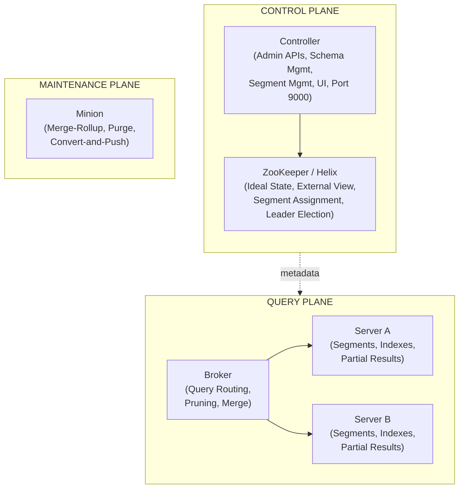
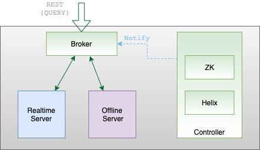
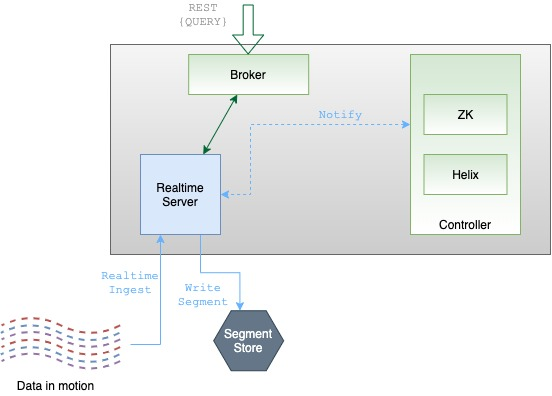
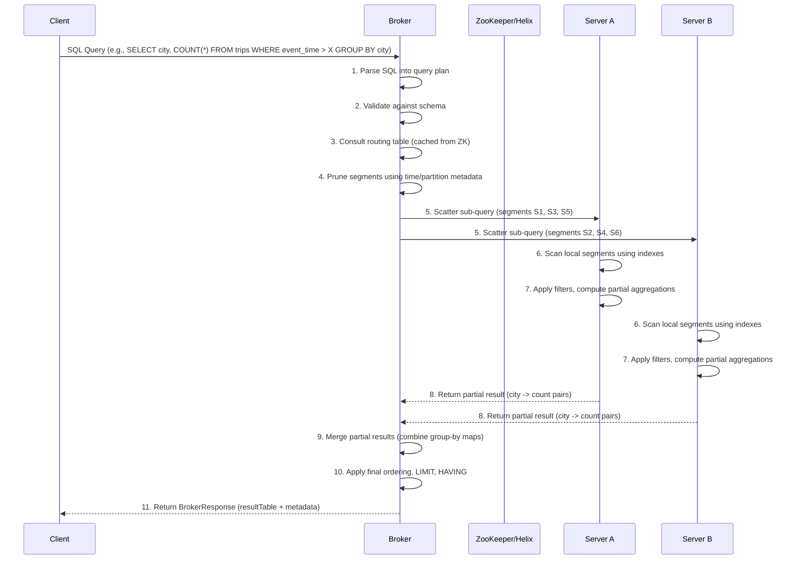
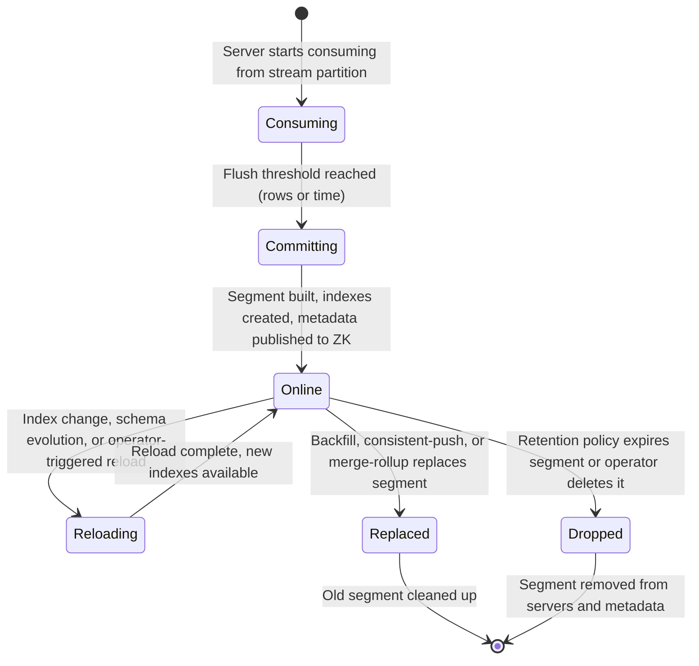

# 2. Architecture and Components

## Why This Chapter Is the Foundation of Everything

> [!IMPORTANT]
> If you take one thing away from this entire guide, let it be **every operational decision you make in Apache Pinot is downstream of its architecture.**

### The Cost of Skipping the Fundamentals
Teams that skip the architecture chapter and jump straight to table configs or ingestion pipelines inevitably find themselves debugging problems they do not understand, applying fixes they cannot explain and building mental models that crumble under the first production incident. 

Your operational decisions all trace back to how the system's components interact, including
* Schema design
* Index selection
* Query tuning
* Capacity planning
* Failure recovery
* Upgrade strategies

### The Prerequisite to Production
Understanding the architecture is not optional background reading. It is the prerequisite. 

Every chapter that follows assumes you have internalized how Pinot's components divide responsibilities, how queries flow through the system and how metadata propagates across the cluster. If you invest the time here, the rest of this guide will feel like natural consequences of first principles. If you skip ahead, you will return to this chapter again and again, wondering why things work the way they do.

### What You Will Learn
This chapter covers
1. **Every major component** of the system.
2. **The separation of concerns** that makes Pinot's distributed design tractable.
3. **The end to end lifecycle** of both queries and data. 

By the end, you will be equipped to reason about failures, scaling decisions and operational trade offs with confidence.

## High Level Architecture | Control Plane vs Query Plane

The single most clarifying mental model for Pinot's architecture is the separation between the **control plane** and the **query plane**.

### 1. The Control Plane

The control plane consists of **Controllers** and **ZooKeeper/Helix**. 

* **The Role:** They manage schemas, table configurations, segment assignments and administrative operations. 
* **ZooKeeper:** Stores the metadata that represents the cluster's desired state and actual state. 
* **How it works:** Together they decide what goes where, track the health of assignments and coordinate changes.

### 2. The Query Plane
The query plane consists of **Brokers** and **Servers**. 

* **Brokers:** Receive SQL queries from clients, figure out which servers hold the relevant data, fan the work out and merge partial results into a final response. 
* **Servers:** Hold the actual segment data, execute scans and aggregations against their local segments and return partial results to brokers. 
* **How it works:** Together they do the real work of moving data (passengers) from storage to the client.

### 3. The Maintenance Plane

**Minions** sit in a third category, the maintenance plane. 

* **The Role:** They perform background tasks like segment compaction, purge operations and data format conversions.




*Source: [Apache Pinot Documentation](https://docs.pinot.apache.org/basics/architecture)*


*Source: [Apache Pinot Documentation](https://docs.pinot.apache.org/basics/components)*

> [!IMPORTANT]
> This separation has profound implications for how you operate Pinot:
> * **Scaling the query plane does not require scaling the control plane.** Adding more brokers or servers to handle higher query load does not require more controllers or a larger ZooKeeper ensemble.
> * **Control plane failures do not immediately stop queries.** If a controller goes down momentarily, existing queries continue to execute because brokers and servers already have cached routing information. However, you cannot create new tables, add segments or perform administrative operations until the controller recovers.
> * **Query plane failures are isolated.** If one server goes down, only the segments hosted on that server become unavailable. Brokers detect this and route queries to replicas (if configured) or return partial results.

## The Controller

### What the Controller Does

The Controller is the **administrative brain** of a Pinot cluster. It is the single point through which all management operations flow. If you need to create a table, upload a schema, trigger a segment reload, check cluster health or examine the Pinot UI, you are talking to the controller.

### Core Responsibilities

The controller handles the critical administrative and orchestration tasks that keep the cluster running smoothly.

* **Schema Management** Validates and stores schema definitions that describe the columns, data types and time columns for each table. Schemas are stored in ZooKeeper and must be created before the table that references them.

* **Table Configuration Management** Validates table configs (which define table type, ingestion settings, indexing config, routing and tenants) and writes the resulting metadata to ZooKeeper.

* **Segment Management** Tracks all segments across the cluster. 
  * *Offline Tables:* Handles segment uploads and assignments.
  * *Realtime Tables:* Manages the ideal state that defines which servers should consume which stream partitions.
  * *Lifecycle:* Handles segment replacement, reload operations and deletion.

* **Admin REST APIs** Exposes a comprehensive REST API surface for all administrative operations. This API is used by the Pinot CLI, the web UI and custom automation scripts.

* **Web UI** Serves Pinot's built in web console, providing visual access to cluster health, table listings, segment details and query consoles. 
  > **Note:** By convention, this UI is served on **port 9000**.

* **Periodic Tasks** Runs background validation tasks that check for segment consistency, trigger retention enforcement and validate cluster state.


## Leader Election and Multi Controller HA

In production, you should always run **multiple controller instances** for high availability (HA). Pinot uses **Apache Helix** (backed by **ZooKeeper**) to handle leader election among these controllers. 

### The Lead Controller
At any given time, exactly one controller is designated as the **lead controller**. This leader is exclusively responsible for running periodic background management tasks, such as:
* Retention enforcement
* Segment validation
* Status checks

### The Failover Mechanism
If the lead controller fails, Helix instantly triggers a new leader election and another controller instance assumes the leadership responsibilities. 

During this failover process
* **Non leader controllers** continue to serve Admin API requests and UI traffic normally. 
* **Administrative operations** remain completely available to users and systems.
* **Periodic tasks** may experience only a brief interruption while the new leader is elected.

> [!TIP]
> ### Recommended Production Setup
> A common production standard is to run **three controller instances** behind a load balancer. This architecture provides fault tolerance for up to one simultaneous controller failure while ensuring the control plane remains highly responsive.

### Port Conventions

By convention, the Pinot Controller listens on **port 9000** for HTTP traffic. This is the port you use to access the web UI, submit API calls and check controller health.

```bash
# Check controller health
curl -s http://localhost:9000/health

# List all tables
curl -s http://localhost:9000/tables

# Access the Web UI
# Open http://localhost:9000 in your browser
```

> [!NOTE]
> In this repository, the controller is used by [`scripts/setup_pinot.py`](scripts/setup_pinot.py) to bootstrap schemas and table configurations.

## The Broker

## What the Broker Does

The Broker is the **query gateway**. Every SQL query that enters a Pinot cluster goes through a broker. 

The broker does not store primary data. Instead, it acts as an intelligent router and reducer.
1. It figures out where the data lives.
2. It fans the query out to the right servers.
3. It collects partial results.
4. It merges them and returns a unified response to the client.

Understanding this internal machinery is essential for diagnosing slow queries, unexpected results and capacity issues.


*Source: [Apache Pinot Documentation](https://docs.pinot.apache.org/basics/components)*

## Query Routing and Broker Routing Tables

When a broker receives a query, it needs to answer a fundamental question: **which servers hold the segments relevant to this query?**

* **The Routing Table:** The broker maintains an in memory routing table that maps each table's segments to the servers hosting them.
* **The Source of Truth:** This routing table is built from metadata stored in **ZooKeeper** (specifically, the Helix External View) and is refreshed periodically. 

> [!WARNING]
> **The Risk of Stale State**<br>
> If the routing table is stale (for example, because ZooKeeper updates have not propagated) the broker may send queries to servers that no longer host certain segments or it may miss segments that have been newly assigned. This is why ZooKeeper health and metadata propagation are first order operational concerns.

## Segment Pruning

Before fanning a query out to servers, the broker performs **segment pruning**. This is the critical process of eliminating segments that cannot possibly contain data matching the query's predicates.

**How it works**<br>
If a query filters on `event_time > '2024-01-15'` and the broker knows (from segment metadata) that a particular segment contains data only from January 1 to January 10, that segment can be safely skipped. This dramatically reduces the amount of work the cluster performs.

Segment pruning relies on metadata that the broker caches including

| Metadata Type | Pruning Mechanism |
| :--- | :--- |
| **Time Range Metadata** | Evaluates the min and max time values for each segment to skip out of range data. |
| **Partition Metadata** | If the table is partitioned and the query filters on the partition column, entire partitions are bypassed. |
| **Bloom Filter Metadata** | In specific configurations, brokers use bloom filter information to prune segments that definitely do not contain certain values. |

> [!TIP]
> Effective segment pruning is one of the most impactful performance levers in Pinot. A well designed time column and partitioning strategy can reduce the number of segments scanned from thousands to a handful.

### Scatter Gather Merge

After pruning, the broker executes the **scatter gather merge** pattern.

| Phase | Responsible Component | Action | Characteristics |
| :--- | :--- | :--- | :--- |
| **Scatter** | **Broker** | Dispatches the query (or sub query) to relevant servers hosting the required segments. | Uses the **Routing Table** to prune segments and target only necessary nodes. |
| **Gather** | **Servers** | Process segments locally and return partial results (data blocks) to the broker. | High concurrency execution, filters and aggregates data at the storage layer. |
| **Merge** | **Broker** | Combines partial results into a final, unified response for the client. | Handles final global operations `SUM` of counts, `ORDER BY` sorting and `LIMIT` clipping. |

This pattern is why Pinot achieves horizontal scalability for queries. The work of scanning segments is distributed across many servers and the broker performs a relatively lightweight merge of preaggregated or presorted results.

### Query Planning

The broker also performs query planning, which includes

| Planning Step | Responsible Component | Action | Critical Impact |
| :--- | :--- | :--- | :--- |
| **Parsing** | **Broker (Calcite)** | Converts raw SQL into an internal Logical Query Plan representation. | Identifies the intent and structure of the user request. |
| **Validation** | **Broker / Controller** | Checks referenced columns and types against the **Table Schema**. | Prevents runtime errors by catching schema mismatches early. |
| **Optimization** | **Broker** | Pushes down predicates, selects aggregation strategies and prunes segments. | Minimizes data movement by ensuring servers only process what is strictly necessary. |
| **Engine Selection** | **Broker** | Routes the query to either the **Single Stage (v1)** or **Multi Stage (v2)** engine. | Determines if the query requires a simple scatter gather or a complex distributed shuffle. |

For Multi Stage Engine (v2) queries, the broker performs more sophisticated planning that can handle joins, sub queries and complex window functions by distributing work across multiple stages of computation.

### BrokerResponse Anatomy

The response that a broker returns to the client is called a **BrokerResponse**. Understanding its structure helps with debugging.

```json
{
  "resultTable": {
    "dataSchema": {
      "columnNames": ["city", "total_rides"],
      "columnDataTypes": ["STRING", "LONG"]
    },
    "rows": [
      ["San Francisco", 15234],
      ["New York", 12876]
    ]
  },
  "numDocsScanned": 48210,
  "numEntriesScannedInFilter": 102400,
  "numEntriesScannedPostFilter": 48210,
  "numSegmentsQueried": 24,
  "numSegmentsProcessed": 18,
  "numSegmentsMatched": 18,
  "totalDocs": 1250000,
  "timeUsedMs": 42,
  "exceptions": []
}
```

Important fields to watch
| Field | What It Tells You |
| :--- | :--- |
| **numSegmentsQueried vs numSegmentsProcessed** | A large gap indicates effective segment pruning. If these are nearly equal, pruning strategy may need improvement. |
| **numEntriesScannedInFilter vs numEntriesScannedPostFilter** | A large filter scan count with a small post filter count indicates the indexes are effectively narrowing results. |
| **exceptions** | Any non empty exceptions array indicates partial or total query failure. |
| **timeUsedMs** | The total broker side latency, including scatter gather merge. |

## The Server

The Server is where the **real computational work** happens. If Pinot is an analytics engine, the servers are the engine blocks. 

Servers are responsible for the heavy lifting of the query plane.
* **Hosting Data:** They store the actual segment files and their associated indexes.
* **Execution:** They execute index scans and filter evaluations against the data.
* **Computation:** They perform the required aggregations and group by operations.
* **Returning Results:** They send the computed partial results back to the brokers.


*Source: [Apache Pinot Documentation](https://docs.pinot.apache.org/basics/components)*

### Segment Processing and Sub Queries

Every segment in a Pinot table is assigned to one or more servers for fault tolerance and scalability.

When a broker sends a sub query down to a server, the server works independently. It processes **all of its locally assigned segments** that are relevant to the query, computes the math on that specific slice of data and produces a partial result for the broker to eventually merge.

### Realtime Servers vs Offline Servers

Pinot servers can operate in two roles and in many production deployments, they do both simultaneously.

| Server Type | Role | Data Source |
| :--- | :--- | :--- |
| **Realtime Servers** | Consume data from streaming sources | Apache Kafka, Amazon Kinesis, Pulsar |
| **Offline Servers** | Host batch loaded segments | Hadoop, Spark, file based push jobs |

You can separate realtime and offline workloads onto different server pools using **tenants**, which is a best practice for production deployments because the resource profiles are very different. Realtime servers need enough memory to buffer consuming segments, while offline servers need enough storage and I/O bandwidth to serve potentially very large historical datasets.

### The Memory Model | Heap, Off Heap and mmap

Understanding how Pinot servers use memory is critical for capacity planning and performance tuning.

| Memory Type | Usage | Notes |
| :--- | :--- | :--- |
| **Heap (JVM)** | Query processing, intermediate results, metadata, consuming segment buffers | Realtime servers need more heap |
| **Off-heap (Direct)** | Star tree indexes, dictionary encoded forward indexes | Reduces GC pressure |
| **mmap** | Segment data loading | OS manages page cache, cold segments get paged out |

> [!IMPORTANT]
> The practical takeaway, when sizing Pinot servers, you need to account for JVM heap, off heap allocations, **and** the page cache needed for mmap loaded segments. A common mistake is to allocate all available memory to the JVM heap, leaving no room for the page cache which devastates query performance.

### Partial Result Generation

**Servers do not return raw rows to brokers** (except in specific `SELECT *` scenarios). Instead, they perform as much computation locally as possible.

#### How Local Pre Aggregation Works
For an aggregation query like

```sql
SELECT city, COUNT(*) FROM trips GROUP BY city
```
Each server computes a local group by result across its assigned segments. It then sends **only the aggregated city count pairs** back to the broker. Finally, the broker merges these partial aggregations from all servers into the final result set.

> [!TIP]
> **The Scatter Gather Efficiency**
> This local pre aggregation is what makes Pinot's scatter gather model so highly performant. Computing math locally and sending a small set of aggregated results across the network is dramatically cheaper and faster than transmitting millions of raw rows.

# The Minion

The Minion is Pinot's task execution framework for background data operations. 

Minions run as **separate processes** from servers and brokers. This is an intentional design decision. Background maintenance work should never compete with hot query serving resources.

### Core Task Types

Minions support several built in task types to handle the heavy lifting of cluster maintenance.

| Task | Purpose & Mechanics |
| :--- | :--- |
| **MergeRollupTask** | Combines multiple small segments into larger, more optimal segments. This is essential for realtime tables, which tend to produce many small segments over time. It can also perform rollup aggregations, reducing total data volume by preaggregating rows that share the same dimension values at a coarser time granularity. |
| **RealtimeToOfflineSegmentsTask** | Converts realtime (consuming then committed) segments into optimized offline segments. This is commonly used in hybrid table setups where realtime data is eventually replaced by more compact, better indexed offline segments. |
| **PurgeTask** | Removes records matching specific criteria from segments. Because Pinot segments are immutable, a **delete** operation actually rewrites segments without the matching rows. |
| **ConvertAndPushTask** | Generates segments from external data sources and pushes them into the cluster. Useful for automated batch ingestion pipelines. |

> [!NOTE]
> ### When to Use Minions
> Automating these tasks is crucial for a healthy cluster. You should deploy Minions when:
> * Realtime table produces many small segments that need compaction.
> * Need to enforce data retention or GDPR style purges at the record level.
> * Automate the conversion of realtime segments into optimized offline segments.
> * Periodic re processing or re indexing of historical data is required.

### When Not to Use Minions

> [!CAUTION]
> Do not treat Minions as a free, unlimited background processing layer. Minions consume CPU, memory and I/O. If your Minion tasks are large and frequent, need to size the Minion pool accordingly. Also, Minion tasks that rewrite segments cause temporary increases in deep store usage and can trigger segment reloads on servers which has its own resource cost.

For simple ingestion pipelines, standalone Spark or Hadoop jobs that generate and push segments may be more appropriate than routing everything through Minions.

## ZooKeeper and Apache Helix

### What Lives in ZooKeeper

Apache Pinot uses Apache Helix (which itself uses ZooKeeper) as its cluster management layer. ZooKeeper stores the metadata that holds the entire cluster together:

| Metadata Type | Description |
| :--- | :--- |
| **Cluster configuration** | Global settings that apply to the entire Pinot cluster |
| **Schema definitions** | Column definitions, data types and metadata for each table's schema |
| **Table configurations** | Full table config JSON for every table in the cluster |
| **Segment metadata** | Which servers host each segment, time range, row count, CRC and status |
| **Ideal State** | The desired assignment of segments to servers |
| **External View** | The actual, current assignment of segments to servers |
| **Controller leader election** | Ephemeral nodes used by Helix to elect the lead controller |
| **Routing tables** | Cached routing information that brokers use for query routing |

### Ideal State vs External View

This distinction is one of the most important concepts for Pinot operators.

* **Ideal State:** Represents what the cluster *should* look like. It is set by the controller when segments are assigned or when rebalancing occurs. 
  * *Example:* The ideal state might say, "Segment X should be `ONLINE` on Server A and Server B."
* **External View:** Represents what the cluster *actually* looks like. Each server reports its segment status to Helix and the external view is the aggregated reality. 
  * *Example:* If Server A has finished loading Segment X but Server B is still downloading it, the external view will show Segment X as `ONLINE` on Server A and `CONSUMING` (or `OFFLINE`) on Server B.


> [!WARNING]
> **When States Diverge**
> When the ideal state and external view diverge, it means the cluster is in a transitional state. 
> * **Normal Divergence:** This happens expectedly during segment assignments, rebalances and server restarts. 
> * **Problematic Divergence:** If the divergence persists, it indicates a problem. A server may be down, a segment may have failed to load or ZooKeeper may have connectivity issues.
> [!TIP]
> Monitoring the gap between ideal state and external view is one of the most effective health checks for a Pinot cluster.

### Why ZooKeeper Health Matters

ZooKeeper is a single point of coordination failure for Pinot. If ZooKeeper becomes unavailable

| Symptom | Impact |
| :--- | :--- |
| **Existing queries continue** | Brokers and servers have cached state |
| **No new metadata changes** | New tables cannot be created, new segments cannot be assigned |
| **No leader election** | If lead controller fails during outage, no new leader |
| **No failure detection** | Cluster cannot reassign segments from failed servers |

In production, always run ZooKeeper as a **3 node or 5 node ensemble** (odd numbers are required for quorum). Monitor ZooKeeper latency, connection counts and outstanding requests. ZooKeeper issues are among the most disruptive failures in a Pinot deployment because they affect the control plane that everything else depends on.

## The Lifecycle of a Query

Understanding the complete lifecycle of a query, from the moment a client sends SQL to the moment it receives a response, is essential for performance reasoning and debugging.



### Step-by-Step Walkthrough

| Step | Description |
| :--- | :--- |
| **1. Query Reception and Parsing** | Client sends SQL to broker's query endpoint. Broker parses SQL into internal representation and identifies target table, columns, predicates, aggregations and ordering. |
| **2. Schema Validation** | Broker validates query against table's schema. If referenced column does not exist or function is incompatible with column type, query is rejected before any server is contacted. |
| **3. Routing Table Consultation** | Broker consults its in-memory routing table to determine which servers host segments for the target table. This routing table is periodically refreshed from ZooKeeper's External View. |
| **4. Segment Pruning** | Broker examines segment metadata (time ranges, partition values) and eliminates segments that cannot contain matching data. This step can reduce query scope from thousands of segments to just a few. |
| **5. Scatter** | Broker constructs sub-queries and sends them in parallel to each server that hosts at least one relevant segment. |
| **6. Index Scanning** | Each server processes its assigned segments, consulting available indexes (inverted, sorted, range, bloom filter, star-tree) to identify matching rows efficiently. |
| **7. Partial Computation** | Each server computes partial results locally: local aggregates for aggregation queries, local result rows for selection queries. |
| **8. Result Return** | Each server sends its partial result back to the broker. These results are compact because they represent aggregated or filtered data, not raw scans. |
| **9. Merge** | Broker combines all partial results: merges group-by maps, combines and re-sorts rows for selection queries, deduplicates for DISTINCT queries. |
| **10. Final Processing** | Broker applies final operations: ORDER BY re-sorting across merged results, LIMIT truncation, HAVING clause filtering on aggregated values. |
| **11. Response** | Broker constructs BrokerResponse containing result table, execution statistics (segments scanned, docs scanned, time used) and any exceptions, then returns to client. |

---

## The Lifecycle of a Segment

Segments are not static objects. They go through a well-defined lifecycle, especially in realtime tables:



## Segment Lifecycle States
Understanding the lifecycle of a segment particularly for realtime tables is crucial for tuning ingestion and debugging data freshness issues.

### 1. Consuming State
When a realtime table starts, each server assigned to a stream partition begins consuming records from the stream (e.g. Kafka). 
* **The Mechanics:** These records are buffered in an in memory data structure called a **consuming segment** (or **mutable segment**). 
* **The Benefit:** The consuming segment is queryable immediately. Queries against the realtime table include the very latest data, even data that has not yet been flushed to disk.

### 2. Committing State
When the consuming segment reaches a defined flush threshold (based on row count, time duration or data size), the server **commits** the segment. This process includes six distinct steps.
1. Finalizing the in memory data structure.
2. Building all configured indexes (inverted, sorted, range, etc.).
3. Writing the segment to disk in Pinot's columnar format.
4. Uploading the segment to the deep store for durability.
5. Updating ZooKeeper metadata to mark the segment as `ONLINE`.
6. Starting a new consuming segment for continued stream consumption.

### 3. Online State
An `ONLINE` segment is a completed, immutable and fully indexed segment that is actively serving queries. 
* **Performance:** This is the steady state for most segments. Online segments are loaded via `mmap` and benefit heavily from the OS page cache for fast retrieval.

### 4. Reloading State
When an operator triggers a segment reload (for example, after adding a new index to the table configuration), the server re processes the segment to build the new indexes. 
* **Zero Downtime:** During the reload, the old version of the segment continues to serve queries. Once the reload is complete, the new version atomically replaces the old one. 
* **Tradeoff:** Reloads are non disruptive to query traffic, but they do consume CPU and I/O on the server during the rebuild process.

### 5. Replaced and Dropped States
Segments eventually reach the end of their active lifecycle through a few different mechanisms.
* **Replaced:** Segments can be replaced through backfill operations (pushing new data for a time range that already has segments) or through Minion tasks like merge rollup.
* **Dropped:** Segments are dropped by retention policies that automatically clean up data older than a configured threshold or through explicit operator deletion.

## Component Comparison Table

| Component | Primary Responsibility | Impact of Failure | Scaling Strategy |
| :--- | :--- | :--- | :--- |
| **Controller** | Schema, table config, segment management, admin APIs, UI | No new admin operations. Existing queries unaffected. Lead controller loss triggers reelection. | Run 3+ instances behind a load balancer. Relatively low resource needs. |
| **Broker** | Query routing, segment pruning, scatter gather merge, result reduction | Queries cannot be submitted to the failed broker. Clients should use a load balancer across multiple brokers. | Add brokers horizontally. Each broker independently caches routing tables. CPU bound for merge heavy queries. |
| **Server** | Segment hosting, index scanning, partial result generation | Segments on the failed server become unavailable. Replicas on other servers continue serving if replication > 1. | Add servers and rebalance segments. Size for CPU (query processing), memory (heap + page cache) and storage. |
| **Minion** | Background tasks (merge rollup, purge, convert and push) | Background maintenance stops. Query serving and ingestion are unaffected. | Add Minion instances for parallel task execution. Size for CPU and I/O. |
| **ZooKeeper** | Cluster metadata, leader election, segment assignment, state coordination | Most disruptive failure. No metadata changes, no leader election, no failure detection. Existing queries may continue on cached state. | Run a 3 or 5 node ensemble. Monitor latency and connection health closely. |


# Operating Heuristics
These heuristics represent distilled operational wisdom for running Apache Pinot in production. 

### 1. Separate Your Vocabulary
Use precise vocabulary for **control plane issues** versus **query plane issues** in your runbooks and incident discussions. 
* **The Trap:** Saying **the query failed** when the real problem is a metadata propagation issue leads to wasted debugging effort and misdirected investigations.

### 2. Isolate the Problem Domain
When debugging, systematically isolate the issue into one of these four categories. Most issues fall cleanly into one of them.
1. **Metadata:** ZooKeeper or Helix state inconsistencies.
2. **Ingestion:** Stream or batch pipeline delays and failures.
3. **Routing:** Broker routing table staleness or inaccuracies.
4. **Execution:** Server side scanning, indexing and aggregation bottlenecks.

### 3. Keep Topology Simple
Prefer simple, predictable topology before pursuing advanced configurations. 
* **The Reality:** A straightforward cluster with clear tenant boundaries and consistent segment sizing will always outperform a cleverly optimized cluster that nobody fully understands.

### 4. Monitor State Divergence
Monitor the gap between **Ideal State** and **External View** as a first class health metric. 

> [!WARNING]
> Persistent divergence between what the cluster *should* look like (Ideal State) and what it *actually* looks like (External View) is an early warning sign of deeper cluster issues.

### 5. RAM vs JVM Heap Allocation
Give your Pinot servers significantly more physical RAM than their JVM heap allocation. 

> [!TIP]
> **The Performance Secret**
> Pinot relies heavily on the OS page cache for `mmap` loaded segments. Having abundant OS level RAM available for this cache is often the difference between millisecond and second level query latency.

## Common Pitfalls
> [!WARNING]
> These are the mistakes that experienced Pinot operators have learned to avoid, often the hard way.


* **Blaming brokers for server side problems** When a query is slow, the instinct is to blame the broker. But the broker's merge step is typically fast. The bottleneck is almost always on the server side (too many segments scanned, missing indexes, insufficient memory for page cache). 
  * **The Fix:** Always check `numSegmentsProcessed` and `numEntriesScannedInFilter` in the `BrokerResponse` before assuming the broker is at fault.

* **Treating Minion workloads as free** Minion tasks consume real resources. A merge rollup task that rewrites thousands of segments generates significant I/O and temporarily doubles deep store usage. 
  * **The Fix:** Plan your Minion capacity and resource allocation deliberately.

* **Not accounting for `mmap` page cache in server memory planning** Allocating all server memory to the JVM heap leaves no room for the OS to cache segment data. 
  * **The Result:** This forces constant disk reads and leads to severely degraded query performance.

> [!CAUTION]
> **Ignoring ZooKeeper Health**
> ZooKeeper is easy to forget about because it feels like "just metadata." But a slow or unstable ZooKeeper ensemble can cause cascading failures across the entire Pinot cluster. You must monitor it with the exact same rigor you apply to your servers and brokers.

> [!WARNING]
> **Running a Single Controller in Production**
> A single controller is a single point of failure for all administrative operations. **Always run at least three controllers** in a production environment to ensure high availability.

## Practice Prompts

Test your understanding of Apache Pinot's architecture with these real world operational scenarios.

### 1. Query Performance Regression
**The Scenario:** A query that was running in 50ms yesterday is now taking 3 seconds. The table has the same amount of data. 
**The Task:** Walk through each architectural layer (broker, server, ZooKeeper) and describe what you would check at each layer to diagnose the regression.

### 2. Broker Design Advantage
**The Task:** Explain why a broker does not need to store primary table data and describe a scenario where this design choice creates a distinct operational advantage.

### 3. Scaling the Query Plane
**The Scenario:** You need to scale the query plane of a Pinot cluster from 3 servers to 12 servers without modifying the control plane. 
**The Task:** Sketch how you would execute this. What steps are required and what specific risks should you watch for during the transition?

### 4. Ideal State vs. External View
**The Task:** Describe the fundamental difference between Ideal State and External View. Give one example of a scenario where they would temporarily diverge and one scenario where persistent divergence indicates a critical cluster problem.

### 5. Minion Resource Planning
**The Scenario:** An engineering team asks you whether they should run Minion tasks directly on their production servers to avoid deploying additional infrastructure. 
**The Task:** What is your recommendation and why?

## Suggested Labs

* [Lab 1: Local Cluster Setup](../labs/lab-01-local-cluster.md) Build and verify a local Pinot cluster to observe all five components running together.
* [Lab 8: SLO and Incident Drill](../labs/lab-08-slo-incident.md) Practice diagnosing component-level failures and classifying them as control-plane vs. query-plane issues.

## Repository Artifacts

The following files in this repository are directly relevant to the concepts discussed in this chapter:

* [`docker-compose.yml`](docker-compose.yml) defines the complete local Pinot cluster including controllers, brokers, servers and ZooKeeper.
* [`schemas/trip_events.schema.json`](schemas/trip_events.schema.json) and [`schemas/trip_state.schema.json`](schemas/trip_state.schema.json) demonstrate schema definitions managed by the controller.
* [`tables/trip_events_rt.table.json`](tables/trip_events_rt.table.json) and [`tables/trip_state_rt.table.json`](tables/trip_state_rt.table.json) show table configurations that the controller processes.
* [`labs/lab-01-local-cluster.md`](labs/lab-01-local-cluster.md) provides hands-on experience with all Pinot components.

## Further Reading and Resources

* [Official Architecture Documentation](https://docs.pinot.apache.org/basics/architecture) provides the canonical reference for Pinot's component architecture and data flow.
* [Real-Time Analytics with Apache Pinot (YouTube)](https://www.youtube.com/watch?v=JV0WxBwJqKE) is a thorough walkthrough of the component model, query lifecycle and design rationale from the Pinot team.
* [A Deep Dive into Apache Pinot Architecture (StarTree Blog)](https://startree.ai/blog/a-deep-dive-into-apache-pinot-architecture) provides a detailed written companion covering the architectural decisions and trade-offs behind Pinot's distributed design.

*Next chapter: [3. Storage Model: Segments, Tenants and Clusters](./03-storage-model-segments-tenants-clusters.md)*

*Previous chapter: [1. Apache Pinot at a Glance](./01-apache-pinot-at-a-glance.md)