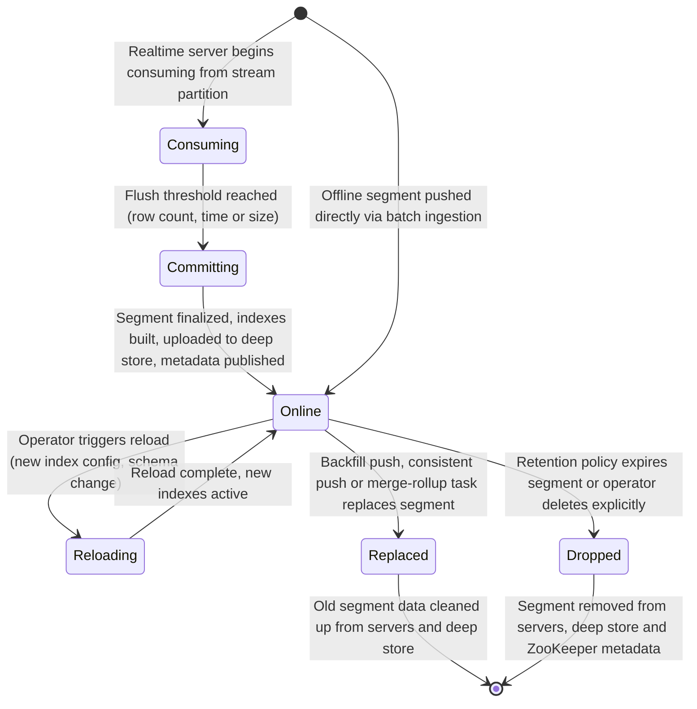
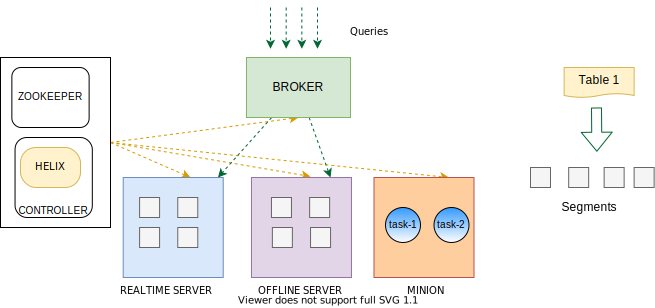

# 3. Storage Model: Segments, Tenants and Clusters

## Why This Chapter Is Where Performance Lives

> [!IMPORTANT]
> Pinot's performance story starts and ends with **segments**. Not with query syntax, not with index types, not with cluster sizing but with the fundamental unit of data storage and retrieval that underpins everything else.

Every query latency number you measure, every scaling decision you make and every operational procedure you follow is shaped by how your data is divided into segments, how those segments are sized and distributed and how the cluster manages them over time.

### The Cost of Misunderstanding Segments

This is not an exaggeration. The difference between a failing deployment and a highly scalable one comes down to this core concept. Teams that misunderstand segments struggle with mysterious performance cliffs, unexplainable latency variance and operational fragility. Teams that understand segments deeply build systems that are predictable, efficient and resilient.

### What This Chapter Covers

In this chapter, we will examine the data lifecycle from top to bottom.

1. **Physical and Logical Anatomy:** What segments actually are under the hood.
2. **The Segment Lifecycle:** How they move from creation to deletion.
3. **Optimal Sizing:** How to size segments for maximum query performance.
4. **Topology and Tenants:** How Pinot's tenant and cluster topology features let you organize large scale deployments without chaos.
5. **The Deep Store:** The storage layer that provides the durability guarantee, making the entire system recoverable.

> **The Bottom Line:** If the previous chapter taught you how the components fit together, this chapter teaches you exactly how the data fits into those components.

## What Is a Segment
A segment is Pinot's fundamental unit of data storage, distribution and query processing. **Everything in Pinot revolves around segments.**

> [!TIP]
> **The Book Analogy**
> Think of a segment as a page in a book that comes with its own index tab. A Pinot table is the entire book and its data is divided into pages (segments). Each page contains a self-contained set of rows stored in columnar format. And each page carries its own index tab at the edge, allowing the reader (the query engine) to quickly determine whether this page contains relevant content without reading every word.

This analogy captures several important properties. Each segment is self-contained: it holds not just the data, but also the column dictionaries, forward indexes, inverted indexes and metadata needed to query it independently, so you can take a single segment file, copy it to another server and query it in isolation. Once completed, a segment is immutable. Like a printed page it does not change and new data goes into new segments. This immutability eliminates row level locks, write ahead logs for mutations and complex concurrency control for reads. Indexes are constructed individually per segment, so rebuilding an index requires reprocessing only the affected segment rather than the entire table. Finally, each segment is assigned to one or more servers for hosting, with the assignment tracked in ZooKeeper so that brokers can route queries to the right servers.

### The Physical Level

At the physical level, a segment is a directory on disk (or a single `tar.gz` file in the deep store).

It contains

|  Component | Storage Format | Primary Function | Performance Impact |
| :--- | :--- | :--- | :--- |
| **Column Data Files** | Columnar (Dictionary or Raw) | Stores the actual attribute values for every row. | Enables high compression and **projection pushdown** (reading only needed columns). |
| **Index Files** | Inverted, Range, Text, JSON etc. | Maps values to specific row IDs (DocIDs). | Drastically reduces the number of rows scanned during the **Gather** phase. |
| **Metadata Files** | FlatBuffer / JSON | Stores segment stats (Min/Max, Row Count, CRC). | Used by the **Broker** for pruning segments before the query even hits a server. |
| **Star Tree Index** | Pre aggregated Tree | Stores partial aggregations for specific dimensions. | Provides **O(log N)** performance for complex aggregations, bypassing raw data scans. |

### Segment Metadata

Each segment carries metadata that plays a critical role in query optimization. This metadata is stored both within the segment itself and in ZooKeeper, allowing brokers to perform pruning decisions without ever touching the actual segment data on servers.

| Metadata Property | How It Is Used |
| :--- | :--- |
| **Time range** | The minimum and maximum values of the time column. Brokers use this for time based segment pruning. |
| **Row count** | The number of rows in the segment. Used for cardinality estimation and query planning. |
| **Column min/max values** | Per column statistics that enable range based segment pruning. |
| **Partition information** | If the table is partitioned, the segment records which partition it belongs to. |
| **CRC and creation time** | Used for consistency validation and segment replacement logic. |

## Segment Lifecycle

Segments are not static objects that appear and remain unchanged forever. They move through a well defined lifecycle, with transitions triggered by ingestion events, operational actions and automated policies.




*Source: [Apache Pinot Documentation](https://docs.pinot.apache.org/basics/components)*

### The Consuming State

This state applies exclusively to **realtime tables**. When a Pinot server is assigned to consume from a stream partition (e.g., a Kafka topic partition), it creates a consuming segment. A consuming segment is a mutable, in memory data structure that actively receives new rows as they arrive from the stream.

The most powerful property of consuming segments is that they are **immediately queryable**. There is zero delay between data arriving in the stream and that data being available for queries. The consuming segment serves as a real time buffer that participates fully in query execution.

> [!WARNING]
> **Performance Trade offs**
> While immediately queryable, consuming segments have different performance characteristics than completed, immutable segments. They are held in JVM heap memory rather than off heap `mmap`, their indexes may be less optimized (certain advanced index types are not available for mutable segments) and their memory footprint is much harder to predict because it directly depends on the stream's data arrival rate.

### The Committing State

When a consuming segment reaches its configured flush threshold, the server initiates the commit process. The flush threshold can be based on row count (commit after accumulating N rows), time duration (commit after consuming for N hours) or data size (commit when the segment's estimated size reaches a threshold).

During the commit process, the server executes the following sequence.

1. Stops writing new rows to the current consuming segment.
2. Converts the in memory data into Pinot's immutable columnar format.
3. Builds all configured indexes (inverted, sorted, range, text, etc.).
4. Writes the completed segment to local disk.
5. Uploads the segment to the deep store for durability.
6. Notifies the controller, which updates ZooKeeper metadata.
7. Creates a new consuming segment for continued stream consumption.

> [!NOTE]
> The commit process is CPU intensive and I/O intensive. During this time, the old consuming segment continues to serve queries, ensuring there is absolutely no query availability gap.

### The Online State

An `ONLINE` segment is a completed, immutable, fully indexed segment that is actively loaded on one or more servers and available for queries. This is the steady state for the vast majority of segments in a Pinot cluster.

Online segments are loaded using memory mapped files (`mmap`) by default. This means the operating system manages physical memory allocation through the page cache. Frequently queried segments stay resident in memory, while cold segments are safely paged out and read from disk on demand.

### The Reloading State

When an operator adds a new index to the table configuration (for example, adding an inverted index on a new column) and triggers a reload, each server reprocesses its segments to build the new indexes. The operation is performed segment by segment on each server and causes zero downtime: the existing segment continues serving queries until the new version is ready. A reload can be resource intensive for tables with many segments or segments with many columns and it can be targeted to a single segment, all segments of a table or all tables on the server.

### The Replaced State
Segments can be replaced through several mechanisms without disrupting query traffic.

A batch job can push new segments that cover the same time range as existing segments and Pinot atomically swaps the old segments for the new ones. Minion tasks can combine multiple small segments into fewer, larger segments, automatically replacing the originals. When historical data is corrected or enriched, new segments replace the previous version through a backfill operation.

> [!TIP]
> Segment replacement is an **atomic operation** at the metadata level. The routing table switches from old segments to new segments in a single update, guaranteeing that queries never see a mix of old and new data for the same time range.

### The Dropped State

Segments reach the end of their lifecycle and are dropped when retention policies expire them (if a table is configured with a retention period such as 30 days, segments whose time ranges fall entirely outside that window are automatically deleted) or when an operator explicitly deletes them through the Admin API or the Pinot UI.

Dropped segments are permanently removed from the servers, from the deep store and from all ZooKeeper metadata.

## Realtime Segments vs. Offline Segments

Pinot supports two distinct types of tables and each produces segments with different characteristics.

| Characteristic | Realtime Segments | Offline Segments |
|---------------|-------------------|------------------|
| **Data source** | Streaming systems (Kafka, Kinesis, Pulsar) | Batch jobs (Hadoop, Spark, file push) |
| **Mutability** | Consuming segments are mutable until committed | Always immutable |
| **Queryability** | Immediately queryable, even while consuming | Available after push and segment assignment |
| **Creation process** | Built on servers from stream data | Built externally or by Minion and then pushed |
| **Index optimization** | Indexes built at commit time with limited optimization | Indexes built during creation with full optimization (e.g. sorted columns) |
| **Memory profile** | Consuming segments use JVM heap memory | Loaded via mmap, use OS page cache |
| **Size predictability** | Depends on flush thresholds and data arrival rate | Fully controlled by the batch job |
| **Typical use case** | Hot, recent data with low latency requirements | Historical data, backfills, dimension tables |

> [!TIP]
> Understanding the difference between realtime and offline segments is foundational to choosing the right table type for your use case.

### When to Use Each

The right table type depends on your data source, freshness requirements and operational constraints. The table below provides a structured comparison.

| Criterion | Realtime Table | Offline Table | Hybrid Table |
| :--- | :--- | :--- | :--- |
| **Data source** | Streaming platform (Kafka, Kinesis, Pulsar) | Batch job (ETL, data warehouse export, file push) | Both streaming and batch |
| **Freshness requirement** | Seconds after arrival | After batch push completes | Seconds for recent data; optimized storage for historical |
| **Segment size control** | Controlled via flush thresholds | Fully controlled by the batch job | Mixed: streaming thresholds for recent, batch control for history |
| **Index optimization** | Indexes built at commit with limited options | Full optimization available (sorted columns, star tree, etc.) | Full optimization applies to the offline portion |
| **Primary use cases** | Dashboards, alerting, operational analytics | Historical data, dimension tables, lookup tables, backfills | Production analytics systems needing both real time and historical depth |
| **Additional consideration** | Choose when data must be queryable within seconds | Choose when you need full control over segment sizing and sorting | Choose when running a RealtimeToOfflineSegmentsTask to auto-convert recent segments |

## Segment Sizing Strategy

Segment sizing is one of the most impactful decisions you make when configuring a Pinot table. Segments that are too small create overhead. Segments that are too large create operational risks. Finding the right balance requires understanding the trade offs.

### Ideal Segment Size

The general guidance for segment sizing targets a row count of 100,000 to 5,000,000 rows per segment, providing a good balance between metadata overhead, query parallelism and operational manageability. The exact number depends on the width of your schema, since more columns per row means fewer rows per segment for the same byte size. In terms of uncompressed on-disk byte size, the target range is 100MB to 500MB per segment, ensuring segments are large enough to amortize metadata costs but small enough to reload, replace and recover quickly.

These are starting guidelines, not absolute rules. The optimal segment size depends on your specific schema, query patterns and operational requirements.

### The Impact of Too Small Segments

When segments are too small (e.g. under 10,000 rows or a few megabytes), several problems compound.

Every segment has metadata in ZooKeeper, so thousands or millions of tiny segments create significant metadata management overhead, slowing down ZooKeeper and increasing memory usage on controllers and brokers. Brokers must evaluate each segment for pruning and construct routing plans. More segments mean more routing computation per query, even if most segments are pruned. If many small segments end up on the same server, the server must open, scan and merge results from many segment files instead of a few large ones, increasing per query overhead. Each loaded segment requires open file handles and thousands of tiny segments can exhaust OS file descriptor limits. Each segment is also a separate object in the deep store (e.g. S3 or GCS) and millions of tiny objects create storage management overhead.

> [!WARNING]
> Low volume realtime tables with aggressive row count thresholds can produce thousands of segments per day, each containing only a few hundred rows. Always validate that your flush thresholds produce reasonably sized segments under your actual data arrival rate.

### The Impact of Too Large Segments

When segments are too large (e.g., over 10 million rows or multiple gigabytes), different problems emerge.

If a server fails and its segments need to be loaded onto a replacement server, large segments take longer to download from the deep store and load into memory. Adding an index and triggering a reload on a very large segment is slow and resource intensive, making index experimentation painful. Moving large segments between servers during a rebalance takes longer and consumes more network bandwidth. A single very large segment, when loaded via `mmap`, can consume a significant portion of the OS page cache, potentially evicting other segments. For realtime tables, if a consuming segment is configured to accumulate too many rows before flushing, the commit process takes longer, creating resource spikes.

### Flush Threshold Tuning

For realtime tables, the flush threshold controls when consuming segments are committed and new ones are started. There are two primary tuning approaches:

**Row-count-based flushing** (`realtime.segment.flush.threshold.rows`):

```json
{
  "streamConfigs": {
    "realtime.segment.flush.threshold.rows": "500000"
  }
}
```

This is straightforward to reason about. Each segment will contain approximately the specified number of rows. The resulting segment byte size depends on the schema width and data characteristics.

**Time-based flushing** (`realtime.segment.flush.threshold.time`):

```json
{
  "streamConfigs": {
    "realtime.segment.flush.threshold.time": "6h"
  }
}
```

This commits segments based on elapsed time since the consuming segment was created. The resulting segment row count depends on the data arrival rate. This approach produces consistent time ranges per segment, which is advantageous for time based segment pruning.

**Auto-tuned flushing** (`realtime.segment.flush.threshold.segment.size`):

```json
{
  "streamConfigs": {
    "realtime.segment.flush.threshold.segment.size": "200M"
  }
}
```

Pinot can auto tune the row count threshold based on a target segment size. It estimates the size of the current consuming segment and adjusts the flush threshold dynamically. This is the most hands off approach and works well when data arrival rates and schema characteristics are relatively stable.

> [!IMPORTANT]
> Start with auto tuned flushing targeting 200MB to 300MB segments. Monitor the actual segment sizes produced and adjust if needed. If your data arrival rate is highly variable (bursty traffic), consider combining a row count threshold with a time based maximum to prevent segments from growing too large during bursts or committing too quickly during lulls.

## Tenants and Resource Isolation

In a multi team or multi workload Pinot cluster, not every table should be treated identically. Some tables power customer facing dashboards with strict latency SLAs, while others serve internal analytics with relaxed requirements. Some tables are enormous, while others are small lookup tables.

**Tenants** are Pinot's mechanism for expressing resource isolation and placement boundaries. A tenant is a named label that you assign to servers and brokers and then reference in table configurations. When a table is assigned to a tenant, its segments are only placed on servers tagged with that tenant name and its queries are only routed through brokers tagged with that tenant name.

> [!WARNING]
> **Placement vs. Hard Isolation**
> Tenants do not provide hard resource isolation (there is no CPU or memory capping per tenant). Instead, they provide **placement isolation**, the ability to ensure that different workloads run on completely different physical machines.

## Broker Tenants vs Server Tenants

Pinot has two distinct types of tenants that operate independently:

| Type | Responsibility | Behavior |
| :--- | :--- | :--- |
| **Server Tenants** | Controls **segment hosting** | When you assign a table to server tenant `analytics_team`, its segments will *only* be placed on servers tagged with the `analytics_team` tenant. |
| **Broker Tenants** | Controls **query routing** | When you assign a table to broker tenant `analytics_team`, queries for that table will *only* be accepted by brokers tagged with the `analytics_team` tenant. |

> [!NOTE]
> By default, all servers and brokers belong to the `DefaultTenant`. For simple deployments, this is fine. For production clusters serving multiple teams or distinct workloads, explicit tenant assignments are essential.

### Multi-Team Cluster Patterns

A common production pattern is to run a single Pinot cluster with multiple tenant pools:

```
Cluster: production-analytics
├── Server Tenant: "team_payments"      (8 servers, high memory)
│   ├── Table: payment_transactions
│   └── Table: payment_settlements
├── Server Tenant: "team_marketplace"   (12 servers, balanced)
│   ├── Table: listing_events
│   ├── Table: search_clicks
│   └── Table: user_sessions
├── Server Tenant: "shared_dimensions"  (4 servers, small)
│   ├── Table: merchants_dim
│   └── Table: regions_dim
├── Broker Tenant: "team_payments"      (3 brokers)
├── Broker Tenant: "team_marketplace"   (4 brokers)
└── Broker Tenant: "shared"            (2 brokers, serving dimension tables)
```

This pattern provides several benefits. Workload isolation means a runaway query on the marketplace tables cannot consume resources that the payments tables need. Independent scaling allows the payments team to add servers to their tenant pool without affecting other teams. Different hardware profiles allow the payments tenant to use high-memory instances optimized for their large, heavily indexed tables, while the dimensions tenant uses smaller instances. Blast radius containment ensures that a bad deployment or data issue in one tenant's tables does not destabilize other tenants.

### When to Use Separate Clusters vs. Tenants

| Factor | Use Tenants (Same Cluster) | Use Separate Clusters |
|--------|---------------------------|----------------------|
| **Operational overhead** | Lower: shared controllers, shared ZooKeeper | Higher: separate infrastructure per cluster |
| **Isolation strength** | Placement isolation only. Shared ZooKeeper and controllers. | Full isolation. Independent failure domains. |
| **Upgrade coordination** | All tenants upgrade together. | Each cluster upgrades independently. |
| **Cross-table queries** | Possible within the same cluster. | Requires federated query layer. |
| **Compliance requirements** | May not satisfy strict data isolation requirements. | Stronger isolation for regulatory compliance. |
| **Team autonomy** | Limited. Teams share cluster-level configurations. | Full. Each team controls their cluster. |

> [!IMPORTANT]
> Use tenants within a single cluster when teams trust each other and share operational practices. Use separate clusters when teams have different upgrade cadences, compliance requirements or when you need hard failure isolation between workloads.


## Cluster Topology Patterns

### Single Cluster for Development

For development and testing, a minimal single-cluster topology is appropriate.

```
Development Cluster
├── 1 Controller
├── 1 Broker
├── 1 Server
├── 1 ZooKeeper node
└── All tables on DefaultTenant
```

This is what we get from docker compose or a local Pinot quickstart. It is sufficient for schema design, query development and basic functional testing. It is not representative of production behavior for performance testing or failure mode exploration.

### Multi Tenant Production Cluster

For production workloads serving multiple teams:

```
Production Cluster
├── 3 Controllers (behind load balancer)
├── 6-12 Brokers (partitioned by tenant, behind load balancers)
├── 20-100+ Servers (partitioned by tenant)
├── 3 or 5 ZooKeeper nodes (dedicated ensemble)
├── 2-4 Minions (for background tasks)
└── Multiple tenants with explicit placement
```

This topology provides high availability (multi controller, multi broker), workload isolation (tenants) and operational flexibility (dedicated Minions for maintenance).

### Dedicated Clusters by Criticality

For organizations with mixed criticality workloads.

```
Tier 1: Customer Facing Cluster
├── Strict SLAs, dedicated hardware, conservative upgrade policy
├── Tables powering real time dashboards, alerting and customer APIs
└── Independent ZooKeeper ensemble

Tier 2: Internal Analytics Cluster
├── Relaxed SLAs, shared hardware, faster upgrade cadence
├── Tables powering internal reporting, data exploration
└── Independent ZooKeeper ensemble

Tier 3: Experimental/Staging Cluster
├── No SLAs, minimal hardware, latest Pinot version
├── Tables for testing new schemas, indexes and features
└── Independent ZooKeeper ensemble
```

This pattern maximizes isolation between workloads of different criticality. The tradeoff is higher operational overhead. Three clusters means three sets of infrastructure to manage, monitor and upgrade.

## Deep Store

Deep store is Pinot's durable, persistent storage layer for completed segments. When a segment is committed (from a realtime table) or pushed (from a batch job), it is uploaded to the deep store. The deep store acts as the ultimate system of record for your segment data.

Common deep store implementations include Amazon S3 (most common in cloud deployments), Google Cloud Storage, Azure Blob Storage (ADLS), HDFS (common in on-premises Hadoop deployments), NFS (shared network filesystem) and local filesystem (for development and testing only).

### The Role of Deep Store in Durability and Recovery

Deep store serves three critical functions in a production cluster.

1. **Durability:** Segments on Pinot servers are loaded from the deep store and can be reconstructed from it at any time. If a server's local disk fails, no data is permanently lost because the segments can be redownloaded. Without the deep store, server disk failures would mean permanent data loss.
2. **Recovery:** When a new server joins the cluster (or an existing server restarts), it downloads its assigned segments directly from the deep store. Server recovery does not depend on copying data from other servers. It depends entirely on the availability and throughput of the deep store.
3. **Segment Replacement:** When new segments are pushed (through batch ingestion or Minion tasks), they are first uploaded to the deep store and then assigned to servers. The deep store acts as the central staging area for all segment lifecycle transitions.

> [!WARNING]
> If the deep store becomes unavailable, new segments cannot be committed, servers cannot recover and backfill operations will fail. We must monitor deep store availability and latency as critical infrastructure metrics.

### Sizing and Performance Considerations

When planning your deep store deployment, keep these operational realities in mind. Capacity must be sufficient to hold all segments for all tables across their full configured retention periods. Read throughput directly affects server startup and recovery time. If the deep store is slow (e.g., a throttled or heavily loaded S3 bucket), server recovery takes significantly longer. Write throughput affects realtime segment commit latency. Slow deep store uploads delay the commit process and can cause consuming segments to grow larger than desired in memory. Storing petabytes of segment data in cloud storage has nontrivial storage and API retrieval costs, making table retention policies the primary tool for controlling deep store growth.


## Operating Heuristics

These rules of thumb will help you manage your storage model effectively as your cluster scales.

Focus on the number of segments scanned per important query, not cosmetic elegance in your segment layout. The `BrokerResponse`'s `numSegmentsQueried` versus `numSegmentsProcessed` fields tell you exactly whether your pruning is effective. If you can explain why your segments are the size they are and why their time ranges look the way they do, you are in good shape. If sizes vary wildly without explanation, you have tuning debt. Treat tenant design and placement as first class architectural decisions made at the start of the project, because retrofitting tenants onto an existing cluster is significantly harder than designing them in from the beginning.

Monitor deep store latency alongside your core Pinot metrics, since slow deep store operations are a hidden cause of long commit times, slow recovery and delayed segment replacement. Periodically audit your segment count per table, because a table with 100,000 tiny segments is a red flag that should be addressed with merge rollup tasks or flush threshold adjustments. When in doubt about segment sizing, start with the auto tuned flush threshold targeting 200MB segments and adjust based on observed behavior.

## Common Pitfalls

Avoid these common storage and configuration mistakes when operating your cluster.

**Producing pathological numbers of tiny segments** is the single most common storage model mistake. Low volume realtime tables with aggressive row count thresholds can produce thousands of segments per day, each containing only a few hundred rows. Always validate that your flush thresholds produce reasonably sized segments under your actual data arrival rate.

**Assuming all tables deserve the same placement policy** leads to resource contention. A 10GB dimension table and a 10TB fact table have very different resource requirements and placing them on the same servers without thought creates problems under load.

**Treating segment reload and replacement as rare events** produces brittle operational processes. In a well operated Pinot cluster, reloads happen regularly (adding indexes, schema evolution) and replacements happen frequently (merge rollup, backfills). Design operational processes and capacity plans assuming these operations happen routinely, not exceptionally.

**Ignoring deep store health** creates silent risk. If the deep store becomes unavailable, new segments cannot be committed, servers cannot recover and backfill operations fail. Monitor deep store availability and latency as critical infrastructure metrics.

**Over engineering tenant boundaries** defeats the purpose of tenants. Creating dozens of micro tenants with one or two servers each provides no meaningful isolation benefit. Tenants should map to meaningful workload boundaries, not to individual tables.

**Forgetting that consuming segments use heap memory** leads to capacity planning failures. A realtime table with many partitions on a single server creates many consuming segments, each actively using heap memory. Under provisioning the JVM heap for realtime servers results in `OutOfMemoryError` during high ingestion volume.


## Practice Prompts

Test your understanding of Apache Pinot's segment architecture, storage models and cluster topology with these real world operational scenarios.

### 1. The Small Segments Problem
**The Scenario:** A Pinot table has 50,000 segments, each containing approximately 200 rows.
**The Task:** Describe three specific problems this situation causes for the cluster and propose a concrete remediation plan.

### 2. Translating to RDBMS Concepts
**The Scenario:** You need to explain Pinot's underlying storage mechanics to a colleague who has only ever worked with traditional relational databases (like PostgreSQL or MySQL).
**The Task:** Explain the difference between a consuming segment and an online segment. What specific analogies would you use to help them bridge the conceptual gap?

### 3. Multi Tenant Cluster Design

**The Scenario:** Your organization has three teams that want to use a shared Pinot cluster. Team A runs a customer facing dashboard with P99 latency SLAs of 100ms. Team B runs ad hoc exploratory analytics. Team C loads a large dimension table that all teams need to access.
**The Task:** Design a tenant strategy for this cluster. Explain your reasoning for how you would isolate (or share) brokers and servers across these workloads.

### 4. Realtime Ingestion Math
**The Scenario:** A realtime table is configured with `realtime.segment.flush.threshold.rows: 100` (one hundred rows). The table receives approximately 1 million events per day.
**The Task:** Calculate the approximate number of segments created per day. Explain exactly why this volume of daily segment creation is highly problematic for the cluster.

### 5. Infrastructure Failure Analysis
**The Scenario:** Your cloud provider has an outage and your deep store (e.g., S3 or GCS) becomes temporarily unavailable.
**The Task:** Map out the blast radius. What query and ingestion operations continue to work normally? What administrative operations are blocked? Finally, what is the recovery procedure once the deep store comes back online?

## Suggested Labs

* [Lab 4: Index Tuning and Segment Pruning](../labs/lab-04-index-tuning.md) Practice analyzing segment metadata and measuring the impact of pruning on query performance.

## Repository Artifacts

The following files in this repository are directly relevant to the concepts discussed in this chapter:

* [`docker-compose.yml`](docker-compose.yml) defines the complete local Pinot cluster including controllers, brokers, servers and ZooKeeper.
* [`schemas/trip_events.schema.json`](schemas/trip_events.schema.json) and [`schemas/trip_state.schema.json`](schemas/trip_state.schema.json) demonstrate schema definitions that reference time columns for segment pruning.
* [`tables/trip_events_rt.table.json`](tables/trip_events_rt.table.json) and [`tables/trip_state_rt.table.json`](tables/trip_state_rt.table.json) show table configurations with tenant assignments and retention settings.
* [`tables/merchants_dim_offline.table.json`](tables/merchants_dim_offline.table.json) provides an example of an offline table config with sorted column and star-tree indexing.
* [`labs/lab-04-index-tuning.md`](labs/lab-04-index-tuning.md) provides hands-on experience with segment pruning and index tuning.

## Further Reading and Resources

* [Official Segment Documentation](https://docs.pinot.apache.org/basics/data-import/segment) provides the canonical reference for Pinot's segment format, creation and push mechanisms.
* [Understanding Pinot Segments (YouTube)](https://www.youtube.com/watch?v=T70jnJzS2Ks) offers a visual walkthrough of segment internals, lifecycle transitions and sizing considerations.
* [Understanding Apache Pinot Segments (StarTree Blog)](https://startree.ai/blog/understanding-apache-pinot-segments) provides a detailed written exploration of segment architecture, storage format and optimization strategies.

*Previous chapter: [2. Architecture and Components](./02-architecture-and-components.md)*
<br>
*Next chapter: [4. Schema Design and Data Modeling](./04-schema-design-and-data-modeling.md)*
