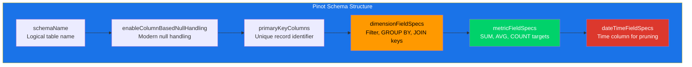
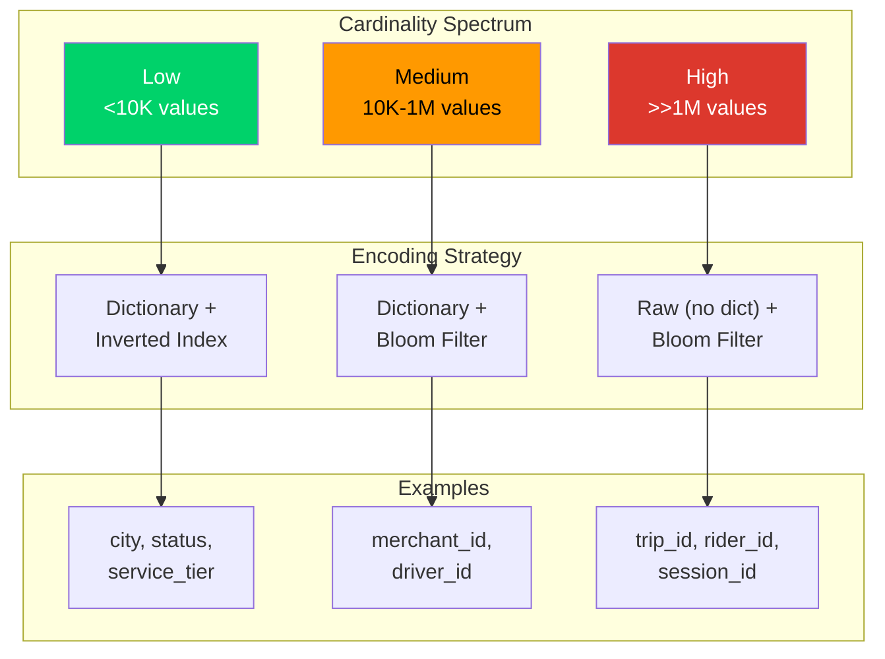

# 4. Schema Design and Data Modeling

## The Most Impactful Decision

Of all the choices you face when building on Apache Pinot, the schema is the one that matters most. More than indexes. More than hardware provisioning. More than cluster topology. The schema determines what questions your system can answer, how fast it can answer them and what operational tradeoffs you inherit for the lifetime of the table.

> [!IMPORTANT]
> **This is not an exaggeration.** Indexes can be added and removed with a table reload. Hardware can be scaled up or down in minutes. Cluster topology can be adjusted with a rebalance. But a schema that was designed without understanding the query workload forces you into a corner where no amount of index tuning or hardware spending can compensate.

### The Cost of a Poorly Designed Schema

If you get the schema wrong, you will inevitably face cascading performance and operational issues. Wasted compute forces you to write expensive query-time transforms that should have been precomputed. Scan inefficiencies emerge when your most common filter column was omitted from the schema entirely and must be extracted from a JSON blob on every scan. Pruning failures appear when your time column is stored at the wrong granularity, completely defeating segment pruning on every query.

### The Schema as an Active Contract

The schema is not a passive description of your data. It is an **active contract** between your data producers and your query consumers. It explicitly declares what fields exist, how they are categorized, how time is represented, what can be aggregated and what constitutes a unique record.

Every other Pinot configuration, from indexes to table configs to ingestion pipelines, builds strictly on the foundation the schema provides.

### What This Chapter Covers

By the end of this chapter, you will learn how to:

1. Design schemas that serve your queries efficiently.
2. Think about field categorization and underlying data types.
3. Leverage precomputed helper columns to drastically reduce query-time overhead.
4. Handle primary keys and state modeling for mutable workloads.
5. Evolve schemas over time without breaking production environments.

## Anatomy of a Pinot Schema

A Pinot schema is a JSON document that defines the structure of a table. It is not a DDL statement. It is not a protobuf definition. It is a flat JSON object with a small number of top level keys, each carrying specific semantic meaning that Pinot uses during ingestion, storage, indexing and query execution.



Here is the complete annotated schema from this repository's `trip_state` table, with explanations for every section.

```json
{
  // The schema name. Must match the "schemaName" in the table config.
  // This is the link between the logical schema and the physical table.
  "schemaName": "trip_state",

  // Enables modern null handling where each nullable column gets a null
  // bitmap, allowing Pinot to distinguish between "field is null" and
  // "field has its default value." Without this, nulls are silently
  // replaced with default values (0 for numbers, "" for strings).
  "enableColumnBasedNullHandling": true,

  // Primary key columns. Only used for upsert (and dedup) tables.
  // This tells Pinot which columns uniquely identify a record so that
  // newer records can replace older ones for the same key.
  "primaryKeyColumns": [
    "trip_id"
  ],

  // Dimension fields: categorical, identifier and descriptive columns
  // used for filtering (WHERE), grouping (GROUP BY) and joining.
  "dimensionFieldSpecs": [
    { "name": "trip_id",                    "dataType": "STRING"  },
    { "name": "merchant_id",                "dataType": "STRING"  },
    { "name": "merchant_name",              "dataType": "STRING"  },
    { "name": "driver_id",                  "dataType": "STRING"  },
    { "name": "rider_id",                   "dataType": "STRING"  },
    { "name": "city",                       "dataType": "STRING"  },
    { "name": "service_tier",               "dataType": "STRING"  },
    { "name": "status",                     "dataType": "STRING"  },
    { "name": "payment_method",             "dataType": "STRING"  },
    { "name": "last_event_type",            "dataType": "STRING"  },
    { "name": "last_event_day",             "dataType": "STRING"  },
    { "name": "last_event_hour",            "dataType": "INT"     },
    { "name": "last_event_minute_bucket_ms","dataType": "LONG"    },
    { "name": "trip_partition",             "dataType": "INT"     },
    { "name": "event_version",              "dataType": "INT"     },
    { "name": "is_deleted",                 "dataType": "BOOLEAN" }
  ],

  // Metric fields: numeric columns intended for aggregation.
  // Pinot treats these differently during star tree construction and
  // certain query optimizations. SUM, AVG, MIN, MAX, COUNT operate
  // most efficiently on metric columns.
  "metricFieldSpecs": [
    { "name": "fare_amount",      "dataType": "DOUBLE" },
    { "name": "distance_km",      "dataType": "DOUBLE" },
    { "name": "eta_seconds",      "dataType": "INT"    },
    { "name": "surge_multiplier", "dataType": "DOUBLE" }
  ],

  // DateTime fields: the time columns that Pinot uses for segment
  // pruning, retention enforcement and time series operations.
  // Every realtime table must have at least one dateTimeFieldSpec
  // that matches the timeColumnName in the table config.
  "dateTimeFieldSpecs": [
    {
      "name": "last_event_time_ms",
      "dataType": "LONG",
      "format": "1:MILLISECONDS:EPOCH",
      "granularity": "1:MILLISECONDS"
    }
  ],

  // Complex fields: JSON columns, map columns or other structured
  // types that do not fit neatly into the dimension/metric categories.
  "complexFieldSpecs": [
    {
      "name": "attributes",
      "dataType": "JSON"
    }
  ]
}
```

Every field in a Pinot schema must belong to exactly one of these four categories: dimension, metric, dateTime or complex. This is not optional metadata. It is a hard classification that affects how Pinot stores, indexes, aggregates and queries the column.

## Field Categories Deep Dive

### Dimensions

Dimensions are the columns you filter on, group by and join on. They represent the categorical, identifier and descriptive attributes of your data. In SQL terms, dimensions are the columns that appear in `WHERE` clauses and `GROUP BY` clauses far more often than they appear inside aggregate functions.

Dimension columns typically serve one of five roles: identifiers such as `trip_id`, `merchant_id`, `driver_id` and `rider_id`; categorical values such as `city`, `service_tier`, `status` and `payment_method`; descriptive labels such as `merchant_name`, `event_type` and `pickup_zone`; precomputed helper fields such as `event_day` and `event_hour`; and boolean flags such as `is_deleted` and `is_active`.

**Cardinality considerations**

Cardinality, the number of distinct values a column takes, is one of the most important properties of a dimension column. Pinot uses dictionary encoding by default for dimension columns, which means it builds a sorted dictionary of all unique values and stores integer indices instead of the raw values. This is extremely efficient for low cardinality columns (hundreds or thousands of distinct values) but becomes less efficient as cardinality grows into the millions.



| Cardinality Range | Examples | Recommended Strategy |
|---|---|---|
| Low (fewer than 10,000 distinct values) | `city`, `status`, `service_tier` | Dictionary encoding is highly effective. Inverted indexes are compact and fast. |
| Medium (10,000 to 1,000,000 distinct values) | `merchant_id`, `driver_id` | Dictionary encoding still works well. Bloom filters become more valuable than inverted indexes for point lookups. |
| High (more than 1,000,000 distinct values) | `trip_id`, `rider_id` | Consider `noDictionaryColumns` to avoid building massive dictionaries. Use bloom filters for point lookups instead of inverted indexes. |

> [!IMPORTANT]
> Do not add a dimension column just because it exists in the source event. Add it because it serves a query pattern. Every dimension column consumes storage, increases segment size and adds overhead during ingestion. If nobody filters or groups by a field, it does not belong in the schema as a dimension.

### Metrics

Metrics are numeric columns designed for aggregation. They are the columns that appear inside `SUM()`, `AVG()`, `MIN()`, `MAX()`, `COUNT()` and `PERCENTILE()` functions. Pinot treats metric columns differently from dimensions in several important ways.

**Why metrics are a distinct category**

Star tree optimization is the first consideration. When you configure a star tree index, Pinot pre-aggregates metric columns along dimension hierarchies, and only columns declared as metrics participate in these pre-aggregations. Default values behave differently as well: metric columns default to `0` (not null or empty string) when a value is missing during ingestion, because a missing fare amount should contribute zero to a sum rather than producing an error. Pinot can also apply specialized compression and encoding strategies to metric columns because it knows they are numeric and will be aggregated.

**Choosing the right numeric type**

| Type | Size | Use When |
|------|------|----------|
| `INT` | 4 bytes | Whole numbers with values up to ~2.1 billion (e.g., `eta_seconds`, `monthly_orders`) |
| `LONG` | 8 bytes | Large whole numbers or epoch timestamps (e.g., `event_minute_bucket_ms`) |
| `FLOAT` | 4 bytes | Decimal numbers where 7 digits of precision suffice |
| `DOUBLE` | 8 bytes | Decimal numbers requiring 15 digits of precision (e.g., `fare_amount`, `distance_km`) |

> [!WARNING]
> Declaring a field as a metric just because it is numeric is a common mistake. A `trip_partition` value is numeric, but it is used for filtering and routing, not aggregation. It belongs as a dimension. Conversely, a `fare_amount` is numeric and is routinely summed, averaged and compared. It belongs as a metric.

### DateTime Fields

DateTime fields are the time columns that Pinot uses for segment pruning, retention enforcement and time based query optimization. Every realtime table must have at least one `dateTimeFieldSpec` and the `timeColumnName` in the table config must reference it.

**The dateTimeFieldSpec structure**

```json
{
  "name": "last_event_time_ms",
  "dataType": "LONG",
  "format": "1:MILLISECONDS:EPOCH",
  "granularity": "1:MILLISECONDS"
}
```

Each property carries specific meaning. The `name` is the column name, matching the field in your incoming data. The `dataType` is the storage type: `LONG` for epoch based timestamps or `STRING` for human readable formats like `yyyy-MM-dd HH:mm:ss`. The `format` is a colon separated triple `<size>:<timeUnit>:<timeFormat>`, the value `1:MILLISECONDS:EPOCH` means "each value represents 1 millisecond since Unix epoch," while other common formats include `1:SECONDS:EPOCH`, `1:HOURS:EPOCH` and `1:DAYS:SIMPLE_DATE_FORMAT:yyyy-MM-dd`. The `granularity` is the precision at which Pinot stores the time value: setting `1:MILLISECONDS` preserves full millisecond precision, while setting `1:HOURS` would truncate values to hour boundaries.

**Timezone handling**

Pinot stores time values as raw numbers without timezone metadata. If your source system produces timestamps in UTC (which it should), Pinot stores them as received. If your application needs to display results in local timezones, perform the conversion at the application layer or in the query using Pinot's `DATETIMECONVERT` function. Do not store timezone adjusted timestamps in Pinot. Doing so makes time range queries unpredictable because the same wall clock hour maps to different epoch values depending on the timezone.

**Multiple dateTime fields**

A schema can have multiple `dateTimeFieldSpec` entries. This is useful when your data has multiple meaningful timestamps (e.g., `created_time_ms`, `updated_time_ms`, `completed_time_ms`). Only one of them is designated as the `timeColumnName` in the table config, and that one drives segment pruning and retention. The others are queryable but do not participate in segment level time operations.

### Complex Fields

Complex fields accommodate structured data types that do not fit into the dimension or metric categories. The most common complex field type is JSON, but Pinot also supports multi-value columns and map fields.

**JSON columns**

```json
{
  "name": "attributes",
  "dataType": "JSON"
}
```

JSON columns store arbitrary JSON objects and support path based filtering and extraction at query time using the `JSON_EXTRACT_SCALAR` function and JSON index.

```sql
SELECT trip_id, JSON_EXTRACT_SCALAR(attributes, '$.source', 'STRING', 'unknown')
FROM trip_events
WHERE JSON_MATCH(attributes, '"$.source" = ''simulator''')
```

JSON columns are the right choice when the field contains semi-structured data with varying keys across records, when the schema of the nested data evolves frequently and you do not want to change the Pinot schema every time, or when the field is queried occasionally for filtering or extraction but is not part of the primary query hot path.

JSON columns carry important trade-offs. They are stored as raw strings, consuming more storage than dictionary encoded dimensions. JSON index scans are slower than inverted index lookups on a first-class dimension column. JSON columns cannot participate in star tree pre-aggregation. If you find yourself querying the same JSON path in every request, extract it into a proper dimension column during ingestion.

**Multi value columns**

Pinot supports columns that contain arrays of values. A multi value column is declared as a dimension with the `singleValueField` property set to `false`.

```json
{
  "name": "tags",
  "dataType": "STRING",
  "singleValueField": false
}
```

Multi value columns are useful for representing tags, categories or other list-valued attributes. They support `IN` clauses and `MV_TO_JSON` conversions. However, they add complexity to aggregation queries and interact differently with certain index types. Use them when the array semantics are genuinely needed. Do not use them as a workaround for denormalization.

**Map fields**

Map fields store key-value pairs with homogeneous types. They are less commonly used than JSON columns but can be more efficient when the data truly fits a map structure (e.g., string to string lookups). In most practical scenarios, JSON columns offer more flexibility.

## Primary Keys and State Modeling

### When to Use primaryKeyColumns

The `primaryKeyColumns` field in a Pinot schema exists for one purpose: to enable upsert (and dedup) behavior. When you declare primary key columns, you are telling Pinot that incoming records with the same primary key value should replace (or update) the existing record rather than being appended as new rows.

This is a fundamental modeling decision that determines whether your table behaves as an **append only fact table** or a **latest state table**.

### Relationship Between Primary Keys and Upsert

Primary keys alone do nothing. They must be paired with an `upsertConfig` in the table config to have any effect. The primary key columns define what constitutes the same record, while the upsert config defines how conflicts are resolved (full replacement, partial update or comparison based ordering).

In this repository, the `trip_state` schema declares `trip_id` as its primary key.

```json
"primaryKeyColumns": ["trip_id"]
```

### The Upsert Mechanism in Action

When a new event arrives with `trip_id = "trip_000001"`, Pinot looks up the existing record for that key. If the new record has a higher `event_version` (as specified in the `comparisonColumns` of your table's upsert configuration), it replaces the old one. If the new record has an equal or lower version, it is considered stale and is discarded.

### Why Fact Tables Should NOT Have Primary Keys

The `trip_events` schema in this repository intentionally omits `primaryKeyColumns`. This is not an oversight. It is a deliberate design choice.

Fact tables record events exactly as they happen. Each event is an immutable observation: "trip_000001 was created at time T1," "trip_000001 was accepted at time T2," "trip_000001 was completed at time T3." These are separate records describing separate moments in time. They should not replace each other.

> [!CAUTION]
> **The Memory Cost of Unnecessary Primary Keys**
> Adding primary keys to a fact table forces Pinot to maintain an in memory hash map of all primary keys across all segments. For a high volume event stream producing millions or billions of events, this hash map consumes enormous amounts of JVM heap memory while providing absolutely no analytical benefit. Every event is already unique. There is nothing to upsert.

> [!IMPORTANT]
> The rule is simple. If your table answers "what happened?" it is a fact table and it should not have primary keys. If your table answers "what is the current state?" it is a state table and it needs primary keys paired with upsert.

### Composite Primary Keys

Some entities are not uniquely identified by a single column. For example, a per user per day aggregation table might use a composite key.

```json
"primaryKeyColumns": ["user_id", "event_day"]
```

When multiple columns are defined as the primary key, Pinot concatenates their values to form a **composite key** for the in memory hash map lookup. While composite keys work correctly for determining uniqueness, they inherently consume more memory per key entry than single column keys.

> [!WARNING]
> **Keep Primary Keys Minimal**<br>
> Keep the number of primary key columns small (two or three at most). Strictly avoid including high cardinality columns in the primary key definition unless they are absolutely necessary for establishing record uniqueness.

## The Power of Precomputed Helper Columns

### Why Precomputation Matters

One of the most impactful performance techniques in Pinot schema design is adding precomputed helper columns to your events before they enter Pinot. This is the practice of computing cheap, deterministic transformations at the producer or ingestion layer so that Pinot does not have to compute them at query time on every scan.

Consider this common query pattern:

```sql
SELECT city, COUNT(*)
FROM trip_events
WHERE DATETIMECONVERT(event_time_ms, '1:MILLISECONDS:EPOCH',
      '1:DAYS:SIMPLE_DATE_FORMAT:yyyy-MM-dd', '1:DAYS') = '2026-01-15'
GROUP BY city
```

This query filters trips by day. On every scan, Pinot must apply the `DATETIMECONVERT` function to every row's `event_time_ms` to extract the date string, then compare it against the filter value. For a table with billions of rows, this transform executes billions of times.

Now consider the equivalent query when `event_day` is precomputed:

```sql
SELECT city, COUNT(*)
FROM trip_events
WHERE event_day = '2026-01-15'
GROUP BY city
```

This query performs a simple string equality filter on a dictionary encoded dimension column with an inverted index. The cost difference is enormous. The inverted index resolves the matching document IDs in microseconds. No per row function evaluation occurs.

### Precomputed Columns in This Repository

The schemas in this repository include three precomputed helper columns that demonstrate this pattern:

| Column | Type | Derivation | Query Use Case |
|--------|------|-----------|----------------|
| `event_hour` / `last_event_hour` | `INT` | Hour of day (0 to 23) extracted from the epoch timestamp | Hour level filtering: `WHERE event_hour BETWEEN 8 AND 17` |
| `event_day` / `last_event_day` | `STRING` | `yyyy-MM-dd` extracted from the epoch timestamp | Day level filtering: `WHERE event_day = '2026-01-15'` |
| `event_minute_bucket_ms` / `last_event_minute_bucket_ms` | `LONG` | Epoch milliseconds truncated to a 5-minute boundary | Time series bucketing: `GROUP BY event_minute_bucket_ms ORDER BY event_minute_bucket_ms` |

These columns are computed by the data producer (in this repo, the Python simulator) before the event is published to Kafka. By the time Pinot receives the event, the helper columns are already populated and ready for indexing.

### Decision Framework | When to Precompute vs Compute at Query Time

Not every derived value should be precomputed. Use the following framework to decide.

| Criteria | Precompute | Compute at Query Time |
|----------|------------|----------------------|
| The transform appears in more than 50% of queries | Yes | No |
| The transform is deterministic and cheap to compute upstream | Yes | No |
| The transform is exploratory or adhoc | No | Yes |
| Adding the column significantly increases schema width and storage | Evaluate tradeoff | Default choice |
| The transform involves data from multiple columns (e.g., `fare / distance`) | Depends on frequency | Default choice |
| The transform changes over time (e.g., business logic evolves) | No, keep it flexible | Yes |

> [!TIP]
> If you are writing the same `DATETIMECONVERT`, `DATETRUNC` or arithmetic expression in more than a handful of queries, that expression has earned its own column in the schema.

---
## Null Handling

### The Problem with Default Null Behavior

By default, Pinot replaces incoming null values with type specific defaults during the ingestion phase. Numeric types receive `0` or `0.0` for doubles and floats. Strings receive an empty string `""`.

> [!WARNING]
> **The "Zero vs. Unknown" Dilemma**
> This default behavior means that if your producer sends a record where `fare_amount` is explicitly null (because the trip has not been completed yet, for example), Pinot will automatically store `0.0`. Once stored, you cannot distinguish between "the fare is genuinely zero" and "the fare is currently unknown."

### The Trade off | Performance vs Correctness

This default behavior was historically chosen to maximize query performance. Avoiding null tracking entirely eliminates the need for Pinot to maintain null bitmaps and drastically simplifies its internal aggregation logic.

However, while it is fast, for many modern production use cases, this default behavior produces mathematically incorrect analytical results when averaging, counting or filtering.

### enableColumnBasedNullHandling

The `enableColumnBasedNullHandling` flag, set at the schema level, enables proper null semantics.

```json
{
  "schemaName": "trip_state",
  "enableColumnBasedNullHandling": true
}
```

When enabled, Pinot maintains a null bitmap for each column in each segment. This bitmap records which rows have null values for that column. Queries that use `IS NULL` or `IS NOT NULL` predicates work correctly and aggregate functions like `SUM` and `AVG` exclude null values from their calculations (matching standard SQL semantics).

### Implications and Tradeoffs

Enabling `enableColumnBasedNullHandling` has three concrete implications. The storage overhead is that each nullable column requires a null bitmap per segment. For columns that are rarely null this overhead is minimal (the bitmap compresses well), and for columns that are frequently null the overhead is still small relative to the column data itself. The query behavior changes such that `COUNT(column)` excludes nulls while `COUNT(*)` includes them. This matches standard SQL but may differ from the behavior your team is accustomed to if you have been running without null handling. The migration consideration is that enabling `enableColumnBasedNullHandling` on an existing table does not retroactively fix segments that were built without it. Those older segments still have default values instead of nulls, and you must reload or rebuild segments for the change to take full effect.

> [!IMPORTANT]
> Enable `enableColumnBasedNullHandling` on all new schemas. The storage overhead is negligible and the correctness benefits are substantial. The schemas in this repository all have it enabled.

## Denormalization vs. Joins Decision Matrix

Pinot was originally designed as a single table analytics engine with no join support. The multi stage query engine (V2) now supports joins, but they come with performance and operational costs. The decision of whether to denormalize data into a single table or keep it normalized and join at query time is one of the most consequential schema design choices you will make.

| Factor | Denormalize Into One Table | Keep Separate and Join |
|--------|--------------------------|----------------------|
| **Query frequency** | The enrichment is needed on every query or most queries | The enrichment is needed rarely or for adhoc analysis only |
| **Update frequency** | The enrichment data rarely changes (e.g., city name, merchant category) | The enrichment data changes frequently and must always reflect the latest value |
| **Data volume** | The enrichment adds only a few columns and does not significantly increase row width | The enrichment would add many columns, most of which are unused in typical queries |
| **Latency requirements** | Sub-100ms P99 latency required | P99 latency of 500ms or more is acceptable |
| **Query engine version** | V1 (single stage) engine is in use | V2 (multi stage) engine is available and tested |
| **Consistency requirements** | Eventual consistency is acceptable (stale merchant name is tolerable) | Strong consistency is required (must always reflect the latest merchant metadata) |
| **Operational complexity** | The team prefers simpler table topology | The team can manage multiple tables, schemas and ingestion pipelines |

In this repository, the `trip_events` and `trip_state` schemas carry `merchant_name` as a denormalized dimension. This means queries that need merchant names do not require a join against `merchants_dim`. The tradeoff is that if a merchant changes its name, previously ingested events retain the old name. For analytical workloads, this is usually acceptable. For operational dashboards where the latest merchant name must always appear, a join against `merchants_dim` at query time would be more appropriate.

A hybrid pattern works well in practice: denormalize the fields you filter and group by constantly (e.g., `city`, `merchant_name`) and keep slowly changing or rarely accessed enrichment data in a separate dimension table for join based access. This gives you fast queries for the common case and flexibility for the uncommon case.

## Schema Evolution

Schemas are not static. As your application evolves, you will need to add new columns, change column types and occasionally remove columns. Pinot supports schema evolution, but with constraints that you must understand to avoid breaking production.

### Adding Columns

Adding a new column to a schema is the most common and safest evolution operation. The process is:

1. Update the schema JSON to include the new field.
2. Apply the schema update via the Pinot controller API (`PUT /schemas/{schemaName}`).
3. New segments (from ongoing ingestion) will include the new column.
4. Existing segments will return the column's default value (or null, if column based null handling is enabled) for the new column.
5. Optionally, reload existing segments to generate the new column's indexes.

No downtime is required. Queries that reference the new column will work immediately, returning default/null values for old segments and actual values for new segments.

### Changing Column Types

Changing a column's data type (e.g., from `INT` to `LONG` or from `STRING` to `INT`) is a more disruptive operation. Pinot does not support in place type changes on existing segments. The recommended approach is:

1. Add a new column with the desired type and a different name (e.g., `fare_amount_v2` with type `DOUBLE` to replace `fare_amount` with type `FLOAT`).
2. Update your ingestion pipeline to populate both the old and new columns during a transition period.
3. Migrate queries to use the new column.
4. Once all segments with the old column have aged out of retention, remove the old column from the schema.

This approach avoids any data inconsistency or query disruption.

### Removing Columns

Removing a column from the schema does not immediately delete the column data from existing segments. The column data remains in segments on disk until those segments are rebuilt or replaced. However, queries referencing the removed column will fail after the schema update.

> [!IMPORTANT]
> Before removing a column, audit all queries and dashboards that reference it. Remove query references first, then remove the column from the schema.

### Backward Compatibility Guidelines

| Change Type | Classification |
|---|---|
| Adding a new dimension, metric or dateTime column | Always backward compatible |
| Adding `enableColumnBasedNullHandling` | Always backward compatible |
| Adding a new complex field | Always backward compatible |
| Changing a column's data type | Requires migration |
| Changing a column from single value to multi value | Requires migration |
| Changing a column's category (dimension to metric or vice versa) | Requires migration |
| Removing a column referenced by queries, indexes or table config | Potentially breaking |
| Renaming the `schemaName` | Potentially breaking |
| Changing `primaryKeyColumns` on an active upsert table | Potentially breaking |

## Operating Heuristics

Design your schema as a **query serving contract**, not as a mirror of the source system. Include fields because they improve serving, not because they happen to exist upstream.

Precompute repetitive time buckets and lightweight derived fields. If a transform appears in more than half your queries, it deserves its own column. Classify fields carefully: dimensions are for filtering and grouping, metrics are for aggregation, and datetime fields are for time based pruning and retention. Getting the classification wrong does not cause errors, but it absolutely prevents optimizations.

Keep primary keys minimal. Every primary key column adds to the composite key size in the upsert hash map, so include only the columns strictly necessary for uniqueness. Enable `enableColumnBasedNullHandling` on every new schema, as the storage overhead is negligible and the correctness benefit is significant.

Maintain dual contracts. Keep both a human readable explanation and a machine readable contract (like JSON Schema) for your event payloads to prevent schema drift between producers and Pinot. Review cardinality estimates for every dimension column before adding it to the schema, because high cardinality dimensions that are never filtered or grouped on are pure waste.

## Common Pitfalls

> [!CAUTION]
> **Mirroring the source schema blindly** > Just because the upstream service has 50 fields does not mean your Pinot schema needs 50 columns. Every column you add increases segment size, ingestion cost and reload time.

Using only raw epoch timestamps when every query buckets by day or hour forces Pinot to apply a transform function on every row of every scan, so precompute the bucket instead. Declaring high cardinality identifiers as metrics (like a `trip_id`) prevents them from being used effectively in filters and produces nonsensical aggregation defaults.

Leaving key semantics ambiguous in an upsert table is dangerous. Every team member must explicitly understand which columns form the primary key, which column orders updates and what happens to out-of-order arrivals. Over-using JSON columns is a significant performance killer: JSON columns are flexible but slow, and if you find yourself writing `JSON_EXTRACT_SCALAR` in every query for the same path, extract that path into a proper dimension column.

Forgetting that schema changes do not retroactively fix old segments is a common operational mistake. Adding a new column or enabling null handling only affects new segments. Old segments must be actively reloaded or rebuilt. Adding multi value columns without understanding the query implications is equally hazardous. Multi value columns interact differently with `GROUP BY`, aggregation and certain index types, so test thoroughly before deploying to production.

## Practice Prompts

Test your understanding of schema design and optimization with these exercises:

1. **Schema Denormalization:** Examine the [`trip_events.schema.json`](schemas/trip_events.schema.json) and [`trip_state.schema.json`](schemas/trip_state.schema.json) files in this repository. Identify three fields that appear in both schemas and explain why denormalization is appropriate for those specific fields.
2. **Upsert Memory Implications:** Explain why `trip_events` should *not* have a primary key, even though every trip has a unique `trip_id`. What exact mechanism causes memory consumption to spike if you added one?

3. **Derived Helper Columns:** Name three additional precomputed helper columns you could add to the `trip_events` schema to accelerate common query patterns. For each, describe the derivation logic and the exact query it would optimize.
4. **The JSON Anti Pattern:** A colleague proposes storing all trip metadata in a single JSON column called `trip_data` instead of individual dimension columns. Write a technical argument for why this is a bad idea for a high throughput analytical workload.
5. **From Scratch Design:** Design a schema for a user session analytics table. Decide which fields should be dimensions, metrics and dateTime fields and strongly justify your choice for each.
6. **Evolving the Primary Key:** Your `trip_state` table currently uses `trip_id` as its sole primary key. A product requirement asks you to track per trip per city state (since a single trip can span multiple cities). How would you modify the schema and what are the downstream tradeoffs of this change?

## Suggested Labs
* [Lab 2: Schemas and Tables](../labs/lab-02-schemas-and-tables.md) Build and deploy the schemas from this chapter, verify field types and test null handling behavior.

## Repository Artifacts

The complete schemas used throughout this guide are available in the repository.

| File | Description |
|---|---|
| [`schemas/trip_events.schema.json`](schemas/trip_events.schema.json) | Append only fact table, no primary key |
| [`schemas/trip_state.schema.json`](schemas/trip_state.schema.json) | Latest state table with upsert, primary key on `trip_id` |
| [`schemas/merchants_dim.schema.json`](schemas/merchants_dim.schema.json) | Dimension table, primary key on `merchant_id` |
| [`contracts/jsonschema/trip-event.schema.json`](contracts/jsonschema/trip-event.schema.json) | JSON Schema contract for data producers |
| [`contracts/examples/trip-event.example.json`](contracts/examples/trip-event.example.json) | Example event payload |

## Further Reading and Resources

* [Official Schema Documentation](https://docs.pinot.apache.org/configuration-reference/schema) covers all supported field types, data types, format strings and schema-level configurations.
* [Schema Design Best Practices (YouTube)](https://www.youtube.com/watch?v=T70jnJzS2Ks) walks through real-world schema design decisions, common mistakes and optimization techniques.
* [Apache Pinot Schema Design (StarTree Blog)](https://startree.ai/blog/apache-pinot-schema-design) provides a detailed written exploration of schema design patterns, field categorization and evolution strategies.

*Previous chapter: [3. Storage Model: Segments, Tenants and Clusters](./03-storage-model-segments-tenants-clusters.md)*<br>
*Next chapter: [5. Table Config Deep Dive](./05-table-config-deep dive.md)*
