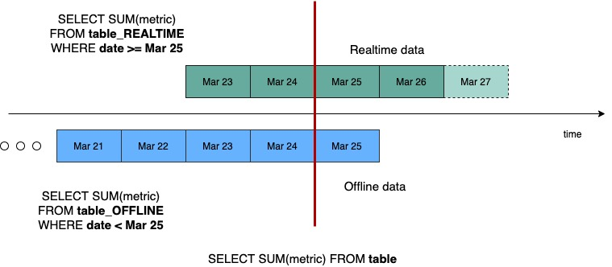

# 5. Table Config Deep Dive

## The Operating System of Your Pinot Table

If the schema defines **what** the data is, the table configuration defines **how** Pinot operates on it. Think of the table config as the **operating system of the table**.

It is the central command center that controls ingestion (how data enters the system from streams or batch sources), storage and indexing (how bits are laid out on disk and which search structures are built), query routing (how the broker decides which servers should handle a request), resource bounding (how quotas prevent a single table from cannibalizing the entire cluster) and maintenance (how background tasks like segment merging and retention are scheduled).

### A Living Artifact

This is not a file you write once and forget. The configuration that served well at 10 million rows may be wildly inappropriate at 10 billion. Similarly, a config tuned for batch lookback analytics may fail spectacularly when repurposed for high concurrency, real time operational dashboards.

> [!IMPORTANT]
> The table config must evolve alongside data volume, query patterns and operational requirements. Static configurations in a dynamic environment are a recipe for performance degradation.

### The Root of Production Incidents

Most Pinot production incidents trace back to specific misconfigurations in this file. Missing quotas allow a runaway query to saturate the entire cluster's CPU. Pathological segment sizing, a flush threshold that produces tens of thousands of tiny segments, chokes ZooKeeper and the Broker. Memory exhaustion follows from an upsert configuration that consumed all available JVM heap. Hotspotting emerges from a routing strategy that concentrated the entire load on a single server replica.

Understanding every section of the table config is not optional for anyone operating Pinot at scale. In this chapter, we will walk through every major section, explain the mechanics of each setting and identify the canary-in-the-coal-mine metrics that signal a misconfiguration.

## Anatomy of a Table Config

A Pinot table config is a JSON document with a well defined structure. Here is the complete annotated table config for the `trip_state` realtime table from this repository ([`tables/trip_state_rt.table.json`](tables/trip_state_rt.table.json)):

```json
{
  // The table name. This must match the schemaName in the schema
  // (or be prefixed with the schema name for OFFLINE/REALTIME suffixes).
  "tableName": "trip_state",

  // The table type: REALTIME, OFFLINE or both (hybrid).
  // REALTIME tables consume from streaming sources.
  // OFFLINE tables receive batch pushed segments.
  "tableType": "REALTIME",

  // Segment level configuration: time column, schema reference,
  // replication factor and retention policies.
  "segmentsConfig": {
    "timeColumnName": "last_event_time_ms",
    "schemaName": "trip_state",
    "replication": "1"
  },

  // Tenant assignment: which broker and server pools handle this table.
  "tenants": {
    "broker": "DefaultBroker",
    "server": "DefaultServer"
  },

  // Index configuration: controls storage format, index types,
  // and dictionary behavior at the table level.
  "tableIndexConfig": {
    "loadMode": "MMAP",
    "invertedIndexColumns": ["city", "service_tier", "status", "merchant_id"],
    "rangeIndexColumns": ["last_event_time_ms", "event_version", "fare_amount"],
    "bloomFilterColumns": ["trip_id"],
    "jsonIndexColumns": ["attributes"]
  },

  // Query routing strategy: how brokers select server replicas.
  "routing": {
    "instanceSelectorType": "strictReplicaGroup"
  },

  // Upsert configuration: controls how newer records replace older ones.
  "upsertConfig": {
    "mode": "FULL",
    "comparisonColumns": ["event_version"],
    "deleteRecordColumn": "is_deleted",
    "enableSnapshot": true,
    "enablePreload": false,
    "metadataTTL": 86400
  },

  // Query timeout and execution settings.
  "queryConfig": {
    "timeoutMs": 15000
  },

  // Resource quotas: bounds on query rate and storage consumption.
  "quota": {
    "maxQueriesPerSecond": "200",
    "storage": "20G"
  },

  // Ingestion configuration: stream source, transforms and error handling.
  "ingestionConfig": {
    "continueOnError": false,
    "streamIngestionConfig": {
      "streamConfigMaps": [
        {
          "streamType": "kafka",
          "stream.kafka.topic.name": "trip-state",
          "stream.kafka.broker.list": "kafka:19092",
          "stream.kafka.consumer.type": "lowlevel",
          "stream.kafka.consumer.factory.class.name":
            "org.apache.pinot.plugin.stream.kafka20.KafkaConsumerFactory",
          "stream.kafka.decoder.class.name":
            "org.apache.pinot.plugin.inputformat.json.JSONMessageDecoder",
          "stream.kafka.consumer.prop.auto.offset.reset": "smallest",
          "realtime.segment.flush.threshold.rows": "50000",
          "realtime.segment.flush.threshold.time": "1h"
        }
      ]
    }
  }
}
```

Every top level section is explored in detail below.

## segmentsConfig

The `segmentsConfig` section defines the fundamental relationship between the table, its schema and time. It is deceptively simple but carries enormous downstream consequences.

### timeColumnName

```json
"timeColumnName": "last_event_time_ms"
```

This is the column Pinot uses for three critical functions. Segment pruning uses segment level time metadata to skip segments that cannot contain matching rows when a query includes a time range filter. Without a correct time column, every query scans every segment. Retention enforcement deletes segments whose time range falls outside the configured retention window. If the time column does not accurately represent the data's temporal ordering, retention may delete segments containing recent data or retain segments containing ancient data. Segment naming uses the time column's min and max values in segment names, making it easy to identify which time range a segment covers.

> [!IMPORTANT]
> The `timeColumnName` must reference a `dateTimeFieldSpec` in the schema. If it references a dimension or metric column, Pinot will not perform time based pruning correctly.

### schemaName

```json
"schemaName": "trip_state"
```

Links the table config to its schema. This must exactly match the `schemaName` in the schema JSON. A mismatch means the table will fail to create or will create with an incorrect column mapping.

### replication

```json
"replication": "1"
```

The number of copies of each segment maintained across servers. A replication factor of 1 means each segment exists on exactly one server. If that server fails, the segment is unavailable until the server recovers or the segment is reloaded from deep store onto another server.

For production deployments, a replication factor of 2 or 3 is strongly recommended. Replication provides query availability during server failures and enables the broker to load balance queries across replicas. Higher replication increases storage consumption linearly: with replication 3, you need 3x the storage capacity. For most production workloads, replication 2 provides a good balance between availability and cost.

### retentionTimeUnit and retentionTimeValue

These optional settings define how long Pinot retains segments.

```json
"retentionTimeUnit": "DAYS",
"retentionTimeValue": "30"
```

Segments whose time range ends before `now - retentionTimeValue` are automatically deleted from servers, deep store and ZooKeeper. This is the primary tool for controlling storage growth.

> [!NOTE]
> When these fields are omitted (as in the repository's development configs), segments are retained indefinitely. This is appropriate for development but dangerous in production. Always set explicit retention policies for production tables.

### segmentPushType

For offline tables, `segmentPushType` controls how batch pushed segments interact with existing segments. The `APPEND` mode adds new segments alongside existing segments and is appropriate for fact tables where new data is additive. The `REFRESH` mode replaces existing segments with the same name and is appropriate for dimension tables that are periodically refreshed with a full snapshot.

Realtime tables do not use `segmentPushType` because segments are created automatically through stream consumption.

## tableIndexConfig

The `tableIndexConfig` section is where we declare what indexing strategies Pinot should apply. Each index type is an investment: the cost is paid in storage space and ingestion/reload time and the benefit is received in query performance. The art of index configuration is choosing the right investments for the workload.

### loadMode

```json
"loadMode": "MMAP"
```

Controls how segment data is loaded into memory on Pinot servers.

**MMAP (Memory Mapped Files)**

The operating system's virtual memory system maps segment files directly into the process address space. Frequently accessed pages stay in the OS page cache. Infrequently accessed pages are evicted and reread from disk on demand. This is the default and recommended mode for most workloads. Pinot servers can host more data than available physical RAM because the OS transparently manages which pages are resident. Server startup is fast because segments are mapped immediately without being fully read into memory. Memory management is delegated to the OS, which is highly optimized for page cache management.

**HEAP (Java Heap)**

Segment data is loaded entirely into JVM heap memory. Every column, index and metadata structure is held as Java objects on the heap. This delivers slightly lower query latency because there is no possibility of page faults during query execution and more predictable performance because all data is guaranteed to be in memory. However, total data size is limited by JVM heap size, large tables may not fit, garbage collection pressure and pause times increase and server startup is slower because all segment data must be fully loaded before the server becomes available.

> [!TIP]
> Use MMAP unless you have measured that page faults on hot queries cause unacceptable latency variance and you have confirmed that your data fits comfortably in JVM heap.

### invertedIndexColumns

```json
"invertedIndexColumns": ["city", "service_tier", "status", "merchant_id"]
```

An inverted index maps each distinct value of a column to the set of document IDs (row numbers) that contain that value. It is conceptually similar to the index at the back of a book: instead of scanning every page to find mentions of "Bengaluru," you look up "Bengaluru" in the index and get a list of page numbers.

| Scenario | Recommended Usage | Reasoning |
| :--- | :--- | :--- |
| **When to use** | Columns with **low to medium cardinality** (up to 100k distinct values). | Extremely fast mapping for equality (`=`) and `IN` clauses. |
| **When to use** | Columns frequently used in **`GROUP BY`** operations. | Accelerates the value to DocId mapping required for aggregation. |
| **When NOT to use** | **Very high cardinality** columns (millions of distinct values). | Index size can explode; Bloom Filters are better for high cardinality point lookups. |
| **When NOT to use** | Columns that are **never filtered or grouped**. | Unused indexes consume disk space and memory without providing query value. |
| **When NOT to use** | Columns used strictly for **Range Predicates** (`>`, `<`, `BETWEEN`). | Inverted indexes are suboptimal for ranges; use a Range Index instead. |

### rangeIndexColumns

```json
"rangeIndexColumns": ["last_event_time_ms", "event_version", "fare_amount"]
```

A range index is optimized for range predicates: `WHERE fare_amount BETWEEN 100 AND 500`, `WHERE last_event_time_ms > 1767225600000`. Unlike inverted indexes, which are optimized for exact value lookups, range indexes organize values in a structure (typically a B-tree or sorted bitmap) that efficiently supports greater than, less than and between operations.

| Scenario | Recommended Usage | Reasoning |
| :--- | :--- | :--- |
| **When to use** | **Timestamp columns** frequently used in time range filters. | Essential for "last 24 hours" or "last 30 days" style analytical queries. |
| **When to use** | **Numeric columns** used in range comparisons (`>`, `<`, `BETWEEN`). | Optimizes performance for metrics like `price`, `distance` or `duration`. |
| **When NOT to use** | **String columns** (lexicographic ordering). | Rarely matches business semantics. Standard string ranges are often computationally expensive and unhelpful. |
| **When NOT to use** | Columns used strictly for **Equality filters** (`=`). | Inverted indexes are significantly more efficient and provide faster exact match lookups. |
| **When NOT to use** | **High cardinality** columns where every query is a point lookup. | A Bloom Filter is a much more space efficient way to handle "does this ID exist?" checks. |

### bloomFilterColumns

```json
"bloomFilterColumns": ["trip_id"]
```

A bloom filter is a probabilistic data structure that can definitively say "this value is NOT in this segment" and probabilistically say "this value MIGHT be in this segment." Bloom filters are used for segment level pruning: before scanning a segment, Pinot checks the bloom filter to determine whether the filtered value could possibly exist in that segment.

| Scenario | Recommended Usage | Reasoning |
| :--- | :--- | :--- |
| **When to use** | **High cardinality columns** used in point lookups (e.g., `WHERE trip_id = '...'`). | Efficiently answers "Is this ID in this segment?" without scanning the data. |
| **When to use** | Columns where queries only match a **small subset of segments**. | Allows the Broker to prune entire segments early, saving massive I/O. |
| **When NOT to use** | **Low cardinality columns** (e.g., `status`, `gender`). | Inverted indexes are more definitive and performant for these types of values. |
| **When NOT to use** | Columns used strictly for **Range Queries**. | Bloom filters are probabilistic structures that only support exact match checks. |
| **When NOT to use** | Columns where values are **distributed across most segments**. | If the filter cannot reject a segment, it is just consuming memory with zero query benefit. |

### jsonIndexColumns

```json
"jsonIndexColumns": ["attributes"]
```

A JSON index enables efficient path based filtering on JSON columns using the `JSON_MATCH` predicate. Without a JSON index, JSON path queries require full column scans that parse every JSON value in the column.

| Scenario | Recommended Usage | Reasoning |
| :--- | :--- | :--- |
| **When to use** | **JSON columns** frequently filtered via `JSON_MATCH`. | Allows for efficient predicate evaluation on nested fields without full scans. |
| **When to use** | **Semi-structured data** with highly variable or evolving schemas. | Provides schema-on-read flexibility when top-level column extraction is impractical. |
| **When NOT to use** | JSON columns only used in the **`SELECT` clause**. | The JSON index accelerates filtering, not extraction. You will pay the storage cost for no query benefit. |
| **When NOT to use** | Frequently filtered **static JSON paths**. | Extracting a path into a proper dimension column with an inverted index is always more performant. |
| **When NOT to use** | **Extremely deep or wide** JSON blobs. | Indexing every possible path in a massive JSON object can lead to massive segment size bloat. |

### sortedColumn

```json
"sortedColumn": ["merchant_id"]
```

A sorted column declaration tells Pinot to physically sort the data within each segment by the specified column(s). Sorted columns provide an implicit range index and dramatically accelerate both equality and range queries on the sorted column.

| Scenario | Recommended Usage | Reasoning |
| :--- | :--- | :--- |
| **When to use** | **Offline tables** with a strictly defined sort order. | Provides the highest possible query performance with zero storage overhead. |
| **When to use** | **Dimension tables** sorted by their primary key (e.g., `merchant_id`). | Enables extremely fast point lookups and efficient joining operations. |
| **When to use** | **Time series data** sorted by the time column. | Drastically speeds up time range filtering by allowing the server to skip directly to the data block. |
| **When NOT to use** | **Realtime tables** with out-of-order events. | Sorting is difficult to maintain during stream ingestion without specialized Upsert configurations. |
| **When NOT to use** | Columns with **very low cardinality** (e.g., `gender`). | An Inverted Index is usually sufficient and more flexible for low cardinality flags. |
| **When NOT to use** | More than **one column per segment**. | Only one column can be physically sorted on disk per segment, so choose the one most used in filters. |

> [!IMPORTANT]
> Only one column (or a small set of columns) can be sorted. You cannot have multiple independently sorted columns in the same segment. In realtime tables, sorted column behavior depends on the order data arrives from the stream. Data that arrives in sorted order naturally produces sorted segments, but this is rarely guaranteed.

### noDictionaryColumns

Columns listed in `noDictionaryColumns` skip dictionary encoding and store raw values directly. This is beneficial for very high cardinality columns where the dictionary itself would be enormous (e.g., UUIDs, session IDs, free text fields) and for columns stored with raw encoding where dictionary overhead exceeds the compression benefit.

```json
"noDictionaryColumns": ["trip_id", "rider_id"]
```

Without a dictionary, inverted indexes cannot be built on the column. Use bloom filters for point lookups on no-dictionary columns.

### onHeapDictionaryColumns

Columns listed in `onHeapDictionaryColumns` have their dictionaries pinned in JVM heap memory instead of being memory mapped. This eliminates dictionary lookup latency caused by page faults for cold dictionaries.

| Scenario | Recommended Usage | Reasoning |
| :--- | :--- | :--- |
| **When to use** | Columns that appear in **nearly every query**. | Ensures dictionaries never incur a page fault, keeping query latency consistent. |
| **When to use** | **Low cardinality columns** (e.g., `is_active`, `status`). | The heap memory footprint is negligible compared to the performance benefit. |
| **When NOT to use** | **High cardinality columns** (e.g., `user_id`, `long_string`). | Can quickly lead to OutOfMemory errors as these dictionaries consume massive heap space. |
| **When NOT to use** | **The majority of your columns**. | Pinot's default MMAP behavior is highly optimized for most production workloads. |
| **When NOT to use** | **General optimization** without profiling. | Only use this when you have confirmed that dictionary page faults are your specific bottleneck. |

## fieldConfigList

The `fieldConfigList` provides fine-grained, per-column control over encoding, indexing and compression that goes beyond what `tableIndexConfig` offers. It is the modern, preferred way to configure column level settings.

```json
"fieldConfigList": [
  {
    "name": "event_time_ms",
    "encodingType": "RAW",
    "indexTypes": ["RANGE"]
  }
]
```

### encodingType

The `DICTIONARY` encoding type (the default) dictionary-encodes the column and is efficient for low to medium cardinality columns. The `RAW` encoding type stores raw values without dictionary encoding and is required for very high cardinality columns and for certain index types (e.g., text index).

### indexTypes

An array of index types to build on this column: `INVERTED`, `RANGE`, `TEXT`, `FST`, `JSON`, `H3`, `BLOOM`, `TIMESTAMP`.

### compressionCodec

Controls the compression algorithm applied to raw encoded columns. `SNAPPY` provides fast compression and decompression and is a good default for most raw columns. `ZSTANDARD` delivers a higher compression ratio at the cost of slightly slower decompression and is good for cold or archival data. `LZ4` offers very fast decompression and is good for latency sensitive columns. `PASS_THROUGH` applies no compression and is appropriate when compression provides negligible benefit (e.g., already compact integer columns).

### timestampIndexGranularities

For timestamp columns, you can configure pre-built indexes at specific time granularities.

```json
{
  "name": "event_time_ms",
  "encodingType": "DICTIONARY",
  "indexTypes": ["TIMESTAMP"],
  "timestampConfig": {
    "granularities": ["DAY", "HOUR", "MINUTE"]
  }
}
```

This builds auxiliary columns at DAY, HOUR and MINUTE granularity that accelerate time bucketed queries without requiring query time transforms.

## routing

The routing section controls how the broker selects which server replicas to query. When a table has a replication factor greater than 1, each segment exists on multiple servers and the broker must decide which replica to send each subquery to.

```json
"routing": {
  "instanceSelectorType": "strictReplicaGroup"
}
```

### instanceSelectorType

The `balanced` selector (the default) distributes segment requests across all available server replicas in a round robin or load balanced fashion. Different segments from the same query may be served by different replicas. This maximizes utilization across all replicas and handles hot spots well because load is spread evenly, though a single query may touch many servers, increasing fan-out and network overhead. It is best suited for append-only fact tables where any replica can serve any segment equally well.

The `strictReplicaGroup` selector routes all segments of a query to servers within the same replica group. If server A and server B form replica group 1 and server C and server D form replica group 2, a query is sent entirely to either group 1 or group 2, never to a mix. This ensures query consistency for upsert tables: with upsert, each server maintains its own in-memory hash map of primary keys to latest records and querying across replica groups could produce inconsistent results because different replicas may have processed different subsets of events. The tradeoff is less flexibility in load distribution, since if one replica group is overloaded the broker cannot shift individual segment requests to the other group. This mode is required for correctness with upsert.

> [!IMPORTANT]
> The rule is straightforward. If your table uses upsert, use `strictReplicaGroup`. If it does not, use `balanced`.

The `trip_events` table in this repository uses `balanced` routing because it is an append only fact table. The `trip_state` table uses `strictReplicaGroup` because it uses full upsert.

## upsertConfig

The `upsertConfig` section controls how Pinot handles records that share the same primary key. It is only relevant for tables with `primaryKeyColumns` defined in their schema.

```json
"upsertConfig": {
  "mode": "FULL",
  "comparisonColumns": ["event_version"],
  "deleteRecordColumn": "is_deleted",
  "enableSnapshot": true,
  "enablePreload": false,
  "metadataTTL": 86400
}
```

### mode

The `FULL` mode replaces the entire old record with the entire new record for the same primary key. This is the simplest and most common mode: when a new event arrives for `trip_id = "trip_000001"`, the complete row is replaced. The `PARTIAL` mode overwrites only the non-null fields in the new record, allowing fields that are null in the new record to retain their previous values. This is useful when different event types update different subsets of columns. The `NONE` mode disables upsert, so records with the same primary key are appended as separate rows. This is effectively the same as not having primary keys, but the primary key hash map is still maintained in memory (wasteful). If you do not need upsert, do not define primary keys at all.

### comparisonColumns

```json
"comparisonColumns": ["event_version"]
```

Determines which record wins when two records share the same primary key. Pinot compares the values of the comparison columns and keeps the record with the larger value. If the new record has a smaller or equal comparison value, it is discarded (out of order handling).

Without `comparisonColumns`, Pinot uses arrival order (the last record to arrive wins). This is dangerous in systems where events can arrive out of order. Always specify `comparisonColumns` for upsert tables operating on streams where ordering is not guaranteed.

| Comparison Column Choice | Characteristics |
|---|---|
| Event version (monotonically increasing integer) | Simple and unambiguous |
| Timestamp (epoch milliseconds) | Natural but can tie if two events share the same millisecond |

### deleteRecordColumn

```json
"deleteRecordColumn": "is_deleted"
```

A boolean column that, when set to `true`, marks the record as deleted. When a record with `is_deleted = true` arrives for a given primary key, Pinot logically deletes the record. The row still exists in the segment but is excluded from query results.

This is essential for CDC (Change Data Capture) pipelines where the source database emits delete events. Without `deleteRecordColumn`, deleted records persist indefinitely in Pinot.

### enableSnapshot

```json
"enableSnapshot": true
```

When enabled, Pinot periodically snapshots the upsert metadata (the primary key to valid doc ID mapping) to disk. If a server restarts, it can reload the snapshot instead of replaying the entire stream from the beginning to reconstruct the upsert state.

> [!IMPORTANT]
> Always enable snapshots for upsert tables with more than a few hours of data. Without snapshots, server restart times grow proportionally to the amount of data that must be replayed from the stream.

### enablePreload

```json
"enablePreload": false
```

When enabled, the server preloads all segments at startup before beginning to consume from the stream. This ensures the upsert hash map is fully populated before any new events are processed, preventing temporary inconsistencies during startup. The tradeoff is that preloading increases server startup time because all segments must be loaded before consumption begins. For large tables, this can mean minutes of delay before the server starts accepting queries.

### metadataTTL

```json
"metadataTTL": 86400
```

The time to live (in seconds) for upsert metadata entries. After this duration, metadata for old primary keys is evicted from the in-memory hash map. This prevents the hash map from growing without bound for tables where records are updated for a limited time window and then become static.

In this example, metadata entries expire after 86,400 seconds (24 hours). If a trip has not received an update in 24 hours, its hash map entry is removed. Any subsequent update for that trip creates a new entry rather than replacing the old record.

> [!WARNING]
> Setting `metadataTTL` too low causes records to "reappear" as new inserts after their metadata expires, potentially creating duplicate rows. Set it comfortably above your maximum expected update window.

## queryConfig

```json
"queryConfig": {
  "timeoutMs": 15000
}
```

### timeoutMs

The maximum time (in milliseconds) that a query is allowed to run before Pinot terminates it and returns an error. This is a critical safety net for production systems.

If your application has a P99 latency SLA of 200ms, a runaway query that takes 30 seconds does not just miss the SLA for that one request. It consumes server resources (CPU, memory, I/O) that other queries need, causing cascading latency increases across the entire table. Query timeouts bound the worst-case resource consumption of any single query.

| Workload Type | Recommended Timeout Range |
|---|---|
| Real time dashboards and APIs | 5,000 to 15,000ms (5 to 15 seconds) |
| Batch analytics and reporting | 30,000 to 120,000ms (30 seconds to 2 minutes) |
| Ad hoc exploration | 60,000 to 300,000ms (1 to 5 minutes) |

Start with a conservative (lower) timeout and increase it only when specific queries have a legitimate reason to run longer. The timeout in this repository is 15,000ms, which gives ample room for well-designed queries on a moderately sized table while preventing unbounded resource consumption.

## quota

```json
"quota": {
  "maxQueriesPerSecond": "200",
  "storage": "20G"
}
```

### maxQueriesPerSecond

Limits the number of queries per second that brokers will accept for this table. Queries that exceed this rate are rejected immediately with an error, rather than being queued and consuming server resources.

In a multi-table Pinot cluster, one team's automated dashboard that fires 1,000 queries per second can consume broker and server resources that other teams need. Without quotas, there is no admission control. The offending workload saturates shared resources and every other table in the cluster experiences elevated latency. Quotas are the first line of defense against this scenario, enforcing per-table rate limits so that no single table can dominate the cluster's query capacity.

### storage

Limits the total storage consumed by a table's segments across all servers. If a table exceeds this quota, Pinot will reject new segment pushes and log warnings. This is a weaker control than query rate limiting (it does not actively enforce the limit in all deployment configurations), but it provides a useful safety signal that a table is growing beyond its expected size.

## ingestionConfig

The `ingestionConfig` section controls how data enters the table. For realtime tables, this means stream configuration. For offline tables, this means batch ingestion settings.

### streamIngestionConfig

```json
"streamIngestionConfig": {
  "streamConfigMaps": [
    {
      "streamType": "kafka",
      "stream.kafka.topic.name": "trip-state",
      "stream.kafka.broker.list": "kafka:19092",
      "stream.kafka.consumer.type": "lowlevel",
      "stream.kafka.consumer.factory.class.name":
        "org.apache.pinot.plugin.stream.kafka20.KafkaConsumerFactory",
      "stream.kafka.decoder.class.name":
        "org.apache.pinot.plugin.inputformat.json.JSONMessageDecoder",
      "stream.kafka.consumer.prop.auto.offset.reset": "smallest",
      "realtime.segment.flush.threshold.rows": "50000",
      "realtime.segment.flush.threshold.time": "1h"
    }
  ]
}
```

Each setting in the stream config controls a specific aspect of stream consumption:

| Setting | Purpose |
|---|---|
| `streamType` | The streaming platform type (`kafka`, `kinesis`, `pulsar`). |
| `stream.kafka.topic.name` | The Kafka topic to consume from. Pinot creates one consuming segment per topic partition. |
| `stream.kafka.broker.list` | The Kafka bootstrap broker addresses. |
| `stream.kafka.consumer.type` | `lowlevel` (recommended) gives Pinot direct control over partition assignment. `highlevel` uses Kafka's consumer group protocol, which is deprecated in Pinot. |
| `stream.kafka.consumer.factory.class.name` | The consumer implementation class. Use the `kafka20` plugin for Kafka 2.x and later. |
| `stream.kafka.decoder.class.name` | The message decoder: `JSONMessageDecoder` for JSON payloads, `AvroMessageDecoder` for Avro, `ProtoBufMessageDecoder` for Protocol Buffers. |
| `stream.kafka.consumer.prop.auto.offset.reset` | Where to start consuming when no committed offset exists. `smallest` starts from the beginning of the topic (full replay). `largest` starts from the latest offset (skip existing data). |
| `realtime.segment.flush.threshold.rows` | Commit the consuming segment after this many rows. Controls segment size. |
| `realtime.segment.flush.threshold.time` | Commit the consuming segment after this duration, regardless of row count. Prevents consuming segments from growing indefinitely during low traffic periods. |

### transformConfigs

Transform configs allow you to compute derived columns during ingestion without modifying the upstream data producer:

```json
"transformConfigs": [
  {
    "columnName": "event_day",
    "transformFunction": "DATETIMECONVERT(event_time_ms, '1:MILLISECONDS:EPOCH', '1:DAYS:SIMPLE_DATE_FORMAT:yyyy-MM-dd', '1:DAYS')"
  },
  {
    "columnName": "event_hour",
    "transformFunction": "HOUR(event_time_ms)"
  }
]
```

Transforms run on every incoming record during ingestion. They are useful for computing helper columns (like `event_day` or `event_hour`) when you cannot modify the producer. However, transforms add ingestion latency and CPU cost. If you can compute the value upstream in the producer, that is always preferred because it distributes the computation across many producer instances rather than concentrating it on the Pinot servers.

### filterConfig

Filter configs allow you to drop records during ingestion based on a predicate:

```json
"filterConfig": {
  "filterFunction": "EQUALS(event_type, 'test')"
}
```

Records that match the filter function are silently dropped and never stored in Pinot. This is useful for removing test events, internal traffic or records that are not relevant to the analytical workload.

### continueOnError

```json
"continueOnError": false
```

Controls whether Pinot skips malformed records and continues ingestion or halts ingestion on the first error. Setting this to `false` (recommended for production) causes a malformed record to put the consuming segment into an ERROR state. This is the safe default because silent data loss is worse than a visible ingestion failure in most production systems. Setting this to `true` causes malformed records to be logged and skipped while ingestion continues. Use this only when you are confident that occasional bad records are expected and acceptable (e.g., during migration from an unreliable data source).

## task

The `task` section configures background tasks that Minion workers execute on the table's segments. Two task types are particularly important.

### MergeRollupTask

Combines multiple small segments into fewer, larger segments, optionally rolling up (pre-aggregating) data in the process. This is essential for tables that accumulate many small segments over time.

```json
"task": {
  "taskTypeConfigsMap": {
    "MergeRollupTask": {
      "mergeType": "concatenate",
      "bucketTimePeriod": "1d",
      "roundBucketTimePeriod": "1d",
      "maxNumRecordsPerSegment": "5000000",
      "schedule": "0 0 2 * * ?"
    }
  }
}
```

### RealtimeToOfflineSegmentsTask

Converts completed realtime segments into optimized offline segments. This is the core mechanism for hybrid tables: realtime segments serve fresh data with acceptable but non-optimal performance, while a background task periodically converts older realtime segments into fully optimized offline segments with sorted columns, compacted dictionaries and optimal compression.

```json
"task": {
  "taskTypeConfigsMap": {
    "RealtimeToOfflineSegmentsTask": {
      "bucketTimePeriod": "6h",
      "bufferTimePeriod": "2d",
      "schedule": "0 0 4 * * ?"
    }
  }
}
```

## Realtime Table vs Offline Table vs Hybrid Table

Understanding the three table types is essential for choosing the right architecture for your workload.

| Characteristic | Realtime Table | Offline Table | Hybrid Table |
|---------------|---------------|---------------|--------------|
| **Data source** | Streaming (Kafka, Kinesis, Pulsar) | Batch (files, Hadoop, Spark) | Streaming + Batch |
| **Data freshness** | Seconds to minutes | Hours to days (depends on batch frequency) | Seconds for recent data, hours for historical |
| **Segment optimization** | Limited (indexes built at commit time on streaming servers) | Full (indexes built during batch segment creation with complete data visibility) | Full for offline segments, limited for realtime |
| **Sorted columns** | Depends on stream ordering (usually not sorted) | Fully controlled (guaranteed sort order) | Offline segments sorted, realtime segments not |
| **Upsert support** | Yes | No (no mutable state) | Realtime portion only |
| **Retention management** | Automatic (time based) | Automatic (time based) or manual | Separate retention for each portion |
| **Operational complexity** | Moderate (stream monitoring, flush tuning) | Low (batch job scheduling) | High (both stream and batch coordination) |
| **Star tree effectiveness** | Built at commit time with limited data | Built during batch with full data visibility, highly effective | Highly effective for offline segments only |
| **Best for** | Real time dashboards, alerting, operational analytics | Historical analysis, dimension tables, pre-aggregated rollups | Best of both worlds when fresh data and optimized historical storage are both needed |

### When to Choose Each Type

A realtime table is the right choice when data freshness measured in seconds matters for your use case, when your source of truth is a streaming platform or when you need upsert or dedup behavior.

An offline table is the right choice when data arrives in batch (daily ETL, periodic exports), when you need maximum query performance on historical data with sorted columns and fully optimized star tree indexes or when the table is a dimension or lookup table that is refreshed periodically.

A hybrid table is the right choice when you need real time freshness for recent data but also need optimized, compacted storage for historical data and when you are willing to accept the operational complexity of managing both realtime and offline ingestion pipelines for the same logical table.


*Source: [Apache Pinot Documentation](https://docs.pinot.apache.org/basics/architecture)*

## Table Config as Code

Table configs are not GUI artifacts or ephemeral REST API payloads. They are code. They should be treated with the same rigor you apply to application source code.

### Why Version Control Matters

When a query regresses in production, the first question is always: "What changed?" If your table configs live in version control, you can answer that question instantly by reviewing the commit history. If they live only in ZooKeeper or in somebody's local terminal history, the answer is "we do not know."

This repository stores all table configs as versioned JSON files in the `tables/` directory:

| File | Description |
|---|---|
| [`tables/trip_events_rt.table.json`](tables/trip_events_rt.table.json) | Realtime table config with balanced routing |
| [`tables/trip_state_rt.table.json`](tables/trip_state_rt.table.json) | Realtime table config with upsert and strict replica routing |
| [`tables/merchants_dim_offline.table.json`](tables/merchants_dim_offline.table.json) | Offline table config with sorted column and star tree |

### CI Validation

Table configurations are **Configuration as Code**. To prevent cluster instability, they must be validated automatically in your CI pipelines before deployment. JSON syntax validation catches trailing commas, missing brackets and typos before they reach the Pinot Controller. Schema reference validation verifies that the `schemaName` defined in the table config matches an actual file in your `/schemas` directory. Index consistency checks ensure every column referenced in `invertedIndexColumns`, `rangeIndexColumns`, `bloomFilterColumns` or `jsonIndexColumns` exists in the schema. Policy enforcement programmatically ensures that every table config includes mandatory guardrails: explicit quotas, a query timeout and a retention policy.

### Diff Review

A table config change is a performance sensitive architectural shift. A Pull Request adding `noDictionaryColumns: ["trip_id"]` deserves the same scrutiny as a production database migration.

> [!TIP]
> **Treat every config change as a deployment.** If it modifies how data is laid out on disk (like adding an index), it will trigger a segment reload or a background reindexing task.

Every config change review should address four questions:

1. **Problem Statement:** What specific performance or operational bottleneck does this change solve?
2. **Trade offs:** What is the expected impact on query latency, disk storage and ingestion throughput? For example, adding an index improves query speed but slows down ingestion.
3. **Validation:** Has this exact configuration been applied to a staging table with representative data volume?
4. **Rollback Plan:** If query latency spikes or the Controller becomes overloaded, how quickly can we revert to the previous version?

## Operating Heuristics

Keep table configs minimal but deliberate. Every setting should have a documented reason. If you cannot explain why a setting is present, remove it and let Pinot use the default. Review table configs alongside query plans and benchmark results, because a table config is only effective if it directly improves your actual query performance, so use the `EXPLAIN PLAN` output to verify that config changes are having the intended effect.

Treat config changes as performance sensitive deploys. These are not mere metadata updates: apply them during low traffic windows and monitor query latency and server health (CPU and memory) immediately before and after the change. Start with conservative quotas and loosen them based on observed, real-world traffic patterns rather than optimistic projections. It is much easier to increase a quota than to recover a cluster crashed by a sudden spike.

Always set explicit retention policies for production tables. Unbounded retention is a storage cost and an operational risk that compounds silently over time. Match the routing strategy to the table type: use `strictReplicaGroup` for upsert tables to ensure query consistency across replicas and use `balanced` for append-only tables to maximize load distribution across the cluster. Set `continueOnError: false` for production tables, because in almost every analytical use case, silent data loss during ingestion is far worse than a visible ingestion failure that triggers an alert.

## Common Pitfalls

Stuffing every index into a table because it sounds useful is the most tempting mistake. Each index consumes storage, increases segment build time and adds reload cost. Add indexes based on measured query patterns, not on speculation.

Changing flush thresholds without considering segment churn is a common operational error. Lowering `flush.threshold.rows` from 500,000 to 5,000 creates 100x more segments. Each segment adds metadata to ZooKeeper, a file to deep store and a routing entry for the broker. The resulting segment explosion can destabilize the cluster.

Skipping quotas until the first noisy neighbor incident is a reactive approach that always proves costly. By the time a noisy neighbor causes a production outage, the damage is already done. Set quotas proactively. Using `strictReplicaGroup` routing on append-only tables unnecessarily limits load distribution. Use `balanced` for tables without upsert. Conversely, using `balanced` routing on upsert tables can produce inconsistent query results because different replicas have different upsert state. Use `strictReplicaGroup` for correctness.

Setting `continueOnError: true` without monitoring for dropped records creates invisible data quality problems. If you tell Pinot to skip bad records, you must have alerting on the number of records skipped. Omitting `comparisonColumns` on upsert tables is equally dangerous: without comparison columns, arrival order determines which record wins and in a distributed system with multiple Kafka partitions and potential reprocessing, arrival order is not deterministic. Setting `metadataTTL` too aggressively causes records to reappear as new inserts after their metadata expires, potentially creating duplicate rows. Set TTL comfortably above your maximum update window.

## Practice Prompts

1. Examine the [`tables/trip_state_rt.table.json`](tables/trip_state_rt.table.json) file in this repository and explain the purpose of each top level section. For each index configured in `tableIndexConfig`, justify why it was chosen for that specific column.
2. Why does the `trip_events` table use `balanced` routing while `trip_state` uses `strictReplicaGroup`? What would happen if you swapped them?
3. The [`merchants_dim_offline.table.json`](tables/merchants_dim_offline.table.json) includes a star tree index configuration. Explain the `dimensionsSplitOrder` and `functionColumnPairs` settings. What queries does this star tree accelerate?
4. Design a table config for a new `user_sessions` realtime table that consumes from Kafka, uses upsert to maintain the latest session state, has a 7-day retention policy and limits queries to 100 per second. Include all necessary sections.
5. A colleague proposes adding inverted indexes to all 20 dimension columns in a table. Draft a response explaining why this is a bad idea and propose a methodology for selecting which columns should have inverted indexes.
6. What evidence would you gather before adding a new range index to a production table? Describe the steps from hypothesis to deployment.

## Suggested Labs

* [Lab 2: Schemas and Tables](../labs/lab-02-schemas-and-tables.md) Deploy the table configs from this chapter and verify ingestion, indexing and query behavior.
* [Lab 4: Index Tuning and Segment Pruning](../labs/lab-04-index-tuning.md) Experiment with adding and removing indexes and measure the impact on query performance.

## Repository Artifacts

The following files in this repository demonstrate the table configuration patterns discussed in this chapter:

| File | Description |
|---|---|
| [`tables/trip_events_rt.table.json`](tables/trip_events_rt.table.json) | Realtime table config with balanced routing |
| [`tables/trip_state_rt.table.json`](tables/trip_state_rt.table.json) | Realtime table config with upsert, strict replica routing and multiple index types |
| [`tables/merchants_dim_offline.table.json`](tables/merchants_dim_offline.table.json) | Offline table config with sorted column, inverted indexes and star tree configuration |
| [`schemas/trip_events.schema.json`](schemas/trip_events.schema.json) | Schema referenced by the trip events table config |
| [`schemas/trip_state.schema.json`](schemas/trip_state.schema.json) | Schema referenced by the trip state table config |
| [`labs/lab-02-schemas-and-tables.md`](labs/lab-02-schemas-and-tables.md) | Hands-on experience with table config deployment |

## Further Reading and Resources

* [Official Table Config Documentation](https://docs.pinot.apache.org/configuration-reference/table) covers all supported table config properties, including advanced settings not covered in this chapter.
* [Table Config Walkthrough (YouTube)](https://www.youtube.com/watch?v=JV0WxBwJqKE) provides a visual walkthrough of table config sections, common patterns and debugging strategies.
* [Apache Pinot Table Configuration (StarTree Blog)](https://startree.ai/blog/apache-pinot-table-configuration) offers a detailed written exploration of table config design, real-world examples and operational best practices.

*Previous chapter: [4. Schema Design and Data Modeling](./04-schema-design-and-data-modeling.md)*
*Next chapter: [6. Indexing Cookbook](./06-indexing-cookbook.md)*
