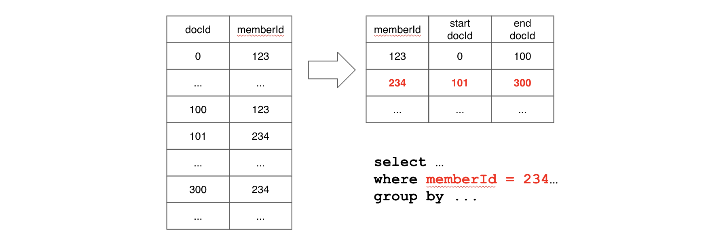
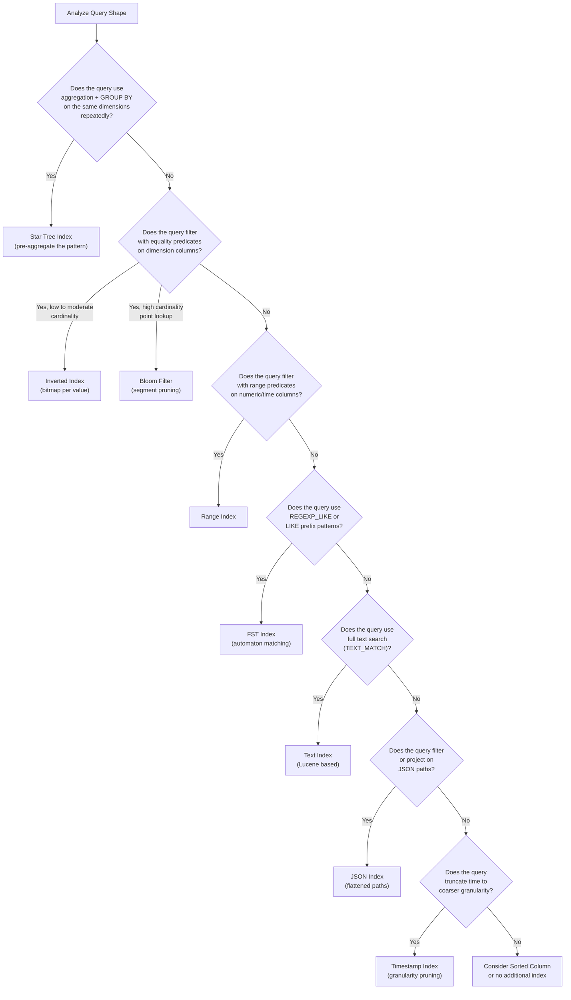

# 6. The Indexing Cookbook

Apache Pinot achieves its hallmark sub-second query latency not through a single clever trick, but through a carefully layered system of indexes that eliminate unnecessary work at every stage of query execution.

Indexes are the difference between scanning billions of rows and touching only the few thousand that matter. They are the reason a dashboard backed by Pinot can serve concurrent analytical queries to thousands of users without breaking a sweat.

### The Discipline of Indexing

While indexes provide immense power, they come with a discipline requirement that many teams underestimate. Every index introduces specific overhead. Storage consumption means indexes take up physical space on disk and in the OS page cache. Ingestion cost means segment build times increase as more data structures must be computed during flush or commit. Operational complexity means schema evolution and table reloads become more expensive as indexes are recalculated.

> [!IMPORTANT]
> **The Golden Rule of Indexing**
> The goal is never to add all the indexes. Instead, map each recurring query shape to the cheapest physical shortcut that satisfies it, then carefully measure the cost of that shortcut against its real world benefit.

### What You Will Learn

This chapter serves as your comprehensive reference for every index type Pinot offers. For each index, the discussion covers internal mechanics (how the data structure works under the hood), anti-patterns (when the index provides no value or actively hurts performance), primary use cases (when the index is the optimal choice) and configuration (how to define the index within your `tableIndexConfig`).

By the end of this chapter, you will be able to look at any query workload and prescribe the precise set of indexes that will make it fast without wasting cluster resources on cosmetic indexing.

## How Pinot Indexes Work | The Foundation

Before diving into individual index types, it is essential to understand how Pinot organizes data and how indexes fit into that organization.

### The Forward Index | The Baseline

Every column in a Pinot segment has a **forward index** by default. The forward index maps from a document ID (the row number within a segment) to the value stored in that column. It is the fundamental data structure that makes column reads possible.

Pinot supports two encoding strategies for forward indexes.

#### Dictionary encoded forward index
Pinot builds a sorted dictionary of all unique values in the column, assigns each unique value an integer ID and stores the integer IDs in the forward index instead of the raw values. This is the default behavior and works exceptionally well for columns with moderate cardinality (up to a few million unique values). Dictionary encoding compresses storage because repeating a 4 byte integer ID is far cheaper than repeating a 200 byte string.

#### Raw (no dictionary) forward index
For columns with extremely high cardinality (such as UUIDs, session tokens or free text fields), dictionary encoding can actually hurt performance. The dictionary itself becomes enormous, consuming memory and slowing down segment loads. In these cases, you can configure the column as a `noDictionaryColumn`, which stores the raw values directly with optional compression (Snappy, Zstandard, LZ4 or pass-through).

### The Sorted Forward Index | A Free Optimization

When data is physically sorted by a column within a segment, Pinot automatically creates a **sorted forward index** for that column. A sorted forward index is essentially a form of run-length encoding. Instead of storing every individual document ID, Pinot stores contiguous ranges (e.g., value A exists from Doc ID 0 to 499).

Equality and range lookups on a sorted column become binary searches over sorted ranges, which is extremely fast. A table can have at most one sorted column. For realtime tables, the `sortedColumn` setting controls this. For offline tables, the segment builder sorts data by the specified column during creation.

> [!TIP]
> **The High Impact Choice:** Sorting by the most common filter column (e.g., `tenant_id` or `city`) provides the equivalent of a clustered index in a traditional database with zero additional storage cost.

### The Relationship Between Encoding and Indexing

Understanding the distinction between encoding (storage) and indexing (retrieval) is critical for performance tuning.

| Feature | Description | Trade off |
| :--- | :--- | :--- |
| **Encoding** | How a value is physically represented on disk (Dictionary vs. Raw bytes). | Dictionary saves space on low cardinality. Raw saves memory on high cardinality. |
| **Indexing** | How Pinot finds matching rows without scanning every value (Inverted, Bloom, etc.). | Indexes speed up reads but increase segment size and build time. |

> [!IMPORTANT]
> **Interdependency:** Some indexes, like the inverted index, require dictionary encoding. Others, like the text index, operate on raw values. Your choice of encoding directly dictates which physical shortcuts you can enable later.


*Source: [Apache Pinot Documentation](https://docs.pinot.apache.org/basics/indexing/inverted-index)*

## Index Types: A Complete Reference

### Inverted Index

The inverted index is the workhorse of Pinot's filtering engine. While the forward index maps from row to value, the inverted index maps from value to the set of rows that contain it. Pinot implements this as a **bitmap based inverted index**, where each unique dictionary ID is associated with a roaring bitmap that identifies every document containing that value.

#### How it accelerates queries
When a query contains an equality filter like `WHERE city = 'San Francisco'`, Pinot looks up "San Francisco" in the column's dictionary, retrieves the corresponding dictionary ID and then fetches the bitmap from the inverted index. That bitmap immediately identifies every matching row in the segment without scanning a single value in the forward index. For multi-predicate queries, Pinot performs set intersections and unions on the bitmaps, which are extremely fast operations on roaring bitmaps.

#### Cardinality sweet spots
Inverted indexes work best on columns with low to moderate cardinality (hundreds to tens of thousands of unique values). At very low cardinality (e.g., a boolean column with only two values), the bitmaps are dense and efficient. At very high cardinality (e.g., a UUID column with millions of unique values), the bitmaps become sparse and the dictionary becomes large, reducing the benefit. For high cardinality point lookups, a Bloom filter is usually a better choice.

**Configuration example:**

```json
{
  "tableIndexConfig": {
    "invertedIndexColumns": ["city", "service_tier", "status", "merchant_id"]
  }
}
```

| Scenario | Recommended Usage | Reasoning |
| :--- | :--- | :--- |
| **When to use** | **Dashboard filters** that slice by dimensions (e.g., `city`, `status`). | Provides near instant lookups for categorical data across millions of rows. |
| **When to use** | **Equality predicates** (`WHERE column = 'value'`) in top queries. | Maps specific values to their internal DocIDs without scanning the data. |
| **When to use** | Columns used in **`GROUP BY`** combined with filters. | Drastically reduces the working set of data the server must aggregate. |
| **When NOT to use** | **High cardinality columns** (Unique IDs, UUIDs). | The index size can rival the data size; Bloom Filters are better for point lookups here. |
| **When NOT to use** | The **Sorted Column**. | Redundant. The sorted forward index already provides the fastest possible lookup for that column. |
| **When NOT to use** | **Range only filters** (`>`, `<`, `BETWEEN`). | Inverted indexes are for exact matches; use a Range Index to optimize these queries. |

### Range Index

The range index is designed for predicates that involve bounded comparisons: `WHERE fare_amount BETWEEN 10 AND 50`, `WHERE event_time > 1700000000000` or `WHERE temperature < 32.0`. While an inverted index can technically handle range queries by unioning the bitmaps of every matching dictionary value, this approach becomes expensive when the range spans many distinct values.

#### How it differs from the inverted index
The range index uses a specialized data structure (based on value ranges rather than individual values) that allows Pinot to quickly identify all documents within a numeric range without enumerating every individual value in that range. It trades the per-value precision of the inverted index for the ability to handle continuous ranges efficiently.

Range indexes are ideal for time-based filters on epoch millisecond columns, financial thresholds (transaction amounts, account balances, fare ranges), sensor readings with magnitude-based filtering and any numeric column where the query pattern involves `BETWEEN`, `>`, `<`, `>=` or `<=`.

**Configuration example**

```json
{
  "tableIndexConfig": {
    "rangeIndexColumns": ["last_event_time_ms", "fare_amount", "event_version"]
  }
}
```

| Scenario | Recommended Usage | Reasoning |
| :--- | :--- | :--- |
| **When to use** | **Numeric or Time columns** with frequent range predicates (`>`, `<`, `BETWEEN`). | Significantly reduces the scan effort for continuous data ranges. |
| **When to use** | **High cardinality columns** where inverted index range scans are too slow. | Avoids the overhead of scanning thousands of individual entries in a dictionary. |
| **When NOT to use** | Columns used strictly for **Equality filters** (`=`). | An Inverted Index is faster for exact matches and generally more space efficient. |
| **When NOT to use** | The **Sorted Column**. | Redundant; the physical order of a sorted column already allows for highly efficient range scans. |
| **When NOT to use** | **Low-cardinality columns** (e.g., `rating` 1-5). | A standard inverted index can handle the few lookups required for these ranges without the extra index overhead. |

### Bloom Filter

A Bloom filter is a **probabilistic membership test** data structure. It can tell you with certainty that a value is NOT in a segment, but it can only tell you with high probability (not certainty) that a value IS in a segment. This "probably not here" capability is precisely what makes it valuable: it allows Pinot to skip entire segments during query execution when the Bloom filter confirms that the queried value does not exist in that segment.

During segment creation, Pinot hashes every value in the configured column through multiple hash functions and sets the corresponding bits in a bit array. At query time, Pinot hashes the queried value through the same hash functions and checks the corresponding bits. If any bit is not set, the value is definitively not in the segment and the segment is skipped entirely. If all bits are set, the value might be in the segment (with a configurable false positive probability) and the segment is scanned normally.

The default false positive probability (FPP) in Pinot is 0.05 (5%). You can tune this lower for better accuracy at the cost of a larger bit array. An FPP of 0.01 (1%) is common in production. Lower FPP means fewer unnecessary segment scans but more storage per Bloom filter.

Bloom filters are ideal for point lookups on high-cardinality ID columns such as `WHERE trip_id = 'abc-123'`, for lookup-heavy workloads where most segments will not contain the queried value and for columns where building a full inverted index would be too expensive due to cardinality.

**Configuration example**

```json
{
  "tableIndexConfig": {
    "bloomFilterColumns": ["trip_id"],
    "bloomFilterConfigs": {
      "trip_id": {
        "fpp": 0.01,
        "maxSizeInBytes": 1048576
      }
    }
  }
}
```

| Scenario | Recommended Usage | Reasoning |
| :--- | :--- | :--- |
| **When to use** | **High cardinality columns** (millions of unique values) with point lookups. | Allows the Broker to skip segments entirely without reading them from disk. |
| **When to use** | **Entity ID columns** where queries target specific records across many segments. | Drastically reduces the scatter overhead by narrowing down the target servers. |
| **When NOT to use** | **Low cardinality columns** (e.g., `status`, `country`). | An Inverted Index provides a definitive answer and is more performant for these. |
| **When NOT to use** | **Range or partial match queries** (`>`, `<`, `LIKE`). | Bloom filters are probabilistic structures that only support exact match (`=`) checks. |
| **When NOT to use** | Columns where data is **densely distributed** across all segments. | If every segment contains the value, the filter will always return true, wasting memory. |

### Text Index

Pinot's text index is a **Lucene-based full text search index** that enables rich text search capabilities directly within the analytical query engine. It supports the full spectrum of Lucene query syntax, including phrase matching, boolean operators, wildcard patterns and fuzzy matching.

With a text index, you can write queries like:

```sql
SELECT merchant_name, city
FROM merchants_dim
WHERE TEXT_MATCH(description, '"fast delivery" AND pizza')
```

This query finds all merchants whose description contains the phrase "fast delivery" and the word "pizza." Without a text index, this kind of query would require a full scan with string matching on every row.

#### How it works internally
During segment creation, Pinot tokenizes the text in the configured column, builds an inverted term index using Lucene and stores it alongside the segment. At query time, Pinot delegates the text predicate to Lucene, which returns the matching document IDs. These document IDs are then merged with any other predicates in the query using Pinot's standard bitmap operations.

**Configuration example**

```json
{
  "tableIndexConfig": {
    "fieldConfigList": [
      {
        "name": "description",
        "encodingType": "RAW",
        "indexTypes": ["TEXT"],
        "properties": {
          "fstType": "NATIVE"
        }
      }
    ]
  }
}
```

| Scenario | Recommended Usage | Reasoning |
| :--- | :--- | :--- |
| **When to use** | **Free text fields** requiring phrase, boolean or fuzzy matching. | Enables `TEXT_MATCH` for complex search patterns that standard SQL filters cannot handle. |
| **When to use** | **Log message fields** used to identify specific error patterns or stack traces. | Efficiently scans large strings for specific tokens without a full table scan. |
| **When to use** | **User generated content** (descriptions/reviews) that powers search UI. | Provides a search-engine-like experience within a real time analytics context. |
| **When NOT to use** | Columns with **simple equality or prefix matching** requirements. | Inverted or FST indexes are significantly faster and lighter for structured string lookups. |
| **When NOT to use** | **Short, structured values** (e.g., `status_code`, `city_name`). | The overhead of a full text index is wasted on categorical data. |
| **When NOT to use** | **Broad application** across all string columns. | Text indexes create a full Lucene index per segment, leading to massive storage and memory bloat. |

### FST Index

The **Finite State Transducer (FST) index** is a specialized structure designed for **regex and prefix matching** on dictionary encoded string columns. It is far more lightweight than a full Lucene text index and is purpose-built for pattern matching scenarios.

#### How it works
An FST compiles the dictionary of a column into a compact automaton. When a query contains a `REGEXP_LIKE` or `LIKE` predicate, Pinot traverses the automaton to find all dictionary entries that match the pattern, then retrieves the corresponding bitmaps from the inverted index. This is dramatically faster than iterating over every dictionary entry and applying a regex.

#### How it complements the text index
The FST index and text index serve different niches. For prefix matching (`LIKE 'San%'`), regex matching (`REGEXP_LIKE(city, 'New.*')`) or autocomplete-style lookups, the FST index is lighter and faster than a text index. For phrase search, boolean logic, tokenization or fuzzy matching, the text index is necessary.

#### Configuration example

```json
{
  "tableIndexConfig": {
    "fieldConfigList": [
      {
        "name": "city",
        "encodingType": "DICTIONARY",
        "indexTypes": ["FST"]
      }
    ]
  }
}
```

| Scenario | Recommended Usage | Reasoning |
| :--- | :--- | :--- |
| **When to use** | **Autocomplete / Typeahead** interfaces for string columns. | Extremely efficient at finding all values starting with a specific prefix. |
| **When to use** | **Regex based filtering** in operational dashboards. | Provides a high performance way to evaluate complex string patterns. |
| **When to use** | **Prefix matching** (`LIKE 'abc%'`) on dimension columns. | Drastically faster than a standard scan or a heavy full text index for prefixes. |
| **When NOT to use** | **Full text search** (phrase/token based searching). | FST does not tokenize; use the Text Index if you need to search within sentences. |
| **When NOT to use** | **Non string columns**. | FST is a specialized structure designed specifically for character sequences. |
| **When NOT to use** | **Equality only** filtering. | A standard Inverted Index is simpler and more efficient for simple `column = 'value'` checks. |

### JSON Index

The JSON index enables Pinot to **index and query into JSON paths** within a JSON column. Without a JSON index, querying nested JSON fields requires deserializing the entire JSON blob for every row. With the index, Pinot can directly look up specific JSON paths and apply predicates without full deserialization.

Pinot's JSON indexing works by "flattening" the JSON structure at segment creation time. Each unique JSON path (e.g., `$.address.city`, `$.tags[0]`) becomes an independently queryable entry. You can control which paths are indexed using include and exclude filters, which is important for deeply nested or highly variable JSON structures.

Queries use the `JSON_EXTRACT_SCALAR` function or the `JSON_MATCH` predicate to access nested fields:

```sql
SELECT trip_id
FROM trip_state
WHERE JSON_MATCH(attributes, '"$.priority" = ''high''')
```

**Configuration example:**

```json
{
  "tableIndexConfig": {
    "jsonIndexColumns": ["attributes"],
    "jsonIndexConfigs": {
      "attributes": {
        "maxLevels": 3,
        "excludeArray": false,
        "disableCrossArrayUnnest": true,
        "includePaths": ["$.priority", "$.region", "$.tags"],
        "excludePaths": ["$.internal_metadata"]
      }
    }
  }
}
```

| Scenario | Recommended Usage | Reasoning |
| :--- | :--- | :--- |
| **When to use** | **Semi structured event attributes** (e.g., `event_properties`) stored as JSON. | Enables schema-on-read flexibility while maintaining high performance lookups. |
| **When to use** | **API response payloads** where the internal structure varies by record. | Allows you to query nested fields without having to flatten every possible key into a separate column. |
| **When to use** | Any column where **specific JSON paths** are used in filters (`WHERE`) or projections (`SELECT`). | Drastically accelerates path based queries compared to scanning raw JSON strings. |
| **When NOT to use** | JSON with **extreme structural variance** (hundreds of unique paths). | Can cause "path explosion," leading to massive segment sizes and slow build times. |
| **When NOT to use** | Columns used strictly for **blob storage**. | If you never query into the JSON, raw encoding is faster and saves significant disk space. |
| **When NOT to use** | **Predictable, high frequency paths**. | If you query `json_col.user_id` in 90% of your requests, promoting it to a native column is always faster. |

### Timestamp Index

The timestamp index is a specialized optimization for **time columns** that enables sub-column granularity based indexing. Instead of storing only the raw epoch timestamp, Pinot creates additional virtual columns at specified time granularities (HOUR, DAY, WEEK, MONTH) that enable the query engine to prune data at coarser granularities before touching the raw timestamp.

Consider a query like `WHERE event_time > '2024-01-01' AND event_time < '2024-02-01'`. Without a timestamp index, Pinot must evaluate the predicate against every raw timestamp value. With a timestamp index at DAY granularity, Pinot can first prune at the day level (eliminating entire days that fall outside the range) and then only scan the remaining documents at full precision.

#### Configuration example

```json
{
  "tableIndexConfig": {
    "fieldConfigList": [
      {
        "name": "event_time_ms",
        "encodingType": "DICTIONARY",
        "indexTypes": ["TIMESTAMP"],
        "timestampConfig": {
          "granularities": ["HOUR", "DAY", "MONTH"]
        }
      }
    ]
  }
}
```

| Scenario | Recommended Usage | Reasoning |
| :--- | :--- | :--- |
| **When to use** | **Time columns** used with `DATETIMECONVERT` or `DATE_TRUNC`. | Precomputes truncated values (day, month, year) to avoid expensive on-the-fly calculations. |
| **When to use** | Queries that **group by time** at coarse granularities (e.g., hourly/daily metrics). | Accelerates time based rollups by leveraging pre-aggregated index structures. |
| **When to use** | Workloads where **time filtering** is the primary access pattern. | Dramatically speeds up data retrieval for "last X days" style analytical queries. |
| **When NOT to use** | Tables where the time column is the **Sorted Column**. | The physical sort order already provides near optimal range scan performance. |
| **When NOT to use** | **Low volume tables**. | The overhead of managing the additional index metadata outweighs the minimal pruning benefits. |
| **When NOT to use** | **Non temporal columns**. | Only valid for columns representing a specific point in time (Long or String ISO format). |


### Star Tree Index

The Star Tree index is the most powerful and most misunderstood index in Apache Pinot. It is not merely an index in the traditional sense. It is a **prematerialized aggregation tree** that collapses raw rows into precomputed aggregation results for specific dimension combinations. When a query matches the Star Tree's configuration, Pinot can answer it by reading a handful of pre-aggregated records instead of scanning millions of raw rows.

#### What a Star Tree Is Conceptually

Imagine a dataset with three dimension columns (`city`, `vertical`, `contract_tier`) and two metric columns (`monthly_orders`, `rating`). A Star Tree built on these dimensions precomputes aggregations at every combination of dimension granularity:

1. Aggregations for every (`city`, `vertical`, `contract_tier`) combination.
2. Aggregations for every (`city`, `vertical`) combination with `contract_tier` = `*` (the star node).
3. Aggregations for every (`city`) combination with `vertical` = `*` and `contract_tier` = `*`.
4. A single root aggregation with all dimensions set to `*`.

The **star** in Star Tree refers to these wildcard nodes. A star node aggregates across all values of a dimension, enabling Pinot to answer queries that group by a subset of the configured dimensions without scanning raw data.

#### How It Works Internally

The Star Tree construction process follows these steps:

1. **Dimension splitting.** Records are recursively split by the dimensions in the configured `splitOrder`. The first dimension in the split order becomes the first level of the tree, the second dimension becomes the second level and so on.

2. **Star node creation.** At each level of the tree, Pinot creates an additional star branch that aggregates across all values of that dimension. This star branch enables queries that do not filter or group by that particular dimension to still benefit from the tree.

3. **Aggregation at each level.** At every node in the tree, Pinot precomputes the configured aggregation functions (`SUM`, `COUNT`, `AVG`, `MIN`, `MAX`, `DISTINCTCOUNTHLL` etc.) over the metric columns.

4. **Leaf compaction.** When the number of records at a node falls below `maxLeafRecords`, Pinot stops splitting and stores the remaining records as raw data. This prevents the tree from becoming unnecessarily deep for rare dimension combinations.

#### Configuration Deep Dive

```json
{
  "tableIndexConfig": {
    "starTreeIndexConfigs": [
      {
        "dimensionsSplitOrder": [
          "city",
          "vertical",
          "contract_tier"
        ],
        "functionColumnPairs": [
          "COUNT__*",
          "SUM__monthly_orders",
          "AVG__rating"
        ],
        "maxLeafRecords": 10000,
        "skipStarNodeCreationForDimensions": []
      }
    ]
  }
}
```

| Parameter | Purpose | Engineering Strategy |
| :--- | :--- | :--- |
| **`dimensionsSplitOrder`** | Defines the tree hierarchy (the "Split" logic). | Place your most frequently filtered dimensions first. Similar to a composite index, the order dictates pruning efficiency. |
| **`functionColumnPairs`** | Defines the metrics to pre-calculate. | Only include pairs (e.g., `SUM__revenue`) used in critical queries. Mismatched functions cannot use the index. |
| **`maxLeafRecords`** | Sets the granularity of the preaggregation. | Use ~10,000 for high speed. Higher values (up to 100k) reduce segment size but force more on-the-fly scanning. |
| **`skipStarNodeCreation`** | Opts out of star node generation for specific keys. | Use for dimensions that are always filtered. This prevents the index from growing unnecessarily large. |

#### When Star Tree Shines

Star Tree delivers the highest returns for repeated group-by aggregations on stable dimensions. If a dashboard repeatedly runs `SELECT city, vertical, SUM(monthly_orders) FROM merchants_dim GROUP BY city, vertical`, a Star Tree on these dimensions reduces billions of row scans to a handful of pre-aggregated record reads. For high-concurrency dashboards where hundreds of users hit the same analytical patterns simultaneously, Star Tree reduces per-query CPU cost, dramatically increasing the cluster's effective concurrency ceiling. The index is most effective when a small number of dimensions (three to five) appear in 80% of queries and those dimensions have manageable cardinality.

#### When NOT to Use Star Tree

High cardinality dimensions are incompatible with Star Tree: if a dimension in the split order has millions of unique values (e.g., `user_id`, `transaction_id`), the tree explodes in size and provides minimal aggregation benefit because most nodes contain only one record. Frequently changing schemas impose high operational cost because adding or removing dimensions from a Star Tree requires a full segment rebuild. Point lookup queries (`SELECT * WHERE id = X`) receive no benefit from Star Tree because the index is designed for aggregations, not for retrieving individual records. Upsert tables are architecturally incompatible because pre-aggregated values cannot be efficiently updated when individual records change.

> [!WARNING]
> Star Tree indexes are incompatible with upsert tables. If your table uses upsert, you cannot use Star Tree indexes.

## Index Selection Decision Framework

Choosing the right index for a given query pattern should be a systematic process, not guesswork. The following flowchart provides a decision framework that maps query shapes to the appropriate index type:



This framework is a starting point, not a rigid prescription. Real workloads often combine multiple query shapes and the right answer is frequently a combination of indexes on different columns.

## Index Cost Model

Every index provides query performance benefits at a cost. Understanding these costs is essential for making informed tradeoffs.

### Storage Overhead

| Index Type | Typical Storage Overhead | Notes |
|---|---|---|
| Inverted Index | 10 to 30% of column size | Scales with cardinality. Dense bitmaps compress well. |
| Range Index | 5 to 15% of column size | Compact for numeric columns. |
| Bloom Filter | Small, fixed per segment | Controlled by FPP and max size settings. Typically a few KB to 1 MB per column per segment. |
| Text Index | 50 to 200% of column size | Full Lucene index per segment. Can be larger than the column itself. |
| FST Index | 5 to 20% of dictionary size | Compact automaton. Much lighter than text index. |
| JSON Index | 30 to 100% of column size | Depends on number of indexed paths and nesting depth. |
| Timestamp Index | 5 to 15% of column size per granularity | One virtual column per configured granularity. |
| Star Tree Index | Varies widely | Can range from 10% to 5x the raw data depending on dimension cardinality and number of metrics. |

### Build Time Impact

Index construction happens during segment creation (for offline tables) and during segment completion and conversion (for realtime tables). The more indexes configured, the longer each segment takes to build. This directly affects realtime ingestion latency (if segment completion takes too long, consuming segments accumulate and freshness degrades), batch ingestion throughput (large batch jobs with many indexes can take significantly longer to complete) and reload time (when you trigger a segment reload after adding a new index, every segment must be rebuilt and on tables with thousands of segments this can take hours).

### Reload Impact

Adding a new index to an existing table requires a table reload. During reload, each server reprocesses its assigned segments to build the new index. Reloads are done segment by segment, so the table remains queryable throughout the process. Reloads consume CPU and I/O on the server, which can impact query latency during the reload window. On large tables, stagger reloads across replicas to avoid simultaneous performance degradation.

## Combining Multiple Indexes

Indexes in Pinot are not mutually exclusive. Multiple indexes on different columns compose naturally because Pinot's query engine processes predicates independently and combines results using bitmap operations. Here is how composition works in practice.

**Example: A multi-predicate query.**

```sql
SELECT city, COUNT(*)
FROM trip_state
WHERE city = 'San Francisco'
  AND fare_amount BETWEEN 20 AND 100
  AND JSON_MATCH(attributes, '"$.priority" = ''high''')
GROUP BY city
```

For this query, Pinot can leverage three indexes simultaneously:

1. **Inverted index on `city`** resolves the equality predicate and returns a bitmap of matching document IDs.
2. **Range index on `fare_amount`** resolves the range predicate and returns a second bitmap.
3. **JSON index on `attributes`** resolves the JSON path predicate and returns a third bitmap.

Pinot intersects these three bitmaps to produce the final set of matching document IDs, then reads only those documents from the forward index to compute the aggregation. Each index eliminates work independently and the combination eliminates far more work than any single index alone.

#### Configuration for the above workload

```json
{
  "tableIndexConfig": {
    "invertedIndexColumns": ["city", "service_tier", "status", "merchant_id"],
    "rangeIndexColumns": ["last_event_time_ms", "fare_amount"],
    "bloomFilterColumns": ["trip_id"],
    "jsonIndexColumns": ["attributes"]
  }
}
```

Three composition rules govern how indexes interact. A column can have both an inverted index and a range index, but this is rarely beneficial, so choose the one that matches the query pattern. A column can have a Bloom filter alongside other indexes, because the Bloom filter operates at the segment level (deciding whether to scan the segment at all) while other indexes operate within the segment. Star Tree indexes operate independently of column level indexes: a query either hits the Star Tree path or the regular index path, not both simultaneously.

## Operating Heuristics

Start with the top ten queries, not your entire imagination. Profile your actual query workload, identify the ten most frequently executed queries and design indexes to accelerate those specific patterns. Adding indexes speculatively wastes storage and build time.

Measure storage cost and reload cost alongside latency gains. An index that reduces P50 latency by 10ms but adds 500GB of storage and doubles reload time may not be worth it. Always quantify both sides of the tradeoff.

Use the sorted column first. Before adding any other index, ensure that your sorted column is set to the dimension that provides the highest selectivity for your most common filter. This is a zero-cost optimization that often eliminates the need for additional indexes on that column.

Revisit indexes after schema changes or major workload shifts. The index configuration that was optimal six months ago may be suboptimal today. When query patterns evolve, your indexes should evolve with them. Monitor segment build times. If they start increasing significantly, investigate which indexes are contributing the most overhead. The text index and Star-Tree index are the most common culprits.

Prefer Bloom filters over inverted indexes for high cardinality ID columns. If a column has more than 100,000 unique values and is queried exclusively with point lookups, a Bloom filter provides segment pruning at a fraction of the storage cost of a full inverted index.

## Common Pitfalls

Adding a Star Tree without a repeated aggregation pattern to justify it is pure waste. Star Tree indexes consume significant storage and build time and if your queries are adhoc and vary widely, the Star Tree will rarely be hit.

Indexing every column "just in case" is the most common mistake teams make. Every index has a cost and the marginal benefit of indexing a column that is never filtered or grouped is exactly zero.

Assuming range predicates are fast without a range index is a dangerous assumption. Without a range index, range predicates on non-sorted columns require scanning the inverted index bitmaps for every value in the range. For ranges that span many values, this can be extremely slow.

Using text indexes on short, structured string columns is massive overkill. A text index on a column like `status` (with values like "active", "inactive", "pending") is 10x larger and 10x slower than an inverted index for equality predicates.

Ignoring the impact of `noDictionaryColumns` on inverted indexes leads to invisible configuration errors. If you mark a column as `noDictionaryColumns`, you cannot add an inverted index to it because inverted indexes require dictionary encoding. Plan your encoding and indexing strategies together.

Forgetting that Star Tree is incompatible with upsert is a common surprise. If your table uses upsert mode, Star Tree indexes are not supported.

## Practice Prompts

Test your ability to apply Pinot's indexing theory to real world datasets and performance bottlenecks.

1. **Repository Audit:** For each query in the `sql/` directory of this repository, identify the index type that would help it most and explain why. Consider factors like predicate type (equality vs. range) and column cardinality.

2. **The Bloom Filter Boundary:** Describe a workload where Bloom filters provide significant value and a workload where they provide almost no value. What specific characteristic of the data and query pattern determines the difference?

3. **Star Tree Design Exercise:** Explain why Star Tree is a workload-specific optimization rather than a "default checkbox." Design a Star Tree configuration for a hypothetical ecommerce dashboard that tracks `SUM(revenue)` and `COUNT(*)` by `country`, `product_category` and `payment_method`.

4. **Scaling to 50 Billion:** A table has 50 billion rows and a UUID column queried exclusively with equality lookups (`WHERE uuid = '...'`). Would you use an inverted index, a Bloom filter or both? Justify your answer based on storage overhead, memory pressure on the hash map and P99 latency.

5. **Index Proliferation:** A colleague proposes adding text indexes to every string column in a table with 20 string columns. Draft a technical response explaining why this is problematic for ingestion throughput and storage. What approach would you recommend instead to balance searchability with performance?

## Suggested Labs

* [Lab 4: Index Tuning and Pruning](../labs/lab-04-index-tuning.md) walks you through adding and removing indexes, measuring their impact on query latency and storage and understanding segment pruning behavior.

## Repository Artifacts

The following files in this repository demonstrate the indexing patterns discussed in this chapter:

| File | Description |
|---|---|
| [`tables/trip_events_rt.table.json`](tables/trip_events_rt.table.json) | Realtime table config with inverted and range indexes |
| [`tables/trip_state_rt.table.json`](tables/trip_state_rt.table.json) | Realtime table config with inverted, range, bloom and JSON indexes |
| [`tables/merchants_dim_offline.table.json`](tables/merchants_dim_offline.table.json) | Offline table config with sorted column, inverted indexes and Star-Tree configuration |
| [`scripts/simulate_star_tree.py`](scripts/simulate_star_tree.py) | Simulation demonstrating Star-Tree compression ratios |
| [`scripts/simulate_segment_pruning.py`](scripts/simulate_segment_pruning.py) | Simulation demonstrating segment pruning with Bloom filters |

## Further Reading and Resources

* [Official Indexing Documentation](https://docs.pinot.apache.org/basics/indexing) provides the canonical reference for all Pinot index types and configurations.
* [Indexing Deep Dive in Apache Pinot (YouTube)](https://www.youtube.com/watch?v=JV0WxBwJqKE) offers a visual walkthrough of index internals and selection strategies.
* [Star-Tree Index in Apache Pinot (StarTree Blog)](https://startree.ai/blog/star-tree-index-in-apache-pinot) provides a detailed exploration of Star-Tree architecture and configuration.
* [Indexing in Apache Pinot (StarTree Blog)](https://startree.ai/blog/indexing-in-apache-pinot) offers a comprehensive guide to choosing the right indexes for your workload.

*Previous chapter: [5. Table Config Deep Dive](./05-table-config-deep dive.md)*<br>
*Next chapter: [7. Batch Ingestion](./07-batch-ingestion.md)*
