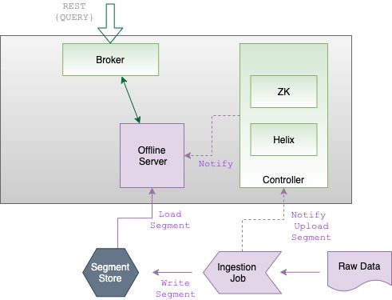

# 7. Batch Ingestion

# Why Batch Ingestion Remains Critical

> [!IMPORTANT]
> There is a persistent myth in the real time analytics community that batch ingestion is a relic. We believe this is wrong. Even sophisticated streaming first architectures depend on batch ingestion for specific use cases.

### The Reality of Data Sources

Streams excel at capturing continuous flows. However, we recognize that not all data originates as a stream.

| Data Type | Why Batch is Essential |
| :--- | :--- |
| **Dimension Tables** | These are curated artifacts rather than event streams. |
| **Historical Backfills** | We use bulk reprocessing to correct past data or accommodate schema changes. |
| **Partner Data** | This often arrives as file drops rather than Kafka topics. |
| **Benchmark Datasets** | We need deterministic and repeatable loading. |

# Batch Ingestion | A First Class Capability

> [!NOTE]
> We do not view batch ingestion as a fallback mechanism. We treat it as a primary feature with a dedicated configuration model and rigorous operational discipline.


*Source: [Apache Pinot Documentation](https://docs.pinot.apache.org/basics/components)*

### Chapter Roadmap

This chapter covers when we choose batch over streaming, how we configure ingestion jobs, the internal mechanics of the segment creation pipeline, and how we manage operational concerns during bulk loads.

## When to Use Batch Ingestion

We choose batch ingestion whenever data does not naturally originate from a continuous stream. We also use it when the load requires bulk processing semantics.

### Use Case Scenarios

| Category | Description |
| :--- | :--- |
| **Dimension Tables** | We use these for enrichment joins. These curated attributes (name, city, rating) are updated periodically and require atomic loading to prevent inconsistencies. |
| **Historical Backfills** | We use batch operations when schema changes occur. We read historical data from the source of truth and apply updated transformations to ensure old segments match the new schema. |
| **Data Lake Replays** | We bootstrap new tables with years of history from S3, GCS and HDFS. This is the natural path for reprocessing specific time ranges due to quality issues. |
| **Vendor Onboarding** | We ingest external data that arrives as scheduled file exports. Our pipelines handle format conversion and segment creation in one auditable flow. |
| **Benchmark Loading** | We load deterministic datasets for testing and verification. We use this method for the `merchants_dim` table in this repository. |

### The Core Logic

We prioritize batch ingestion because it provides cleanliness (data is validated before it hits the cluster), consistency (updates are loaded atomically), and reproducibility (we can reload the exact same dataset for performance benchmarks).

## The Ingestion JobSpec

The JobSpec is the **single source of truth** for a batch ingestion job. It is a YAML file that binds together the input data location, the file format, the schema, the table config, the segment creation parameters and the push mechanics. Every assumption about a batch load is encoded in this file, which makes it the right artifact to review before executing a large backfill or data migration.

Here is the fully annotated JobSpec from this repository ([`jobs/merchants.job.yml`](jobs/merchants.job.yml)).

```yaml
# Execution Framework
# Determines the runtime environment for the ingestion job.
# "standalone" runs the job in a single JVM process.
# Alternatives: "hadoop" for MapReduce, "spark" for Spark.
executionFrameworkSpec:
  name: standalone

# Job Type
# Defines the end to end workflow:
#   SegmentCreationAndTarPush   = build segments + tar push to controller
#   SegmentCreationAndUriPush   = build segments + register deep store URI
#   SegmentCreationAndMetadataPush = build segments + push metadata only
#   SegmentCreation             = build segments without pushing
jobType: SegmentCreationAndTarPush

# Input Configuration
# The directory URI where input files are located.
# Supports file://, s3://, gs://, hdfs://, wasbs:// schemes.
inputDirURI: file:///workspace/data

# Glob pattern to select specific files from the input directory.
# This ensures only the intended files are processed.
includeFileNamePattern: glob:**/merchants.csv

# Output Configuration
# The directory where generated segments are written before pushing.
outputDirURI: file:///workspace/.generated/segments/merchants_dim

# Whether to overwrite existing output segments.
# Set to true for idempotent reruns.
overwriteOutput: true

# Filesystem Configuration
# Defines the filesystem plugin for reading input and writing output.
# Must match the URI scheme used in inputDirURI and outputDirURI.
pinotFSSpecs:
  - scheme: file
    className: org.apache.pinot.spi.filesystem.LocalPinotFS

# Record Reader Configuration
# Specifies the input file format and the corresponding reader class.
# Pinot ships with readers for CSV, JSON, Avro, Parquet, ORC, Thrift,
# and Protocol Buffers.
recordReaderSpec:
  dataFormat: csv
  className: org.apache.pinot.plugin.inputformat.csv.CSVRecordReader
  configClassName: org.apache.pinot.plugin.inputformat.csv.CSVRecordReaderConfig

# Schema and Table Config References
# URI pointing to the Pinot schema JSON file.
# The schema defines column names, data types, and field types.
schemaURI: file:///workspace/schemas/merchants_dim.schema.json

# URI pointing to the Pinot table config JSON file.
# The table config defines indexes, encoding, routing, and tenants.
tableConfigURI: file:///workspace/tables/merchants_dim_offline.table.json

# Table Specification
# The target table name. Must match the tableName in the table config.
tableSpec:
  tableName: merchants_dim

# Segment Naming
# Controls how generated segments are named.
# Options:
#   normalizedDate  - includes a normalized date range in the name
#   fixed           - uses a fixed, user specified prefix
#   inputFile       - derives the name from the input file name
segmentNameGeneratorSpec:
  type: normalizedDate

# Cluster Coordinates
# The Pinot controller endpoint(s) for segment upload and metadata
# registration. Multiple entries enable failover.
pinotClusterSpecs:
  - controllerURI: http://pinot-controller:9000

# Push Behavior
# Controls retry behavior and parallelism for the segment push phase.
pushJobSpec:
  pushAttempts: 2
  pushParallelism: 1
  pushRetryIntervalMillis: 1000
```

Every field in this file represents a decision. Changing the `executionFrameworkSpec` from `standalone` to `spark` changes how the job parallelizes across a cluster. Changing the `jobType` from `SegmentCreationAndTarPush` to `SegmentCreationAndUriPush` changes whether segment bytes flow through the controller or are read directly from deep store. These decisions have significant operational implications that are covered in detail in the following sections.

## The Segment Creation Pipeline

Batch ingestion is not a simple file copy. It is a multi stage pipeline that transforms raw records into Pinot's optimized columnar segment format. Understanding each stage helps you diagnose issues and tune performance.

### Stage 1 | Record Reading

The first stage reads raw records from the input files using the configured record reader. Pinot ships with record readers for all major file formats:

| Format | Reader Class | Typical Use Case |
|---|---|---|
| CSV | `CSVRecordReader` | Simple flat files, quick experiments, dimension table exports |
| JSON | `JSONRecordReader` | API response dumps, structured event logs |
| Avro | `AvroRecordReader` | Schema registered data lake exports, Kafka Connect output |
| Parquet | `ParquetRecordReader` | Columnar data lake files, Spark/Hive output |
| ORC | `ORCRecordReader` | Hive native columnar format |
| Thrift | `ThriftRecordReader` | Legacy RPC service data exports |
| Protocol Buffers | `ProtoRecordReader` | gRPC service data exports |

The record reader deserializes each record into Pinot's internal `GenericRow` representation, which normalizes all formats into a common row structure that the segment builder consumes.

### Stage 2 | Segment Building

The segment builder takes the stream of `GenericRow` records and constructs a Pinot segment. Column encoding is the first sub-step: each column's values are analyzed to determine the dictionary (if applicable) and values are encoded according to the table config's encoding settings. Index construction follows, building all configured indexes (inverted, range, bloom, text, JSON, Star-Tree, etc.) during this phase. If the table config specifies a sorted column, the segment builder sorts all records by that column before encoding, enabling the sorted forward index optimization described in Chapter 6. Finally, metadata generation produces a record of the total document count, the min/max values for each column, the time range covered by the segment, and the CRC checksum.

The output of this stage is a self-contained segment directory that includes all column data files, index files, metadata and creation metadata.

### Stage 3 | Segment Naming

Segment names must be unique within a table and should be meaningful for operational purposes. Pinot supports three naming strategies.

The `normalizedDate` strategy generates names that include a normalized date range derived from the time column values in the segment. An example name is `merchants_dim_2024-01-01_2024-01-31_0`. This is the default and the recommended strategy for tables with a time column.

The `fixed` strategy uses a fixed, user-specified prefix with a sequence number. Example names are `merchants_dim_0` and `merchants_dim_1`. This is useful for tables without a time column, such as pure dimension tables.

The `inputFile` strategy derives the segment name from the input file name. If the input file is `merchants_2024.csv`, the segment might be named `merchants_dim_merchants_2024_0`. This is useful when you need traceability between input files and segments.

### Stage 4 | Segment Push

The final stage uploads the completed segment to the Pinot cluster. Pinot supports three push mechanisms, each with different operational characteristics.

| Push Type | How It Works | Pros | Cons |
|---|---|---|---|
| **Tar Push** | The segment is tarred and uploaded to the controller via HTTP. The controller stores it in deep store and notifies servers to download it. | Simple to set up. Works without direct deep store access from the ingestion job. | Controller becomes a bottleneck for large segments. Upload size limited by controller memory and HTTP timeout. |
| **URI Push** | The segment is written directly to deep store (S3, GCS, HDFS). The controller is notified of the segment URI and metadata. Servers download directly from deep store. | Eliminates the controller as a data transfer bottleneck. Supports arbitrarily large segments. | Requires the ingestion job to have write access to deep store. |
| **Metadata Push** | Similar to URI push, but the segment is already in deep store (e.g., written by a previous pipeline stage). Only the metadata is sent to the controller. | Fastest push. No data movement at all. | Requires the segment to already exist in the correct deep store location. |

> [!IMPORTANT]
> For small to medium segment sizes (under 500 MB), tar push is the simplest option. For large segments or high-throughput ingestion pipelines, URI push or metadata push avoids the controller bottleneck.

## Offline Table Configuration

A batch ingestion job pushes segments into an **OFFLINE** table. The offline table config controls how those segments are stored, indexed, served and retired. Here is a complete annotated example based on the `merchants_dim` table in this repository.

```json
{
  // Table name must match the schemaName in the corresponding schema.
  "tableName": "merchants_dim",

  // OFFLINE indicates this table receives batch-pushed segments
  // (as opposed to REALTIME which consumes from streams).
  "tableType": "OFFLINE",

  // Segment-level configuration.
  "segmentsConfig": {
    // The schema this table uses for column definitions.
    "schemaName": "merchants_dim",

    // Number of segment replicas across servers.
    // Production systems should use at least 2 for fault tolerance.
    "replication": "1",

    // Retention period. Segments older than this are automatically deleted.
    // Omit for dimension tables that should be retained indefinitely.
    // "retentionTimeUnit": "DAYS",
    // "retentionTimeValue": "365"
  },

  // Tenant assignment determines which broker and server pools
  // handle queries and storage for this table.
  "tenants": {
    "broker": "DefaultBroker",
    "server": "DefaultServer"
  },

  // Index configuration controls encoding, load mode, and all indexes.
  "tableIndexConfig": {
    // MMAP uses memory mapped files for reading segments.
    // HEAP loads segments entirely into JVM heap.
    // MMAP is recommended for most workloads.
    "loadMode": "MMAP",

    // The sorted column enables a clustered index like optimization.
    // Data is physically sorted by this column within each segment.
    "sortedColumn": ["merchant_id"],

    // Inverted (bitmap) indexes for equality filter acceleration.
    "invertedIndexColumns": ["city", "vertical", "contract_tier"],

    // Star Tree index for pre-aggregated analytical queries.
    "starTreeIndexConfigs": [
      {
        "dimensionsSplitOrder": ["city", "vertical", "contract_tier"],
        "functionColumnPairs": [
          "COUNT__*",
          "SUM__monthly_orders",
          "AVG__rating"
        ],
        "maxLeafRecords": 10000
      }
    ]
  },

  // Query timeout for this table.
  "queryConfig": {
    "timeoutMs": 15000
  }
}
```

## Deep Store Integration

The deep store is Pinot's durable storage layer for completed segments. It is the system of record for segment data. When a server needs to load a segment (during startup, rebalance or recovery), it downloads the segment from deep store. Choosing and configuring the right deep store is critical for operational reliability.

### Local Filesystem

Suitable only for development and single node testing. Segments are stored on the controller's local disk.

```yaml
pinotFSSpecs:
  - scheme: file
    className: org.apache.pinot.spi.filesystem.LocalPinotFS
```

### Amazon S3

The most common deep store for AWS deployments. Requires the `pinot-s3` plugin and appropriate IAM credentials.

```yaml
pinotFSSpecs:
  - scheme: s3
    className: org.apache.pinot.plugin.filesystem.S3PinotFS
    configs:
      region: us-east-1
```

### Google Cloud Storage (GCS)

The standard choice for GCP deployments. Requires the `pinot-gcs` plugin and a service account with Storage Object Admin permissions.

```yaml
pinotFSSpecs:
  - scheme: gs
    className: org.apache.pinot.plugin.filesystem.GcsPinotFS
    configs:
      projectId: my-gcp-project
```

### HDFS

Used in onpremise Hadoop deployments. Requires the `pinot-hdfs` plugin and a valid Hadoop configuration.

```yaml
pinotFSSpecs:
  - scheme: hdfs
    className: org.apache.pinot.plugin.filesystem.HadoopPinotFS
    configs:
      hadoop.conf.path: /etc/hadoop/conf
```

### Azure Blob Storage

The standard choice for Azure deployments. Requires the `pinot-adls` plugin and appropriate Azure credentials.

```yaml
pinotFSSpecs:
  - scheme: wasbs
    className: org.apache.pinot.plugin.filesystem.AzurePinotFS
    configs:
      accountName: mystorageaccount
      accessKey: "<your-access-key>"
```

> [!IMPORTANT]
> Always use a cloud object store (S3, GCS or Azure Blob) for production deep stores. Local filesystem is acceptable only for development. HDFS is appropriate when your organization already operates a Hadoop cluster.

## Backfill and Segment Replacement

Batch ingestion is not always an initial load. In production, you will frequently need to replace, update or roll back segments. Pinot provides several mechanisms for managing segment lifecycle during backfill operations.

### Consistent Data Push: APPEND vs REFRESH

Pinot supports two push modes that determine how newly pushed segments interact with existing segments.

In **APPEND mode**, new segments are added alongside existing segments. This is the default behavior. Use APPEND when you are adding new data that does not overlap with existing segments, such as loading a new day's worth of data.

In **REFRESH mode**, new segments replace existing segments with the same name. Use REFRESH when you are correcting or reprocessing data that has already been loaded. The old segment is atomically replaced by the new one, ensuring that queries never see a mix of old and new data for the same time range.

### Atomic Segment Replacement

For scenarios where you need to replace multiple segments as a single atomic operation (for example, replacing an entire day's worth of data that spans multiple segments), Pinot supports **segment lineage** and **startReplaceSegments/endReplaceSegments** API calls. The workflow proceeds as follows.

1. Call the `startReplaceSegments` API, specifying which existing segments will be replaced and the names of the new segments.
2. Upload the new segments.
3. Call the `endReplaceSegments` API to atomically swap the old segments for the new ones.

This ensures that queries see either all old segments or all new segments, never a partial mix. This is essential for maintaining data consistency during large backfills.

### Rollback Strategies

When a batch load introduces bad data, you need a fast rollback path. The approach depends on how the load was executed.

If you used segment replacement with lineage, call the `revertReplaceSegments` API to atomically revert to the previous segments. This is the cleanest rollback mechanism. If you used APPEND mode, delete the newly pushed segments by name using the segment deletion API. The remaining segments continue to serve queries without interruption. If you used REFRESH mode without lineage, reload the previous version of the segments from your data pipeline's output archive, which requires that you retain previous segment artifacts as part of your pipeline's retention policy.

> [!IMPORTANT]
> Always use segment replacement with lineage for production backfills. The ability to atomically swap and revert segments is worth the small additional API complexity.

## Running Batch Jobs

### Standalone Runner

The standalone runner executes the ingestion job in a single JVM process. It is ideal for development, testing and small to medium production loads.

```bash
# Run from the Pinot distribution directory
bin/pinot-admin.sh LaunchDataIngestionJob \
  -jobSpecFile /workspace/jobs/merchants.job.yml
```

For the Docker based setup used in this repository:

```bash
docker exec -it pinot-controller \
  bin/pinot-admin.sh LaunchDataIngestionJob \
    -jobSpecFile /workspace/jobs/merchants.job.yml
```

### Hadoop MapReduce Runner

For large scale batch ingestion jobs that need to parallelize segment creation across a Hadoop cluster, use the Hadoop execution framework. This distributes record reading and segment building across multiple map tasks.

Update the JobSpec:

```yaml
executionFrameworkSpec:
  name: hadoop
  extraConfigs:
    hadoop.mapreduce.job.classloader: true
```

Submit the job using the Hadoop client:

```bash
hadoop jar pinot-batch-ingestion-hadoop.jar \
  org.apache.pinot.plugin.ingestion.batch.hadoop.HadoopSegmentGenerationAndPushJobRunner \
  -jobSpecFile hdfs:///jobs/merchants.job.yml
```

### Spark Runner

For organizations using Spark as their data processing engine, the Spark runner distributes segment creation across Spark executors. This integrates naturally into existing Spark pipelines.

Update the JobSpec:

```yaml
executionFrameworkSpec:
  name: spark
  extraConfigs:
    spark.master: yarn
    spark.app.name: pinot-batch-ingestion
```

Submit the job using `spark-submit`:

```bash
spark-submit \
  --class org.apache.pinot.plugin.ingestion.batch.spark.SparkSegmentGenerationAndPushJobRunner \
  --master yarn \
  --deploy-mode cluster \
  pinot-batch-ingestion-spark.jar \
  -jobSpecFile s3://my-bucket/jobs/merchants.job.yml
```

### Choosing an Execution Framework

| Factor | Standalone | Hadoop | Spark |
|---|---|---|---|
| Setup complexity | Minimal | Requires Hadoop cluster | Requires Spark cluster |
| Parallelism | Single JVM, sequential | Distributed across map tasks | Distributed across executors |
| Best for | Development, testing, small tables | Large tables in Hadoop environments | Large tables in Spark environments |
| Input data size sweet spot | Up to a few GB | Tens of GB to TB | Tens of GB to TB |

## Designing Dimension Tables Deliberately

> [!TIP]
> We do not treat dimension tables as simple replicas of operational databases. We design them specifically for analytical performance.

### Characteristics of a Great Dimension Table

A well-designed dimension table includes only the columns found in `WHERE`, `GROUP BY` or `SELECT` clauses, omitting any attributes that serve no analytical purpose. We sort by the primary key (such as `merchant_id`) to gain sorted forward index benefits. We refresh data on a schedule that matches our business staleness tolerance, ensuring predictable data quality. We keep "hot" attributes like `merchant_name` in fact tables to avoid join overhead, a practice we call smart denormalization.

## Operating Heuristics

We follow these rules to ensure our batch ingestion is resilient and reproducible.

| Heuristic | Our Action Plan |
| :--- | :--- |
| **Version Control** | We treat every JobSpec as a deployable artifact in source control. |
| **End to End Testing** | We run test loads regularly to verify credentials and controller capacity. |
| **Idempotency** | We set `overwriteOutput: true` so failed jobs can safely rerun. |
| **Monitoring** | We track push latency and controller resource usage during large loads. |
| **Safety Nets** | We retain previous segment artifacts in deep store for quick rollbacks. |

## Common Pitfalls to Avoid

> [!CAUTION]
> **Ad Hoc Jobs:** We avoid running one off terminal commands. If a job is not versioned, it is a reproducibility risk.

We watch for several technical anti-patterns. Missing rollback plans are among the most dangerous: we always use segment replacement with lineage for production loads. Resource exhaustion is a constant concern because large loads consume CPU and disk I/O on live clusters. Memory pressure is addressed by using URI push instead of tar push for segments larger than 500 MB. Finally, validation gaps, launching a job without first verifying that the table exists and the schema matches, are entirely preventable with a pre-flight checklist.

## Suggested Labs

[Lab 2: Schemas and Tables](../labs/lab-02-schemas-and-tables.md) includes creating the `merchants_dim` offline table and loading data through batch ingestion.

## Repository Artifacts

The following files in this repository demonstrate the batch ingestion patterns discussed in this chapter:

| Artifact | Purpose |
| :--- | :--- |
| [`jobs/merchants.job.yml`](jobs/merchants.job.yml) | A complete JobSpec for batch ingestion from CSV files |
| [`schemas/merchants_dim.schema.json`](schemas/merchants_dim.schema.json) | The schema for the dimension table |
| [`tables/merchants_dim_offline.table.json`](tables/merchants_dim_offline.table.json) | The offline table config with sorted column and star-tree indexing |
| `data/merchants.csv` | Sample dimension data for ingestion |
| [`labs/lab-02-schemas-and-tables.md`](labs/lab-02-schemas-and-tables.md) | Hands-on experience with batch ingestion |

## Further Reading and Resources

[Official Batch Ingestion Documentation](https://docs.pinot.apache.org/basics/data-import/batch-ingestion) provides the canonical reference for batch ingestion configuration and execution. [Batch Ingestion in Apache Pinot (YouTube)](https://www.youtube.com/watch?v=T70jnJzS2Ks) offers a visual walkthrough of batch ingestion pipelines and best practices. [Batch Ingestion in Apache Pinot (StarTree Blog)](https://startree.ai/blog/batch-ingestion-in-apache-pinot) provides a detailed guide to designing and operating batch ingestion jobs.

*Previous chapter: [6. Indexing Cookbook](./06-indexing-cookbook.md)*

*Next chapter: [8. Stream Ingestion](./08-stream-ingestion.md)*
