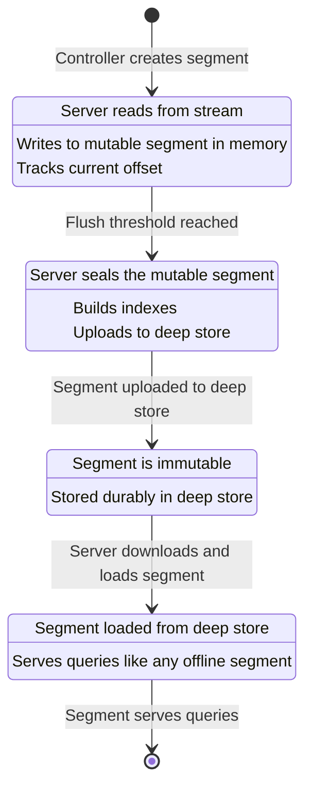
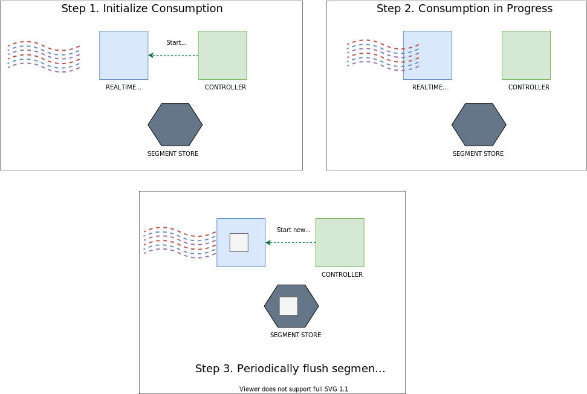

# 8. Stream Ingestion

# Why Stream Ingestion Matters

> [!IMPORTANT]
> Stream ingestion allows us to answer queries over data that arrived milliseconds ago. It is the operational foundation for query freshness and data completeness.

### The Risks of Misconfiguration

Misconfigured stream ingestion produces three classes of failure. Freshness gaps occur when tables fall behind topics and create data lag on dashboards. Performance degradation follows from poorly tuned flush thresholds that create too many tiny segments. Consumption stalls arise when decoder mismatches stop entire partitions without immediate alerts.

# How Stream Ingestion Works

We treat Pinot ingestion as a carefully orchestrated pipeline. Understanding these mechanics helps us make better configuration choices.

### Consumer Types: Our Standard vs Legacy

| Consumer Type | Status | Why we use it |
| :--- | :--- | :--- |
| **LowLevel (Partition based)** | **Recommended** | We get partition level parallelism and exactly once semantics. It allows for partition based routing optimizations. |
| **HighLevel (Group based)** | **Deprecated** | We avoid this because it lacks partition level offset tracking and adds unnecessary operational complexity. |

### Advantages of the LowLevel Model

The LowLevel consumer model provides three structural advantages. Independence means a slow partition does not block the rest of our stream. Precision means each segment covers a specific offset range for one partition. Routing means we can direct queries to specific servers based on partition keys.

> [!TIP]
> We always use LowLevel consumers for new deployments. If we find legacy tables using HighLevel consumers, we plan a migration immediately.

### Partition to Server Assignment

When we create a **REALTIME** table or trigger a rebalance, the Pinot controller determines the mapping between server instances and stream partitions.

#### The Assignment Algorithm

1. **Discovery:** We query the stream platform to find the total number of partitions for the topic.
2. **Identification:** We locate all server instances assigned to the table's server tenant.
3. **Distribution:** We spread partitions across servers using a balanced strategy while respecting the **replication factor**.
4. **Registration:** We create a consuming segment entry in **Helix** with the assigned server as the host.

### Balancing the Load

We want an even distribution to avoid **hot** servers. The table below shows how assignments scale based on replication.

| Resource | Example A (No Replication) | Example B (2x Replication) |
| :--- | :--- | :--- |
| **Kafka Partitions** | 12 | 12 |
| **Pinot Servers** | 4 | 4 |
| **Replication Factor** | 1 | 2 |
| **Load per Server** | 3 partitions | 6 consuming segments |

> [!TIP]
> **The Rule of Alignment:** We always aim for an even multiple between stream partitions and Pinot servers. A balanced arrangement of 12 partitions across 4 servers assigns 3 partitions per server. An imbalanced arrangement of 10 partitions across 3 servers forces one server to handle 4 partitions.

### Operational Heuristics

We align our architecture by matching partition counts to a multiple of our server count for maximum efficiency. We monitor Helix to verify that assignments match our expectations. When we add servers, we evaluate whether we also need to increase the partition count in the stream.

### The Consuming Segment Lifecycle

Every stream message that Pinot ingests passes through a well-defined segment lifecycle. Understanding these states is essential for monitoring and troubleshooting.




*Source: [Apache Pinot Documentation](https://docs.pinot.apache.org/basics/components)*

# The Segment Lifecycle

In a **REALTIME** table, segments move through four distinct states. This orchestration ensures we maintain a balance between immediate data availability and long term query performance.

### State Transitions

| State | Role | Query Capability |
| :--- | :--- | :--- |
| **CONSUMING** | Mutable inmemory structure receiving live stream records. | **Immediate:** Answers queries with sub second freshness. |
| **COMMITTING** | Threshold reached. We freeze the segment and build full indexes. | **Transitioning:** A new consuming segment starts simultaneously. |
| **COMMITTED** | The immutable segment is uploaded safely to deep store. | **Durable:** Data is now safe from server failures. |
| **ONLINE** | The segment is loaded on servers and actively serving queries. | **Optimal:** Full columnar indexing is active. |


# Offset Management

We track stream offsets at the segment level. This allows us to create a **gapless chain** of data across our cluster.

Each segment records its specific start and end offsets. The next segment in a partition always begins exactly where the last one ended, ensuring continuity. If a server restarts, it looks at the last committed offset and resumes, which provides **at least once** delivery semantics.

### First Time Consumption

When we connect to a stream for the first time, we use the `auto.offset.reset` setting. Setting it to `smallest` (earliest) starts consumption from the beginning of the stream history, ensuring no data is missed. Setting it to `largest` (latest) skips historical data and only consumes what arrives from that moment forward.

## Supported Stream Platforms

Pinot's stream ingestion is built on a pluggable architecture that allows it to consume from multiple stream platforms. Each platform has its own plugin that implements the stream consumer interface.

### Apache Kafka

Kafka is the primary and most mature stream platform supported by Pinot. The Kafka plugin has been in production at companies like LinkedIn, Uber and Stripe for years and is the most battle tested integration. It supports both the older `kafka-0.9` protocol and the modern `kafka-2.0` protocol (which is the recommended version for all new deployments).

The Kafka plugin supports all Kafka authentication mechanisms (SASL/PLAIN, SASL/SCRAM, SSL, Kerberos) and can consume from Kafka clusters running any version from 0.10 onward.

**Consumer factory class:** `org.apache.pinot.plugin.stream.kafka20.KafkaConsumerFactory`

### Amazon Kinesis

Pinot supports consuming from Amazon Kinesis streams through the Kinesis plugin. This is the natural choice for organizations running entirely on AWS. The Kinesis plugin maps Kinesis shards to Pinot's partition abstraction, meaning each shard is treated like a Kafka partition for the purposes of server assignment and offset tracking.

Key differences from Kafka: Kinesis uses sequence numbers instead of numeric offsets, shard splits and merges require careful handling and the throughput per shard is limited to 2 MB/s (which may require more shards than equivalent Kafka partitions).

**Consumer factory class:** `org.apache.pinot.plugin.stream.kinesis.KinesisConsumerFactory`

### Apache Pulsar

Apache Pulsar support is available through the Pulsar plugin. Pulsar's topic partition model maps naturally to Pinot's partition based consumption model. The plugin supports Pulsar's built in schema registry and both persistent and non persistent topics.

**Consumer factory class:** `org.apache.pinot.plugin.stream.pulsar.PulsarConsumerFactory`

### Custom Stream Plugins

Pinot's stream ingestion framework is designed as a plug-in architecture. If your organization uses a stream platform not natively supported (such as Azure Event Hubs, Google Pub/Sub or a proprietary messaging system), you can implement a custom stream plugin by extending the `StreamConsumerFactory` interface.

A custom plugin must satisfy four contracts. It must report the number of partitions for a given topic. It must support reading messages from a specific partition starting at a specific offset. It must support translating between Pinot's offset representation and the stream platform's native offset type. Finally, it must return raw message bytes that Pinot's decoder framework can process.

For most organizations, using Kafka, Kinesis or Pulsar covers the vast majority of stream ingestion needs. Custom plugins are most commonly needed for legacy internal messaging systems or for managed cloud services with proprietary APIs.

## Stream Configuration Deep Dive

The `streamConfigMaps` block within a realtime table's `ingestionConfig` is where every stream connection parameter is defined. This section provides a fully annotated configuration with explanations of every field and the trade-offs each setting represents.

```json
{
  "ingestionConfig": {
    "streamIngestionConfig": {
      "streamConfigMaps": [
        {
          "streamType": "kafka",

          "stream.kafka.topic.name": "trip-events",

          "stream.kafka.broker.list": "kafka-broker-1:9092,kafka-broker-2:9092,kafka-broker-3:9092",

          "stream.kafka.consumer.type": "lowlevel",

          "stream.kafka.consumer.factory.class.name": "org.apache.pinot.plugin.stream.kafka20.KafkaConsumerFactory",

          "stream.kafka.decoder.class.name": "org.apache.pinot.plugin.inputformat.json.JSONMessageDecoder",

          "stream.kafka.consumer.prop.auto.offset.reset": "smallest",

          "realtime.segment.flush.threshold.rows": "50000",

          "realtime.segment.flush.threshold.time": "1h",

          "realtime.segment.flush.threshold.segment.size": "200M",

          "stream.kafka.consumer.prop.max.poll.records": "500"
        }
      ]
    }
  }
}
```

### Flush Threshold Trade Off Summary

| Threshold | Low Value | High Value | Risk of Too Low | Risk of Too High |
|---|---|---|---|---|
| Row count | 5,000 | 500,000+ | Segment explosion, metadata bloat, increased controller load | Longer crash recovery, higher memory usage on servers |
| Time | 10 minutes | 6 hours | Many small segments for low throughput topics | Stale data in consuming segments if row threshold is never hit |
| Segment size | 50 MB | 500 MB | Premature commits for wide schemas or large messages | Memory pressure on servers, OOM risk |

> [!TIP]
> The optimal configuration depends on your message throughput, message size and operational tolerance for segment count. A good starting point for most workloads is 50,000 rows, 1 hour time threshold and 200 MB size threshold. Monitor segment creation rate and consuming segment sizes for the first week, then adjust.

## Topic Design Principles

The design of your stream topics has a direct impact on Pinot's ability to ingest, query and maintain your data. Topic design is not just a Kafka concern. It is a Pinot concern because topic structure dictates partition alignment, decoder compatibility, key semantics and schema evolution flexibility.

### Separating Event Streams from State Streams

One of the most important design decisions is whether to use a single topic for all data or to separate events from state. The recommendation is clear: **use separate topics for event data and state data**.

**Event streams** carry immutable facts: "a ride was requested," "a payment was processed," "a driver accepted a trip." These events are append only. You never update a past event. The Pinot table consuming from an event stream is a standard REALTIME table without upsert and queries typically aggregate over time ranges.

**State streams** carry the current representation of an entity: "the latest status of trip ABC is COMPLETED," "the current rating of driver XYZ is 4.8". These messages are keyed by entity ID and later messages for the same key supersede earlier ones. The Pinot table consuming from a state stream uses upsert mode and requires partition alignment (covered in detail in Chapter 9).

> [!IMPORTANT]
> Mixing events and state in a single topic forces compromises. You either enable upsert (which adds memory overhead and partition alignment requirements to what should be a simple append only workload) or you disable upsert (which means state queries return duplicates instead of latest values). Keeping them separate lets each table use the optimal configuration.

This repository follows this principle with two topics: `trip-events` for immutable event facts and `trip-state` for keyed latest state updates.

# Message Key Selection

For topics consumed by **upsert enabled** tables, the message key is the foundation of our data contract.

> [!IMPORTANT]
> The message key must match the primary key field in our Pinot table. This is a hard requirement. Kafka uses this key for partition assignment and Pinot requires all records for the same primary key to land on the same server partition.

### Example | Trip State

In this repository, we key every message in the `trip-state` topic by `trip_id`. This ensures all state updates for a specific trip route to the same Kafka partition and, consequently, the same Pinot server.

# Partition Count Alignment

The number of partitions in our stream topic determines our ingestion parallelism and data distribution. We choose partition counts that are even multiples of our Pinot server count (for example, 4 servers maps cleanly to 8, 12 or 16 partitions). More partitions allow for higher throughput since each is consumed by a separate thread. For upsert tables, we need enough partitions to distribute keys evenly while maintaining consistent hashing. We also select a count that accommodates 12 to 18 months of growth to avoid the disruption of re-partitioning later.

# Schema Registry Integration

When we use **Avro** or **Protobuf**, we rely on a schema registry for centralized management. We register schemas before producing messages to ensure every payload includes a valid schema ID (pre-registration). We point the Pinot decoder to our registry URL so it can fetch the writer schema dynamically. We prioritize **backward compatible** changes for our evolution strategy: adding optional fields is safe, but we coordinate removals carefully with our registry settings.

| Action | Risk Level | Requirement |
| :--- | :--- | :--- |
| **Add Optional Field** | Low | Update Pinot Schema |
| **Remove Field** | High | Coordination with Registry |
| **Change Data Type** | Critical | Breaking Change / New Table |

## Message Format and Decoding

Pinot must decode every message from the stream into a structured row before it can be appended to a consuming segment. The decoder is responsible for this translation and the choice of decoder must match the message format in the topic.

### JSON Decoding

JSON is the simplest format to use and the most forgiving when it comes to schema evolution. The JSON decoder extracts fields by name from each JSON object and maps them to columns in the Pinot schema. Fields present in the message but absent from the schema are silently ignored. Fields present in the schema but absent from the message receive default values (null or the column's default value).

```json
"stream.kafka.decoder.class.name": "org.apache.pinot.plugin.inputformat.json.JSONMessageDecoder"
```

JSON requires no external schema registry, produces human-readable messages and is easy to debug. The drawbacks are larger message size (field names are repeated in every message), no built-in type enforcement and slower parsing than binary formats.

JSON is the recommended format for development, testing and moderate-throughput production workloads. This repository uses JSON for all stream topics.

### Avro with Schema Registry

Avro is the standard format for high-throughput production Kafka pipelines. Avro messages are compact (field names are not repeated because they are defined in the schema) and support rich type definitions including nested records, arrays, maps, enums and unions.

When using Avro with Confluent Schema Registry:

```json
"stream.kafka.decoder.class.name": "org.apache.pinot.plugin.inputformat.avro.confluent.KafkaConfluentSchemaRegistryAvroMessageDecoder",
"stream.kafka.decoder.prop.schema.registry.rest.url": "http://schema-registry:8081"
```

The decoder fetches the writer schema from the registry using the schema ID embedded in each message, then uses that schema to deserialize the binary Avro payload. This means the Pinot decoder can handle messages written with different schema versions in the same topic, provided the schemas are backward compatible.

Avro's advantages are a compact binary format, schema evolution with compatibility enforcement and strong type safety. The drawbacks are a required running schema registry, messages that are not human-readable without tooling and an additional operational dependency.

### Protobuf Decoding

Protocol Buffers (Protobuf) is another binary format popular in organizations that use gRPC extensively. Pinot's Protobuf decoder requires a compiled `.desc` (descriptor) file that defines the message structure.

```json
"stream.kafka.decoder.class.name": "org.apache.pinot.plugin.inputformat.protobuf.ProtoBufMessageDecoder",
"stream.kafka.decoder.prop.descriptorFile": "/path/to/message.desc"
```

Protobuf is extremely compact with excellent backward and forward compatibility and is widely used in microservice architectures. The drawbacks are required compiled descriptor files, less flexible schema evolution than Avro and limited tooling for ad-hoc inspection.

### Custom Decoder Implementation

If your messages use a proprietary format or require custom deserialization logic, you can implement a custom decoder by extending the `StreamMessageDecoder` interface. The custom decoder must implement `init(Map<String, String> props, Set<String> fieldsToRead, String topicName)` for initialization with configuration properties and `decode(byte[] payload, GenericRow destination)` for decoding a raw message byte array into a Pinot `GenericRow`.

Register your custom decoder class in the stream config:

```json
"stream.kafka.decoder.class.name": "com.yourcompany.pinot.CustomMessageDecoder"
```

Custom decoders are most commonly used for messages that contain envelope metadata, require decryption or use internal serialization frameworks.

## Ingestion Transforms and Filters

Pinot provides the ability to transform and filter records at ingestion time, before they are written into consuming segments. These capabilities reduce the need for pre-processing pipelines and allow you to shape data as it enters Pinot.

### Transform Configurations

The `transformConfigs` block within `ingestionConfig` allows you to derive new column values from existing columns using Groovy expressions or Pinot's built-in transform functions.

```json
{
  "ingestionConfig": {
    "transformConfigs": [
      {
        "columnName": "event_date",
        "transformFunction": "toDateTime(event_time_ms, 'yyyy-MM-dd')"
      },
      {
        "columnName": "fare_per_km",
        "transformFunction": "fare_amount / distance_km"
      },
      {
        "columnName": "city_lower",
        "transformFunction": "lower(city)"
      },
      {
        "columnName": "event_epoch_seconds",
        "transformFunction": "toEpochSeconds(event_time_ms)"
      },
      {
        "columnName": "trip_category",
        "transformFunction": "Groovy({distance_km > 20 ? 'LONG' : 'SHORT'}, distance_km)"
      }
    ]
  }
}
```

> [!WARNING]
> Transform functions execute on every record as it is consumed. Keep transforms simple and computationally inexpensive. Complex Groovy expressions that perform string manipulation or conditional logic on every record add latency to the ingestion pipeline. If you need heavy transformation, consider performing it in a stream processing framework (Flink, Kafka Streams) before Pinot consumes the data.

### Filter Configurations

The `filterConfig` block allows you to drop records that match a specified condition. Filtered records are never written to the consuming segment, reducing storage usage and improving query performance by excluding irrelevant data.

```json
{
  "ingestionConfig": {
    "filterConfig": {
      "filterFunction": "Groovy({status == 'TEST' || status == 'INTERNAL'}, status)"
    }
  }
}
```

This filter drops all records where the `status` field is "TEST" or "INTERNAL," preventing test traffic from polluting analytical tables.

You can also use Pinot's SQL-like filter syntax:

```json
{
  "ingestionConfig": {
    "filterConfig": {
      "filterFunction": "strcmp(status, 'TEST') = 0"
    }
  }
}
```

> [!CAUTION]
> Filtered records are silently dropped. There is no dead-letter queue or audit trail for filtered records. If you need to audit what was filtered, log the filter decisions in your stream processing layer before Pinot. Filters are evaluated on every record, so the filter function must be fast. Filters apply to both stream and batch ingestion.

## Monitoring Stream Ingestion

A real time table that falls behind its stream without anyone noticing is worse than a table that is openly broken, because users trust the data without realizing it is stale. Monitoring stream ingestion is not optional. It is a core operational discipline.

### Consumer Lag Tracking

Consumer lag is the most important metric for stream ingestion health. It measures the difference between the latest offset in the stream partition and the offset that Pinot has consumed up to. A growing lag means Pinot is falling behind the data production rate.

Pinot exposes consumer lag through several mechanisms. The Controller API at `/tables/{tableName}/consumingSegmentsInfo` returns the current consuming offset and the latest stream offset for each partition, along with the computed lag. JMX metrics expose `LLC_PARTITION_CONSUMING_DELAY` per table and partition on each server. Pinot's built-in monitoring has the controller periodically check consuming segment status and generate alerts when lag exceeds a configurable threshold.

Set up alerting on consumer lag with the following thresholds as starting points:

| Severity | Lag Threshold | Action |
|---|---|---|
| Warning | > 10,000 messages for 5 minutes | Investigate server resource usage and network connectivity |
| Critical | > 100,000 messages for 15 minutes | Check for stuck consumers, partition reassignment issues or server failures |
| Emergency | > 1,000,000 messages or lag growing for 1 hour | Escalate immediately. Data freshness SLA is at risk |

### Consuming Segment Health

Beyond lag, you should monitor the health of consuming segments themselves. A sudden drop in the number of consuming segments per server indicates that a server has stopped consuming (likely due to a crash or connectivity issue). A sudden increase on one server indicates a rebalance that shifted load unevenly. A consuming segment that has been in the CONSUMING state for much longer than the configured flush time threshold is likely stuck. This can happen due to a slow commit, a deep store upload failure or a Helix state transition error. If a consuming segment's row count is not increasing while lag is growing, the consumer is stuck.

### Freshness Metrics

Query freshness is the end-to-end metric that matters most to users. It measures the time between when an event occurred in the real world and when it becomes queryable in Pinot.

You can measure freshness by querying the maximum value of the time column in the real time table and comparing it to the current wall clock time:

```sql
SELECT MAX(event_time_ms) AS latest_event,
       NOW() AS current_time,
       NOW() - MAX(event_time_ms) AS freshness_delay_ms
FROM trip_events
```

Freshness delay has several components: the time for the producer to publish the message, Kafka's internal replication latency, the time for Pinot's consumer to read the message and the time for the consuming segment to become queryable. In a healthy system, the total freshness delay is typically under 1 second.

## Handling Schema Evolution in Streams

Production stream schemas change over time. New fields are added, old fields are deprecated and field types occasionally change. Pinot handles schema evolution through a combination of decoder flexibility and explicit schema management.

### Adding New Columns

The most common schema evolution is adding a new field to the stream messages. The process proceeds in three steps.

1. **Update the stream schema.** If using Avro with Schema Registry, register a new schema version with the additional field and a default value. If using JSON, simply start producing messages with the new field.
2. **Update the Pinot schema.** Add the new column to the Pinot schema using the `PUT /schemas/{schemaName}` API or by uploading the updated schema JSON.
3. **Reload the table.** Execute a table reload so that existing segments pick up the new column definition. New consuming segments will automatically include the new column.

New columns in existing committed segments will return the default value (null or the configured default) for rows that were ingested before the column was added.

### Removing Columns

Removing a column from the Pinot schema does not delete data from existing segments. The column data remains in committed segments until those segments are replaced or aged out by retention policies. To fully remove a column, remove it from the Pinot schema, stop producing the field in stream messages, then wait for retention to age out segments that contain the old column or trigger a segment reload/rebuild.

### Changing Column Types

Changing a column's data type (for example, from INT to LONG or from STRING to INT) is the most disruptive form of schema evolution. It requires careful coordination: add a new column with the desired type, update producers to populate both the old and new columns during a transition period, migrate queries to use the new column, then remove the old column once all historical segments have aged out.

> [!WARNING]
> Never change a column type in place. The consuming segment decoder will fail if it encounters a message where a field's type does not match the expected schema type.

## Complete Annotated Stream Table Configuration

Here is a complete, production grade REALTIME table configuration that demonstrates all the concepts covered in this chapter:

```json
{
  "tableName": "trip_events",
  "tableType": "REALTIME",

  "segmentsConfig": {
    "timeColumnName": "event_time_ms",
    "schemaName": "trip_events",
    "replication": "1",
    "retentionTimeUnit": "DAYS",
    "retentionTimeValue": "30"
  },

  "tenants": {
    "broker": "DefaultBroker",
    "server": "DefaultServer"
  },

  "tableIndexConfig": {
    "loadMode": "MMAP",
    "invertedIndexColumns": [
      "city",
      "service_tier",
      "event_type",
      "status",
      "merchant_id"
    ],
    "rangeIndexColumns": [
      "event_time_ms",
      "fare_amount",
      "distance_km"
    ],
    "bloomFilterColumns": [
      "trip_id",
      "merchant_id",
      "driver_id"
    ],
    "jsonIndexColumns": [
      "attributes"
    ]
  },

  "fieldConfigList": [
    {
      "name": "event_time_ms",
      "encodingType": "RAW",
      "indexTypes": [
        "RANGE"
      ]
    }
  ],

  "quota": {
    "maxQueriesPerSecond": "200",
    "storage": "20G"
  },

  "routing": {
    "instanceSelectorType": "balanced"
  },

  "queryConfig": {
    "timeoutMs": 15000
  },

  "ingestionConfig": {
    "continueOnError": false,

    "streamIngestionConfig": {
      "streamConfigMaps": [
        {
          "streamType": "kafka",
          "stream.kafka.topic.name": "trip-events",
          "stream.kafka.broker.list": "kafka:19092",
          "stream.kafka.consumer.type": "lowlevel",
          "stream.kafka.consumer.factory.class.name": "org.apache.pinot.plugin.stream.kafka20.KafkaConsumerFactory",
          "stream.kafka.decoder.class.name": "org.apache.pinot.plugin.inputformat.json.JSONMessageDecoder",
          "stream.kafka.consumer.prop.auto.offset.reset": "smallest",
          "realtime.segment.flush.threshold.rows": "50000",
          "realtime.segment.flush.threshold.time": "1h",
          "realtime.segment.flush.threshold.segment.size": "200M"
        }
      ]
    },

    "transformConfigs": [
      {
        "columnName": "event_date",
        "transformFunction": "toDateTime(event_time_ms, 'yyyy-MM-dd')"
      }
    ]
  }
}
```

## Operating Heuristics for Real-Time Success

We treat these heuristics as our "Rules of Engagement" for maintaining a healthy, high-performance Pinot cluster.

We separate event streams (append-only) from state streams (upsert) to prevent unnecessary overhead and resource competition. We use `auto.offset.reset: smallest` by default to ensure we never miss data during a deployment or recovery. We verify decoder compatibility with sample data in a test environment before any production change. We treat **consumer lag** as a primary metric: if our lag exceeds our freshness promise, we trigger an alert immediately.

Flush thresholds are not "set and forget." During the first week of a new table deployment, we monitor segment creation rates, consuming segment sizes and total segment counts before making adjustments.

# Common Pitfalls & Solutions

Avoiding these common mistakes is the difference between a stable system and a production incident.

| Pitfall | Impact | Our Preventive Action |
| :--- | :--- | :--- |
| **Low Flush Thresholds** | Excessive segment counts and metadata bloat. | We tune thresholds based on throughput to avoid "tiny segment" syndrome. |
| **Keyless Upsert Messages** | Breaks upsert logic and data correctness. | We enforce a strict data contract where all upsert messages must have keys. |
| **Complex Groovy Transforms** | Massive CPU overhead and ingestion lag. | We keep transforms simple or pre-process data upstream in the stream processor. |
| **Manual Schema Updates** | New fields are ignored; queries may break. | We synchronize Pinot schema updates with stream evolution. |

> [!CAUTION]
> **Ingestion Hotspots:** We always check the ratio between Kafka partitions and Pinot servers. An uneven ratio (e.g., 10 partitions on 3 servers) creates a "hot" server that can lag behind the rest of the cluster.

# Practice Scenarios

The following scenarios test understanding of these operational principles.

1. **The Lifecycle Journey:** Trace a message from a Kafka producer until it is queryable in an `ONLINE` segment.
2. **Cluster Scaling:** With 24 partitions and 6 servers, each server handles 4 partitions. What specific imbalance occurs if we add a 7th server?
3. **Format Migration:** When moving from JSON to Avro, what must be configured beyond changing the decoder in order to communicate with a Schema Registry?
4. **Freshness Crisis:** A dashboard lag jumps from 1 second to 5 minutes. What are the first three things to check?

## Suggested Labs

[Lab 3: Stream Ingestion](../labs/lab-03-stream-ingestion.md) walks through creating Kafka topics, producing messages, configuring a REALTIME table and observing the consuming segment lifecycle.

## Repository Artifacts

The following files in this repository are directly relevant to the concepts discussed in this chapter:

| Artifact | Purpose |
| :--- | :--- |
| [`docker-compose.yml`](docker-compose.yml) | Defines the complete local Pinot cluster including controllers, brokers, servers and ZooKeeper |
| [`schemas/trip_events.schema.json`](schemas/trip_events.schema.json) | Demonstrates a schema definition for a stream-ingested table |
| [`tables/trip_events_rt.table.json`](tables/trip_events_rt.table.json) | Shows a REALTIME table configuration with stream ingestion settings |
| [`schemas/trip_state.schema.json`](schemas/trip_state.schema.json) | Demonstrates an upsert-enabled stream table schema |
| [`tables/trip_state_rt.table.json`](tables/trip_state_rt.table.json) | Demonstrates an upsert-enabled stream table configuration |
| [`labs/lab-03-stream-ingestion.md`](labs/lab-03-stream-ingestion.md) | Provides hands on experience with stream ingestion configuration and monitoring |

## Further Reading and Resources

[Official Stream Ingestion Documentation](https://docs.pinot.apache.org/basics/data-import/pinot-stream-ingestion) provides the canonical reference for stream ingestion in Apache Pinot. [Real-Time Analytics with Apache Pinot (YouTube)](https://www.youtube.com/watch?v=JV0WxBwJqKE) is a thorough walkthrough of stream ingestion, the consuming segment lifecycle and design rationale from the Pinot team. [Real-Time Ingestion in Apache Pinot (StarTree Blog)](https://startree.ai/blog/real-time-ingestion-in-apache-pinot) provides a detailed written companion covering stream ingestion best practices and troubleshooting.

*Next chapter: [9. Upsert, Dedup and CDC Patterns](./09-upsert-dedup-cdc.md)*

*Previous chapter: [7. Batch Ingestion](./07-batch-ingestion.md)*
