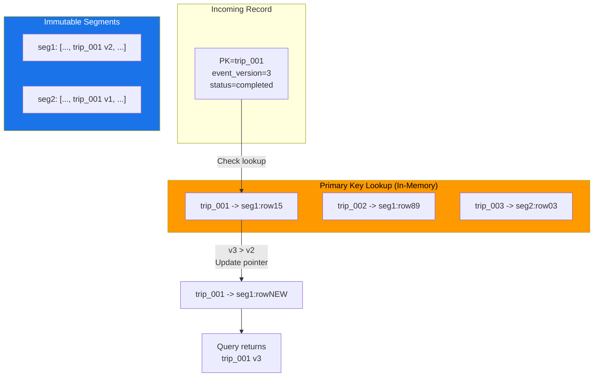
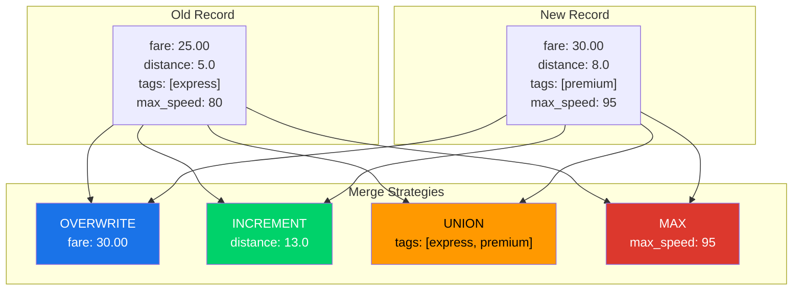
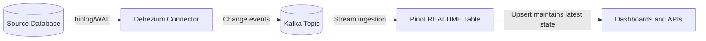
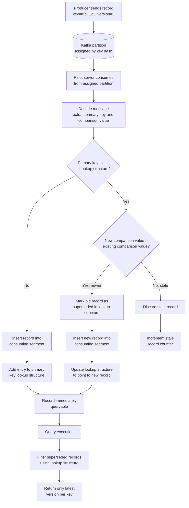

# 9. Upsert, Dedup and CDC Patterns

## Mastering Upsert and CDC

> [!IMPORTANT]
> In Pinot, an upsert is not an in place update. It is a **logical overlay**. Because Pinot segments are immutable, we do not overwrite rows. We simply point the query to the latest version.

### The Core Mechanics

When a new record arrives with an existing primary key, Pinot uses an inmemory **primary key lookup structure** (a hash map) to track the most recent record's location.



| Feature | Relational DB (RDBMS) | Apache Pinot |
| :--- | :--- | :--- |
| **Storage Type** | Row oriented | Columnar (Immutable Segments) |
| **Update Method** | In place overwrite | Logical overlay via metadata |
| **Primary Key** | Enforced at write time | Managed inmemory during ingestion |
| **Old Data** | Overwritten or moved to WAL | Remains in segment until compaction |

## The Three Pillars of Upsert

Every upsert configuration depends on three critical definitions in our table and schema configs.

### 1. Primary Key

We define this in the schema. It is the unique identifier (like `order_id` or `user_id`) that Pinot uses to determine if a record is a **new** entity or an **update**.

### 2. Comparison Column

This determines which record **wins** the update. We typically use a timestamp representing the most recent event time, a monotonically increasing version number or ingestion order (the record that arrives last is the default when no explicit comparison column is configured).

### 3. Upsert Mode

We decide how the update affects our data structure. In **FULL** mode the new record replaces the old one entirely. In **PARTIAL** mode we merge specific columns, for example, updating a "status" field while keeping the original "created_at" timestamp.

# The Architecture Tradeoffs

We must respect these constraints to avoid production incidents like memory exhaustion or stale reads. The lookup structure must hold every unique key in memory, so servers must be sized to accommodate the full key space. All records for the same key must land on the same server, which we achieve through consistent hashing on the stream side. Because we do not delete old records immediately, storage usage will be higher than the count of **latest** records alone.

## Upsert Modes

### FULL Upsert

FULL upsert is the simplest mode. When a new record arrives with the same primary key as an existing record, the entire old record is superseded by the new record. Every column value in the new record replaces the corresponding value from the old record. There is no column level merging.

```json
{
  "upsertConfig": {
    "mode": "FULL",
    "comparisonColumns": ["event_version"]
  }
}
```

FULL upsert is the right choice when producers always emit complete entity snapshots (every message contains all fields for the entity), when there is no need to merge partial updates from different producers and when you want the simplest mental model with the least configuration.

**How FULL upsert works internally:**

1. A new record arrives with primary key K and comparison value V_new.
2. Pinot checks the primary key lookup structure for key K.
3. If K does not exist, the record is inserted and the lookup structure is updated.
4. If K exists, Pinot retrieves the comparison value V_old of the existing record.
5. If V_new >= V_old, the lookup structure is updated to point to the new record. The old record is marked as superseded (it remains in its segment but is excluded from query results).
6. If V_new < V_old, the new record is discarded as a stale arrival.

### PARTIAL Upsert

PARTIAL upsert allows column level merge strategies. Instead of replacing the entire row, you specify how each column should be handled when a new record arrives. This is powerful for scenarios where different producers update different aspects of the same entity or where you want to maintain running aggregates.

```json
{
  "upsertConfig": {
    "mode": "PARTIAL",
    "partialUpsertStrategies": {
      "fare_amount": "OVERWRITE",
      "tip_amount": "OVERWRITE",
      "total_distance_km": "INCREMENT",
      "tags": "UNION",
      "rating_history": "APPEND",
      "max_speed_kmh": "MAX",
      "min_temperature_c": "MIN"
    },
    "defaultPartialUpsertStrategy": "OVERWRITE",
    "comparisonColumns": ["event_version"]
  }
}
```

**Available merge strategies:**



| Strategy | Behavior | Typical Use Case |
|---|---|---|
| `OVERWRITE` | New value replaces old value (same as FULL for this column) | Status fields, names, latest value attributes |
| `INCREMENT` | New value is added to the old value | Running totals, counters, cumulative metrics |
| `APPEND` | New value is appended to a multi value column | Event history lists, log trails |
| `UNION` | New multi value is merged with old multi value (deduped) | Tag sets, category memberships |
| `MAX` | The larger of the old and new values is retained | High water marks, peak values |
| `MIN` | The smaller of the old and new values is retained | Low water marks, minimum thresholds |

The `defaultPartialUpsertStrategy` applies to any column not explicitly listed in `partialUpsertStrategies`. Setting it to `OVERWRITE` means columns without a specific strategy behave like FULL upsert.

PARTIAL upsert is appropriate when different microservices update different columns of the same entity (for example, the payment service updates `fare_amount` while the routing service updates `total_distance_km`), when you need running counters or aggregations that accumulate over time and when you want to maintain multi value columns that grow as new events arrive.

### FULL vs PARTIAL: Comparison Table

| Dimension | FULL Upsert | PARTIAL Upsert |
|---|---|---|
| Mental model | Entire row replacement | Column level merge |
| Configuration complexity | Minimal | Requires per column strategy definitions |
| Producer requirements | Must emit complete snapshots | Can emit partial updates with only changed fields |
| Memory overhead | Primary key map only | Primary key map + previous row values for merge |
| Query correctness | Straightforward (latest row wins) | Requires careful strategy selection per column |
| Debugging difficulty | Low | Higher (merge logic can produce unexpected results if strategies are misconfigured) |
| Performance | Faster (no merge computation) | Slightly slower (merge computation per record) |

> [!TIP]
> Start with FULL upsert unless you have a clear, well understood requirement for partial updates. FULL upsert is easier to reason about, easier to debug and sufficient for the majority of upsert use cases. Migrate to PARTIAL only when you have confirmed that your producers cannot emit complete snapshots.


## Deduplication

### How Dedup Differs from Upsert

Deduplication (dedup) is a simpler capability than upsert. While upsert maintains the **latest** version of each record by primary key, dedup simply **drops duplicate records** that have the same primary key as an already ingested record. In dedup mode, the first record for a given primary key wins and all subsequent records with the same key are silently discarded.

There is no comparison column in dedup mode. There is no "newer version wins" logic. The only question dedup answers is: "has this key been seen before?"

### Configuration for Dedup Mode

```json
{
  "upsertConfig": {
    "mode": "NONE"
  },
  "dedupConfig": {
    "dedupEnabled": true
  }
}
```

Note that dedup uses a separate `dedupConfig` block rather than the `upsertConfig`. This reflects the fact that dedup and upsert are distinct features with different internal mechanisms, even though both use the primary key.

### When Dedup Is Preferable to Upsert

Dedup is the right choice in three situations. First, when your stream may deliver duplicate messages but duplicates are exact copies. This is common with at-least-once delivery guarantees in Kafka, where the same message may be delivered twice due to producer retries or consumer rebalances and you want to keep only the first copy. Second, when there is no concept of "newer version" because all duplicates are identical. If two records with the same key could have different column values, you need upsert (not dedup) to determine which one wins. Third, when you want lower memory overhead than upsert, since dedup requires the same primary key lookup structure but does not need to store comparison column values or support merge strategies.


## CDC (Change Data Capture) Patterns

### What CDC Is and How It Feeds Pinot

Change Data Capture (CDC) is a pattern for capturing row level changes (inserts, updates, deletes) from a source database and streaming them to downstream consumers. CDC tools like Debezium read the database's transaction log (e.g., MySQL binlog, PostgreSQL WAL) and produce a stream of change events that represent the exact sequence of mutations applied to each row.

CDC is the bridge between operational databases and analytical systems. Instead of running expensive batch ETL jobs that periodically snapshot entire tables, CDC streams individual row changes in near real time. Pinot consumes these change events through a standard stream ingestion pipeline and uses upsert to maintain the latest state of each row.

### Debezium + Kafka + Pinot Pipeline

The most common CDC pipeline for Pinot uses Debezium as the CDC tool, Kafka as the transport layer and Pinot as the analytical serving layer.



Setting up this pipeline requires four steps.

1. **Deploy Debezium.** Configure a Debezium connector for your source database (MySQL, PostgreSQL, MongoDB, etc.). Debezium reads the transaction log and produces change events to a Kafka topic, typically one topic per source table.
2. **Configure the Kafka topic.** The topic must use the source table's primary key as the Kafka message key. Debezium does this by default. Ensure the partition count aligns with your Pinot server count.
3. **Configure the Pinot table.** Create a REALTIME table with upsert enabled, using the source table's primary key as the Pinot primary key. The comparison column should be a monotonically increasing value such as the database transaction sequence number, the Debezium `ts_ms` field or an explicit version column.
4. **Handle the message format.** Debezium produces complex JSON envelopes that include `before` and `after` snapshots of the row, the operation type (`c` for create, `u` for update, `d` for delete) and metadata. You have two options: use Debezium's **flattened format** (via the `ExtractNewRecordState` single message transform in Kafka Connect) to produce simple JSON objects that Pinot's JSON decoder can parse directly or write a **custom Pinot decoder** that understands the Debezium envelope format and extracts the relevant fields.

> [!IMPORTANT]
> The flattened format is strongly recommended for simplicity.

### Handling INSERT, UPDATE, DELETE from CDC

CDC change events map to Pinot operations as follows. INSERT events create a new record in Pinot through normal stream ingestion with no special configuration. UPDATE events create a new record with the same primary key but updated column values. Pinot's upsert logic compares the new record against the existing one using the comparison column and retains the newer version automatically with FULL or PARTIAL upsert. DELETE events require special handling because Pinot does not natively support physical row deletion in real time tables. Instead, Pinot supports **soft deletes** through the `deleteRecordColumn` mechanism.

### Tombstone and Soft Delete Strategies

When a row is deleted in the source database, Debezium produces a delete event. To reflect this deletion in Pinot, you use the `deleteRecordColumn` feature:

```json
{
  "upsertConfig": {
    "mode": "FULL",
    "comparisonColumns": ["event_version"],
    "deleteRecordColumn": "is_deleted"
  }
}
```

When a record arrives with `is_deleted = true`, Pinot marks the primary key as deleted. Subsequent queries will not return this record. The record still exists physically in the segment (Pinot does not perform physical deletion), but it is excluded from query results.

Three important behaviors govern `deleteRecordColumn`. A deleted key can be "undeleted" if a new record arrives with `is_deleted = false` and a higher comparison column value, which supports scenarios where a source database row is deleted and then reinserted. The `deleteRecordColumn` must be a BOOLEAN column in the Pinot schema. Deleted records still consume memory in the primary key lookup structure, so a high volume of deletes can produce a larger-than-expected memory footprint.

For CDC pipelines, configure your Debezium flattening transform to set `is_deleted = true` on delete events and `is_deleted = false` on insert and update events.


## Primary Key Design

The primary key is the most consequential design decision in an upsert table. It determines correctness (which records are considered the same entity), memory usage (one entry per unique key in the lookup structure) and partition alignment requirements (all records for a key must reach the same server).

### Single Column Keys vs Composite Keys

**Single column keys** are the simplest and most common pattern. A single column (e.g., `trip_id`, `order_id`, `user_id`) uniquely identifies each entity.

```json
{
  "primaryKeyColumns": ["trip_id"]
}
```

**Composite keys** combine multiple columns to form a unique identifier. This is necessary when no single column is unique by itself.

```json
{
  "primaryKeyColumns": ["merchant_id", "event_date"]
}
```

With composite keys, the Kafka message key must be a composite of the same fields (typically concatenated with a delimiter). This ensures partition alignment.

### Impact on Memory

The primary key lookup structure stores one entry for every unique primary key in the table. Each entry contains the primary key value (or its hash), the segment ID where the latest record resides, the document ID within that segment and the comparison column value (for ordering decisions).

For a table with 100 million unique keys where each key is a 36-character UUID, the primary key lookup structure alone can consume several gigabytes of heap memory. This is in addition to the memory used for segment data and indexes.

**Memory estimation formula (approximate):**

```
Memory (bytes) = unique_key_count * (key_size + 32 bytes overhead)
```

For 100 million UUID keys: `100,000,000 * (36 + 32) = 6.8 GB`

### Sizing Considerations for High Cardinality Keys

When designing upsert tables with high cardinality keys (tens of millions or more unique values), three practices reduce memory pressure. Using hash based primary keys allows Pinot to represent any key as a 128-bit hash, which uses 16 bytes regardless of the original key length. Setting `metadataTTL` limits the time window of keys held in memory. If your use case only needs the latest state for records within the last 7 days, a TTL of 604800 seconds allows Pinot to evict older keys from the lookup structure. Monitoring heap usage on servers hosting upsert tables is essential because the primary key lookup structure is a major contributor to JVM memory pressure. Frequent garbage collection pauses are a signal that the lookup structure may be too large for the available heap.


## Comparison Column Strategy

### Using Version Numbers vs Timestamps

The comparison column determines which record wins when two records have the same primary key. The two most common strategies are monotonically increasing version numbers and timestamps.

**Version numbers** are the safer choice. A version number is an integer that is incremented every time the entity is updated. Version 5 always beats version 4, regardless of when each version was produced or ingested. Version numbers are immune to clock skew between producers and provide unambiguous ordering.

**Timestamps** are more convenient because they do not require producers to maintain a separate version counter. However, timestamps are vulnerable to clock skew between producer instances, time zone misconfiguration and the possibility that two updates to the same entity occur within the same millisecond.

> [!TIP]
> Use version numbers when your producers can reliably generate them (e.g., database sequence numbers, CDC transaction sequence numbers). Use timestamps only when version numbers are not available and ensure that your timestamp resolution is sufficient to distinguish concurrent updates.

### Out of Order Arrival Handling

In distributed systems, messages do not always arrive in the order they were produced. A version-5 update might arrive before a version-4 update due to network delays, Kafka partition reassignment or producer retry timing.

Pinot handles out of order arrivals correctly as long as a comparison column is configured. When a record arrives with a comparison value lower than the existing record's comparison value, the new record is discarded as stale. This ensures that a late arriving old version does not overwrite a newer version that has already been ingested.

Without a comparison column, Pinot uses ingestion order (last writer wins), which means out of order arrivals can cause the wrong version to be retained.

### Multiple Comparison Columns

Pinot supports multiple comparison columns for advanced ordering scenarios. When multiple comparison columns are specified, they are evaluated in order (like a composite sort key). The first column is compared first. If equal, the second column is compared and so on.

```json
{
  "upsertConfig": {
    "mode": "FULL",
    "comparisonColumns": ["event_version", "event_time_ms"]
  }
}
```

This is useful when your primary ordering is by version number but you need a tiebreaker for records that share the same version (which can happen during replays or migrations).


## Snapshot and Preload

### enableSnapshot for Faster Recovery

When a Pinot server restarts, it needs to rebuild the primary key lookup structure by scanning all segments assigned to it. For large tables with many segments and millions of unique keys, this process can take many minutes, during which the table is unavailable for queries on that server.

The `enableSnapshot` option persists the primary key lookup structure to disk periodically. When the server restarts, it loads the snapshot from disk instead of scanning all segments, dramatically reducing recovery time.

```json
{
  "upsertConfig": {
    "enableSnapshot": true
  }
}
```

> [!IMPORTANT]
> Enable snapshots for all production upsert tables. The disk space cost is small compared to the recovery time improvement.

### enablePreload for Faster Server Startup

The `enablePreload` option goes one step further than `enableSnapshot`. When enabled, the server loads upsert metadata during the initial segment loading phase (before the table is fully online), which reduces the time between server startup and query readiness.

```json
{
  "upsertConfig": {
    "enablePreload": true
  }
}
```

> [!TIP]
> Enable preload for tables where startup speed is critical, such as tables backing real time dashboards with strict availability SLAs.

### metadataTTL for Memory Management

The `metadataTTL` setting controls how long primary key entries are retained in the lookup structure. Keys that have not been updated within the TTL period are eligible for eviction. This is essential for tables with high key cardinality where retaining every key ever seen would exhaust server memory.

```json
{
  "upsertConfig": {
    "metadataTTL": 86400
  }
}
```

The value is in seconds. A TTL of 86400 means keys are evicted if they have not been updated in the last 24 hours.

> [!CAUTION]
> If an evicted key receives a new update after the TTL expires, Pinot will treat it as a new key rather than an upsert. This means the old record (in a committed segment) and the new record will both be visible in query results until the old segment is compacted or aged out by retention. Set the TTL to be longer than the maximum expected gap between updates for a given key.


## Partition Alignment for Upsert

Partition alignment is the single most important operational requirement for upsert correctness. If you get this wrong, your upsert table will produce incorrect results and the incorrectness will be subtle enough that you may not notice for weeks.

### Why All Records for the Same Key MUST Land on the Same Server

The primary key lookup structure is local to each server instance. Server A has its own lookup map and Server B has its own lookup map. They do not communicate with each other about which keys they have seen.

If records for the same primary key arrive on different servers, both servers will have an entry for that key, each pointing to its own latest record. When a query is executed, the broker fans out the query to all servers and merges the results. Since both servers return a record for the same key, the query result will contain duplicates.

This is not a bug. It is the expected behavior when partition alignment is broken. Upsert correctness fundamentally requires that all records for a given primary key are co-located on a single server.

### Kafka Partition Key Alignment

The alignment chain has three links.

1. **Kafka message key.** The producer must set the Kafka message key to the same value as the Pinot primary key. This ensures that all messages for the same entity go to the same Kafka partition (because Kafka's default partitioner hashes the key to determine the partition).
2. **Kafka partition-to-Pinot server mapping.** Pinot's LowLevel consumer assigns each Kafka partition to a specific server. As long as this mapping is stable (which it is, barring rebalances), all messages in a given partition go to the same server.
3. **Pinot primary key.** The primary key in the Pinot schema must match the field used as the Kafka message key.

If any link in this chain is broken, partition alignment fails.

### strictReplicaGroup Routing Requirement

For upsert tables, the routing configuration must use `strictReplicaGroup` instance selector:

```json
{
  "routing": {
    "instanceSelectorType": "strictReplicaGroup"
  }
}
```

Standard `balanced` routing distributes query segments across all servers, which means a query might read partition 1's data from Server A and partition 2's data from Server B. For append-only tables this is fine because data is independent across partitions. For upsert tables, this breaks correctness because a server can only correctly filter superseded records for the partitions it owns.

`strictReplicaGroup` routing ensures that all segments for a given partition are always queried from the same server. This guarantees that the server's primary key lookup structure has complete information for its assigned partitions.

### What Happens When Alignment Breaks

When partition alignment is broken, queries begin showing duplicate rows where two records with the same primary key both appear as "latest." `SELECT COUNT(*)` returns more rows than expected because superseded records are not being filtered. The same query may return different results depending on which servers the broker routes to.

Common causes of alignment breakage include changing the Kafka topic's partition count after Pinot has started consuming (this changes key-to-partition mapping), producers not setting the Kafka message key (causing round-robin partitioning), a Pinot server rebalance without a corresponding reconsolidation of the primary key lookup structure and using a hash function for the Kafka key that does not match Kafka's default partitioner.


## Production Considerations

### Memory Planning

Upsert tables consume significantly more memory than equivalent append only tables. For heap memory, estimate using the formula `unique_key_count * (key_size + 32)` bytes and add a 50% buffer for hash map overhead and growth. Direct memory for consuming segments holds data in off-heap memory proportional to row count and column width. GC pressure is real: the primary key map is a large, long-lived data structure. Use G1GC or ZGC with appropriate heap sizing and monitor GC pause times closely.

### Compaction

Over time, upsert tables accumulate superseded records in committed segments. These records are invisible to queries but still consume storage space and slow down segment loading. Pinot supports **segment compaction** through the Minion framework to physically remove superseded records.

Configure a periodic compaction task:

```json
{
  "task": {
    "taskTypeConfigsMap": {
      "UpsertCompactMergeTask": {
        "schedule": "0 0 2 * * ?",
        "bufferTimePeriod": "2d",
        "invalidRecordsThresholdPercent": "30",
        "invalidRecordsThresholdCount": "100000"
      }
    }
  }
}
```

This configuration runs compaction daily at 2 AM, targeting segments where more than 30% of records are superseded or where more than 100,000 records are invalid.

### Capacity Planning

When sizing a Pinot cluster for upsert workloads, plan for 2x to 3x the memory of an equivalent append only table due to primary key map overhead. Storage requirements are higher because superseded records are retained until compaction runs. Ingestion throughput is lower than append only because each record requires a primary key lookup and potential comparison. Many production deployments use a replication factor of 1 for upsert tables and rely on fast recovery from deep store snapshots, since each replica maintains its own independent primary key map, making a replication factor of 2 double the memory requirement for the lookup structure.


## Complete Annotated Upsert Table Configuration

```json
{
  "tableName": "trip_state",
  "tableType": "REALTIME",

  "segmentsConfig": {
    "timeColumnName": "last_event_time_ms",
    "schemaName": "trip_state",
    "replication": "1"
  },

  "tenants": {
    "broker": "DefaultBroker",
    "server": "DefaultServer"
  },

  "tableIndexConfig": {
    "loadMode": "MMAP",
    "invertedIndexColumns": [
      "city",
      "service_tier",
      "status",
      "merchant_id"
    ],
    "rangeIndexColumns": [
      "last_event_time_ms",
      "event_version",
      "fare_amount"
    ],
    "bloomFilterColumns": [
      "trip_id"
    ],
    "jsonIndexColumns": [
      "attributes"
    ]
  },

  "routing": {
    "instanceSelectorType": "strictReplicaGroup"
  },

  "upsertConfig": {
    "mode": "FULL",
    "comparisonColumns": [
      "event_version"
    ],
    "deleteRecordColumn": "is_deleted",
    "enableSnapshot": true,
    "enablePreload": false,
    "metadataTTL": 86400
  },

  "queryConfig": {
    "timeoutMs": 15000
  },

  "quota": {
    "maxQueriesPerSecond": "200",
    "storage": "20G"
  },

  "ingestionConfig": {
    "continueOnError": false,

    "streamIngestionConfig": {
      "streamConfigMaps": [
        {
          "streamType": "kafka",
          "stream.kafka.topic.name": "trip-state",
          "stream.kafka.broker.list": "kafka:19092",
          "stream.kafka.consumer.type": "lowlevel",
          "stream.kafka.consumer.factory.class.name": "org.apache.pinot.plugin.stream.kafka20.KafkaConsumerFactory",
          "stream.kafka.decoder.class.name": "org.apache.pinot.plugin.inputformat.json.JSONMessageDecoder",
          "stream.kafka.consumer.prop.auto.offset.reset": "smallest",
          "realtime.segment.flush.threshold.rows": "50000",
          "realtime.segment.flush.threshold.time": "1h"
        }
      ]
    }
  },

  "task": {
    "taskTypeConfigsMap": {
      "UpsertCompactMergeTask": {
        "schedule": "0 0 2 * * ?",
        "bufferTimePeriod": "2d",
        "invalidRecordsThresholdPercent": "30"
      }
    }
  }
}
```


## Upsert Flow Diagram

The following diagram illustrates the complete upsert flow from message production through query resolution:




## Operating Heuristics

Treat the producer key, primary key and comparison column as one design unit. These three elements are tightly coupled. A change to any one of them affects the correctness of the other two, so document and review them together.

Model delete behavior explicitly from day one. If your source system supports deletes, configure `deleteRecordColumn` before production traffic arrives. Retrofitting delete support after the table is live requires a schema change and potentially a full data reload.

Use deterministic replay data to test state reconciliation before production traffic arrives. Produce a known sequence of updates (including out of order arrivals and deletes) and verify that query results match expected values.

Run compaction regularly on upsert tables. Without compaction, superseded records accumulate indefinitely, consuming storage and slowing segment loads. Schedule compaction during off peak hours.

Set `metadataTTL` based on your data lifecycle. If records older than 7 days are never updated, a 7-day TTL frees memory from keys that will never be upserted again.

Size your server JVM heap with the primary key map in mind. The primary key map is the single largest contributor to heap usage on upsert servers. Undersizing the heap leads to frequent GC pauses and potential OOM crashes.

Accept single-replica for upsert tables if memory is constrained. Each replica maintains its own independent primary key map, so a replication factor of 2 doubles the memory requirement for the lookup structure. Many production deployments use replication factor 1 for upsert tables and rely on fast recovery from deep store snapshots.


## Common Pitfalls

Choosing a primary key that is not the true business identity creates ongoing reconciliation problems. If you use a synthetic ID as the primary key but your users think in terms of `order_id`, you will constantly struggle with mismatches between what the system tracks and what users expect.

Relying on event time alone when version semantics are clearer and safer introduces clock skew vulnerability. Two producers updating the same entity at nearly the same time can produce timestamps that are identical or inverted. Version numbers eliminate this ambiguity.

Forgetting to set the Kafka message key is the single most common upsert misconfiguration. Without a message key, Kafka distributes messages round-robin across partitions, which breaks partition alignment and causes duplicate rows in query results.

Using `balanced` routing instead of `strictReplicaGroup` distributes query segments across all servers without regard for partition ownership. For upsert tables, this causes queries to read records from servers that do not have complete primary key information, resulting in duplicates.

Underestimating memory requirements is a frequent mistake. A table with 500 million unique keys and 36-byte UUID primary keys requires approximately 34 GB of heap just for the primary key lookup structure, before accounting for segment data, indexes and JVM overhead.

Changing Kafka partition count after the table is live breaks which keys map to which partitions, severing the alignment chain. If you must repartition, you need to stop ingestion, rebuild the primary key lookup structure and resume from a consistent state.

Not running compaction on high-churn upsert tables allows superseded records to accumulate. A table where every key is updated hourly will accumulate 24 superseded versions per key per day. After a month without compaction, the vast majority of records in committed segments are invisible to queries but still consuming storage.

Setting `metadataTTL` too aggressively creates a scenario where the TTL is shorter than the maximum gap between updates for a key. Evicted keys will reappear as "new" records, causing duplicates until the old segments are compacted or expired.


## Practice Prompts

1. Explain the relationship between `trip_id` (the Kafka message key), `primaryKeyColumns` (in the schema) and `comparisonColumns` (in the table config) for the `trip_state` table. What breaks if any one of these is misconfigured?
2. Your source database has a `users` table with columns `user_id`, `name`, `email`, `city`, `signup_date` and `last_login`. Design a Pinot upsert table for this entity, including the schema, table config and CDC pipeline design. Justify your choice of primary key and comparison column.
3. Explain why a latest-state upsert table is not a substitute for historical event storage. Give a concrete example where you need both.
4. A developer proposes using PARTIAL upsert with the INCREMENT strategy for a `total_revenue` column. The idea is that each new order adds its `order_amount` to `total_revenue`. Explain the risks of this approach and suggest a safer alternative.
5. Your upsert table has 200 million unique keys. Each key is a composite of two columns: `merchant_id` (INT) and `event_date` (STRING, 10 characters). Estimate the memory required for the primary key lookup structure and recommend a server heap configuration.
6. Describe the sequence of events that occurs when a Pinot server hosting an upsert table crashes and restarts with `enableSnapshot: true`. What happens during recovery? What is the maximum data loss window?
7. A team is seeing duplicate records in their upsert table's query results. Walk through the debugging steps to identify and resolve the root cause, in order from most likely to least likely.


## Suggested Labs

[Lab 5: Upsert and CDC](../labs/lab-05-upsert-cdc.md) walks through configuring an upsert table, producing keyed state updates, observing upsert behavior through queries, simulating out of order arrivals and verifying delete semantics.


## Repository Artifacts

The following files in this repository are directly relevant to the concepts discussed in this chapter:

| Artifact | Purpose |
| :--- | :--- |
| [`schemas/trip_state.schema.json`](schemas/trip_state.schema.json) | Defines the schema with primary key columns for the upsert table |
| [`tables/trip_state_rt.table.json`](tables/trip_state_rt.table.json) | Contains the complete REALTIME table configuration with upsert settings |
| [`labs/lab-05-upsert-cdc.md`](labs/lab-05-upsert-cdc.md) | Provides hands on experience with upsert configuration and CDC patterns |


## Further Reading and Resources

[Official Upsert Documentation](https://docs.pinot.apache.org/basics/data-import/upsert) provides the canonical reference for upsert configuration in Apache Pinot. [Real-Time Analytics with Apache Pinot (YouTube)](https://www.youtube.com/watch?v=JV0WxBwJqKE) covers upsert implementation and design rationale from the Pinot team. [Upsert in Apache Pinot (StarTree Blog)](https://startree.ai/blog/upsert-in-apache-pinot) provides detailed guidance on upsert configuration and best practices. [Change Data Capture with Apache Pinot (StarTree Blog)](https://startree.ai/blog/change-data-capture-with-apache-pinot) covers CDC integration patterns with Pinot.


*Next chapter: [10. Querying Pinot: v1 SQL and Practical Patterns](./10-querying-v1-and-sql.md)*

*Previous chapter: [8. Stream Ingestion](./08-stream-ingestion.md)*
