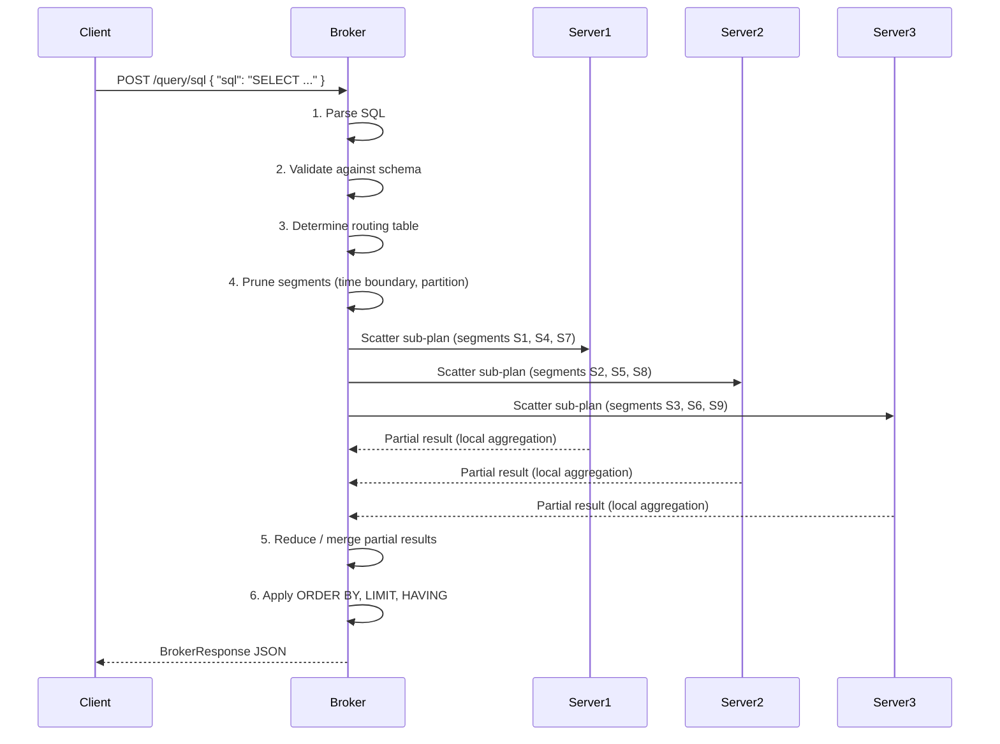
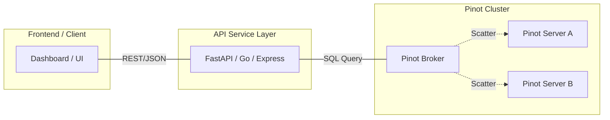

# 10. Querying Pinot | v1 SQL and Practical Patterns

# The Query Layer | Where Architecture Pays Off

> [!IMPORTANT]
> The query layer is the ultimate test of our design. Every choice we made regarding schemas, indexes and segments exists solely to answer analytical questions at high speed.

A well designed Pinot deployment can answer complex aggregations over billions of rows in **single digit milliseconds**. To realize this, we must query the system correctly to avoid timeouts and resource exhaustion. This chapter covers the scatter-gather model that distributes work across the cluster, the SQL patterns that Pinot rewards and the ones it punishes, how to interpret broker response metadata and timing results and how to build reliable service layers on top of the query engine.

## The Scatter Gather Model

Pinot uses a "v1" single stage query engine for most real time workloads. We use this model to achieve high concurrency and low latency.

| Phase | Our Action |
| :--- | :--- |
| **Scatter** | The Broker receives a SQL query and identifies which segments and servers hold the relevant data. It sends sub-queries to those servers. |
| **Local Processing** | Each Server processes the sub-query against its local segments, using indexes to prune data and perform aggregations. |
| **Gather** | The Broker collects the intermediate results from all servers, merges them and returns the final response to the user. |

## How Pinot Processes a Query

Understanding Pinot's query execution model is not optional. It is the foundation for writing performant queries and diagnosing slow ones. Pinot uses a **scatter gather** execution model that distributes query work across servers and merges results at the broker.

### The Scatter Gather Model

When a client submits a SQL query to a Pinot broker, the following sequence unfolds:



### Step-by-Step Walkthrough

**Step 1: SQL Parsing.** The broker parses the SQL text into a logical query plan. Pinot uses Apache Calcite as its SQL parser and optimizer. The parser validates syntax and translates the query into an internal representation.

**Step 2: Schema Validation.** The broker validates that every column referenced in the query exists in the target table's schema and that the operations requested are compatible with the column types. If you reference a nonexistent column, the query fails fast here rather than consuming server resources.

**Step 3: Routing.** The broker consults the routing table to determine which servers hold segments for the target table. The routing table is maintained by the broker through periodic updates from the controller and Helix. For tables with replica groups, the broker selects a specific replica for each segment to distribute load evenly.

**Step 4: Segment Pruning.** Before sending anything to servers, the broker eliminates segments that cannot possibly contain matching data. This pruning is based on segment level metadata. Time-based pruning eliminates segments whose time range does not overlap with the query's time filter. Partition-based pruning eliminates segments from partitions that do not match the query's partition filter when the table is partitioned by the filtered column. Bloom filter pruning eliminates segments where the Bloom filter confirms that the queried value does not exist.

> [!TIP]
> Effective pruning is one of the most impactful performance optimizations in Pinot. A query that touches 10 segments instead of 10,000 is roughly 1,000 times cheaper.

**Step 5: Scatter.** The broker sends the pruned query plan to each relevant server. Each server receives a list of segments to process and the query operators to execute. Servers process their segments in parallel, applying filters, indexes and aggregations locally.

**Step 6: Local Execution on Servers.** Each server applies column-level indexes (inverted, range, Bloom, text, JSON) to resolve filter predicates into document ID sets, reads the required columns from the forward index for matching documents, computes partial aggregations (SUM, COUNT, MIN, MAX, AVG, DISTINCTCOUNTHLL, etc.) locally and returns partial results to the broker.

**Step 7: Reduce and Merge.** The broker collects partial results from all servers and performs the final merge. For aggregation queries, partial aggregations are combined (partial SUMs are added together). For GROUP BY queries, groups from different servers are merged. ORDER BY and LIMIT are applied at the broker level after merging.

**Step 8: Response.** The broker assembles the final BrokerResponse JSON and returns it to the client.

### Why This Model Matters for Query Design

The scatter gather model has several implications that should shape how you write queries. Filters are your most powerful tool: the more selective your WHERE clause, the fewer documents each server must process and filters that align with indexes are essentially free. Aggregations are preferred over raw row returns because servers send small partial results to the broker rather than serializing and transmitting massive row payloads. Even with a `LIMIT 10` clause, every server must still compute its full partial result before the broker applies the limit. This is why unbounded GROUP BY queries with millions of groups can be expensive despite a small result set. The broker is also a single point of merge: if your query produces an enormous intermediate result set (millions of groups or millions of raw rows), the broker must hold all of it in memory during the reduce phase and this is the most common cause of broker OOM errors.


## SQL Compatibility

Pinot implements a substantial subset of ANSI SQL, but it is not a general-purpose SQL database. Understanding what it supports and what it does not will save you from frustration and wasted debugging time.

### What Pinot SQL Supports

Pinot's SQL support covers SELECT with column projections, expressions and aliases, as well as FROM a single table (v1 engine) or multiple tables with JOINs (MSE only, covered in Chapter 11). The WHERE clause supports equality, comparison, range, IN, NOT IN, BETWEEN, IS NULL, IS NOT NULL, LIKE, REGEXP_LIKE, TEXT_MATCH and JSON_MATCH predicates. GROUP BY accepts one or more columns or expressions. ORDER BY supports ASC/DESC on one or more columns. LIMIT and OFFSET provide result set pagination. HAVING enables post-aggregation filtering.

Aggregation functions include COUNT, SUM, AVG, MIN, MAX, DISTINCTCOUNT, DISTINCTCOUNTHLL, DISTINCTCOUNTSMARTHLL, PERCENTILE, PERCENTILETDIGEST, PERCENTILEEST and many more. Transform functions include DATETIMECONVERT, DATE_TRUNC, DATETRUNC, CAST, CASE WHEN, COALESCE, string functions (UPPER, LOWER, SUBSTR, CONCAT), math functions and JSON functions. The DISTINCT keyword, CASE WHEN / THEN / ELSE logic and multi-value column operations (MV_TO_ARRAY, VALUEIN and other multi-value functions) are all supported.

### What Pinot SQL Does NOT Support (v1 Engine)

| Unsupported Feature | Explanation |
| :--- | :--- |
| UPDATE, DELETE, INSERT | Pinot is an analytical store. Data enters through ingestion pipelines (batch or streaming), not through SQL DML. |
| DDL statements | Schema and table management is done through the controller REST API, not through SQL. |
| JOINs | The v1 single stage engine does not support JOINs. Use the Multi-Stage Engine (MSE) covered in Chapter 11. |
| Subqueries | The v1 engine has very limited subquery support. Correlated subqueries and most nested SELECT statements are not supported. MSE provides broader capabilities. |
| UNION, INTERSECT, EXCEPT | Set operations are not available in the v1 engine. Use MSE. |
| Window functions | ROW_NUMBER, RANK, LAG, LEAD, SUM OVER and other window functions require MSE. |
| Common Table Expressions | WITH clauses are not supported in v1. |
| Full outer joins | Even in MSE, some join types have limitations. See Chapter 11 for details. |

### PQL vs SQL

Historically, Pinot used a proprietary query language called PQL (Pinot Query Language). PQL has been deprecated in favor of standard SQL syntax. All new development should use the SQL endpoint (`/query/sql`). If you encounter PQL in older documentation or codebases, convert it to SQL. The two key differences were that PQL used `TOP` instead of `LIMIT` and PQL had different aggregation syntax for certain functions.


## Query Patterns That Work Well

The following query patterns are designed to exploit Pinot's architecture for maximum performance. Each example is annotated with explanations of why it performs well.

### Time-Windowed Aggregations

```sql
SELECT
  city,
  COUNT(*) AS trip_count,
  SUM(fare_amount) AS total_fare,
  AVG(fare_amount) AS avg_fare
FROM trip_events
WHERE event_time_ms > NOW() - 86400000
GROUP BY city
ORDER BY total_fare DESC
LIMIT 50
```

**Why this is fast:** The time filter on `event_time_ms` allows the broker to prune all segments outside the 24-hour window. If your table retains 30 days of data and segments are created hourly, this query touches roughly 24 segments out of 720 total. The `city` column likely has low cardinality (tens to hundreds of unique values), so the GROUP BY merge at the broker is cheap. The aggregation functions (COUNT, SUM, AVG) all support partial aggregation, meaning each server computes local totals and the broker simply combines them.

### Top-N Queries

```sql
SELECT
  merchant_id,
  merchant_name,
  SUM(fare_amount) AS gmv,
  COUNT(*) AS order_count
FROM trip_state
WHERE status = 'completed'
  AND last_event_time_ms > 1700000000000
GROUP BY merchant_id, merchant_name
ORDER BY gmv DESC
LIMIT 20
```

**Why this is fast:** The combination of ORDER BY and LIMIT allows servers to maintain a bounded heap of top-N candidates rather than tracking every group. The equality filter on `status` leverages an inverted index. The time filter enables segment pruning.

### Filtered Aggregations

```sql
SELECT
  city,
  COUNT(*) FILTER (WHERE status = 'completed') AS completed_count,
  COUNT(*) FILTER (WHERE status = 'cancelled') AS cancelled_count,
  SUM(fare_amount) FILTER (WHERE status = 'completed') AS completed_gmv,
  SUM(fare_amount) FILTER (WHERE status = 'cancelled') AS cancelled_gmv
FROM trip_state
WHERE city = 'San Francisco'
  AND last_event_time_ms > NOW() - 604800000
GROUP BY city
```

Alternatively, using CASE WHEN (supported in older Pinot versions where FILTER is unavailable):

```sql
SELECT
  city,
  SUM(CASE WHEN status = 'completed' THEN 1 ELSE 0 END) AS completed_count,
  SUM(CASE WHEN status = 'cancelled' THEN 1 ELSE 0 END) AS cancelled_count,
  SUM(CASE WHEN status = 'completed' THEN fare_amount ELSE 0 END) AS completed_gmv,
  SUM(CASE WHEN status = 'cancelled' THEN fare_amount ELSE 0 END) AS cancelled_gmv
FROM trip_state
WHERE city = 'San Francisco'
  AND last_event_time_ms > NOW() - 604800000
GROUP BY city
```

**Why this is fast:** Both approaches compute multiple conditional aggregations in a single scan of the data. This is far more efficient than running separate queries for each status value. The equality filter on `city` with an inverted index sharply reduces the number of documents scanned.

### DISTINCT Queries

```sql
SELECT DISTINCT service_tier
FROM trip_events
WHERE event_time_ms > NOW() - 3600000
ORDER BY service_tier
```

**Why this is fast:** The DISTINCT operation on a low-cardinality column is efficiently implemented. Each server computes its local set of unique values and the broker takes the union. With a tight time window, segment pruning further reduces the work.

> [!CAUTION]
> DISTINCT on high cardinality columns (like `trip_id` or `user_id`) can be expensive because each server must track and transmit a large set of unique values. Use `DISTINCTCOUNT` or `DISTINCTCOUNTHLL` if you only need the count of distinct values rather than the values themselves.

### Multi-Value Column Queries

```sql
SELECT
  city,
  COUNT(*) AS premium_trip_count
FROM trip_events
WHERE event_time_ms > NOW() - 86400000
  AND VALUEIN(tags, 'premium') > 0
GROUP BY city
ORDER BY premium_trip_count DESC
LIMIT 20
```

```sql
SELECT
  tag,
  COUNT(*) AS occurrence_count
FROM trip_events,
  UNNEST(tags) AS tag
WHERE event_time_ms > NOW() - 86400000
GROUP BY tag
ORDER BY occurrence_count DESC
LIMIT 50
```

**Why this is fast:** Pinot stores multi value columns in a format optimized for membership testing. The inverted index on a multi value column maps each value to the rows that contain it, making `VALUEIN` predicates index-friendly. Unnesting is a local operation on each server.


## Query Patterns to Avoid

Not every query shape is a good fit for Pinot. The following patterns are known to cause performance problems and should be restructured or avoided entirely.

### Unbounded SELECT Star

```sql
SELECT *
FROM trip_events
WHERE event_time_ms > NOW() - 86400000
```

**Why this is expensive:** `SELECT *` forces servers to read every column from the forward index for every matching row. If the table has 30 columns and the time window contains 10 million rows, each server must serialize and transmit massive payloads. The broker must hold all of this in memory during the merge phase. Always project only the columns you need and add a LIMIT clause.

### GROUP BY on High-Cardinality Columns Without LIMIT

```sql
SELECT
  user_id,
  COUNT(*) AS trip_count
FROM trip_events
GROUP BY user_id
```

**Why this is expensive:** If `user_id` has 50 million unique values, every server must maintain 50 million group entries, serialize them and send them to the broker. The broker then must merge 50 million groups from multiple servers. This easily causes broker OOM errors. Always add ORDER BY and LIMIT when grouping by high cardinality columns. If you truly need all groups, consider whether Pinot is the right tool for that query or whether a batch processing system like Spark or Presto is more appropriate.

### Complex String Transformations in WHERE Clauses

```sql
SELECT city, COUNT(*)
FROM trip_events
WHERE LOWER(city) = 'san francisco'
  AND SUBSTR(merchant_name, 1, 3) = 'Ace'
GROUP BY city
```

**Why this is expensive:** When you wrap a column in a function within a WHERE clause, Pinot cannot use the inverted index on that column. Instead, it must evaluate the function on every row. If you need case-insensitive matching, normalize the data at ingestion time by adding a lowercase transform column. If you need prefix matching, use an FST index with `LIKE 'Ace%'` instead of SUBSTR.

### Repeated Single-Row Lookups at High Concurrency

```sql
SELECT * FROM trip_state WHERE trip_id = 'abc-123-def-456'
```

**Why this is a poor fit:** While this query will work (especially with a Bloom filter for segment pruning), Pinot is architecturally optimized for analytical aggregation queries, not key value lookups. If you have thousands of concurrent single row lookups per second, a dedicated key value store like Redis, Cassandra or DynamoDB will serve this workload far more efficiently. Use Pinot for the analytical aggregations that those stores cannot do.

### Large OFFSET Values for Pagination

```sql
SELECT trip_id, fare_amount
FROM trip_events
WHERE event_time_ms > NOW() - 86400000
ORDER BY fare_amount DESC
LIMIT 10 OFFSET 100000
```

**Why this is expensive:** Pinot must compute and sort the first 100,010 results, then discard the first 100,000. Each server must track and transmit at least 100,010 rows to the broker. For deep pagination, consider using a cursor-based approach with a WHERE clause that filters on the last seen value instead of using OFFSET.

### Cross-Column Expressions Without Supporting Indexes

```sql
SELECT COUNT(*)
FROM trip_events
WHERE fare_amount + tip_amount > 100
  AND CONCAT(city, '-', service_tier) = 'NYC-premium'
```

**Why this is expensive:** Neither expression can leverage an index. The `fare_amount + tip_amount` computation requires reading both columns for every row. The CONCAT expression prevents inverted index use on either `city` or `service_tier`. Restructure by filtering on individual columns: `WHERE city = 'NYC' AND service_tier = 'premium' AND fare_amount > 80`.


## Query Options

Pinot supports query-level options that modify execution behavior. These options are passed as part of the query request and control everything from engine selection to timeout behavior.

### How to Pass Query Options

Query options can be passed in three ways.

In the SQL text using SET statements:
```sql
SET useMultistageEngine = true;
SET timeoutMs = 30000;
SELECT city, COUNT(*) FROM trip_events GROUP BY city
```

In the JSON request body:
```json
{
  "sql": "SELECT city, COUNT(*) FROM trip_events GROUP BY city",
  "queryOptions": "useMultistageEngine=true;timeoutMs=30000"
}
```

As a query parameter string (legacy format):
```
useMultistageEngine=true;timeoutMs=30000
```

### Key Query Options

| Option | Default | Description |
|---|---|---|
| `useMultistageEngine` | `false` | Routes the query to the Multi-Stage Engine (v2) instead of the single stage engine. Required for JOINs, window functions, subqueries and set operations. |
| `timeoutMs` | Broker config default (typically 10000) | Maximum time in milliseconds the broker will wait for server responses. If any server exceeds this timeout, the broker returns a partial result with a timeout exception noted in the response metadata. |
| `skipUpsert` | `false` | When set to `true` on an upsert-enabled table, skips the upsert resolution logic and returns raw data including older versions of updated rows. Useful for debugging and data auditing. |
| `enableNullHandling` | `false` | Enables SQL-standard NULL semantics. Without this option, Pinot treats NULL as the default value for the column type (0 for numbers, empty string for strings). With this option, NULL values are handled according to standard SQL three valued logic. |
| `maxExecutionThreads` | Server config default | Controls the number of threads a server uses to process segments for this query. Reducing this can prevent a single expensive query from monopolizing server resources. |
| `numReplicaGroupsToQuery` | 1 | Number of replica groups to fan out to. Increasing this can improve availability at the cost of increased cluster load. |
| `minSegmentGroupTrimSize` | Varies | Controls intermediate result trimming during the GROUP BY reduce phase. Lower values reduce memory usage but may lose precision for approximate results. |
| `minServerGroupTrimSize` | Varies | Controls trimming at the server level before results are sent to the broker. Useful for controlling network transfer size. |
| `maxRowsInJoin` | 1048576 | Maximum number of rows materialized during a lookup join in the v1 engine (for dimension table lookups). |

### Timeout Behavior

Understanding timeout behavior is critical for production systems. When `timeoutMs` is exceeded, the broker returns whatever partial results it has collected so far. The `exceptions` array in the BrokerResponse will contain a timeout error. The `numServersResponded` field may be less than `numServersQueried`. Servers that are still processing will eventually complete and discard their results.

> [!TIP]
> For user facing applications, set `timeoutMs` to a value slightly below your application's own timeout. If your API has a 5-second timeout, set Pinot's `timeoutMs` to 4000 to allow time for response serialization and network transfer.


## BrokerResponse Anatomy

Every query to Pinot returns a BrokerResponse JSON object. Understanding its structure is essential for building robust client applications and debugging query performance issues.

### Response Structure

```json
{
  "resultTable": {
    "dataSchema": {
      "columnNames": ["city", "trip_count", "total_fare"],
      "columnDataTypes": ["STRING", "LONG", "DOUBLE"]
    },
    "rows": [
      ["San Francisco", 152847, 4892341.50],
      ["New York", 203912, 6128734.25],
      ["Chicago", 89234, 2341567.75]
    ]
  },
  "exceptions": [],
  "numServersQueried": 4,
  "numServersResponded": 4,
  "numSegmentsQueried": 847,
  "numSegmentsProcessed": 847,
  "numSegmentsMatched": 312,
  "numConsumingSegmentsQueried": 12,
  "numConsumingSegmentsProcessed": 12,
  "numConsumingSegmentsMatched": 12,
  "numDocsScanned": 2847123,
  "numEntriesScannedInFilter": 5694246,
  "numEntriesScannedPostFilter": 8541369,
  "numGroupsLimitReached": false,
  "totalDocs": 158234567,
  "timeUsedMs": 47,
  "minConsumingFreshnessTimeMs": 1700000000000,
  "requestId": "a1b2c3d4-e5f6-7890-abcd-ef1234567890",
  "traceInfo": {}
}
```

### Field by Field Explanation

**Result Fields:**

`resultTable.dataSchema` contains the column names and their data types in the result set. This is the contract your application code should parse against. `resultTable.rows` contains the actual result data as an array of arrays, where each inner array corresponds to one result row with values in the same order as the column names.

**Server and Segment Metrics:**

`numServersQueried` reports how many servers the broker sent the query to; a lower-than-expected value indicates a routing table or server health issue. `numServersResponded` reports how many servers returned results before the timeout; a value less than `numServersQueried` indicates a timeout or server failure. `numSegmentsQueried` is the total number of segments the broker identified as potentially relevant after initial routing. `numSegmentsProcessed` is the number of segments servers actually processed, which can be less if server-side pruning eliminated additional segments. `numSegmentsMatched` is the number of segments that actually contained matching documents; a large gap between `numSegmentsProcessed` and `numSegmentsMatched` suggests that Bloom filter or partition pruning could be improved. The `numConsumingSegments` variants report the same metrics specifically for consuming (realtime, not yet committed) segments.

**Scan Metrics:**

`numDocsScanned` is the total number of documents (rows) that passed all filter predicates across all servers. `numEntriesScannedInFilter` is the total number of index entries or column values evaluated to resolve the WHERE clause predicates; if this number approaches `totalDocs`, your filters are not using indexes effectively. `numEntriesScannedPostFilter` is the total number of column values read from the forward index after filtering for projection or aggregation, reflecting the cost of reading selected columns. `totalDocs` is the total number of documents across all queried segments before any filtering; the ratio `numDocsScanned / totalDocs` tells you how selective your filters are.

**Performance Metrics:**

`timeUsedMs` is the total wall clock time in milliseconds from query receipt to response, including parsing, routing, pruning, scatter, server execution, gather and reduce. `minConsumingFreshnessTimeMs` is the oldest event timestamp across all consuming segments; a large gap between this value and the current time indicates ingestion lag.

**Error Handling:**

`exceptions` is an array of error objects. An empty array means the query succeeded completely; partial failures (such as one server timing out) will appear here. Always check this array in production client code. `numGroupsLimitReached` is a boolean indicating whether the GROUP BY result was truncated because the number of groups exceeded the server side limit; if `true`, your results are incomplete.

### Using BrokerResponse Metrics for Performance Tuning

| Symptom | Metric Pattern | Likely Cause | Action |
|---|---|---|---|
| Slow query | `numEntriesScannedInFilter` close to `totalDocs` | Filters not using indexes | Add inverted or range index on filtered columns |
| Slow query | `numSegmentsProcessed` much higher than `numSegmentsMatched` | Poor segment pruning | Add time based filters or Bloom filters |
| Broker timeout | `numServersResponded` < `numServersQueried` | One or more servers too slow | Check server resource utilization, reduce query scope |
| Incomplete results | `numGroupsLimitReached` = `true` | Too many groups | Add LIMIT, reduce GROUP BY cardinality or increase `groupByMaxGroupLimit` |
| Stale results | `minConsumingFreshnessTimeMs` far from current time | Ingestion lag | Check Kafka consumer lag, stream ingestion health |


## Building Production Query Services

In production systems, you should almost never expose raw Pinot SQL to end users or frontend applications. Instead, wrap Pinot behind application APIs that provide stable contracts, input validation and query guardrails.

### The Service Layer Pattern



### Why a Service Layer Is Essential

A service layer serves several critical functions. Input validation and sanitization ensure that time ranges are reasonable, filter values are from an allowed set and cardinality-busting parameters are rejected before they reach Pinot. Query parameterization prevents SQL injection and ensures consistent query shapes. Never concatenate user input directly into SQL strings. Timeout management allows your service layer to set appropriate `timeoutMs` values per endpoint and handle partial results gracefully. Result caching provides a short-TTL cache (5 to 30 seconds) for dashboard queries that do not require sub-second freshness, which can reduce Pinot load by 10x or more during traffic spikes. Rate limiting at the API layer protects your Pinot cluster from runaway clients. Schema evolution isolation means that when you rename a column or change a table structure, only the service layer needs to be updated while client applications continue using the same API contract.

### Example: A Production KPI Endpoint

```python
from fastapi import FastAPI, Query, HTTPException
from datetime import datetime, timedelta
import httpx

app = FastAPI()

PINOT_BROKER = "http://pinot-broker:8099"

@app.get("/api/v1/kpis/city-summary")
async def city_summary(
    hours: int = Query(default=24, ge=1, le=168),
    min_trips: int = Query(default=10, ge=1),
    limit: int = Query(default=50, ge=1, le=500),
):
    cutoff_ms = int((datetime.utcnow() - timedelta(hours=hours)).timestamp() * 1000)

    sql = f"""
        SELECT
            city,
            COUNT(*) AS trip_count,
            SUM(fare_amount) AS total_fare,
            AVG(fare_amount) AS avg_fare
        FROM trip_events
        WHERE event_time_ms > {cutoff_ms}
        GROUP BY city
        HAVING COUNT(*) >= {min_trips}
        ORDER BY total_fare DESC
        LIMIT {limit}
    """

    async with httpx.AsyncClient(timeout=5.0) as client:
        response = await client.post(
            f"{PINOT_BROKER}/query/sql",
            json={"sql": sql, "queryOptions": "timeoutMs=4000"},
        )

    if response.status_code != 200:
        raise HTTPException(status_code=502, detail="Pinot query failed")

    data = response.json()

    if data.get("exceptions"):
        raise HTTPException(status_code=502, detail="Pinot returned exceptions")

    columns = data["resultTable"]["dataSchema"]["columnNames"]
    rows = data["resultTable"]["rows"]

    return {
        "data": [dict(zip(columns, row)) for row in rows],
        "meta": {
            "query_time_ms": data.get("timeUsedMs"),
            "docs_scanned": data.get("numDocsScanned"),
            "segments_matched": data.get("numSegmentsMatched"),
        },
    }
```

### Query Template Best Practices

Parameterize time ranges by accepting relative time windows (last N hours) and computing the epoch cutoff in service code. Never hardcode timestamps. Bound LIMIT values by enforcing a maximum in your API (such as 500 or 1000) to prevent clients from requesting unbounded result sets. Validate filter values before constructing SQL when a filter parameter like `city` or `status` should be from a known set. Log the `timeUsedMs`, `numDocsScanned` and `numSegmentsMatched` values from every query for monitoring and alerting, as these metrics are your early warning system for performance regressions. Store query templates alongside your table configs in version control and update corresponding queries in the same commit when a table schema changes.

# Querying Heuristics for Production

We follow these guidelines to ensure our **hot path** queries remain fast and our cluster stays healthy during traffic spikes. Every production query should be small, explicit and bounded. Never run a query without a time range on tables with high data volume. Select only the columns you actually need to reduce serialization and network costs. Use LIMIT to prevent massive result sets from overwhelming the broker.

# Common Pitfalls & Performance Killers

| Pitfall | Impact | Our Strategy |
| :--- | :--- | :--- |
| **Warehouse-Style Scans** | Resource exhaustion on the hot path. | We route massive ad-hoc scans to Trino or Spark and keep Pinot for low-latency serving. |
| **Wide SELECT Statements** | Increased memory pressure and network transfer. | We are surgical with our projections and avoid `SELECT *`. |
| **Ignoring Exceptions** | We miss partial failures and resource warnings. | We always inspect the `exceptions` array in the `BrokerResponse`. |
| **Missing Time Filters** | Every segment in the table is touched. | We enforce time filters to enable segment pruning. |

# Query Mastery Practice

The following scenarios test real-world application of these principles.

1. **API Design:** Why is a curated endpoint like `/api/v1/kpis` better than letting a frontend app send raw SQL? Consider both security and contract stability.
2. **The "100x Slower" Mystery:** If a `COUNT(*)` is fast but a `GROUP BY` on the same data is slow, which metrics in the `BrokerResponse` would you check first?
3. **The Scan Ratio:** If `numEntriesScannedInFilter` equals `totalDocs` (100 million) but `numDocsScanned` is only 500, what does this tell us about index usage?
4. **Service Tiers:** How would you set `timeoutMs` differently for a real-time dashboard (100ms target) versus an ad-hoc analyst tool (30s target)?

## Suggested Labs

[Lab 6: Multi-Stage Queries](../labs/lab-06-multi stage-queries.md) extends the query patterns from this chapter into JOIN and window function territory using the Multi Stage Engine.

## Repository Artifacts

The following files in this repository are directly relevant to the concepts discussed in this chapter:

| Artifact | Purpose |
| :--- | :--- |
| [`sql/01_smoke.sql`](sql/01_smoke.sql) | A basic connectivity and sanity check query |
| [`sql/02_kpis_by_city.sql`](sql/02_kpis_by_city.sql) | A city-level KPI aggregation query |
| [`sql/03_top_merchants.sql`](sql/03_top_merchants.sql) | A top-N merchant query with ORDER BY and LIMIT |
| [`scripts/query_pinot.py`](scripts/query_pinot.py) | A Python script for programmatic query execution |
| [`app/main.py`](app/main.py) | A FastAPI application with curated query endpoints |
| [`labs/lab-06-multi-stage-queries.md`](labs/lab-06-multi-stage-queries.md) | Hands-on exercises with MSE queries |

## Further Reading and Resources

[Official Query Documentation](https://docs.pinot.apache.org/users/user-guide-query/querying-pinot) provides the canonical reference for querying Apache Pinot. [Pinot SQL Reference](https://docs.pinot.apache.org/configuration-reference/sql) covers the complete SQL syntax supported by Pinot. [Querying Apache Pinot (YouTube)](https://www.youtube.com/watch?v=JV0WxBwJqKE) walks through query execution and optimization strategies. [Apache Pinot Query Processing Deep Dive (YouTube)](https://www.youtube.com/watch?v=T70jnJzS2Ks) provides an in-depth look at how Pinot processes queries. [Understanding Apache Pinot Query Execution (StarTree Blog)](https://startree.ai/blog/understanding-apache-pinot-query-execution) explains the query execution model. [SQL in Apache Pinot (StarTree Blog)](https://startree.ai/blog/sql-in-apache-pinot) covers SQL features and patterns. [Building Real-Time Analytics Applications with Apache Pinot (StarTree Blog)](https://startree.ai/blog/building-real-time-analytics-applications) provides guidance on building production query services.

*Next chapter: [11. Multi-Stage Engine (v2 / MSE)](./11-multi stage-engine-v2.md)*

*Previous chapter: [9. Upsert, Dedup and CDC Patterns](./09-upsert-dedup-cdc.md)*
