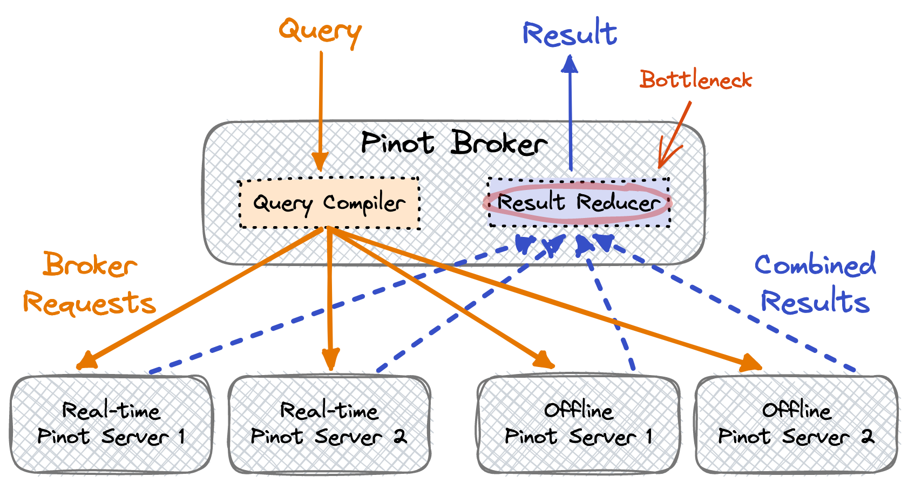
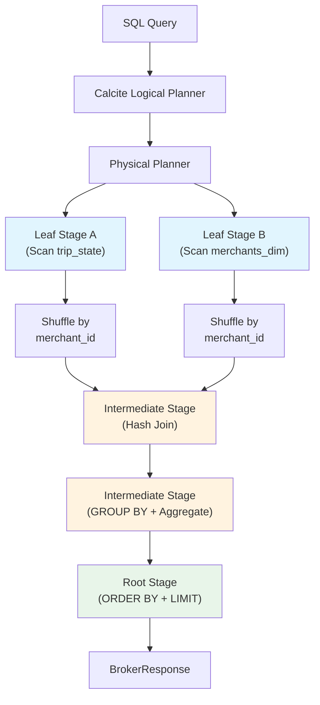

# 11. Multi-Stage Engine (v2 / MSE)

# Multi-Stage Query Capabilities

> [!IMPORTANT]
> The Multi-Stage Engine (MSE) represents a radical expansion of what we can achieve with Pinot. It does not replace the single stage engine but extends our reach into complex relational operations like distributed JOINs and window functions.

### The Evolution of the Query Plane

Historically, the Pinot query lane was narrow. We relied on upstream denormalization or external warehouses for complex joins. The introduction of MSE allows us to handle these operations directly within the serving layer.

| Feature | Single-Stage (v1) | Multi-Stage (v2) |
| :--- | :--- | :--- |
| **Execution Model** | Scatter-Gather | Multi-Stage Directed Graph |
| **Data Movement** | Isolated per server | Inter-server Data Shuffles |
| **SQL Parser** | Internal Pinot Parser | Apache Calcite |
| **Complexity** | Simple Aggregations | Distributed JOINs and Subqueries |

## The Architectural Shift

We are moving from a model where servers operate in complete isolation to a framework defined by collaboration and data exchange.

### Single-Stage (v1): The Isolated Model

In the single-stage model, the broker scatters the entire query plan to all relevant servers. Every server executes that plan against its local segments only, and the broker gathers and reduces the partial results into a final response. No communication occurs between servers during the execution phase.

### Multi-Stage (v2): The Distributed Model

In the multi-stage model, the broker parses SQL into a logical plan using Apache Calcite and converts that logical plan into a physical plan containing multiple stages. Different stages execute on different servers while communicating via data shuffles, allowing intermediate results to flow across the network between stages. The broker then assembles the final result from the root of the execution tree.

> [!NOTE]
> This shift is exactly what enables us to perform operations where data from multiple tables must be co-located by a join key or partitioned for window functions.


*Source: [Apache Pinot Documentation](https://docs.pinot.apache.org/basics/components)*

### When MSE Is Activated

MSE is not the default query engine. To use it, you must explicitly opt in by setting the `useMultistageEngine` query option to `true`:

```sql
SET useMultistageEngine = true;
SELECT t.city, m.vertical, COUNT(*) AS trip_count
FROM trip_state t
JOIN merchants_dim m ON t.merchant_id = m.merchant_id
WHERE t.status = 'completed'
GROUP BY t.city, m.vertical
ORDER BY trip_count DESC
LIMIT 50
```

Alternatively, you can set `useMultistageEngine=true` in the query options of the JSON request body. You can also configure the broker to default to MSE for all queries by setting `pinot.multistage.engine.enabled=true` in the broker configuration, though this is not recommended until you have validated that your existing workloads are compatible.


## How MSE Works

Understanding the internal execution flow of MSE is essential for writing efficient multi stage queries and diagnosing performance issues.

### Logical Planning (Calcite-Based)

When MSE receives a SQL query, it first passes it through Apache Calcite's query optimizer to produce a logical plan. Calcite is a mature, battle-tested SQL optimization framework used by many distributed query engines (including Flink, Druid and Beam). The logical plan is a tree of relational algebra operators, each representing a distinct operation: `LogicalTableScan` reads rows from a table, `LogicalFilter` applies WHERE predicates, `LogicalProject` selects specific columns or computes expressions, `LogicalAggregate` performs GROUP BY and aggregation, `LogicalJoin` joins two inputs, `LogicalWindow` computes window functions, `LogicalSort` applies ORDER BY and LIMIT, and `LogicalUnion`/`Intersect`/`Minus` handles set operations.

Calcite applies standard relational optimizations including predicate pushdown (moving filters closer to the data source), projection pruning (eliminating unnecessary columns) and join reordering.

### Physical Planning (Stage Assignment)

The logical plan is then converted into a physical plan that assigns operations to execution stages. Each stage represents a unit of work that can be distributed across servers. The physical planner makes three critical decisions. First, it determines which operations run on which servers: leaf-stage operations such as table scans and local filters run on the servers that hold the relevant segments, while intermediate operations such as joins, shuffles and window computations may run on any available server. Second, it determines where data shuffles are needed. When an operation requires data from multiple sources to be co-located (for example, a hash join needs both sides partitioned by the join key), the planner inserts a shuffle (also called an exchange) between stages. Third, it determines the parallelism within each stage based on data volume and available resources.

### Execution Stages

MSE queries execute as a directed acyclic graph (DAG) of stages:



**Leaf Stages** are the entry points of the execution graph. They run on servers that hold segments for the scanned table, performing segment scanning with index-based filtering (just like the v1 engine), local projection and expression evaluation, and partial aggregation when possible. Leaf stages produce intermediate result sets that are passed to the next stage.

**Intermediate Stages** perform operations that require data from multiple sources, including hash joins (combining two data streams by join key), shuffle-based aggregations (re-partitioning data by GROUP BY keys for global aggregation) and window function computation (partitioning data by window partition keys and applying ordered window operations). Intermediate stages can run on any server in the cluster, with the MSE scheduler assigning them based on resource availability.

**Root Stage** is the final stage that assembles the complete result. It performs final ordering, limiting and any remaining aggregation before returning the result to the broker.

### Data Shuffling Between Stages

Data shuffling is the mechanism by which intermediate results are redistributed between stages. It is analogous to the shuffle phase in MapReduce or the exchange operator in traditional distributed query engines.

MSE supports three shuffle strategies. A **hash shuffle** partitions rows by a hash of one or more columns and distributes them to specific workers. This is used for hash joins (partitioned by join key) and hash-based aggregations (partitioned by GROUP BY keys). A **broadcast shuffle** sends the entire dataset to all workers. This is used for broadcast joins where one side of the join is small enough to fit in memory on every worker. A **single-worker shuffle** sends all rows to a single worker. This is used for global operations like final ORDER BY or single-group aggregation.

> [!WARNING]
> Shuffling introduces network I/O and memory overhead. The amount of data shuffled is one of the most important factors in MSE query performance.


## Capabilities Unlocked by MSE

### Distributed JOINs

JOINs are the most requested feature that MSE enables. In a single stage engine, joining two tables is impossible because each server only sees its own segments and has no mechanism to access data from another table on another server. MSE solves this by shuffling data from both tables to a common set of workers partitioned by the join key.

```sql
SET useMultistageEngine = true;

SELECT
  t.city,
  m.vertical,
  m.contract_tier,
  COUNT(*) AS completed_trips,
  SUM(t.fare_amount) AS gmv,
  AVG(t.fare_amount) AS avg_fare
FROM trip_state t
JOIN merchants_dim m
  ON t.merchant_id = m.merchant_id
WHERE t.status = 'completed'
  AND t.last_event_time_ms > NOW() - 86400000
GROUP BY t.city, m.vertical, m.contract_tier
ORDER BY gmv DESC
LIMIT 50
```

| JOIN Type | Behavior |
|---|---|
| INNER JOIN | Returns only rows with matching keys on both sides |
| LEFT OUTER JOIN | Returns all rows from the left table, with NULLs for unmatched right-side columns |
| RIGHT OUTER JOIN | Returns all rows from the right table, with NULLs for unmatched left-side columns |
| FULL OUTER JOIN | Returns all rows from both tables (support may be limited depending on version) |
| CROSS JOIN | Returns the Cartesian product of both tables (use with extreme caution) |

### Window Functions

Window functions allow you to compute values across a set of rows that are related to the current row without collapsing the rows into groups. This is essential for ranking, running totals, moving averages and comparative analytics.

```sql
SET useMultistageEngine = true;

SELECT
  city,
  merchant_name,
  total_gmv,
  RANK() OVER (PARTITION BY city ORDER BY total_gmv DESC) AS city_rank,
  ROW_NUMBER() OVER (PARTITION BY city ORDER BY total_gmv DESC) AS city_row_num
FROM (
  SELECT
    city,
    merchant_name,
    SUM(fare_amount) AS total_gmv
  FROM trip_state
  WHERE status = 'completed'
    AND last_event_time_ms > NOW() - 604800000
  GROUP BY city, merchant_name
) sub
ORDER BY city, city_rank
LIMIT 100
```

### Subqueries

MSE supports subqueries in the FROM clause (derived tables), allowing you to build complex analytical queries by composing simpler queries:

```sql
SET useMultistageEngine = true;

SELECT
  city,
  avg_fare
FROM (
  SELECT
    city,
    AVG(fare_amount) AS avg_fare
  FROM trip_events
  WHERE event_time_ms > NOW() - 86400000
  GROUP BY city
) city_stats
WHERE avg_fare > (
  SELECT AVG(fare_amount)
  FROM trip_events
  WHERE event_time_ms > NOW() - 86400000
)
ORDER BY avg_fare DESC
```

### Set Operations

MSE supports UNION, INTERSECT and EXCEPT operations for combining result sets from multiple queries:

```sql
SET useMultistageEngine = true;

SELECT DISTINCT city
FROM trip_events
WHERE event_time_ms > NOW() - 3600000
  AND status = 'completed'

EXCEPT

SELECT DISTINCT city
FROM trip_events
WHERE event_time_ms > NOW() - 3600000
  AND status = 'cancelled'
```

### Semi-Joins and Anti-Joins

Semi-joins return rows from the left table where a matching row exists (or does not exist) in the right table, without actually returning columns from the right table:

```sql
SET useMultistageEngine = true;

SELECT t.trip_id, t.city, t.fare_amount
FROM trip_state t
WHERE t.merchant_id IN (
  SELECT m.merchant_id
  FROM merchants_dim m
  WHERE m.contract_tier = 'gold'
)
AND t.last_event_time_ms > NOW() - 86400000
LIMIT 100
```

```sql
SET useMultistageEngine = true;

SELECT t.trip_id, t.city, t.fare_amount
FROM trip_state t
LEFT JOIN merchants_dim m
  ON t.merchant_id = m.merchant_id
WHERE m.merchant_id IS NULL
  AND t.last_event_time_ms > NOW() - 86400000
LIMIT 100
```


## Join Strategies in Detail

The choice of join strategy has a dramatic impact on MSE query performance. Understanding the available strategies and when each is appropriate is critical for production workloads.

### Hash Join

In a hash join, both sides of the join are shuffled (repartitioned) by the join key. Rows from both tables with the same join key hash end up on the same worker. The worker builds a hash table from one side (the "build" side) and probes it with rows from the other side (the "probe" side). Hash join is the default strategy for joins where both sides are large. It is the most general-purpose join strategy and works correctly regardless of data distribution. Both sides of the join are shuffled over the network, so network I/O is proportional to the size of both inputs. The build side must fit in memory on each worker after partitioning, and CPU cost is proportional to the size of both inputs.

```sql
SET useMultistageEngine = true;

SELECT
  t.city,
  o.order_type,
  COUNT(*) AS order_count
FROM trip_state t
JOIN orders o ON t.trip_id = o.trip_id
WHERE t.last_event_time_ms > NOW() - 86400000
GROUP BY t.city, o.order_type
```

### Broadcast Join

In a broadcast join, the small side of the join is broadcast (replicated) to every worker processing the large side. Each worker has a complete copy of the small table and can perform the join locally without shuffling the large table. Broadcast join is ideal when one side of the join is a small dimension table (thousands to low millions of rows) and the other side is a large fact table, the most common join pattern in Pinot, where dimension tables are typically small and fact tables are large. Only the small side is transmitted over the network, and it is sent to every worker. The large side is not shuffled at all, which saves significant network I/O. The small side must fit in memory on every worker. Pinot can automatically select broadcast join when it detects that one side is small, but you can also hint it explicitly using table-level configuration.

### Lookup Join

The lookup join is a special optimization for joining a large fact table with a dimension table that is configured with `isDimTable: true` in its table config. Pinot loads the entire dimension table into memory on every server and the join is performed locally without any shuffle. This strategy requires no network shuffle and no intermediate stage, making it the fastest join strategy for enriching fact table rows with attributes from a small, infrequently changing dimension table.

```json
{
  "tableName": "merchants_dim",
  "tableType": "OFFLINE",
  "isDimTable": true,
  "segmentsConfig": {
    "replication": "1"
  }
}
```

```sql
SET useMultistageEngine = true;

SELECT
  t.city,
  m.vertical,
  SUM(t.fare_amount) AS gmv
FROM trip_state t
JOIN merchants_dim m ON t.merchant_id = m.merchant_id
WHERE t.status = 'completed'
GROUP BY t.city, m.vertical
ORDER BY gmv DESC
LIMIT 50
```

The lookup join produces zero network shuffle for the dimension table data. The dimension table must fit in memory on every server, and dimension table updates require a table reload, making it best suited for slowly changing data.

### Join Ordering Considerations

When a query involves multiple joins, the order in which joins are executed can significantly impact performance. The most selective (filtering) table should be joined first: if one of the tables has a WHERE clause that dramatically reduces its row count, joining it first reduces the data volume for subsequent joins. The smaller table should always be placed on the build side, because the build side of a hash join is held in memory as a hash table. If the build side is too large, the join will spill to disk or fail with an OOM error. When a table is configured as `isDimTable`, Pinot knows to use the lookup join strategy, which is always faster than a hash or broadcast join for qualifying tables.

| Join Strategy | Network Cost | Memory Cost | Best For |
|---|---|---|---|
| Hash Join | Both sides shuffled | Build side in memory per worker | Two large tables |
| Broadcast Join | Small side broadcast | Small side replicated on all workers | Small table + large table |
| Lookup Join | None | Dim table loaded on all servers | Dimension table enrichment |


## Window Functions in Detail

Window functions are one of the most powerful capabilities that MSE unlocks. They compute a value for each row based on a "window" of related rows, without collapsing the result set into groups.

### Syntax

```sql
function_name(expression) OVER (
    [PARTITION BY partition_column1, partition_column2, ...]
    [ORDER BY sort_column1 [ASC|DESC], sort_column2 [ASC|DESC], ...]
    [ROWS BETWEEN frame_start AND frame_end]
)
```

The `PARTITION BY` clause divides rows into groups (partitions) within which the window function is computed independently. The `ORDER BY` clause defines the ordering of rows within each partition and is required for ranking and running aggregate functions. The frame clause (`ROWS BETWEEN`) defines the subset of rows within the partition that contribute to the window function's computation for the current row.

### Supported Window Functions

**Ranking Functions:**

| Function | Description | Example Use Case |
|---|---|---|
| `ROW_NUMBER()` | Assigns a unique sequential integer to each row within its partition | Assigning a unique rank even for ties |
| `RANK()` | Assigns a rank with gaps for ties | Ranking with standard competition ranking |
| `DENSE_RANK()` | Assigns a rank without gaps for ties | Ranking where ties should not create gaps |
| `NTILE(n)` | Distributes rows into n approximately equal groups | Dividing results into quartiles or percentiles |

**Value Functions:**

| Function | Description | Example Use Case |
|---|---|---|
| `LAG(col, offset, default)` | Returns the value of a column from a preceding row | Comparing current value to previous period |
| `LEAD(col, offset, default)` | Returns the value of a column from a following row | Comparing current value to next period |
| `FIRST_VALUE(col)` | Returns the first value in the window frame | Getting the initial value in a sequence |
| `LAST_VALUE(col)` | Returns the last value in the window frame | Getting the most recent value in a sequence |

**Aggregate Window Functions:**

| Function | Description | Example Use Case |
|---|---|---|
| `SUM(col) OVER (...)` | Running or partitioned sum | Cumulative revenue over time |
| `AVG(col) OVER (...)` | Running or partitioned average | Moving average of transaction amounts |
| `COUNT(*) OVER (...)` | Running or partitioned count | Cumulative count of events |
| `MIN(col) OVER (...)` | Running or partitioned minimum | Tracking the lowest value seen so far |
| `MAX(col) OVER (...)` | Running or partitioned maximum | Tracking the highest value seen so far |

### Window Function Examples

**Ranking merchants within each city:**

```sql
SET useMultistageEngine = true;

SELECT
  city,
  merchant_name,
  gmv,
  RANK() OVER (PARTITION BY city ORDER BY gmv DESC) AS rank_in_city,
  DENSE_RANK() OVER (PARTITION BY city ORDER BY gmv DESC) AS dense_rank_in_city,
  NTILE(4) OVER (PARTITION BY city ORDER BY gmv DESC) AS quartile
FROM (
  SELECT
    city,
    merchant_name,
    SUM(fare_amount) AS gmv
  FROM trip_state
  WHERE status = 'completed'
    AND last_event_time_ms > NOW() - 604800000
  GROUP BY city, merchant_name
) sub
```

**Computing period-over-period change with LAG:**

```sql
SET useMultistageEngine = true;

SELECT
  hour_bucket,
  hourly_gmv,
  LAG(hourly_gmv, 1, 0) OVER (ORDER BY hour_bucket) AS prev_hour_gmv,
  hourly_gmv - LAG(hourly_gmv, 1, 0) OVER (ORDER BY hour_bucket) AS gmv_change
FROM (
  SELECT
    DATE_TRUNC('HOUR', event_time_ms, 'MILLISECONDS') AS hour_bucket,
    SUM(fare_amount) AS hourly_gmv
  FROM trip_events
  WHERE event_time_ms > NOW() - 86400000
  GROUP BY DATE_TRUNC('HOUR', event_time_ms, 'MILLISECONDS')
) hourly
ORDER BY hour_bucket
```

**Cumulative sum (running total):**

```sql
SET useMultistageEngine = true;

SELECT
  event_date,
  daily_revenue,
  SUM(daily_revenue) OVER (ORDER BY event_date ROWS UNBOUNDED PRECEDING) AS cumulative_revenue
FROM (
  SELECT
    DATE_TRUNC('DAY', event_time_ms, 'MILLISECONDS') AS event_date,
    SUM(fare_amount) AS daily_revenue
  FROM trip_events
  WHERE event_time_ms > NOW() - 2592000000
  GROUP BY DATE_TRUNC('DAY', event_time_ms, 'MILLISECONDS')
) daily
ORDER BY event_date
```


## When to Use MSE vs Single-Stage

Choosing between the single stage engine and MSE is not a binary decision about which is "better." Each engine has distinct strengths and the right choice depends on the query's requirements and the performance characteristics you need.

### Decision Table

| Criteria | Single-Stage (v1) | Multi-Stage Engine (v2) |
|---|---|---|
| **Single-table aggregations** | Preferred. Lower latency, simpler execution. | Works, but adds unnecessary overhead. |
| **JOINs** | Not supported. | Required. Only option for JOINs within Pinot. |
| **Window functions** | Not supported. | Required. Only option for window functions. |
| **Subqueries** | Very limited support. | Full support for derived tables and correlated subqueries. |
| **Set operations (UNION, etc.)** | Not supported. | Required. Only option for set operations. |
| **Latency requirements** | Optimized for sub-10ms to low-hundreds-of-ms latency. | Typically higher latency due to shuffle overhead. Expect tens to hundreds of milliseconds for simple joins, seconds for complex multi stage plans. |
| **Concurrency** | Handles thousands of concurrent queries. | Lower concurrency ceiling due to higher per-query resource consumption. |
| **Memory usage** | Minimal per-query memory. | Higher per-query memory for shuffle buffers and hash tables. |
| **Query complexity** | Simple filter-aggregate-limit patterns. | Complex analytical queries with multiple operations. |
| **Maturity** | Battle-tested, production-hardened. | Actively evolving, with new optimizations in each release. |
| **Debugging** | Simpler execution plan, easier to diagnose. | Multi-stage plans require understanding of shuffle and stage assignment. |

### Rules of Thumb

Default to single stage for single-table queries. If your query involves only one table and does not need window functions, the single stage engine is faster and uses fewer resources.

Use MSE only when the query genuinely requires it. JOINs, window functions, subqueries and set operations are the four categories that require MSE. If your query does not use any of these, there is no benefit to using MSE.

Keep the latency-sensitive, high-concurrency operational dashboard on single stage. Dashboard queries that power real time monitoring should be simple, bounded, single-table aggregations optimized for the single stage engine.

Use MSE for enrichment, ranking and comparative analytics. Queries that enrich fact data with dimension attributes, rank entities within groups or compare values across time periods are excellent MSE candidates.

Do not use MSE as a substitute for good data modeling. The availability of JOINs does not mean you should normalize your Pinot schemas like a transactional database. Denormalize the fields that appear in your hottest queries and use JOINs for enrichment and analytical depth that would be impractical to pre-compute.


## Performance Considerations for MSE

MSE queries involve more moving parts than single stage queries and performance tuning requires attention to factors that do not exist in the simpler execution model.

### Shuffle Volume Is the Primary Cost Driver

The amount of data shuffled between stages is typically the largest factor in MSE query latency. To minimize shuffle volume, push filters as close to the leaf stage as possible. The more rows you eliminate in the leaf stage, the less data needs to be shuffled. Always include WHERE clauses on the large side of a join. Project only the columns you need, since each additional column in the SELECT list increases the shuffle payload. Use broadcast join for small tables, because broadcasting a 10,000-row dimension table is far cheaper than shuffling a 100-million-row fact table by join key.

### Memory Pressure

MSE stages hold intermediate results in memory. Large build sides in hash joins can exhaust memory on workers if they are not sized appropriately. Always put the smaller table on the build side. High-cardinality GROUP BY operations after a join require the aggregation stage to hold all groups in memory simultaneously. Window functions on large partitions require the entire partition to be materialized in memory for sorting and computation.

### Timeouts and Resource Limits

MSE queries are subject to the same timeout mechanism as single stage queries, but they are more likely to hit timeouts because of the additional stages and shuffles. Set `timeoutMs` generously for MSE queries (30 seconds or more for complex queries) and monitor timeout rates.

| Parameter | Description | Default |
|---|---|---|
| `pinot.multistage.engine.max.rows.in.join` | Maximum rows materialized in a single join stage | 1048576 |
| `pinot.multistage.engine.max.rows.in.window` | Maximum rows materialized in a window function stage | 1048576 |
| `pinot.query.server.max.server.response.size.bytes` | Maximum size of intermediate results sent between stages | 268435456 (256MB) |
| `timeoutMs` (query option) | Per-query timeout in milliseconds | Broker default |

### Query Plan Inspection

To understand how MSE executes a query, use the `EXPLAIN PLAN` statement:

```sql
SET useMultistageEngine = true;
EXPLAIN PLAN FOR
SELECT
  t.city,
  m.vertical,
  COUNT(*) AS trip_count
FROM trip_state t
JOIN merchants_dim m ON t.merchant_id = m.merchant_id
GROUP BY t.city, m.vertical
```

The EXPLAIN output shows the stage decomposition, shuffle strategies and operator assignments. Use this to verify that filters are pushed down to leaf stages, the smaller table is on the build side of the join, broadcast join is used when one side is small, and unnecessary shuffles are not present.

> [!TIP]
> Use EXPLAIN PLAN to validate your assumptions before promoting an MSE query to production. Surprise hash shuffles on large tables are the most common source of MSE performance problems.


## Enabling and Configuring MSE

### Per-Query Activation

The simplest way to use MSE is to enable it on a per-query basis:

```sql
SET useMultistageEngine = true;
SELECT ...
```

This is the recommended approach for most deployments because it gives you fine-grained control over which queries use MSE and which use the single stage engine.

### Broker-Level Default

To make MSE the default engine for all queries on a specific broker:

```properties
pinot.multistage.engine.enabled=true
```

With this setting, all queries default to MSE unless explicitly overridden with `SET useMultistageEngine = false`. This is appropriate only for deployments where the majority of queries require MSE capabilities.

### Resource Configuration

For production MSE deployments, configure the following resources:

```properties
pinot.query.server.max.init.threads=8
pinot.query.server.max.query.workers=16
pinot.query.server.max.server.response.size.bytes=268435456

pinot.broker.multistage.max.rows.in.join=2097152
pinot.broker.multistage.max.rows.in.window=2097152
```

Adjust these values based on your hardware resources and workload characteristics. More concurrent MSE queries require more workers and memory. Monitor the server's heap usage and GC pressure when tuning these parameters.

### Cluster Topology Considerations

The Multi-Stage Engine (MSE) changes how we think about server roles. Since intermediate stages can run on any server, we must consider the entire cluster as a unified computation pool.

| Factor | Operational Requirement |
| --- | --- |
| **Compute Balance** | We ensure all servers have sufficient resources. A server hosting a small table might still be assigned heavy intermediate join work for a large table. |
| **Network Fabric** | We prioritize high-bandwidth, low-latency connections. Shuffle operations move data between servers, making network capacity a primary scaling bottleneck. |
| **Parallelism** | We use higher server counts to increase the pool of potential workers. This directly improves our throughput for complex, multi stage execution graphs. |

## Operating Heuristics

We treat MSE as a capability amplifier, not a default performance upgrade, and follow these principles to maintain cluster stability.

We use MSE selectively, only for queries that genuinely require it. Standard single-table aggregations are almost always faster on the single stage engine. We continue to denormalize hot-path fields proactively: if a dashboard frequently joins trips with merchant data, we add those attributes to the trip table to eliminate the join cost entirely.

We test MSE workloads under representative load before promoting them to production. A query that is fast in isolation may struggle when competing for memory and CPU with 50 concurrent users. We track bytes shuffled per query as a core metric and alert on sudden increases that might indicate a small table has grown large enough to trigger expensive hash joins.

We configure small dimension tables with `isDimTable: true` so that we benefit from zero-shuffle lookup joins before moving to more intensive hash join strategies. We use `EXPLAIN PLAN` to verify our assumptions before production, specifically looking for unexpected shuffles on large tables.

## Common Pitfalls

> [!WARNING]
> **Scaling Fallacy:** We do not assume a join that works on 1,000 rows in development is production-ready. We must validate against production-scale data (e.g., 100 million rows) to avoid out-of-memory (OOM) errors.

Joining large tables without filters is a frequent and costly mistake. Joining a billion-row table without a time filter results in shuffling the entire dataset across the network. MSE queries also consume significantly more memory than v1 queries, so memory limits must be validated before increasing concurrency.

The `maxRowsInJoin` threshold requires active monitoring. Exceeding this limit causes query failure, necessitating either higher limits or query restructuring. Finally, because intermediate stages can run anywhere in the cluster, a single under-provisioned server can become a bottleneck for the entire multi stage pipeline. Homogeneous server sizing is therefore important for MSE workloads.

We have explored how topology and heuristics shape a deployment. To help us dive deeper into the practical application, let's look at a specific scenario.

If we were joining a **500-million-row fact table** with a **50,000-row dimension table**, how do you think we should use filters to ensure our "shuffle" remains efficient?

Alternatively, we could explore:

1. **The Merchant Join:** Why `merchants_dim` is the ideal candidate for a broadcast join in this environment.
2. **Moving Averages:** How we would structure a window function to compute a 7-day average without overwhelming the network.
3. **Execution Plans:** What specific markers in an `EXPLAIN` output tell us a query is using a "Hash Join" versus a "Lookup Join."

## Suggested Labs

[Lab 6: Multi-Stage Queries](../labs/lab-06-multi stage-queries.md) provides hands-on exercises with JOINs, window functions and EXPLAIN PLAN analysis using the MSE.

## Repository Artifacts

The following files in this repository are directly relevant to the concepts discussed in this chapter:

[`sql/04_multistage_join.sql`](sql/04_multistage_join.sql) provides a JOIN query enriching trip data with merchant attributes. [`sql/05_multistage_windows.sql`](sql/05_multistage_windows.sql) provides window function examples with ranking and period-over-period analysis. [`schemas/merchants_dim.schema.json`](schemas/merchants_dim.schema.json) defines the dimension table schema used for JOIN examples. `tables/merchants_dim.table.json` shows the dimension table configuration with `isDimTable: true`. [`app/main.py`](app/main.py) provides API endpoints that use MSE for enrichment queries. [`labs/lab-06-multi-stage-queries.md`](labs/lab-06-multi-stage-queries.md) provides hands-on exercises with MSE queries.


## Further Reading and Resources

[Official MSE Documentation](https://docs.pinot.apache.org/developers/advanced/v2-multi-stage-query-engine) provides the canonical reference for the Multi-Stage Engine. [Multi-Stage Query Engine in Apache Pinot (YouTube)](https://www.youtube.com/watch?v=0M0dPpMqdOA) walks through MSE architecture and capabilities. [Apache Pinot Multi-Stage Engine Deep Dive (YouTube)](https://www.youtube.com/watch?v=hJ9XJXcswBY) provides detailed technical coverage of MSE internals. [Distributed Joins in Apache Pinot (YouTube)](https://www.youtube.com/watch?v=V0mJQz6eCfk) covers join implementation in MSE. [Multi-Stage Query Engine in Apache Pinot (StarTree Blog)](https://startree.ai/blog/multi-stage-query-engine-in-apache-pinot) provides detailed guidance on MSE. [Joins in Apache Pinot (StarTree Blog)](https://startree.ai/blog/joins-in-apache-pinot) covers join strategies and optimization. [Window Functions in Apache Pinot (StarTree Blog)](https://startree.ai/blog/window-functions-in-apache-pinot) explains window function support in MSE. [Apache Calcite](https://calcite.apache.org/) is the query optimizer that powers MSE's logical planning.


*Next chapter: [12. Time Series Engine](./12-time-series-engine.md)*

*Previous chapter: [10. Querying Pinot | v1 SQL and Practical Patterns](./10-querying-v1-and-sql.md)*
