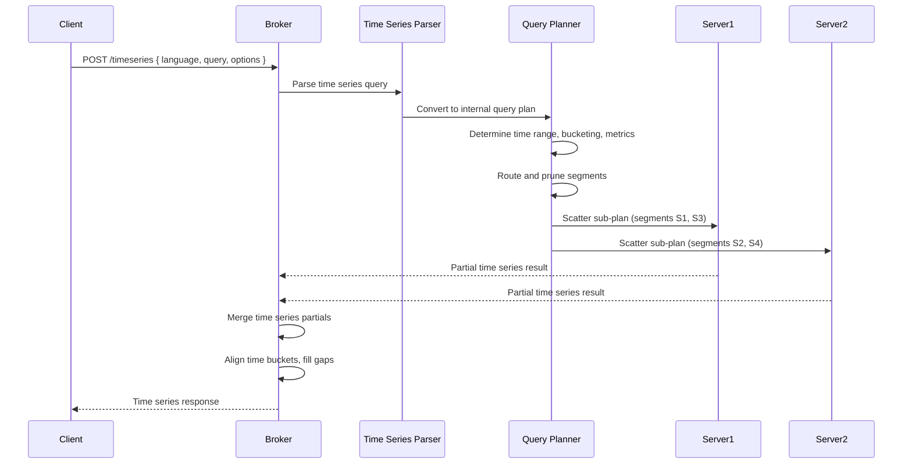

# 12. Time Series Engine

## When OLAP Meets Time Series

For decades, the worlds of OLAP analytics and time series monitoring have been treated as separate disciplines with separate tooling. Computing the 95th percentile of request latency over the last 24 hours, grouped by service and region with 5-minute buckets, required Prometheus or InfluxDB. Computing total revenue by city and product category for the same period required an engine like Apache Pinot, Druid or ClickHouse. These two workloads lived in separate systems, spoke separate query languages, and existed in separate operational silos.

### Blurring the Boundary

Apache Pinot's Time Series Engine represents a deliberate blurring of this boundary. It recognizes that many real world analytics problems are fundamentally time series problems dressed in OLAP clothing, or OLAP problems that would benefit from time series ergonomics.

> [!TIP]
> **Real World Examples:**
> Consider tracking GMV per city over 5-minute rolling windows in a ride-hailing platform, monitoring order rate trends with integrated anomaly detection in e-commerce, or analyzing transaction volume spikes by payment type in real time for fintech. All of these workloads already live in Pinot's OLAP engine. The Time Series Engine simply gives them a native, purpose-built query interface.

### What This Chapter Covers

In this chapter, we will explore how Pinot bridges the gap between observability and analytics.

1.  **Core Architecture:** What the Time Series Engine actually is (and what it isn't).
2.  **Language Support:** The time series query languages currently supported.
3.  **Data Modeling:** How to structure your Pinot tables for optimal time series performance.
4.  **SQL vs. Time Series:** Decision frameworks on when to use each interface.

By the end of this chapter, you will understand how to leverage this capability to unify your analytical dashboards with your monitoring and observability workflows.

## What Is the Time Series Engine?

The Time Series Engine is a query processing layer within Apache Pinot that accepts queries written in time series query languages (rather than standard SQL) and returns results in specialized time series response formats.

> [!IMPORTANT]
> **It is NOT a separate storage engine.**
> The Time Series Engine operates on the same data, the same segments, the same servers and the same indexes as your standard SQL queries. The difference lies entirely in how queries are expressed, processed and returned.

### The Core Idea

Traditional SQL queries against Pinot look like this:

```sql
SELECT
  DATE_TRUNC('MINUTE', event_time_ms, 'MILLISECONDS', 5) AS time_bucket,
  city,
  SUM(fare_amount) AS gmv
FROM trip_events
WHERE event_time_ms > NOW() - 86400000
GROUP BY time_bucket, city
ORDER BY time_bucket, city
```

This query computes 5-minute GMV buckets by city. It works perfectly well. But for teams that are accustomed to monitoring ecosystems (Grafana, Prometheus and other metric-oriented tools), the SQL approach has friction. They want to express the same question in a time series-native way:

```
series(sum(fare_amount), by=[city], every='5m', window='24h')
```

The Time Series Engine translates this kind of request into the underlying operations that Pinot already knows how to execute efficiently, while providing a response format that integrates naturally with time series visualization and alerting tools.

### How It Differs from Standard SQL Queries

| Aspect | Standard SQL Query | Time Series Engine Query |
|---|---|---|
| **Query language** | SQL (ANSI-compatible) | Time series language (configurable) |
| **Request format** | SQL text string | JSON payload with language, query options |
| **Response format** | BrokerResponse with tabular result set | Time series response with series, timestamps and values |
| **Time handling** | Explicit DATE_TRUNC or DATETIMECONVERT in SQL | Implicit time bucketing through language constructs |
| **Target audience** | Data engineers, analysts, application developers | SREs, DevOps engineers, monitoring tool integrations |
| **Visualization** | General-purpose BI tools | Time series dashboards (Grafana, custom metric viewers) |

### What It Is Not

The Time Series Engine is not a replacement for a dedicated time series database like Prometheus or InfluxDB. It does not implement the full PromQL or Flux query language. It does not replace Pinot's SQL engine. It is a bridge that allows teams to interact with Pinot data using time series idioms when that interaction model is more natural for the consumer.


## How It Works

The Time Series Engine operates within the existing Pinot broker and server architecture. It does not introduce new cluster components or new storage formats. Understanding its execution flow clarifies both its capabilities and its constraints.

### Execution Flow



### Step by Step Breakdown

**Step 1: Request Parsing.** The client sends a JSON request to the broker's time series endpoint. The request specifies the query language, the query expression and any query options (timeout, table name, etc.).

**Step 2: Language Translation.** The broker's time series parser interprets the query expression according to the specified language's grammar and extracts the metric expression (which column to aggregate and with what function), the group-by dimensions (which columns to slice by), the time window (how far back to look), the time granularity (how wide each time bucket should be) and any filters or transformations.

**Step 3: Query Plan Construction.** The parsed time series query is translated into an internal query plan that is functionally equivalent to a SQL query with DATE_TRUNC, GROUP BY and appropriate aggregations. This plan uses the same query planning infrastructure as standard SQL queries.

**Step 4: Segment Pruning and Routing.** The broker prunes segments based on the time window extracted from the query. Because time series queries inherently specify a time range, segment pruning is almost always effective. The broker routes the plan to servers holding relevant segments.

**Step 5: Server Execution.** Each server processes its segments using the same index-based filtering, forward index reads and local aggregation that standard SQL queries use. The server computes partial aggregations bucketed by time and dimensions.

**Step 6: Broker Merge.** The broker collects partial results from all servers and merges them. For time series responses, the broker also performs time bucket alignment (ensuring all series have consistent time boundaries), gap filling (inserting zero or null values for time buckets where no data exists) and series labeling (attaching dimension labels to each series for downstream consumption).

**Step 7: Response Formatting.** The broker formats the merged result as a time series response, typically JSON with arrays of timestamps and values for each series, and returns it to the client.

### What Runs Where

It is important to understand that the Time Series Engine does not bypass Pinot's core query processing. It adds a translation layer on top of it. The broker handles parsing, translation, routing, merge, gap filling and response formatting. The server executes the same segment-level query plan it would execute for any SQL query. The server does not know or care whether the query originated from SQL or a time series language.

> [!IMPORTANT]
> This architecture means that all of your existing investments in indexing, segment pruning, Star-Tree indexes and sorted columns benefit time series queries just as they benefit SQL queries.


## Time Series Language Support

The Time Series Engine supports pluggable time series query languages. The specific languages available depend on your Pinot version and configuration.

### Language Architecture

Pinot's time series language support is designed as a plugin system. Each language implementation provides a parser that converts the language's syntax into Pinot's internal query representation and a response formatter that converts Pinot's internal results into the language's expected response format. This pluggable architecture means that new languages can be added without modifying the core query engine.

### Query Expression Concepts

Regardless of the specific language, time series queries in Pinot express a consistent set of concepts. The **metric** specifies the column and aggregation function to compute (for example, `sum(fare_amount)`, `count(*)` or `avg(response_time_ms)`). The **dimensions** specify the columns to group by. The **time granularity** specifies the width of each time bucket. The **time window** specifies the lookback period. **Filters** specify predicates to apply before aggregation.

### Example Request

```json
{
  "language": "m3ql",
  "query": "fetch fare_amount from trip_events | where status = 'completed' | group by city | sum | rate(5m) | window 24h",
  "queryOptions": "timeoutMs=15000"
}
```

This request asks the Time Series Engine to read `fare_amount` from the `trip_events` table, filter to completed trips, group by city, compute the sum of fare_amount, bucket at 5-minute intervals and look back 24 hours. The engine translates this into the equivalent internal query plan and returns the results in a time series format.

### Equivalent SQL

To understand what the Time Series Engine does under the hood, here is the approximate SQL equivalent of the above request:

```sql
SELECT
  DATE_TRUNC('MINUTE', event_time_ms, 'MILLISECONDS', 5) AS time_bucket,
  city,
  SUM(fare_amount) AS value
FROM trip_events
WHERE event_time_ms > NOW() - 86400000
  AND status = 'completed'
GROUP BY time_bucket, city
ORDER BY city, time_bucket
```

The key difference is not in the computation but in the ergonomics. The time series language expresses the same question in a form that is more natural for monitoring-oriented workflows.


## Time Modeling for Time Series

The Time Series Engine does not magically create good time series data from a poorly modeled table. Your schema design and time column choices are just as important for time series queries as they are for SQL queries. In some ways, they are even more important, because time series queries are inherently time-centric and any deficiency in time modeling is immediately visible.

### Choosing the Right Time Column

Every table in Pinot has a time column defined in the schema's `dateTimeFieldSpec`. This is the column that Pinot uses for segment creation, time-based pruning and retention management. For time series queries, this column is typically the primary time axis.

A good time column should be monotonically increasing with event arrival: if the time column represents when an event occurred, new events should have timestamps greater than or equal to older events, since out-of-order timestamps degrade segment pruning effectiveness. It should have appropriate granularity. If your finest query granularity is 1-minute buckets, storing timestamps at millisecond precision is fine, but if your data only has daily granularity you cannot meaningfully query 5-minute buckets. Finally, it should have consistent time zone treatment: decide whether your timestamps are in UTC or local time and be consistent, since mixing time zones within a single column produces misleading time series results.

### Granularity Selection

Time granularity is the width of each time bucket in your time series results. Choosing the right granularity involves balancing resolution against query cost.

| Granularity | Buckets per Day | Typical Use Case |
|---|---|---|
| 1 second | 86,400 | Real-time anomaly detection, sub-minute alerting |
| 1 minute | 1,440 | Operational dashboards, near-real time monitoring |
| 5 minutes | 288 | Standard metric dashboards, Grafana panels |
| 15 minutes | 96 | Service-level indicator (SLI) monitoring |
| 1 hour | 24 | Hourly trend analysis, capacity planning |
| 1 day | 1 | Daily KPI reports, week-over-week comparisons |

> [!WARNING]
> The trade-off: finer granularity produces more data points, which means more rows to aggregate, more buckets to merge at the broker and larger response payloads. If your dashboard renders 5-minute buckets over a 7-day window, you are requesting 2,016 buckets per series. If you add 10 dimension values, that is 20,160 data points. At 1-second granularity over 7 days, the same query would produce 6,048,000 data points per series, which is impractical for most visualization tools and network budgets.

### Pre-Bucketed Helper Columns

For time series workloads with predictable granularity requirements, consider adding pre-bucketed helper columns to your schema. These columns store the truncated timestamp at a specific granularity, eliminating the need for runtime DATE_TRUNC computations:

```json
{
  "name": "event_time_5min",
  "dataType": "LONG",
  "transformFunction": "round(event_time_ms, 300000)"
}
```

This approach offers two advantages. Queries can GROUP BY the pre-bucketed column directly without wrapping the raw timestamp in a DATE_TRUNC function. A sorted index or inverted index on the pre-bucketed column also has lower cardinality than the raw timestamp column, making lookups faster.

The trade-off is schema rigidity. If your monitoring team later decides they need 1-minute buckets instead of 5-minute buckets, you need to add a new helper column and backfill it.

### Time Zone Considerations

Time series data that spans multiple time zones introduces complexity. Storing timestamps in UTC is the universal best practice: all internal timestamps should be epoch milliseconds in UTC, with time zone conversion happening at the display layer rather than in the data. If your data originates from multiple time zones and consumers need to see results in local time, include the source time zone as a dimension column so that the display layer can convert UTC timestamps to local time for each series. Be aware of daylight saving time: a "daily" bucket in a local time zone can be 23 or 25 hours long during daylight saving transitions, so if your time series queries must be correct across DST boundaries, bucket in UTC and convert at display time.


## When to Use Time Series vs SQL

The Time Series Engine and standard SQL are not competing features. They serve different consumption patterns for the same underlying data. The following comparison table helps you decide which to use.

| Decision Factor | Use SQL | Use Time Series Engine |
|---|---|---|
| **Consumer is an application API** | Yes. SQL integrates naturally with application code and ORMs. | Rarely. Application code typically wants tabular results. |
| **Consumer is a Grafana dashboard** | Possible, with SQL data source plugins. | Preferred. Time series responses are native to Grafana's data model. |
| **Consumer is a custom monitoring system** | Possible, but requires format translation. | Preferred. Time series formats integrate directly with metric pipelines. |
| **Query involves JOINs** | Required (via MSE). | Not supported. Time series queries are single-table. |
| **Query needs window functions** | Required (via MSE). | Not supported. |
| **Query is an ad hoc exploration** | Preferred. SQL is more flexible and familiar to analysts. | Not ideal. Time series languages are designed for structured metric queries. |
| **Query powers an alerting rule** | Possible. | Preferred. Time series responses include gap-filled, regularly spaced data points that alerting systems expect. |
| **Team has Prometheus/PromQL expertise** | Unfamiliar language. | Familiar idioms (depending on the configured language). |

### The Hybrid Approach

In many organizations, the best strategy is to expose both SQL and time series interfaces to different consumers. Application backend teams use SQL through the service layer pattern described in Chapter 10. SRE and DevOps teams use the Time Series Engine through Grafana dashboards and alerting integrations. Data analysts use SQL through query tools like the Pinot Query Console, DBeaver or Superset. This approach maximizes Pinot's value by meeting each consumer where they are, without forcing everyone into a single query paradigm.


## Integration with Monitoring Ecosystems

One of the most compelling use cases for the Time Series Engine is integrating Pinot data into existing monitoring and observability ecosystems.

### Grafana Integration

Grafana is the most common target for Time Series Engine integration. Pinot can be connected to Grafana as a data source and time series queries can power Grafana panels directly.

**Integration architecture:**

```
┌──────────────┐      ┌──────────────┐      ┌──────────────┐
│   Grafana    │─────>│  Pinot Data  │─────>│    Pinot     │
│  Dashboard   │      │  Source      │      │   Broker     │
│              │      │  Plugin      │      │  (TS API)    │
│              │<─────│              │<─────│              │
└──────────────┘      └──────────────┘      └──────────────┘
```

This integration enables real-time operational dashboards powered by Pinot data with the same look and feel as Prometheus-backed dashboards, alerting rules on Pinot metrics using Grafana Alerting with the same configuration experience as Prometheus alerts, and correlation of Pinot business metrics (GMV, order count, cancellation rate) with infrastructure metrics (CPU utilization, request latency) in a single Grafana dashboard.

### Prometheus-Style Query Patterns

Teams familiar with Prometheus often think in terms of rate, increase, histogram quantiles and label-based grouping. The Time Series Engine provides analogous capabilities.

| Prometheus Concept | Pinot Time Series Equivalent |
|---|---|
| `rate(metric[5m])` | Sum per 5-minute bucket (rate computed from delta) |
| `sum by (label) (metric)` | `sum(column), by=[label], every='interval'` |
| `histogram_quantile(0.95, ...)` | `PERCENTILETDIGEST(column, 95)` as the metric function |
| `increase(metric[1h])` | Difference between consecutive bucket values (computed at display layer or as a post processing step) |

### Building an Operational Metrics Layer

For organizations that want to unify business metrics and operational metrics in a single platform, the Time Series Engine enables a powerful pattern. Business events (trips, orders, transactions) are ingested into Pinot through Kafka. Time series dashboards in Grafana query Pinot through the Time Series Engine. Alerts are set up on business KPIs, GMV dropping below threshold, cancellation rate spiking above baseline, using the same Grafana Alerting infrastructure that monitors infrastructure health. Business and infrastructure metrics are then correlated by placing Pinot-backed panels alongside Prometheus-backed panels on the same Grafana dashboard. This approach eliminates the need to duplicate business data into a separate time series database for monitoring purposes.


## Example: Time-Series Request vs SQL Side by Side

To make the relationship between time series queries and SQL concrete, here is a complete side-by-side example.

### Business Question

"Show me the total gross merchandise value (GMV) per city, bucketed in 5-minute intervals, for the last 24 hours, for completed trips only."

### Time-Series Request

```json
{
  "language": "m3ql",
  "query": "fetch fare_amount from trip_events | where status = 'completed' | group by city | sum | bucket 5m | window 24h",
  "queryOptions": "timeoutMs=15000"
}
```

### Time-Series Response (Simplified)

```json
{
  "series": [
    {
      "labels": { "city": "San Francisco" },
      "timestamps": [1700000000000, 1700000300000, 1700000600000, "..."],
      "values": [48923.50, 52341.75, 47892.00, "..."]
    },
    {
      "labels": { "city": "New York" },
      "timestamps": [1700000000000, 1700000300000, 1700000600000, "..."],
      "values": [61287.25, 58934.50, 63421.00, "..."]
    }
  ],
  "metadata": {
    "queryTimeMs": 89,
    "numSeries": 2,
    "numDataPoints": 576
  }
}
```

### Equivalent SQL

```sql
SELECT
  DATE_TRUNC('MINUTE', event_time_ms, 'MILLISECONDS', 5) AS time_bucket,
  city,
  SUM(fare_amount) AS gmv
FROM trip_events
WHERE event_time_ms > NOW() - 86400000
  AND status = 'completed'
GROUP BY time_bucket, city
ORDER BY city, time_bucket
```

### SQL BrokerResponse (Simplified)

```json
{
  "resultTable": {
    "dataSchema": {
      "columnNames": ["time_bucket", "city", "gmv"],
      "columnDataTypes": ["LONG", "STRING", "DOUBLE"]
    },
    "rows": [
      [1700000000000, "New York", 61287.25],
      [1700000000000, "San Francisco", 48923.50],
      [1700000300000, "New York", 58934.50],
      [1700000300000, "San Francisco", 52341.75],
      "..."
    ]
  },
  "timeUsedMs": 85,
  "numDocsScanned": 2847123
}
```

### Differences: Time Series vs SQL

The transition from standard SQL to the Time Series Engine involves more than a syntax change. It fundamentally alters how data is structured and delivered to the consumer.

| Dimension | Time Series Engine | Standard SQL |
|---|---|---|
| **Response structure** | Organizes data by series (one per dimension combination), returning parallel arrays of timestamps and values immediately consumable by charting libraries | Returns a flat table of rows requiring client-side pivoting or transformation logic to produce visualization-ready data |
| **Gap filling** | Automatically injects data points for every defined bucket, even if no events occurred, filling empty buckets with zero or null | Includes only rows where data actually exists; reproducing continuous intervals requires complex JOIN logic against a calendar table |
| **Time handling** | Expresses time implicitly through `window` and `bucket` parameters | Requires explicit, often verbose, `DATE_TRUNC` functions and manual timestamp arithmetic to align data to specific intervals |

## Operating Heuristics

A time series language abstracts away the arithmetic, but it cannot fix a poorly chosen time column. Appropriate granularity and consistent time zone handling must be established at the schema level. Before committing to the Time Series Engine for a new dashboard, run the equivalent SQL query and compare the latency and result structure. Sometimes the standard SQL approach is simpler for a specific backend.

Use the Time Series Engine when the consumer is a tool like Grafana, an SRE monitoring system or a frontend charting library that expects regularly spaced intervals. If 80% of your dashboards use 5-minute buckets, create a pre-bucketed `event_time_5min` column in your schema. The storage cost is trivial compared to the CPU savings of thousands of daily queries avoiding runtime DATE_TRUNC.

Match the query window to your visualization's resolution. A 90-day window at 1-minute granularity produces over 129,000 points. Most browsers cannot render this effectively. Monitor broker-side overhead independently from server-side execution time, since gap-filling happens on the broker and high-cardinality series can make this a significant bottleneck.

## Common Pitfalls

The Time Series Engine is a translation layer that still runs on the same physical segments. If the time column is not indexed or sorted, PromQL-style queries will be just as slow as bad SQL. The engine does not replace good schema design.

Not every analytical question is a time series. Ad-hoc exploratory analysis and complex JOIN operations are still best served by Pinot's SQL engine. Requesting 1-second granularity over 30 days generates 2.6 million points per series, a silent killer that can overwhelm both Pinot's memory and the browser's RAM. Time series queries in Pinot are currently optimized for single-table access. If complex multi-table joins are required, compute the joined result via SQL first. Finally, gap-filling latency is real but invisible in server metrics: if a query tracks 100 cities over 1,000 buckets, the broker must synthesize 100,000 data points before responding.

## Practice Prompts

1.  **Implicit vs. Explicit:** Compare [`sql/06_timeseries_gmv.sql`](sql/06_timeseries_gmv.sql) with [`sql/timeseries_gmv_request.json`](sql/timeseries_gmv_request.json). What specific information is hidden/implicit in the time series request that the engine must infer?
2.  **Schema Optimization:** Identify the fields in the sample data model that make time-bucket queries cheaper. Consider the role of the time column, indexes and sorted column selection.
3.  **Use-Case Selection:** Describe one scenario where a time series query language is clearly easier for a developer and one scenario where raw SQL remains the superior choice.
4.  **Full-Stack Observability:** Design a Grafana dashboard that unifies Pinot-backed business metrics (order rate) and Prometheus-backed infrastructure metrics (CPU). Which data source plugins would you use to ensure time alignment?
5.  **The Consistency Trap:** A colleague wants to replace all SQL dashboards with the Time Series Engine for "consistency." Draft a 3-point technical argument for why this "one-size-fits-all" approach may degrade performance and flexibility.

## Suggested Labs

[Lab 7: Time Series and Metrics](../labs/lab-07-time series.md) provides hands-on exercises comparing SQL and time series query approaches, configuring time series endpoints and integrating with a Grafana dashboard.


## Repository Artifacts

The following files in this repository are directly relevant to the concepts discussed in this chapter. [`sql/06_timeseries_gmv.sql`](sql/06_timeseries_gmv.sql) provides the SQL equivalent of a time series GMV query. [`sql/timeseries_gmv_request.json`](sql/timeseries_gmv_request.json) provides a sample time series engine request payload. [`app/main.py`](app/main.py) provides API endpoints that demonstrate both SQL and time series access patterns. `labs/lab-07-time series.md` provides hands-on exercises with the Time Series Engine.


## Further Reading and Resources

[Official Time Series Documentation](https://docs.pinot.apache.org/basics/concepts/timeseries) provides the canonical reference for the Time Series Engine. [Time Series Analytics with Apache Pinot (YouTube)](https://www.youtube.com/watch?v=T70jnJzS2Ks) covers time series query processing in Pinot. [Real-Time Analytics with Apache Pinot (YouTube)](https://www.youtube.com/watch?v=JV0WxBwJqKE) includes coverage of time series capabilities. [Time Series in Apache Pinot (StarTree Blog)](https://startree.ai/blog/time series-in-apache-pinot) provides detailed guidance on time series modeling. [Bridging OLAP and Time Series Analytics (StarTree Blog)](https://startree.ai/blog/bridging-olap-and-time series) explains how to unify OLAP and time series workloads. [Grafana Data Source Plugin for Apache Pinot](https://grafana.com/grafana/plugins/) provides integration documentation. [Prometheus Documentation](https://prometheus.io/docs/prometheus/latest/querying/basics/) provides conceptual background for comparing time series approaches.


*Previous chapter: [11. Multi-Stage Engine (v2 / MSE)](./11-multi stage-engine-v2.md)*

*Next chapter: [13. APIs, Clients and Contracts](./13-apis-clients-and-contracts.md)*
