# 13. APIs, Clients and Contracts

## Why This Chapter Determines the Longevity of Your Analytics Platform

Apache Pinot in production is never used in isolation. It sits at the center of a data ecosystem: upstream producers publish events into Kafka, Pinot ingests and indexes those events, and downstream consumers query the results through service layers.

The quality of the contracts governing each of these boundaries determines whether your platform can evolve gracefully over months and years or whether every change triggers a cascade of breakages.

Most Pinot tutorials stop after demonstrating `SELECT * FROM my_table LIMIT 10`. In reality, the moment you expose Pinot-backed analytics to real consumers, you inherit every problem that API design has ever solved. Versioning and backward compatibility ensures that old clients do not break when schemas grow. Error propagation distinguishes between a query syntax error and a transient cluster timeout. Timeout management protects the cluster from long-running queries that never finish. Caching and documentation reduce redundant load and provide a clear reference for developers.

> [!IMPORTANT]
> Teams that treat these concerns as afterthoughts end up with brittle systems where a simple schema change can silently corrupt dashboards, break mobile applications, and invalidate cached results.

This chapter treats API contracts as first-class engineering artifacts. We will walk through the three layers of contracts that govern a well-designed Pinot platform: the event contract (the shape of data entering the system), the Pinot contract (the internal schema and table configurations), and the service contract (the public-facing API surface your users actually touch).

## Pinot's Built-in APIs

Before building application-level APIs on top of Pinot, you need a thorough understanding of the APIs that Pinot itself exposes. Every Pinot component (Controller, Broker, Server, Minion) runs an embedded HTTP server that exposes administrative and query endpoints.

### The Core Endpoints

| Component | Primary Responsibility | Common Endpoints |
| :--- | :--- | :--- |
| **Controller** | Cluster management & metadata | `/tables`, `/schemas`, `/segments`, `/tenants` |
| **Broker** | Query execution | `/query/sql` |
| **Server** | Data hosting & local execution | `/debug`, `/table/{tableName}/segments` |
| **Minion** | Background tasks | `/tasks` |

### Query API

The primary query endpoint is the broker's SQL endpoint:

```
POST http://<broker-host>:8099/query/sql
Content-Type: application/json

{
  "sql": "SELECT city, COUNT(*) AS trip_count FROM trip_events GROUP BY city LIMIT 10"
}
```

The response is a JSON object containing column names, data types, rows and metadata about query execution:

```json
{
  "resultTable": {
    "dataSchema": {
      "columnNames": ["city", "trip_count"],
      "columnDataTypes": ["STRING", "LONG"]
    },
    "rows": [
      ["bengaluru", 42150],
      ["mumbai", 38720]
    ]
  },
  "numDocsScanned": 80870,
  "totalDocs": 500000,
  "timeUsedMs": 12,
  "numServersQueried": 2,
  "numServersResponded": 2,
  "numSegmentsQueried": 24,
  "numSegmentsProcessed": 24,
  "numSegmentsMatched": 24
}
```

The metadata fields are critically important for operational visibility. The `numDocsScanned` versus `totalDocs` ratio tells you how effectively your indexes and segment pruning are working. The `timeUsedMs` field gives you end-to-end query latency.

For the multi-stage engine (MSE), you can pass query options to enable distributed execution:

```json
{
  "sql": "SELECT t.city, m.merchant_name, COUNT(*) FROM trip_events t JOIN merchants_dim m ON t.merchant_id = m.merchant_id GROUP BY t.city, m.merchant_name",
  "queryOptions": "useMultistageEngine=true"
}
```

### Admin APIs

The controller exposes a rich set of administrative endpoints for managing schemas, tables, segments and cluster state.

**Schema Management:**

| Operation | Method | Endpoint | Description |
|-----------|--------|----------|-------------|
| Create schema | POST | `/schemas` | Upload a new schema JSON |
| List schemas | GET | `/schemas` | List all schema names |
| Get schema | GET | `/schemas/{schemaName}` | Retrieve a specific schema |
| Update schema | PUT | `/schemas/{schemaName}` | Update an existing schema |
| Delete schema | DELETE | `/schemas/{schemaName}` | Remove a schema |
| Validate schema | POST | `/schemas/validate` | Validate schema without creating it |

**Table Management:**

| Operation | Method | Endpoint | Description |
|-----------|--------|----------|-------------|
| Create table | POST | `/tables` | Create a new table from config JSON |
| List tables | GET | `/tables` | List all table names |
| Get table config | GET | `/tables/{tableName}` | Retrieve table configuration |
| Update table | PUT | `/tables/{tableName}` | Update table configuration |
| Delete table | DELETE | `/tables/{tableName}` | Drop a table and its segments |
| Reload all segments | POST | `/segments/{tableName}/reload` | Trigger segment reload |
| Rebalance | POST | `/tables/{tableName}/rebalance` | Trigger table rebalance |

**Segment Management:**

| Operation | Method | Endpoint | Description |
|-----------|--------|----------|-------------|
| List segments | GET | `/segments/{tableName}` | List all segments |
| Get segment metadata | GET | `/segments/{tableName}/{segmentName}/metadata` | Segment level details |
| Delete segment | DELETE | `/segments/{tableName}/{segmentName}` | Remove a specific segment |
| Upload segment | POST | `/segments` | Upload an offline segment |

### Health and Metrics Endpoints

Pinot exposes health check and metrics endpoints on each component. The controller health endpoint at `GET http://<controller>:9000/health` returns a simple status indicating whether the controller is operational. The broker health endpoint at `GET http://<broker>:8099/health` indicates broker readiness for query routing. The cluster health endpoint at `GET http://<controller>:9000/health/instances` returns the status of all instances in the cluster.

For JMX-style metrics, Pinot publishes Prometheus-compatible metrics at `/metrics` on each component when configured. These metrics cover query latency histograms, segment counts, ingestion lag, heap usage, and dozens of other operational signals.

### Swagger UI

Every Pinot component ships with an embedded Swagger UI that provides interactive API documentation, accessible at `http://<controller>:9000/help` for the controller and `http://<broker>:8099/help` for the broker.

The Swagger UI is invaluable during development and debugging. It lets you explore every available endpoint, inspect request and response schemas, and execute API calls directly from the browser.

> [!TIP]
> The Swagger UI at port 9000 should be your first stop when exploring what operations are available on a running Pinot cluster.


## Building Application APIs on Top of Pinot

### Why Raw SQL Endpoints Are Insufficient for Production Consumers

Exposing Pinot's broker SQL endpoint directly to application consumers is tempting because it works immediately with zero additional code. It is also one of the most common architectural mistakes in Pinot deployments.

The problems compound over time. When a consumer writes `SELECT fare_amount FROM trip_events WHERE city = 'bengaluru'`, they are coupling directly to the column name, the table name, and the data type. Rename a column and every consumer breaks simultaneously. The broker will attempt to execute any SQL it receives, so without a service layer there is nothing preventing a consumer from running `SELECT * FROM trip_events` without a `LIMIT`, scanning hundreds of millions of rows. Different consumers need different response formats, a mobile application needs a compact JSON payload with camelCase keys, a dashboarding tool needs a tabular format, a partner API needs envelope metadata with pagination, and a raw endpoint serves none of them well. Without a caching layer, dashboards that re-execute the same query hundreds of times per minute waste cluster resources. When a downstream service has a 500ms SLA, the broker has no way to know that, but a service layer can enforce application-level timeouts. The broker's access control operates at the table level, while a service layer can enforce business-level access rules.

### Service Layer Architecture Pattern

The recommended pattern is to place a thin service layer between Pinot and your consumers. This service layer has four responsibilities:

1. **Translate business requests into Pinot queries.** The service receives a request like "give me KPIs for Bengaluru in the last 60 minutes" and translates it into the appropriate SQL query.
2. **Validate and sanitize inputs.** The service enforces parameter bounds, prevents injection, and rejects malformed requests before they reach Pinot.
3. **Shape and cache responses.** The service transforms Pinot's raw response into a consumer-friendly format and caches results where appropriate.
4. **Propagate errors and timeouts.** The service maps Pinot errors to meaningful HTTP status codes and enforces application-level timeout budgets.

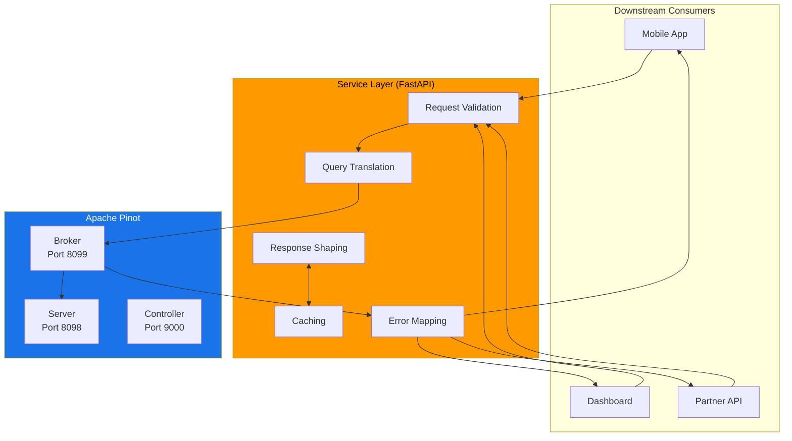

### FastAPI Example from This Repository

The [`app/main.py`](app/main.py) file in this repository implements exactly this pattern:

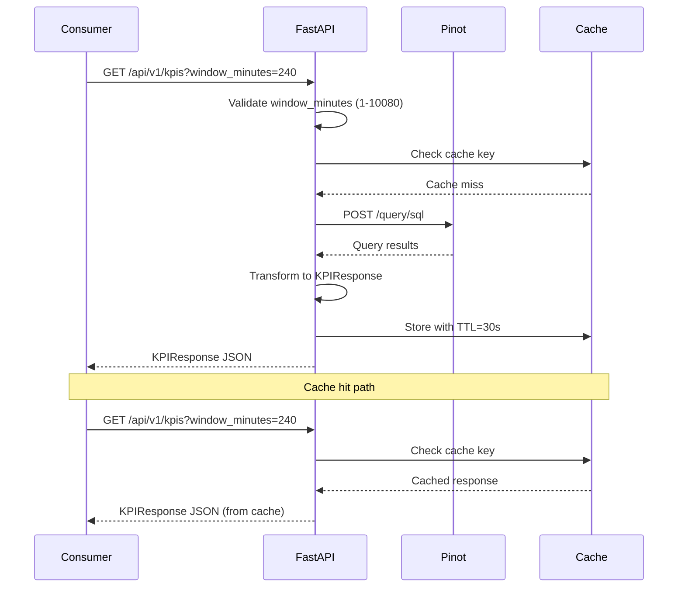

This endpoint provides several guarantees that a raw SQL endpoint does not. The endpoint is `/api/v1/kpis`, not `/query/sql`, so the consumer does not need to know SQL, table names, or column names. The `window_minutes` parameter is constrained between 1 and 10,080 (one week), and a request for `window_minutes=999999` is rejected before it reaches Pinot. The `KPIResponse` model guarantees the shape of the response. The `/api/v1/` prefix allows the team to introduce `/api/v2/kpis` with a different response shape without breaking existing consumers. The `AnalyticsProvider` dependency can be backed by Pinot in production or by a deterministic in-memory provider during testing.

### Response Caching Strategies

Analytical queries often have natural caching boundaries. Time-based TTL caching stores responses for a fixed duration (for example, 30 seconds for real-time dashboards and 5 minutes for summary views). Window-aligned caching aligns cache keys to the query's time window so that a query for "last 60 minutes" is cached with a key that includes the current hour. Parameter-based cache keys include all query parameters (city, time window, limit) so that different parameter combinations are cached independently. Schema-change invalidation clears all cached responses for a table when its schema or configuration changes.

A typical implementation using Redis:

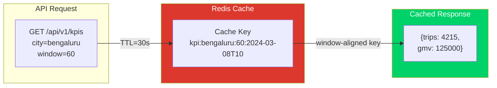

### Error Handling and Timeout Propagation

Pinot queries can fail for many reasons: broker unavailability, server timeouts, query syntax errors, resource exhaustion, or segment loading delays. A well-designed service layer maps these failures to appropriate HTTP responses:

| Pinot Failure | HTTP Response | Guidance |
|---------------|---------------|----------|
| Broker unreachable | 503 Service Unavailable | Retry with exponential backoff |
| Query timeout | 504 Gateway Timeout | Reduce query scope or increase timeout budget |
| Query syntax error | 400 Bad Request | Return error details to the consumer |
| Partial server response | 200 with degradation flag | Return partial results with a warning header |
| Table not found | 404 Not Found | Verify table name and configuration |

Timeout propagation is particularly important. If your service has a 2-second SLA and the network round trip to the broker takes 100ms, you should set the Pinot query timeout to 1,800ms:

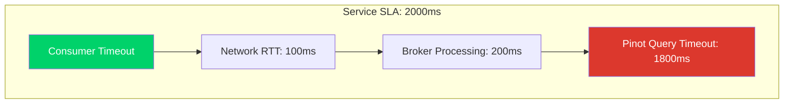

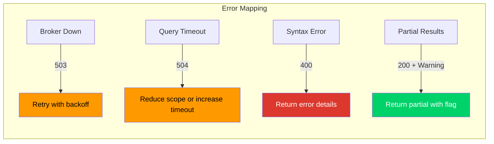


## Event Contracts with AsyncAPI

### What AsyncAPI Is and Why It Matters for Streaming Platforms

AsyncAPI is to event-driven architectures what OpenAPI is to REST APIs. It provides a machine-readable specification format for describing message channels (such as Kafka topics), the messages that flow through them, and the schemas those messages conform to.

Without an explicit event contract, Kafka topics become implicit APIs. Producers add fields whenever they want. Consumers parse what they can and silently ignore what they cannot. When Pinot ingests from these topics, schema mismatches surface as null columns, type errors, or silently dropped records. AsyncAPI makes the contract explicit, versionable, and testable.

### Annotated AsyncAPI Example from This Repository

The file [`contracts/asyncapi/trip-events.asyncapi.yaml`](contracts/asyncapi/trip-events.asyncapi.yaml) defines the contract for the two Kafka topics used in the demo:

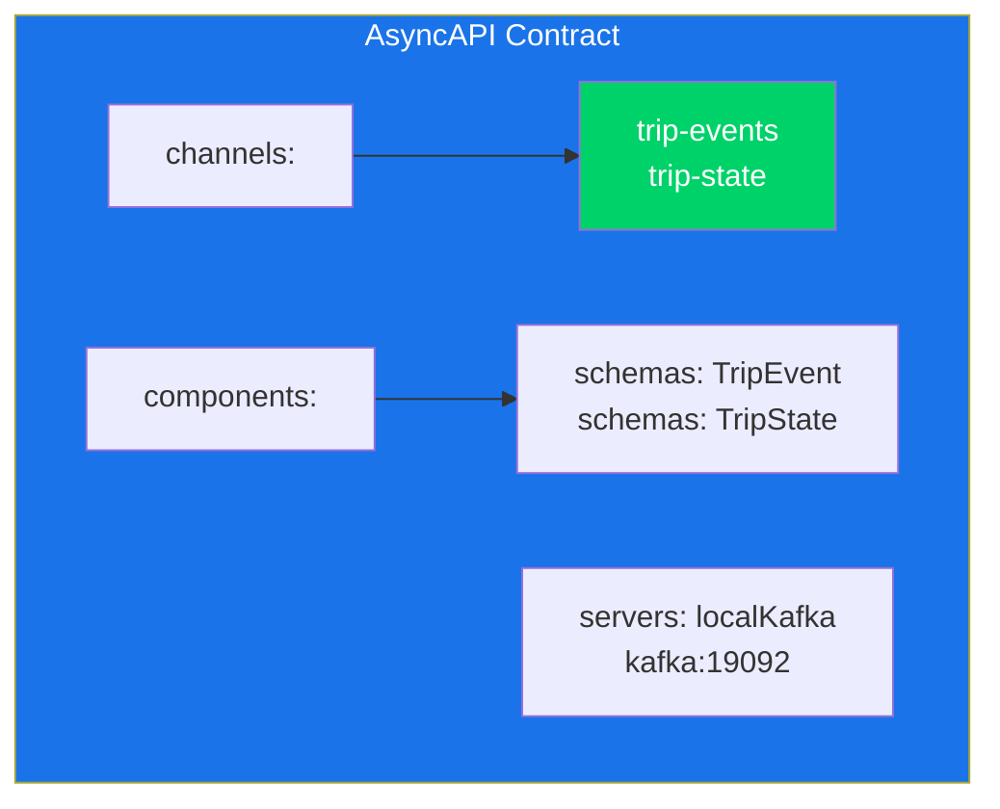

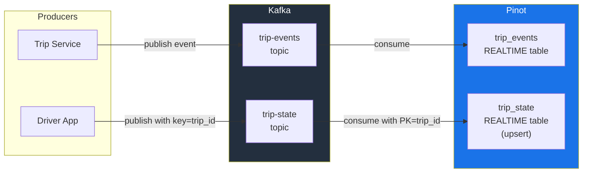

Several design decisions in this contract deserve attention. The use of two channels for two table types means the `trip-events` channel feeds the append-only `trip_events` REALTIME table while the `trip-state` channel feeds the upsert-enabled `trip_state` REALTIME table. The explicit server definition in the `localKafka` server block documents the connection endpoint. Each channel references a message definition in the `components` section, which in turn references a schema definition.

### Message Key Contracts

One of the most critical aspects of Kafka-to-Pinot integration is the message key. For upsert tables, the Kafka message key must match the primary key column in the Pinot table configuration. If this alignment breaks, upsert behavior becomes unpredictable.

The AsyncAPI contract makes this requirement explicit in the message headers:

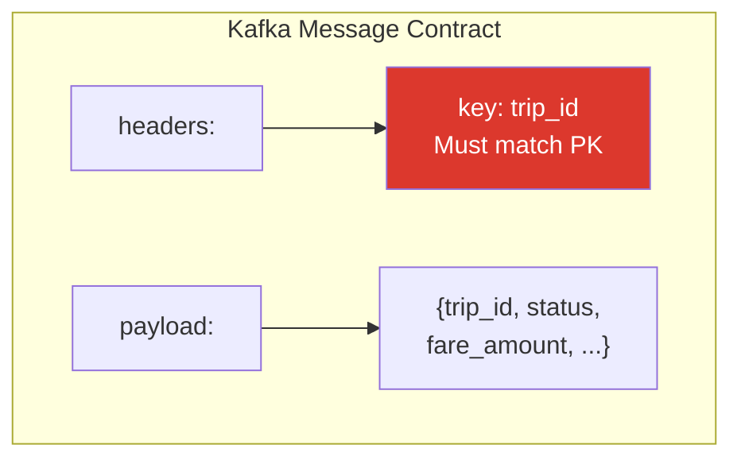

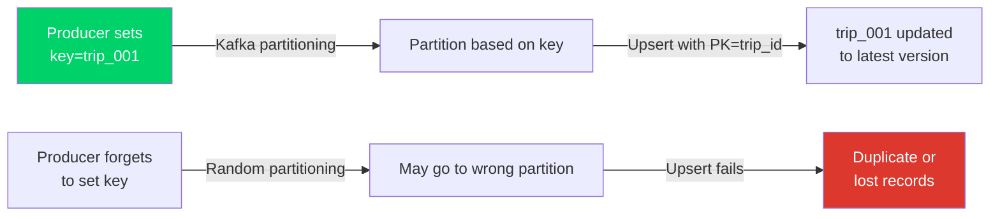

The `headers.key` property with the description "Must be set to trip_id" is a contract. Any producer that publishes to the `trip-state` topic must set the Kafka message key to the `trip_id` value. If they do not, the upsert table will not function correctly.

### Schema Evolution Rules

Event contracts evolve over time. The key principle for safe evolution in a Pinot context is: additive changes are safe, and removal or type changes are breaking.

Safe changes (backward compatible) include adding a new optional field to the payload, adding a new enum value to an existing field, adding a new channel or operation, and increasing the maximum length of a string field.

Breaking changes that require coordination include removing a required field, changing the type of an existing field (for example, from `string` to `integer`), renaming a field, changing the message key semantics, and changing the topic partitioning strategy.

When a breaking change is unavoidable, the recommended approach is to version the topic (for example, `trip-events-v2`), run both versions in parallel during the migration window, and cut over consumers one at a time.


## Payload Contracts with JSON Schema

### How JSON Schema Validates Producer Payloads

JSON Schema provides a language-agnostic way to describe the structure, types, and constraints of JSON payloads. In a Pinot platform, JSON Schema serves as the ground truth for what a valid event looks like before it enters Kafka.

The file [`contracts/jsonschema/trip-event.schema.json`](contracts/jsonschema/trip-event.schema.json) defines the canonical TripEvent schema:

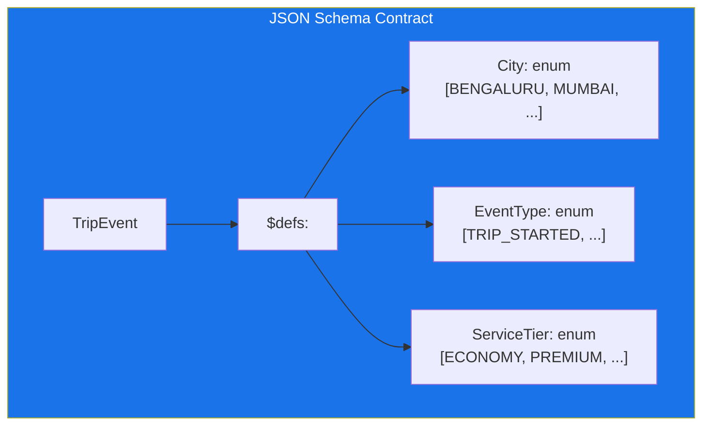

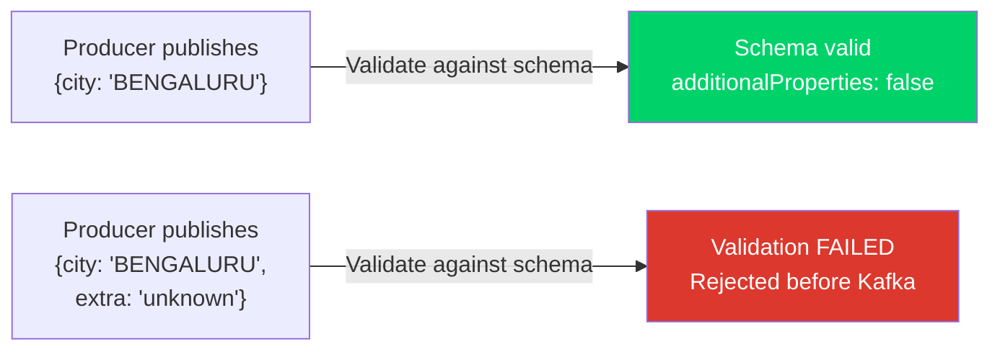

Key design choices in this schema include the use of `additionalProperties: false` to ensure that producers cannot introduce undocumented fields, explicit listing of required fields so that a producer omitting `event_time_ms` will fail validation immediately, enum constraints via `$defs` for the `City`, `EventType`, `ServiceTier` and `PaymentMethod` types, and a minimum value of 1 on `event_version` to prevent producers from sending version 0.

### Relationship Between JSON Schema and Pinot Schema

JSON Schema and Pinot schema serve different purposes:

| Concern | JSON Schema | Pinot Schema |
|---------|-------------|--------------|
| Where it validates | At the producer, before Kafka | At ingestion, inside Pinot |
| What it validates | Payload structure and types | Column names and data types for storage |
| Who it protects | Downstream consumers, including Pinot | Pinot's internal storage and query engine |
| What it cannot do | Enforce Pinot-specific semantics | Validate business rules in payloads |

The two schemas should be kept in alignment, but they will never be identical. The JSON Schema may include fields that Pinot does not ingest. The Pinot schema may include derived columns or transform functions that do not exist in the raw payload.

### Validation in CI Pipelines

Contracts are only useful if they are tested. The [`scripts/generate_contracts.py`](scripts/generate_contracts.py) script generates the OpenAPI and JSON Schema artifacts from the Python models.

A robust CI pipeline validates contracts at three levels. First, schema validity: verify that the JSON Schema, AsyncAPI, and OpenAPI files are syntactically valid. Second, example validation: validate sample payloads against the JSON Schema. Third, contract consistency: verify that field names and types in the JSON Schema align with the corresponding Pinot schema.

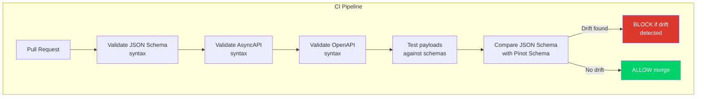

Teams that automate this validation catch drift early, before it reaches Kafka or Pinot.


## Service Contracts with OpenAPI

### Generated vs. Hand-Written OpenAPI

The OpenAPI specification for the demo API ([`contracts/openapi/analytics-api.yaml`](contracts/openapi/analytics-api.yaml)) is generated automatically from the FastAPI application using the [`scripts/generate_contracts.py`](scripts/generate_contracts.py) script. This is the code-first approach. The alternative is the contract-first approach: you write the OpenAPI specification by hand first, then generate server stubs and client SDKs from it.

The code-first approach keeps the specification always in sync with the implementation, allows developers to work in their native language and framework, and makes type annotations serve double duty as documentation and runtime validation. The contract-first approach means the API design is reviewed and agreed upon before any implementation begins, allows multiple teams to work in parallel, and makes the specification the single source of truth.

For Pinot-backed analytics APIs, the code-first approach tends to work well because the API surface is relatively small and tightly coupled to the analytical model.

### Versioning Strategies

API versioning for analytics services follows the same principles as any REST API. URL path versioning uses `/api/v1/kpis` and `/api/v2/kpis` to namespace versions. Additive changes within a version include new optional query parameters, new fields in the response, and new endpoints. Major version bumps are required when renaming a response field, changing a data type, or removing an endpoint. When you introduce v2, add a `Sunset` header to v1 responses to signal deprecation.


## The Contract Hierarchy

The most useful mental model for reasoning about contracts in a Pinot-based analytics platform is the three-layer contract hierarchy.

### Layer 1: Event Contract (AsyncAPI + JSON Schema)

This is the contract between producers and Kafka. It defines what messages look like, what keys are used, what fields are required, and what values are valid.

### Layer 2: Pinot Contract (Schema + Table Config)

This is the contract between Kafka and Pinot. It defines which fields from the event are ingested, what data types they are stored as, what indexes are applied, and how time columns are interpreted.

### Layer 3: Service Contract (OpenAPI)

This is the contract between Pinot and downstream consumers. It defines what endpoints are available, what parameters they accept, what response shapes they return, and what error codes they produce.

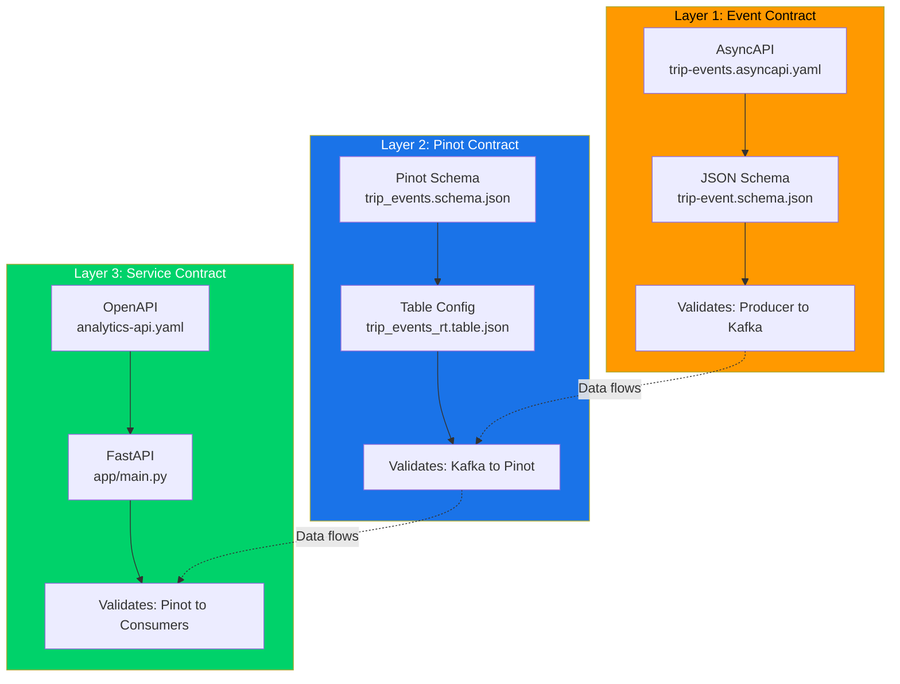

When these three layers drift apart, debugging becomes extraordinarily painful. The single most effective practice for preventing this drift is to keep all three contract layers in the same repository.


## Full Data Flow: From Producers to Consumers

The following diagram shows the complete data flow through the platform, with contract boundaries marked at each transition:

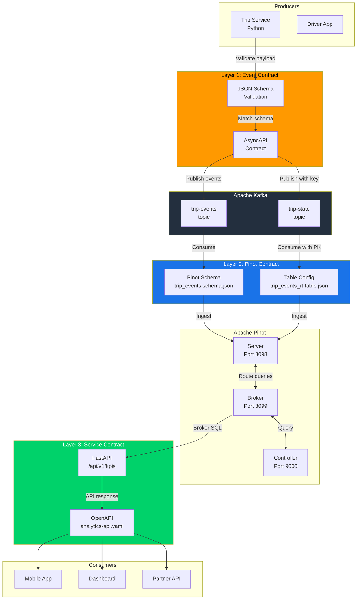


## Operating Heuristics

Keeping producer contracts, Pinot configs, and service contracts in the same repository makes cross-layer review feasible and ensures that a single Pull Request can cover the transition from data ingestion to API delivery.

Generate what can be generated and validate what cannot. The OpenAPI spec should be generated from service code to ensure it never drifts. JSON Schemas should be generated from model definitions. Only the AsyncAPI document — which describes the handshake of the event stream — should typically be hand-written.

Treat event keys as part of the contract. For features like upsert, the Kafka message key is just as important as any field in the payload. It is not an implementation detail; it is a uniqueness constraint. Version your APIs from day one, since retrofitting versioning (moving from `/api/` to `/api/v1/`) is significantly more painful than starting with a versioned path.

Cache at the service layer, not the broker. The service layer has the context to understand a consumer's specific freshness requirements, whereas the Pinot Broker treats all queries as equally "fresh." Set tight application-level timeouts so that your service layer timeout is tighter than the Pinot Broker timeout — this ensures your service fails gracefully and returns a meaningful error to the user before the underlying infrastructure hits a hard limit. Document the three-layer contract model (Event, Table, API) during onboarding so that new team members understand it before making changes that affect downstream consumers.

## Common Pitfalls

API-model drift occurs when a service team adds a new API endpoint assuming a column exists before the Pinot schema has been updated. Treating schema validation as optional for internal teams is a mistake — internal producers are just as likely to publish malformed data as external partners.

Publishing raw SQL access to every consumer is an anti-pattern. While appropriate for analysts, mobile apps and partner integrations should always consume curated analytics products via REST or GraphQL. In upsert tables, if the producer changes how the Kafka message key is constructed, deduplication breaks instantly, leading to duplicate or lost records.

Caching Pinot responses without considering schema change events can produce inconsistent data where cached responses have a different structure than fresh ones. Using the same Pinot credentials for a public-facing mobile API and an internal admin tool is a significant security risk; distinct service accounts and roles should be used for each consumer type.

## Practice Prompts

1.  **Asset Comparison:** Explain the fundamental difference between the OpenAPI and AsyncAPI assets in this repository. Which specific layer of the contract hierarchy (Event, Table, or API) does each one govern?
2.  **Schema Redundancy:** Why is JSON Schema useful even though Pinot already has its own internal schemas? Provide a concrete example of a data error that a JSON Schema would catch but a Pinot schema would ignore.
3.  **Breaking Changes:** Provide an example of a "breaking change" in an event stream contract. Outline a step-by-step plan to execute this change safely in a high-traffic production environment.
4.  **Caching Strategy:** Design a caching strategy for a `/api/v1/kpis` endpoint. How would you balance data freshness with the goal of reducing Pinot query load? What specific parameters would you include in your cache key?
5.  **The Kafka Key Contract:** Explain why the Kafka message key is a vital part of the event contract rather than an implementation detail. What specific analytical failures occur if a producer sets an incorrect key for an upsert-enabled table?
6.  **Code First vs. Contract First:** Compare these two approaches to OpenAPI generation. Under what specific organizational circumstances would you choose one over the other for a Pinot-backed API service?

## Suggested Labs and Follow-Through

**[Lab 3: Stream Ingestion](../labs/lab-03-stream-ingestion.md)** walks through the end-to-end flow from producer to Pinot. As a contract generation exercise, run `python scripts/generate_contracts.py` and inspect the generated files. As a validation exercise, intentionally introduce a breaking change in the JSON Schema and run `python scripts/validate_repo.py`. As an API exploration exercise, start the demo cluster with `docker compose up -d`, then visit `http://localhost:9000/help` to explore the Pinot controller's Swagger UI.


## Repository Artifacts

The following files in this repository are directly relevant to this chapter. [`contracts/openapi/analytics-api.yaml`](contracts/openapi/analytics-api.yaml) contains the OpenAPI 3.1 specification for the demo analytics service. [`contracts/asyncapi/trip-events.asyncapi.yaml`](contracts/asyncapi/trip-events.asyncapi.yaml) contains the AsyncAPI 3.0 specification for the Kafka topics. [`contracts/jsonschema/trip-event.schema.json`](contracts/jsonschema/trip-event.schema.json) contains the JSON Schema for the canonical TripEvent payload. [`scripts/generate_contracts.py`](scripts/generate_contracts.py) generates the OpenAPI and JSON Schema artifacts from the Python models. [`app/main.py`](app/main.py) is the FastAPI application that serves as the demo analytics service.


## Further Reading and Resources

[Apache Pinot REST API Documentation](https://docs.pinot.apache.org/users/api) is the authoritative reference for all built-in endpoints. [AsyncAPI Specification](https://www.asyncapi.com/docs/reference/specification/v3.0.0) provides the full specification for the AsyncAPI format used in this repository. [JSON Schema Specification](https://json-schema.org/specification) covers the JSON Schema draft used for payload validation. [OpenAPI 3.1 Specification](https://spec.openapis.org/oas/v3.1.0) defines the format of the generated API contract. [FastAPI Documentation](https://fastapi.tiangolo.com/) covers the framework used for the demo analytics service. [StarTree Blog: Building Real-Time Analytics APIs](https://startree.ai/blog) includes articles on API design patterns for Pinot-backed services. [Apache Pinot: Introduction (YouTube)](https://www.youtube.com/watch?v=T70jnJzS2Ks) provides a visual walkthrough of Pinot's architecture and API surface. [Real-Time Analytics with Apache Pinot (YouTube)](https://www.youtube.com/watch?v=JV0WxBwJqKE) covers the query and ingestion patterns that underpin the service layer architecture.

*Previous chapter: [12. Time Series Engine](./12-time-series-engine.md)*

*Next chapter: [14. Deployment: Docker, Kubernetes and Cloud](./14-deployment-docker-kubernetes-cloud.md)*
