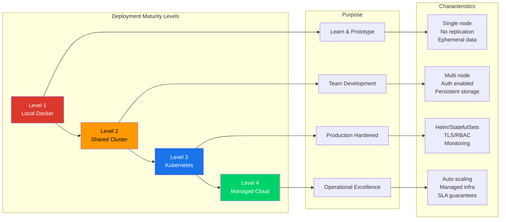
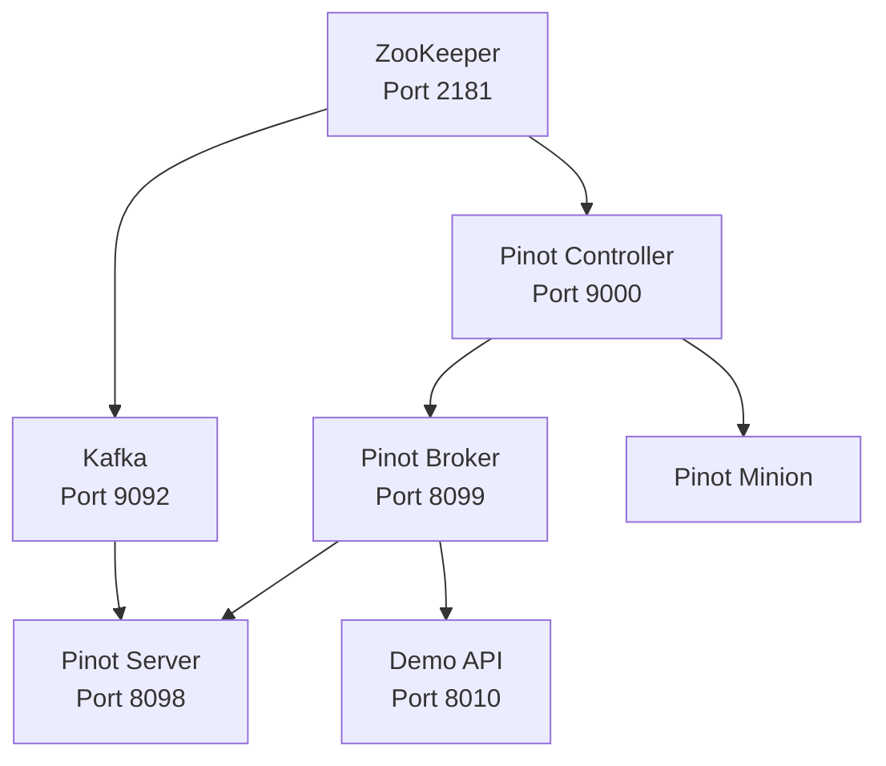

# 14. Deployment: Docker, Kubernetes and Cloud

## Why Deployment Architecture Determines Your Operational Ceiling

Every design decision covered in the preceding chapters, schema modeling, index selection, ingestion strategy and query tuning, ultimately expresses itself through deployment. A well-designed table on an undersized server produces the same result as a poorly designed table: slow queries and unhappy users. A carefully tuned query on a cluster without proper network isolation is one misconfiguration away from exposing sensitive data.

This chapter treats deployment as an engineering discipline with its own maturity model, its own failure modes and its own set of trade-offs that deserve the same rigor you would apply to schema design or index selection. The chapter moves from local Docker (where you learn and prototype) through Kubernetes (where you harden for production) to cloud-native patterns (where you optimize for operational efficiency at scale).

## Deployment Maturity Model

Before diving into specific deployment technologies, it is useful to understand where your deployment sits on a maturity spectrum.



### Level 1: Local Docker (Learning and Prototyping)

Level 1 is intended for individual engineers learning Pinot concepts, prototyping schema designs and running experiments with the deterministic data generator. The deployment consists of a single node of every component (one controller, one broker, one server, one minion) with no replication, no fault tolerance and no persistent storage. All components share a single host's CPU and memory, and data is ephemeral. It will be lost when containers are removed.

This level proves that your schema design, table configuration and queries work correctly against realistic data. It does not prove that your configuration will survive server failures, handle concurrent query load or perform acceptably at production data volumes.

### Level 2: Shared Non-Production Cluster (Team Development)

Level 2 is intended for multiple engineers working against a shared environment with real-ish data volumes, realistic network boundaries and authentication enabled. The deployment uses multiple nodes with at least two servers and two brokers, basic replication configured at replication factor 2 or higher, authentication and TLS enabled to match the production security posture, persistent storage so that data survives restarts, and ingestion from a shared Kafka cluster with representative topic configurations.

This level proves that your deployment configuration handles multi-node coordination, that rebalance operations complete successfully, and that your monitoring and alerting pipeline works.

### Level 3: Production Kubernetes (Hardened Operations)

Level 3 is intended for serving real user traffic with defined SLAs, automated recovery, capacity-planned resources and comprehensive observability. The deployment is managed by Helm with StatefulSets for servers and Deployments for brokers. Resource requests and limits are tuned through load testing. Persistent volumes are backed by cloud block storage and the deep store uses object storage (S3, GCS or Azure Blob Storage). TLS is enforced throughout, RBAC is configured and network policies are in place. Readiness and liveness probes are configured for each component, and an Ingress with TLS termination, rate limiting and authentication handles external access. Monitoring dashboards, alerting rules and on-call runbooks are all in place.

This level proves that your cluster can serve production traffic within defined SLAs and that failures are detected and recovered automatically.

### Level 4: Managed Cloud (StarTree Cloud or Self-Managed on AWS/GCP/Azure)

Level 4 reduces operational burden by delegating infrastructure management to a specialized platform while retaining control over schema design, data modeling and query patterns. Infrastructure provisioning, upgrades and patching are handled by the managed service, along with automatic scaling and rebalancing, integrated monitoring and alerting, and SLA guarantees backed by the service provider. Engineering focus shifts from infrastructure operations to data platform design.

> [!IMPORTANT]
> The choice between self-managed Kubernetes and StarTree Cloud is not just about technical capability. It is about organizational trade-offs. If your team has strong infrastructure engineering capabilities and needs fine-grained control over the data plane, self-managed Kubernetes offers more flexibility. If your team is small, understaffed or focused on analytical value rather than infrastructure operations, StarTree Cloud dramatically reduces operational burden.


## Local Docker Deployment

### Complete Annotated Docker Compose

The [`docker-compose.yml`](docker-compose.yml) in this repository defines the complete local development stack:

```yaml
version: "3.9"

services:
  # --- Infrastructure Dependencies
  zookeeper:
    image: bitnami/zookeeper:3.9
    container_name: pinot-zookeeper
    environment:
      ALLOW_ANONYMOUS_LOGIN: "yes"
    ports:
      - "2181:2181"

  kafka:
    image: bitnami/kafka:3.7
    container_name: pinot-kafka
    depends_on:
      - zookeeper
    environment:
      KAFKA_CFG_ZOOKEEPER_CONNECT: zookeeper:2181
      KAFKA_CFG_LISTENER_SECURITY_PROTOCOL_MAP: INTERNAL:PLAINTEXT,EXTERNAL:PLAINTEXT
      KAFKA_CFG_LISTENERS: INTERNAL://:19092,EXTERNAL://:9092
      KAFKA_CFG_ADVERTISED_LISTENERS: INTERNAL://kafka:19092,EXTERNAL://localhost:9092
      KAFKA_CFG_INTER_BROKER_LISTENER_NAME: INTERNAL
      KAFKA_CFG_AUTO_CREATE_TOPICS_ENABLE: "false"
      ALLOW_PLAINTEXT_LISTENER: "yes"
    ports:
      - "9092:9092"

  # --- Pinot Control Plane
  pinot-controller:
    image: apachepinot/pinot:1.4.0
    container_name: pinot-controller
    depends_on:
      - zookeeper
    command: ["StartController", "-zkAddress", "zookeeper:2181"]
    ports:
      - "9000:9000"
    volumes:
      - ./:/workspace

  # --- Pinot Query Plane
  pinot-broker:
    image: apachepinot/pinot:1.4.0
    container_name: pinot-broker
    depends_on:
      - pinot-controller
    command: ["StartBroker", "-zkAddress", "zookeeper:2181"]
    ports:
      - "8099:8099"
    volumes:
      - ./:/workspace

  pinot-server:
    image: apachepinot/pinot:1.4.0
    container_name: pinot-server
    depends_on:
      - pinot-broker
      - kafka
    command: ["StartServer", "-zkAddress", "zookeeper:2181"]
    ports:
      - "8098:8098"
    volumes:
      - ./:/workspace

  # --- Pinot Maintenance Plane
  pinot-minion:
    image: apachepinot/pinot:1.4.0
    container_name: pinot-minion
    depends_on:
      - pinot-controller
    command: ["StartMinion", "-zkAddress", "zookeeper:2181"]
    volumes:
      - ./:/workspace

  # --- Application Layer
  demo-api:
    image: python:3.13-slim
    container_name: pinot-demo-api
    working_dir: /workspace
    depends_on:
      - pinot-broker
    environment:
      PINOT_MODE: auto
      PINOT_CONTROLLER_URL: http://pinot-controller:9000
      PINOT_BROKER_URL: http://pinot-broker:8099
      PINOT_EVENTS_TABLE: trip_events
      PINOT_STATE_TABLE: trip_state
      PINOT_MERCHANTS_TABLE: merchants_dim
    command: >
      bash -lc "pip install --no-cache-dir -r requirements.txt &&
      pip install --no-cache-dir -e . &&
      uvicorn app.main:app --host 0.0.0.0 --port 8010"
    ports:
      - "8010:8010"
    volumes:
      - ./:/workspace
```

### Service Dependency Graph

The startup order matters. Services must be available before their dependents can function:



> [!NOTE]
> The `depends_on` directive in Docker Compose only ensures startup order, not readiness. The Pinot controller may take 10 to 30 seconds to fully initialize after its container starts. The [`scripts/bootstrap_demo.sh`](scripts/bootstrap_demo.sh) script handles this by polling the controller health endpoint before proceeding.

### Port Mapping Reference

| Service | Container Port | Host Port | Purpose |
|---------|---------------|-----------|---------|
| ZooKeeper | 2181 | 2181 | Cluster coordination |
| Kafka | 9092 | 9092 | External producer/consumer access |
| Kafka | 19092 | (internal only) | Inter-container communication |
| Pinot Controller | 9000 | 9000 | Admin UI, Schema/Table CRUD, Swagger |
| Pinot Broker | 8099 | 8099 | SQL query endpoint |
| Pinot Server | 8098 | 8098 | Server admin and debug endpoint |
| Demo API | 8010 | 8010 | Application analytics endpoints |

### Volume Mounts and Workspace Setup

Every Pinot component and the demo API mount the repository root as `/workspace`. This design choice enables several workflows. The [`scripts/setup_pinot.py`](scripts/setup_pinot.py) script references config files at `/workspace/pinot/schemas/` and `/workspace/pinot/tables/` for schema and table creation. Offline segment ingestion jobs can reference CSV files at `/workspace/data/` for batch ingestion. Changes to [`app/main.py`](app/main.py) on the host are immediately visible inside the `demo-api` container for live code editing.


## Kubernetes Deployment

Moving from Docker Compose to Kubernetes requires rethinking how each component handles state, failure, scaling and configuration.

### Official Helm Chart Usage

The Apache Pinot project maintains an official Helm chart:

```bash
# Add the Pinot Helm repository
$ helm repo add pinot https://raw.githubusercontent.com/apache/pinot/master/helm

# Install with default values
$ helm install pinot pinot/pinot \
    --namespace pinot \
    --create-namespace

# Install with custom values
$ helm install pinot pinot/pinot \
    --namespace pinot \
    --create-namespace \
    -f values-production.yaml
```

The Helm chart creates separate Kubernetes resources for each Pinot component, with sensible defaults that you should customize for production use.

### StatefulSet Patterns for Servers

Pinot servers are stateful components. Each server holds a distinct set of segments in its local storage and memory. When a server pod restarts, it must be able to recover its identity and reload its assigned segments. This makes `StatefulSet` the correct Kubernetes abstraction for servers.

```yaml
apiVersion: apps/v1
kind: StatefulSet
metadata:
  name: pinot-server
spec:
  replicas: 3
  serviceName: pinot-server-headless
  podManagementPolicy: Parallel
  updateStrategy:
    type: RollingUpdate
    rollingUpdate:
      maxUnavailable: 1
  template:
    spec:
      containers:
        - name: pinot-server
          image: apachepinot/pinot:1.4.0
          command: ["StartServer"]
          args: ["-zkAddress", "zookeeper:2181"]
          resources:
            requests:
              cpu: "4"
              memory: "16Gi"
            limits:
              cpu: "8"
              memory: "24Gi"
          volumeMounts:
            - name: data
              mountPath: /var/pinot/server/data
  volumeClaimTemplates:
    - metadata:
        name: data
      spec:
        accessModes: ["ReadWriteOnce"]
        storageClassName: gp3
        resources:
          requests:
            storage: 500Gi
```

The StatefulSet provides three critical behaviors. Each server pod receives a stable, predictable hostname, which is essential because Pinot uses the hostname to identify server instances in ZooKeeper. Setting `podManagementPolicy: Parallel` allows multiple pods to start simultaneously. Each server gets its own `PersistentVolumeClaim` so that when a pod restarts, it reattaches to the same volume.

### Deployment Patterns for Brokers

Pinot brokers are functionally stateless. They maintain a routing table in memory but do not store any segment data. This makes `Deployment` the correct Kubernetes abstraction:

```yaml
apiVersion: apps/v1
kind: Deployment
metadata:
  name: pinot-broker
spec:
  replicas: 3
  strategy:
    type: RollingUpdate
    rollingUpdate:
      maxUnavailable: 1
      maxSurge: 1
  template:
    spec:
      containers:
        - name: pinot-broker
          image: apachepinot/pinot:1.4.0
          command: ["StartBroker"]
          args: ["-zkAddress", "zookeeper:2181"]
          resources:
            requests:
              cpu: "2"
              memory: "4Gi"
            limits:
              cpu: "4"
              memory: "8Gi"
          readinessProbe:
            httpGet:
              path: /health
              port: 8099
            initialDelaySeconds: 15
            periodSeconds: 10
          livenessProbe:
            httpGet:
              path: /health
              port: 8099
            initialDelaySeconds: 30
            periodSeconds: 15
```

### Controller Leader Election in Kubernetes

The Pinot controller uses Helix (via ZooKeeper) for leader election. For Kubernetes deployments, controllers should be deployed as a `StatefulSet` with 2 or 3 replicas, using a headless service for inter-controller communication and a regular `ClusterIP` service for client access. Leader election happens automatically through ZooKeeper.

### Persistent Volumes for Deep Store and Segments

Pinot uses two categories of persistent storage. Local segment storage uses SSD-backed `PersistentVolumeClaims` attached to the server StatefulSet. The deep store is the durable, shared storage where segment files are persisted and in cloud environments uses object storage: S3 on AWS, Google Cloud Storage on GCP and Azure Blob Storage on Azure.

Configure the deep store in the controller configuration:

```properties
controller.data.dir=s3://my-pinot-bucket/controller-data
pinot.server.storage.factory.class.s3=org.apache.pinot.plugin.filesystem.S3PinotFS
pinot.server.storage.factory.s3.region=us-east-1
```

### Resource Requests and Limits Guidance

Resource sizing for Pinot is workload-dependent, but the following ranges provide a starting point for medium-scale deployments:

| Component | CPU Request | CPU Limit | Memory Request | Memory Limit | Notes |
|-----------|-------------|-----------|----------------|--------------|-------|
| Controller | 1 core | 2 cores | 2 Gi | 4 Gi | Light CPU, moderate memory for metadata |
| Broker | 2 cores | 4 cores | 4 Gi | 8 Gi | CPU-bound during query merge |
| Server | 4 cores | 8 cores | 16 Gi | 24 Gi | Memory-critical for segment serving |
| Minion | 2 cores | 4 cores | 4 Gi | 8 Gi | Bursty during merge/rollup tasks |
| ZooKeeper | 0.5 core | 1 core | 1 Gi | 2 Gi | Low resource, critical for availability |

> [!IMPORTANT]
> The memory limit must account for both JVM heap and off-heap usage. Pinot servers use memory-mapped files extensively. A common guideline is to set the JVM heap to 50% of the memory limit and allow the remaining 50% for memory-mapped files and OS overhead.

### Readiness and Liveness Probes

Properly configured health probes are essential for Kubernetes to manage Pinot pod lifecycle.

Readiness probes determine when a pod is ready to receive traffic:

```yaml
readinessProbe:
  httpGet:
    path: /health
    port: 8099
  initialDelaySeconds: 15
  periodSeconds: 10
  failureThreshold: 3
```

For servers with large segments, increase the initial delay:

```yaml
readinessProbe:
  httpGet:
    path: /health
    port: 8098
  initialDelaySeconds: 60
  periodSeconds: 15
  failureThreshold: 6
```

Liveness probes determine when a pod is stuck and needs to be restarted:

```yaml
livenessProbe:
  httpGet:
    path: /health
    port: 8099
  initialDelaySeconds: 60
  periodSeconds: 30
  failureThreshold: 5
```

### Ingress and TLS Termination

For external access to the Pinot broker and controller, configure a Kubernetes Ingress with TLS:

```yaml
apiVersion: networking.k8s.io/v1
kind: Ingress
metadata:
  name: pinot-ingress
  annotations:
    nginx.ingress.kubernetes.io/ssl-redirect: "true"
    nginx.ingress.kubernetes.io/proxy-body-size: "10m"
    nginx.ingress.kubernetes.io/proxy-read-timeout: "120"
spec:
  ingressClassName: nginx
  tls:
    - hosts:
        - pinot.internal.example.com
      secretName: pinot-tls-cert
  rules:
    - host: pinot.internal.example.com
      http:
        paths:
          - path: /query
            pathType: Prefix
            backend:
              service:
                name: pinot-broker
                port:
                  number: 8099
          - path: /
            pathType: Prefix
            backend:
              service:
                name: pinot-controller
                port:
                  number: 9000
```

> [!WARNING]
> Never expose the controller admin API or the broker query endpoint directly on the public internet without authentication. These endpoints can modify cluster state and access all data.

### ConfigMap and Secret Management

Pinot configuration should be externalized using Kubernetes ConfigMaps and Secrets:

```yaml
apiVersion: v1
kind: ConfigMap
metadata:
  name: pinot-controller-config
data:
  pinot-controller.conf: |
    controller.helix.cluster.name=PinotCluster
    controller.zk.str=zookeeper:2181
    controller.data.dir=s3://my-pinot-bucket/controller-data
    controller.retention.frequencyPeriod=6h
    controller.segment.level.validation.intervalInSeconds=3600
```

For sensitive values, use Kubernetes Secrets:

```yaml
apiVersion: v1
kind: Secret
metadata:
  name: pinot-s3-credentials
type: Opaque
data:
  aws-access-key: <base64-encoded>
  aws-secret-key: <base64-encoded>
```


## Cloud Deployment Considerations

### AWS (EKS + S3 + MSK)

AWS is one of the most common deployment targets for production Pinot clusters. For compute, use Amazon EKS with managed node groups, `r6i` or `r6g` (Graviton) instances for servers (memory-optimized) and `m6i` or `m6g` instances for brokers and controllers. Use Amazon S3 with the Pinot S3 filesystem plugin for the deep store, applying S3 Standard for hot data and S3 Intelligent-Tiering for segments older than 30 days. Amazon MSK (Managed Streaming for Apache Kafka) or Confluent Cloud handles Kafka, while Amazon EBS gp3 volumes serve as server persistent storage. Deploy within a VPC with private subnets and use VPC endpoints for S3 access. Use IAM roles for service accounts (IRSA) to grant Pinot pods access to S3 without static credentials.

### GCP (GKE + GCS + Confluent)

On GCP, use Google Kubernetes Engine (GKE) with node pools, `n2-highmem` instances for servers and `n2-standard` instances for brokers. Google Cloud Storage with the Pinot GCS filesystem plugin serves as the deep store. Confluent Cloud on GCP or self-managed Kafka on GKE handles the streaming layer. Persistent Disks (SSD type) provide server storage, and VPC-native GKE clusters with private nodes enforce network boundaries.

### Azure (AKS + Blob Storage + Event Hubs)

On Azure, use Azure Kubernetes Service (AKS) with node pools, `E-series` (memory-optimized) VMs for servers. Azure Blob Storage with the Pinot Azure filesystem plugin serves as the deep store. Azure Event Hubs with Kafka protocol support or Confluent Cloud on Azure handles the streaming layer. Azure Premium SSD managed disks provide server storage, and AKS with Azure CNI and network policies enforces connectivity boundaries.

### StarTree Cloud as a Managed Alternative

[StarTree Cloud](https://startree.ai/) is the managed Pinot platform offered by the company founded by Pinot's creators. It handles infrastructure provisioning, upgrades, scaling, monitoring and security patching.

StarTree Cloud is worth evaluating when your team does not have dedicated infrastructure engineers for Pinot operations, when you need enterprise features like multi-tenant isolation, advanced security or integrated data management, or when you want to focus engineering effort on schema design and analytics delivery rather than Kubernetes operations.


## Sizing and Capacity Planning

Capacity planning for Pinot requires understanding the relationship between four variables: data volume, query load, latency requirements and cost budget.

### Server Sizing

As a memory rule of thumb, allocate enough memory for the working set of segment data that is actively queried. A CPU rule of thumb is that one CPU core can typically handle 50 to 200 simple aggregation queries per second. For disk, provision 2x to 3x the expected segment data size. A replication factor of 2 provides basic fault tolerance and a factor of 3 provides stronger durability guarantees.

### Broker Sizing

Brokers are less resource-intensive than servers because they only merge partial results. Most workloads are well-served by 4 Gi to 8 Gi per broker and 2 to 4 cores per broker. One broker for every two to four servers is a common starting ratio.

### Controller Sizing

Controllers are the least resource-intensive Pinot component. A single controller with 2 cores and 4 Gi of memory can manage clusters with hundreds of tables and thousands of segments. Deploy 2 or 3 controller replicas for high availability.


## Upgrade and Rollback Strategy

Pinot upgrades require careful planning because the cluster is a distributed system with multiple component types.

### Recommended Upgrade Order

1. **Controller first.** Upgrade the controller(s) to the new version.
2. **Brokers second.** Upgrade brokers in a rolling fashion, one at a time.
3. **Servers third.** Upgrade servers in a rolling fashion. This is the most sensitive step.
4. **Minions last.** Upgrade minions after all other components.

### Rolling Upgrade with Zero Downtime

For Kubernetes deployments, rolling upgrades are handled by the StatefulSet and Deployment controllers:

```bash
$ helm upgrade pinot pinot/pinot \
    --namespace pinot \
    -f values-production.yaml \
    --set image.tag=1.5.0
```

The `maxUnavailable: 1` setting ensures that only one pod is upgraded at a time.

### Rollback Procedure

If an upgrade introduces regressions, stop the upgrade by pausing the rollout with `kubectl rollout pause statefulset/pinot-server -n pinot`. Verify the failure by checking logs, metrics and query results. Roll back by reverting to the previous Helm release with `helm rollback pinot 1 -n pinot`. Verify recovery by checking that all components are healthy.

> [!IMPORTANT]
> Always take a snapshot of ZooKeeper state before upgrading. Some configuration changes are written to ZooKeeper during upgrades and may not be automatically reverted during a rollback.


## Network Architecture

### Service Mesh Integration

In organizations that use a service mesh (such as Istio or Linkerd), Pinot components should be registered as mesh services. This provides mutual TLS (mTLS) between all Pinot components without managing certificates manually, traffic observability with request-level metrics and tracing, and traffic management with retries, timeouts and circuit breakers.

> [!CAUTION]
> When using a service mesh, ensure that the mesh's sidecar proxy does not interfere with Pinot's internal communication protocols. Pinot uses Netty-based protocols for server-to-server communication in the multi-stage engine.

### DNS and Service Discovery

In Kubernetes, use headless services for StatefulSet components (servers and controllers) and ClusterIP services for Deployments (brokers):

```yaml
# Headless service for servers
apiVersion: v1
kind: Service
metadata:
  name: pinot-server-headless
spec:
  clusterIP: None
  selector:
    app: pinot-server
  ports:
    - port: 8098

# ClusterIP service for brokers
apiVersion: v1
kind: Service
metadata:
  name: pinot-broker
spec:
  type: ClusterIP
  selector:
    app: pinot-broker
  ports:
    - port: 8099
```

### Load Balancing

For external access to the broker query endpoint, use a Layer 7 load balancer with health check routing. Configure the health check to target the broker's `/health` endpoint.


## Operating Heuristics

Use Docker for learning and deterministic demos. Use Kubernetes or managed environments for anything that serves real users.

Design deployment topology together with authentication, network boundaries and upgrade strategy. These concerns are interconnected and cannot be addressed in isolation. Treat sizing as a workload exercise, not a guess from node count alone: the only reliable sizing method is load testing with representative data and queries.

Always deploy at least two replicas of every component in production. Single points of failure are the most common cause of Pinot outages. Separate server tenant tags for real-time and offline workloads, since real-time servers have different resource profiles than offline servers.

Monitor deep store connectivity as a critical health signal. If servers cannot reach the deep store, segment recovery after pod restarts will fail silently. Practice upgrade and rollback procedures in a lower environment before executing your first production upgrade.


## Common Pitfalls

Exposing Pinot services publicly without an API gateway or authentication layer is a serious risk. The controller's admin API can delete tables and the broker can query all data. Assuming that containerization alone solves stateful serving concerns is a mistake: a Pinot server is not a stateless web application and requires the same operational care as any stateful database component.

Skipping replay and recovery drills before going to production leaves you unprepared for the first real failure. Setting memory limits without accounting for off-heap usage will cause pods to be OOM-killed: if you set the JVM heap to 16 Gi and the Kubernetes memory limit to 16 Gi, the pod will be evicted. Using default ZooKeeper session timeouts may be too short for clusters under heavy load. Neglecting to configure `maxUnavailable` in update strategies can cause Kubernetes to take down multiple pods simultaneously during an upgrade.


## Practice Prompts

1. Explain how the Docker Compose stack in this repository maps to a future Kubernetes deployment. Which components become StatefulSets? Which become Deployments?
2. Why should ingress, TLS and authentication be designed before any endpoint is exposed outside the cluster?
3. What would you benchmark before deciding on server instance size?
4. Explain the difference between a readiness probe and a liveness probe for a Pinot server. Why is the initial delay for a server probe longer than for a broker probe?
5. Design a rolling upgrade strategy for a Pinot cluster with 3 controllers, 4 brokers and 8 servers.
6. Compare the operational trade-offs of running Pinot on self-managed Kubernetes versus using StarTree Cloud.


## Suggested Labs and Follow-Through

**[Lab 1: Local Cluster](../labs/lab-01-local-cluster.md)** walks through standing up the Docker Compose stack. As a Kubernetes migration exercise, take the Docker Compose configuration and sketch the equivalent Kubernetes manifests. As a capacity planning exercise, use the sizing heuristics to estimate the server fleet size needed for a workload with 10 billion records and 500 queries per second. As a failure recovery drill, start the Docker Compose stack, load data, run queries, then stop the server container and observe what happens.


## Repository Artifacts

The following files in this repository are directly relevant to this chapter. [`docker-compose.yml`](docker-compose.yml) defines the complete local development stack. [`scripts/bootstrap_demo.sh`](scripts/bootstrap_demo.sh) initializes topics, schemas, tables and sample data. `.env.example` documents the environment variables used by the stack. `Makefile` provides convenience targets for common operations.


## Further Reading and Resources

[Apache Pinot Helm Chart](https://github.com/apache/pinot/tree/master/helm) is the official Helm chart for Kubernetes deployments. [Apache Pinot Docker Images](https://hub.docker.com/r/apachepinot/pinot) provides the official container images. [Kubernetes Documentation: StatefulSets](https://kubernetes.io/docs/concepts/workloads/controllers/statefulset/) covers the Kubernetes primitive used for Pinot servers. [Apache Pinot Deployment Guide](https://docs.pinot.apache.org/operators/tutorials/running-pinot-in-production) is the official production deployment guide. [StarTree Cloud](https://startree.ai/saas) is the managed Pinot platform. [Running Apache Pinot on Kubernetes (YouTube)](https://www.youtube.com/watch?v=cNnwMF0pOF8) covers Kubernetes deployment patterns in detail. [Apache Pinot Performance Tuning (YouTube)](https://www.youtube.com/watch?v=JV0WxBwJqKE) covers sizing and performance considerations. [StarTree Blog: Pinot Operations](https://startree.ai/blog) includes articles on production deployment patterns, capacity planning and upgrade strategies.

*Previous chapter: [13. APIs, Clients and Contracts](./13-apis-clients-and-contracts.md)*

*Next chapter: [15. Security and Governance](./15-security-and-governance.md)*
