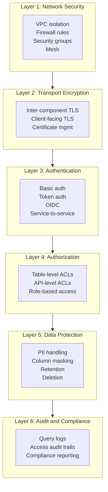
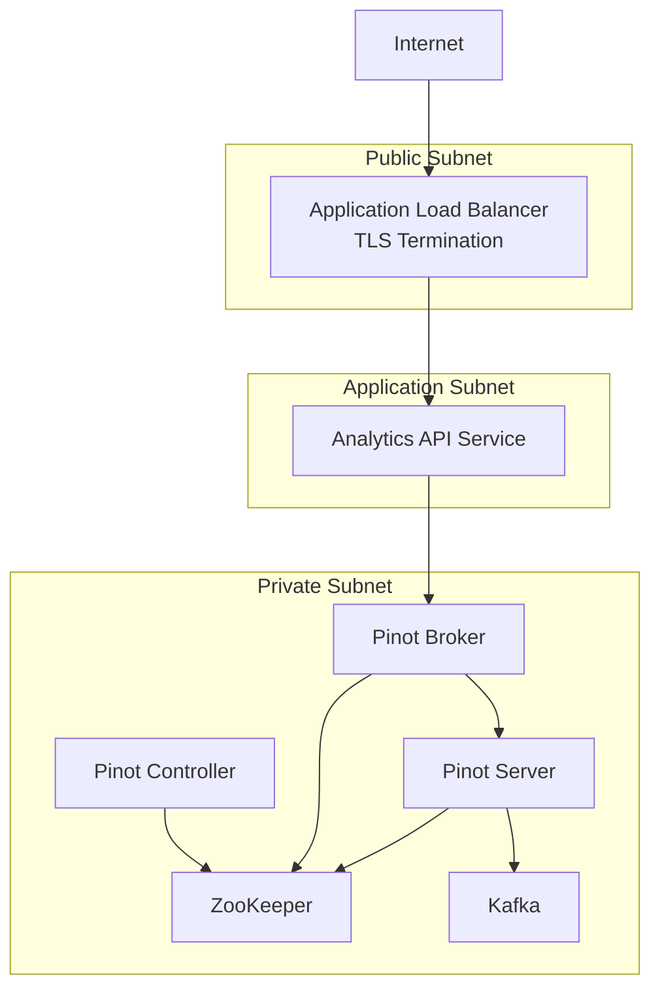

# 15. Security and Governance

## Why Security Is a Non-Negotiable Concern for Pinot Deployments

Apache Pinot often serves business-critical data. In many organizations, Pinot tables contain revenue figures, customer activity patterns, transaction histories and operational metrics that directly influence business decisions. In some architectures, Pinot serves user-facing applications where query results are rendered in mobile apps, partner dashboards or public-facing analytics products. The data flowing through Pinot is valuable and valuable data attracts risk.

Yet security in real-time analytics platforms is frequently treated as an afterthought. Teams stand up a Pinot cluster, expose the broker endpoint to their application layer, celebrate the sub-second query latency and only think about security when an auditor asks uncomfortable questions. By that point, retrofitting security is painful, disruptive and incomplete.

This chapter treats security as an architectural concern that must be designed alongside schema modeling, deployment topology and query patterns. It presents a defense-in-depth model where multiple layers of security controls work together.


## Security Architecture: Defense in Depth

The defense-in-depth model for Pinot security consists of six layers. Each layer provides independent protection and the layers work together to create a security posture that is resilient to individual failures.



A common mistake is to implement only one or two layers and consider the system "secure." Each layer addresses a different threat and all six layers should be present in a production deployment.


## Layer 1: Network Security

Network security is the outermost defense layer. Its purpose is to ensure that only authorized network traffic can reach Pinot components.

### Private Networking and VPC Design

In cloud environments, every Pinot component should run in a private subnet within a Virtual Private Cloud (VPC). No Pinot component should have a public IP address. External access should be mediated through a load balancer, API gateway or VPN.



Four design principles govern this topology. Pinot components live in private subnets with no direct internet access. The analytics API service lives in an application subnet that can reach the Pinot broker but is otherwise isolated. A load balancer in the public subnet is the only component with internet-facing connectivity. The controller admin API is never exposed to the public subnet.

### Firewall Rules and Security Groups

Define security groups that enforce the principle of least privilege:

| Source | Destination | Port | Purpose |
|--------|-------------|------|---------|
| Analytics API | Pinot Broker | 8099 | SQL queries |
| Pinot Broker | Pinot Server | 8098 | Query fan-out |
| Pinot Controller | ZooKeeper | 2181 | Cluster coordination |
| Pinot Broker | ZooKeeper | 2181 | Routing table updates |
| Pinot Server | ZooKeeper | 2181 | Instance registration |
| Pinot Server | Kafka | 9092 | Stream ingestion |
| Pinot Server | S3/GCS/Blob | 443 | Deep store access |
| Admin VPN | Pinot Controller | 9000 | Administrative operations |
| Monitoring | All Pinot components | Various | Metrics scraping |

Every rule should be explicitly defined. Default-allow rules between subnets defeat the purpose of network segmentation.

### Service Mesh Integration

For organizations using a service mesh (Istio, Linkerd, Consul Connect), registering Pinot components as mesh services provides automatic mutual TLS between all components, fine-grained traffic policies that restrict which services can communicate and request-level observability that logs every inter-component API call.

### API Gateway Patterns

For consumer-facing endpoints, place an API gateway between the consumer and the analytics API service. The API gateway provides rate limiting to prevent any single consumer from overwhelming the Pinot cluster, API key management with per-consumer quotas and usage tracking and request/response logging for audit purposes. Do not use the API gateway as a substitute for application-level authentication and authorization.


## Layer 2: TLS Configuration

Transport Layer Security (TLS) encrypts data in transit. For Pinot deployments, TLS should be configured on two boundaries: between Pinot components and between clients and Pinot.

### Inter-Component TLS (Controller, Broker, Server)

Pinot supports TLS for inter-component communication:

```properties
controller.tls.enabled=true
controller.tls.keystore.path=/etc/pinot/tls/keystore.p12
controller.tls.keystore.password=${KEYSTORE_PASSWORD}
controller.tls.keystore.type=PKCS12
controller.tls.truststore.path=/etc/pinot/tls/truststore.p12
controller.tls.truststore.password=${TRUSTSTORE_PASSWORD}
controller.tls.truststore.type=PKCS12
controller.tls.client.auth.enabled=true
```

The same pattern applies to brokers and servers.

### Client-Facing TLS

For client-facing TLS (between the analytics API and the broker):

```properties
pinot.broker.tls.enabled=true
pinot.broker.tls.keystore.path=/etc/pinot/tls/broker-keystore.p12
pinot.broker.tls.keystore.password=${BROKER_KEYSTORE_PASSWORD}
```

> [!NOTE]
> When using a Kubernetes ingress controller for TLS termination, the TLS connection terminates at the ingress. This is acceptable in many environments because the cluster network is already isolated.

### Certificate Management

Certificate management is the operational challenge that makes TLS difficult in practice. Use a certificate authority that supports automated renewal. In Kubernetes, cert-manager with Let's Encrypt automates certificate issuance. Set certificate rotation schedules so that TLS certificates rotate at least every 90 days. Monitor certificate expiration by adding alerting for certificates that will expire within 14 days. Use separate certificates for each component type so that the controller, broker and server each have distinct certificates.


## Layer 3: Authentication

Authentication answers the question: "Who is making this request?" Pinot supports several authentication mechanisms.

### Basic Authentication

Basic authentication uses a username and password encoded in the HTTP `Authorization` header:

```properties
controller.admin.access.control.factory.class=org.apache.pinot.controller.api.access.BasicAuthAccessControlFactory
controller.admin.access.control.principals=admin,readonly
controller.admin.access.control.principals.admin.password=<hashed-password>
controller.admin.access.control.principals.readonly.password=<hashed-password>
```

For the broker:

```properties
pinot.broker.access.control.class=org.apache.pinot.broker.broker.BasicAuthAccessControlFactory
pinot.broker.access.control.principals=queryuser,admin
pinot.broker.access.control.principals.queryuser.password=<hashed-password>
pinot.broker.access.control.principals.admin.password=<hashed-password>
```

Basic auth is appropriate for small teams, internal deployments or development environments where simplicity is more important than advanced identity features. Its primary limitation is that credentials must be distributed to every client and password rotation requires coordinated updates across all consumers.

### Token-Based Authentication

Token-based authentication uses bearer tokens in the HTTP `Authorization` header. Tokens can be JWTs or opaque tokens validated against a token service. Pinot supports token-based authentication through its pluggable access control framework:

```properties
controller.admin.access.control.factory.class=org.apache.pinot.controller.api.access.ZkBasicAuthAccessControlFactory
```

### OIDC Integration

OpenID Connect (OIDC) integration allows Pinot to delegate authentication to an external identity provider such as Okta, Auth0, Azure AD or Google Workspace. OIDC integration is typically implemented at the API gateway or service layer:

```python
from fastapi import Depends, Security
from fastapi.security import HTTPBearer, HTTPAuthorizationCredentials
import jwt

security = HTTPBearer()

async def verify_token(
    credentials: HTTPAuthorizationCredentials = Security(security),
) -> dict:
    token = credentials.credentials
    payload = jwt.decode(
        token,
        key=OIDC_PUBLIC_KEY,
        algorithms=["RS256"],
        audience=API_AUDIENCE,
    )
    return payload

@app.get("/api/v1/kpis")
async def get_kpis(
    user: dict = Depends(verify_token),
    provider: AnalyticsProvider = Depends(get_provider),
):
    return provider.get_kpis(city=user.get("city_scope"))
```

### Service-to-Service Authentication

When the analytics API service communicates with the Pinot broker, it should use a dedicated service account rather than passing through the end user's credentials. This pattern achieves credential isolation so that end user credentials never reach Pinot, centralizes access control enforcement at the API layer where business-level rules apply and enables connection pooling so the analytics API can maintain a pool of authenticated connections.


## Layer 4: Authorization

Authorization tells you what that identity is allowed to do. Pinot supports authorization at two levels: table-level access control and API-level access control.

### Table-Level Access Control

Table-level access control restricts which authenticated users or service accounts can query which tables:

```properties
pinot.broker.access.control.principals.queryuser.tables=trip_events,merchants_dim
pinot.broker.access.control.principals.queryuser.permissions=READ

pinot.broker.access.control.principals.admin.tables=*
pinot.broker.access.control.principals.admin.permissions=READ,WRITE
```

### API-Level Access Control

API-level access control restricts which authenticated users can call which controller admin APIs:

```properties
controller.admin.access.control.principals.readonly.permissions=READ
controller.admin.access.control.principals.admin.permissions=READ,WRITE,DELETE
```

### Role-Based Access Patterns

For organizations with many teams and users, define roles that map to common access patterns:

| Role | Pinot Tables | Controller API | Use Case |
|------|-------------|----------------|----------|
| Platform Admin | All tables (READ/WRITE) | Full access | Pinot cluster operators |
| Data Engineer | Owned tables (READ/WRITE) | Schema and table CRUD | Teams managing their own tables |
| Analytics Consumer | Specific tables (READ) | Read-only | Dashboard and API consumers |
| Service Account | Specific tables (READ) | No access | Application services querying Pinot |

### Least Privilege Applied to Pinot

The principle of least privilege states that every identity should have the minimum permissions necessary. Dashboard services should only have READ access to the specific tables they display. Data engineers should have WRITE access only to the schemas and tables they own. CI/CD pipelines should use dedicated service accounts with permissions limited to schema validation. Monitoring systems should have access to health and metrics endpoints but not to query or admin endpoints.


## Layer 5: Data Protection

Data protection addresses the security of the data itself, independent of who accesses it.

### PII Handling Strategies

Personally identifiable information (PII) in analytics systems creates regulatory and reputational risk. Three strategies address this concern.

**Strategy 1: Pre-ingestion anonymization.** Transform PII fields before they reach Kafka. Replace `rider_id` with a hashed or tokenized version.

**Strategy 2: Separate PII from analytics.** Store PII in a dedicated, access-controlled system. Store only anonymized references in Pinot.

**Strategy 3: Column-level classification.** If PII must exist in Pinot tables, classify columns by sensitivity level.

### Column Masking

Pinot does not currently provide built-in column masking. To achieve column masking, implement it at the service layer:

```python
@app.get("/api/v1/trips/{trip_id}")
def get_trip(
    trip_id: str,
    user: dict = Depends(verify_token),
    provider: AnalyticsProvider = Depends(get_provider),
) -> TripState:
    trip = provider.get_trip(trip_id)
    if not user.get("can_view_pii"):
        trip["rider_id"] = mask_value(trip["rider_id"])
        trip["driver_id"] = mask_value(trip["driver_id"])
    return TripState(**trip)

def mask_value(value: str) -> str:
    if len(value) <= 4:
        return "****"
    return value[:2] + "*" * (len(value) - 4) + value[-2:]
```

### Retention Policies as Governance Tools

Retention policies in Pinot serve both operational and governance purposes:

```json
{
  "tableName": "trip_events_REALTIME",
  "segmentsConfig": {
    "retentionTimeUnit": "DAYS",
    "retentionTimeValue": "90"
  }
}
```

This configuration automatically deletes segments older than 90 days.

> [!IMPORTANT]
> Retention in Pinot deletes entire segments, not individual records. If a single record within a segment needs to be deleted, retention alone is insufficient.

### Right to Deletion Compliance

GDPR, CCPA and similar regulations grant individuals the right to request deletion of their personal data:

1. **Maintain a deletion registry.** Track deletion requests in a separate system.
2. **Use Pinot Minion purge tasks.** The Minion purge task can scan segments and remove records matching a deletion predicate.
3. **Verify deletion completeness.** After purge tasks complete, verify that the deleted records are no longer returned.
4. **Deep store cleanup.** Ensure that old segment versions are removed from the deep store.


## Layer 6: Audit and Compliance

Audit capabilities provide the evidence trail that demonstrates your security controls are working.

### Query Audit Logging

Pinot can be configured to log every query executed against the broker:

```properties
pinot.broker.query.log.enabled=true
pinot.broker.query.log.maxRatePerSecond=1000
```

Forward these logs to a centralized logging system.

### Admin Operation Audit

Controller admin API calls should also be logged and auditable. In Kubernetes environments, combine Pinot's controller logs with API gateway access logs.

### Compliance Reporting

Prepare documentation that maps your Pinot security controls to compliance framework requirements:

| Compliance Requirement | Pinot Control | Evidence |
|----------------------|---------------|----------|
| Access control | Table-level ACLs, RBAC | Configuration files, role assignments |
| Encryption in transit | TLS between all components | Certificate configuration, TLS scan results |
| Encryption at rest | Deep store encryption | Storage configuration |
| Audit trail | Query logging, admin operation logging | Log aggregation dashboard |
| Data retention | Segment retention policies | Table configuration |
| Data deletion | Minion purge tasks, soft-delete patterns | Deletion registry, purge task logs |


## Governance Framework

Security controls are only effective if they are sustained by organizational practices.

### Ownership Model

Every table, schema and data pipeline in Pinot should have a clearly identified owner. The owner approves schema changes. The owner determines which consumers can access the table. The owner monitors ingestion health and data freshness. The owner is the first responder for issues.

```yaml
tables:
  trip_events:
    owner_team: platform-data
    owner_contact: platform-data@example.com
    sensitivity: medium
    pii_columns: [rider_id, driver_id]
    retention_days: 90
    consumers: [analytics-api, superset-dashboard, partner-api]

  trip_state:
    owner_team: platform-data
    owner_contact: platform-data@example.com
    sensitivity: high
    pii_columns: [rider_id, driver_id]
    retention_days: 30
    consumers: [analytics-api]
```

### Change Approval Workflows

Changes to Pinot schemas, table configurations and access control settings should go through a review process:

1. **Schema change review.** Requires review by the table owner and the platform team.
2. **Table configuration change review.** Requires review by the platform team.
3. **Access control change review.** Requires review by the table owner and a security delegate.

### Schema Change Review Process

Schema changes deserve special attention across five dimensions: backward compatibility (additive change versus breaking change), contract alignment (whether the Pinot schema change requires a corresponding change to the AsyncAPI contract), index impact (whether the new column needs indexes), security impact (whether the new column contains PII) and migration plan (how existing segments will be handled).

### Quota Governance

In multi-tenant Pinot deployments, quota governance prevents any single team from monopolizing resources. Table size quotas limit the total segment size per table. Query rate quotas limit the queries per second per service account. Ingestion rate quotas limit the events per second per table. Resource tag isolation uses Pinot tenant tags to separate workloads by team.

### Incident Response

Prepare for security incidents with a documented response plan:

1. **Detection.** Alerts on unusual query patterns or failed authentication attempts.
2. **Containment.** Procedures for revoking credentials or blocking network access.
3. **Investigation.** Use query audit logs and network flow logs.
4. **Recovery.** Procedures for restoring normal operations.
5. **Post-mortem.** Conduct a blameless post-mortem after every incident.


## Security Configuration Reference

| Property | Component | Purpose |
|----------|-----------|---------|
| `controller.admin.access.control.factory.class` | Controller | Authentication/authorization plugin |
| `controller.admin.access.control.principals` | Controller | Comma-separated list of principals |
| `controller.tls.enabled` | Controller | Enable TLS for controller |
| `controller.tls.keystore.path` | Controller | Path to TLS keystore |
| `pinot.broker.access.control.class` | Broker | Authentication/authorization plugin |
| `pinot.broker.access.control.principals` | Broker | Comma-separated list of principals |
| `pinot.broker.tls.enabled` | Broker | Enable TLS for broker |
| `pinot.broker.query.log.enabled` | Broker | Enable query audit logging |
| `pinot.server.tls.enabled` | Server | Enable TLS for server |
| `pinot.server.tls.client.auth.enabled` | Server | Require client certificate |


## Operating Heuristics

Treat network isolation as the first security control, not the last. It is the cheapest and most effective layer. Separate admin and query consumers conceptually and operationally so that the service account used for queries cannot delete tables. Document ownership and change approval as part of governance from the beginning rather than as an afterthought. Enable TLS between all Pinot components even in private networks, because defense in depth means not trusting any single layer. Rotate credentials and certificates on a regular schedule. Log every query and every admin operation, because you cannot investigate what you did not record. Apply retention policies that align with regulatory requirements, since keeping data longer than necessary increases both storage costs and regulatory risk.


## Common Pitfalls

Exposing controller or broker endpoints directly on the public internet is the most severe misconfiguration. The controller's admin API can delete all tables. Treating development convenience defaults as production posture is equally dangerous. The Docker Compose configuration uses `ALLOW_ANONYMOUS_LOGIN: "yes"` for local development only. Ignoring table-level sensitivity because the data is "only analytics" overlooks the fact that analytics data often contains business-critical insights. Using shared credentials across multiple services and environments means that a single credential leak compromises all services simultaneously. Implementing authentication without authorization leaves every authenticated user able to access every table. Deferring security to "after we launch" guarantees that retrofitting will be more expensive and disruptive than designing it in from the start. Neglecting deep store security means that a permissive S3 bucket policy gives anyone the ability to read your segment files.


## Practice Prompts

1. List the six layers of the defense-in-depth model for Pinot security. For each layer, describe one concrete control you would implement and one threat it mitigates.
2. Why is raw query access not the right interface for every consumer? How does a service layer improve both security and usability?
3. How would you separate responsibilities between platform operators and analytics users?
4. Design an ownership model for a Pinot deployment with five tables owned by three different teams.
5. Explain the difference between authentication and authorization in the context of Pinot.
6. A GDPR deletion request arrives for a specific rider. Describe the complete process for removing that rider's data from Pinot.


## Suggested Labs and Follow-Through

- **[Lab 8: SLO and Incident Drill](../labs/lab-08-slo-incident.md)** includes scenarios that exercise incident response procedures.
- **Security audit exercise:** Review the Docker Compose configuration and list every security concern that would need to be addressed before deploying to production.
- **TLS configuration exercise:** Generate self-signed certificates for the controller, broker and server and configure inter-component TLS.
- **Access control exercise:** Configure basic authentication on the broker with two principals: one with read access to `trip_events` only and one with read access to all tables.
- **Governance documentation exercise:** Create an ownership registry for the tables in this repository.


## Repository Artifacts

The following files in this repository are relevant to security and governance discussions:

- [`docker-compose.yml`](docker-compose.yml) demonstrates the development security posture (intentionally relaxed for local use).
- [`contracts/openapi/analytics-api.yaml`](contracts/openapi/analytics-api.yaml) defines the service API surface that needs access control.
- [`docs/18-observability-operations-and-minions.md`](docs/18-observability-operations-and-minions.md) covers the monitoring infrastructure that supports audit and incident response.


## Further Reading and Resources

- [Apache Pinot Security Documentation](https://docs.pinot.apache.org/operators/operating-pinot/security) is the authoritative reference for authentication, authorization and TLS configuration.
- [Apache Pinot Access Control](https://docs.pinot.apache.org/operators/operating-pinot/access-control) covers the access control plugin framework and configuration options.
- [OWASP API Security Top 10](https://owasp.org/API-Security/) provides a framework for thinking about API security risks.
- [GDPR and Real-Time Analytics](https://startree.ai/blog) includes articles on handling PII and deletion compliance.
- [Apache Pinot Security Deep Dive (YouTube)](https://www.youtube.com/watch?v=T70jnJzS2Ks) covers authentication, authorization and TLS setup.
- [Securing Apache Pinot with TLS (YouTube)](https://www.youtube.com/watch?v=JV0WxBwJqKE) provides a walkthrough of TLS configuration.
- [StarTree Blog: Pinot Security Best Practices](https://startree.ai/blog) includes articles on multi-tenant security, data governance and compliance patterns.

*Previous chapter: [14. Deployment: Docker, Kubernetes and Cloud](./14-deployment-docker-kubernetes-cloud.md)

*Next chapter: [16. Routing, Partitioning and Rebalancing](./16-routing-partitioning-rebalancing.md)
