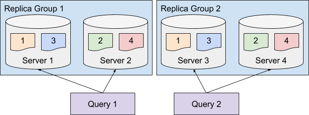
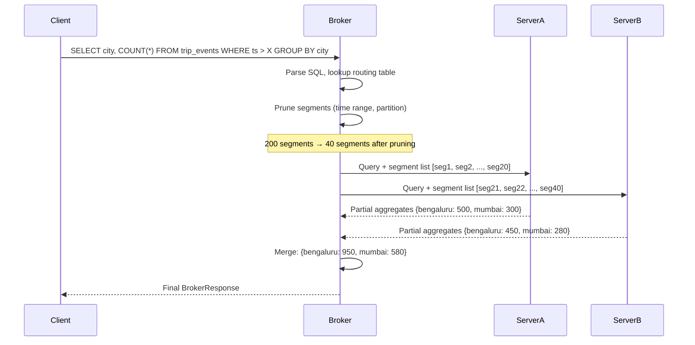

# 16. Routing, Partitioning and Rebalancing

The performance of a Pinot cluster is defined by the efficiency of its routing layer. While indexing optimizes how a server scans a segment, routing optimizes which segments are scanned in the first place. This distinction is the difference between a system that scales linearly and one that collapses under its own data volume.

### The Impact of Segment Pruning

| Optimization Level | Component | Primary Goal |
| :--- | :--- | :--- |
| **Cluster Level** | Broker Routing | Eliminate irrelevant segments and servers via pruning |
| **Server Level** | Segment Processing | Filter and aggregate rows within an individual segment |
| **Storage Level** | Indexing | Accelerate data retrieval within a specific column |

## The Query Routing Lifecycle

Every query in Pinot follows a scatter-gather execution model. The efficiency of this lifecycle is the primary determinant of total system latency.

### Phase 1: Planning and Metadata Lookup

When a SQL query reaches the broker, it immediately parses the statement to identify the target table and associated predicates. The broker maintains a near-real-time view of the cluster state through synchronized updates from ZooKeeper. It maps the table to its constituent segments via the routing table and identifies the specific servers hosting each segment via the instance mapping.

### Phase 2: Segment Pruning

Pruning is the most critical lever for performance. Before any network request is sent to a server, the broker evaluates query predicates against segment-level metadata. Time boundary pruning checks the minimum and maximum timestamps for each segment and ignores any segment whose time range does not overlap the query's time range. Partition pruning identifies the exact segments containing the queried partition key and prunes all others.

### Phase 3: Scatter and Fanout Control

The broker distributes the query plan to the minimum necessary set of servers. By pruning the majority of segments, the broker prevents the query from waking up every server in the cluster. Reducing the number of servers involved in a query leaves more CPU and I/O headroom for concurrent workloads.

| Strategy | Description |
|----------|-------------|
| **Time Pruning** | Uses segment time boundaries to eliminate segments outside the query's time range |
| **Partition Pruning** | Uses partition metadata to eliminate segments that do not match the query's partition key filter |
| **Bloom Filter Pruning** | Uses segment-level bloom filters to eliminate segments that definitely do not contain a specific value |


*Source: [Apache Pinot Documentation](https://docs.pinot.apache.org/basics/components)*

### Step 4: Server Selection

After pruning, the broker knows which segments are relevant. It then selects which server replicas to contact for each segment.

### Step 5: Scatter

The broker sends the query to each selected server, along with the list of segments that server should process.

### Step 6: Gather and Merge

As servers return partial results, the broker merges them into a final response.



## Segment Pruning in Depth

Segment pruning is the single most important performance optimization that Pinot performs automatically, but only when the table configuration and query patterns cooperate.

### Time-Based Pruning

Every segment in Pinot tracks the minimum and maximum values of the time column. When a query includes a time range predicate, the broker compares that predicate against each segment's time boundaries.

For time pruning to work well, the time column must be declared in the schema's `dateTimeFieldSpecs` and referenced in the table configuration's `segmentsConfig.timeColumnName`. Queries should include explicit time range predicates, and segment granularity should align with common query time ranges.

### Partition-Based Pruning

Partition-based pruning is more powerful than time pruning for queries that filter on a specific dimension. When a table is partitioned by a column, each segment contains data for only one partition value.

Consider a `trip_events` table partitioned by `city` with 10 partitions. If a query filters on `WHERE city = 'bengaluru'`, the broker can prune 9 out of 10 partitions' segments immediately.

Partition-based pruning requires alignment between three layers:

1. **Stream partitioning.** The Kafka topic must be partitioned by the same key.
2. **Pinot partition configuration.** The table configuration must declare the partition column, function and count.
3. **Query predicates.** The query must include an equality filter on the partition column.

Configuration example:

```json
{
  "tableName": "trip_events_REALTIME",
  "segmentsConfig": {
    "timeColumnName": "event_time",
    "replicasPerPartition": "2",
    "segmentAssignmentStrategy": "BalanceNumSegmentAssignmentStrategy"
  },
  "routing": {
    "segmentPrunerTypes": ["partition"],
    "instanceSelectorType": "replicaGroup"
  },
  "segmentPartitionConfig": {
    "columnPartitionMap": {
      "city": {
        "functionName": "Murmur",
        "numPartitions": 10
      }
    }
  }
}
```

### Combined Time and Partition Pruning

The most effective pruning combines time and partition filters. A query like `SELECT COUNT(*) FROM trip_events WHERE city = 'bengaluru' AND event_time > X AND event_time < Y` benefits from both pruning strategies simultaneously.

### Bloom Filter Pruning

Bloom filter pruning provides a probabilistic mechanism for pruning segments based on specific value lookups. It is useful for high-cardinality lookup patterns such as `WHERE trip_id = 'abc123'`.


## Partitioning Strategies

Choosing the right partition key and function is one of the most consequential decisions in Pinot table design.

### Choosing a Partition Key

The ideal partition key has four properties. It should appear frequently in WHERE clauses with equality filters (high selectivity in common queries). It should have enough distinct values to distribute data evenly but not so many that each partition contains very little data (moderate cardinality). It should represent a business-meaningful dimension (alignment with business semantics). Finally, the Kafka message key and the Pinot partition column must match (compatibility with stream keying).

### Partition Key Decision Matrix

| Characteristic | Good Partition Key | Poor Partition Key |
|---------------|-------------------|-------------------|
| Query filter frequency | Frequently filtered with equality | Rarely filtered |
| Cardinality | 5 to 100 distinct values | 1 or millions of values |
| Value distribution | Roughly uniform | Heavily skewed (80% in one value) |
| Stream key alignment | Matches Kafka message key | Different from Kafka key |
| Business meaning | Clear, stable category | Arbitrary or changing |

### Partition Functions

Pinot supports several partition functions. **Modulo** computes `value % numPartitions` and is suitable for integer columns. **Murmur** applies a MurmurHash and takes modulo, making it suitable for string columns. **ByteArray** hashes byte array values and is used for binary keys. **HashCode** uses Java's `hashCode()` method but is generally less uniform than Murmur. **BoundedColumnValue** maps each distinct value to a specific partition.

For most use cases, **Murmur** is the recommended partition function.

### Handling Data Skew

Data skew is the most common problem with partitioning. If one partition value accounts for a disproportionate share of the data, the server hosting that partition will be overloaded.

Use hash-based partitioning (Murmur) instead of value-based partitioning. Increase the partition count so that skewed values are still bounded in size. Use a composite key that combines the skewed column with a more uniform column. Monitor partition sizes after deployment.

```bash
# Check segment sizes for a table to detect partition skew
curl -s http://localhost:9000/segments/trip_events_REALTIME | \
  python -m json.tool | grep -E '"segmentName"|"sizeInBytes"'
```


## Replica Groups

Replica groups are an advanced routing feature that provides deterministic server selection for queries.

### Why Replica Groups Matter

Replica groups serve three purposes. Serving determinism means that when all segments for a query are served by the same replica group, the query benefits from warmer caches. Workload isolation allows different replica groups to serve different consumer classes. Rolling maintenance means that when a server in one replica group is taken offline, the other replica groups continue serving at full capacity.

### Configuring Replica Groups

```json
{
  "tableName": "trip_events_REALTIME",
  "instanceAssignmentConfigMap": {
    "CONSUMING": {
      "tagPoolConfig": {
        "tag": "events_REALTIME"
      },
      "replicaGroupPartitionConfig": {
        "replicaGroupBased": true,
        "numReplicaGroups": 2,
        "numInstancesPerReplicaGroup": 3
      }
    },
    "COMPLETED": {
      "tagPoolConfig": {
        "tag": "events_REALTIME"
      },
      "replicaGroupPartitionConfig": {
        "replicaGroupBased": true,
        "numReplicaGroups": 2,
        "numInstancesPerReplicaGroup": 3
      }
    }
  },
  "routing": {
    "instanceSelectorType": "replicaGroup"
  }
}
```

This configuration creates two replica groups, each with three server instances. The `replicaGroup` instance selector tells the broker to select all segments from the same replica group.

### Replica Groups for Upsert Tables

Upsert tables have a special relationship with replica groups. Because upsert semantics require that all records for a given primary key are served by the same server, upsert tables use a stricter routing posture:

```json
{
  "tableName": "trip_state_REALTIME",
  "routing": {
    "instanceSelectorType": "strictReplicaGroup"
  }
}
```

> [!IMPORTANT]
> Without strict replica group routing, upsert tables can produce incorrect results because different versions of the same primary key might be served by different servers.


## Segment Assignment Strategies

How segments are distributed across servers has a direct impact on query performance.

### BalanceNumSegmentAssignmentStrategy

This is the default strategy. It distributes segments across servers to equalize the number of segments per server. Its strength is simplicity and ease of reasoning. Its weakness is that it does not account for segment size differences.

### ReplicaGroupSegmentAssignmentStrategy

This strategy assigns segments to servers within replica groups, ensuring that each replica group has a complete copy of all segments.

### Custom Assignment via Tags

For multi-tenant deployments, Pinot supports assigning tables to specific server instances using tenant tags:

```json
{
  "tableName": "trip_events_REALTIME",
  "tenants": {
    "broker": "events_BROKER",
    "server": "events_REALTIME"
  }
}
```

Servers tagged with `events_REALTIME` will host segments for this table. This isolation prevents workloads from competing for the same server resources.


## Rebalancing

Rebalancing is the process of redistributing segments across servers to restore or improve the cluster's placement goals.

### When to Rebalance

Common triggers for rebalancing include adding servers (which join the cluster with no segments), removing servers before decommissioning them, changing the replication factor (for example from 2 to 3), changing tenant tags when a table's tenant assignment changes, and correcting skew that has accumulated over time as segment assignment becomes uneven.

### Rebalancing via the Controller API

Pinot provides a controller API for triggering rebalance operations:

```bash
curl -X POST \
  "http://localhost:9000/tables/trip_events_REALTIME/rebalance?type=realtime&reassignInstances=true&includeConsuming=false&downtime=false" \
  -H "Content-Type: application/json"
```

| Parameter | Description | Recommended Value |
|-----------|-------------|-------------------|
| `reassignInstances` | Whether to compute new instance assignments | `true` when adding/removing servers |
| `includeConsuming` | Whether to reassign currently consuming segments | `false` for zero-downtime rebalance |
| `downtime` | Whether to allow temporary unavailability | `false` for production |
| `bootstrap` | Whether to recompute assignments from scratch | `true` for major topology changes |
| `dryRun` | Whether to simulate the rebalance without executing | `true` for preview |

### Zero-Downtime Rebalancing

In production, rebalancing must not cause query failures or data unavailability. Pinot supports zero-downtime rebalancing through a carefully orchestrated process:

1. The controller computes the target segment-to-server assignment.
2. For each segment that needs to move, the controller first adds the segment to the target server.
3. Once the new replica is online and serving queries, the controller removes the segment from the source server.
4. At no point during this process is the segment unavailable.

### Rebalancing Best Practices

Always run a dry run first using `dryRun=true` to preview the rebalance plan. Exclude consuming segments by setting `includeConsuming=false`. Monitor during the rebalance by watching segment download rates, server memory usage and query latency. Rebalance one table at a time. If multiple tables need rebalancing, do them sequentially. Verify afterward that segment counts are balanced and all segments are ONLINE.

```bash
# Verify segment distribution after rebalance
curl -s "http://localhost:9000/tables/trip_events_REALTIME/size?detailed=true"

# Check ideal state versus external view
curl -s "http://localhost:9000/tables/trip_events_REALTIME/idealstate"
curl -s "http://localhost:9000/tables/trip_events_REALTIME/externalview"
```


## Routing Configuration Reference

| Configuration | Location | Purpose | Options |
|--------------|----------|---------|---------|
| `routing.segmentPrunerTypes` | Table config | Which pruning strategies to enable | `partition`, `time`, `bloom` |
| `routing.instanceSelectorType` | Table config | How the broker selects server replicas | `balanced`, `replicaGroup`, `strictReplicaGroup` |
| `segmentPartitionConfig.columnPartitionMap` | Table config | Partition column and function | Column name, function, partition count |
| `segmentsConfig.replicasPerPartition` | Table config | How many copies of each segment | Integer (typically 2 or 3) |
| `tenants.server` | Table config | Which server tag pool to use | Tenant tag string |
| `tenants.broker` | Table config | Which broker tag pool to use | Tenant tag string |

### Routing Configuration by Table Type

| Table Type | Recommended Instance Selector | Pruning Strategies | Notes |
|-----------|------------------------------|-------------------|-------|
| Append-only REALTIME | `replicaGroup` | `partition`, `time` | Partition alignment with Kafka improves pruning |
| Upsert REALTIME | `strictReplicaGroup` | `partition` | Strict routing required for correct upsert semantics |
| OFFLINE (batch) | `balanced` or `replicaGroup` | `time`, `partition` | Time pruning is highly effective for historical data |
| Dimension table | `balanced` | None needed | Dimension tables are small and fully replicated |


## Real-World Routing Patterns

### Pattern 1: City-Partitioned Operational Dashboard

A ride-sharing platform partitions its `trip_events` table by `city` because every dashboard query includes a city filter. When a dashboard user selects "Bengaluru" and a time range of the last 6 hours, the broker prunes by partition and by time. Out of 400 total segments, the query touches approximately 10 segments. Query latency drops from 800ms to under 50ms.

### Pattern 2: Tenant-Isolated Multi-Team Cluster

A fintech company runs three teams on a shared Pinot cluster: payments, risk and growth analytics. Each team has its own server pool tagged with team-specific tenant tags. Each team also has dedicated broker instances. This provides complete workload isolation.

### Pattern 3: Replica Groups for SLA Differentiation

An e-commerce platform serves two consumer classes from the same `order_events` table: a customer-facing order status API (requires p99 latency under 50ms) and an internal BI dashboard (can tolerate up to 2 seconds). The table is configured with two replica groups: one on high-performance instances for the API and one on cost-optimized instances for the dashboard.


## Diagnosing Routing Issues

When query performance is worse than expected, the routing layer is one of the first places to investigate.

### Check Segment Pruning Effectiveness

Use the query response metadata to determine how many segments were scanned versus how many exist:

```sql
SET enableTrace = true;
SELECT city, COUNT(*)
FROM trip_events
WHERE city = 'bengaluru'
  AND event_time > 1704067200000
GROUP BY city
```

The `BrokerResponse` includes `numSegmentsQueried`, `numSegmentsProcessed` and `numSegmentsMatched`. If `numSegmentsQueried` equals the total segment count, pruning is not working.

### Verify Partition Alignment

If partition pruning is not activating, check that the partition configuration matches the Kafka topic partitioning:

```bash
# Check Pinot's view of segment partitions
curl -s "http://localhost:9000/segments/trip_events_REALTIME/metadata" | \
  python -m json.tool | grep -i partition

# Compare with Kafka topic partition count
kafka-topics.sh --describe --topic trip-events --bootstrap-server kafka:9092
```

### Inspect Routing Tables

The broker exposes its routing table through the debug API:

```bash
curl -s "http://localhost:8099/debug/routingTable/trip_events_REALTIME" | \
  python -m json.tool
```

### Common Routing Problems and Solutions

| Symptom | Likely Cause | Solution |
|---------|-------------|----------|
| All segments scanned despite time filter | Time column not configured | Set `timeColumnName` in table config |
| Partition pruning not activating | Partition config mismatch with Kafka | Align `numPartitions` and hash function |
| Uneven query latency across executions | Random instance selection | Enable `replicaGroup` instance selector |
| Upsert returning stale values | Non-strict replica group routing | Use `strictReplicaGroup` for upsert tables |
| One server significantly hotter | Data skew in partition key | Increase partition count or change key |

### Cluster Topology Considerations

The Multi-Stage Engine (MSE) requires a shift in how server roles are evaluated. Because intermediate stages can execute on any node, the entire cluster must be viewed as a collective computation pool.

Resource homogeneity is essential: all servers must have adequate CPU and memory because a server hosting a small table may still be assigned as a high-load intermediate worker for joins involving large fact tables. Network infrastructure must be capable of handling significant shuffle data volumes between servers. High-bandwidth, low-latency networking is mandatory to prevent the network from becoming the primary query bottleneck. Increasing the server count expands the pool of potential workers for intermediate stages and directly improves total cluster throughput for complex execution graphs.

## Operating Heuristics

Treat MSE as a capability amplifier rather than a default performance upgrade. Use MSE only for queries that genuinely require its features. Single-table aggregations are almost always faster and more efficient on the single-stage engine. Continue to denormalize hot-path fields: if a frequent query enriches trips with merchant attributes, add those columns to the trip table to eliminate the join cost. Test MSE workloads under realistic concurrency, because a query that appears fast in isolation may struggle when competing for resources with many simultaneous users. Monitor the volume of data shuffled per query, since sudden increases often indicate that a table has grown large enough to trigger expensive hash joins. Configure small dimension tables with the `isDimTable` property to enable zero-shuffle lookup joins before resorting to more intensive hash join strategies. Use the `EXPLAIN PLAN` command to validate assumptions and look for unexpected shuffles on large tables before promoting any query to production.

## Common Pitfalls

Do not move every query to the multi-stage engine. MSE queries consume more memory per request and can lead to cluster instability if used for simple scans. Do not assume that a join succeeding in a development environment is production-ready. Validate against production-scale data to avoid out-of-memory errors. Do not use joins as a substitute for upstream modeling discipline, since data denormalization at ingestion remains the fastest path for query-time performance. Apply strict filters to the large side of any join operation, because shuffling a massive fact table without a time filter can quickly saturate all available cluster resources. Monitor the `maxRowsInJoin` configuration, because queries that produce more rows than this limit allows will fail to protect server memory. Since intermediate stages can run on any server, a single under-provisioned node can become a bottleneck for the entire multi-stage execution pipeline.

## Practice Prompts

1. Explain why the merchants_dim table is a useful join target. What specific characteristics make it suitable for a broadcast or lookup join strategy?
2. Review the SQL files in this repository and identify which ones require the multi-stage engine. Specify the exact SQL feature in each file that makes MSE necessary.
3. Identify a query you would intentionally keep on the single-stage engine even if MSE could execute it. Explain your reasoning regarding latency and resource consumption.
4. Design a window function query to compute a 7-day moving average of daily GMV per city. Describe the stages created and where data shuffles would occur.
5. Given a 500-million-row fact table and a 50,000-row dimension table, describe the expected execution plan for an INNER JOIN. Specify which join strategy is optimal and how to confirm it via EXPLAIN output.

## Suggested Labs and Follow-Through

- **[Lab 4: Index Tuning and Pruning](../labs/lab-04-index-tuning.md)** exercises segment pruning by comparing query performance.
- **Pruning effectiveness exercise:** Run a query with and without a time range predicate. Compare the `numSegmentsQueried` values.
- **Rebalance simulation:** Add a new server to the Docker Compose configuration, trigger a dry-run rebalance and review the proposed segment movements.
- **Partition skew analysis:** Use the segment metadata API to list segment sizes for each partition.

## Repository Artifacts

The following files in this repository are relevant to routing, partitioning and rebalancing:

- [`tables/trip_events_rt.table.json`](tables/trip_events_rt.table.json) demonstrates partition-aware table configuration.
- [`tables/trip_state_rt.table.json`](tables/trip_state_rt.table.json) demonstrates routing configuration for the upsert state table.
- [`sql/08_segment_pruning.sql`](sql/08_segment_pruning.sql) contains queries designed to exercise segment pruning.
- [`scripts/simulate_segment_pruning.py`](scripts/simulate_segment_pruning.py) provides a local simulation of segment pruning behavior.

## Further Reading and Resources

- [Apache Pinot Routing Documentation](https://docs.pinot.apache.org/operators/operating-pinot/tuning/routing) covers the routing table, pruning strategies and instance selectors.
- [Apache Pinot Rebalance Documentation](https://docs.pinot.apache.org/operators/operating-pinot/rebalance) provides the complete API reference.
- [Segment Pruning in Apache Pinot (YouTube)](https://www.youtube.com/watch?v=T70jnJzS2Ks) demonstrates pruning mechanics.
- [Apache Pinot at Uber: Scaling Real-Time Analytics (YouTube)](https://www.youtube.com/watch?v=JV0WxBwJqKE) discusses how Uber uses partitioning and routing.
- [StarTree Blog: Partition Pruning Best Practices](https://startree.ai/blog) includes articles on partition key selection and skew management.
- [LinkedIn Engineering: Scaling Pinot with Replica Groups](https://engineering.linkedin.com/blog) describes how LinkedIn uses replica groups to isolate workloads.

*Previous chapter: [15. Security and Governance](./15-security-and-governance.md)

*Next chapter: [17. Performance Engineering](./17-performance-engineering.md)
