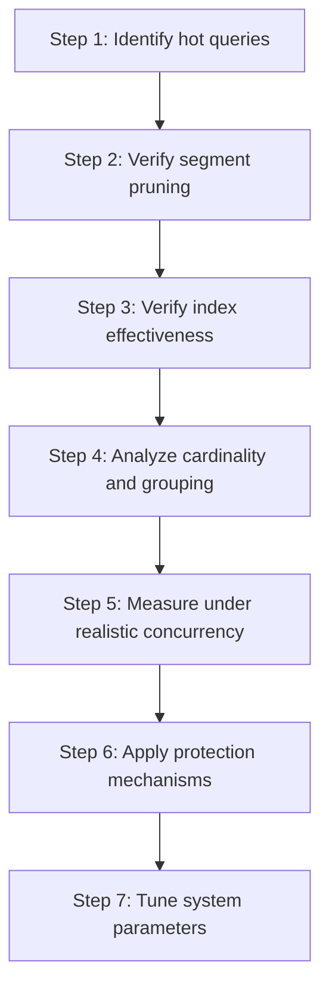
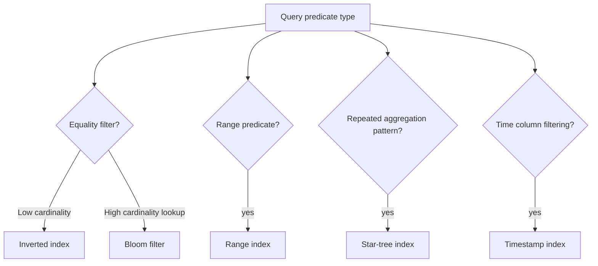

# 17. Performance Engineering

## Why Performance Engineering Is a Discipline, Not a One-Time Activity

Performance is not a feature you add at the end. It is a quality that emerges from the cumulative effect of schema design, index selection, segment layout, routing configuration, concurrency management and workload discipline. A Pinot cluster that performs well in a single-query test can fall apart under production concurrency if the underlying design decisions do not account for how the system behaves when many queries compete for the same resources.

This chapter treats performance engineering as a structured discipline with a clear methodology. It begins with identifying the queries that matter most, moves through the layers of optimization that affect those queries, provides concrete measurement techniques and ends with protection mechanisms.

> [!IMPORTANT]
> The most dangerous performance mistake is optimizing the wrong thing. Teams that add indexes before understanding their query patterns, tune segment sizes without measuring pruning effectiveness or celebrate single-query benchmarks without testing concurrency will find themselves fighting symptoms instead of causes.


## The Performance Engineering Methodology

Performance engineering in Pinot should follow a strict order. Each step builds on the previous one and skipping steps leads to wasted effort or incorrect conclusions.



### Step 1: Identify Hot Queries

Every Pinot deployment has a small number of queries that account for the majority of business value and cluster load. These are the hot queries. Performance engineering starts by identifying them.

Talk to the product and business teams to ask which dashboards, APIs or features are most critical. Analyze broker query logs to reveal which queries execute most frequently. Review the application layer API endpoints to determine which queries they execute.

Document the hot queries explicitly:

```sql
-- Hot Query 1: City-level KPIs for the operational dashboard
SELECT city, COUNT(*) AS trips, SUM(fare_amount) AS gmv, AVG(duration_ms) AS avg_duration
FROM trip_events
WHERE event_time > :start_time AND event_time < :end_time
  AND city = :city
GROUP BY city

-- Hot Query 2: Current trip state for the customer-facing status API
SELECT trip_id, status, driver_id, eta_minutes, fare_amount
FROM trip_state
WHERE trip_id = :trip_id

-- Hot Query 3: Top merchants by GMV for the partner dashboard
SELECT merchant_id, merchant_name, SUM(fare_amount) AS gmv
FROM trip_events
WHERE event_time > :start_time AND city = :city
GROUP BY merchant_id, merchant_name
ORDER BY gmv DESC
LIMIT 20
```

### Step 2: Verify Segment Pruning

Before looking at indexes or query shapes, verify that the broker is pruning segments effectively. Segment pruning is the highest-leverage optimization.

For each hot query, check the `numSegmentsQueried` field in the BrokerResponse:

```bash
curl -s -X POST "http://localhost:8099/query/sql" \
  -H "Content-Type: application/json" \
  -d '{"sql": "SELECT city, COUNT(*) FROM trip_events WHERE city = '\''bengaluru'\'' AND event_time > 1704067200000 GROUP BY city"}' | \
  python -c "
import json, sys
resp = json.load(sys.stdin)
print(f'Segments queried: {resp.get(\"numSegmentsQueried\", 0)}')
print(f'Segments processed: {resp.get(\"numSegmentsProcessed\", 0)}')
print(f'Total docs scanned: {resp.get(\"numDocsScanned\", 0)}')
"
```

If `numSegmentsQueried` is close to the total segment count, pruning is not working. Review the routing configuration before proceeding.

### Step 3: Verify Index Effectiveness

Once pruning is working, examine whether the right indexes exist for the hot query predicates:



For each hot query, verify that the necessary indexes exist:

| Hot Query Predicate | Index Type Needed | Verification |
|-------------------|------------------|-------------|
| `WHERE city = :city` | Inverted index on `city` | Check `tableIndexConfig.invertedIndexColumns` |
| `WHERE event_time > X` | Range index on `event_time` | Check `tableIndexConfig.rangeIndexColumns` |
| `WHERE trip_id = :id` | Bloom filter on `trip_id` | Check `tableIndexConfig.bloomFilterColumns` |
| `GROUP BY city, merchant_id` with `SUM` | Star-tree index | Check `tableIndexConfig.starTreeIndexConfigs` |

### Step 4: Analyze Cardinality and Grouping

High-cardinality GROUP BY operations are one of the most common sources of Pinot performance problems. When a query groups by a column with millions of distinct values, each server must maintain a hash map with millions of entries.

Warning signs of cardinality problems include GROUP BY on a user ID or transaction ID column (these columns typically have cardinality in the millions), multiple GROUP BY columns whose combined cardinality is explosive (grouping by `city, merchant_id, hour` might produce 10,000 groups while grouping by `city, merchant_id, minute, product_id` might produce 10 million groups) and missing LIMIT on GROUP BY queries (without a LIMIT, the broker must merge all groups).

Strategies for managing cardinality include adding precomputed helper columns (instead of computing `DATE_TRUNC('HOUR', event_time)` at query time, add an `event_hour` column during ingestion), using HAVING to filter small groups (adding `HAVING COUNT(*) > 10` eliminates noise groups), considering star-tree indexes for queries that repeatedly compute the same aggregation pattern and evaluating whether denormalization can reduce joins by embedding a name directly into the fact table.

### Step 5: Measure Under Realistic Concurrency

A single fast query proves very little about production performance. The meaningful question is how the cluster behaves when many queries execute simultaneously.

Concurrency testing should simulate realistic conditions by running a mix of hot queries that reflects the actual production workload at the expected concurrency level and for long enough to observe steady-state behavior.

A basic benchmarking approach:

```python
import asyncio
import aiohttp
import time
import statistics

BROKER_URL = "http://localhost:8099/query/sql"
CONCURRENCY = 20
ITERATIONS = 100

async def execute_query(session: aiohttp.ClientSession, sql: str) -> float:
    start = time.monotonic()
    async with session.post(BROKER_URL, json={"sql": sql}) as resp:
        result = await resp.json()
        elapsed = time.monotonic() - start
        if "exceptions" in result and result["exceptions"]:
            raise RuntimeError(f"Query failed: {result['exceptions']}")
        return elapsed * 1000

async def benchmark(queries: list[str]):
    connector = aiohttp.TCPConnector(limit=CONCURRENCY)
    async with aiohttp.ClientSession(connector=connector) as session:
        tasks = []
        for i in range(ITERATIONS):
            sql = queries[i % len(queries)]
            tasks.append(execute_query(session, sql))

        latencies = await asyncio.gather(*tasks)
        latencies.sort()

        print(f"p50 latency: {latencies[len(latencies)//2]:.1f}ms")
        print(f"p90 latency: {latencies[int(len(latencies)*0.9)]:.1f}ms")
        print(f"p99 latency: {latencies[int(len(latencies)*0.99)]:.1f}ms")
```

### Step 6: Apply Protection Mechanisms

Protection mechanisms are not separate from performance engineering. They are an integral part of it. Without protection mechanisms, one aggressive consumer can undo the careful optimization work.

#### Query Quotas

Pinot supports query rate quotas at the table level:

```json
{
  "tableName": "trip_events_REALTIME",
  "quota": {
    "maxQueriesPerSecond": 200,
    "storage": "50G"
  }
}
```

When the query rate exceeds the quota, additional queries receive a quota-exceeded error immediately.

#### Query Timeouts

Query timeouts prevent individual queries from monopolizing server threads:

```properties
pinot.broker.timeoutMs=15000
pinot.server.query.executor.timeout=10000
```

The server timeout should be lower than the broker timeout.

#### Query Options for Consumer-Specific Controls

Individual queries can include query options:

```sql
SET timeoutMs = 5000;
SET maxExecutionThreads = 4;
SELECT city, COUNT(*)
FROM trip_events
WHERE event_time > 1704067200000
GROUP BY city
```

#### Workload Isolation Through Tenants

For the strongest isolation, assign different tables to different server and broker instances using tenant tags. This provides resource-level isolation that quotas alone cannot achieve.

### Step 7: Tune System Parameters

Only after completing steps 1 through 6 should you consider tuning deeper system parameters.

#### Server Thread Pool Sizing

```properties
pinot.server.query.executor.numQueryRunnerThreads=16
pinot.server.query.executor.numQueryWorkerThreads=16
```

For CPU-bound workloads, the thread count should approximate the number of CPU cores.

#### Broker Reduce Thread Pool

```properties
pinot.broker.reduce.numReduceThreadsPerQuery=4
```

For queries that produce large partial result sets, increasing the reduce thread count can improve broker-side merge performance.

#### Memory Configuration

Pinot servers use both heap memory and off-heap memory. Heap memory should be sized based on the number of concurrent queries and the cardinality of GROUP BY operations. A starting point is 4 to 8 GB for small deployments and 16 to 32 GB for medium deployments. Off-heap memory is controlled by the OS page cache for memory-mapped segment data. Direct memory is used for column reads and network buffers and is configured via `-XX:MaxDirectMemorySize`.

```bash
JAVA_OPTS="-Xms16g -Xmx16g -XX:MaxDirectMemorySize=8g \
  -XX:+UseG1GC -XX:MaxGCPauseMillis=200"
```

#### Garbage Collection Tuning

G1GC is the recommended garbage collector. The key tuning parameter is `MaxGCPauseMillis`. Setting this to 200ms provides a reasonable balance between throughput and pause latency.


## Star-Tree Index: The Pre-Aggregation Accelerator

The star-tree index deserves special attention because it represents a fundamentally different approach to query performance.

### When Star-Tree Helps

Star-tree indexes are most effective when a small set of aggregation queries accounts for a large share of the workload, the queries group by the same dimensions and aggregate the same metrics and the raw data volume is large enough that scanning it for every query is expensive.

### How Star-Tree Works

During segment creation, Pinot builds a tree structure where each node represents a combination of dimension values. Leaf nodes store pre-aggregated metric values.

```json
{
  "tableIndexConfig": {
    "starTreeIndexConfigs": [
      {
        "dimensionsSplitOrder": ["city", "merchant_id", "status"],
        "skipStarNodeCreationForDimensions": [],
        "functionColumnPairs": [
          "COUNT__*",
          "SUM__fare_amount",
          "SUM__duration_ms",
          "AVG__fare_amount"
        ],
        "maxLeafRecords": 10000
      }
    ]
  }
}
```

### Star-Tree Cost Model

| Factor | Without Star-Tree | With Star-Tree |
|--------|------------------|----------------|
| Query latency (matching pattern) | 100-500ms | 1-10ms |
| Segment size | 1x | 1.2-2x |
| Ingestion time | 1x | 1.1-1.5x |
| Memory usage | 1x | 1.1-1.5x |
| Flexibility | All query patterns | Only pre-configured patterns |

> [!TIP]
> The trade-off is clear: star-tree dramatically accelerates a narrow set of query patterns at the cost of additional storage and ingestion overhead. If the hot queries match the star-tree configuration, the investment pays for itself many times over.

### Star-Tree Limitations

Only pre-configured aggregation patterns benefit from star-tree acceleration. A query that groups by a dimension not in the star-tree will fall back to raw data scanning. Adding new dimensions requires rebuilding segments: if the hot query pattern changes, segments must be reloaded. Star-tree does not help with selection queries that retrieve individual rows.


## Benchmarking Methodology

Effective benchmarking requires discipline. A benchmark that does not simulate realistic conditions can produce misleading results.

### Benchmarking Checklist

Before running a benchmark, confirm that the benchmark data matches production data in volume and distribution, that the queries used are the actual hot queries rather than synthetic ones, that the benchmark queries have been run once to warm the page cache before measuring, that queries run at the expected concurrency level, that the benchmark runs long enough to observe steady-state behavior and that the environment is controlled without production traffic present.

### What to Measure

| Metric | Why It Matters | How to Capture |
|--------|---------------|----------------|
| p50 latency | Typical user experience | Percentile from benchmark client |
| p90 latency | Worst case for most users | Percentile from benchmark client |
| p99 latency | Tail latency affecting SLAs | Percentile from benchmark client |
| Throughput (QPS) | Cluster capacity | Count of completed queries per second |
| Segments scanned | Pruning effectiveness | `numSegmentsQueried` in BrokerResponse |
| Docs scanned | Index effectiveness | `numDocsScanned` in BrokerResponse |
| Server CPU utilization | Resource headroom | System metrics during benchmark |

### Before-and-After Comparison

Every optimization should be evaluated with a before-and-after benchmark comparison:

1. Record the baseline measurement before the change.
2. Document the exact change made.
3. Record the post-change measurement using the same benchmark parameters.
4. Calculate the improvement or regression in each metric.

This discipline prevents "optimization theater" where changes are declared successful without evidence.


## Performance Anti-Patterns

Understanding what not to do is as valuable as understanding what to do.

### Anti-Pattern: Index Everything

Adding indexes to every column is tempting but counterproductive. Each index increases segment size, ingestion time and memory usage. Index only the columns that appear in hot query predicates.

### Anti-Pattern: Benchmark on a Quiet Laptop

Running a single query on a development laptop with 100 rows provides no useful information about production performance. Benchmark with production-scale data, production-representative queries and production-level concurrency.

### Anti-Pattern: Optimize Before Profiling

Changing configuration parameters without first measuring the current performance is a common waste of engineering time. Always measure first and use the BrokerResponse metadata to identify the bottleneck before making changes.

### Anti-Pattern: Ignore the Merge Phase

Teams often focus on server-side execution time and ignore the broker-side merge phase. Monitor broker-side merge time. If merge time is significant, consider reducing result cardinality or using star-tree indexes.

### Anti-Pattern: Unbounded Queries from BI Tools

Connecting a BI tool directly to the Pinot broker and allowing arbitrary queries is a recipe for problems. Place an analytics API between the BI tool and Pinot so the API can enforce query constraints.


## Performance Monitoring in Production

Performance engineering does not end after deployment. Production performance monitoring is essential for detecting regressions.

### Key Metrics to Monitor

| Metric | Warning Threshold | Critical Threshold |
|--------|------------------|-------------------|
| p99 query latency | 2x baseline | 5x baseline |
| Query error rate | > 0.1% | > 1% |
| Segments scanned (hot queries) | > 2x expected | > 5x expected |
| Server CPU utilization | > 70% sustained | > 90% sustained |
| GC pause duration | > 500ms | > 2000ms |

Track broker query latency (p50, p90, p99) over time with dashboards. Monitor broker query rate because sudden spikes may indicate a misconfigured dashboard. Watch server segments scanned per query because an increase may indicate that pruning has stopped working. Monitor server CPU utilization since sustained high CPU leaves no headroom for query spikes. Track segment count per table because a rapidly growing count may indicate that flush thresholds are too aggressive. Monitor GC pause duration and frequency because long pauses cause direct latency spikes.


## Operating Heuristics

Tune for the top queries that matter to the business, not for synthetic vanity benchmarks. A cluster optimized for a query nobody runs is optimized for nothing. Always compare optimization ideas against measured before-and-after evidence, because intuition about performance is frequently wrong. Use quotas and workload isolation as performance tools, not only as governance tools. Invest in star-tree indexes for stable, high-frequency aggregation patterns where the latency improvement is often 10x to 100x. Monitor performance continuously in production because performance characteristics change as data volumes grow. Keep benchmark scripts in the repository rather than in someone's scratch notebook. Benchmarks are infrastructure.


## Common Pitfalls

Benchmarking only single-query latency on a quiet cluster measures best-case performance, not production reality. Adding indexes without verifying they help the hot path creates pure overhead. Ignoring the difference between correctness success and performance success. A query that returns correct results in 30 seconds is functionally correct but operationally useless if the SLA requires sub-second latency. Tuning JVM parameters before understanding the workload leads into a deep rabbit hole of diminishing returns. Treating performance as a one-time project rather than an ongoing discipline means regressions go undetected until they become incidents. Copying configuration from blog posts without understanding the context is dangerous. A configuration that works for a 10-node cluster may not work for a 3-node cluster.


## Practice Prompts

1. Describe a benchmark plan for your three most important Pinot queries. Include data requirements, concurrency level and success criteria.
2. Why is concurrency testing essential even if single-query latency looks good? Give a concrete example.
3. How could a denormalized helper column outperform a more expressive SQL transform? Provide an example.
4. Design a star-tree index configuration for a table that serves a dashboard with three fixed aggregation views.
5. A team discovers that their p99 query latency doubled after a table configuration change. Describe the diagnostic process.
6. Compare the performance impact of adding an inverted index versus adding a star-tree index for a query that filters on `city` and aggregates `SUM(fare_amount)`.


## Suggested Labs and Follow-Through

- **[Lab 4: Index Tuning and Pruning](../labs/lab-04-index-tuning.md)** provides hands on exercises for measuring performance impact.
- **Benchmark exercise:** Write a concurrent benchmark script that runs the hot queries at 20 concurrent connections for 5 minutes. Record p50, p90 and p99 latencies.
- **Cardinality analysis exercise:** For each GROUP BY query, calculate the theoretical cardinality. Identify any queries where the cardinality exceeds 100,000.
- **Resource contention exercise:** Run two concurrent benchmark workloads against the same table and measure how the slow query affects the hot queries.


## Repository Artifacts

The following files in this repository support performance engineering workflows:

- [`scripts/bench_queries.py`](scripts/bench_queries.py) provides a basic query benchmarking framework.
- [`scripts/simulate_star_tree.py`](scripts/simulate_star_tree.py) demonstrates how star-tree pre-aggregation affects query performance.
- [`scripts/simulate_segment_pruning.py`](scripts/simulate_segment_pruning.py) simulates segment pruning behavior.
- `sql/` contains SQL examples organized by complexity and use case.
- `tables/` contains annotated table configurations demonstrating performance-relevant settings.


## Further Reading and Resources

- [Apache Pinot Query Options Documentation](https://docs.pinot.apache.org/users/user-guide-query/query-options) provides the complete reference for query-level performance controls.
- [Apache Pinot Star-Tree Index Documentation](https://docs.pinot.apache.org/basics/indexing/star-tree-index) covers star-tree configuration, limitations and best practices.
- [Apache Pinot Quota and Rate Limiting](https://docs.pinot.apache.org/operators/operating-pinot/tuning/query-quota) describes query quota configuration.
- [Performance Tuning Apache Pinot (YouTube)](https://www.youtube.com/watch?v=T70jnJzS2Ks) walks through a real-world performance tuning session.
- [Apache Pinot at LinkedIn: Performance at Scale (YouTube)](https://www.youtube.com/watch?v=JV0WxBwJqKE) discusses LinkedIn's approach to performance engineering.
- [StarTree Blog: Star-Tree Index Deep Dive](https://startree.ai/blog) includes detailed articles on star-tree design.
- [StarTree Blog: Pinot Performance Best Practices](https://startree.ai/blog) covers common performance anti-patterns.

*Previous chapter: [16. Routing, Partitioning and Rebalancing](./16-routing-partitioning-rebalancing.md)

*Next chapter: [18. Observability, Operations and Minions](./18-observability-operations-and-minions.md)
