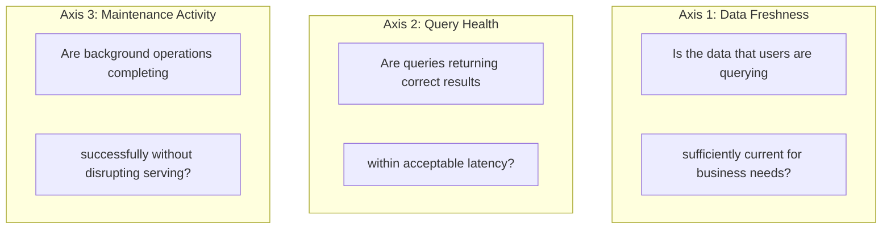
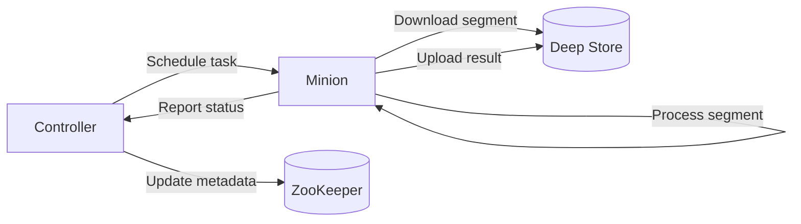

# 18. Observability, Operations and Minions

## Observability and Operational Discipline

The success of an Apache Pinot deployment is not measured by its initial uptime. It is measured by the operational discipline required to keep it healthy over years of shifting workloads. Observability is the only way to transform a "black box" into a predictable, manageable system.

### The Core Operational Questions

A mature Pinot operations practice must be able to answer six fundamental questions at any moment:

1. Is the data that users are querying sufficiently current?
2. Are consuming segments keeping pace with the stream?
3. Are queries returning results within the defined SLA?
4. Is there sufficient CPU and memory for the next quarter of growth?
5. Did the last configuration change improve or degrade performance?
6. Are background tasks completing successfully without disrupting query serving?


## The Three Pillars of Pinot Health

Cluster health is maintained by focusing on three interrelated areas of instrumentation and automation.

| Pillar | Focus | Primary Goal |
| :--- | :--- | :--- |
| **Infrastructure** | Metrics, Logs and Traces | Provide high-resolution visibility into every component. |
| **Procedures** | Dashboards and Alerting | Translate raw signals into safe, effective human actions. |
| **Automation** | The Minion Framework | Manage background tasks like compaction without losing control. |

> [!WARNING]
> A Pinot deployment without observability is like flying an aircraft without instruments. You might reach your destination in clear weather, but the first storm will be catastrophic.

## The Three Axes of Pinot Observability

Pinot observability should be organized along three axes. Each axis answers a different category of questions, requires different metrics and serves different operational audiences.



### Axis 1: Data Freshness

For real-time workloads, freshness is as important as latency. A perfectly fast query over stale data is still a failure from the user's perspective. If the operational dashboard shows trip counts from 15 minutes ago while the actual count has changed dramatically, the dashboard is misleading operators into making decisions based on obsolete information.

Freshness monitoring involves tracking the lag between event publication and query visibility across three dimensions:

| Signal | Definition |
| :--- | :--- |
| **Ingestion lag** | Time between message publication to Kafka and visibility in Pinot query results. Includes time in the Kafka consumer buffer, time to be written to the consuming segment and time for the segment to commit and become available to the broker. |
| **Consuming segment lag** | Offset difference between the latest message in a Kafka partition and the latest message consumed by the Pinot server. Available through Pinot's built-in JMX metrics and Kafka consumer group monitoring. |
| **Segment seal cadence** | Frequency at which consuming segments are sealed and converted to completed segments. Irregular cadence may indicate misconfigured flush thresholds or stalled ingestion. |

| Metric | Source | What It Tells You |
|--------|--------|-------------------|
| `realtime.consumptionCatchupLatencyMs` | Pinot server JMX | How far behind the consumer is from the latest Kafka offset |
| `LLC_PARTITION_CONSUMING` count | Controller API | Number of actively consuming partitions (should match Kafka partition count) |
| `realtime.rowsConsumed` | Pinot server JMX | Rate of row ingestion (should be stable or growing, not zero) |
| Kafka consumer group lag | Kafka monitoring | Offset difference between latest produced and latest consumed |
| Segment seal timestamp | Controller segment metadata API | When the last segment was sealed (gaps indicate stalled ingestion) |

A practical freshness monitoring query:

```sql
-- Check the latest event timestamp visible in the realtime table
SELECT MAX(event_time) AS latest_event_ms,
       DATEDIFF('SECOND', FROMUNIXTIME(MAX(event_time)/1000), NOW()) AS lag_seconds
FROM trip_events
```

> [!TIP]
> If `lag_seconds` exceeds the freshness SLO (for example, 60 seconds for operational dashboards), an alert should fire.

### Axis 2: Query Health

Query health encompasses latency, error rate, timeouts, resource consumption and result quality. Healthy queries return correct results within the expected latency envelope, consume predictable resources and do not interfere with other queries.

| Metric | Source | What It Tells You |
|--------|--------|-------------------|
| `pinot.broker.queryLatency` | Broker JMX | End-to-end query latency distribution |
| `pinot.broker.queryExecution.count` | Broker JMX | Query throughput (QPS) |
| `pinot.broker.queryExecution.errors` | Broker JMX | Query error count and rate |
| `pinot.broker.queryExecution.timeouts` | Broker JMX | Number of queries that exceeded the timeout |
| `pinot.server.queryExecution.latency` | Server JMX | Server-side execution time (excludes broker overhead) |
| `numSegmentsQueried` | BrokerResponse | Segments scanned per query (pruning effectiveness) |
| `numDocsScanned` | BrokerResponse | Rows scanned per query (index effectiveness) |

> [!IMPORTANT]
> Separating broker symptoms from server symptoms is critical. When query latency increases, operators need to determine whether the problem is on the broker side (merge phase, network, routing) or the server side (segment scanning, index access, resource contention). Maintaining separate dashboards for broker and server metrics enables faster triage.

A broker-side latency increase with stable server-side latency suggests a merge-phase bottleneck, network congestion or broker resource exhaustion. A server-side latency increase with stable broker-side overhead suggests a scanning problem caused by a missing index, a pruning regression or data skew.

### Axis 3: Maintenance Activity

Background tasks such as segment compaction, purge operations, merge-rollup and data retention enforcement are necessary for long-term cluster health but consume resources that could otherwise serve queries. Maintenance activity should be visible, scheduled with intent and understood as part of capacity planning.

| Metric | Source | What It Tells You |
|--------|--------|-------------------|
| Minion task status | Controller task API | Current and historical status of background tasks |
| Segment reload count | Controller API | Number of segments being reloaded (impacts server memory) |
| Retention enforcement | Controller logs | Segments deleted by retention policy |
| Compaction task duration | Minion task logs | How long compaction tasks take (capacity impact) |
| Deep store upload/download rate | Server/Minion metrics | Network bandwidth consumed by segment transfers |


## Metrics Infrastructure

Pinot exposes metrics through JMX (Java Management Extensions) by default. For modern observability stacks, these metrics are typically scraped by Prometheus using a JMX exporter and visualized in Grafana.

### Prometheus and JMX Exporter Setup

Each Pinot component (controller, broker, server, minion) exposes JMX metrics on a configurable port. The JMX exporter converts these metrics into Prometheus format:

```yaml
# prometheus-jmx-exporter-config.yaml
rules:
  - pattern: "org.apache.pinot<type=(\\w+), table=(\\w+)><>(\\w+)"
    name: "pinot_$1_$3"
    labels:
      table: "$2"
  - pattern: "org.apache.pinot<type=(\\w+)><>(\\w+)"
    name: "pinot_$1_$2"
```

Add the JMX exporter as a Java agent to each Pinot component:

```bash
# Server startup with JMX exporter
JAVA_OPTS="$JAVA_OPTS -javaagent:/opt/jmx_exporter/jmx_prometheus_javaagent.jar=9102:/opt/jmx_exporter/config.yaml"
```

### Grafana Dashboard Design

A well-designed Pinot Grafana dashboard should have four separate panel groups, each aligned to a specific observability concern.

**Freshness panel**
- Kafka consumer lag by partition
- Consuming segment count versus expected count
- Latest event timestamp versus current time
- Ingestion rate in rows per second

**Query health panel**
- Query latency percentiles (p50, p90, p99) over time
- Query throughput in QPS
- Error rate and timeout rate
- Segments scanned per query to detect pruning regressions

**Maintenance panel**
- Active Minion tasks and their status
- Segment count per table over time
- Deep store upload and download rate
- Retention enforcement activity

**Resource panel**
- CPU utilization per component
- Heap memory usage and GC activity
- Off-heap memory (direct memory and memory-mapped files)
- Disk usage per server
- Network I/O between components

### Health Check Endpoints

Pinot provides HTTP health check endpoints for each component:

```bash
# Controller health
curl -s http://localhost:9000/health
# Returns: "OK" when healthy

# Broker health
curl -s http://localhost:8099/health
# Returns: "OK" when healthy

# Server health (admin port)
curl -s http://localhost:8097/health/readiness
# Returns HTTP 200 when ready to serve queries
```

> [!NOTE]
> These endpoints should be used as liveness and readiness probes in Kubernetes deployments.


## Operational Procedures

Observability without action is just spectating. This section describes the operational procedures that translate monitoring signals into safe, effective cluster management actions.

### Procedure 1: Schema Change Rollout

Schema changes are among the most common and most impactful operational events in a Pinot deployment. A poorly executed schema change can break ingestion, corrupt query results or cause unexpected downtime.

**Pre-change checklist:**

1. Review the schema change against the contract hierarchy (JSON Schema, Pinot schema, OpenAPI spec). Does the change require updates to upstream producers or downstream consumers?
2. Verify backward compatibility. Is this an additive change (new optional column) or a breaking change (removed column, type change)?
3. Test the change in a non-production environment with representative data.
4. Notify downstream consumers of the upcoming change and its timeline.

**Execution:**

1. Apply the schema change using the controller API.
2. Update the table configuration if the new column requires indexes.
3. Trigger a segment reload if existing segments need to pick up the new schema.
4. Monitor ingestion lag and query health during and after the rollout.

**Post-change verification:**

1. Verify that new data includes the new column with expected values.
2. Verify that existing queries continue to return correct results.
3. Verify that ingestion lag has returned to normal levels.

```bash
# Apply a schema change
curl -X PUT "http://localhost:9000/schemas/trip_events" \
  -H "Content-Type: application/json" \
  -d @schemas/trip_events.schema.json

# Trigger segment reload to pick up the new schema
curl -X POST "http://localhost:9000/segments/trip_events_REALTIME/reload"

# Verify the schema was applied
curl -s "http://localhost:9000/schemas/trip_events" | python -m json.tool
```

### Procedure 2: Table Reload

A table reload causes all servers to re-read the table configuration and rebuild indexes for existing segments. Reloads are necessary after index configuration changes (adding or removing indexes), schema changes that affect existing segments or when segments have been replaced in the deep store.

A reload is warranted after adding a new index type (inverted, range, bloom, text or star-tree) to the table configuration, after changing segment configuration that affects how existing segments are served and after a bulk segment replacement in the deep store.

**Execution:**

```bash
# Reload all segments for a table
curl -X POST "http://localhost:9000/segments/trip_events_REALTIME/reload"

# Monitor reload progress
curl -s "http://localhost:9000/segments/trip_events_REALTIME" | \
  python -c "import json,sys; segs=json.load(sys.stdin); print(f'Total segments: {len(segs[0].get(\"REALTIME\", []) if segs else 0)}')"
```

During a reload, watch server memory usage (rebuilding indexes temporarily increases memory consumption), watch query latency (segments being rebuilt may be temporarily unavailable, increasing load on remaining replicas) and watch disk I/O (index rebuilding is I/O intensive).

### Procedure 3: Backfill and Segment Replacement

Backfilling replaces existing segments with corrected or enriched data. This is necessary when source data corrections occur, when a schema change requires reprocessing historical data or when a data quality issue is discovered in previously ingested data.

**Execution steps:**

1. Build replacement segments using a batch ingestion job.
2. Upload the replacement segments to the deep store.
3. Use the controller API to register the replacement segments.
4. Verify that the replacement segments are loaded and serving queries.
5. Clean up old segment versions from the deep store.

### Procedure 4: Controlled Maintenance Windows

Some operational activities are disruptive enough to warrant a dedicated maintenance window. These include major rebalances, bulk segment reloads, Pinot version upgrades and ZooKeeper maintenance.

**Maintenance window checklist:**

1. Notify all consumers of the maintenance window and expected impact.
2. Reduce or pause non-critical query traffic if possible.
3. Take a snapshot of current cluster state (segment counts, routing tables, configuration).
4. Execute the maintenance operation.
5. Verify cluster health after the operation completes.
6. Restore normal traffic and confirm that consumers are receiving expected results.


## The Minion Framework

Pinot Minion is a dedicated component for executing background maintenance tasks. Unlike the controller, broker and server, which handle metadata management, query routing and data serving respectively, the Minion handles asynchronous, potentially long-running tasks that maintain data quality and cluster health.

### What Minion Does

Minion tasks run independently of the query serving path. They are scheduled by the controller, executed on Minion instances and their results are reflected in the cluster's data and metadata.

**Segment Compaction (MergeRollupTask).** Compaction merges small segments into larger, more efficient segments. This is particularly important for realtime tables, where the continuous seal-and-commit cycle creates many small segments over time. Without compaction, the segment count grows indefinitely, which increases routing table size, reduces pruning effectiveness and adds per-segment overhead to every query.

```json
{
  "task": {
    "taskTypeConfigsMap": {
      "MergeRollupTask": {
        "100days.mergeType": "rollup",
        "100days.bucketTimePeriod": "1d",
        "100days.roundBucketTimePeriod": "1d",
        "100days.bufferTimePeriod": "7d",
        "100days.maxNumRecordsPerSegment": "5000000",
        "100days.maxNumRecordsPerTask": "50000000"
      }
    }
  }
}
```

In this configuration, segments older than 7 days (the buffer period) are eligible for compaction. The compaction groups segments into daily buckets, with each output segment containing up to 5 million records and each task processing up to 50 million records.

**Segment Purge (PurgeTask).** Purge tasks remove records from segments that match a deletion predicate. This is used for GDPR/CCPA right-to-deletion compliance, where specific user records must be removed from the cluster.

**Segment Conversion.** Conversion tasks transform segment formats, such as converting from one compression algorithm to another or rebuilding segments with updated index configurations.

**Realtime to Offline Conversion (RealtimeToOfflineSegmentsTask).** This task converts completed realtime segments into optimized offline segments. Offline segments are typically more compact and better indexed than realtime segments because they are built with complete knowledge of the data.

```json
{
  "task": {
    "taskTypeConfigsMap": {
      "RealtimeToOfflineSegmentsTask": {
        "bucketTimePeriod": "1d",
        "bufferTimePeriod": "2d",
        "roundBucketTimePeriod": "1d",
        "maxNumRecordsPerSegment": "5000000"
      }
    }
  }
}
```

### Minion Architecture



The controller acts as the task scheduler. It determines which tasks need to run based on the task configuration and current segment state. The Minion downloads the relevant segments from the deep store, processes them (merge, purge or convert), uploads the result segments to the deep store and reports completion to the controller. The controller then updates ZooKeeper metadata to reflect the new segments.

### Scheduling Minion Tasks

Minion tasks can be scheduled in two ways.

**Periodic scheduling.** The controller runs a periodic check and generates tasks for segments that meet the eligibility criteria:

```json
{
  "task": {
    "taskTypeConfigsMap": {
      "MergeRollupTask": {
        "schedule": "0 0 2 * * ?"
      }
    }
  }
}
```

This cron expression schedules compaction to run daily at 2:00 AM.

**On-demand execution.** Tasks can be triggered manually through the controller API:

```bash
# Trigger a merge-rollup task manually
curl -X POST "http://localhost:9000/tasks/schedule?taskType=MergeRollupTask&tableName=trip_events_REALTIME"

# Check task status
curl -s "http://localhost:9000/tasks/MergeRollupTask/taskstates" | python -m json.tool
```

### Monitoring Minion Tasks

Minion tasks should be monitored like any other production process. Track:

- **Task completion rate**. What percentage of scheduled tasks complete successfully
- **Task duration**. How long tasks take; increasing duration may indicate growing data volumes or resource contention
- **Task failure rate**. What percentage of tasks fail; failures may indicate deep store connectivity issues, insufficient memory or data corruption
- **Resource consumption**. How much CPU, memory and network bandwidth Minion tasks consume, which directly affects capacity planning

```bash
# List recent task executions
curl -s "http://localhost:9000/tasks/MergeRollupTask/taskcounts" | python -m json.tool

# Get details for a specific task
curl -s "http://localhost:9000/tasks/task/MergeRollupTask_trip_events_REALTIME_1704067200000/state"
```

### Minion Sizing

> [!IMPORTANT]
> Minion instances need sufficient resources to process segments efficiently without starving the query serving path.

| Resource | Guidance |
| :--- | :--- |
| **CPU** | Minion tasks are CPU-intensive during segment processing (sorting, indexing, compression). Allocate at least 4 cores per Minion instance. |
| **Heap memory** | Minion loads segments into memory during processing. Allocate heap proportional to the largest segment size plus overhead, with a starting point of 8 to 16 GB. |
| **Network bandwidth** | Minion downloads segments from and uploads results to the deep store. Ensure sufficient bandwidth between Minion instances and the deep store. |
| **Node isolation** | Run Minion instances on separate nodes from Pinot servers to prevent resource contention between maintenance tasks and query serving. |


## Runbooks

A serious Pinot team keeps runbooks for common operational scenarios. Runbooks transform tribal knowledge into repeatable, auditable procedures. They should be stored in the repository alongside the configurations and schemas they reference.

### Runbook: Stale Data Incident

**Trigger:** Freshness SLO violation (data lag exceeds the defined threshold).

**Triage steps:**

1. Check Kafka consumer lag. Is the Pinot consumer falling behind the Kafka producer?
2. Check consuming segment status. Are all expected consuming segments active?
3. Check server health. Are the servers hosting consuming segments healthy and responsive?
4. Check controller health. Is the controller online and managing segment state transitions?
5. Check for recent configuration changes. Did a schema, table config or topic change coincide with the freshness degradation?

**Resolution paths:**

If Kafka consumer lag is high but Pinot servers are healthy, the consumer may be throttled. Check `realtime.segment.flush.threshold.rows` and consumer configuration. If consuming segments are missing, check whether the server restarted and whether segment state in ZooKeeper is consistent. If the controller is unhealthy, the lead controller election may be stuck. Check ZooKeeper connectivity and controller logs.

### Runbook: Slow Query Incident

**Trigger:** Query latency SLO violation (p99 latency exceeds the defined threshold).

**Triage steps:**

1. Identify which queries are slow. Is it all queries or specific patterns?
2. Check segment pruning. Has the number of segments scanned per query increased?
3. Check server resource utilization. Is CPU, memory or disk I/O saturated?
4. Check for concurrent heavy operations. Is a rebalance, reload or Minion task running?
5. Check for data skew. Has one partition grown significantly larger than others?

**Resolution paths:**

If pruning has regressed, review recent table configuration changes that might have affected routing or partition alignment. If a server is resource-saturated, identify the workload causing saturation and apply quotas or isolation. If a Minion task is consuming resources, consider scheduling it for a maintenance window.

### Runbook: Schema Change Rollout

Described in the operational procedures section above. The runbook version includes specific team contacts, approval workflows and rollback procedures.

### Runbook: Table Reload

Described in the operational procedures section above. The runbook version includes memory headroom requirements, expected reload duration per segment count and alerting thresholds during the reload.

### Runbook: Rebalance Event

Described in Chapter 16. The runbook version includes the dry-run verification step, the monitoring dashboard to watch during rebalance and the post-rebalance verification queries.

### Runbook: Backfill and Replacement Job

Described in the operational procedures section above. The runbook version includes the batch job specification, the deep store upload verification and the segment registration API calls.


## Alerting Strategy

Effective alerting distinguishes between conditions that require immediate human attention and conditions that should be investigated during business hours. Over-alerting leads to alert fatigue, where operators start ignoring alerts because most of them are noise.

### Alert Severity Levels

| Severity | Response Time | Examples |
|----------|-------------|---------|
| Critical | Immediate (page on-call) | All brokers down, data lag > 15 minutes, query error rate > 5% |
| Warning | Within business hours | Data lag > 5 minutes, p99 latency > 2x baseline, disk usage > 80% |
| Info | Next sprint planning | Segment count growing faster than expected, Minion task duration increasing |

## Alert Design Principles

| Principle | Detail |
| :--- | :--- |
| **Alert on symptoms, not indicators** | An alert for "query error rate exceeds 1 percent" is more actionable than "server CPU exceeds 90 percent." User-facing symptoms drive faster, more targeted responses. |
| **Include context in every alert** | Every alert must include the affected table, the current metric value, the defined threshold and a link to the relevant runbook. Alerts without context slow down incident response. |
| **Suppress duplicates** | Group identical conditions into a single alert with a count to prevent on-call fatigue. Noise trains responders to ignore alerts. |
| **Set thresholds from observed data** | Base thresholds on historical measurements rather than arbitrary constants. If p99 latency typically fluctuates between 50ms and 100ms, a warning threshold of 200ms is appropriate. |

## Operating Heuristics

| Strategy | Operational Goal |
| :--- | :--- |
| **Unified Metrics** | Track data freshness and serving latency together. Low latency on stale data is a failure of the user experience. |
| **Dashboard Isolation** | Separate query-plane dashboards from maintenance dashboards. This allows faster diagnosis during active incidents. |
| **Preemptive Runbooks** | Write and review runbooks before incidents occur. Troubleshooting during a production failure is the least effective time to design a fix. |
| **Minion Visibility** | Treat Minion tasks as production workloads. Every task must be traceable through the controller API to ensure background work is visible. |


## Common Pitfalls

| Pitfall | Consequence |
| :--- | :--- |
| **Monitoring only CPU while ignoring freshness** | Infrastructure metrics alone miss the primary signal for real-time user experience. A perfectly fast query over stale data is still a failure. |
| **Treating Minion tasks as hidden background noise** | Unmonitored compaction or merge tasks cause unexplained performance degradation that is difficult to trace after the fact. |
| **Keeping operational procedures in individual minds** | Undocumented tribal knowledge creates knowledge silos that collapse during personnel changes or production incidents. |
| **Running Minion tasks on the same instances as servers** | Resource contention degrades query latency. Minion processing is CPU and I/O intensive and competes directly with query serving under load. |


## Practice Prompts

1. **SLO Design:** Define a freshness SLO for the trip_state table. Specify the maximum acceptable lag, the measurement method and the escalation procedure.
2. **Diagnostic Flow:** Identify which metrics distinguish a broker-side bottleneck from a server-side issue during a high-latency incident.
3. **Capacity Planning:** Provide an example of a Minion task that could impact query serving if not properly sized.
4. **Task Evaluation:** How do you determine if a MergeRollupTask is providing a benefit? Specify the metrics you would compare before and after enabling compaction.

## Suggested Labs and Follow-Through

- [Lab 8: SLO and Incident Drill](../labs/lab-08-slo-incident.md) provides a structured exercise for defining SLOs, configuring alerts and running through incident scenarios.
- **Monitoring setup exercise:** Configure Prometheus to scrape Pinot JMX metrics using the JMX exporter. Build a Grafana dashboard with panels for freshness, query latency and segment counts. Run the demo workload and observe the metrics.
- **Freshness SLO exercise:** Define a freshness SLO for the `trip_events` table. Write a monitoring query that measures current freshness. Configure an alert that fires when freshness exceeds the SLO threshold.
- **Minion task exercise:** Configure a MergeRollupTask for the `trip_events` table with a 1-day bucket period and a 2-day buffer period. Trigger the task manually, monitor its execution and verify that the segment count decreases after compaction.
- **Runbook writing exercise:** Write a complete runbook for one of the operational scenarios described in this chapter. Include the trigger condition, triage steps, resolution paths, verification steps and post-incident actions.


## Repository Artifacts

The following files in this repository support observability and operations:

- [`docker-compose.yml`](docker-compose.yml) includes the service definitions that expose the monitoring endpoints described in this chapter.
- [`scripts/validate_repo.py`](scripts/validate_repo.py) provides a validation script that checks the health of repository artifacts and can be extended to check cluster health.
- [`scripts/bootstrap_demo.sh`](scripts/bootstrap_demo.sh) demonstrates the operational steps for standing up the demo environment.
- [`src/pinot_playbook_demo/pinot_client.py`](src/pinot_playbook_demo/pinot_client.py) contains the Pinot client that can be used for health checks and operational queries.


## Further Reading and Resources

- [Apache Pinot Monitoring Documentation](https://docs.pinot.apache.org/operators/operating-pinot/monitoring) covers the metrics exposed by each Pinot component and their interpretation.
- [Apache Pinot Minion Documentation](https://docs.pinot.apache.org/operators/operating-pinot/minion) provides the complete reference for Minion task types, configuration and scheduling.
- [Apache Pinot MergeRollupTask](https://docs.pinot.apache.org/operators/operating-pinot/minion/merge-rollup-task) describes the compaction task configuration and behavior in detail.
- [Monitoring Apache Pinot with Prometheus and Grafana (YouTube)](https://www.youtube.com/watch?v=T70jnJzS2Ks) walks through setting up a complete monitoring stack for a Pinot deployment.
- [Operating Apache Pinot at Scale (YouTube)](https://www.youtube.com/watch?v=JV0WxBwJqKE) covers operational best practices from teams running Pinot in production at scale.
- [StarTree Blog: Pinot Observability Best Practices](https://startree.ai/blog) includes articles on monitoring strategies, alerting design and operational maturity models for Pinot deployments.
- [Google SRE Book: Monitoring Distributed Systems](https://sre.google/sre-book/monitoring-distributed-systems/) provides foundational guidance on monitoring philosophy that applies directly to Pinot operations.

*Previous chapter: [17. Performance Engineering](./17-performance-engineering.md)

*Next chapter: [19. Failure Modes and Troubleshooting](./19-failure-modes-and-troubleshooting.md)
