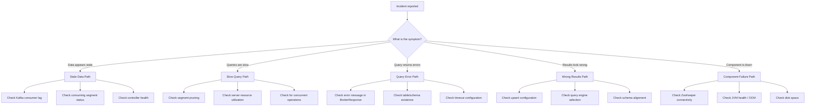
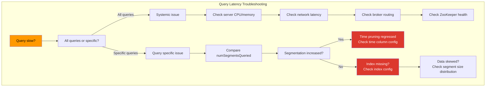
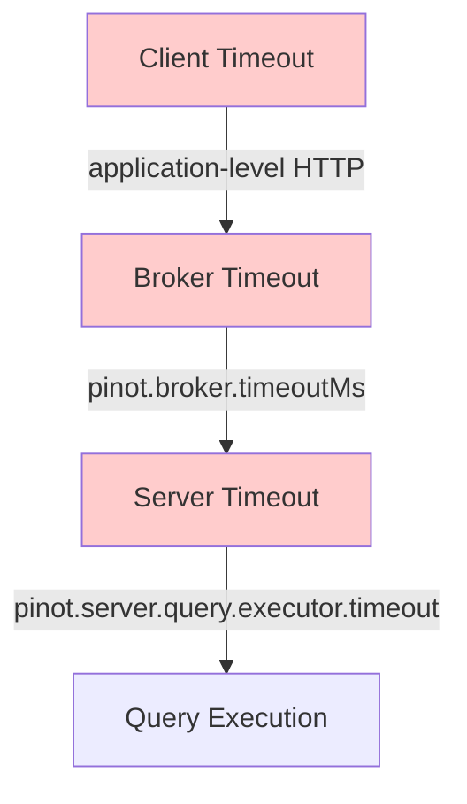

# 19. Failure Modes and Troubleshooting

## Why a Troubleshooting Mental Model Matters More Than a List of Fixes

Every distributed system fails. The question is not whether your Pinot cluster will experience problems, but whether your team can diagnose and resolve them quickly when they occur. The difference between a 5-minute resolution and a 5-hour investigation often comes down to whether the team has a structured troubleshooting mental model or resorts to random guessing.

Most Pinot incidents fall into a small number of failure families. Within each family, the diagnostic steps follow a predictable pattern. When you recognize which family a symptom belongs to, you can skip the irrelevant possibilities and focus on the most likely causes. This chapter provides that mental model.

> [!IMPORTANT]
> The five failure families that account for the vast majority of Pinot production incidents are: ingestion and data freshness failures, schema and configuration drift, routing and placement issues, query shape and performance regressions and operational change side effects. Understanding these families transforms troubleshooting from a stressful guessing game into a methodical diagnostic process.

This chapter is organized by observable symptom rather than by internal mechanism. When something goes wrong, operators see symptoms (stale data, slow queries, wrong results, errors in the response). They do not see internal mechanisms directly. Starting from what is visible and working toward the root cause is the most effective troubleshooting approach.


## The Troubleshooting Decision Tree

When a Pinot incident occurs, the first step is to classify the symptom. This classification determines which diagnostic path to follow.




## Symptom: Data Is Stale

Stale data is the most common production concern for realtime Pinot tables. Users report that the dashboard shows old numbers, the API returns outdated trip statuses or the metrics on the screen do not reflect recent activity. This symptom belongs to the ingestion and data freshness failure family.

### Diagnostic Path

**Step 1: Is the source producing data?**

Before investigating Pinot, verify that the upstream system is actually publishing messages to Kafka. If the producer has stopped, Pinot will naturally show stale data because there is nothing new to consume.

```bash
# Check the latest offset in the Kafka topic
kafka-run-class.sh kafka.tools.GetOffsetShell \
  --broker-list kafka:9092 \
  --topic trip-events \
  --time -1
```

If the latest offset has not changed in the expected time window, the problem is upstream of Pinot.

**Step 2: Is the Pinot consumer reading from Kafka?**

If Kafka has fresh data but Pinot shows stale results, check the consumer lag:

```bash
# Check Pinot's consumer group lag
kafka-consumer-groups.sh \
  --bootstrap-server kafka:9092 \
  --describe \
  --group trip_events_REALTIME
```

A growing lag indicates that the Pinot consumer is falling behind the producer. This can happen because the consumer is throttled by flush threshold configuration, because the server hosting the consuming segment is overloaded or because the consumer encountered an error and stopped.

**Step 3: Are consuming segments active?**

The controller API reveals whether consuming segments exist and are in the expected state:

```bash
# Check consuming segment status
curl -s "http://localhost:9000/segments/trip_events_REALTIME" | \
  python -c "
import json, sys
data = json.load(sys.stdin)
segments = data[0].get('REALTIME', []) if data else []
consuming = [s for s in segments if 'consuming' in s.lower() or '__0__' in s]
print(f'Total segments: {len(segments)}')
print(f'Recent segments: {consuming[-5:] if consuming else \"none\"}')
"
```

If there are no consuming segments, the table may have been disabled, the server may have crashed or the segment state in ZooKeeper may be inconsistent.

**Step 4: Is the controller healthy?**

The controller manages the lifecycle of consuming segments, including creation, seal and commit. If the controller is unhealthy, new consuming segments may not be created after a seal, leading to a gap in ingestion.

```bash
# Check controller health
curl -s http://localhost:9000/health

# Check if there is a lead controller
curl -s "http://localhost:9000/leader" | python -m json.tool
```

**Step 5: Check for recent configuration changes.**

Did someone change the schema, table configuration, stream configuration or Kafka topic settings recently? Configuration changes that affect ingestion can cause subtle freshness issues that are not immediately obvious.

### Common Stale Data Root Causes

| Root Cause | Diagnostic Signal | Resolution |
|-----------|-------------------|------------|
| Kafka producer stopped | Kafka topic offset not advancing | Fix the upstream producer |
| Consumer lag due to slow processing | Kafka consumer group shows growing lag | Increase flush threshold rows, add servers |
| Server hosting consuming segment crashed | Consuming segment missing from segment list | Restart server, verify ZooKeeper state |
| Controller leadership lost | No lead controller, segment lifecycle stalled | Check ZooKeeper, restart controller |
| Stream config changed (wrong topic, broker) | Recent table config change coincides with staleness | Revert or fix stream configuration |
| Kafka topic recreated with different partitions | Partition count mismatch between topic and table | Align table configuration with new topic |


## Symptom: Query Latency Regressed

Query latency regressions manifest as dashboards loading slowly, API timeouts increasing or users reporting that "Pinot is slow." This symptom can have many root causes and the diagnostic path must distinguish between routing problems, indexing problems, resource contention and workload changes.

### Diagnostic Path

**Step 1: Is the regression affecting all queries or specific queries?**

Run several representative queries and compare their latencies. If all queries are slow, the problem is likely systemic (resource contention, network issue, component failure). If only specific queries are slow, the problem is likely related to those queries' table, routing or data shape.

**Step 2: Check segment pruning.**

Compare the `numSegmentsQueried` value in the BrokerResponse against the expected value. If the number of segments scanned has increased significantly, pruning may have regressed.

```sql
-- Run a hot query and examine the response metadata
SET enableTrace = true;
SELECT city, COUNT(*)
FROM trip_events
WHERE city = 'bengaluru'
  AND event_time > 1704067200000
GROUP BY city
```

> [!TIP]
> Pruning regressions can be caused by a table configuration change that removed or altered the partition pruner configuration, by new segments that do not have correct partition metadata (for example, due to a Kafka topic repartitioning) or by a schema change that affected the time column configuration.

**Step 3: Check for recent data changes.**

Compare current and previous segment metadata. Has the segment count increased dramatically? Has the average segment size changed? Has data skew shifted so that one partition is now much larger than others?

```bash
# Compare current segment count to expected
curl -s "http://localhost:9000/segments/trip_events_REALTIME/size?detailed=true" | python -m json.tool
```

A sudden increase in segment count can happen when flush thresholds are changed, when a backfill creates many new segments or when retention settings are modified to keep more historical data.



**Step 4: Check server resource utilization.**

If pruning and data shape look normal, the problem may be resource contention on the servers.

| Contention Type | Root Cause |
| :--- | :--- |
| **CPU saturation** | Too many concurrent queries or a single expensive query consuming all available CPU cores |
| **Memory pressure** | Large `GROUP BY` result sets, upsert primary key maps or excessive segment count consuming heap |
| **Disk I/O contention** | Segment loading, compaction or rebalancing consuming disk bandwidth while queries are running |
| **GC pauses** | Long garbage collection pauses that produce latency spikes resembling query slowness |

**Step 5: Check for concurrent operations.**

Is a rebalance, segment reload or Minion task running? These operations consume server resources and can increase query latency during execution.

```bash
# Check for active rebalance
curl -s "http://localhost:9000/tables/trip_events_REALTIME/idealstate" | python -m json.tool | grep -c "CONSUMING\|ONLINE\|OFFLINE"

# Check for active Minion tasks
curl -s "http://localhost:9000/tasks/running" | python -m json.tool
```

### Common Latency Regression Root Causes

| Root Cause | Diagnostic Signal | Resolution |
|-----------|-------------------|------------|
| Pruning regression | `numSegmentsQueried` increased | Restore routing/partition config |
| Segment count explosion | Segment count much higher than expected | Adjust flush thresholds, run compaction |
| Data skew shift | One server significantly hotter than others | Repartition or rebalance |
| Index removed accidentally | Table config diff shows missing index | Restore index config, reload segments |
| Concurrent rebalance/reload | Active rebalance visible in controller API | Wait for completion or reschedule |
| New expensive query pattern | New query in broker query log consuming resources | Apply quota or optimize the new query |
| GC pressure | Long GC pauses in server logs | Tune heap size or GC parameters |


## Symptom: Query Returns Errors

Query errors appear as exceptions in the BrokerResponse, HTTP error codes from the broker or connection timeouts from the client. The error message in the BrokerResponse is the most important diagnostic signal.

### Common Error Messages and Their Causes

| Error Message | Likely Cause | Resolution |
|--------------|-------------|------------|
| `Table not found` | Table name misspelled, table not created or table disabled | Verify table name, check controller for table status |
| `Query execution timed out` | Query exceeds timeout limit | Optimize query, increase timeout or add indexes |
| `No segments found for table` | Table exists but has no data | Check ingestion, verify segment state |
| `Exceeded maximum rows limit` | Query result exceeds broker's row limit | Add LIMIT clause, increase `broker.query.response.limit` |
| `Failed to parse SQL` | SQL syntax error | Fix the SQL syntax |
| `Column not found` | Column name does not exist in schema | Verify column name against the schema |
| `Quota exceeded` | Query rate exceeds table quota | Reduce query rate or increase quota |
| `Server unavailable` | Server hosting required segments is down | Check server health, verify segment replicas |

### Timeout Troubleshooting

Timeouts are the most common query error in production. They occur when a query takes longer than the configured timeout period. Timeouts can happen at multiple levels:



> [!NOTE]
> When diagnosing timeouts:
> 1. Determine which timeout fired (client, broker or server) by examining error messages and logs.
> 2. If the server timed out, the query is too expensive for the current configuration. Options include adding indexes, improving pruning, simplifying the query or increasing the timeout.
> 3. If the broker timed out but the server did not, the merge phase may be the bottleneck. Reduce result set size or increase broker reduce threads.
> 4. If the client timed out but the broker completed successfully, increase the client-side timeout or optimize network latency.


## Symptom: Upsert Results Look Wrong

Upsert tables are designed to show the latest state of each entity. When the results do not reflect the expected latest state, users report that trip statuses are wrong, deleted records still appear or updates seem to be lost. This symptom belongs to the schema and configuration drift failure family.

### Diagnostic Path

**Step 1: Verify primary key configuration.**

The primary key determines which records are considered updates to the same entity. If the primary key is wrong, records that should be grouped together are treated as separate entities.

```bash
# Check the table's primary key configuration
curl -s "http://localhost:9000/tables/trip_state_REALTIME" | \
  python -c "
import json, sys
config = json.load(sys.stdin)
upsert = config.get('REALTIME', {}).get('tableIndexConfig', {}).get('upsertConfig', {})
print(f'Upsert mode: {upsert.get(\"mode\", \"not configured\")}')
print(f'Comparison column: {upsert.get(\"comparisonColumns\", \"not set\")}')
pk = config.get('REALTIME', {}).get('segmentsConfig', {}).get('primaryKeyColumns', [])
print(f'Primary key: {pk}')
"
```

**Step 2: Verify the comparison column.**

The comparison column determines which version of a record is "newer." If the comparison column values are not monotonically increasing (or if two records have the same comparison column value), upsert resolution may not produce the expected result.

```sql
-- Check for records with the same primary key and comparison column
SELECT trip_id, event_version, COUNT(*) AS occurrences
FROM trip_state
GROUP BY trip_id, event_version
HAVING COUNT(*) > 1
ORDER BY occurrences DESC
LIMIT 20
```

**Step 3: Check for out of order arrivals.**

If records arrive out of order (an older version arrives after a newer version), the older version may overwrite the newer version. This is a common problem with event replay, CDC reprocessing or multi-producer architectures.

```sql
-- Find entities where the latest visible version is not the maximum version
SELECT trip_id,
       event_version AS visible_version,
       (SELECT MAX(event_version) FROM trip_state t2 WHERE t2.trip_id = trip_state.trip_id) AS max_version
FROM trip_state
WHERE event_version < (SELECT MAX(event_version) FROM trip_state t2 WHERE t2.trip_id = trip_state.trip_id)
LIMIT 20
```

**Step 4: Verify partition alignment.**

For upsert to work correctly, all records for the same primary key must be processed by the same server. This requires that the Kafka topic is partitioned by the primary key and that the Pinot table uses `strictReplicaGroup` routing.

If records for the same `trip_id` arrive in different Kafka partitions, they will be processed by different servers and neither server will have the complete picture.

```bash
# Check partition alignment
kafka-run-class.sh kafka.tools.GetOffsetShell \
  --broker-list kafka:9092 \
  --topic trip-state
```

**Step 5: Check for delete markers.**

If deleted records still appear in query results, verify that the delete column is configured correctly and that the delete marker value matches what the producer is sending:

```json
{
  "upsertConfig": {
    "mode": "FULL",
    "deleteRecordColumn": "is_deleted",
    "comparisonColumns": ["event_version"]
  }
}
```

> [!IMPORTANT]
> The producer must set `is_deleted` to `true` for deletion records. If the producer sends a different value (such as `1` or `"yes"`), the deletion will not be recognized.

### Common Upsert Root Causes

| Root Cause | Diagnostic Signal | Resolution |
|-----------|-------------------|------------|
| Wrong primary key | Multiple "entities" for what should be one | Fix primary key columns in table config |
| Missing comparison column | Records resolved in arrival order, not version order | Add comparison column to upsert config |
| Out-of-order arrivals | Older versions overwriting newer ones | Use comparison column, fix producer ordering |
| Kafka partition misalignment | Same trip_id in multiple partitions | Re-key Kafka topic by primary key |
| Non-strict replica group routing | Different servers serving different versions | Enable `strictReplicaGroup` routing |
| Wrong delete marker value | Deleted records still visible | Align producer delete value with config |
| Schema drift | New fields missing from upsert resolution | Update schema and reload |


## Symptom: Join or Window Query Fails or Is Too Slow

Queries that use joins, window functions or other advanced SQL features are handled by the multi stage engine (MSE, v2). When these queries fail or perform poorly, the diagnostic path differs from single stage query troubleshooting.

### Diagnostic Path

**Step 1: Verify engine selection.**

If a join or window query is running on the single stage engine (v1), it will fail because v1 does not support these operations. Verify that the MSE is enabled:

```sql
-- Enable MSE for the query
SET useMultistageEngine = true;
SELECT t.city, t.trip_id, m.merchant_name
FROM trip_events t
JOIN merchants_dim m ON t.merchant_id = m.merchant_id
WHERE t.event_time > 1704067200000
LIMIT 100
```

**Step 2: Assess join data volumes.**

MSE join performance depends heavily on the size of the datasets being joined. A join between a 100-million-row fact table and a 10,000-row dimension table is very different from a join between two 100-million-row tables.

For large-to-large joins, consider whether the query can be restructured. One side of the join may be filterable to reduce its size. The hot join field may be a candidate for denormalization into the fact table to eliminate the join entirely. Alternatively, the query may be splittable into a lookup pattern where the application fetches the dimension data separately.

**Step 3: Check intermediate result sizes.**

MSE stages exchange intermediate results between workers. If an intermediate stage produces a very large result set (for example, a cross join or an unfiltered scan), the data shuffle can overwhelm memory and network bandwidth.

**Step 4: Review the query plan.**

The MSE provides query plan information that reveals how the query is decomposed into stages and how data flows between them. Examine the plan for unexpected full table scans, missing predicate pushdown or inefficient join strategies.


## Symptom: Component Is Down

When a Pinot component (controller, broker, server or Minion) stops responding, the diagnostic path focuses on infrastructure-level issues.

### Controller Down

**Impact:** No new table or schema changes can be applied. Segment lifecycle management (seal, commit, retention) may be affected. Existing queries continue to work because brokers and servers operate independently once the routing table is established.

**Diagnostic steps:**

1. Check the controller process. Is the JVM still running? Did it crash with an OOM error?
2. Check ZooKeeper connectivity. The controller requires ZooKeeper to function. If ZooKeeper is unreachable, the controller will not start.
3. Check disk space on the controller node. If the controller's local storage is full, it may fail to write state.
4. Check the controller logs for stack traces or error messages.

### Broker Down

**Impact:** Queries routed to the failed broker will fail. If multiple brokers are running behind a load balancer, the load balancer should route traffic to healthy brokers automatically.

**Diagnostic steps:**

1. Check the broker process and JVM health.
2. Check ZooKeeper connectivity. The broker needs ZooKeeper to maintain its routing table.
3. Check for memory exhaustion. Large query result sets or high cardinality GROUP BY operations can cause OOM.
4. Check network connectivity between the broker and servers.

### Server Down

**Impact:** Segments hosted on the failed server are unavailable. If segments are replicated (replication factor > 1), queries will be served by other replicas with no data loss. If segments are not replicated, queries for those segments will fail.

**Diagnostic steps:**

1. Check the server process and JVM health. Servers are the most memory-intensive component due to segment storage and query execution.
2. Check disk space. Servers store segment data locally and can fill their disks if retention or compaction is not configured.
3. Check for long GC pauses that may have made the server unresponsive to ZooKeeper heartbeats, causing ZooKeeper to consider it dead.
4. Check whether a rebalance or segment reload was in progress when the server failed.

### Recovery After Component Failure

After a component failure and restart:

1. **Verify the component registers with ZooKeeper.** Check the ZooKeeper node list to confirm the component's instance registration.
2. **Verify segment assignments.** For servers, confirm that segments are assigned and loaded correctly.
3. **Verify query health.** Run representative queries and compare latency to baseline.
4. **Check for data gaps.** For servers that were hosting consuming segments, verify that no messages were lost during the downtime.


## Post-Incident Learning

The correct output of troubleshooting is not only service recovery. It is durable improvement. Every significant incident should produce at least one of the following artifacts: an updated runbook that captures the diagnostic steps and resolution for this incident type, a new monitoring alert that would have detected the problem earlier, a test or simulation that validates the fix and prevents regression, a configuration change that makes the system more resilient to the root cause or a contract or schema update that prevents the data-level issue from recurring.

> [!TIP]
> This repository includes all of these artifact types (runbooks in docs, monitoring scripts, simulation utilities, configuration files and contracts) because operational maturity should leave traces in the codebase.

### Post-Incident Review Template

```markdown
## Incident Summary
* **Date:** YYYY-MM-DD
* **Duration:** X minutes
* **Severity:** Critical / Warning
* **Affected tables:** table_name_REALTIME

## Timeline
* HH:MM - Symptom first observed
* HH:MM - Alert fired
* HH:MM - Root cause identified
* HH:MM - Fix applied
* HH:MM - Normal operation confirmed

## Root Cause
One paragraph explaining the root cause.

## Resolution
Steps taken to resolve the incident.

## Action Items
1. [Runbook] Update the stale-data runbook with this diagnostic path.
2. [Alert] Add an alert for X metric exceeding Y threshold.
3. [Config] Change Z setting to prevent recurrence.
4. [Test] Add a simulation that validates the fix.
```


## Operating Heuristics

| Heuristic | Practice |
| :--- | :--- |
| **Classify before changing anything** | Resist the urge to start toggling settings. Identify which failure family the symptom belongs to and then follow the diagnostic path for that family. |
| **Prefer hypothesis-driven debugging** | Formulate a specific hypothesis, identify the diagnostic signal that would confirm or refute it and then check that signal before making any changes. |
| **Turn every meaningful incident into a durable artifact** | If the incident was worth waking someone up for, it is worth documenting the diagnosis, resolution and prevention steps in the repository. |
| **Keep the decision tree visible** | Post the troubleshooting decision tree on the team wiki or in the on-call handbook. It should be the first reference a responder consults when paged. |
| **Debug upsert problems from the producer side first** | Most upsert issues originate in producer key assignment, Kafka partitioning or delete marker logic rather than in Pinot's upsert engine itself. |
| **Check the simple things first** | Before investigating complex distributed systems issues, verify that the table exists, the query syntax is correct and the servers are running. |


## Common Pitfalls

| Pitfall | Why It Matters |
| :--- | :--- |
| **Debugging upsert from the query layer alone** | Upsert correctness depends on producer key assignment, Kafka partitioning, comparison column values and delete marker semantics. Queries reveal symptoms but not root causes. |
| **Changing indexes before verifying routing** | If the broker is scanning 10x more segments than expected, no index change will compensate for that wasted work. Verify pruning first. |
| **Declaring an incident resolved without updating runbooks** | An incident that produces no durable artifacts will recur. The person who resolved it may not be available next time. |
| **Assuming the problem is in Pinot when it might be upstream** | Stale data is frequently caused by producer failures, Kafka topic issues or network problems between components. Verify the full pipeline before diving into Pinot internals. |
| **Ignoring the BrokerResponse metadata** | The response contains rich diagnostic information including segments queried, docs scanned, execution time and exception details. Always examine it when troubleshooting query issues. |
| **Conflating correlation with causation** | A config change followed by a latency increase does not prove the change caused the problem. Investigate alternative explanations before declaring a root cause. |


## Practice Prompts

1. Build a step by step stale-data triage flow from source (Kafka) to query response. Include the API calls and diagnostic queries at each step.
2. What would you inspect first if a previously fast GROUP BY query suddenly scanned far more rows? List the top three hypotheses and the diagnostic signal for each.
3. How would you turn an incident where upsert produced wrong results into a set of regression-prevention artifacts in this repository?
4. A team reports that their queries are timing out, but only during the early morning hours. What time-correlated activities might explain this pattern?
5. Design a post-incident review process for a Pinot team. What are the key sections of the review document, who should participate and what outputs should the review produce?
6. An engineer proposes adding an inverted index on every column to "prevent all query performance issues." Explain why this approach is counterproductive and what methodology should be used instead.


## Suggested Labs and Follow-Through

- **[Lab 8: SLO and Incident Drill](../labs/lab-08-slo-incident.md)** provides a structured incident simulation exercise with defined triage steps and recovery procedures.
- **Stale data simulation:** Stop the Kafka producer while the demo stack is running. Observe how the freshness metric degrades over time. Restart the producer and measure the recovery duration.
- **Upsert debugging exercise:** Intentionally produce out-of-order messages to the `trip-state` topic. Use the diagnostic queries from this chapter to identify the affected entities and explain why the upsert result is incorrect.
- **Timeout analysis exercise:** Set the broker timeout to 1 second and run a complex GROUP BY query. Examine the BrokerResponse error message. Increase the timeout and compare the successful execution time to understand the margin.
- **Post-incident artifact exercise:** Choose one failure scenario from this chapter and write a complete post-incident review document using the template provided, including at least two concrete action items.


## Repository Artifacts

- [`sql/07_upsert_debug.sql`](sql/07_upsert_debug.sql) contains diagnostic queries for investigating upsert state issues.
- [`sql/08_segment_pruning.sql`](sql/08_segment_pruning.sql) contains queries designed to verify segment pruning behavior.
- [`scripts/simulate_upsert.py`](scripts/simulate_upsert.py) simulates upsert processing to help understand state reconciliation.
- [`scripts/setup_pinot.py`](scripts/setup_pinot.py) provides a reference for validating cluster setup and configuration.


## Further Reading and Resources

- [Apache Pinot Troubleshooting Guide](https://docs.pinot.apache.org/operators/operating-pinot/troubleshooting) provides the official troubleshooting documentation with component-specific diagnostic steps.
- [Apache Pinot FAQ](https://docs.pinot.apache.org/basics/getting-started/faq) addresses common questions and error messages encountered during development and production.
- [Debugging Apache Pinot Queries (YouTube)](https://www.youtube.com/watch?v=T70jnJzS2Ks) walks through query troubleshooting with live examples including examining BrokerResponse metadata and diagnosing pruning issues.
- [Apache Pinot Upsert Deep Dive (YouTube)](https://www.youtube.com/watch?v=JV0WxBwJqKE) covers upsert mechanics, failure modes and debugging techniques.
- [StarTree Blog: Troubleshooting Common Pinot Issues](https://startree.ai/blog) includes articles on diagnosing specific failure patterns encountered by StarTree customers.
- [Google SRE Book: Effective Troubleshooting](https://sre.google/sre-book/effective-troubleshooting/) provides foundational guidance on structured troubleshooting methodology that applies to any distributed system.

*Previous chapter: [18. Observability, Operations and Minions](./18-observability-operations-and-minions.md)

*Next chapter: [20. Patterns, Anti-Patterns and Decision Framework](./20-patterns-antipatterns-and-decision-framework.md)
