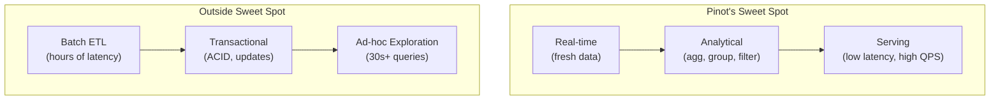
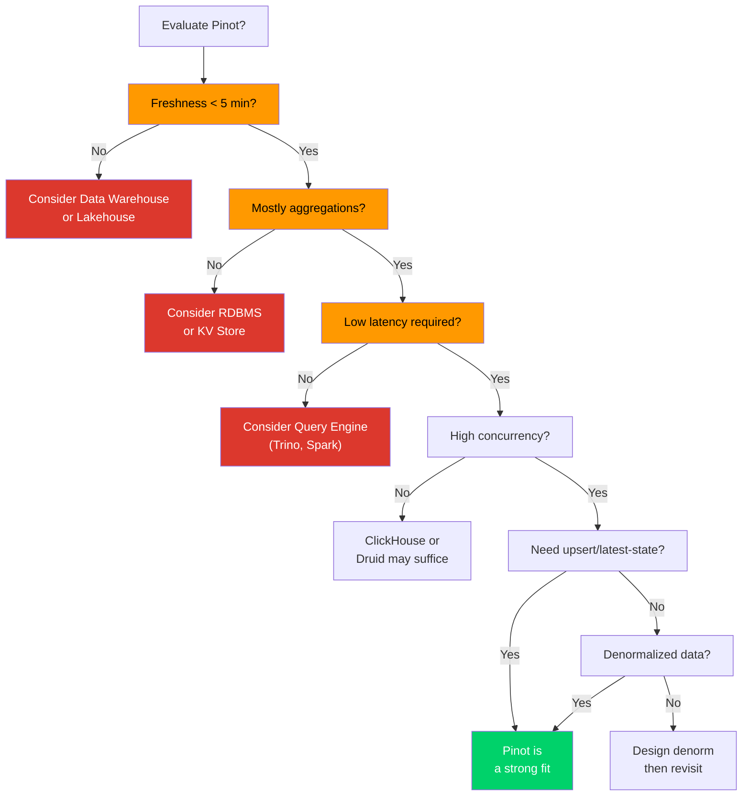
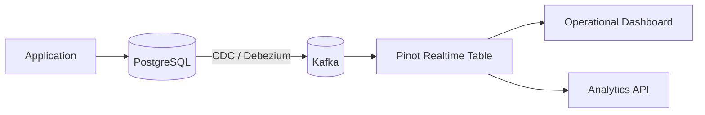
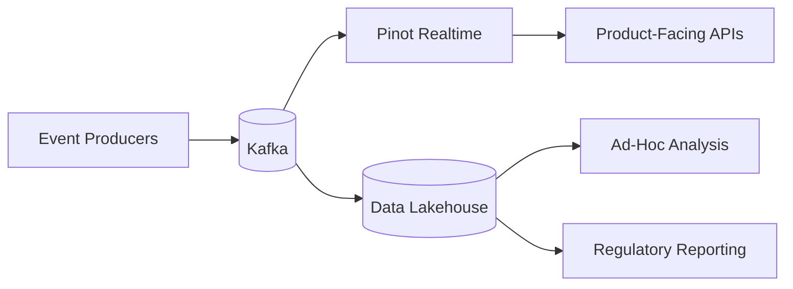
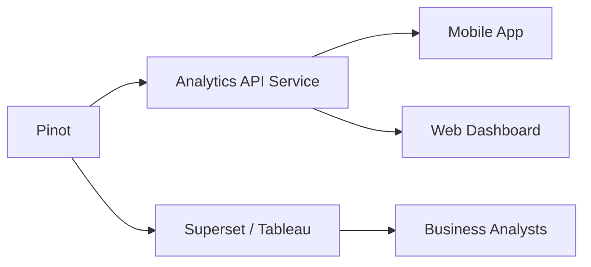

# 20. Patterns, Anti-Patterns and Decision Framework

## Why Knowing When Not to Use Pinot Is as Important as Knowing How to Use It

The most expensive mistake in data architecture is choosing the wrong tool for the job. A team that forces Pinot into a workload it was never designed for will spend months fighting performance issues, wrestling with limitations and building complex workarounds, all while a simpler tool would have solved the problem more effectively. Conversely, a team that avoids Pinot for a workload that perfectly matches its strengths will build a slower, more complex and more expensive solution using general-purpose tools.

This chapter distills the lessons from the preceding nineteen chapters into a practical decision framework. It describes the workload patterns where Pinot excels, the anti-patterns that signal a mismatch between the workload and the tool and the architectural pairings that let Pinot do what it does best while other systems handle what they do best.

> [!NOTE]
> The framework is not a flowchart to follow blindly. It is a structured way of thinking about the trade-offs involved in choosing Pinot as part of a data architecture. Every real-world decision involves nuance, constraints and context that no framework can fully capture. But a good framework prevents the most common mistakes and surfaces the most important questions.


## Pinot's Sweet Spot: Real-Time Analytical Serving

Apache Pinot is best understood as a **real time analytical serving engine**. This phrase contains three key concepts and all three must be present for Pinot to be the right choice.

**Real-time** means the data must be fresh. If the workload can tolerate hours or days of latency between event occurrence and query visibility, a traditional data warehouse or lakehouse is often simpler and more cost-effective. Pinot's architecture is optimized for ingesting data from streams and making it queryable within seconds.

**Analytical** means the queries must be analytical in nature: aggregations, GROUP BY operations, filtering and statistical computations over large datasets. If the workload is primarily transactional (single row lookups by primary key, multi-row updates within a transaction, strong consistency guarantees), a relational database or key value store is the right tool.

**Serving** means the results must be served to applications, dashboards or users at low latency and high concurrency. If the queries are ad-hoc exploration by data analysts who can wait 30 seconds for a result, a query engine like Trino, Spark SQL or BigQuery is more appropriate. Pinot is designed for the serving tier, where predictable sub second latency matters.




## Patterns That Fit Pinot Well

The following workload patterns align with Pinot's architectural strengths. Teams building systems that match these patterns should consider Pinot as a primary candidate for their analytical serving layer.

### Pattern 1: Operational Dashboards

Real-time dashboards used by operations teams to monitor business performance, detect anomalies and make operational decisions are one of Pinot's strongest use cases. Examples include ride-sharing operations centers, e-commerce order monitoring, logistics tracking and financial transaction monitoring. These dashboards require fresh data (within seconds of event occurrence), low query latency (sub second page loads) and support for aggregation queries (counts, sums, averages by dimension). Pinot's realtime ingestion, columnar storage and aggregation-optimized indexes are designed for exactly this workload.

```sql
SELECT city, status, COUNT(*) AS trip_count, AVG(eta_minutes) AS avg_eta
FROM trip_state
WHERE city = :city
GROUP BY city, status
```

### Pattern 2: Customer-Facing Embedded Analytics

Analytics features embedded directly in a product's user interface represent another strong fit. Examples include usage dashboards in SaaS products, spending summaries in banking apps, delivery tracking in logistics platforms and performance metrics in advertising platforms. These features serve end users at high concurrency (potentially millions of concurrent users) with strict latency requirements. Pinot's scatter gather architecture, segment pruning and columnar indexes enable sub-100ms query latency even on large datasets.

```sql
SELECT DATE_TRUNC('DAY', event_time) AS day,
       COUNT(*) AS order_count,
       SUM(order_amount) AS total_spent
FROM user_orders
WHERE user_id = :user_id
  AND event_time > :thirty_days_ago
GROUP BY day
ORDER BY day
```

### Pattern 3: Streaming Experimentation Metrics

Real-time A/B test monitoring where experiment results need to be visible within minutes of assignment is well suited to Pinot. Data scientists and product managers monitor conversion rates, engagement metrics and error rates across experiment variants. Experiment monitoring requires fresh data (to detect problems with new variants quickly), flexible aggregation (slicing metrics by variant, segment and dimension) and moderate query concurrency (dozens of data scientists querying simultaneously).

### Pattern 4: Fraud and Anomaly Detection Surfaces

User interfaces and APIs that surface potential fraud signals, unusual transaction patterns or operational anomalies in real time are a natural match. Human analysts review flagged events and take action. Fraud detection requires scanning recent events with complex filters (amount ranges, geographic patterns, velocity checks), aggregating signals across dimensions and presenting results to analysts at interactive speeds.

### Pattern 5: Marketplace State Monitoring

Real-time views of marketplace state, including inventory levels, pricing dynamics, supply-demand balance and partner performance, combine realtime ingestion (prices and inventory change constantly) with latest-state serving (upsert tables reflecting current inventory) and analytical queries (aggregations by category, region or partner). Pinot's architecture handles all three of these requirements simultaneously.

### Pattern 6: Ad-Tech and Clickstream Analytics

High-volume event analytics for advertising platforms, web analytics and user behavior tracking generate extremely high event volumes (millions of events per second) with predictable query patterns (dimensional aggregations with time and audience filters). Pinot's append-only realtime tables, star-tree indexes and partition pruning are designed for this scale.


## Anti-Patterns: When Pinot Is the Wrong Choice

Recognizing anti-patterns is just as important as recognizing good fits. The following patterns indicate that Pinot is likely the wrong tool and forcing it into these roles will create ongoing operational pain.

### Anti-Pattern 1: Transactional Source of Truth

Using Pinot as the primary database for transactional workloads where strong consistency, multi-row transactions and single row update guarantees are required will lead to data integrity issues. Pinot is an eventually consistent analytical system. It does not support ACID transactions, row-level locking or the consistency guarantees that transactional workloads require. The appropriate approach is to use a relational database (PostgreSQL, MySQL) or a distributed transactional database (CockroachDB, TiDB, Spanner) for the transactional workload, then feed the results to Pinot via CDC or streaming for analytical queries.

### Anti-Pattern 2: Deeply Normalized Schema Everywhere

Forcing a fully normalized schema design (third normal form, star schema with many dimension tables) into Pinot because "joins exist in the multi stage engine" produces unacceptable latency. While the MSE supports joins, Pinot's join performance is fundamentally different from a traditional database. Pinot does not have a query optimizer that can rewrite complex multi-table joins and large joins require shuffling data between stages. Deeply normalized schemas that work well in PostgreSQL or Snowflake will produce unacceptable latency in Pinot. The correct approach is to denormalize hot fields into the fact table during ingestion and keep a small number of dimension tables for lookup enrichment, without expecting Pinot to perform the same normalization-to-query transformation that a relational database provides.

### Anti-Pattern 3: Uncontrolled Ad-Hoc Exploration

Giving data analysts direct SQL access to the Pinot broker and allowing them to write arbitrary queries without constraints creates systemic risk. Pinot is optimized for a small set of well-defined query patterns. Unrestricted ad-hoc queries can include full table scans, unlimited result sets, expensive cross joins and complex nested subqueries that overwhelm the cluster and degrade performance for all consumers. The correct approach is to route ad-hoc exploration to a data warehouse (Snowflake, BigQuery, Redshift) or a query engine (Trino, Spark SQL) that is designed for that workload, while reserving Pinot for the serving layer where queries are well-defined and constrained.

### Anti-Pattern 4: Long-Horizon Back-Office Analytics

Using Pinot as the only data store for multi-year historical analysis, regulatory reporting or back-office analytics that require scanning years of data with complex transformations does not leverage Pinot's strengths. While Pinot can store historical data, its strengths are in low-latency serving of recent data. Scanning years of historical data for a monthly regulatory report is better handled by a warehouse or lakehouse that is optimized for large batch scans. The correct pairing is to have Pinot serve the hot, recent data for operational and product facing use cases while the warehouse serves the cold, historical data for back-office and regulatory use cases.

### Anti-Pattern 5: Tuning Based on Anecdote

Making Pinot configuration changes based on "someone said this worked for them" rather than measured evidence from your own workload is dangerous. Pinot's performance characteristics depend heavily on the specific data distribution, query patterns and cluster topology. A configuration that works for a 10-node cluster processing ad-click events may be counterproductive for a 3-node cluster processing financial transactions. The correct approach is to follow the performance engineering methodology described in Chapter 17: measure before and after every change, and document the evidence.


## The Decision Checklist

Before committing to Pinot for a workload, the following questions should be answered. If the answers do not align with Pinot's strengths, alternative tools should be considered.



| Question | Good Answer for Pinot | Warning Sign |
|----------|----------------------|-------------|
| What are the top 10 queries? | Aggregation queries with selective filters | Full table scans, complex multi-table joins |
| What freshness is required? | Seconds to low minutes | Hours, days or "whenever the ETL finishes" |
| Do we need latest-state, history or both? | One or both (clear answer) | "We are not sure yet" |
| Which fields are hot filters and group-bys? | 3 to 10 known columns | "All columns might be used" |
| Which dimensions should be denormalized? | Already identified and discussed | "We will just join everything" |
| What isolation and quota model do we need? | Known consumer types with SLA requirements | "Everyone shares everything" |
| How will we test contracts, benchmarks and backfills? | Plan exists or in progress | "We will figure it out later" |

> [!WARNING]
> If three or more answers fall in the "Warning Sign" column, the workload may not be a good fit for Pinot or the team may not be ready to adopt it effectively.


## Architecture Pairings

The strongest Pinot architectures pair Pinot with other systems rather than trying to replace everything with Pinot. Each system in the architecture has a clear, well-defined role.

### Pairing 1: OLTP Database + CDC + Pinot



The application stores its data in a relational database for transactional integrity. Changes are captured via CDC and streamed to Kafka. Pinot consumes the stream and provides low-latency analytical queries. In this pairing, PostgreSQL serves as the source of truth and handles transactional processing with strong consistency. Kafka provides change event transport, decoupling and replay capability. Pinot handles analytical serving, aggregation and low-latency dashboards and APIs.

### Pairing 2: Kafka + Pinot + Warehouse/Lakehouse



In an event-driven architecture, the same event stream feeds both a real time serving layer (Pinot) and a long-horizon analytical layer (lakehouse). Kafka acts as the event backbone, delivering events to all consumers. Pinot serves hot data with sub second latency for the last N days. The lakehouse provides cold data storage, ad-hoc exploration, regulatory reporting and ML training data.

### Pairing 3: Pinot + Application API + BI Tools



Pinot serves both application-facing APIs (which need strict latency and access control) and BI tools (which need flexible visualization). Pinot handles data storage and query execution. The analytics API provides access control, query constraints and response formatting for applications. BI tools provide visualization and exploration for internal analysts, subject to appropriate query guardrails.

### Pairing 4: Pinot + Warehouse for Cold History

Pinot serves the most recent data (last 30 to 90 days) for operational use cases. Older data is offloaded to a warehouse for long-horizon analysis. Pinot handles hot data with sub second latency and strict SLAs. The warehouse handles cold data with moderate latency and flexible exploration. The application layer routes queries to Pinot or the warehouse based on the time range.


## Technology Comparison Matrix

When evaluating Pinot against alternative technologies, the comparison should focus on workload fit rather than abstract feature lists.

| Capability | Apache Pinot | Apache Druid | ClickHouse | Elasticsearch | Trino/Presto | Snowflake/BigQuery |
|-----------|-------------|-------------|------------|--------------|-------------|-------------------|
| Realtime ingestion (seconds) | Strong | Strong | Moderate | Strong | Weak | Weak |
| Sub-second aggregation queries | Strong | Strong | Strong | Moderate | Weak | Weak |
| High query concurrency (1000+ QPS) | Strong | Moderate | Moderate | Moderate | Weak | Moderate |
| Upsert / latest-state serving | Strong | Weak | Moderate | Moderate | N/A | N/A |
| Complex multi-table joins | Moderate (MSE) | Weak | Strong | Weak | Strong | Strong |
| Ad-hoc exploration | Moderate | Moderate | Strong | Moderate | Strong | Strong |
| Full-text search | Moderate | Weak | Moderate | Strong | Weak | Weak |
| Multi-year historical analysis | Moderate | Moderate | Strong | Moderate | Strong | Strong |
| Operational simplicity | Moderate | Moderate | Strong | Moderate | Moderate | Strong (managed) |
| Cost at high scale | Low | Low | Low | Moderate | Moderate | High |

> [!NOTE]
> This matrix is directional, not absolute. Each system continues to evolve and the right choice depends on specific requirements, team expertise and organizational constraints.


## The Rapid Fit Test

For teams evaluating whether Pinot is appropriate for a new workload, a quick screening test can save weeks of investigation.

Pinot is a strong fit when all three of the following conditions hold: the workload requires fresh analytical data with seconds to minutes of latency from event to query, queries must be answered with sub second to low-second response times and the system must sustain hundreds to thousands of queries per second concurrently.

Caution is warranted when the primary need is any of the following: transactional semantics (ACID, locking, foreign keys), deep normalization with complex multi-table joins, heavyweight ETL or transformation in the serving layer, unconstrained warehouse-style exploration by many users or full-text search as the primary query pattern.

Further investigation is recommended when the workload matches Pinot's strengths but the team has no experience with columnar analytics databases, when the query patterns are not yet well-defined or when the data volume is very small (under 1 million rows) where a simpler solution might suffice.


## Design Review Checklist

Use this checklist during design reviews when a team proposes adding a new table or workload to Pinot:

```markdown
## Pinot Design Review Checklist

### Workload Fit
- [ ] The top 10 queries are documented and reviewed
- [ ] Freshness requirements are defined (specific number, not "real-time")
- [ ] The workload requires analytical serving (not transactional processing)
- [ ] Query concurrency requirements are estimated

### Data Model
- [ ] Schema is designed for the query patterns (not normalized for storage)
- [ ] Hot filter and GROUP BY columns are identified
- [ ] Denormalization decisions are documented with rationale
- [ ] Primary key is defined (for upsert tables)
- [ ] Time column is identified and configured

### Ingestion
- [ ] Stream partitioning aligns with Pinot partition configuration
- [ ] Flush thresholds are set based on segment size targets
- [ ] Data contract (schema, types, required fields) is defined
- [ ] Backfill strategy is documented

### Performance
- [ ] Indexes are selected based on hot query predicates
- [ ] Star-tree index is considered for high-frequency aggregation patterns
- [ ] Benchmark plan exists with representative data and concurrency
- [ ] Quotas and timeouts are configured

### Operations
- [ ] Freshness SLO is defined
- [ ] Query latency SLO is defined
- [ ] Monitoring dashboards are planned
- [ ] Runbooks are identified or written
- [ ] Retention policy is defined

### Governance
- [ ] Table ownership is assigned
- [ ] Access control requirements are defined
- [ ] Schema change review process is established
- [ ] PII handling is addressed
```


## Operating Heuristics

Choose Pinot because the workload fits, not because the system is fashionable. Technology choices should be driven by workload requirements, not by conference talks, blog posts or "everyone is using it" reasoning.

Keep Pinot in a broader architecture where each layer has a clear job. Pinot is the analytical serving layer. It should not also be the transactional store, the data warehouse, the search engine and the ML feature store.

Use explicit design review checklists before scaling a Pinot program. A checklist prevents teams from deploying tables that are poorly designed, inadequately monitored or mismatched with the workload.

Revisit the fit assessment as the workload evolves. A workload that was a good fit for Pinot when it had 10 queries and 3 consumers may outgrow Pinot's strengths as it evolves to 100 queries and 50 consumers with diverse requirements.

Pair Pinot with a warehouse for the workloads that do not fit. Instead of stretching Pinot to cover ad-hoc exploration and long-horizon reporting, use a warehouse for those workloads and let Pinot focus on what it does best.


## Common Pitfalls

Starting from the tool and reverse-fitting the workload is a common failure mode. Teams that decide "we will use Pinot" before understanding their workload requirements often end up building complex workarounds for limitations that would not exist with a different tool choice.

Ignoring the cost of weak contracts and weak governance allows technical debt to accumulate. Without data contracts, schema change reviews and ownership models, a Pinot deployment gradually becomes unreliable.

Letting all consumers share the same cluster semantics creates noisy-neighbor problems. Different consumers have different latency requirements, query patterns and reliability needs. Treating them all the same leads to situations where one consumer degrades the experience for all others.

Comparing Pinot to tools that solve different problems produces misleading conclusions. Comparing Pinot's join performance to PostgreSQL's is like comparing an airplane's fuel efficiency to a car's. They are designed for different use cases.

Deploying Pinot without a clear exit strategy leaves the team without options if the workload turns out to be a poor fit. Evaluate portability before committing and know how to migrate data and queries to an alternative system if needed.


## Practice Prompts

1. Apply the decision checklist to one candidate workload in your organization. Document your answers and assess whether Pinot is the right choice.
2. Name two anti-patterns that this repository intentionally avoids. Explain how the architecture decisions prevent each anti-pattern.
3. What companion system would you pair with Pinot for your own environment and why? Describe the data flow between systems.
4. A team wants to use Pinot for both real time operational dashboards and monthly regulatory reporting over 2 years of data. Design an architecture that serves both needs without forcing Pinot into an anti-pattern.
5. Compare the rapid fit test results for two different workloads: a customer-facing order tracking API and a quarterly financial reporting system. Which workload fits Pinot better and why?
6. A startup has 500,000 rows of data and 3 users querying it. Should they use Pinot? Why or why not? What would need to change for Pinot to become the right choice?


## Suggested Labs and Follow-Through

The [Capstone Chapter](../docs/21-capstone-building-a-rides-platform.md) demonstrates how the patterns and decision framework described here are applied to a complete rides and commerce analytics platform.

The fit assessment exercise involves choosing three workloads from your organization (or three hypothetical workloads), applying the rapid fit test and decision checklist to each and presenting the findings to the team.

The architecture pairing exercise involves designing a data architecture for an e-commerce platform that uses Pinot for real time analytics and a data warehouse for long-horizon reporting. Draw the data flow diagram, identify the boundary between the two systems and describe how queries are routed.

The anti-pattern identification exercise involves reviewing an existing Pinot deployment (or a proposed one) and identifying any anti-patterns from the list in this chapter. For each anti-pattern found, propose a specific remediation.


## Repository Artifacts

The following files in this repository are relevant to the patterns and decision framework.

[`docs/21-capstone-building-a-rides-platform.md`](docs/21-capstone-building-a-rides-platform.md) demonstrates a complete application of these patterns in a concrete architecture. The `sql/` directory contains query examples that illustrate the query patterns Pinot handles well. The `tables/` directory contains table configurations that demonstrate the modeling patterns described here. The `contracts/` directory contains the data contracts that enforce the governance patterns recommended in this chapter.


## Further Reading and Resources

[Apache Pinot Use Cases](https://docs.pinot.apache.org/basics/use-cases) describes the official use cases that Pinot is designed for, with architecture examples. [Apache Pinot vs. Druid vs. ClickHouse (YouTube)](https://www.youtube.com/watch?v=T70jnJzS2Ks) provides a comparative analysis of real time analytics systems with strengths and trade-offs for each. [When to Use Apache Pinot (YouTube)](https://www.youtube.com/watch?v=JV0WxBwJqKE) discusses workload fit criteria and anti-patterns with examples from production deployments. [StarTree Blog: Pinot Architecture Patterns](https://startree.ai/blog) includes articles on architecture pairings, workload fit assessment and real-world deployment patterns. [LinkedIn Engineering: Real-Time Analytics with Pinot](https://engineering.linkedin.com/blog) describes LinkedIn's architecture for real time analytics, including how Pinot fits into their broader data ecosystem. [Martin Kleppmann, "Designing Data-Intensive Applications"](https://dataintensive.net/) provides foundational guidance on choosing the right data systems for different workload requirements.

*Previous chapter: [19. Failure Modes and Troubleshooting](./19-failure-modes-and-troubleshooting.md)

*Next chapter: [21. Capstone: Building a Rides and Commerce Analytics Platform](./21-capstone-building-a-rides-platform.md)
