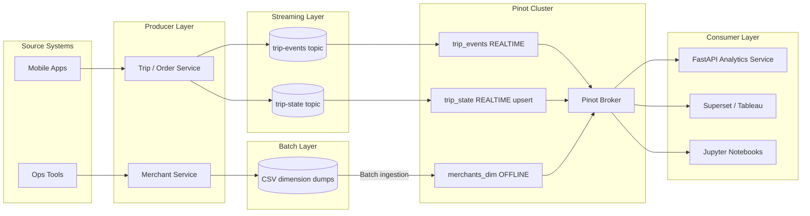

# 21. Capstone: Building a Rides and Commerce Analytics Platform

## Why the Capstone Is the Most Important Chapter in This Guide

Every preceding chapter teaches a concept in isolation. Schema design is covered in Chapter 4, indexing in Chapter 6, stream ingestion in Chapter 8, upsert semantics in Chapter 9 and operational practices across Chapters 16 through 19. But real-world Pinot deployments do not encounter these concepts in isolation. They encounter them simultaneously, interacting with each other in ways that only become visible when you build a complete system from end to end.

The capstone chapter ties everything together. It walks through the design, implementation and operational reasoning behind a complete Pinot-centered analytics platform for a rides and commerce business. This is not a toy example. It is a production grade architecture pattern that mirrors how companies like Uber, Grab, DoorDash and Swiggy build their real time analytics serving layers.

> [!IMPORTANT]
> The platform serves three categories of consumers: operational dashboards used by city operations teams to monitor ride activity and merchant performance in real time, a customer-facing API that serves trip status and history to mobile applications and business intelligence tools used by analysts for KPI tracking and trend analysis. Each consumer has different requirements for freshness, latency and query complexity and the platform must satisfy all three simultaneously.

The deeper lesson of this capstone is not how to run Pinot. It is how to design a Pinot-centered analytical product where schemas, contracts, ingestion pipelines, query patterns and operational practices form a coherent, maintainable whole.


## Platform Architecture

The platform is organized into three coordinated planes. Each plane has a specific responsibility and the boundaries between planes are defined by data contracts and API specifications.



### Plane 1: Event Ingestion

The event ingestion plane is responsible for capturing business events and making them available for analytical consumption. Trip and order services produce events to Kafka topics as part of their normal business operations. Every time a trip is requested, accepted, started or completed, the service publishes an event to the `trip-events` topic and a state update to the `trip-state` topic. Merchant services periodically export curated merchant attribute data as CSV files, which are ingested into Pinot as a batch dimension table. Kafka topics serve as the transport layer between producers and Pinot. The `trip-events` topic uses append semantics (every event is immutable) while the `trip-state` topic uses compacted semantics (only the latest state for each trip is retained).

### Plane 2: Analytical Serving

The analytical serving plane is Pinot itself, configured with three tables that serve different analytical needs. The `trip_events` table (REALTIME, append-only) stores the complete history of every trip event and is used for timeline analysis, funnel metrics, historical trend queries and audit trails. This table never updates or deletes records: every event is an immutable fact. The `trip_state` table (REALTIME, upsert) stores the latest known state of each trip and is used for operational dashboards ("how many trips are in progress right now?"), customer-facing APIs ("what is the status of my trip?") and latest-state KPIs. This table uses FULL upsert semantics, where each new event for a `trip_id` replaces the previous version. The `merchants_dim` table (OFFLINE, dimension) stores curated merchant attributes (name, category, city, rating) for JOIN enrichment queries that combine trip data with merchant details. This table is small, fully replicated and refreshed periodically via batch ingestion.

### Plane 3: Application Consumption

The application consumption plane mediates between Pinot and end users. The FastAPI analytics service ([`app/main.py`](app/main.py)) provides a structured API that enforces query constraints, applies access control and formats responses for application consumption. It prevents raw SQL access to the broker and ensures that only well-defined query patterns reach Pinot. BI tools (Superset, Tableau) connect to the broker for internal analytics and dashboard creation. These tools have broader query flexibility than the API but are still subject to query quotas and timeouts. Notebooks are used by data scientists for exploratory analysis and experiment monitoring, connecting to Pinot for fresh data and to the warehouse for historical deep dives.


## The Data Model in Detail

The data model is the foundation of the platform. Every decision about indexing, ingestion, routing and querying flows from the data model.

### Table 1: trip_events (Append-Only Facts)

The `trip_events` table stores immutable event records. Each row represents a single business event: a trip was requested, a driver was assigned, the trip started, the trip was completed or the trip was cancelled.

| Column | Type | Role | Design Rationale |
|--------|------|------|-----------------|
| `event_id` | STRING | Unique event identifier | Globally unique per event for deduplication and audit |
| `trip_id` | STRING | Business entity key | Links events to the same trip across the lifecycle |
| `event_time` | TIMESTAMP | Time column | Declared as `dateTimeFieldSpec` for time based pruning |
| `event_type` | STRING | Event classification | Enables filtering and funnel analysis by lifecycle stage |
| `city` | STRING | Partition key | Hot filter column, aligned with Kafka partitioning |
| `merchant_id` | STRING | Foreign key to dimension | Enables join enrichment with merchant attributes |
| `merchant_name` | STRING | Denormalized display field | Avoids join for the most common display query |
| `fare_amount` | DOUBLE | Metric column | Used in SUM, AVG aggregations for GMV and revenue |
| `duration_ms` | LONG | Metric column | Used in AVG, percentile aggregations for efficiency |
| `status` | STRING | Current status at event time | Enables filtering by trip outcome |
| `event_version` | LONG | Monotonic version | Not used for upsert here, but useful for ordering |

**Index configuration:**

```json
{
  "tableIndexConfig": {
    "invertedIndexColumns": ["city", "event_type", "status", "merchant_id"],
    "rangeIndexColumns": ["event_time", "fare_amount"],
    "bloomFilterColumns": ["trip_id"],
    "starTreeIndexConfigs": [
      {
        "dimensionsSplitOrder": ["city", "event_type", "status"],
        "functionColumnPairs": ["COUNT__*", "SUM__fare_amount", "SUM__duration_ms"],
        "maxLeafRecords": 10000
      }
    ]
  }
}
```

The index choices are driven by the hot queries. Inverted indexes on `city`, `event_type`, `status` and `merchant_id` serve as the primary filter columns in dashboard and KPI queries. Range indexes on `event_time` and `fare_amount` support time range and amount range filtering. The bloom filter on `trip_id` enables efficient point lookups ("show me all events for trip X"). The star-tree index on `city`, `event_type` and `status` with COUNT and SUM aggregations serves the operational dashboard's most frequent query pattern.

### Table 2: trip_state (Upsert Latest-State)

The `trip_state` table stores the latest known state of each trip. When a trip progresses from "requested" to "accepted" to "started" to "completed," each state change overwrites the previous state for that `trip_id`.

The schema is similar to `trip_events` but with upsert-specific additions:

| Column | Type | Role | Design Rationale |
|--------|------|------|-----------------|
| `trip_id` | STRING | Primary key | Identifies the entity for upsert resolution |
| `event_version` | LONG | Comparison column | Determines which version is "newer" for upsert |
| `is_deleted` | BOOLEAN | Delete marker | Supports logical deletion via soft-delete pattern |
| `eta_minutes` | INT | Latest ETA | Only meaningful in latest state, not in history |

**Upsert configuration:**

```json
{
  "upsertConfig": {
    "mode": "FULL",
    "comparisonColumns": ["event_version"],
    "deleteRecordColumn": "is_deleted",
    "hashFunction": "MURMUR3",
    "enableSnapshot": true,
    "metadataManagerClass": "org.apache.pinot.segment.local.upsert.ConcurrentMapPartitionUpsertMetadataManager"
  }
}
```

> [!WARNING]
> Critical design constraints for upsert: the Kafka topic `trip-state` must be keyed by `trip_id` so that all updates for the same trip land in the same partition. The Pinot table must use `strictReplicaGroup` routing to ensure that all versions of the same `trip_id` are served by the same server. The `event_version` column must be monotonically increasing for each `trip_id` to ensure that newer versions always win.

### Table 3: merchants_dim (Offline Dimension)

The `merchants_dim` table stores curated merchant attributes. It is small (thousands to tens of thousands of rows), fully replicated across all servers and refreshed periodically via batch ingestion.

| Column | Type | Role | Design Rationale |
|--------|------|------|-----------------|
| `merchant_id` | STRING | Primary key / join key | Used in JOIN with trip tables |
| `merchant_name` | STRING | Display name | Returned in query results for human readability |
| `category` | STRING | Business category | Enables filtering and grouping by merchant type |
| `city` | STRING | Location | Enables geographic filtering |
| `rating` | FLOAT | Quality score | Used in ranking and filtering queries |


## The Contract Hierarchy

Contracts are the governance mechanism that prevents schema drift, breaking changes and integration surprises. This capstone uses a three-layer contract hierarchy, each layer serving a different audience and enforced at a different boundary.

### Layer 1: Event Contract (JSON Schema + AsyncAPI)

The event contract defines the structure and semantics of the messages published to Kafka topics. It is defined using JSON Schema (for the message payload structure) and AsyncAPI (for the topic, key and protocol metadata). The event contract answers the question "What can a producer send?" Any change to the event contract requires review because it potentially affects both the Pinot schema and the downstream service contract.

### Layer 2: Pinot Contract (Schema + Table Config)

The Pinot contract defines how Pinot stores, indexes and serves the data. It consists of the Pinot schema (field names, types and roles) and the table configuration (ingestion settings, index configuration, routing and upsert behavior). The Pinot contract answers the question "How does Pinot interpret the data?" Changes to the Pinot contract require operational procedures (schema updates, segment reloads, index rebuilds) and must be tested before production deployment.

### Layer 3: Service Contract (OpenAPI)

The service contract defines the API surface that application consumers use to access analytical data. It is defined using an OpenAPI specification that describes the endpoints, request parameters, response schemas and error formats. The service contract answers the question "What can a consumer ask for?" Changes to the service contract must be communicated to all API consumers and should be backward-compatible whenever possible.

### Contract Alignment

The three contracts must be aligned. A new field added to the event contract should flow through to the Pinot schema and, if it is exposed to consumers, to the service contract. This alignment is maintained through version-controlled contract files in the `contracts/` directory, validation scripts that check consistency between contracts and design review checklists that require contract review for any schema or API change.


## The Developer Loop

A new developer joining the team should be able to go from zero to a fully running, queryable analytics platform in under 30 minutes. This reproducibility is not a convenience feature. It is an operational requirement that ensures the team can always rebuild the platform from scratch, validate changes in a clean environment and onboard new members efficiently.

### Step 1: Install Dependencies

```bash
python -m pip install -r requirements.txt
python -m pip install -e .
```

### Step 2: Generate Deterministic Data

```bash
make generate-data
make generate-contracts
```

The data generator produces deterministic trip events and state updates. Determinism means that every run produces the same data, which makes testing, debugging and documentation reproducible.

### Step 3: Start the Stack

```bash
docker compose up -d
```

This starts ZooKeeper, Kafka, Pinot (controller, broker, server) and the FastAPI analytics service.

### Step 4: Create Topics and Upload Configuration

```bash
bash scripts/create_topics.sh
python scripts/setup_pinot.py --wait
```

This creates the Kafka topics, uploads the Pinot schemas and creates the Pinot tables. The `--wait` flag ensures that the script waits for the Pinot cluster to be fully ready before proceeding.

### Step 5: Load Data

```bash
bash scripts/load_merchants.sh
bash scripts/stream_trip_events.sh
```

This loads the merchant dimension table via batch ingestion and streams trip events and state updates to the Kafka topics.

### Step 6: Run Queries

```bash
python scripts/query_pinot.py --file sql/01_smoke.sql
python scripts/query_pinot.py --file sql/02_kpis_by_city.sql
python scripts/query_pinot.py --file sql/04_multistage_join.sql --query-type multistage
```

### Step 7: Exercise the API

```bash
curl -s http://localhost:8010/health
curl -s "http://localhost:8010/api/v1/kpis?window_minutes=240"
curl -s http://localhost:8010/api/v1/trips/trip_000001
```

### Step 8: Run Simulations

```bash
python scripts/simulate_segment_pruning.py
python scripts/simulate_star_tree.py
python scripts/simulate_upsert.py
```


## Query Patterns by Consumer Type

Each consumer type has different query patterns, latency requirements and access control needs.

### Operational Dashboard Queries

The operations team needs city-level KPIs that refresh every few seconds:

```sql
-- Active trips by city and status (refreshes every 5 seconds)
SELECT city, status, COUNT(*) AS trip_count
FROM trip_state
WHERE city = :city
GROUP BY city, status

-- GMV by city over the last hour (refreshes every minute)
SELECT city, SUM(fare_amount) AS gmv, COUNT(*) AS completed_trips
FROM trip_events
WHERE event_type = 'completed'
  AND event_time > :one_hour_ago
  AND city = :city
GROUP BY city
```

These queries benefit from partition pruning (city filter), time pruning (event_time filter) and star-tree indexes (city + event_type aggregation pattern).

### Customer-Facing API Queries

The mobile application needs trip status and history for individual users:

```sql
-- Current trip status (single entity lookup)
SELECT trip_id, status, driver_id, eta_minutes, fare_amount, event_time
FROM trip_state
WHERE trip_id = :trip_id

-- Trip history for a user (bounded list)
SELECT trip_id, event_type, event_time, fare_amount, status
FROM trip_events
WHERE trip_id = :trip_id
ORDER BY event_time DESC
LIMIT 50
```

These queries benefit from bloom filter pruning (trip_id lookup) and are mediated through the analytics API service, which adds access control and response formatting.

### Business Intelligence Queries

Analysts need flexible aggregation and enrichment queries:

```sql
-- Top merchants by GMV with enrichment (MSE required for JOIN)
SET useMultistageEngine = true;
SELECT t.city, m.merchant_name, m.category,
       SUM(t.fare_amount) AS gmv,
       COUNT(*) AS trip_count
FROM trip_events t
JOIN merchants_dim m ON t.merchant_id = m.merchant_id
WHERE t.event_time > :thirty_days_ago
  AND t.event_type = 'completed'
GROUP BY t.city, m.merchant_name, m.category
ORDER BY gmv DESC
LIMIT 50

-- Top merchants per city with ranking (MSE window function)
SET useMultistageEngine = true;
SELECT *
FROM (
  SELECT city, merchant_id, merchant_name,
         SUM(fare_amount) AS gmv,
         RANK() OVER (PARTITION BY city ORDER BY SUM(fare_amount) DESC) AS merchant_rank
  FROM trip_state
  WHERE status = 'completed'
  GROUP BY city, merchant_id, merchant_name
) ranked
WHERE merchant_rank <= 3
ORDER BY city, merchant_rank
```

These queries use the multi stage engine for JOIN and window function support.


## The Productionization Path

The capstone as implemented in this repository is a complete, working system. But it is designed for local development and learning. Moving it to a production environment requires specific changes in each layer.

### What Stays the Same

The three-table split (events, state, dimension) is production-ready. The schema design, index choices and query patterns translate directly to production. The JSON Schema, AsyncAPI and OpenAPI contracts are production-ready and should be used as the governance foundation. The runbooks, monitoring patterns and troubleshooting methodology described in Chapters 16-19 apply directly to production. The SQL queries used in the capstone are representative of production query patterns and can be reused with real data.

### What Changes

| Component | Capstone Version | Production Version |
|-----------|-----------------|-------------------|
| Data source | Synthetic generator | Real producers or CDC |
| Kafka | Single-broker Docker | Multi-broker managed cluster (Confluent, MSK, etc.) |
| Pinot cluster | Single instance per component | Multi-instance with tenant isolation |
| Deep store | Local filesystem | S3, GCS or Azure Blob Storage |
| Authentication | None (development mode) | TLS + auth (Chapter 15) |
| Monitoring | Manual health checks | Prometheus + Grafana dashboards |
| Alerting | None | PagerDuty / OpsGenie integration |
| Deployment | Docker Compose | Kubernetes with Helm charts |
| Sizing | Minimal (laptop-friendly) | Benchmark-driven (Chapter 17) |

### Production Sizing Guidance

| Component | Starting Point | Scale Based On |
|-----------|---------------|----------------|
| Controller | 2 instances (HA) | Cluster metadata volume |
| Broker | 2-4 instances | Query concurrency (QPS) |
| Server | 3-6 instances | Data volume, segment count, query complexity |
| Minion | 1-2 instances | Background task volume |
| ZooKeeper | 3 instances (quorum) | Cluster size |
| Kafka | 3+ brokers | Event throughput, partition count |


## Adapting the Capstone to Other Domains

The capstone architecture is a template, not a prescription. The same patterns apply to many domains with domain-specific substitutions.

### Payments Platform

| Capstone Element | Payments Adaptation |
|-----------------|-------------------|
| `trip_events` | `payment_events` (authorization, capture, refund, chargeback) |
| `trip_state` | `payment_state` (latest status of each payment) |
| `merchants_dim` | `merchant_accounts` (merchant details, settlement config) |
| Hot queries | GMV by merchant, authorization success rate, refund rate |
| SLA focus | Sub-100ms for payment status lookups |

### Ad-Tech Platform

| Capstone Element | Ad-Tech Adaptation |
|-----------------|-------------------|
| `trip_events` | `impression_events` (impressions, clicks, conversions) |
| `trip_state` | `campaign_state` (latest spend, budget, pacing) |
| `merchants_dim` | `advertiser_dim` (advertiser details, targeting config) |
| Hot queries | CTR by campaign, spend by advertiser, conversion funnels |
| SLA focus | High throughput (millions of events/second) |

### Gaming Platform

| Capstone Element | Gaming Adaptation |
|-----------------|-------------------|
| `trip_events` | `game_events` (matches, kills, purchases, achievements) |
| `trip_state` | `player_state` (current rank, stats, inventory) |
| `merchants_dim` | `game_items_dim` (item details, rarity, pricing) |
| Hot queries | Leaderboards, match statistics, purchase analytics |
| SLA focus | Real-time leaderboard updates, player-facing dashboards |


## What This Capstone Teaches

The capstone demonstrates design principles that apply to any Pinot-centered analytical product.

- **Start with contracts.** Defining data contracts before writing the first line of Pinot configuration is the single most impactful governance decision. Contracts prevent schema drift, enable validation and make changes visible in version control.
- **Model for the hot queries.** Design the schema, choose indexes and configure partitioning based on the actual queries that drive business value. Do not model for hypothetical queries.
- **Separate facts and state when the use cases differ.** An append-only event table and a latest-state upsert table serve fundamentally different analytical needs. Combining them into a single table creates complexity that cannot be easily optimized away.
- **Keep benchmarks and simulations close to configurations.** Scripts that benchmark queries and simulate behavior live in the same repository as the schemas they validate. This proximity makes it easy to verify that configuration changes improve the intended outcomes.
- **Operationalize before scaling.** Monitoring, alerting, runbooks and troubleshooting procedures should be in place before the system handles production traffic. Retrofitting operations after launch is always more disruptive than building them in from the start.
- **Design the product interface and the Pinot tables together.** The API that consumers use and the Pinot tables that serve the data should be designed as a single coherent system, not as independent components that happen to be connected.


## Operating Heuristics

| Heuristic | Rationale |
| :--- | :--- |
| **Use the architecture as a template, not a law** | Adapt the three-table split, contract hierarchy and operational practices to your domain and data volumes. The specific schemas and queries are domain-specific. |
| **Keep event history and latest-state separate when semantics differ** | When consumers ask both "what happened?" and "what is true right now?", the separation eliminates the complexity of computing latest state from a raw event stream at query time. |
| **Design the product interface and the Pinot tables together** | The analytics API should not be an afterthought layered on top of raw Pinot access. Design it alongside the tables to enforce query constraints, manage access control and provide stable response schemas. |
| **Make the developer loop reproducible** | If a new team member cannot get the platform running in under 30 minutes, the onboarding process has friction that will slow down the entire team over time. |


## Common Pitfalls

| Pitfall | Consequence |
| :--- | :--- |
| **Building a demo that works once without repeatability** | Teaches nothing about production readiness. Every step should be scripted, validated and idempotent so that it can be reproduced from scratch. |
| **Mixing all workloads into one table** | A combined table is harder to optimize, harder to operate and harder to reason about than separate tables with clear and focused responsibilities. |
| **Skipping contracts then retrofitting them later** | Contracts are cheapest to introduce at the beginning. Once consumers depend on implicit assumptions about the data structure, any change becomes a coordination problem. |
| **Over-engineering the local demo** | Excessive complexity in the development environment creates maintenance burden without teaching production skills. Keep it simple but representative. |
| **Treating the capstone as finished** | The capstone is a starting point that should evolve as the team learns about their workload, discovers new query patterns and encounters challenges not anticipated during initial design. |


## Practice Prompts

1. Sketch how you would adapt the capstone to a payments, advertising, gaming or observability platform. Identify the tables, hot queries and SLA requirements for your chosen domain.
2. Which table in the capstone would power a customer-facing trip status page and why? What query would the API execute and what latency SLA would you set?
3. Which table would you use for historical funnel analysis (for example, measuring the conversion rate from trip requested to trip completed) and why?
4. The capstone uses three consumers (API, BI tool, notebooks). Design the access control model for these three consumers using the patterns from Chapter 15. Specify which tables each consumer can access and what query constraints apply.
5. A product manager wants to add a "recent trips" feature to the mobile app that shows the last 10 trips for a user. Which table would you query, what index would enable efficient retrieval and what would the API endpoint look like?
6. Walk through the productionization path for the capstone. For each change listed in the productionization table, estimate the effort level (hours, days or weeks) and identify the skills required.


## Suggested Labs and Follow-Through

- **[Lab 1: Local Cluster](../labs/lab-01-local-cluster.md)** provides the foundation for running the capstone stack locally.
- **[Lab 2: Schemas and Tables](../labs/lab-02-schemas-and-tables.md)** walks through creating the schemas and tables used in the capstone.
- **[Lab 3: Stream Ingestion](../labs/lab-03-stream-ingestion.md)** covers streaming data into the realtime tables.
- **[Lab 4: Index Tuning and Pruning](../labs/lab-04-index-tuning.md)** exercises the index configuration decisions made in the capstone.
- **[Lab 5: Upsert and CDC](../labs/lab-05-upsert-cdc.md)** explores the upsert semantics used in the `trip_state` table.
- **[Lab 6: Multi-Stage Queries](../labs/lab-06-multi%20stage-queries.md)** covers the JOIN and window function queries used in the BI consumer pattern.
- **[Lab 7: Time Series and Metrics](../labs/lab-07-time-series.md)** demonstrates time-series query patterns applicable to the capstone's monitoring needs.
- **[Lab 8: SLO and Incident Drill](../labs/lab-08-slo-incident.md)** exercises the operational practices that the capstone depends on in production.


## Repository Artifacts

- [`docker-compose.yml`](docker-compose.yml) defines the complete local stack including ZooKeeper, Kafka, Pinot controller, broker, server and the demo API.
- The `schemas/` directory contains the Pinot schema definitions for all three tables.
- The `tables/` directory contains the annotated table configurations for all three tables.
- The `contracts/` directory contains the data contracts in JSON Schema for events, AsyncAPI for stream contracts and OpenAPI for the service API.
- The `sql/` directory contains the SQL query packs that exercise the platform's capabilities.
- [`app/main.py`](app/main.py) implements the FastAPI analytics service that sits between Pinot and application consumers.
- `src/pinot_playbook_demo/` contains the Python package with data generators, the Pinot client, the service layer and simulation utilities.
- The `scripts/` directory contains the operational scripts for bootstrapping, data streaming, benchmarking and validation.
- The `labs/` directory contains the hands-on lab exercises that reinforce the concepts applied in this capstone.


## Further Reading and Resources

- [Apache Pinot Getting Started](https://docs.pinot.apache.org/basics/getting-started) provides the official quickstart guide that complements the capstone's developer loop.
- [Apache Pinot Real-World Use Cases](https://docs.pinot.apache.org/basics/use-cases) describes production use cases that mirror the capstone's architecture patterns.
- [Building Real-Time Analytics with Apache Pinot (YouTube)](https://www.youtube.com/watch?v=T70jnJzS2Ks) walks through building a complete analytics platform from event streams to query serving.
- [Apache Pinot at Scale: Lessons from Production (YouTube)](https://www.youtube.com/watch?v=JV0WxBwJqKE) covers the productionization journey from a development prototype to a production-grade deployment.
- [StarTree Blog: Real-Time Analytics Architecture Patterns](https://startree.ai/blog) includes case studies from companies that have built Pinot-centered analytics platforms similar to this capstone.
- [LinkedIn Engineering: Pinot-Powered Analytics](https://engineering.linkedin.com/blog) describes how LinkedIn uses the same architectural patterns at massive scale.

*Previous chapter: [20. Patterns, Anti-Patterns and Decision Framework](./20-patterns-antipatterns-and-decision-framework.md)

*Next chapter: [22. Exercises](./22-exercises.md)
