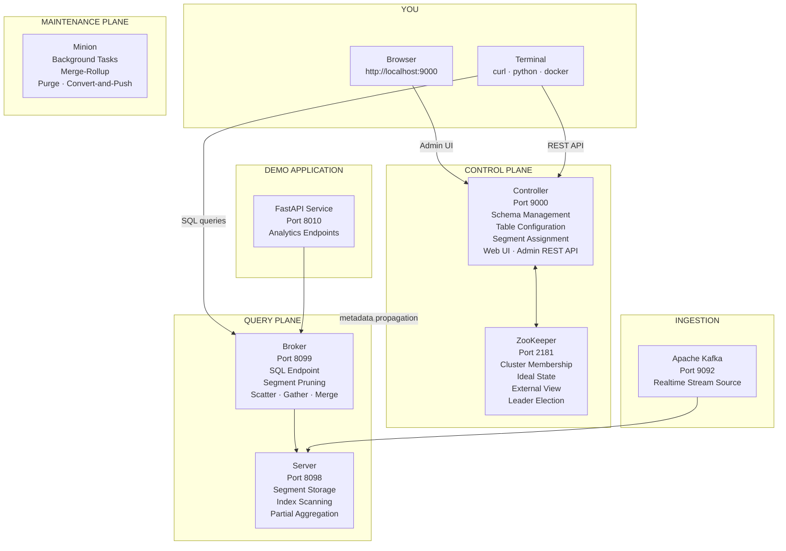
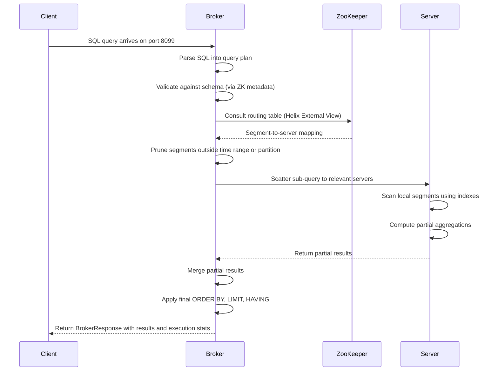

# Lab 1: Local Cluster

## Overview

This lab brings up the complete Apache Pinot topology on your local machine and teaches you how to verify and reason about each component before a single byte of data enters the system. By the end, you will have navigated the Controller UI, confirmed every health endpoint and articulated the distinct responsibility of each process in the cluster.

> [!IMPORTANT]
> This lab is the prerequisite for all subsequent labs. Confirm every verification step passes before proceeding.


## Learning Objectives

| Objective | Success Criterion |
|-----------|-------------------|
| Start the full local stack | `docker compose ps` shows all containers as `running` |
| Identify each component by role | You can state the primary responsibility of Controller, Broker, Server, Minion, Kafka and ZooKeeper without reference to this document |
| Navigate the Controller Web UI | You have located Cluster Manager, ZooKeeper Browser and Query Console |
| Verify all health endpoints | All four `curl` health checks return HTTP 200 with the expected response body |
| Apply incident triage logic | Given a symptom, you can name the first component to investigate and the key signal to check |


## Pre-Flight Requirements

The following tools must be installed and available on your PATH before beginning.

1. **Docker Desktop 4.x** — required to run the containerized stack
2. **Docker Compose v2** — bundled with Docker Desktop; confirm availability with `docker compose version`
3. **Python 3.9 or later** — required for data generation and helper scripts
4. **Network access** — required to pull container images on first run; total image size is approximately 4 GB


## Cluster Topology

Study this diagram before running any command. Trace every arrow. Understand which plane each process belongs to and which ports carry which types of traffic. You will return to this mental model in every lab that follows.



**What you are looking at.** The Controller and ZooKeeper form the control plane. They govern what the cluster knows about itself — which tables exist, which segments live on which servers and what the assignment should look like. The Broker and Server form the query plane. Every SQL query you send enters through the Broker, which prunes irrelevant segments and fans work out to the Servers. Each Server executes locally against its assigned segments and returns partial results upward to the Broker for final assembly. Kafka feeds raw event data into the Server layer via consuming segments. The Minion operates independently in the background, compacting segments and enforcing retention without ever touching the hot query path.


## Step-by-Step Instructions

### Step 1 — Install Python Dependencies

```bash
python3 -m pip install -r requirements.txt
```

This installs the data generation libraries, the Pinot client wrapper and the helper scripts used throughout the lab series. The installation completes in under two minutes on a standard machine.


### Step 2 — Generate Sample Datasets

```bash
make generate-data
make generate-contracts
```

These targets produce deterministic trip events, merchant dimension records and data contracts. All generators are seeded so output is reproducible across machines and runs. Generated files land in `data/` and `contracts/examples/`. Nothing is pushed to Pinot yet — that begins in Lab 2.


### Step 3 — Start the Stack

```bash
docker compose up -d
```

Docker Compose starts all seven services in dependency order. ZooKeeper starts first, followed by Kafka and the Controller, then the Broker and Server and finally the FastAPI demo service. On a first run, allow three to five minutes for image pulls over a typical broadband connection.


### Step 4 — Confirm All Containers Are Running

```bash
docker compose ps
```

**Expected output** — every service must show `running` before you continue.

```
NAME                  IMAGE                        COMMAND   STATUS
pinot-controller      apachepinot/pinot:1.4.0      ...       running
pinot-broker          apachepinot/pinot:1.4.0      ...       running
pinot-server          apachepinot/pinot:1.4.0      ...       running
pinot-minion          apachepinot/pinot:1.4.0      ...       running
pinot-kafka           confluentinc/cp-kafka:7.5.0  ...       running
pinot-zookeeper       zookeeper:3.9                ...       running
pinot-demo-api        pinot-playbook-demo          ...       running
```

If any container shows `exited` or `restarting`, run `docker compose logs <service-name>` to diagnose the failure before continuing. Common causes on first run are port conflicts on 9000, 8099 or 9092 and insufficient Docker memory allocation (the stack requires at least 6 GB).


### Step 5 — Verify Health Endpoints

Each core component exposes an HTTP health endpoint. All four must return a 200 response with the expected body before you proceed to the UI exploration.

```bash
curl -s http://localhost:9000/health   # Controller
curl -s http://localhost:8099/health   # Broker
curl -s http://localhost:8098/health   # Server
curl -s http://localhost:8010/health   # Demo API
```

**Expected response for Controller, Broker and Server:**

```
OK
```

**Expected response for the Demo API:**

```json
{
  "mode": "pinot",
  "pinot_available": true,
  "generated_rows": 0
}
```

The `pinot_available: true` field confirms the API service can reach the Pinot Broker over the internal Docker network. The `generated_rows: 0` value is expected — no data has been ingested yet. That changes in Lab 3.


### Step 6 — Explore the Controller Web UI

Open **http://localhost:9000** in your browser. Take five minutes to familiarize yourself with the layout before proceeding to Lab 2. This UI is your command center for every administrative operation in the cluster.

**Cluster Manager** (left sidebar)

Navigate to Cluster Manager. Every registered Pinot component appears here with its hostname, port and status. All processes should show `STARTED`. This view is your first stop during any cluster incident — it immediately reveals which components are alive and which are absent from the cluster.

**ZooKeeper Browser** (left sidebar)

Navigate to ZooKeeper Browser. Expand the path `/PinotCluster/INSTANCES` to see the registered component entries. These ZooKeeper nodes are the ground truth for cluster membership. When a component starts, it registers itself here. When it shuts down cleanly, it deregisters. When a component crashes, its ephemeral node disappears and Helix detects the failure and begins reassignment.

Now navigate to `/PinotCluster/IDEALSTATES` and `/PinotCluster/EXTERNALVIEW`. Both paths are currently empty because no tables exist. Return here after Lab 2 to observe how segment assignments are recorded and how the cluster tracks the difference between what *should* exist and what *actually* exists.


### Step 7 — Verify Kafka and ZooKeeper

```bash
# List Kafka topics — should return empty output before Lab 3
docker exec pinot-kafka kafka-topics --list --bootstrap-server localhost:9092

# Check ZooKeeper responsiveness using the four-letter ruok command
echo "ruok" | docker exec -i pinot-zookeeper nc localhost 2181
```

**Expected output from ZooKeeper:**

```
imok
```

The `imok` response confirms ZooKeeper is accepting connections and processing requests. A ZooKeeper that does not respond to `ruok` is the highest-severity failure condition in a Pinot cluster. All metadata propagation, leader election and segment assignment flows through ZooKeeper. Without it, the cluster can serve existing cached queries for a short window but cannot make any administrative changes.


### Step 8 — Verify the Demo API

```bash
curl -s http://localhost:8010/health | python3 -m json.tool
```

**Expected output:**

```json
{
  "mode": "pinot",
  "pinot_available": true,
  "generated_rows": 0
}
```

When `pinot_available` is `false`, the service falls back to in-memory sample data automatically. This fallback behavior makes the application layer explorable even without a running Pinot cluster — a useful property for reading documentation and running contract tests offline.


## Component Reference

| Component | Port | Plane | Primary Responsibility |
|-----------|:----:|-------|------------------------|
| Controller | 9000 | Control | Schema management, table configuration, segment assignment, cluster administration, web UI |
| ZooKeeper | 2181 | Control | Cluster state storage, leader election, Ideal State, External View |
| Broker | 8099 | Query | SQL query reception, segment pruning, scatter-gather execution, result merge |
| Server | 8098 | Query | Segment hosting, index scanning, partial result computation |
| Minion | - | Maintenance | Background task execution, including merge-rollup, purge and convert-and-push |
| Kafka | 9092 | Ingestion | Realtime event stream source for consuming segments |
| Demo API | 8010 | Application | FastAPI analytics service backed by Pinot with in-memory fallback |


## Incident Triage Matrix

When something goes wrong in a Pinot cluster, the component you investigate first is determined entirely by the symptom. Memorize this matrix. It encodes the triage logic you will apply in every lab and every production incident.

| Symptom | First Component to Investigate | Key Signal to Check |
|---------|-------------------------------|---------------------|
| Tables or schemas not loading | Controller | Health endpoint; logs for ZooKeeper connectivity errors |
| Queries timing out or returning errors | Broker | Health endpoint; routing table staleness; `numSegmentsQueried` in BrokerResponse |
| Data missing from query results | Server | Health endpoint; segment assignment in Controller UI; deep store availability |
| Real-time data not arriving | Kafka | Consumer lag on the topic; Pinot server consuming segment logs |
| Background compaction tasks not executing | Minion | Task status in Controller UI; Minion process logs |
| Cluster-wide coordination failures | ZooKeeper | `ruok` response; ZooKeeper latency metrics; connection count saturation |


## Query Lifecycle Preview

Before moving to Lab 2, trace through the following sequence diagram once. This is what happens every time you execute a SQL query against the cluster you just started. Every step in this diagram maps to a component you have now verified.



Notice that the Broker never reads segment data. It routes, reduces and returns. The Server never touches other servers' data. It computes locally and reports upward. ZooKeeper never participates in query execution. It only answers the routing table lookup that happens once per query at the start. These clean separations are what make Pinot operationally tractable at scale.


## Reflection Prompts

Answer these questions in writing before beginning Lab 2. Consolidating your mental model now prevents confusion when the cluster grows more complex.

1. The Controller process crashes while a query is in flight. What happens to that query and what administrative operations become unavailable until the Controller recovers?

2. The Broker does not store segment data. What design advantage does this separation create during horizontal scaling?

3. In the ZooKeeper Browser, both IDEALSTATES and EXTERNALVIEW paths exist. Describe in your own words the difference between these two representations and explain what it means when they diverge.

4. A colleague proposes that ZooKeeper is "just metadata storage" and does not need the same monitoring attention as Brokers and Servers. How do you respond?


[Previous: README](../README.md) | [Next: Lab 2 — Schemas and Tables](lab-02-schemas-and-tables.md)
