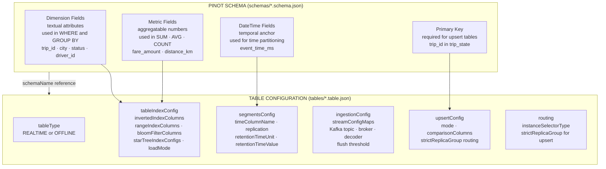
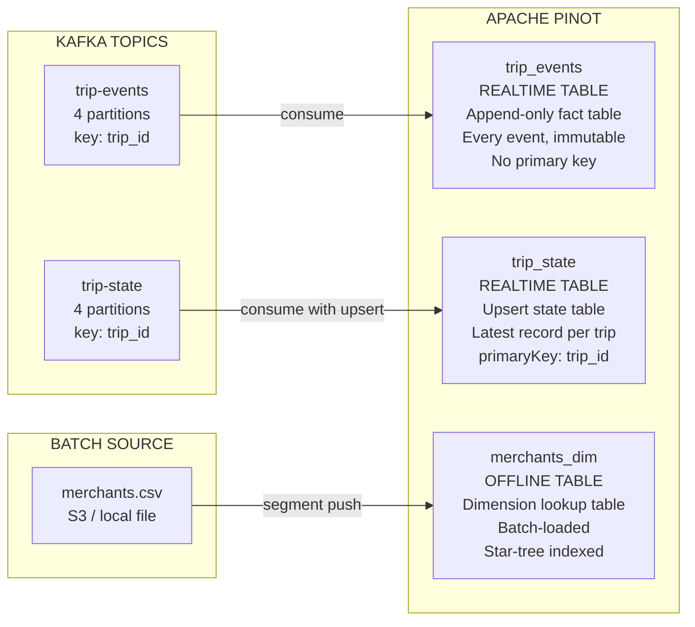

# Lab 2: Schemas and Tables

## Overview

This lab introduces the two foundational configuration artifacts in Apache Pinot: the **schema** and the **table configuration**. You will upload three distinct tables that represent the canonical data modeling patterns — an append-only realtime fact table, a upsert-enabled state table and a batch-loaded offline dimension table. By the end, you will be able to navigate the schema and table relationship in the Controller UI, query the REST API for configuration details and articulate why each modeling choice was made.

> [!IMPORTANT]
> The Kafka topics created in this lab are prerequisites for Lab 3. Complete every step in order.


## Learning Objectives

| Objective | Success Criterion |
|-----------|-------------------|
| Understand schema field categories | You can classify any column as Dimension, Metric, DateTime or Complex without reference |
| Understand the schema–table relationship | You can explain why a schema and table config are separate artifacts |
| Create Kafka topics for realtime ingestion | `kafka-topics --list` returns both `trip-events` and `trip-state` |
| Upload schemas and table configurations | All three tables appear in the Controller UI under Tables |
| Distinguish table types | You can explain the behavioral difference between REALTIME and OFFLINE tables |
| Interpret upsert configuration | You can explain what `primaryKeyColumns` enables and why `trip_state` requires it |


## The Schema–Table Relationship

Before running any command, study this diagram. It captures the most important structural relationship in Pinot configuration. The schema defines the data contract — what columns exist, what types they carry and what role each column plays. The table configuration consumes that contract and extends it with operational behavior — how data enters, how it is indexed, how queries are routed and when data expires.



**What you are looking at.** The schema is immutable from a table's perspective — the table config references it by name. Adding a new column requires updating the schema first, then reloading affected segments. The table config is where all operational decisions live: retention, indexing strategy, ingestion topology and routing behavior.


## The Three Data Models

This repository uses three tables drawn from a rides and commerce domain. Each table demonstrates a different modeling pattern.



| Table | Type | Pattern | Primary Key | Use Case |
|-------|------|---------|:-----------:|----------|
| `trip_events` | REALTIME | Append-only fact | None | Time series, event funnels, KPI aggregations over all events |
| `trip_state` | REALTIME | Upsert state | `trip_id` | Current status queries — what is the latest state of this trip |
| `merchants_dim` | OFFLINE | Dimension lookup | `merchant_id` | Reference data joined against fact tables |


## Step-by-Step Instructions

### Step 1 — Confirm the Stack Is Running

```bash
docker compose ps
```

All containers must show `running` before continuing. If any container is stopped, return to Lab 1 and diagnose before proceeding.


### Step 2 — Create the Kafka Topics

Realtime tables in Pinot consume from Kafka topics. The topics must exist before the table configuration is uploaded — Pinot validates topic accessibility during table creation and fails with `"Failed to fetch partition information"` if the topic is absent.

```bash
bash scripts/create_topics.sh
```

This script creates two topics with the following configuration.

| Topic | Partitions | Replication | Partition Key | Purpose |
|-------|:----------:|:-----------:|:-------------:|---------|
| `trip-events` | 4 | 1 | `trip_id` | Every trip event — status changes, location updates |
| `trip-state` | 4 | 1 | `trip_id` | Latest state per trip for the upsert table |

The partition key ensures all events for a given `trip_id` arrive at the same partition, which is a requirement for correct upsert behavior. With replication factor 1, there is no redundancy — this is appropriate for a local development environment.

Verify the topics were created.

```bash
docker exec pinot-kafka kafka-topics \
  --list \
  --bootstrap-server localhost:9092
```

**Expected output:**

```
trip-events
trip-state
```


### Step 3 — Upload Schemas and Table Configurations

```bash
python3 scripts/setup_pinot.py --wait
```

This script performs six sequential operations against the Controller REST API at port 9000.

1. Waits for the Controller health endpoint to return `OK`
2. Uploads the `trip_events` schema to `/schemas`
3. Uploads the `trip_state` schema to `/schemas`
4. Uploads the `merchants_dim` schema to `/schemas`
5. Uploads all three table configurations to `/tables`
6. Verifies each table appears in the Controller's table listing

The `--wait` flag causes the script to retry the health check until the Controller is ready. This is useful when running the script immediately after `docker compose up -d`.

**Expected output:**

```
Waiting for controller at http://localhost:9000/health ...
Controller ready.
Uploaded schema: trip_events
Uploaded schema: trip_state
Uploaded schema: merchants_dim
Created table: trip_events_REALTIME
Created table: trip_state_REALTIME
Created table: merchants_dim_OFFLINE
All tables verified.
```


### Step 4 — Load the Merchant Dimension Data

The `merchants_dim` table is an OFFLINE table. Unlike realtime tables, it does not consume from Kafka. Data enters via a batch segment push.

```bash
bash scripts/load_merchants.sh
```

This script generates a segment from `data/merchants.csv` and pushes it to the Controller, which assigns it to a Server and marks it ONLINE.

After the push completes, the `merchants_dim` table will contain the full merchant reference dataset — 200 merchant records with names, cities, categories and creation dates.


### Step 5 — Verify the Tables in the Controller UI

Open **http://localhost:9000** in your browser and navigate to Tables in the left sidebar.

**trip_events table**

Click `trip_events_REALTIME`. Examine the Overview tab. You will see the table type, the referenced schema name, tenant assignment and segment count. Navigate to the Stream Config section — it shows the Kafka topic name, consumer type, broker address and the decoder class that converts raw Kafka bytes into Pinot rows. Navigate to the Segments tab. You will see consuming segments — these are actively ingesting from Kafka and are immediately queryable even before they flush to disk.

**trip_state table**

Click `trip_state_REALTIME`. Examine the Upsert Config section — it shows `mode: FULL` and `comparisonColumns: [event_version]`. The comparison column determines which version of a record wins when two events arrive with the same `trip_id`. A higher `event_version` value overwrites a lower one. Navigate to the Routing section — you will see `strictReplicaGroup` enabled. This routing strategy is mandatory for upsert tables because it ensures all queries for a given `trip_id` are routed to the same server replica, preventing stale reads during concurrent updates.

**merchants_dim table**

Click `merchants_dim_OFFLINE`. Note the absence of any stream configuration — this table is populated exclusively through batch pushes. Navigate to the Segments tab. The batch-pushed segment appears here with its row count, size and time range. Unlike consuming segments, offline segments are immediately immutable once pushed.


### Step 6 — Inspect Schemas via REST API

The Controller exposes a REST API for all administrative operations. Explore it directly to understand the schema structure.

```bash
# List all schemas
curl -s http://localhost:9000/schemas | python3 -m json.tool

# Inspect the trip_events schema
curl -s http://localhost:9000/schemas/trip_events | python3 -m json.tool | head -50

# Inspect the trip_state table configuration
curl -s http://localhost:9000/tables/trip_state_REALTIME | python3 -m json.tool | head -60
```

**What to look for in the schema response:**

The response contains three top-level arrays: `dimensionFieldSpecs`, `metricFieldSpecs` and `dateTimeFieldSpecs`. Each entry in `dimensionFieldSpecs` carries a `name` and `dataType`. Each entry in `metricFieldSpecs` carries the same structure plus the implicit guarantee that Pinot will treat it as aggregatable. The `dateTimeFieldSpecs` entry carries additional fields — `format` and `granularity` — that inform time partitioning and segment boundary computation.


### Step 7 — Compare Schema Representations

This repository uses two parallel schema representations for the same events. Understanding their relationship deepens your understanding of how data contracts work across systems.

| Property | Pinot Schema (`schemas/trip_events.schema.json`) | JSON Schema (`contracts/jsonschema/trip-event.schema.json`) |
|----------|------------------------------------------------|-------------------------------------------------------------|
| Purpose | Defines storage structure and query semantics in Pinot | Defines validation contract for producers writing to Kafka |
| Field classification | `dimensionFieldSpecs`, `metricFieldSpecs`, `dateTimeFieldSpecs` | `properties` with JSON types and constraints |
| Time handling | `dateTimeFieldSpecs` with `format` and `granularity` | `integer` type with a description annotation |
| Complex types | `JSON` data type (stored as `STRING`) | Full nested object support |
| Null handling | `enableColumnBasedNullHandling` flag per column | `required` array and `nullable` annotations |

The Pinot schema is consumed by the Controller at table creation time. The JSON Schema is consumed by producers at event publish time. Both must agree on field names and types — drift between them causes silent data quality failures.


## Key Concepts Reference

| Concept | Definition |
|---------|------------|
| Schema | Defines column names, types and roles — the data contract that the table configuration references |
| Dimension field | A textual or categorical column used in `WHERE` and `GROUP BY` clauses |
| Metric field | An aggregatable numeric column operated on by `SUM`, `AVG`, `COUNT`, `MIN`, `MAX` |
| DateTime field | The temporal anchor column used for time partitioning and time-range query acceleration |
| Primary key | A column whose values uniquely identify a record — required for upsert semantics |
| REALTIME table | A table that continuously consumes from a streaming source such as Kafka |
| OFFLINE table | A table populated exclusively by batch segment pushes — all segments are immutable |
| Inverted index | A data structure that maps column values to the set of rows containing them — accelerates equality filters |
| Range index | A data structure that accelerates range predicates on numeric and temporal columns |
| Bloom filter | A probabilistic structure that answers "does this value exist in this segment" — eliminates segments containing none of the queried values |
| Star-tree index | A pre-aggregated multi-dimensional index that materializes common aggregation patterns — delivers sub-millisecond aggregation latency |
| Upsert | A write operation that updates the existing record if the primary key already exists or inserts a new record if it does not |
| strictReplicaGroup | A routing strategy that always sends queries for the same partition key to the same server replica — required for correctness in upsert tables |


## Table Configuration Anatomy

Study this annotated table configuration excerpt. Every section influences a distinct aspect of serving behavior.

```json
{
  "tableName": "trip_events",
  "tableType": "REALTIME",

  "segmentsConfig": {
    "timeColumnName": "event_time_ms",
    "schemaName": "trip_events",
    "replication": "1",
    "retentionTimeUnit": "DAYS",
    "retentionTimeValue": "30"
  },

  "tenants": {
    "broker": "DefaultTenant",
    "server": "DefaultTenant"
  },

  "tableIndexConfig": {
    "loadMode": "MMAP",
    "invertedIndexColumns": ["city", "status", "merchant_id"],
    "rangeIndexColumns": ["fare_amount", "distance_km"],
    "bloomFilterColumns": ["trip_id", "driver_id"]
  },

  "quota": {
    "maxQueriesPerSecond": "200",
    "storage": "20G"
  },

  "routing": {
    "instanceSelectorType": "balanced"
  },

  "queryConfig": {
    "timeoutMs": 15000
  },

  "ingestionConfig": {
    "streamIngestionConfig": {
      "streamConfigMaps": [{ }]
    }
  }
}
```

| Section | Controls |
|---------|---------|
| `segmentsConfig` | Segment time boundaries, replication factor, retention policy |
| `tenants` | Which broker pool routes queries, which server pool hosts segments |
| `tableIndexConfig` | Index types per column, memory mapping mode |
| `quota` | Maximum query throughput and storage allocation |
| `routing` | How the broker distributes queries across server replicas |
| `queryConfig` | Per-table query timeout |
| `ingestionConfig` | Kafka topic, consumer type, decoder and flush thresholds |


## Reflection Prompts

Answer these questions before proceeding to Lab 3.

1. The `trip_events` table has no `primaryKeyColumns`. What does this mean for how Pinot handles two events that arrive with the same `trip_id`?

2. The `trip_state` table uses `strictReplicaGroup` routing. If this setting were removed, what class of query result inconsistency could occur?

3. A new engineer proposes adding a `driver_name` column to the `trip_events` schema. Walk through every artifact in this repository that would need to change to support that column end-to-end.

4. The `merchants_dim` table has a star-tree index configured but the `trip_events` table does not. What property of the merchants dimension workload justifies the overhead of building and maintaining a star-tree?


[Previous: Lab 1 — Local Cluster](lab-01-local-cluster.md) | [Next: Lab 3 — Stream Ingestion](lab-03-stream-ingestion.md)
