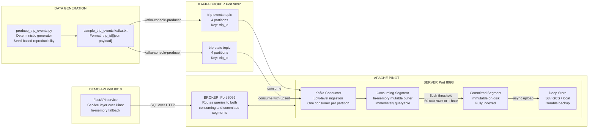
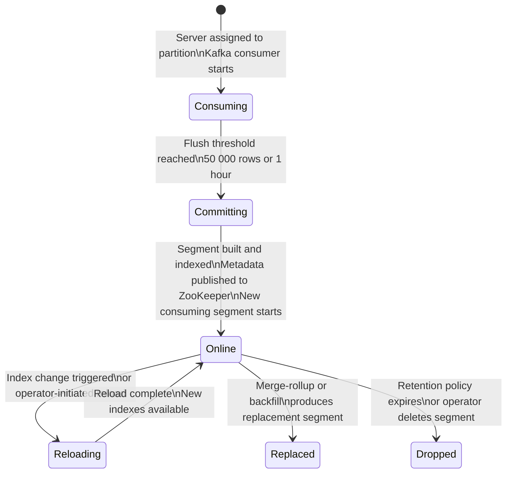

# Lab 3: Stream Ingestion

## Overview

This lab makes data flow. You will publish deterministic trip events to Kafka, watch Pinot's realtime ingestion pipeline consume them into segments, and query the results through the Broker. By the end, you will be able to read the BrokerResponse execution statistics and explain what each metric reveals about the efficiency of the query path.

> [!NOTE]
> This lab assumes the Kafka topics and table configurations from Lab 2 are in place. Confirm `docker compose ps` shows all containers as `running` and that `http://localhost:9000/#/tables` shows all three tables before proceeding.

---

## Learning Objectives

| Objective | Success Criterion |
|-----------|-------------------|
| Publish events to Kafka | Both Kafka topics receive records; verified with `kafka-console-consumer` |
| Observe consuming segments | The Segments tab for `trip_events` shows consuming segments with row counts greater than zero |
| Execute aggregate queries | `sql/02_kpis_by_city.sql` returns non-empty results |
| Interpret BrokerResponse statistics | You can explain `numDocsScanned`, `numSegmentsQueried`, `numSegmentsMatched`, and `timeUsedMs` |
| Trace the end-to-end data path | You can diagram the path from generator script through Kafka through Pinot to the API response |

---

## The Realtime Ingestion Pipeline

Study this data flow diagram before publishing a single event. Every arrow represents a network call or data transformation that you will observe and verify during this lab.



**What you are looking at.** The generator produces events in a format that Kafka's console producer understands — a pipe-delimited key and value pair where the key is `trip_id`. The `trip_id` key ensures all events for the same trip land on the same Kafka partition, which is a prerequisite for correct upsert semantics in `trip_state`. Pinot's Server runs a Kafka consumer in low-level mode, one consumer thread per partition. Consumed records accumulate in an in-memory mutable structure called a consuming segment. This segment is queryable immediately, before any flush occurs. When the consuming segment reaches the flush threshold, Pinot commits it. It builds all configured indexes, writes the columnar binary format to disk, uploads a copy to the deep store, and starts a fresh consuming segment for continued ingestion.

---

## The Consuming Segment Lifecycle



The critical insight for realtime query freshness is the dual-segment model. At any moment, queries against a realtime table touch both committed `ONLINE` segments and the active consuming segment. Pinot merges results from both transparently. This means the data you query is as fresh as the last event Kafka delivered to the consumer — typically sub-second.

---

## Step-by-Step Instructions

### Step 1 — Generate Sample Trip Events

```bash
python3 scripts/produce_trip_events.py
```

This script creates four deterministic output files from a fixed random seed, ensuring the same dataset is produced on every machine and every run.

| Output File | Contents | Record Count |
|-------------|----------|:------------:|
| `data/sample_trip_events.jsonl` | Raw trip events in JSON Lines format | 1 611 |
| `data/sample_trip_state.jsonl` | Latest state per trip in JSON Lines format | 400 |
| `data/sample_trip_events.kafka.txt` | Key-value format for the Kafka console producer | 1 611 |
| `data/sample_trip_state.kafka.txt` | Key-value format for the Kafka console producer | 400 |

Inspect the first few lines of the Kafka-format file to understand the message structure.

```bash
head -3 data/sample_trip_events.kafka.txt
```

**Expected output format:**

```
trip_000001|{"trip_id":"trip_000001","merchant_id":"merch_042","driver_id":"driver_019","city":"mumbai","status":"requested","fare_amount":245.5,"event_time_ms":1706745600000}
trip_000001|{"trip_id":"trip_000001","merchant_id":"merch_042","driver_id":"driver_019","city":"mumbai","status":"accepted","fare_amount":245.5,"event_time_ms":1706745601500}
trip_000002|{"trip_id":"trip_000002",...}
```

The pipe character separates the Kafka message key (`trip_id`) from the message value (the full JSON payload). The Kafka console producer reads this format when `parse.key=true` and `key.separator=|` are set.

---

### Step 2 — Publish Trip Events to Kafka

Publish the trip events stream.

```bash
docker compose exec -T kafka kafka-console-producer \
  --bootstrap-server localhost:19092 \
  --topic trip-events \
  --property parse.key=true \
  --property key.separator='|' \
  < data/sample_trip_events.kafka.txt
```

Publish the trip state stream.

```bash
docker compose exec -T kafka kafka-console-producer \
  --bootstrap-server localhost:19092 \
  --topic trip-state \
  --property parse.key=true \
  --property key.separator='|' \
  < data/sample_trip_state.kafka.txt
```

For convenience, the following single command performs both steps.

```bash
bash scripts/stream_trip_events.sh
```

Verify the events arrived in Kafka by checking the topic offset.

```bash
docker exec pinot-kafka kafka-run-class kafka.tools.GetOffsetShell \
  --broker-list localhost:9092 \
  --topic trip-events
```

**Expected output** — four partition offsets summing to approximately 1 611.

```
trip-events:0:403
trip-events:1:401
trip-events:2:404
trip-events:3:403
```

---

### Step 3 — Observe Consuming Segments in the Controller UI

Open **http://localhost:9000** and navigate to Tables. Click `trip_events_REALTIME` and select the Segments tab.

You will see one consuming segment per Kafka partition — four segments in total for this configuration. Each segment displays its current row count, the Kafka offset it has consumed up to, and a `CONSUMING` status indicator. As you watch, the row counts increment as the Server processes the records you published.

Within thirty seconds of publishing, all 1 611 events should be distributed across the four consuming segments. When a consuming segment reaches 50 000 rows, it will commit — you will see it transition from `CONSUMING` to `ONLINE` and a new consuming segment will start in its place.

---

### Step 4 — Run the Smoke Query

```bash
python3 scripts/query_pinot.py --file sql/01_smoke.sql
```

**Expected output** — the row count should match the number of events you published.

```
SELECT COUNT(*) FROM trip_events
┌──────────┐
│ count(*) │
├──────────┤
│     1611 │
└──────────┘
```

If the count is zero, the consuming segments have not yet processed the Kafka records. Wait ten seconds and retry.

---

### Step 5 — Run the KPI Aggregation Query

```bash
python3 scripts/query_pinot.py --file sql/02_kpis_by_city.sql
```

This query aggregates trip count, total fare, and average fare grouped by city. It exercises the scatter-gather-merge pattern across all consuming segments.

**Expected output:**

```
SELECT city, COUNT(*) as trips, SUM(fare_amount) as gmv, AVG(fare_amount) as avg_fare
FROM trip_events
GROUP BY city ORDER BY trips DESC

┌───────────┬───────┬─────────────┬──────────┐
│ city      │ trips │ gmv         │ avg_fare │
├───────────┼───────┼─────────────┼──────────┤
│ mumbai    │   412 │  98543.50   │  239.18  │
│ delhi     │   389 │  91234.00   │  234.53  │
│ bangalore │   354 │  84112.75   │  237.60  │
│ ...       │   ... │  ...        │  ...     │
└───────────┴───────┴─────────────┴──────────┘
```

---

### Step 6 — Execute Queries in the Query Console

Open **http://localhost:9000/#/query** and run the following queries. After each query, expand the **Response Stats** panel and study the execution metadata.

**Query 1 — Total trip count by status**

```sql
SELECT status, COUNT(*) AS trip_count
FROM trip_events
GROUP BY status
ORDER BY trip_count DESC
```

**Query 2 — Revenue by service tier**

```sql
SELECT
  service_tier,
  COUNT(*) AS trip_count,
  SUM(fare_amount) AS total_fare,
  AVG(fare_amount) AS avg_fare,
  AVG(distance_km) AS avg_distance
FROM trip_events
GROUP BY service_tier
ORDER BY total_fare DESC
```

**Query 3 — Top 10 merchants by gross merchandise value**

```sql
SELECT
  merchant_id,
  COUNT(*) AS trips,
  SUM(fare_amount) AS gmv
FROM trip_events
WHERE status = 'completed'
GROUP BY merchant_id
ORDER BY gmv DESC
LIMIT 10
```

**Query 4 — Latest state for a specific trip**

```sql
SELECT trip_id, status, fare_amount, event_version
FROM trip_state
WHERE trip_id = 'trip_000001'
```

This query targets the `trip_state` upsert table. Only the record with the highest `event_version` for `trip_000001` is returned, regardless of how many state updates were published.

**Query 5 — Time-range query with automatic segment pruning**

```sql
SELECT city, COUNT(*) AS trips, SUM(fare_amount) AS revenue
FROM trip_events
WHERE event_time_ms > NOW() - 7 * 24 * 60 * 60 * 1000
GROUP BY city
ORDER BY trips DESC
```

After running this query, compare `numSegmentsQueried` against `numSegmentsMatched` in the response stats. The difference shows how many segments the Broker pruned at routing time based on the time range predicate.

---

### Step 7 — Analyze BrokerResponse Statistics

After running any query in the Query Console, click **Show Response Stats**. Learn to read the following fields.

| Field | What It Measures | How to Interpret |
|-------|-----------------|------------------|
| `numDocsScanned` | Rows read after index filtering | Lower is better — indicates effective index usage |
| `numEntriesScannedInFilter` | Index lookups performed | A large value relative to `numDocsScanned` means indexes are narrowing results efficiently |
| `numSegmentsQueried` | Total segments considered by the Broker | Baseline — all segments the Broker knew about |
| `numSegmentsMatched` | Segments that actually contained matching data | Should be much lower than `numSegmentsQueried` for time-ranged queries |
| `numSegmentsPrunedByBroker` | Segments eliminated before server contact | The value of segment pruning — these servers were never contacted |
| `timeUsedMs` | End-to-end broker-side latency | Includes scatter, gather, and merge — the total response time |
| `exceptions` | Any partial failures | A non-empty array means some data was unavailable or a server error occurred |

> [!TIP]
> When `numSegmentsQueried` equals `numSegmentsMatched`, your time-range predicate is not enabling segment pruning. This typically means the `event_time_ms` column is not being used as the time partition column, or the data was loaded without proper time boundary metadata.

---

### Step 8 — Explore the Explain Plan

Run the following in the Query Console to inspect how Pinot will execute a query before it runs.

```sql
EXPLAIN PLAN FOR
SELECT city, COUNT(*) FROM trip_events WHERE city = 'mumbai' GROUP BY city
```

The explain plan shows which indexes Pinot selects, the predicate evaluation order, and whether aggregation is pushed down to the server layer or performed at the broker. Understanding the plan is essential for diagnosing slow queries.

---

### Step 9 — Query the Demo API

```bash
curl -s "http://localhost:8010/api/v1/kpis?window_minutes=240" | python3 -m json.tool
```

The FastAPI service translates this HTTP request into a parameterized SQL query against the Pinot Broker. The `window_minutes=240` parameter becomes a time predicate on `last_event_time_ms`. The response aggregates completed trips, cancelled trips, gross merchandise value, average fare, and average distance into a single KPI object.

```bash
curl -s "http://localhost:8010/api/v1/trips/trip_000001" | python3 -m json.tool
```

This endpoint queries the `trip_state` upsert table for the latest state of a specific trip. Compare the result with what Query 4 returned in the Query Console — they should match.

---

## Stream Configuration Reference

The following fields in the realtime table configuration govern ingestion behavior. Locate each field in `tables/trip_events_rt.table.json` and confirm you understand its effect.

| Configuration Key | Value | Effect |
|-------------------|-------|--------|
| `stream.kafka.topic.name` | `trip-events` | The Kafka topic this table consumes from |
| `stream.kafka.broker.list` | `kafka:9092` | The internal Docker network address of the Kafka broker |
| `stream.kafka.consumer.type` | `lowlevel` | One consumer per Kafka partition — enables fine-grained offset management |
| `stream.kafka.decoder.class.name` | `JSONMessageDecoder` | Deserializes raw Kafka bytes as JSON records |
| `realtime.segment.flush.threshold.rows` | `50000` | Commits the consuming segment to disk when row count reaches this value |
| `stream.kafka.consumer.factory.class.name` | `KafkaConsumerFactory` | The factory that creates Kafka consumer instances for each partition |

---

## Reflection Prompts

Answer these questions in writing before proceeding to Lab 4.

1. You publish 10 000 events to the `trip-events` Kafka topic. The consuming segment flush threshold is 50 000 rows. How many committed segments exist after the publish completes? How many consuming segments remain active?

2. A colleague queries `trip_events` immediately after publishing 500 events and gets a count of 487. Where do you expect the missing 13 records are, and will they appear in subsequent queries without any intervention?

3. The `trip_state` table returns only one row for `trip_000001` even though you published four state updates for that trip. Explain the mechanism that produces this behavior and identify the configuration field that controls it.

4. `numSegmentsQueried` is 8 and `numSegmentsMatched` is 8 for a query with a time predicate. What does this tell you about segment pruning effectiveness and what would you change to improve it?

---

[Previous: Lab 2 — Schemas and Tables](lab-02-schemas-and-tables.md) | [Next: Lab 4 — Index Tuning](lab-04-index-tuning.md)
