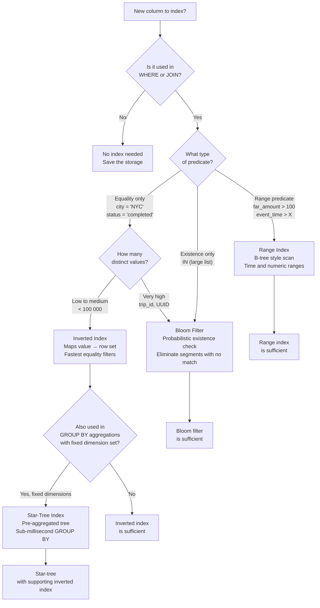
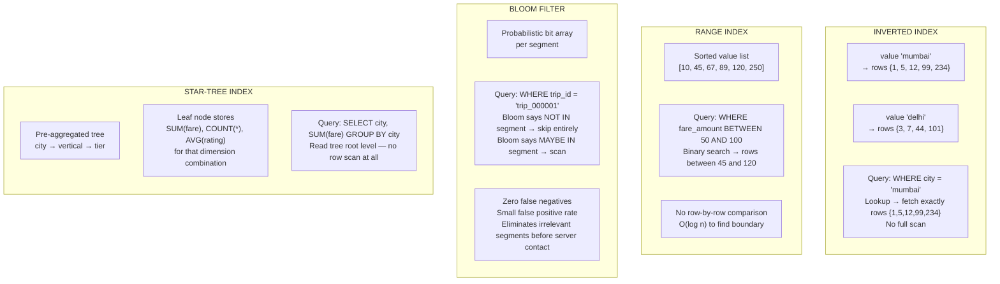
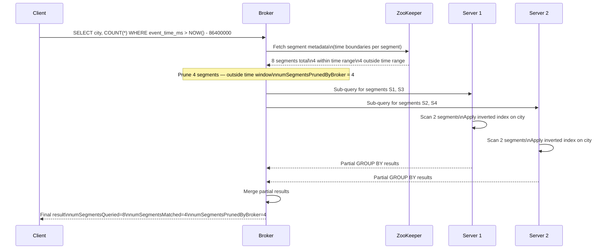

# Lab 4: Index Tuning and Pruning

## Overview

This lab develops the most consequential intuition in Pinot performance engineering: knowing which index to apply to which column and measuring the proof. You will run simulation utilities that make segment pruning and star-tree pre-aggregation observable in isolation, then verify the same behavior against the live cluster using query execution statistics.

> [!NOTE]
> Lab 3 must be complete and data must be present in the `trip_events` table before running the live queries in this lab.

---

## Learning Objectives

| Objective | Success Criterion |
|-----------|-------------------|
| Understand segment-level time pruning | Simulation output shows segments eliminated before server contact |
| Understand star-tree pre-aggregation | Simulation output shows query rows scanned reduced by an order of magnitude |
| Read index configuration in table configs | You can locate and explain all index sections in `trip_events_rt.table.json` |
| Measure query efficiency via BrokerResponse | You can compare `numEntriesScannedInFilter` across indexed and non-indexed queries |
| Apply the index selection framework | Given a column and query pattern, you can choose the correct index type |

---

## The Index Decision Framework

Before touching any configuration, internalize this decision framework. Every index choice is a trade-off between write-time overhead, storage cost, and read-time acceleration. Apply this flowchart to any column you are considering indexing.



---

## How Each Index Works



---

## Index Configuration in This Repository

Study the index sections across the three table configurations. The choices reflect the expected query patterns for each table.

**trip_events — Realtime fact table**

```json
"tableIndexConfig": {
  "invertedIndexColumns": [
    "city", "service_tier", "event_type", "status", "merchant_id"
  ],
  "rangeIndexColumns": [
    "event_time_ms", "fare_amount", "distance_km"
  ],
  "bloomFilterColumns": [
    "trip_id", "merchant_id", "driver_id"
  ]
}
```

**trip_state — Upsert state table**

```json
"tableIndexConfig": {
  "invertedIndexColumns": [
    "city", "service_tier", "status", "merchant_id"
  ],
  "rangeIndexColumns": [
    "last_event_time_ms", "event_version", "fare_amount"
  ],
  "bloomFilterColumns": [
    "trip_id"
  ]
}
```

**merchants_dim — Offline dimension table**

```json
"tableIndexConfig": {
  "sortedColumn": ["merchant_id"],
  "invertedIndexColumns": ["city", "vertical", "contract_tier"],
  "starTreeIndexConfigs": [{
    "dimensionsSplitOrder": ["city", "vertical", "contract_tier"],
    "functionColumnPairs": [
      "COUNT__*",
      "SUM__monthly_orders",
      "AVG__rating"
    ],
    "maxLeafRecords": 10000
  }]
}
```

| Table | Index Choices | Reasoning |
|-------|--------------|-----------|
| `trip_events` | Inverted on categorical dimensions, range on time and numerics, bloom on high-cardinality IDs | Supports mixed query patterns: filter-heavy analytics and time-series ranges |
| `trip_state` | Similar to trip_events, narrower bloom filter set | Current-state queries need fast equality lookups on IDs and time-range pruning |
| `merchants_dim` | Sorted column plus star-tree | Dimension table has a predictable GROUP BY pattern — star-tree pre-aggregates the common aggregations entirely |

---

## Step-by-Step Instructions

### Step 1 — Run the Segment Pruning Simulation

```bash
python3 scripts/simulate_segment_pruning.py
```

This simulation demonstrates how the Broker eliminates segments before they ever reach a Server. It builds a synthetic set of segments with known time boundaries and applies a time predicate to show which segments survive pruning.

**Study the output.** For each query scenario, note how the number of segments queried compares to the total segment count. A well-designed time column and retention policy routinely prunes 90 percent or more of segments for recent-data queries.

---

### Step 2 — Run the Star-Tree Simulation

```bash
python3 scripts/simulate_star_tree.py
```

This simulation contrasts two aggregation paths: a full row scan and a star-tree traversal. It uses the same data and the same query, processed two different ways.

**Study the output.** Observe the row-scan count in the non-star-tree path versus the node count traversed in the star-tree path. The star-tree materializes aggregates at build time and retrieves them in a tree traversal at query time. The work shifts from query time to index build time.

---

### Step 3 — Run the Segment Pruning SQL

```bash
python3 scripts/query_pinot.py --file sql/08_segment_pruning.sql
```

This query applies a time predicate against the live `trip_events` table and returns the BrokerResponse execution statistics that make pruning visible.

**What to look for in the output:**

| Statistic | What It Reveals |
|-----------|----------------|
| `numSegmentsQueried` | Total segments the Broker considered |
| `numSegmentsMatched` | Segments that passed time-range evaluation |
| `numSegmentsPrunedByBroker` | Segments eliminated before reaching any Server |
| `numDocsScanned` | Rows read from the surviving segments |

A large gap between `numSegmentsQueried` and `numSegmentsMatched` confirms that the Broker's time-range pruning is working. If the values are equal, the time predicate is not aligning with segment boundaries. Investigate whether `event_time_ms` is correctly configured as the time column.

---

### Step 4 — Compare Indexed vs Non-Indexed Query Performance

Open the Query Console at **http://localhost:9000/#/query** and run the following queries in sequence. After each query, expand the Response Stats panel and record the values in the comparison table below.

**Query A — Equality filter on an inverted-indexed column**

```sql
SELECT COUNT(*)
FROM trip_events
WHERE city = 'mumbai'
```

**Query B — Equality filter on a bloom-filter-only column**

```sql
SELECT COUNT(*)
FROM trip_events
WHERE driver_id = 'driver_019'
```

**Query C — Range filter on a range-indexed column**

```sql
SELECT COUNT(*), SUM(fare_amount)
FROM trip_events
WHERE fare_amount BETWEEN 50 AND 150
```

**Query D — Time-range with segment pruning**

```sql
SELECT city, COUNT(*) AS trips
FROM trip_events
WHERE event_time_ms > NOW() - 24 * 60 * 60 * 1000
GROUP BY city
ORDER BY trips DESC
```

**Query E — Star-tree aggregation on merchants_dim**

```sql
SELECT city, vertical, COUNT(*), SUM(monthly_orders), AVG(rating)
FROM merchants_dim
GROUP BY city, vertical
ORDER BY city
```

Fill this table as you run each query:

| Query | Index Used | `numEntriesScannedInFilter` | `numDocsScanned` | `timeUsedMs` |
|-------|-----------|:---------------------------:|:----------------:|:------------:|
| A — city equality | Inverted | | | |
| B — driver_id equality | Bloom filter | | | |
| C — fare range | Range | | | |
| D — time range | Segment pruning | | | |
| E — star-tree GROUP BY | Star-tree | | | |

The difference in `numEntriesScannedInFilter` between Query A and Query B quantifies the advantage of an inverted index over a bloom filter for equality predicates. The difference in `numDocsScanned` for Query D compared to full-table scans quantifies the value of segment pruning.

---

### Step 5 — Use EXPLAIN PLAN to Inspect Index Selection

Run the following in the Query Console to see Pinot's query execution plan and confirm which indexes it selected.

```sql
EXPLAIN PLAN FOR
SELECT city, COUNT(*) FROM merchants_dim GROUP BY city
```

The plan output will show whether Pinot selected the star-tree path. When `StarTreeDocIdSet` appears in the plan, the query is reading from pre-aggregated tree nodes rather than scanning raw rows. When you see `FullScanDocIdSet` or `FilteredDocIdSet` with full row counts, the star-tree was not selected. This usually happens because the query dimensions or functions do not match the star-tree's configured `dimensionsSplitOrder` or `functionColumnPairs`.

---

### Step 6 — View Index Configuration in the Controller UI

Navigate to **http://localhost:9000** and click on Tables in the left sidebar.

**trip_events table.** Click the Table Config tab and scroll to `tableIndexConfig`. Confirm the inverted index columns, range index columns, and bloom filter columns match the configuration excerpt shown earlier in this lab.

**merchants_dim table.** Click the Table Config tab and scroll to `tableIndexConfig`. Locate the `starTreeIndexConfigs` section. Note the `dimensionsSplitOrder`. This is the hierarchy the star-tree traverses from root to leaf. The `functionColumnPairs` enumerate every aggregation that the star-tree pre-materializes. Queries that include all these dimensions and only these functions will receive the full star-tree benefit.

---

## Segment Pruning Architecture



---

## Step 7 — Direct A/B Index Testing with `SET skipIndexes`

> [!TIP]
> This is the most instructive technique in the StarTree playbook. The `SET skipIndexes` query hint forces Pinot to bypass a specific index on a specific column for a single query execution. Running the same query with and without the hint gives you a controlled measurement of exactly what that index contributes. No guesswork, no approximation.

Open the Query Console at **http://localhost:9000/#/query** and run each pair. Record `numDocsScanned`, `numEntriesScannedInFilter`, and `timeUsedMs` for both variants.

**Test 1 — Inverted index on `city`**

Without index override (uses inverted index):

```sql
SELECT COUNT(*) FROM trip_events WHERE city = 'mumbai'
```

Forcing a full scan (bypasses inverted index):

```sql
SET skipIndexes='city=inverted';
SELECT COUNT(*) FROM trip_events WHERE city = 'mumbai'
```

**Test 2 — Bloom filter on `trip_id`**

Without index override (uses bloom filter for segment elimination):

```sql
SELECT COUNT(*) FROM trip_events WHERE trip_id = 'trip_000001'
```

Forcing bypass (contacts all segments regardless):

```sql
SET skipIndexes='trip_id=bloomFilter';
SELECT COUNT(*) FROM trip_events WHERE trip_id = 'trip_000001'
```

**Test 3 — Range index on `fare_amount`**

Without override (uses range index):

```sql
SELECT COUNT(*) FROM trip_events WHERE fare_amount BETWEEN 100 AND 300
```

Forcing scan:

```sql
SET skipIndexes='fare_amount=range';
SELECT COUNT(*) FROM trip_events WHERE fare_amount BETWEEN 100 AND 300
```

**Test 4 — Star-tree on `merchants_dim`**

Without override (uses star-tree):

```sql
SELECT city, vertical, COUNT(*), SUM(monthly_orders) FROM merchants_dim GROUP BY city, vertical
```

Forcing raw scan:

```sql
SET skipIndexes='city=startree,vertical=startree';
SELECT city, vertical, COUNT(*), SUM(monthly_orders) FROM merchants_dim GROUP BY city, vertical
```

**A/B Measurement Table — fill in your results:**

| Test | Index Under Test | With Index `numDocsScanned` | Without Index `numDocsScanned` | With Index `timeUsedMs` | Without Index `timeUsedMs` | Speedup Factor |
|------|-----------------|:---------------------------:|:------------------------------:|:-----------------------:|:---------------------------:|:--------------:|
| 1 | Inverted (`city`) | | | | | |
| 2 | Bloom filter (`trip_id`) | | | | | |
| 3 | Range (`fare_amount`) | | | | | |
| 4 | Star-tree (`merchants_dim`) | | | | | |

The `SET skipIndexes` syntax accepts comma-separated entries in the format `columnName=indexType`. Valid index type names are `inverted`, `range`, `bloomFilter`, `startree`, `text`, `fst`, `json`, and `sorted`.

> [!NOTE]
> `SET skipIndexes` works per-query and has no side effects on the table configuration. It is safe to run in production for diagnostic purposes. It does not modify any stored indexes or segment files.

---

## Index Selection Reference

| Index Type | Best For | Not Suited For | Storage Cost |
|-----------|---------|----------------|:------------:|
| Inverted | Equality predicates on low-to-medium cardinality columns | Range predicates, very high cardinality | Medium |
| Range | Numeric and temporal range predicates | Equality-only columns with low cardinality | Medium |
| Bloom filter | Existence checks on very high cardinality columns — trip IDs, UUIDs | Range predicates, aggregations | Low |
| Star-tree | Fixed-dimension GROUP BY aggregations on immutable segments | Streaming realtime tables with changing data | High |
| Sorted column | Range queries where data arrives pre-sorted | Tables where the sort column changes frequently | Low |

> [!TIP]
> Index decisions should follow query profiling, not intuition. Run your most frequent and most expensive queries first, examine their BrokerResponse statistics, and add indexes only where the data shows the cost is justified.

---

## Reflection Prompts

1. The `trip_events` table has a bloom filter on `merchant_id` but also an inverted index on `merchant_id`. Under what query conditions does each index provide a distinct advantage?

2. The star-tree index on `merchants_dim` specifies `dimensionsSplitOrder: ["city", "vertical", "contract_tier"]`. A query groups by `vertical` and `city` but not `contract_tier`. Does the star-tree accelerate this query? Explain why or why not.

3. A new query pattern emerges that filters `trip_events` by both `city` and `service_tier` with an equality predicate. Both columns already have inverted indexes. How does Pinot combine multiple inverted index results to evaluate a compound predicate?

4. You observe that `numSegmentsPrunedByBroker` is always zero for queries against `trip_events`, even when the time predicate is highly restrictive. What is the most likely cause and how would you diagnose it?

---

[Previous: Lab 3 — Stream Ingestion](lab-03-stream-ingestion.md) | [Next: Lab 5 — Upsert and CDC](lab-05-upsert-cdc.md)
