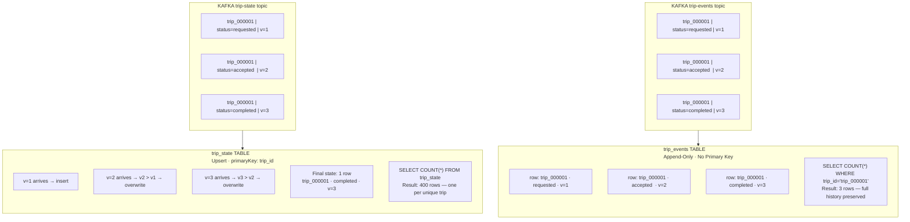
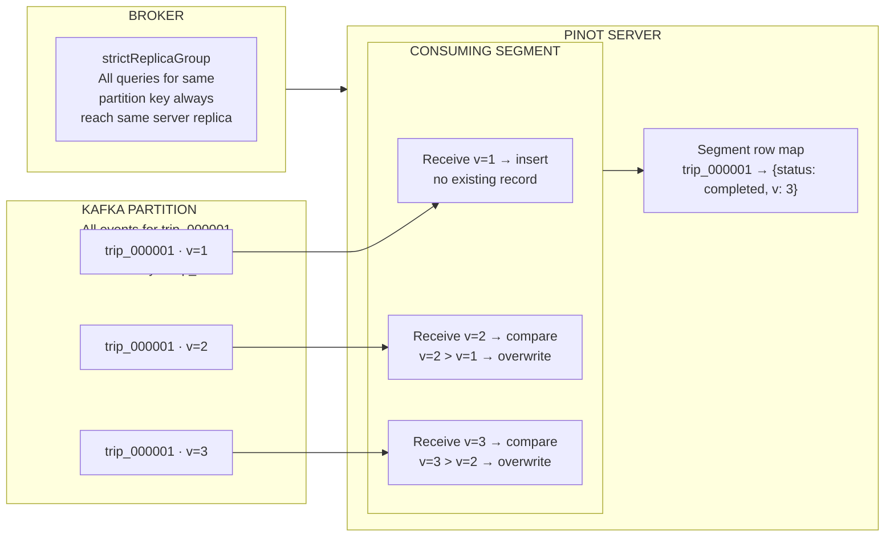
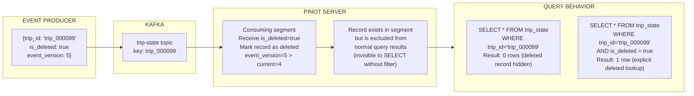

# Lab 5: Upsert and CDC

## Overview

This lab makes the distinction between append-only and mutable data models concrete and measurable. You will observe how the `trip_state` table maintains exactly one record per trip regardless of how many state updates arrive, inspect the upsert configuration that enables this behavior, and trace the conflict resolution mechanism that decides which version of a record survives.

> [!NOTE]
> Data from Labs 3 must be present in both `trip_events` and `trip_state` tables before running the verification queries in this lab.

---

## Learning Objectives

| Objective | Success Criterion |
|-----------|-------------------|
| Understand upsert semantics | You can explain FULL upsert mode and how it differs from append-only storage |
| Identify the comparison column | You can locate `comparisonColumns` in the table config and explain its role |
| Verify record convergence | `SELECT COUNT(*) FROM trip_state` returns one row per unique trip, not one row per event |
| Understand soft delete behavior | You can explain the `deleteRecordColumn` mechanism and write a query that excludes deleted records |
| Understand the strictReplicaGroup requirement | You can explain why removing this routing setting would cause query inconsistency |

---

## The Two Data Models Side by Side

Before examining any configuration, understand the fundamental difference between the two realtime tables in this repository.



**The key insight.** Both tables consume from Kafka. Both receive the same event volume. The `trip_events` table stores every event forever. It is the audit log, the time series, the complete history. The `trip_state` table stores only the latest version of each trip. It is the current-state view, the lookup table, the operational query target. They answer different questions and are optimized for different workloads.

---

## The Upsert Resolution Model



**Why the Kafka key matters.** If `trip_id` is not set as the Kafka message key, events for the same trip scatter across all four partitions. Each partition would then hold a partial view of the trip lifecycle. Upsert resolution happens within a single server's segment scope. It cannot reconcile records across servers. The Kafka key is what guarantees co-location of all events for the same trip on the same partition, which maps to the same Pinot server, which enables correct upsert resolution.

---

## Configuration Deep Dive

### Schema — Primary Key Declaration

Open `schemas/trip_state.schema.json` and locate the primary key configuration.

```json
{
  "schemaName": "trip_state",
  "primaryKeyColumns": ["trip_id"],
  "dimensionFieldSpecs": [...],
  "metricFieldSpecs": [...],
  "dateTimeFieldSpecs": [...]
}
```

The `primaryKeyColumns` field is the signal to Pinot that this schema supports upsert semantics. Without it, the table configuration cannot include an `upsertConfig` block.

### Table Configuration — Upsert Block

Open `tables/trip_state_rt.table.json` and locate the upsert configuration.

```json
{
  "upsertConfig": {
    "mode": "FULL",
    "comparisonColumns": ["event_version"],
    "deleteRecordColumn": "is_deleted",
    "enableSnapshot": true
  },
  "routing": {
    "instanceSelectorType": "strictReplicaGroup"
  }
}
```

| Field | Value | Meaning |
|-------|-------|---------|
| `mode` | `FULL` | The entire row is replaced when the comparison column indicates a newer version |
| `comparisonColumns` | `event_version` | The column whose value determines which record wins when two share the same primary key |
| `deleteRecordColumn` | `is_deleted` | When a record arrives with this column set to `true`, it is treated as a soft delete |
| `enableSnapshot` | `true` | Maintains a consistent upsert state snapshot during segment compaction operations |
| `instanceSelectorType` | `strictReplicaGroup` | Ensures all queries for the same primary key are always routed to the same server replica |

---

## Step-by-Step Instructions

### Step 1 — Inspect the Keyed Payload Format

```bash
head -5 data/sample_trip_state.kafka.txt
```

**Expected output format:**

```
trip_000001|{"trip_id":"trip_000001","status":"completed","event_version":3,"fare_amount":245.5,"last_event_time_ms":1706745620000,"is_deleted":false}
trip_000002|{"trip_id":"trip_000002","status":"cancelled","event_version":1,"fare_amount":189.0,"last_event_time_ms":1706745610000,"is_deleted":false}
```

The pipe-separated format places `trip_id` as the Kafka message key. This key determines Kafka partition assignment and, consequently, determines which Pinot server partition this trip's events land on.

---

### Step 2 — Run the Upsert Simulation

```bash
python3 scripts/simulate_upsert.py
```

This simulation constructs three state updates for the same `trip_id` with incrementing `event_version` values and passes them through the upsert resolution logic. The output shows the state of the record after each event is processed.

**What to observe in the simulation output:**

After event version 1 arrives, the record is inserted with `status = requested`. After version 2 arrives, the comparison column evaluates `2 > 1` and the record is overwritten with `status = accepted`. After version 3 arrives, the comparison column evaluates `3 > 2` and the final state shows `status = completed`. A query issued after all three events returns exactly one row, not three.

---

### Step 3 — Run the Upsert Debug SQL

```bash
python3 scripts/query_pinot.py --file sql/07_upsert_debug.sql
```

This query pack examines the `trip_state` table to verify upsert convergence and inspect the `event_version` distribution across trips.

---

### Step 4 — Verify Upsert Convergence in the Query Console

Open **http://localhost:9000/#/query** and run the following queries.

**Query 1 — Confirm one row per trip**

```sql
SELECT COUNT(*) FROM trip_state
```

The result should be approximately 400, one row per unique `trip_id` in the dataset. Compare this with:

```sql
SELECT COUNT(*) FROM trip_events
```

The `trip_events` count should be substantially higher, approximately 1 611, because it retains every individual event rather than collapsing them by primary key.

**Query 2 — Inspect version distribution**

```sql
SELECT
  event_version,
  COUNT(*) AS trip_count
FROM trip_state
GROUP BY event_version
ORDER BY event_version
```

This shows how many trips reached each version level. Trips with higher version numbers received more state updates during their lifecycle.

**Query 3 — Find high-version trips**

```sql
SELECT
  trip_id,
  status,
  event_version,
  fare_amount,
  last_event_time_ms
FROM trip_state
WHERE event_version > 3
ORDER BY event_version DESC
LIMIT 10
```

These trips had the most complex lifecycles, with more status transitions, more updates, and therefore higher version numbers before reaching a terminal state.

**Query 4 — Verify the latest state for a specific trip**

```sql
SELECT trip_id, status, fare_amount, event_version, last_event_time_ms
FROM trip_state
WHERE trip_id = 'trip_000001'
```

This returns exactly one row showing the terminal state of `trip_000001`. Regardless of how many state updates were published for this trip, the upsert mechanism ensures only the highest-version record is visible to queries.

**Query 5 — Verify soft delete behavior**

```sql
SELECT
  is_deleted,
  COUNT(*) AS record_count
FROM trip_state
GROUP BY is_deleted
```

The majority of records should show `is_deleted = false`. If any records show `is_deleted = true`, those trips have been soft-deleted. Production queries that should exclude deleted records must include `WHERE is_deleted = false` explicitly.

---

### Step 5 — Fetch Trip State via the Demo API

```bash
curl -s http://localhost:8010/api/v1/trips/trip_000001 | python3 -m json.tool
```

The API translates this request into `SELECT * FROM trip_state WHERE trip_id = 'trip_000001'`. The response should match the result from Query 4 above, showing the same terminal state, the same version, the same fare amount.

---

### Step 6 — Examine the Upsert Configuration in the Controller UI

Open **http://localhost:9000** and navigate to Tables. Click `trip_state_REALTIME`.

Navigate to the Table Config tab. Scroll to the `upsertConfig` section and confirm the `mode`, `comparisonColumns`, and `deleteRecordColumn` values. Scroll further to the `routing` section and confirm `strictReplicaGroup` is set.

Navigate to the Segments tab. Observe that the segment row counts reflect the number of unique trips, not the total number of events ingested. This is the storage efficiency of upsert. Only the latest state per primary key consumes segment space.

---

## Upsert vs Append-Only Reference

| Property | `trip_events` Append-Only | `trip_state` Upsert |
|----------|:------------------------:|:-------------------:|
| Primary key | None | `trip_id` |
| Duplicate records | Preserved — all versions stored | Collapsed — only latest version visible |
| Row count | Equals total events ingested | Equals unique primary key count |
| Storage growth | Grows with every event | Grows only with new unique keys |
| Query pattern | Aggregations over time, funnels, historical analysis | Point lookups by ID, current-state joins |
| Conflict resolution | Not applicable — all records coexist | Comparison column determines winner |
| Write ordering | Not required | Events for the same key must be co-partitioned in Kafka |

---

## The Delete Record Mechanism



---

## Reflection Prompts

1. A producer publishes three state updates for `trip_000001` with `event_version` values of 5, 3, and 7, in that order. What is the final state visible to a query after all three events are processed?

2. A separate producer accidentally publishes an event for `trip_000001` with `event_version = 2` after the trip has already reached version 7. What happens to this late-arriving event and why?

3. The Kafka topic for `trip_state` has 4 partitions and the Pinot table has a `replication` factor of 2. How many physical copies of any given trip's state exist in the Pinot cluster, and which servers hold authoritative query data for upsert queries?

4. Describe a production scenario where you would choose `mode: PARTIAL` upsert over `mode: FULL` and explain what changes in the conflict resolution behavior.

---

[Previous: Lab 4 — Index Tuning](lab-04-index-tuning.md) | [Next: Lab 6 — Multi-Stage Queries](lab-06-multi-stage-queries.md)
