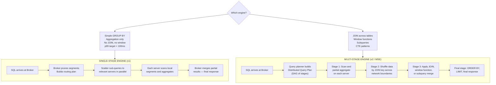
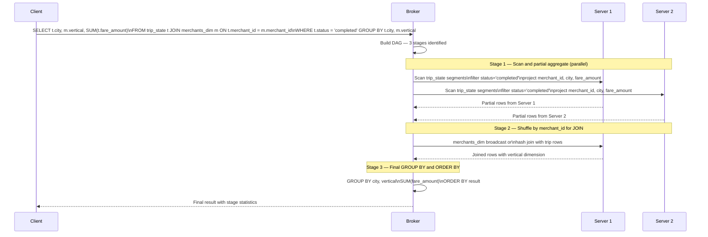
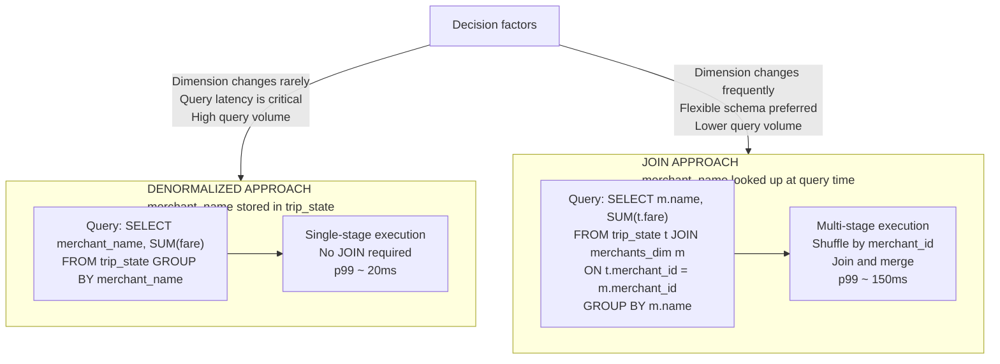

# Lab 6: Multi-Stage Queries

## Overview

The single-stage query engine handles scatter-gather patterns elegantly, but it cannot execute distributed joins or window functions. This lab introduces the Multi-Stage Engine (v2), which breaks queries into a directed acyclic graph of computation stages that can shuffle data across servers. You will run join queries, window function queries and CTE-based analytics, then compare their execution plans and latencies against equivalent single-stage patterns.

> [!NOTE]
> Data from Lab 3 must be present in `trip_state` and the merchant dimension must be loaded from Lab 2 before running the join queries.


## Learning Objectives

| Objective | Success Criterion |
|-----------|-------------------|
| Understand the two query engines | You can explain when to use single-stage (v1) versus multi-stage (v2) |
| Execute a distributed JOIN | `sql/04_multistage_join.sql` returns results with `numStagesExecuted > 1` |
| Execute a window function | `sql/05_multistage_windows.sql` returns ranked results |
| Measure JOIN overhead | You have recorded `timeUsedMs` for equivalent single-stage and multi-stage queries and can explain the difference |
| Apply the denormalization trade-off | You can state when to pre-join data into a fact table versus query-time join |


## The Two Query Engines



**The core difference.** The single-stage engine moves query results up from servers to the broker. Data flows in one direction. The multi-stage engine can move intermediate results *between* servers. Data shuffles laterally across the cluster. This shuffle capability enables joins and window functions but introduces network transfer cost.


## The Distributed Query Plan for a JOIN




## Step-by-Step Instructions

### Step 1 — Run the Join Query

```bash
python3 scripts/query_pinot.py --file sql/04_multistage_join.sql --query-type multistage
```

This query joins the realtime `trip_state` table against the offline `merchants_dim` dimension table on `merchant_id`, then aggregates by city, vertical and contract tier.

**Expected output fields to examine:**

| Field | Significance |
|-------|-------------|
| `numStagesExecuted` | Should be greater than 1 — confirms multi-stage execution |
| `stageStats` | Breakdown of time spent in each stage |
| `timeUsedMs` | Total latency including shuffle cost |


### Step 2 — Run the Window Function Query

```bash
python3 scripts/query_pinot.py --file sql/05_multistage_windows.sql --query-type multistage
```

This query ranks merchants within each city by gross merchandise value using `RANK() OVER (PARTITION BY city ORDER BY SUM(fare_amount) DESC)`.

**What the multi-stage engine does here.** Stage 1 scans `trip_state` and computes per-merchant GMV aggregations. Stage 2 applies the window function — this requires sorting data within each city partition, which cannot happen on a single server because trip data is distributed by partition key. The broker coordinates the sort-merge across servers before applying the `RANK()` assignment. Stage 3 filters to the top-ranked merchants per city and applies the final `ORDER BY`.


### Step 3 — Execute Queries in the Query Console

Open **http://localhost:9000/#/query**. Ensure the engine selector is set to **Multi-Stage** before running the following queries.

**Query 1 — Cross-table analytics with JOIN**

```sql
SELECT
  t.city,
  m.vertical,
  m.contract_tier,
  COUNT(*) AS completed_trips,
  SUM(t.fare_amount) AS gmv,
  AVG(t.distance_km) AS avg_distance
FROM trip_state t
JOIN merchants_dim m ON t.merchant_id = m.merchant_id
WHERE t.status = 'completed'
GROUP BY t.city, m.vertical, m.contract_tier
ORDER BY gmv DESC
LIMIT 50
```

**Query 2 — Top 3 merchants per city by GMV**

```sql
SELECT *
FROM (
  SELECT
    city,
    merchant_id,
    SUM(fare_amount) AS gmv,
    RANK() OVER (
      PARTITION BY city
      ORDER BY SUM(fare_amount) DESC
    ) AS merchant_rank
  FROM trip_state
  WHERE status = 'completed'
  GROUP BY city, merchant_id
) ranked
WHERE merchant_rank <= 3
ORDER BY city, merchant_rank
```

**Query 3 — Merchants above average GMV (correlated subquery)**

```sql
SELECT *
FROM (
  SELECT
    merchant_id,
    SUM(fare_amount) AS gmv
  FROM trip_state
  WHERE status = 'completed'
  GROUP BY merchant_id
) merchant_gmv
WHERE gmv > (
  SELECT AVG(fare_amount) * 10
  FROM trip_state
  WHERE status = 'completed'
)
ORDER BY gmv DESC
```

**Query 4 — CTE pattern for city performance summary**

```sql
WITH city_stats AS (
  SELECT
    city,
    COUNT(*) AS trips,
    SUM(fare_amount) AS gmv
  FROM trip_state
  WHERE status = 'completed'
  GROUP BY city
)
SELECT
  city,
  trips,
  gmv,
  ROUND(gmv / trips, 2) AS avg_fare
FROM city_stats
ORDER BY gmv DESC
```

**Query 5 — Contract tier ranking per city (combines JOIN and window function)**

```sql
SELECT
  t.city,
  m.contract_tier,
  SUM(t.fare_amount) AS total_gmv,
  RANK() OVER (
    PARTITION BY t.city
    ORDER BY SUM(t.fare_amount) DESC
  ) AS tier_rank
FROM trip_state t
JOIN merchants_dim m ON t.merchant_id = m.merchant_id
WHERE t.status = 'completed'
GROUP BY t.city, m.contract_tier
ORDER BY t.city, tier_rank
```


### Step 4 — Measure Single-Stage vs Multi-Stage Latency

Run the following pair of queries and record the `timeUsedMs` for each. They answer the same business question through different execution paths.

**Single-stage (denormalized — fastest)**

```sql
SELECT
  city,
  COUNT(*) AS trips,
  SUM(fare_amount) AS gmv
FROM trip_state
WHERE status = 'completed'
GROUP BY city
ORDER BY gmv DESC
```

**Multi-stage (with JOIN — more flexible)**

```sql
SELECT
  t.city,
  COUNT(*) AS trips,
  SUM(t.fare_amount) AS gmv
FROM trip_state t
JOIN merchants_dim m ON t.merchant_id = m.merchant_id
WHERE t.status = 'completed'
GROUP BY t.city
ORDER BY gmv DESC
```

| Query | `timeUsedMs` | `numStagesExecuted` | Execution Path |
|-------|:------------:|:-------------------:|----------------|
| Single-stage GROUP BY | | 1 | Scatter-gather only |
| Multi-stage JOIN | | > 1 | Scatter, shuffle, join, merge |

The JOIN adds latency proportional to the data shuffle cost, which is the network transfer of moving intermediate results between servers. For this small dataset, the difference is modest. In production with billions of rows, the difference compounds and the denormalization trade-off becomes critical.


### Step 5 — Inspect the Execution Plan

Run the following in the Query Console to see the MSE query plan.

```sql
EXPLAIN PLAN FOR
SELECT
  t.city,
  m.vertical,
  COUNT(*) AS trips,
  SUM(t.fare_amount) AS gmv
FROM trip_state t
JOIN merchants_dim m ON t.merchant_id = m.merchant_id
WHERE t.status = 'completed'
GROUP BY t.city, m.vertical
ORDER BY gmv DESC
```

The plan shows the stage graph. Look for `EXCHANGE` nodes. These represent data shuffles between stages. Each exchange has a distribution type: `HASH` means data is partitioned by a key for join alignment, `BROADCAST` means the smaller table is copied to all servers, `SINGLETON` means all data flows to a single node for final aggregation.


## Denormalization Trade-Off Analysis

The `trip_state` table already contains `merchant_name` as a denormalized column, even though `merchants_dim` is the authoritative source. This is an intentional design decision.



| Consideration | Denormalize | Query-time JOIN |
|---------------|:-----------:|:---------------:|
| Query latency | Lower | Higher |
| Storage cost | Higher | Lower |
| Dimension update complexity | High — must re-ingest fact data | Low — update dimension table only |
| Schema flexibility | Low — fact schema must change | High — add columns to dimension freely |
| Suitable for high-QPS endpoints | Yes | No |


## When to Use Each Engine

| Use Single-Stage (v1) | Use Multi-Stage (v2) |
|:---------------------:|:--------------------:|
| Simple GROUP BY aggregations | JOIN across two tables |
| `COUNT`, `SUM`, `AVG` with filters | Window functions: `RANK`, `DENSE_RANK`, `ROW_NUMBER` |
| Time-series bucketing | Correlated subqueries |
| High-QPS user-facing queries | CTE-based multi-pass analytics |
| Latency below 50ms target | Analytical exploration queries |


## Reflection Prompts

1. A product manager requests a dashboard showing the top 10 merchants by GMV for the last 7 days, updated every 60 seconds. Would you implement this as a multi-stage join query or a denormalized single-stage query? Justify your choice with latency and freshness arguments.

2. The `RANK()` window function requires data to be sorted within each city partition before ranks can be assigned. Explain why this operation cannot be completed on a single Pinot Server and describe what the multi-stage engine does to enable it.

3. A join query between `trip_state` (400 rows) and `merchants_dim` (200 rows) takes 180ms. The same aggregation on `trip_state` alone takes 12ms. What is the primary source of the 168ms overhead and what configuration change might reduce it?

4. Under what data volume conditions does the denormalization trade-off break down? That is, when does the storage cost of denormalization become higher than the latency cost of a join?


[Previous: Lab 5 — Upsert and CDC](lab-05-upsert-cdc.md) | [Next: Lab 7 — Time Series Analytics](lab-07-time-series.md)
