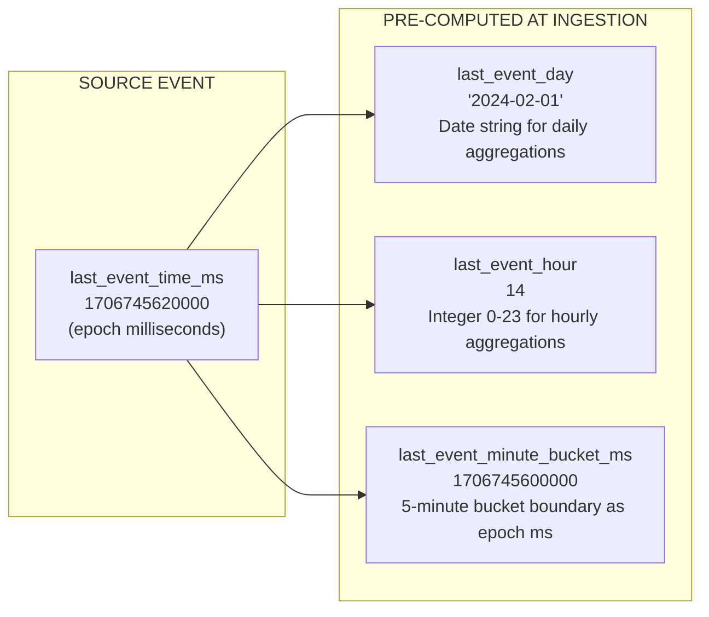
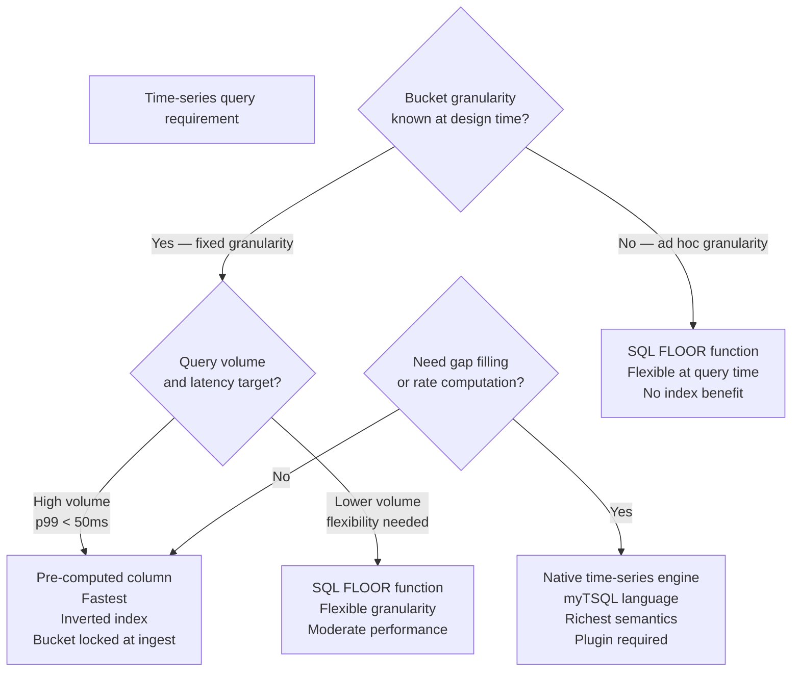

# Lab 7: Time Series Analytics

## Overview

Time is the primary dimension in every operational analytics system. This lab demonstrates three distinct approaches to time-bucketed analytics in Pinot, including pre-computed helper columns, SQL floor functions and the native time-series query model and builds intuition for when each approach is appropriate. You will measure the performance difference between pre-computed and function-based bucketing and design a time-series API contract that abstracts the underlying query complexity from downstream consumers.

> [!NOTE]
> Data from Lab 3 must be present in `trip_state` before running the time-series queries. The `last_event_minute_bucket_ms`, `last_event_day` and `last_event_hour` columns must be present in the ingested records.


## Learning Objectives

| Objective | Success Criterion |
|-----------|-------------------|
| Understand pre-computed time bucketing | You can explain why `last_event_minute_bucket_ms` outperforms `FLOOR(ts / bucket_ms)` at query time |
| Run time-bucket aggregations | All four time-series SQL queries return non-empty results |
| Compare bucketing approaches | You have recorded `timeUsedMs` for pre-computed versus function-based bucketing |
| Interpret the time-series API contract | You can explain the mapping from API parameters to the underlying SQL query |
| Identify the right bucketing strategy | Given a query requirement and data volume, you can choose the appropriate approach |


## The Three Time-Bucketing Approaches

```mermaid
flowchart TB
    subgraph pc["APPROACH 1: PRE-COMPUTED COLUMN"]
        direction LR
        pc1["At ingestion time\nbucket_ms = FLOOR(ts / 300000) * 300000\nstored as last_event_minute_bucket_ms"]
        pc2["At query time\nGROUP BY last_event_minute_bucket_ms\nInverted index available\nNo arithmetic"]
        pc3["Performance: fastest\nFlexibility: lowest\nBucket size fixed at ingest"]
        pc1 --> pc2 --> pc3
    end

    subgraph sql["APPROACH 2: SQL FLOOR FUNCTION"]
        direction LR
        s1["At ingestion time\nStore raw timestamp: last_event_time_ms"]
        s2["At query time\nFLOOR(ts / bucket_ms) * bucket_ms\nArithmetic on every row\nNo index benefit"]
        s3["Performance: moderate\nFlexibility: highest\nAny bucket size at query time"]
        s1 --> s2 --> s3
    end

    subgraph ts["APPROACH 3: NATIVE TIME-SERIES ENGINE"]
        direction LR
        t1["Request uses myTSQL language\nseries(sum(metric), by=[dim], every='5m')"]
        t2["Engine handles bucketing\nwindow, gap filling, rate calculation\nNative time functions"]
        t3["Performance: good\nFlexibility: highest\nRequires plugin configuration"]
        t1 --> t2 --> t3
    end
```



**The pre-computation principle.** Bucket boundary arithmetic (`FLOOR(ts / bucket_ms) * bucket_ms`) applied to millions of rows at query time is a fixed cost that compounds with data volume. Moving that computation to ingestion time pays it once and stores the result as a plain column, which benefits from inverted index lookups, segment pruning and dictionary encoding. The trade-off is that the bucket granularity is locked at ingestion time.


## Pre-Computed Helper Columns in the Schema

The `trip_state` schema includes three temporal helper columns computed from `last_event_time_ms` at data generation time. These are not derived or computed at query time. They are stored as regular columns.



| Column | Type | Computation | Query Pattern |
|--------|------|-------------|---------------|
| `last_event_day` | STRING | Date string from epoch | Daily trend queries |
| `last_event_hour` | INT | Hour-of-day integer 0–23 | Hourly distribution queries |
| `last_event_minute_bucket_ms` | LONG | `FLOOR(ts / 300000) * 300000` | 5-minute time series |


## Step-by-Step Instructions

### Step 1 — Run the SQL Time-Series Example

```bash
python3 scripts/query_pinot.py --file sql/06_timeseries_gmv.sql
```

This query groups by the pre-computed 5-minute bucket column and sums fare amounts. The output is a time-ordered sequence of revenue values ready for visualization.

**Expected output format:**

```
bucket_start_ms   | gmv
1709880000000     | 5420.50
1709880300000     | 3150.25
1709880600000     | 4890.75
```

Each row represents one five-minute window. The `bucket_start_ms` value is the epoch millisecond timestamp for the start of the bucket. Convert it to a human-readable date with `FROM_DATE_TIME(bucket_start_ms, 'yyyy-MM-dd HH:mm')`.


### Step 2 — Call the Time-Series API Endpoint

```bash
curl -s -X POST http://localhost:8010/api/v1/query/timeseries \
  -H "content-type: application/json" \
  -d '{"metric":"gross_merchandise_value","bucket_minutes":60,"window_hours":24}' \
  | python3 -m json.tool
```

**Expected response structure:**

```json
{
  "metric": "gross_merchandise_value",
  "bucket_minutes": 60,
  "window_hours": 24,
  "buckets": [
    {"timestamp": "2024-03-08T10:00:00", "value": 12500.50},
    {"timestamp": "2024-03-08T11:00:00", "value": 15200.25},
    {"timestamp": "2024-03-08T12:00:00", "value": 18750.00}
  ]
}
```

The API translates the `bucket_minutes` and `window_hours` parameters into SQL predicates against `last_event_time_ms` and groups by the appropriate pre-computed bucket column. The response format is designed for consumption by charting libraries. Typed timestamps, numeric values and a consistent schema regardless of metric make integration straightforward.


### Step 3 — Run Time-Series Queries in the Query Console

Open **http://localhost:9000/#/query** and execute the following queries. Record `timeUsedMs` for each.

**Query 1 — Hourly GMV trend using pre-computed column**

```sql
SELECT
  last_event_hour AS hour_of_day,
  COUNT(*) AS trips,
  SUM(fare_amount) AS gmv,
  AVG(fare_amount) AS avg_fare
FROM trip_state
WHERE status = 'completed'
GROUP BY last_event_hour
ORDER BY hour_of_day
```

**Query 2 — Daily trip and revenue summary**

```sql
SELECT
  last_event_day AS event_date,
  COUNT(*) AS daily_trips,
  SUM(fare_amount) AS daily_gmv,
  AVG(distance_km) AS avg_distance
FROM trip_state
WHERE status = 'completed'
GROUP BY last_event_day
ORDER BY event_date
```

**Query 3 — 5-minute bucket time series (pre-computed)**

```sql
SELECT
  last_event_minute_bucket_ms AS bucket_start,
  COUNT(*) AS trips_in_bucket,
  SUM(fare_amount) AS bucket_gmv
FROM trip_state
WHERE status = 'completed'
GROUP BY last_event_minute_bucket_ms
ORDER BY bucket_start
LIMIT 50
```

**Query 4 — Same 5-minute bucketing using SQL FLOOR function**

```sql
SELECT
  FLOOR(last_event_time_ms / (5 * 60 * 1000)) * (5 * 60 * 1000) AS bucket_start,
  COUNT(*) AS trips_in_bucket,
  SUM(fare_amount) AS bucket_gmv
FROM trip_state
WHERE status = 'completed'
GROUP BY FLOOR(last_event_time_ms / (5 * 60 * 1000)) * (5 * 60 * 1000)
ORDER BY bucket_start
LIMIT 50
```

Record the `timeUsedMs` for Query 3 and Query 4. They produce identical results through different execution paths.

| Query | Approach | `timeUsedMs` | Index Used |
|-------|----------|:------------:|-----------|
| Query 3 | Pre-computed column | | Inverted index on `last_event_minute_bucket_ms` |
| Query 4 | FLOOR function | | No index — full column scan with arithmetic |


### Step 4 — Multi-Dimensional Time Series

**City-level daily time series**

```sql
SELECT
  city,
  last_event_day AS date,
  COUNT(*) AS trips,
  SUM(fare_amount) AS gmv
FROM trip_state
WHERE status = 'completed'
GROUP BY city, last_event_day
ORDER BY city, date
```

**Service tier hourly distribution**

```sql
SELECT
  service_tier,
  last_event_hour AS hour,
  COUNT(*) AS trips,
  AVG(fare_amount) AS avg_fare
FROM trip_state
WHERE status = 'completed'
GROUP BY service_tier, last_event_hour
ORDER BY service_tier, hour
```

**Peak revenue hour analysis**

```sql
SELECT
  last_event_hour AS hour,
  COUNT(*) AS trips,
  SUM(fare_amount) AS revenue,
  ROUND(SUM(fare_amount) / COUNT(*), 2) AS avg_fare
FROM trip_state
WHERE status = 'completed'
GROUP BY last_event_hour
ORDER BY revenue DESC
```


### Step 5 — Human-Readable Timestamps

The Query Console displays epoch milliseconds by default. Use the `FROM_DATE_TIME` function to produce readable timestamp strings for output.

```sql
SELECT
  FROM_DATE_TIME(last_event_time_ms, 'yyyy-MM-dd HH:mm') AS readable_time,
  COUNT(*) AS trips,
  SUM(fare_amount) AS gmv
FROM trip_state
WHERE status = 'completed'
GROUP BY FROM_DATE_TIME(last_event_time_ms, 'yyyy-MM-dd HH:mm')
ORDER BY readable_time
LIMIT 20
```

> [!TIP]
> When building dashboards or downstream APIs, always convert epoch milliseconds to human-readable timestamps at the presentation layer, not inside Pinot queries. Keeping Pinot queries operating on epoch milliseconds preserves index efficiency and avoids string parsing overhead.


### Step 6 — Inspect the Native Time-Series Request Format

Open `sql/timeseries_gmv_request.json` and examine the request structure.

```json
{
  "language": "mytsql",
  "query": "series(sum(gross_merchandise_value), by=[city], every='5m', window='24h')",
  "queryOptions": "timeoutMs=15000"
}
```

This request uses the `myTSQL` time-series query language, a specialized DSL that maps directly to time-series semantics. The `series()` function handles bucket alignment, the `by=` clause adds dimension breakdowns, the `every=` parameter sets the bucket granularity and the `window=` parameter sets the lookback horizon.

The native time-series engine is more expressive than SQL floor functions for time-series workloads. It supports gap filling, rate computation, moving averages and monotonic counter normalization out of the box. However, it requires the time-series engine plugin to be configured in the Pinot deployment and uses a different query endpoint than the standard SQL API.


## Bucketing Strategy Selection



| Approach | Latency | Flexibility | Infrastructure | Best For |
|----------|:-------:|:-----------:|:--------------:|----------|
| Pre-computed column | Lowest | Lowest | None | Fixed-granularity production dashboards |
| SQL FLOOR function | Moderate | High | None | Ad hoc analytics and exploratory queries |
| Native time-series engine | Low | Highest | Plugin setup required | Metrics platforms, rate computation, gap filling |


## Reflection Prompts

1. A data analyst wants to explore trip trends at different granularities, sometimes hourly, sometimes 15-minute, sometimes daily, without requiring a schema change each time. Which bucketing approach do you recommend and what performance trade-off should the analyst be aware of?

2. The `last_event_minute_bucket_ms` column has an inverted index configured. Explain how an inverted index on an integer time column provides value compared to a table scan when the query predicates on this column.

3. The native time-series engine's `series()` function supports gap filling, inserting zero-valued buckets for time windows where no events occurred. Describe a business scenario where gap filling matters for correctness and one where it would produce misleading results.

4. A downstream service consumes the time-series API and expects consistent bucket boundaries regardless of when queries are issued. Which bucketing approach provides this guarantee and why?


[Previous: Lab 6 — Multi-Stage Queries](lab-06-multi-stage-queries.md) | [Next: Lab 8 — SLO and Incident Drill](lab-08-slo-incident.md)
