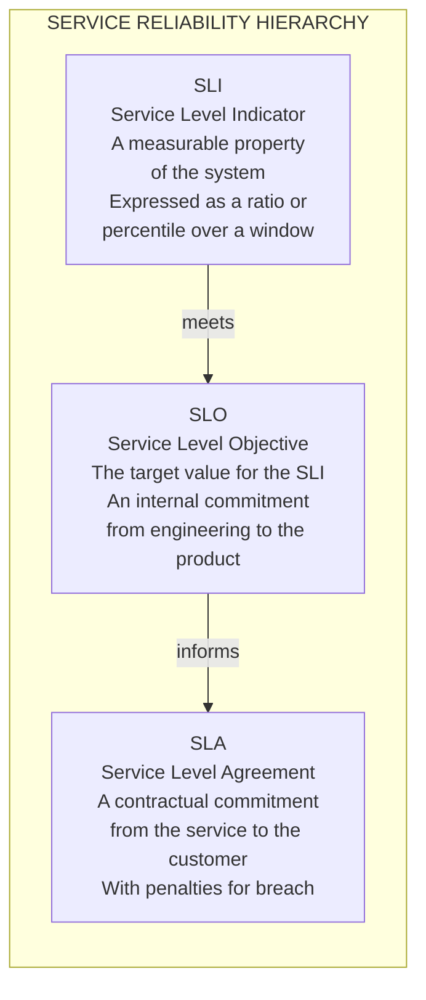
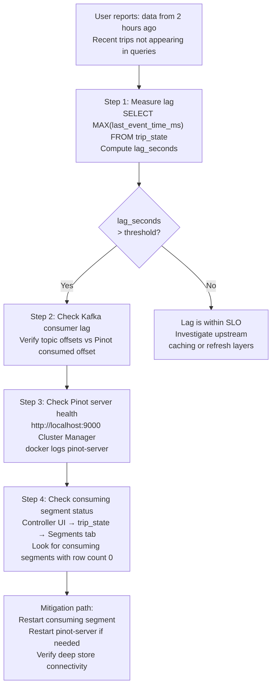
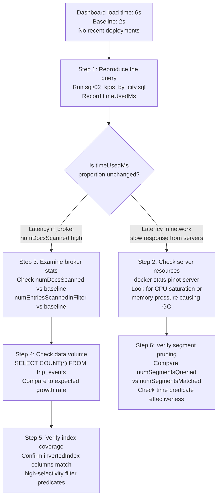

# Lab 8: SLO and Incident Drill

## Overview

The most important skill in operating a production Pinot cluster is not knowing how to configure it. It is knowing how to diagnose it under pressure. This lab formalizes that skill through two structured exercises: defining a Service Level Objective with a measurable indicator and walking through a tabletop incident investigation that traces a symptom to its root component through a systematic elimination process.


## Learning Objectives

| Objective | Success Criterion |
|-----------|-------------------|
| Define a complete SLO | Your SLO document specifies an SLI, target threshold, measurement query, alert threshold, owner and first-response steps |
| Apply the incident triage matrix | Given a symptom, you navigate to the correct component and gather the right evidence |
| Execute a data freshness investigation | You can measure Kafka-to-Pinot lag in seconds using a SQL query |
| Analyze query performance regression | You can identify the BrokerResponse fields that distinguish a server-side bottleneck from a broker-side bottleneck |
| Produce a runbook artifact | You have written a structured runbook for one incident scenario |


## The SLI–SLO–SLA Hierarchy



| Term | Measured By | Example for This System |
|------|------------|------------------------|
| SLI | Raw metrics from Pinot and Kafka | `p99 query latency`, `data freshness lag in seconds` |
| SLO | Engineering target for the SLI | `p99 latency < 200ms`, `freshness lag < 30 seconds` |
| SLA | Customer-facing contractual guarantee | `99.9% of queries complete within 500ms over a rolling 30-day window` |


## Part 1: Define Your SLO

Choose one of the three SLO templates below and complete the measurement column with the actual SQL query or command you would run to gather the SLI value.


### SLO Option A — Data Freshness for `trip_state`

| Field | Definition |
|-------|------------|
| Objective | Trip state data must be queryable within 30 seconds of the corresponding Kafka event |
| SLI | `(NOW() - MAX(last_event_time_ms)) / 1000` in seconds |
| Measurement | `SELECT MAX(last_event_time_ms) AS latest_event, (NOW() - MAX(last_event_time_ms)) / 1000 AS lag_seconds FROM trip_state` |
| Good threshold | lag_seconds below 30 |
| Alert threshold | lag_seconds above 60 for more than 2 minutes |
| Owner | Data Platform Engineering |
| First response | Check Kafka consumer lag, verify Pinot server health, inspect consuming segment status |

Run the measurement query now against your local cluster.

```sql
SELECT
  MAX(last_event_time_ms) AS latest_event_ms,
  NOW() AS current_time_ms,
  ROUND((NOW() - MAX(last_event_time_ms)) / 1000.0, 1) AS lag_seconds
FROM trip_state
```

For the sample dataset, `lag_seconds` will reflect the time since the data was generated. In a live streaming environment, this value reflects the pipeline end-to-end latency.


### SLO Option B — Query Latency for KPI Endpoint

| Field | Definition |
|-------|------------|
| Objective | 95% of requests to `/api/v1/kpis` complete within 500 milliseconds |
| SLI | p95 response time for the KPI endpoint over a rolling 5-minute window |
| Measurement | Prometheus histogram metric `http_request_duration_seconds_bucket` with label `endpoint="/api/v1/kpis"` |
| Good threshold | p95 below 500ms |
| Alert threshold | p95 above 750ms for 5 consecutive minutes |
| Owner | Platform API Team |
| First response | Check Pinot broker load, examine recent BrokerResponse `timeUsedMs` values, review index coverage for the KPI query |

Measure the underlying Pinot query latency directly.

```bash
python3 scripts/query_pinot.py --file sql/02_kpis_by_city.sql
```

Inspect the `timeUsedMs` in the response. This is the broker-side latency. Add the application processing time and network overhead to estimate the full API response time.


### SLO Option C — Segment Push Success Rate for `merchants_dim`

| Field | Definition |
|-------|------------|
| Objective | All scheduled batch pushes to `merchants_dim` must succeed |
| SLI | `(successful_pushes / total_scheduled_pushes) * 100` over a rolling 24-hour window |
| Measurement | Airflow or job scheduler logs; Controller API segment count verification |
| Good threshold | 100% success rate |
| Alert threshold | Below 95% success rate in any 24-hour window |
| Owner | Data Engineering |
| First response | Review recent push logs, validate schema compatibility, check Controller health endpoint |

Verify the current segment count for the dimension table.

```bash
curl -s http://localhost:9000/segments/merchants_dim_OFFLINE | python3 -m json.tool | grep -c "segmentName"
```


## Part 2: Incident Scenarios

Work through the investigation steps for each scenario. Use the Pinot Query Console, the Controller UI and the Docker log commands to gather evidence.


### Scenario 1: Data Staleness

**Reported symptom.** A dashboard consumer reports that the trip status data appears to be from several hours ago. Recent trips are missing from all queries.



**Run the investigation commands in sequence.**

```sql
-- Measure current lag
SELECT
  MAX(last_event_time_ms) AS latest_event_ms,
  NOW() AS now_ms,
  ROUND((NOW() - MAX(last_event_time_ms)) / 1000.0, 1) AS lag_seconds
FROM trip_state
```

```bash
# Check Kafka topic offsets
docker exec pinot-kafka kafka-run-class kafka.tools.GetOffsetShell \
  --broker-list localhost:9092 \
  --topic trip-state

# Check Pinot server logs for ingestion errors
docker logs pinot-server --tail=50 | grep -i "error\|exception\|consuming"
```

Navigate to **http://localhost:9000** and click on `trip_state_REALTIME` in the Tables view. Select the Segments tab. Consuming segments with a row count of zero and no advancing offset indicate that the Server has stopped consuming from Kafka.


### Scenario 2: Query Latency Regression

**Reported symptom.** The `/api/v1/kpis` endpoint response time has increased from a 2-second baseline to 6 seconds. No schema changes or deployments occurred.



**Run the investigation commands.**

```sql
-- Measure current query performance
SELECT city, COUNT(*) AS trips, SUM(fare_amount) AS gmv
FROM trip_events
GROUP BY city
ORDER BY trips DESC
```

After running this query, expand Response Stats and compare these values against your earlier baselines from Lab 4.

| Metric | Lab 4 Baseline | Current Value | Change |
|--------|:--------------:|:-------------:|:------:|
| `timeUsedMs` | | | |
| `numDocsScanned` | | | |
| `numEntriesScannedInFilter` | | | |
| `numSegmentsQueried` | | | |
| `numSegmentsMatched` | | | |

A significant increase in `numDocsScanned` without a corresponding increase in data volume suggests index degradation. This is possibly a segment reload that lost index configuration. A significant increase in `numSegmentsQueried` without increased data suggests segment pruning has stopped working.


### Scenario 3: Schema Drift

**Reported symptom.** Queries referencing the `attributes` column on `trip_events` started returning `null` for all rows. The column is present in the schema and was populated yesterday.

**Investigation steps.**

```sql
-- Verify column exists and has non-null values
SELECT trip_id, attributes
FROM trip_events
LIMIT 5
```

```bash
# Verify schema definition in Controller
curl -s http://localhost:9000/schemas/trip_events | python3 -m json.tool | grep -A5 "attributes"

# Compare with Kafka payload structure
head -3 data/sample_trip_events.jsonl | python3 -m json.tool | grep attributes
```

Navigate to **http://localhost:9000/#/schemas** and click on `trip_events`. Verify that `attributes` appears in the schema with the correct type. If the column definition drifted, for example if a schema update changed the field type from `JSON` to `STRING`, recently committed segments may have incompatible encoding.


### Scenario 4: Multi-Stage Query Timeouts

**Reported symptom.** All queries that include a `JOIN` against `merchants_dim` are failing with 504 Gateway Timeout. Simple single-table queries are unaffected.

**Investigation steps.**

```sql
-- Test if single-stage queries are healthy
SELECT city, COUNT(*) AS trips FROM trip_state WHERE status = 'completed' GROUP BY city LIMIT 10
```

```sql
-- Test the failing join pattern
SELECT t.city, m.vertical, COUNT(*) AS trips
FROM trip_state t
JOIN merchants_dim m ON t.merchant_id = m.merchant_id
WHERE t.status = 'completed'
GROUP BY t.city, m.vertical
LIMIT 10
```

If the single-stage query returns in milliseconds but the join times out, the multi-stage engine is the scope of the failure. Check the stage statistics when a join does partially complete. `stageStats` in the BrokerResponse shows time spent per stage. If Stage 2 (the shuffle and join stage) consumes nearly all available time, the fix options are: increase `queryConfig.timeoutMs` in the table configuration, denormalize the join columns into the fact table or pre-aggregate the result into a dedicated summary table.


## Part 3: The Incident Response Template

For each incident you investigate, document the following before closing.

| Field | Your Notes |
|-------|------------|
| First symptom observed | What did the user report and what was the timestamp? |
| Component investigated first | Which component did you check and why? |
| Evidence gathered | Which queries, logs or UI views produced diagnostic data? |
| Root cause identified | What was the underlying cause of the failure? |
| Mitigation applied | What action resolved or reduced the impact? |
| Artifact produced | Runbook update, test added or contract validated? |


## Part 4: Produce a Runbook

Write a runbook for one incident scenario in the following structure. Save it to `docs/runbooks/` with a descriptive filename.

```markdown
# Runbook: [Incident Title]

## Alert Trigger
Signal that fires this runbook and the threshold that activates it.

## Diagnosis Steps

Step 1. [First command or query to run]
Expected output: [what healthy looks like]
Unhealthy signal: [what indicates the problem]

Step 2. [Second command or query]
...

## Mitigation Procedures

Procedure 1. [Action to take]
When to apply: [condition]
Expected outcome: [what success looks like]

## Escalation Path

Escalate to [team or individual] if mitigation steps 1 through N do not resolve
the symptom within [time window].

## Post-Incident Checklist

1. Update this runbook with any new findings
2. Add a test that would have detected this failure earlier
3. Review alerting thresholds for accuracy
```


## Cluster Health Reference

Use this reference during any incident to quickly check the status of each component.

| Component | Health Command | Healthy Signal | Unhealthy Signal |
|-----------|---------------|----------------|-----------------|
| Controller | `curl -s http://localhost:9000/health` | `OK` | Non-200 response |
| Broker | `curl -s http://localhost:8099/health` | `OK` | Non-200 response |
| Server | `curl -s http://localhost:8098/health` | `OK` | Non-200 response |
| ZooKeeper | `echo "ruok" \| docker exec -i pinot-zookeeper nc localhost 2181` | `imok` | No response |
| Kafka | `docker exec pinot-kafka kafka-topics --list --bootstrap-server localhost:9092` | Topic list | Connection refused |
| Demo API | `curl -s http://localhost:8010/health` | `pinot_available: true` | `pinot_available: false` |


## Reflection Prompts

1. Scenario 1 (data staleness) requires checking Kafka consumer lag and Pinot server logs. What specific log pattern in the Pinot server logs would confirm that the consumer stopped because of a Kafka broker connectivity failure rather than an internal Pinot error?

2. Scenario 2 (latency regression) can be caused by either increased data volume or degraded index coverage. How would you distinguish between these two causes using only BrokerResponse statistics, without accessing server logs?

3. You have written a freshness SLO with a 30-second lag threshold. During a routine Pinot server restart, the freshness lag temporarily spikes to 90 seconds while the consuming segments re-initialize. How would you handle this expected transient condition in your alerting configuration?

4. The incident response template asks for an artifact produced at the end of each incident. Why is it important to produce a test artifact (not just a runbook) after a data quality incident like Scenario 3?


[Previous: Lab 7 — Time Series Analytics](lab-07-time-series.md) | [Return to README](../README.md)
