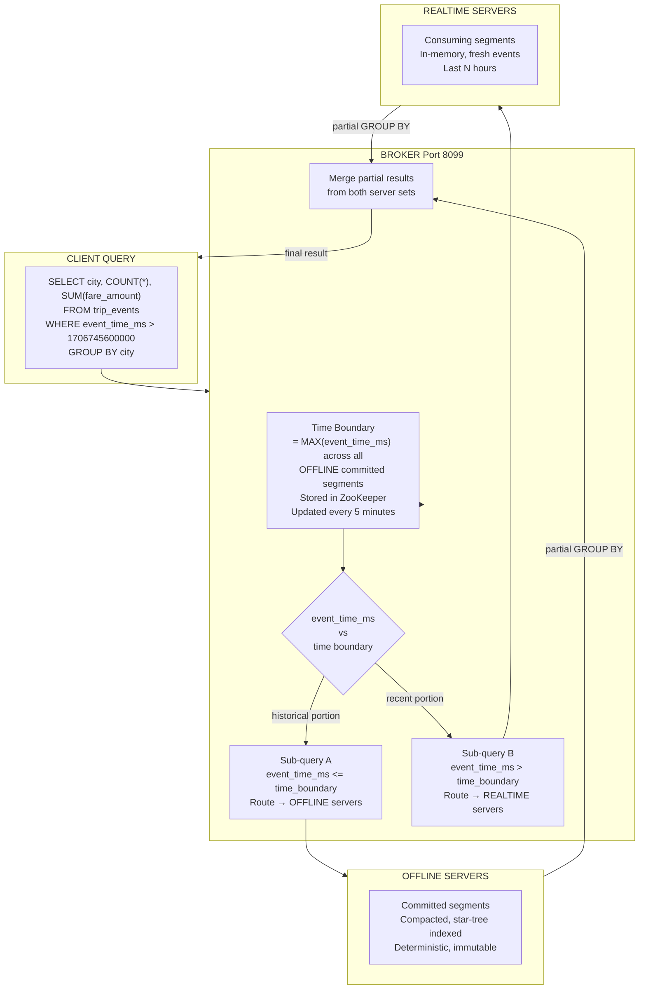

# Lab 9: Hybrid Tables and the Time Boundary

## Overview

The hybrid table pattern is the defining architectural choice that separates production-grade Pinot deployments from proof-of-concept ones. At LinkedIn, Uber and every large-scale Pinot installation, the same logical table name is served simultaneously by two physical storage layers: a REALTIME table that receives fresh events from Kafka into in-memory consuming segments and an OFFLINE table that holds fully compacted, deeply indexed segments built from historical data. The Apache Pinot Broker mediates between them through a mechanism called the time boundary. This is a single timestamp that divides the query universe into "recent" and "historical" without any coordination required at query time.

This lab makes the time boundary observable and measurable. You will create the offline counterpart to the `trip_events` table, load historical batch segments, call the Controller REST API to read the computed time boundary and run queries that let you watch the Broker route work to each physical table separately.

> [!NOTE]
> Lab 3 must be complete and the `trip_events_REALTIME` table must be active and consuming before you begin. Confirm that `SELECT COUNT(*) FROM trip_events` returns a non-zero result before proceeding.


## Learning Objectives

| Objective | Success Criterion |
|-----------|-------------------|
| Explain the hybrid table pattern | You can describe the REALTIME and OFFLINE physical layers and the logical table name that unifies them |
| Read the time boundary from the Controller API | The `GET /tables/trip_events/timeBoundary` response shows a valid epoch millisecond timestamp |
| Create an OFFLINE table that pairs with a REALTIME table | `trip_events_OFFLINE` appears in the Controller UI and shares the `trip_events` schema |
| Load historical batch segments | `GET /segments/trip_events_OFFLINE` returns the pushed segment names |
| Observe segment routing in query responses | You can record `numRealtimeSegmentsQueried` and `numOfflineSegmentsQueried` for queries spanning different time windows |
| Annotate an EXPLAIN PLAN for hybrid routing | You can identify which branch of the plan targets REALTIME segments and which targets OFFLINE segments |
| Explain the RealtimeToOffline Minion task | You can describe what the task does and show where its configuration lives in the table config |


## The Time Boundary Concept

The Broker does not scan event timestamps at query time to decide which physical table to consult. Instead, the Controller continuously computes the time boundary, which is the maximum `event_time_ms` value across all committed segments in the OFFLINE table and stores it in ZooKeeper. When the Broker receives a query, it reads the time boundary from its local ZooKeeper view and uses it to split the query into two sub-queries.



The time boundary prevents double-counting. Because the REALTIME table is append-only and the OFFLINE table is built from the same source data (Kafka), events in the overlap window would appear in both physical tables without the time boundary exclusion. The boundary guarantees that any given event timestamp is answered by exactly one physical table.

| Property | OFFLINE Table | REALTIME Table |
|----------|:------------:|:--------------:|
| Segment type | Immutable, fully committed | Consuming (mutable) and committed |
| Index depth | Star-tree, sorted column, all indexes | Inverted index, range index during consumption |
| Query latency for historical data | Lower — star-tree and sorted scans | Higher — no star-tree in consuming segments |
| Data freshness | Up to hours old | Sub-second |
| Covers time range | `event_time_ms <= time_boundary` | `event_time_ms > time_boundary` |


## The Hybrid Data Flow

The full system, including the Minion-automated conversion path, looks like this.

```mermaid
flowchart LR
    subgraph kafka["KAFKA  trip-events topic"]
        kp["Continuous event stream\nPartitions 0-3\ntrip_id key"]
    end

    subgraph realtime["REALTIME TABLE  trip_events_REALTIME"]
        direction TB
        cs["Consuming Segments\nIn-memory, mutable\nImmediately queryable"]
        co["Committed Segments\nImmutable on disk\nFully inverted-indexed"]
        cs -->|"flush threshold\n50 000 rows or 1h"| co
    end

    subgraph minion["PINOT MINION  RealtimeToOffline Task"]
        direction TB
        task["Scheduled by Controller\nRuns on configurable cadence\ne.g. every 24 hours"]
        convert["Reads REALTIME committed segments\nApplies compaction and dedup\nBuilds star-tree and sorted column\nProduces OFFLINE segment files"]
        push["Pushes converted segments\nto deep store and Controller"]
        task --> convert --> push
    end

    subgraph offline["OFFLINE TABLE  trip_events_OFFLINE"]
        direction TB
        os["Compacted Segments\nStar-tree indexed\nSorted by event_time_ms\nDeterministic — immutable"]
    end

    subgraph broker["BROKER"]
        tb["Time Boundary\n= MAX(offline segment time)\nReads from ZooKeeper\nRoutes queries accordingly"]
    end

    kp -->|"consume"| cs
    co -->|"read by Minion"| task
    push -->|"register segment"| os
    os -->|"update boundary"| tb

    style minion fill:#fef3c7,stroke:#d97706
    style offline fill:#dcfce7,stroke:#16a34a
    style realtime fill:#dbeafe,stroke:#2563eb
```



The two push paths, direct batch ingestion for the lab exercise and Minion-automated conversion for production, produce the same type of artifact: a committed OFFLINE segment. In production deployments the Minion path is preferred because it automates compaction, applies deduplication and builds star-tree indexes that cannot exist in the REALTIME table's consuming phase.


## Step 1: Verify the Realtime Table Is Active

Before creating the OFFLINE counterpart, confirm the REALTIME table is healthy and has data.

```bash
curl -s http://localhost:9000/health
```

Expected output:

```
OK
```

```bash
curl -s http://localhost:9000/tables/trip_events_REALTIME/state | python3 -m json.tool
```

Expected output (abbreviated):

```json
{
  "tableName": "trip_events_REALTIME",
  "state": "enabled"
}
```

```sql
SELECT COUNT(*) AS total_events, MIN(event_time_ms) AS earliest_ms, MAX(event_time_ms) AS latest_ms
FROM trip_events
```

Run this in the Query Console at **http://localhost:9000/#/query**. Record the values. You will compare them against the time boundary in Step 4.

| Metric | Your Value |
|--------|:----------:|
| `total_events` | |
| `earliest_ms` | |
| `latest_ms` | |

If `total_events` is zero, return to Lab 3 and re-run the data publishing steps before continuing.


## Step 2: Create the Offline Table Configuration

A hybrid table requires both `trip_events_REALTIME` and `trip_events_OFFLINE` to reference the same schema (`trip_events`) and use the same time column (`event_time_ms`). The Broker identifies that both physical tables belong to the same logical table by stripping the suffix from the table name.

Save the following configuration to `tables/trip_events_offline.table.json`.

```json
{
  "tableName": "trip_events",
  "tableType": "OFFLINE",
  "segmentsConfig": {
    "timeColumnName": "event_time_ms",
    "timeType": "MILLISECONDS",
    "schemaName": "trip_events",
    "replication": "1",
    "retentionTimeUnit": "DAYS",
    "retentionTimeValue": "90"
  },
  "tenants": {
    "broker": "DefaultTenant",
    "server": "DefaultTenant"
  },
  "tableIndexConfig": {
    "loadMode": "MMAP",
    "sortedColumn": [
      "event_time_ms"
    ],
    "invertedIndexColumns": [
      "city",
      "service_tier",
      "event_type",
      "status",
      "merchant_id"
    ],
    "rangeIndexColumns": [
      "fare_amount",
      "distance_km"
    ],
    "bloomFilterColumns": [
      "trip_id",
      "merchant_id",
      "driver_id"
    ],
    "starTreeIndexConfigs": [
      {
        "dimensionsSplitOrder": [
          "city",
          "service_tier",
          "status",
          "event_type"
        ],
        "functionColumnPairs": [
          "COUNT__*",
          "SUM__fare_amount",
          "SUM__distance_km",
          "AVG__fare_amount"
        ],
        "maxLeafRecords": 10000
      }
    ]
  },
  "quota": {
    "maxQueriesPerSecond": "200",
    "storage": "100G"
  },
  "routing": {
    "instanceSelectorType": "balanced"
  },
  "queryConfig": {
    "timeoutMs": 30000
  }
}
```

Notice what changes relative to the REALTIME configuration. The OFFLINE table adds a `sortedColumn` on `event_time_ms`. This is possible only for immutable offline segments because sorting requires a complete, static dataset. It adds a `starTreeIndexConfigs` section that pre-materializes the most common GROUP BY aggregations. These two additions together are the reason that historical queries against the OFFLINE table are faster than equivalent queries against the REALTIME table's committed segments.

Upload the table configuration to the Controller.

```bash
curl -s -X POST http://localhost:9000/tables \
  -H "Content-Type: application/json" \
  -d @tables/trip_events_offline.table.json \
  | python3 -m json.tool
```

Expected response:

```json
{
  "unrecognizedProperties": {},
  "status": "Table trip_events_OFFLINE successfully added"
}
```

Navigate to **http://localhost:9000/#/tables** and confirm that `trip_events_OFFLINE` now appears alongside `trip_events_REALTIME`. Both should be listed under the same logical group in the UI.


## Step 3: Load Historical Batch Segments

For this lab, the historical segments are built from the same `sample_trip_events.jsonl` data file used in Lab 3, but ingested through the batch path rather than the streaming path. In production, these segments would be produced by the RealtimeToOffline Minion task from older REALTIME committed segments.

Save the following job specification to `jobs/trip_events_historical.job.yml`.

```yaml
executionFrameworkSpec:
  name: standalone

jobType: SegmentCreationAndTarPush

inputDirURI: file:///workspace/data
includeFileNamePattern: glob:**/sample_trip_events.jsonl
outputDirURI: file:///workspace/.generated/segments/trip_events_offline
overwriteOutput: true

pinotFSSpecs:
  - scheme: file
    className: org.apache.pinot.spi.filesystem.LocalPinotFS

recordReaderSpec:
  dataFormat: json
  className: org.apache.pinot.plugin.inputformat.json.JSONRecordReader

schemaURI: file:///workspace/schemas/trip_events.schema.json
tableConfigURI: file:///workspace/tables/trip_events_offline.table.json

tableSpec:
  tableName: trip_events

segmentNameGeneratorSpec:
  type: normalizedDate
  configs:
    segment.name.postfix: historical

pinotClusterSpecs:
  - controllerURI: http://pinot-controller:9000

pushJobSpec:
  pushAttempts: 2
  pushParallelism: 1
  pushRetryIntervalMillis: 1000
```

Run the segment creation and push job inside the Pinot tools container.

```bash
docker exec pinot-controller /opt/pinot/bin/pinot-admin.sh LaunchDataIngestionJob \
  -jobSpecFile /workspace/jobs/trip_events_historical.job.yml
```

Expected terminal output (abbreviated):

```
Starting SegmentCreation job
Finished creating 1 segment(s) for table trip_events
Pushing segment trip_events_historical_0 to http://pinot-controller:9000
Successfully pushed segment trip_events_historical_0
```

Verify the segment is registered with the Controller.

```bash
curl -s http://localhost:9000/segments/trip_events_OFFLINE | python3 -m json.tool
```

Expected output:

```json
[
  {
    "OFFLINE": [
      "trip_events_historical_0"
    ]
  }
]
```


## Step 4: Read the Time Boundary from the Controller API

Within sixty seconds of the OFFLINE segment being registered, the Controller recomputes the time boundary. The time boundary is the maximum value of `event_time_ms` across all segments in the OFFLINE table. The Broker uses this value to route queries.

```bash
curl -s http://localhost:9000/tables/trip_events/timeBoundary | python3 -m json.tool
```

Expected response:

```json
{
  "timeColumn": "event_time_ms",
  "timeValue": 1706832000000
}
```

The `timeValue` is an epoch millisecond timestamp. Convert it to a human-readable date.

```bash
python3 -c "
import datetime
ts = 1706832000000
dt = datetime.datetime.utcfromtimestamp(ts / 1000)
print('Time boundary:', dt.strftime('%Y-%m-%d %H:%M:%S UTC'))
"
```

Expected output:

```
Time boundary: 2024-02-02 00:00:00 UTC
```

Record the time boundary value. Every query you run in the next steps that filters on `event_time_ms` will be split at this timestamp by the Broker.

| API Field | Your Value |
|-----------|:----------:|
| `timeColumn` | `event_time_ms` |
| `timeValue` (epoch ms) | |
| `timeValue` (human readable) | |

If the response body is empty or contains `"timeValue": null`, the OFFLINE table has no registered segments yet. Wait thirty seconds and retry.


## Step 5: Observe Segment Distribution Across Physical Tables

The Broker response for any query against the logical `trip_events` table contains two counters that reveal how many segments were consulted in each physical table: `numRealtimeSegmentsQueried` and `numOfflineSegmentsQueried`. These fields make the hybrid routing visible and measurable.

Open the Query Console at **http://localhost:9000/#/query** and run the following three queries. After each one, click Show Response Stats and record the segment counters.

**Query A — Pure historical predicate (targets OFFLINE only)**

The predicate reaches far into the past, well below the time boundary. The Broker should route the entire query to OFFLINE servers.

```sql
SELECT
  city,
  COUNT(*) AS trips,
  SUM(fare_amount) AS gmv
FROM trip_events
WHERE event_time_ms < 1706745600000
GROUP BY city
ORDER BY gmv DESC
```

**Query B — Pure recent predicate (targets REALTIME only)**

`NOW()` returns the current epoch millisecond time. Events from the last thirty seconds exist only in consuming segments and will never be present in the OFFLINE table.

```sql
SELECT
  city,
  COUNT(*) AS trips,
  SUM(fare_amount) AS gmv
FROM trip_events
WHERE event_time_ms > NOW() - 30 * 1000
GROUP BY city
ORDER BY gmv DESC
```

**Query C — Full time-span predicate (targets both tables)**

This predicate spans from the beginning of historical data to the present. The Broker splits the query at the time boundary and dispatches sub-queries to both physical tables.

```sql
SELECT
  city,
  COUNT(*) AS trips,
  SUM(fare_amount) AS gmv
FROM trip_events
GROUP BY city
ORDER BY gmv DESC
```

Record your observations in this measurement table.

| Query | Predicate Coverage | `numOfflineSegmentsQueried` | `numRealtimeSegmentsQueried` | `timeUsedMs` |
|-------|:------------------:|:---------------------------:|:----------------------------:|:------------:|
| A — historical only | Below time boundary | | | |
| B — recent only | Above time boundary | | | |
| C — full span | Crosses time boundary | | | |

For Query A, `numRealtimeSegmentsQueried` should be zero. The Broker determined that no REALTIME segment could contain data matching the predicate and skipped those servers entirely. For Query B, `numOfflineSegmentsQueried` should be zero for the same reason. For Query C, both counters should show non-zero values.


## Step 6: Run EXPLAIN PLAN on a Time-Spanning Query

The EXPLAIN PLAN output for a hybrid query reveals the two-branch structure that the Broker constructs internally.

```sql
EXPLAIN PLAN FOR
SELECT city, COUNT(*) AS trips, SUM(fare_amount) AS gmv
FROM trip_events
WHERE event_time_ms BETWEEN 1706700000000 AND 1706832060000
GROUP BY city
ORDER BY gmv DESC
```

Run this in the Query Console. The output will resemble the following structure.

```
BROKER_REDUCE(limit:10)
├── COMBINE_GROUP_BY_ORDERBY(limit:10)
│   ├── PLAN_FRAGMENT for trip_events_OFFLINE
│   │   ├── FILTER: (event_time_ms <= 1706832000000) AND (event_time_ms BETWEEN 1706700000000 AND 1706832060000)
│   │   ├── INDEX: RangeIndex on event_time_ms
│   │   ├── INDEX: SortedIndex on event_time_ms
│   │   └── GROUP_BY(city) AGG(COUNT(*), SUM(fare_amount))
│   └── PLAN_FRAGMENT for trip_events_REALTIME
│       ├── FILTER: (event_time_ms > 1706832000000) AND (event_time_ms BETWEEN 1706700000000 AND 1706832060000)
│       ├── INDEX: RangeIndex on event_time_ms
│       └── GROUP_BY(city) AGG(COUNT(*), SUM(fare_amount))
```

Annotate the plan output as follows.

The OFFLINE fragment adds an implicit predicate `event_time_ms <= 1706832000000` where `1706832000000` is the time boundary value. This predicate appears even though the original query did not include it. The Broker injected it during routing. The sorted column on `event_time_ms` means the Server can seek directly to the relevant row range without a full segment scan.

The REALTIME fragment adds an implicit predicate `event_time_ms > 1706832000000`. Events in the consuming segment fall above the boundary and are handled exclusively here.

The `BROKER_REDUCE` node at the top of the plan merges the two partial GROUP BY results by combining the COUNT values with addition and the SUM values with addition, then re-sorting and limiting the merged result.


## The RealtimeToOffline Minion Task

In production, you do not push batch segments manually. The Pinot Minion runs a scheduled task called `RealtimeToOfflineSegmentsTask` that reads committed REALTIME segments, compacts them, builds the full offline index set (including star-tree) and pushes the resulting OFFLINE segments to the Controller. The REALTIME committed segments that have been successfully converted are then subject to the OFFLINE table's retention policy.

Add the following `task` block to the OFFLINE table configuration to enable the Minion task.

```json
"task": {
  "taskTypeConfigsMap": {
    "RealtimeToOfflineSegmentsTask": {
      "schedule": "0 0 * * * ?",
      "bucketTimePeriod": "1d",
      "bufferTimePeriod": "2d",
      "roundBucketTimePeriod": "1d",
      "mergeType": "dedup",
      "maxNumRecordsPerSegment": "5000000"
    }
  }
}
```

| Configuration Key | Value | Meaning |
|-------------------|-------|---------|
| `schedule` | `0 0 * * * ?` | Cron expression — runs at the top of every hour |
| `bucketTimePeriod` | `1d` | Processes one day of REALTIME data per task run |
| `bufferTimePeriod` | `2d` | Does not process REALTIME segments newer than 2 days — ensures they are fully committed before conversion |
| `roundBucketTimePeriod` | `1d` | Aligns segment boundaries to day boundaries for predictable file sizes |
| `mergeType` | `dedup` | Deduplicates rows with the same primary key during compaction |
| `maxNumRecordsPerSegment` | `5000000` | Splits output into multiple segments if the source exceeds this row count |

Update the OFFLINE table configuration via the REST API.

```bash
curl -s -X PUT http://localhost:9000/tables/trip_events_OFFLINE \
  -H "Content-Type: application/json" \
  -d @tables/trip_events_offline.table.json \
  | python3 -m json.tool
```

Expected response:

```json
{
  "status": "Table config updated for trip_events_OFFLINE"
}
```

Verify that the Controller has registered the task type.

```bash
curl -s http://localhost:9000/tasks/taskTypes | python3 -m json.tool
```

You should see `RealtimeToOfflineSegmentsTask` in the returned list. Trigger the task manually to verify connectivity between the Controller and Minion.

```bash
curl -s -X POST \
  "http://localhost:9000/tasks/schedule?taskType=RealtimeToOfflineSegmentsTask&tableName=trip_events_OFFLINE" \
  | python3 -m json.tool
```

Expected response:

```json
{
  "RealtimeToOfflineSegmentsTask": "Task_RealtimeToOfflineSegmentsTask_trip_events_OFFLINE_1706832060000"
}
```

Monitor task completion.

```bash
curl -s "http://localhost:9000/tasks/task/Task_RealtimeToOfflineSegmentsTask_trip_events_OFFLINE_1706832060000/state" \
  | python3 -m json.tool
```

The `taskState` field will progress from `IN_PROGRESS` to `COMPLETED`. A completed task means new OFFLINE segments have been pushed and the time boundary will advance on the next Controller computation cycle.


## Key Concepts Reference

| Concept | Definition | Where to Observe It |
|---------|------------|---------------------|
| Time boundary | The maximum `event_time_ms` value across all OFFLINE committed segments; divides query routing between physical tables | `GET /tables/trip_events/timeBoundary` |
| Ideal State | The desired assignment of segments to server instances, as computed by the Controller and stored in ZooKeeper | `GET /tables/trip_events_OFFLINE/idealState` |
| External View | The actual observed assignment of segments to servers, as reported by the servers and stored in ZooKeeper | `GET /tables/trip_events_OFFLINE/externalView` |
| Segment handoff | The moment a REALTIME committed segment has a corresponding OFFLINE segment and the time boundary advances past it | Visible as time boundary change in Controller API |
| Consuming segment | The in-memory, mutable buffer for incoming Kafka records; immediately queryable but not star-tree indexed | Controller UI → trip_events_REALTIME → Segments tab |
| Compacted segment | An OFFLINE segment produced from one or more REALTIME segments by the Minion task; fully indexed and immutable | Controller UI → trip_events_OFFLINE → Segments tab |

Ideal State and External View should converge within seconds of a segment push. A persistent divergence between the two is a diagnostic signal that a server is unavailable or has failed to load the segment.

```bash
curl -s http://localhost:9000/tables/trip_events_OFFLINE/idealState | python3 -m json.tool
curl -s http://localhost:9000/tables/trip_events_OFFLINE/externalView | python3 -m json.tool
```

Compare the segment-to-server mappings in both responses. When Ideal State shows a segment as `ONLINE` but External View shows it as `OFFLINE`, the server has acknowledged receipt but failed the index load. Check the server log for the segment load error.

```bash
docker logs pinot-server --tail=100 | grep -i "trip_events_historical_0"
```


## Measurement Summary

Before completing this lab, fill in the following measurement table. These values serve as your baseline for performance comparisons in subsequent labs.

| Measurement | Your Value | Notes |
|-------------|:----------:|-------|
| `timeValue` from time boundary API | | Epoch milliseconds |
| `numOfflineSegmentsQueried` for Query A | | Should be non-zero |
| `numRealtimeSegmentsQueried` for Query A | | Should be zero |
| `numOfflineSegmentsQueried` for Query B | | Should be zero |
| `numRealtimeSegmentsQueried` for Query B | | Should be non-zero |
| `numOfflineSegmentsQueried` for Query C | | Should be non-zero |
| `numRealtimeSegmentsQueried` for Query C | | Should be non-zero |
| `timeUsedMs` for Query A | | Historical query — OFFLINE only |
| `timeUsedMs` for Query C | | Hybrid query — both tables |


## Reflection Prompts

1. The time boundary is computed as the maximum `event_time_ms` across all OFFLINE segments. If you push an OFFLINE segment that covers a time range of two hours but there is a four-hour gap between the end of that segment and the current time, what does the Broker do with queries that target the four-hour gap? Where do those events live and does the Broker have a mechanism to detect and fill the gap?

2. The OFFLINE table in this lab uses a star-tree index with `SUM__fare_amount` pre-materialized. The REALTIME table has no star-tree. Write a query that would benefit significantly from the star-tree when running against OFFLINE segments but must fall back to a full row scan when running against REALTIME segments. Explain why the REALTIME consuming segment cannot have a star-tree index.

3. The `bufferTimePeriod` configuration for the RealtimeToOffline task is set to two days. A new event arrives in Kafka at 23:58 on Monday. The Minion task runs at midnight on Tuesday. Is this event included in the Monday OFFLINE segment built by that midnight task run? Explain your reasoning using the buffer period definition.

4. In a multi-server Pinot cluster with three OFFLINE server instances and two REALTIME server instances, the Broker dispatches a hybrid query. If one OFFLINE server becomes unavailable mid-query, the response will contain data from only some OFFLINE segments. Describe how the BrokerResponse communicates this partial failure and how you would detect it programmatically from the API response JSON.


[Previous: Lab 8 — SLO and Incident Drill](lab-08-slo-incident.md) | [Next: Lab 10 — Schema Evolution Without Downtime](lab-10-schema-evolution.md)
