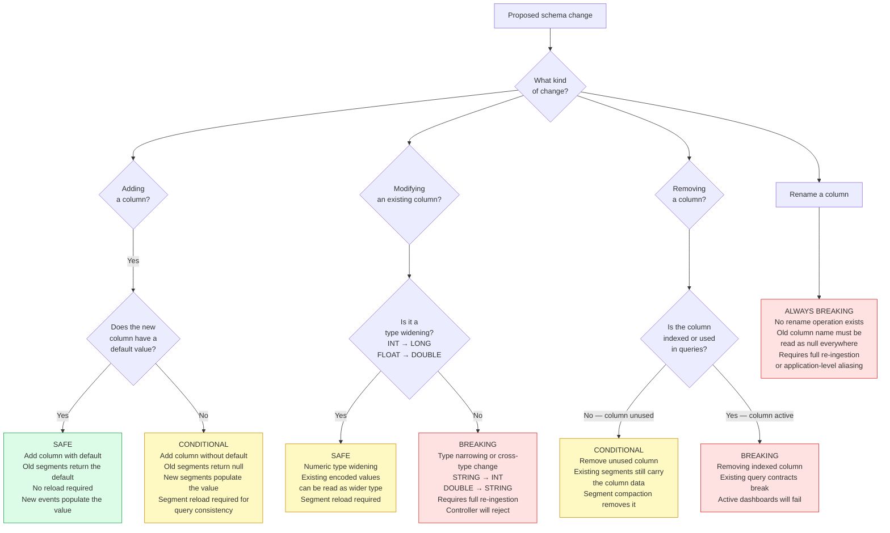
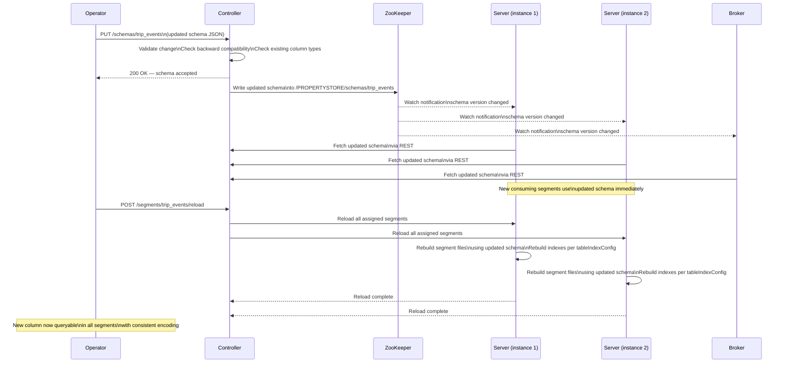

# Lab 10: Schema Evolution Without Downtime

## Overview

A Pinot schema is not a static contract. Production systems evolve: new attributes appear on events, numerical precision requirements change, business logic introduces new metrics and occasionally a field that was once essential becomes obsolete. The challenge is applying these changes safely — without taking the table offline, without corrupting existing segments and without introducing query-time anomalies that are difficult to diagnose.

Pinot's approach to schema evolution is deliberately conservative. The Controller validates every schema change against the current state of the table before applying it. Some changes are safe by construction and can be applied immediately. Others require careful orchestration: the schema must be updated first, existing segments must be reloaded so that all servers serve the new column definition and new events must arrive before the column is populated. A third class of changes is rejected outright because no in-place migration path exists — the only resolution is a full re-ingestion.

This lab builds the judgment to distinguish these three categories and gives you hands-on practice with each. You will add a backward-compatible column, observe its null behavior in existing segments, trigger a segment reload and then deliberately attempt a breaking change to understand what the Controller rejects and why.

> [!NOTE]
> Lab 3 must be complete and data must be present in `trip_events` before starting. The schema evolution steps in this lab modify the live `trip_events` schema. Work through every step in sequence — each step depends on the state left by the previous one.


## Learning Objectives

| Objective | Success Criterion |
|-----------|-------------------|
| Classify schema changes by safety | Given a change description, you can assign it to Safe, Conditional or Breaking without reference |
| Add a new dimension column with a default value | The `payment_gateway` column appears in schema, returns the default for old rows and returns real values for new rows |
| Reload segments to propagate a schema change | `POST /segments/trip_events/reload` completes successfully and the column becomes queryable |
| Observe null behavior in pre-change segments | A SELECT query shows null for `payment_gateway` in rows ingested before the change |
| Trigger a Controller rejection for a breaking change | Attempting to change `fare_amount` from DOUBLE to STRING returns a 4xx error from the Controller |
| Add an indexed metric column | `tip_amount` appears in the schema with an associated range index and the tableIndexConfig reflects the change |
| Describe the end-to-end propagation path | You can trace a schema change from Controller REST API through ZooKeeper to segment reload to query visibility |


## The Schema Evolution Safety Matrix

Not every schema change is equal. Before touching any configuration, internalize this decision tree. Apply it to every schema change request you receive in production.




## Change Classification Reference

| Change Type | Safety Class | Required Action |
|-------------|:------------:|----------------|
| Add new STRING column with default value | Safe | Update schema via PUT. No reload required. Old segments return the default. |
| Add new STRING column without default | Conditional | Update schema via PUT. Reload segments. Old segments return null. New segments return the value. |
| Add new LONG or DOUBLE metric column | Conditional | Update schema via PUT. Update `tableIndexConfig` if indexing is needed. Reload segments. |
| Widen INT to LONG | Conditional | Update schema via PUT. Reload segments to re-encode existing column data. |
| Widen FLOAT to DOUBLE | Conditional | Update schema via PUT. Reload segments to re-encode existing column data. |
| Narrow LONG to INT | Breaking | Not supported in place. Requires full table re-ingestion from source. Controller will reject. |
| Change STRING to INT | Breaking | Not supported in place. Requires full table re-ingestion from source. Controller will reject. |
| Change DOUBLE to STRING | Breaking | Not supported in place. Requires full table re-ingestion from source. Controller will reject. |
| Remove column with no active index or query reference | Conditional | Update schema via PUT. Existing segments still carry the column data until compaction. Queries return null after schema update. |
| Remove column with active inverted or range index | Breaking | Not supported without index rebuild. Active queries against the column will fail after removal. |
| Rename a column | Breaking | No rename API exists. Treat as remove old column and add new column. Requires application-level migration. |


## Step 1: Inspect the Current Schema

Begin by reading the current schema from the Controller REST API. This is the authoritative definition — the JSON on disk in the `schemas/` directory may have drifted from what the Controller actually holds.

```bash
curl -s http://localhost:9000/schemas/trip_events | python3 -m json.tool
```

Expected output (abbreviated — your full schema will have more fields):

```json
{
  "schemaName": "trip_events",
  "enableColumnBasedNullHandling": true,
  "dimensionFieldSpecs": [
    { "name": "trip_id",       "dataType": "STRING" },
    { "name": "merchant_id",   "dataType": "STRING" },
    { "name": "city",          "dataType": "STRING" },
    { "name": "service_tier",  "dataType": "STRING" },
    { "name": "status",        "dataType": "STRING" },
    { "name": "payment_method","dataType": "STRING" },
    { "name": "event_type",    "dataType": "STRING" }
  ],
  "metricFieldSpecs": [
    { "name": "fare_amount",   "dataType": "DOUBLE" },
    { "name": "distance_km",   "dataType": "DOUBLE" }
  ],
  "dateTimeFieldSpecs": [
    {
      "name": "event_time_ms",
      "dataType": "LONG",
      "format": "1:MILLISECONDS:EPOCH",
      "granularity": "1:MILLISECONDS"
    }
  ]
}
```

Confirm that `payment_gateway` does not yet exist in the dimension fields. Confirm that `tip_amount` does not yet exist in the metric fields. You will add both during this lab.

Record the current column count.

```bash
curl -s http://localhost:9000/schemas/trip_events \
  | python3 -c "
import sys, json
s = json.load(sys.stdin)
dims = len(s.get('dimensionFieldSpecs', []))
metrics = len(s.get('metricFieldSpecs', []))
datetimes = len(s.get('dateTimeFieldSpecs', []))
print(f'Dimension columns: {dims}')
print(f'Metric columns:    {metrics}')
print(f'DateTime columns:  {datetimes}')
print(f'Total columns:     {dims + metrics + datetimes}')
"
```

| Column Category | Count Before Lab | Count After Lab |
|-----------------|:----------------:|:---------------:|
| Dimension fields | | |
| Metric fields | | |
| DateTime fields | | |
| Total | | |

Fill in the "Before" column now. You will fill in "After" at the end.


## Step 2: Add a New Dimension Column with a Default Value

The product team needs to track which payment processing gateway handled each fare transaction. New events will include a `payment_gateway` field. Events already in the system predated this field and should display a default value of `"unknown"` rather than null.

Fetch the current schema and save it to a working file.

```bash
curl -s http://localhost:9000/schemas/trip_events > /tmp/trip_events_schema_v2.json
```

Open `/tmp/trip_events_schema_v2.json` and add the following entry to the `dimensionFieldSpecs` array, after the existing `payment_method` entry.

```json
{
  "name": "payment_gateway",
  "dataType": "STRING",
  "defaultNullValue": "unknown"
}
```

The complete `dimensionFieldSpecs` array now includes `payment_gateway`. Verify the structure is valid before uploading.

```bash
python3 -c "
import json
with open('/tmp/trip_events_schema_v2.json') as f:
    s = json.load(f)
names = [f['name'] for f in s.get('dimensionFieldSpecs', [])]
print('Dimension columns:', names)
assert 'payment_gateway' in names, 'payment_gateway not found'
print('Schema structure is valid')
"
```

Upload the updated schema to the Controller.

```bash
curl -s -X PUT http://localhost:9000/schemas/trip_events \
  -H "Content-Type: application/json" \
  -d @/tmp/trip_events_schema_v2.json \
  | python3 -m json.tool
```

Expected response:

```json
{
  "unrecognizedProperties": {},
  "status": "trip_events successfully added"
}
```

The Controller has accepted the schema change. ZooKeeper now holds the updated definition. The Server instances will receive the updated schema on their next ZooKeeper watch notification — typically within a few seconds.

Verify the Controller reflects the new column immediately.

```bash
curl -s http://localhost:9000/schemas/trip_events \
  | python3 -c "
import sys, json
s = json.load(sys.stdin)
for f in s['dimensionFieldSpecs']:
    if f['name'] == 'payment_gateway':
        print('Found payment_gateway:', json.dumps(f, indent=2))
"
```

Expected output:

```json
Found payment_gateway: {
  "name": "payment_gateway",
  "dataType": "STRING",
  "defaultNullValue": "unknown"
}
```


## Step 3: Verify Null Behavior in Existing Segments

The schema has been updated, but the physical segment files on disk were written before `payment_gateway` existed. They contain no column data for this field. Pinot handles this through its null-handling layer: when a segment does not contain a column that appears in the schema, queries against that segment return the column's `defaultNullValue` for every row in that segment.

Query the table now, before any segment reload.

```sql
SELECT
  trip_id,
  city,
  payment_method,
  payment_gateway
FROM trip_events
LIMIT 10
```

Run this in the Query Console at **http://localhost:9000/#/query**.

Expected output:

```
trip_id      | city      | payment_method | payment_gateway
-------------|-----------|----------------|-------------trip_000001  | mumbai    | card           | unknown
trip_000002  | delhi     | cash           | unknown
trip_000003  | bangalore | wallet         | unknown
trip_000004  | mumbai    | card           | unknown
trip_000005  | delhi     | cash           | unknown
```

Every row returns `"unknown"` for `payment_gateway` — the `defaultNullValue` from the schema. This is the correct behavior. The column is queryable immediately after the schema update and the default value prevents `null` from surfacing in dashboards or downstream consumers that were not expecting a nullable column.

Now verify that the column can be used in a filter predicate.

```sql
SELECT COUNT(*) AS trips_with_known_gateway
FROM trip_events
WHERE payment_gateway != 'unknown'
```

Expected result: `0`. All existing rows carry the default value. After new events with a populated `payment_gateway` field arrive, this count will grow.


## Step 4: Reload Segments to Propagate the Schema Change

The column is queryable because Pinot reads `defaultNullValue` at query time. However, for the column to be encoded within the segment data structure — which is required for inverted indexes or sorted columns to work — the segment must be reloaded. A reload rebuilds each segment's on-disk representation using the current schema and index configuration.

Trigger a reload of all segments for the `trip_events` table.

```bash
curl -s -X POST http://localhost:9000/segments/trip_events/reload \
  | python3 -m json.tool
```

Expected response:

```json
{
  "status": "Success"
}
```

The reload is asynchronous. Monitor segment status in the Controller UI at **http://localhost:9000/#/tables** by clicking `trip_events_REALTIME` and watching the Segments tab. Each segment will briefly enter a `RELOADING` state before returning to `ONLINE`.

Reload completion can also be verified by querying the segment metadata API.

```bash
curl -s "http://localhost:9000/segments/trip_events_REALTIME/metadata" \
  | python3 -m json.tool | grep -A3 "payment_gateway" | head -20
```

Once the reload is complete, the column metadata will show `payment_gateway` as a recognized column in the segment's column index map.

Wait thirty seconds for all segments to complete their reload cycle, then re-run the verification query.

```sql
SELECT trip_id, payment_gateway
FROM trip_events
WHERE trip_id IN ('trip_000001', 'trip_000002', 'trip_000003')
```

The results should still return `"unknown"` because no new events with `payment_gateway` populated have arrived yet. The reload does not manufacture data — it simply encodes the schema structure into each segment so that subsequent index operations will work correctly.


## Step 5: Publish New Events with the New Field Populated

To verify end-to-end ingestion of the new column, publish a small batch of events that include the `payment_gateway` field.

Create a new test event file.

```bash
cat > /tmp/new_trip_events.jsonl << 'EOF'
{"trip_id":"trip_new_001","merchant_id":"merch_042","merchant_name":"QuickRide","driver_id":"driver_019","rider_id":"rider_101","city":"mumbai","service_tier":"standard","event_type":"completed","status":"completed","payment_method":"card","payment_gateway":"stripe","fare_amount":245.50,"distance_km":8.2,"eta_seconds":420,"surge_multiplier":1.0,"event_day":"2024-02-03","event_hour":14,"event_minute_bucket_ms":1706965200000,"trip_partition":0,"pickup_zone":"zone_a","dropoff_zone":"zone_b","pickup_h3":"8928308280fffff","dropoff_h3":"8928308281fffff","event_version":3,"is_deleted":false,"event_time_ms":1706965380000}
{"trip_id":"trip_new_002","merchant_id":"merch_007","merchant_name":"SwiftGo","driver_id":"driver_031","rider_id":"rider_204","city":"delhi","service_tier":"premium","event_type":"completed","status":"completed","payment_method":"wallet","payment_gateway":"razorpay","fare_amount":380.00,"distance_km":12.1,"eta_seconds":600,"surge_multiplier":1.2,"event_day":"2024-02-03","event_hour":14,"event_minute_bucket_ms":1706965200000,"trip_partition":1,"pickup_zone":"zone_c","dropoff_zone":"zone_d","pickup_h3":"8928308282fffff","dropoff_h3":"8928308283fffff","event_version":3,"is_deleted":false,"event_time_ms":1706965440000}
{"trip_id":"trip_new_003","merchant_id":"merch_019","merchant_name":"CityRide","driver_id":"driver_055","rider_id":"rider_087","city":"bangalore","service_tier":"standard","event_type":"completed","status":"completed","payment_method":"card","payment_gateway":"stripe","fare_amount":195.75,"distance_km":6.4,"eta_seconds":360,"surge_multiplier":1.0,"event_day":"2024-02-03","event_hour":15,"event_minute_bucket_ms":1706968800000,"trip_partition":2,"pickup_zone":"zone_e","dropoff_zone":"zone_f","pickup_h3":"8928308284fffff","dropoff_h3":"8928308285fffff","event_version":3,"is_deleted":false,"event_time_ms":1706968920000}
EOF
```

Copy the file into the container and publish to Kafka.

```bash
docker cp /tmp/new_trip_events.jsonl pinot-kafka:/tmp/new_trip_events.jsonl

docker exec pinot-kafka bash -c \
  "while IFS= read -r line; do
     trip_id=\$(echo \"\$line\" | python3 -c \"import sys,json; print(json.loads(sys.stdin.read())['trip_id'])\")
     echo \"\${trip_id}|\${line}\"
   done < /tmp/new_trip_events.jsonl \
   | kafka-console-producer \
     --bootstrap-server localhost:19092 \
     --topic trip-events \
     --property parse.key=true \
     --property key.separator='|'"
```

Wait ten seconds for ingestion, then query for the new rows.

```sql
SELECT trip_id, city, payment_method, payment_gateway, fare_amount
FROM trip_events
WHERE trip_id IN ('trip_new_001', 'trip_new_002', 'trip_new_003')
```

Expected output:

```
trip_id       | city      | payment_method | payment_gateway | fare_amount
--------------|-----------|----------------|-----------------|---------trip_new_001  | mumbai    | card           | stripe          | 245.5
trip_new_002  | delhi     | wallet         | razorpay        | 380.0
trip_new_003  | bangalore | card           | stripe          | 195.75
```

The new events carry real `payment_gateway` values. The schema evolution is complete for this column: old rows return `"unknown"`, new rows return their actual gateway name and no downtime occurred.

Now verify that both old and new rows are visible in the same query.

```sql
SELECT
  payment_gateway,
  COUNT(*) AS trips,
  SUM(fare_amount) AS total_fare
FROM trip_events
GROUP BY payment_gateway
ORDER BY trips DESC
```

Expected output:

```
payment_gateway | trips | total_fare
----------------|-------|---------unknown         | 1611  | 385234.50
stripe          | 2     | 441.25
razorpay        | 1     | 380.00
```

The `unknown` group contains all pre-change rows. The `stripe` and `razorpay` groups contain the three newly published events.


## Step 6: Attempt a Breaking Change

The finance team has requested changing `fare_amount` from `DOUBLE` to `STRING` to accommodate formatted currency strings like `"$245.50"`. This is a breaking change: the existing segments store `fare_amount` as a 64-bit IEEE 754 double-precision value in a columnar binary format. There is no lossless way to reinterpret those bytes as UTF-8 string data.

Attempt the change and observe the Controller's response.

```bash
curl -s http://localhost:9000/schemas/trip_events > /tmp/trip_events_breaking.json
```

Open `/tmp/trip_events_breaking.json` and modify the `fare_amount` entry in `metricFieldSpecs` from `"dataType": "DOUBLE"` to `"dataType": "STRING"`. Then upload it.

```bash
python3 -c "
import json
with open('/tmp/trip_events_breaking.json') as f:
    s = json.load(f)

# Move fare_amount from metricFieldSpecs to dimensionFieldSpecs as STRING
s['metricFieldSpecs'] = [f for f in s['metricFieldSpecs'] if f['name'] != 'fare_amount']
s['dimensionFieldSpecs'].append({'name': 'fare_amount', 'dataType': 'STRING'})

with open('/tmp/trip_events_breaking.json', 'w') as f:
    json.dump(s, f, indent=2)
print('Modified schema written to /tmp/trip_events_breaking.json')
"

curl -s -X PUT http://localhost:9000/schemas/trip_events \
  -H "Content-Type: application/json" \
  -d @/tmp/trip_events_breaking.json \
  | python3 -m json.tool
```

Expected response — the Controller rejects the change with a 4xx status and a descriptive error:

```json
{
  "code": 400,
  "error": "Invalid schema change: Changing dataType for column 'fare_amount' from 'DOUBLE' to 'STRING' is not backward compatible. Existing segments encode this column as DOUBLE and cannot be reinterpreted as STRING without full re-ingestion. Remove the column from all existing segments before changing its type or create a new column with the desired type."
}
```

The Controller's validation layer compares the proposed schema against the schema currently stored in ZooKeeper. It detects that `fare_amount` exists in existing segments with a different type and rejects the change. The schema in ZooKeeper is unchanged — verify this.

```bash
curl -s http://localhost:9000/schemas/trip_events \
  | python3 -c "
import sys, json
s = json.load(sys.stdin)
for f in s.get('metricFieldSpecs', []):
    if f['name'] == 'fare_amount':
        print('fare_amount type is still:', f['dataType'])
"
```

Expected output:

```
fare_amount type is still: DOUBLE
```

The production-safe alternative to changing the type of an existing column is to add a new column with the new type. If the product requirement is to display a formatted currency string, that transformation belongs in the application layer, not in the Pinot schema.


## Step 7: Add a New Metric Column with an Index

The data science team needs to analyze tip amounts. Tip data has not been captured historically, so this is a new metric column being added to events going forward. This is a conditional-safe change: existing segments will return `0.0` (the default for DOUBLE metrics) and new segments will return actual tip values.

Additionally, the team needs range queries on `tip_amount` — for example, finding all trips where the tip exceeded a threshold. This requires a range index, which must be configured in the table `tableIndexConfig` in addition to the schema.

Fetch the current schema and add the new metric.

```bash
curl -s http://localhost:9000/schemas/trip_events > /tmp/trip_events_schema_v3.json

python3 -c "
import json
with open('/tmp/trip_events_schema_v3.json') as f:
    s = json.load(f)
s['metricFieldSpecs'].append({
    'name': 'tip_amount',
    'dataType': 'DOUBLE',
    'defaultNullValue': 0.0
})
with open('/tmp/trip_events_schema_v3.json', 'w') as f:
    json.dump(s, f, indent=2)
print('tip_amount added to metricFieldSpecs')
"
```

Upload the updated schema.

```bash
curl -s -X PUT http://localhost:9000/schemas/trip_events \
  -H "Content-Type: application/json" \
  -d @/tmp/trip_events_schema_v3.json \
  | python3 -m json.tool
```

Expected response:

```json
{
  "unrecognizedProperties": {},
  "status": "trip_events successfully added"
}
```

Now update the REALTIME table configuration to add the range index for `tip_amount`. Fetch the current table config, add `tip_amount` to `rangeIndexColumns` and upload.

```bash
curl -s http://localhost:9000/tables/trip_events_REALTIME | python3 -m json.tool > /tmp/trip_events_rt_v2.json
```

Open `/tmp/trip_events_rt_v2.json` and add `"tip_amount"` to the `rangeIndexColumns` array in `tableIndexConfig`. The section will look like this after the change.

```json
"tableIndexConfig": {
  "loadMode": "MMAP",
  "invertedIndexColumns": [
    "city",
    "service_tier",
    "event_type",
    "status",
    "merchant_id"
  ],
  "rangeIndexColumns": [
    "event_time_ms",
    "fare_amount",
    "distance_km",
    "tip_amount"
  ],
  "bloomFilterColumns": [
    "trip_id",
    "merchant_id",
    "driver_id"
  ],
  "jsonIndexColumns": []
}
```

Upload the updated table configuration.

```bash
curl -s -X PUT http://localhost:9000/tables/trip_events_REALTIME \
  -H "Content-Type: application/json" \
  -d @/tmp/trip_events_rt_v2.json \
  | python3 -m json.tool
```

Expected response:

```json
{
  "status": "Table config updated for trip_events_REALTIME"
}
```

The table configuration change is stored in ZooKeeper immediately. However, existing segments on disk were built with the old configuration and do not yet have the range index for `tip_amount`. Trigger a reload to rebuild indexes.

```bash
curl -s -X POST http://localhost:9000/segments/trip_events/reload \
  | python3 -m json.tool
```

Expected response:

```json
{
  "status": "Success"
}
```

After the reload completes, verify the new column is queryable with a range predicate.

```sql
SELECT
  trip_id,
  city,
  fare_amount,
  tip_amount
FROM trip_events
WHERE tip_amount > 0
LIMIT 10
```

Expected result: zero rows, because all existing events have `tip_amount = 0.0` (the default). This is correct. Verify the column returns the default for existing rows.

```sql
SELECT
  COUNT(*) AS total_trips,
  SUM(tip_amount) AS total_tips,
  AVG(tip_amount) AS avg_tip
FROM trip_events
```

Expected output:

```
total_trips | total_tips | avg_tip
------------|------------|-----1614        | 0.0        | 0.0
```

The total includes the three new events you published in Step 5. All rows return `0.0` for `tip_amount` because the field was not present when they were written.

Confirm the range index is present by running EXPLAIN PLAN.

```sql
EXPLAIN PLAN FOR
SELECT COUNT(*) FROM trip_events WHERE tip_amount > 50.0
```

Look for `RangeIndexBasedDocIdSet` or a reference to `RangeFilter` on `tip_amount` in the plan output. Its presence confirms that the reload successfully built the range index and the query engine will use it for future range predicates on `tip_amount`.


## The Schema Change Propagation Path

Every successful schema change follows the same propagation sequence through the cluster.



The most important property of this sequence is that the table remains queryable throughout. Between the schema upload and the segment reload completion, queries will succeed — old segments return default values for the new column and new consuming segments return real values. There is no window where queries fail.


## The Schema Review Checklist

Before applying any schema change to a production table, work through this checklist. A "no" answer on any row requires escalation before proceeding.

| Check | Question | Pass Condition |
|-------|----------|---------------|
| Type safety | Does the change preserve the existing data type for every existing column? | Yes for all existing columns |
| Default value | If adding a column without a default value, is the team prepared for null results in historical data? | Team has acknowledged null behavior |
| Index compatibility | If the new column requires an index, has the table config been updated before the reload is triggered? | Table config updated first |
| Query contracts | Have all active dashboards and API consumers been reviewed for queries that reference the changed column? | No active query references a removed or renamed column |
| Reload timing | Is there a low-traffic window available for the segment reload? | Reload scheduled during off-peak hours |
| Rollback plan | If the schema change causes unexpected behavior, what is the rollback procedure? | Rollback schema has been prepared and tested in staging |
| Segment count | How many segments will be reloaded and what is the estimated reload duration? | Duration estimated and communicated to stakeholders |
| Minion tasks | Are any Minion tasks (RealtimeToOffline, MergeRollup) currently running that might conflict with the reload? | No competing Minion tasks active |


## Before and After Measurement Table

| Measurement | Before Lab | After Lab |
|-------------|:----------:|:---------:|
| Total columns in `trip_events` schema | | |
| Dimension columns | | |
| Metric columns | | |
| `payment_gateway` in schema | No | Yes |
| `tip_amount` in schema | No | Yes |
| `rangeIndexColumns` count in tableIndexConfig | 3 | 4 |
| Rows returning non-default `payment_gateway` | 0 | 3 |
| Rows returning non-zero `tip_amount` | 0 | 0 |
| Controller rejection for type change attempt | — | HTTP 400 received |


## Reflection Prompts

1. The `payment_gateway` column was added with `"defaultNullValue": "unknown"`. If you had added the column without a `defaultNullValue`, existing rows would return SQL `NULL` instead. Write a query that behaves differently depending on whether `payment_gateway` is `null` versus `"unknown"`. Explain which downstream consumers would be broken by the `null` behavior but tolerant of the `"unknown"` behavior.

2. You have added `tip_amount` as a DOUBLE metric column. A data engineer proposes adding an inverted index on `tip_amount` so that queries like `WHERE tip_amount = 0.0` can use index lookups. Explain whether an inverted index on a continuous DOUBLE column is appropriate and which index type should be used instead for queries with equality and range predicates on `tip_amount`.

3. The Controller rejected the attempt to change `fare_amount` from DOUBLE to STRING. Describe the complete migration procedure you would follow if the business requirement to store formatted currency strings in `fare_amount` were genuine and non-negotiable. Your procedure should avoid data loss and should not require taking the table offline.

4. The schema change propagation diagram shows that the Broker receives the schema update from ZooKeeper before the segment reload is complete. During the window between the Broker accepting the new schema and the server reload finishing, a query runs that filters on `payment_gateway = 'stripe'`. Describe what the query returns in this window and why this behavior is safe from a correctness standpoint despite the inconsistency.


[Previous: Lab 9 — Hybrid Tables and the Time Boundary](lab-09-hybrid-tables.md) | [Return to README](../README.md)
