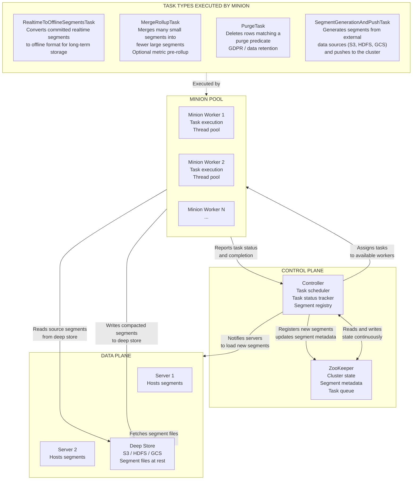
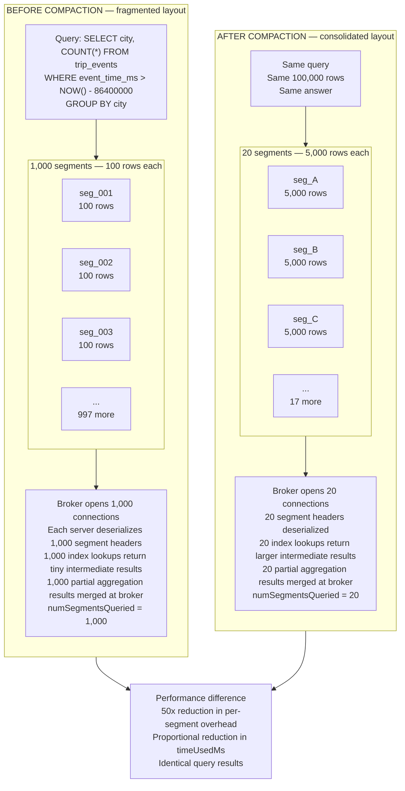
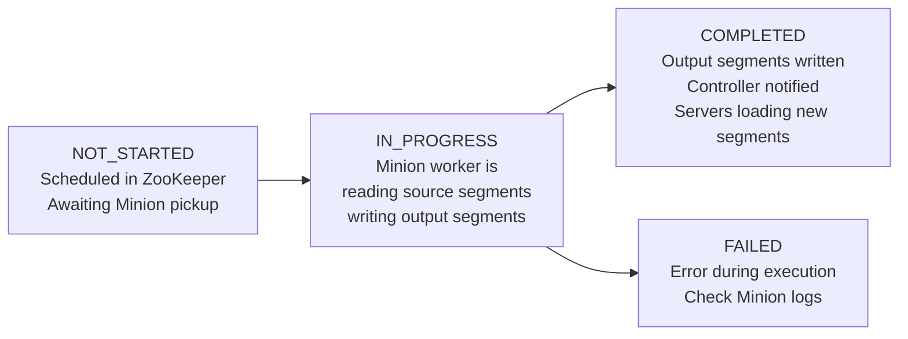

# Lab 11: Minion Tasks and Segment Compaction

## Overview

A Pinot cluster that ingests from a high-throughput Kafka topic accumulates segments continuously. Each time a realtime consuming segment crosses its configured flush threshold — whether by row count or elapsed time — Pinot commits it to deep storage as a completed segment and opens a new consuming segment in its place. In a busy production system, this means hundreds of new segments per day. Over weeks, a single table can hold thousands of segments, each containing only a fraction of the rows that a well-compacted segment would hold.

This fragmentation is not a correctness problem. Queries still return accurate results. The damage is performance: every query must fan out across all segments that overlap the requested time range, and small segments impose the same per-segment overhead as large ones. The broker opens connections, the server deserializes metadata, index lookups produce smaller intermediate results that require more merging. The cumulative effect is measurable latency degradation that grows monotonically as the cluster ages.

Pinot Minion is the background process that reverses this accumulation. It runs as a separate JVM process outside the query path, receives task assignments from the Controller, and performs compaction, purging, segment format conversion, and custom data processing tasks. This lab makes the fragmentation penalty visible and measurable, then shows Minion restoring the cluster to an efficient compacted state.

> [!NOTE]
> This lab builds on the data ingested in Labs 3 and 4. The `trip_events` realtime table must be populated with at least several hundred rows across multiple segments before the compaction steps will produce meaningful before/after measurements.

---

## Learning Objectives

| Objective | Success Criterion |
|-----------|-------------------|
| Understand why segment count degrades query performance | You can explain the per-segment overhead that accumulates during realtime ingestion |
| Navigate the Minion component in the Controller UI | You can locate the Tasks tab and read task status for a submitted job |
| Configure a MergeRollupTask in a table config | The `taskConfig` block is present in the updated `trip_events` table configuration |
| Trigger and monitor a compaction task via the REST API | A MergeRollupTask completes successfully and the segment count decreases |
| Measure the before/after performance impact | Your measurement table shows reduced `numSegmentsQueried` and `timeUsedMs` after compaction |
| Configure a PurgeTask for data retention | The `taskConfig` block includes a valid `bufferTimePeriod` and `purgeParallelism` setting |

---

## The Minion Architecture

Minion is a first-class component in the Pinot cluster topology. Unlike the Controller, Broker, and Server, which all serve requests directly from clients or from each other during query execution, Minion operates entirely in the background. It accepts task assignments from the Controller and reports completion back through the same channel.



The task lifecycle proceeds as follows. The Controller's task scheduler runs on a configurable cron interval and examines each table's `taskConfig` section to determine which tasks are due. When a task is due, the Controller creates a task entry in ZooKeeper and assigns it to an available Minion worker. The Minion worker reads the source segments from deep storage, applies the compaction logic, writes the output segments back to deep storage, and reports completion to the Controller. The Controller then updates the segment registry in ZooKeeper, and the Servers receive notification to load the new compacted segments and unload the replaced ones.

---

## Why Segment Count Matters

The following diagram makes the fan-out difference concrete. Assume both layouts contain exactly 100,000 rows of trip event data.



The per-segment overhead cost is roughly fixed regardless of how many rows the segment contains. A segment with 100 rows costs nearly as much to open, scan the index, and return a partial result as a segment with 5,000 rows. This means the cost of fragmentation is not proportional to the number of extra rows. It is proportional to the number of extra segments. Compaction recovers that overhead without changing the data.

---

## Step 1: Measure the Current Segment Count

Before configuring any compaction, establish the baseline. The Controller REST API exposes segment metadata for any table.

```bash
curl -s http://localhost:9000/segments/trip_events | python3 -m json.tool
```

This endpoint returns the list of all segments for the `trip_events` table, organized by table type. Count the entries in the `REALTIME` array. This is the number of completed segments currently held by the cluster. Consuming segments (those still being written to) are listed separately and are not candidates for compaction until they complete.

To get a precise count without parsing the full JSON:

```bash
curl -s "http://localhost:9000/segments/trip_events?type=REALTIME" \
  | python3 -c "import sys, json; data=json.load(sys.stdin); print('Segment count:', len(data[0].get('REALTIME', [])))"
```

Record the result in the measurement table at the end of this lab.

You can also inspect segments visually. Navigate to **http://localhost:9000**, click **Tables** in the left sidebar, and find `trip_events_REALTIME`. Click the table name to open the detail view, then select the **Segments** tab. The segment list shows each segment's name, status (`ONLINE`), start time, end time, and row count. Segments with low row counts relative to the flush threshold are the primary candidates for compaction.

---

## Step 2: Measure the Query Baseline

Run the KPI query to establish baseline performance metrics before any compaction is applied.

```bash
python3 scripts/query_pinot.py --file sql/02_kpis_by_city.sql
```

After the query returns, examine the `BrokerResponse` statistics in the output. The fields that matter for this measurement are:

| BrokerResponse Field | What It Measures |
|----------------------|-----------------|
| `timeUsedMs` | Total wall-clock time from broker receiving the query to returning the result |
| `numSegmentsQueried` | Number of segments the broker sent sub-queries to |
| `numSegmentsMatched` | Number of segments that contained data matching the time predicate |
| `numDocsScanned` | Total rows read across all matched segments |
| `numEntriesScannedInFilter` | Index entries evaluated during predicate processing |

For the most reproducible results, run the query three times and record the median `timeUsedMs`. Single-run measurements are susceptible to JVM warm-up effects and network jitter in Docker.

```bash
for i in 1 2 3; do
  python3 scripts/query_pinot.py --file sql/02_kpis_by_city.sql 2>/dev/null | \
    python3 -c "import sys, json; r=json.load(sys.stdin); print(f'Run {$i}: timeUsedMs={r[\"timeUsedMs\"]}, numSegmentsQueried={r[\"numSegmentsQueried\"]}')"
done
```

Record the median values in the measurement table at Step 10.

---

## Step 3: Verify Minion Health

Minion must be running and registered with the Controller before any tasks can be scheduled. Verify its health through two paths.

**Health endpoint check:**

```bash
curl -s http://localhost:9000/health
```

This checks the Controller's own health. To verify that the Controller recognizes the Minion worker, query the cluster instance list:

```bash
curl -s http://localhost:9000/instances | python3 -m json.tool | grep -i minion
```

A healthy registration returns one or more instance names matching the pattern `Minion_<host>_<port>`. If no Minion instances appear, the Minion process is not running or has not registered with ZooKeeper.

**Controller UI verification:**

Navigate to **http://localhost:9000** and locate the **Tasks** entry in the left sidebar. The Tasks view displays all active and completed task types. If Minion is running and no tasks have been submitted yet, the list will be empty. That is expected at this point. The presence of the Tasks tab itself confirms the Controller's task management subsystem is active.

To confirm the Minion container is running in this environment:

```bash
docker ps --filter "name=pinot-minion" --format "table {{.Names}}\t{{.Status}}"
```

**Expected output:**

```
NAMES          STATUS
pinot-minion   Up X minutes
```

If the container is not running, start it with:

```bash
docker compose up -d pinot-minion
```

Wait approximately 30 seconds for the Minion process to start and register with ZooKeeper before proceeding.

---

## Step 4: Configure a MergeRollupTask in the Table Config

Minion tasks are configured inside the table configuration's `task` section. The Controller's task scheduler reads this section on each scheduling cycle and determines which tasks are due to run.

The following configuration instructs the Controller to run a MergeRollupTask against `trip_events` every 24 hours. Each execution merges segments within a 1-day time bucket until each output segment reaches a maximum of 500,000 rows.

**Retrieve the current table configuration:**

```bash
curl -s http://localhost:9000/tables/trip_events/tableConfigs | python3 -m json.tool > /tmp/trip_events_config.json
```

**Add the task configuration block.** Open the Controller UI at **http://localhost:9000**, navigate to **Tables**, click on `trip_events_REALTIME`, and select the **Edit** action. Alternatively, prepare the update directly via the REST API.

The `task` block to add to the realtime table configuration:

```json
"task": {
  "taskTypeConfigsMap": {
    "MergeRollupTask": {
      "mergeType": "concat",
      "bucketTimePeriod": "1d",
      "bufferTimePeriod": "2d",
      "maxNumRecordsPerSegment": "500000",
      "maxNumRecordsPerTask": "5000000"
    }
  }
}
```

| Configuration Field | Purpose | Value Used Here |
|--------------------|---------|----------------|
| `mergeType` | `concat` preserves all rows; `rollup` pre-aggregates metrics by dimension key | `concat` — preserves full row-level detail |
| `bucketTimePeriod` | Time window that defines which segments are merged together | `1d` — one calendar day per output segment group |
| `bufferTimePeriod` | Minimum age a segment must reach before it is eligible for compaction | `2d` — segments younger than 2 days are left untouched |
| `maxNumRecordsPerSegment` | Maximum rows in a single output segment | `500000` — prevents output segments from becoming too large for memory-mapped access |
| `maxNumRecordsPerTask` | Maximum rows processed in a single task invocation | `5000000` — limits memory pressure on the Minion worker |

**Update the table config via the REST API:**

```bash
curl -X PUT \
  -H "Content-Type: application/json" \
  -d @/tmp/trip_events_config_updated.json \
  http://localhost:9000/tables/trip_events
```

Verify the update was accepted:

```bash
curl -s http://localhost:9000/tables/trip_events/tableConfigs | \
  python3 -m json.tool | grep -A 15 '"task"'
```

The response should contain the `MergeRollupTask` configuration block exactly as submitted.

---

## Step 5: Trigger a Manual MergeRollupTask

Although the Controller will schedule this task automatically on its cron interval (every 24 hours by default), you can trigger immediate execution via the REST API. This is the standard approach for validating a new task configuration before waiting for the scheduled run.

```bash
curl -X POST \
  -H "Content-Type: application/json" \
  "http://localhost:9000/tasks/schedule?taskType=MergeRollupTask&tableName=trip_events"
```

**Expected response:**

```json
{
  "MergeRollupTask": "Task_MergeRollupTask_trip_events_REALTIME_<timestamp>"
}
```

The response contains the task ID assigned by the Controller. Record this task ID. You will use it to poll task status in the next step.

If the response returns an empty object `{}`, it means no segments were eligible for compaction. This occurs when all segments are younger than the `bufferTimePeriod` configured in Step 4. In that case, temporarily reduce `bufferTimePeriod` to `1h` in the task config and resubmit.

---

## Step 6: Monitor Task Progress

Minion tasks run asynchronously. Use the following commands to poll progress until the task reaches a terminal state.

**Poll task status by task ID:**

```bash
TASK_ID="Task_MergeRollupTask_trip_events_REALTIME_<your_task_id>"

curl -s "http://localhost:9000/tasks/taskstates/${TASK_ID}" | python3 -m json.tool
```

**Poll the overall MergeRollupTask queue for this table:**

```bash
curl -s "http://localhost:9000/tasks/MergeRollupTask/trip_events_REALTIME/state" | \
  python3 -m json.tool
```

Task states follow this progression:



**Monitor via the Controller UI:**

Navigate to **http://localhost:9000** and click **Tasks** in the left sidebar. The Tasks view displays each submitted task with its current state, the table it targets, the number of sub-tasks created, and the completion count. Refresh the page periodically to observe the task advancing through its states. Sub-tasks are created by the Controller when a single MergeRollupTask is split into parallel workers. Each sub-task handles a subset of the eligible segments.

**Read Minion logs for detailed progress:**

```bash
docker logs pinot-minion --tail=50 --follow
```

Look for log lines containing `MergeRollupTaskExecutor` and `Segment`. A successful execution will produce log entries confirming how many input segments were consumed, how many output segments were produced, and the time spent in each phase of the compaction.

A typical compaction run against a small local cluster completes in 30 to 120 seconds depending on total data volume.

---

## Step 7: Verify Compaction Results

Once the task reaches `COMPLETED` state, repeat the measurements from Steps 1 and 2.

**Check the new segment count:**

```bash
curl -s "http://localhost:9000/segments/trip_events?type=REALTIME" \
  | python3 -c "import sys, json; data=json.load(sys.stdin); print('Segment count after compaction:', len(data[0].get('REALTIME', [])))"
```

The count should be substantially lower than the pre-compaction baseline. In a cluster that had accumulated many small segments, a 10x to 50x reduction is common.

**Inspect the new segment sizes in the Controller UI:**

Return to **http://localhost:9000**, navigate to `trip_events_REALTIME`, and select the **Segments** tab. The new compacted segments should have row counts approaching the `maxNumRecordsPerSegment` value you configured, while the old small segments should no longer appear.

**Run the same KPI query and record the new statistics:**

```bash
for i in 1 2 3; do
  python3 scripts/query_pinot.py --file sql/02_kpis_by_city.sql 2>/dev/null | \
    python3 -c "import sys, json; r=json.load(sys.stdin); print(f'Run {$i}: timeUsedMs={r[\"timeUsedMs\"]}, numSegmentsQueried={r[\"numSegmentsQueried\"]}')"
done
```

Record the median values in the measurement table below.

---

## Step 8: Measurement Table — Before and After Compaction

Complete this table using the values you recorded in Steps 1, 2, and 7.

| Metric | Before Compaction | After Compaction | Improvement |
|--------|:-----------------:|:----------------:|:-----------:|
| Segment count (total) | | | |
| `numSegmentsQueried` | | | |
| `timeUsedMs` (median of 3 runs) | | | |
| `numDocsScanned` | | | |
| `numEntriesScannedInFilter` | | | |
| Estimated total bytes on disk | | | |

To estimate total bytes on disk, query the segment metadata API:

```bash
curl -s "http://localhost:9000/segments/trip_events/metadata?type=REALTIME" | \
  python3 -c "
import sys, json
data = json.load(sys.stdin)
total = sum(int(s.get('segment.total.docs', 0)) for s in data)
print(f'Total rows across all segments: {total}')
"
```

The improvement column should show a large positive value for `numSegmentsQueried` and a corresponding improvement in `timeUsedMs`. The total row count and `numDocsScanned` should remain identical. Compaction consolidates segments without changing the underlying data.

---

## Step 9: Configure a PurgeTask for Data Retention

Compaction reduces segment count. Purging reduces data volume. A PurgeTask scans rows within eligible segments and deletes rows that match a purge predicate, typically a time-based retention condition. The result is segments that contain fewer rows, which the cluster can then recompact to reclaim disk space.

The following `taskConfig` configures a nightly PurgeTask that removes trip events older than 7 days. Add this alongside the existing `MergeRollupTask` entry in the `task.taskTypeConfigsMap` object:

```json
"PurgeTask": {
  "retentionPeriod": "7d",
  "bufferTimePeriod": "2d",
  "purgeParallelism": "2"
}
```

| Configuration Field | Purpose | Value Used Here |
|--------------------|---------|----------------|
| `retentionPeriod` | Rows with a time column value older than this period are eligible for deletion | `7d` — retain only the last 7 days of events |
| `bufferTimePeriod` | A segment must be older than this value before the purge task will process it | `2d` — avoids purging segments that are still being actively queried by recent dashboards |
| `purgeParallelism` | Number of parallel threads the Minion worker uses for row-level deletion | `2` — conservative setting appropriate for a single-node Minion |

After adding the PurgeTask configuration, update the table config and trigger a manual run:

```bash
curl -X POST \
  -H "Content-Type: application/json" \
  "http://localhost:9000/tasks/schedule?taskType=PurgeTask&tableName=trip_events"
```

Because the sample dataset in this lab uses fixed timestamps rather than live event times, the PurgeTask may not delete any rows if all events fall within the 7-day retention window. In that scenario, observe the task completing with zero rows deleted — this is the correct outcome and confirms that the purge predicate is working as designed.

---

## Task Configuration Reference

The following table covers all Minion task types available in a standard Pinot deployment.

| Task Type | Purpose | When to Use | Key Config Parameters |
|-----------|---------|-------------|----------------------|
| `MergeRollupTask` | Merges many small segments into fewer large segments; optionally pre-rolls up metrics by dimension key | When realtime ingestion has produced more than a few hundred segments per table; when query `numSegmentsQueried` is high | `mergeType`, `bucketTimePeriod`, `bufferTimePeriod`, `maxNumRecordsPerSegment`, `maxNumRecordsPerTask` |
| `PurgeTask` | Deletes rows from segments that match a retention predicate; rewrites segments without the purged rows | GDPR/CCPA deletion requests; time-based data retention policies where row-level deletion is needed | `retentionPeriod`, `bufferTimePeriod`, `purgeParallelism` |
| `RealtimeToOfflineSegmentsTask` | Copies completed realtime segments from the realtime server to the offline table, enabling hybrid table query patterns | When a hybrid table (realtime for recent data, offline for historical data) is the target architecture | `bucketTimePeriod`, `bufferTimePeriod`, `maxNumRecordsPerSegment` |
| `SegmentGenerationAndPushTask` | Generates Pinot segments from files in an external data source (S3, HDFS, GCS) and pushes them to the cluster | Batch ingestion pipelines where data arrives as files; backfill operations | `inputDirURI`, `outputDirURI`, `recordReaderSpec`, `tableSpec` |
| `SegmentRefreshTask` | Refreshes segments that need index rebuilds after a table configuration change | When a new index type is added to an existing table and existing segments must be rebuilt to use it | Inherits from table config; triggered via `POST /segments/{tableName}/reload` |

---

## Reflection Prompts

1. This lab configured `mergeType: concat` for the MergeRollupTask, which preserves every original row in the output segments. The alternative, `rollup`, pre-aggregates metric columns by dimension key during compaction. Under what data modeling conditions would `rollup` be appropriate, and what would you lose by choosing it over `concat`?

2. The `bufferTimePeriod` setting in both the MergeRollupTask and PurgeTask configuration prevents very recent segments from being processed. Explain the operational reason for this buffer and describe the query correctness risk that would emerge if it were set to zero.

3. After compaction, `numSegmentsQueried` decreased significantly, but `numDocsScanned` remained approximately the same. A colleague interprets this as meaning that compaction did not improve performance because the same number of rows were read. Explain why this interpretation is incorrect and what the reduction in `numSegmentsQueried` actually contributes to query latency.

4. The MergeRollupTask processed segments from the `trip_events` realtime table. Realtime tables continuously generate new segments as Kafka events arrive. Design a compaction schedule — specifying `bucketTimePeriod`, `bufferTimePeriod`, and scheduling frequency — that keeps segment count below 100 for a table receiving 10,000 events per hour with a flush threshold of 50,000 rows.

---

[Previous: Lab 8 — SLO and Incident Drill](lab-08-slo-incident.md) | [Next: Lab 12 — SQL Optimization Workshop](lab-12-sql-optimization.md)
