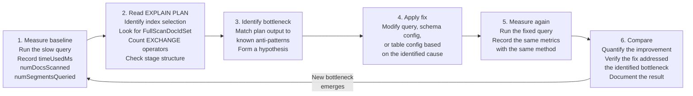

# Lab 12: SQL Optimization Workshop

## Overview

Writing a SQL query that returns correct results and writing one that returns those results efficiently are two different skills. The first requires understanding the data model. The second requires understanding how Pinot executes the query. Which indexes it selects, how many segments it contacts, how much data it moves across the network and where in the execution pipeline the bottleneck lives all matter.

This workshop develops the second skill through eight structured problems. Each problem presents a realistic query that performs poorly for a specific, diagnosable reason. Your task is to reproduce the slow behavior, identify the root cause using EXPLAIN PLAN and BrokerResponse statistics, apply the correct fix and measure the improvement. By the end, you will have internalized a repeatable optimization methodology and a reference library of common Pinot performance anti-patterns.

> [!NOTE]
> All eight problems use the tables established in Labs 2 through 6. The `trip_events`, `trip_state` and `merchants_dim` tables must be populated before proceeding.


## Learning Objectives

| Objective | Success Criterion |
|-----------|-------------------|
| Apply the six-step optimization methodology | You follow the same sequence — measure, explain, identify, fix, measure, compare — for every problem |
| Read EXPLAIN PLAN output | You can identify index selection, segment pruning and exchange operators in a query plan |
| Interpret BrokerResponse statistics | You can state which BrokerResponse field is the primary evidence for each anti-pattern |
| Apply targeted fixes to eight query anti-patterns | Each of your eight optimized queries shows measurable improvement in the measurement table |
| Build an optimization intuition | You can classify a new slow query into one of the eight anti-pattern categories before running EXPLAIN PLAN |


## The Optimization Methodology

Every optimization attempt must follow the same sequence. Skipping steps, especially the measurement steps, produces guesswork rather than engineering. A fix that seems obvious may not address the actual bottleneck and without before/after measurement you cannot know whether your change helped.



The loop is intentional. Fixing one bottleneck often reveals the next. A query that was dominated by segment fan-out may, after compaction, become dominated by a missing inverted index. Optimization is iterative, not a single intervention.


## The Diagnosis Toolkit

Before starting the problems, familiarize yourself with every diagnostic tool available. The table below maps each tool to its access method and the class of problems it reveals.

| Tool | How to Access | What It Reveals |
|------|--------------|----------------|
| `EXPLAIN PLAN FOR <query>` | Run in the Query Console at **http://localhost:9000/#/query** | Index selection path, operator types, stage structure for multi-stage queries, whether star-tree or bloom filter was used |
| `BrokerResponse.timeUsedMs` | In the output of `python3 scripts/query_pinot.py` or in Response Stats below the Query Console result | End-to-end broker latency — the primary performance metric to optimize |
| `BrokerResponse.numDocsScanned` | Same location | Total rows read from segments after index filtering — high values indicate missing or ineffective indexes |
| `BrokerResponse.numEntriesScannedInFilter` | Same location | Index entries evaluated during predicate processing — very high values relative to matching rows indicate ineffective index selection |
| `BrokerResponse.numSegmentsQueried` | Same location | Segments contacted by the broker — high values indicate missing time predicate or segment fragmentation |
| `BrokerResponse.numSegmentsMatched` | Same location | Segments that contained rows matching the predicate — the gap between this and `numSegmentsQueried` is the pruning savings |
| `BrokerResponse.stageStats` | Present in multi-stage query responses only | Per-stage breakdown of execution time, rows processed and data shuffled — identifies which stage is the bottleneck |
| Controller UI Segments tab | **http://localhost:9000** → Tables → table name → Segments | Segment count, row counts per segment, time ranges — helps diagnose fragmentation and pruning gaps |
| `FullScanDocIdSet` in EXPLAIN PLAN | Look for this operator type in plan output | Indicates no index was selected for this predicate — the server is reading every row |
| `StarTreeDocIdSet` in EXPLAIN PLAN | Look for this operator type in plan output | Confirms the star-tree pre-aggregation path was selected |
| `BloomFilterDocIdSet` in EXPLAIN PLAN | Look for this operator type in plan output | Confirms a bloom filter eliminated a segment without a full scan |


## Problem 1: Missing Time Predicate

### Context

The most common performance mistake in Pinot is issuing a query with no time predicate. Because Pinot organizes segments by time boundaries, a query with no time filter cannot prune any segments. The broker must contact every segment across the entire retention window.

### The Slow Query

```sql
SELECT city, COUNT(*) AS total_trips
FROM trip_events
GROUP BY city
ORDER BY total_trips DESC
```

### Step 1: Run the Slow Query and Record Baseline Metrics

```bash
python3 scripts/query_pinot.py --sql \
  "SELECT city, COUNT(*) AS total_trips FROM trip_events GROUP BY city ORDER BY total_trips DESC"
```

Examine the `BrokerResponse` output. The key signal for this anti-pattern is `numSegmentsQueried` equaling the total segment count of the table. Every segment in the retention window was contacted because there was no time predicate to allow the broker to prune.

### Step 2: Run EXPLAIN PLAN

```sql
EXPLAIN PLAN FOR
SELECT city, COUNT(*) AS total_trips
FROM trip_events
GROUP BY city
ORDER BY total_trips DESC
```

The plan will show a full table scan reaching all segments. There is no `SegmentPruned` node because no predicate aligned with segment time boundaries.

### Step 3: Apply the Fix

Add a time predicate that restricts the query to the last 7 days. Because `event_time_ms` is the time column and has a range index, the broker uses segment time boundaries to prune segments outside the window before making server contact.

```sql
SELECT city, COUNT(*) AS total_trips
FROM trip_events
WHERE event_time_ms > NOW() - 7 * 24 * 3600 * 1000
GROUP BY city
ORDER BY total_trips DESC
```

### Step 4: Run EXPLAIN PLAN for the Fixed Query

```sql
EXPLAIN PLAN FOR
SELECT city, COUNT(*) AS total_trips
FROM trip_events
WHERE event_time_ms > NOW() - 7 * 24 * 3600 * 1000
GROUP BY city
ORDER BY total_trips DESC
```

After adding the predicate, the plan shows the time filter applied at the broker level, with segments outside the 7-day window excluded before server contact. `numSegmentsQueried` in the BrokerResponse will reflect only the segments whose time ranges overlap the last 7 days.

### Record Your Measurements

| Metric | Before Fix | After Fix |
|--------|:----------:|:---------:|
| `timeUsedMs` | | |
| `numSegmentsQueried` | | |
| `numDocsScanned` | | |


## Problem 2: Full Table Scan on a High-Cardinality Column

### Context

A bloom filter on a high-cardinality column like `trip_id` eliminates segments that definitely do not contain the requested value. However, for segments where the bloom filter returns a positive result (either a true positive or a false positive), the server must still scan rows within those segments. An inverted index on a high-cardinality column can reduce the within-segment scan to a direct row lookup. This problem makes the difference observable.

### The Slow Query

```sql
SELECT trip_id, city, fare_amount, status
FROM trip_events
WHERE trip_id = 'trip_000001'
```

### Step 1: Run the Slow Query and Record Baseline Metrics

```bash
python3 scripts/query_pinot.py --sql \
  "SELECT trip_id, city, fare_amount, status FROM trip_events WHERE trip_id = 'trip_000001'"
```

`numDocsScanned` will be higher than 1 even though only one trip matches. This is because within each segment that passed the bloom filter check, the server must scan the rows to find the matching `trip_id`.

### Step 2: Run EXPLAIN PLAN

```sql
EXPLAIN PLAN FOR
SELECT trip_id, city, fare_amount, status
FROM trip_events
WHERE trip_id = 'trip_000001'
```

Look for `BloomFilterDocIdSet` in the plan output — this confirms that the bloom filter is eliminating segments before server contact. Within the segments that pass the bloom check, look for the scan operator. If you see `FullScanDocIdSet` rather than `InvertedIndexDocIdSet`, the server is doing a linear scan within the surviving segments.

### Step 3: Understand the Bloom Filter Limitation

The `trip_events` table has a bloom filter on `trip_id` (configured in Lab 4). The bloom filter operates at the segment level: it can tell the broker "this segment definitely does not contain `trip_id = 'trip_000001'`" and cause that segment to be skipped entirely. What the bloom filter cannot do is produce a list of row offsets within a passing segment. It only answers existence questions per segment.

For a lookup-by-ID pattern where a single specific row is needed, adding an inverted index to `trip_id` in addition to the bloom filter would provide row-level resolution within each passing segment. However, `trip_id` is a UUID-like high-cardinality column — its inverted index would be enormous and would not meaningfully reduce `numDocsScanned` because each value maps to at most one row.

The correct diagnosis here is that this query pattern, point lookup on a unique ID, is not Pinot's strongest use case. Pinot is optimized for aggregations over many rows, not row-level retrieval. The bloom filter already eliminates most segments. The residual scan within passing segments is the inherent cost of the pattern.

### Step 4: Apply the Fix

Restrict the scan to the time window where the trip is expected to have occurred. This reduces the number of segments the bloom filter must evaluate and the number of rows scanned within passing segments.

```sql
SELECT trip_id, city, fare_amount, status
FROM trip_events
WHERE trip_id = 'trip_000001'
  AND event_time_ms > NOW() - 24 * 3600 * 1000
```

If the approximate event time is known, tighten the window further. Every hour removed from the time range is one less set of segments the bloom filter must evaluate.

### Record Your Measurements

| Metric | Before Fix | After Fix |
|--------|:----------:|:---------:|
| `timeUsedMs` | | |
| `numSegmentsQueried` | | |
| `numDocsScanned` | | |


## Problem 3: The SELECT * Anti-Pattern

### Context

Pinot stores data in columnar format. Each column is stored in a separate data structure on disk. When a query projects a column, the server must read and decode that column's data file. A `SELECT *` query forces the server to read every column in the schema, even columns the caller has no use for. In a wide schema, one with 30 or more columns, this multiplies I/O by a factor proportional to the number of unused columns.

### The Slow Query

```sql
SELECT *
FROM trip_state
WHERE status = 'completed'
LIMIT 100
```

### Step 1: Run the Slow Query and Record Baseline Metrics

```bash
python3 scripts/query_pinot.py --sql \
  "SELECT * FROM trip_state WHERE status = 'completed' LIMIT 100"
```

Inspect `timeUsedMs`. For a small dataset the value may appear acceptable, but in a production cluster with wide rows and many segments the cost compounds. The `numDocsScanned` value reflects the filtering cost, which is unchanged. The issue is projection cost, which does not appear directly in standard BrokerResponse statistics but manifests as elevated `timeUsedMs` relative to queries with narrow projections.

### Step 2: Examine the Schema Width

```bash
curl -s http://localhost:9000/schemas/trip_state | python3 -m json.tool | grep '"name"' | wc -l
```

Count the columns. Each column name that appears in the output is a column being read and decoded when `SELECT *` is issued.

### Step 3: Apply the Fix

Replace the wildcard projection with only the columns the query consumer actually needs.

```sql
SELECT trip_id, city, fare_amount, status, last_event_time_ms
FROM trip_state
WHERE status = 'completed'
LIMIT 100
```

### Step 4: Compare EXPLAIN PLANs

```sql
EXPLAIN PLAN FOR
SELECT * FROM trip_state WHERE status = 'completed' LIMIT 100
```

```sql
EXPLAIN PLAN FOR
SELECT trip_id, city, fare_amount, status, last_event_time_ms
FROM trip_state
WHERE status = 'completed'
LIMIT 100
```

The plan nodes will be structurally similar — both use the inverted index on `status`. The difference is in the projection width, which the plan may display as the list of output columns. The narrower projection reads fewer column data files per segment.

### Record Your Measurements

| Metric | Before Fix | After Fix |
|--------|:----------:|:---------:|
| `timeUsedMs` | | |
| `numDocsScanned` | | |
| Columns projected | All (count from schema) | 5 |


## Problem 4: Aggregation Without Star-Tree Index Coverage

### Context

The `merchants_dim` table has a star-tree index configured with `dimensionsSplitOrder: ["city", "vertical", "contract_tier"]` and `functionColumnPairs: ["COUNT__*", "SUM__monthly_orders", "AVG__rating"]`. Queries that include all three dimensions in `GROUP BY` and only the pre-materialized aggregation functions benefit from the star-tree. The server reads pre-computed tree nodes rather than scanning raw rows. Queries that deviate from the configured dimensions or functions fall back to a full row scan.

### The Slow Query

```sql
SELECT city, vertical, COUNT(*), SUM(monthly_orders)
FROM merchants_dim
GROUP BY city, vertical
```

### Step 1: Run the Slow Query and Record Baseline Metrics

```bash
python3 scripts/query_pinot.py --sql \
  "SELECT city, vertical, COUNT(*), SUM(monthly_orders) FROM merchants_dim GROUP BY city, vertical"
```

This query uses only two of the three configured dimensions. Record `numDocsScanned` — it should equal the total row count of `merchants_dim`, confirming a full scan.

### Step 2: Run EXPLAIN PLAN

```sql
EXPLAIN PLAN FOR
SELECT city, vertical, COUNT(*), SUM(monthly_orders)
FROM merchants_dim
GROUP BY city, vertical
```

Look at the DocIdSet operator in the plan. If it shows `FullScanDocIdSet` rather than `StarTreeDocIdSet`, the star-tree was not selected. When `GROUP BY` uses a prefix of the `dimensionsSplitOrder` (city, vertical — the first two of the three configured dimensions), the star-tree should still apply because it can traverse to the `vertical` level and return aggregated results without descending further. Verify this is reflected in the plan.

### Step 3: Verify Star-Tree Selection

The star-tree applies when the query's GROUP BY dimensions form a prefix of the configured `dimensionsSplitOrder` and all requested aggregation functions are in `functionColumnPairs`. This query groups by `city` and `vertical` — a valid prefix of `["city", "vertical", "contract_tier"]`. The functions `COUNT(*)` and `SUM(monthly_orders)` are both in `functionColumnPairs`.

If the plan shows `FullScanDocIdSet`, verify the table configuration using the Controller UI: navigate to **http://localhost:9000**, click Tables, select `merchants_dim_OFFLINE` and open the Table Config tab. Confirm the `starTreeIndexConfigs` block is present and that `functionColumnPairs` includes `COUNT__*` and `SUM__monthly_orders`.

### Step 4: Apply the Fix

If the star-tree was not selected, the most common cause is a mismatch between the query functions and the configured function pairs. The `functionColumnPairs` notation uses double underscores: `COUNT__*` corresponds to `COUNT(*)` and `SUM__monthly_orders` corresponds to `SUM(monthly_orders)`. Ensure the table configuration matches exactly.

Run the query that is guaranteed to match the full star-tree configuration:

```sql
SELECT city, vertical, contract_tier, COUNT(*), SUM(monthly_orders), AVG(rating)
FROM merchants_dim
GROUP BY city, vertical, contract_tier
ORDER BY city, vertical, contract_tier
```

```sql
EXPLAIN PLAN FOR
SELECT city, vertical, contract_tier, COUNT(*), SUM(monthly_orders), AVG(rating)
FROM merchants_dim
GROUP BY city, vertical, contract_tier
ORDER BY city, vertical, contract_tier
```

This query matches the full star-tree configuration. The plan should show `StarTreeDocIdSet`. When `StarTreeDocIdSet` appears, `numDocsScanned` in the BrokerResponse reflects the number of star-tree nodes visited rather than raw rows — a number orders of magnitude smaller for typical aggregation queries.

### Record Your Measurements

| Metric | Without Star-Tree Selection | With Star-Tree Selection |
|--------|:---------------------------:|:------------------------:|
| `timeUsedMs` | | |
| `numDocsScanned` | | |
| EXPLAIN PLAN operator | `FullScanDocIdSet` | `StarTreeDocIdSet` |


## Problem 5: Predicate Order and Index Pushdown

### Context

A common misconception is that the textual order of predicates in a SQL `WHERE` clause affects which filter Pinot evaluates first. In practice, Pinot's query planner analyzes all available predicates and their associated indexes, then constructs an execution plan that processes the most selective indexed predicates first — regardless of the order they appear in the SQL. This problem makes that behavior observable and provides the vocabulary to describe it correctly.

### The Two Queries

Both queries apply identical filters to `trip_events` and return identical results. The only difference is the textual order of the predicates.

**Query A — Range filter first, then equality:**

```sql
SELECT city, COUNT(*) AS trips, SUM(fare_amount) AS gmv
FROM trip_events
WHERE fare_amount > 100
  AND city = 'mumbai'
GROUP BY city
```

**Query B — Equality filter first, then range:**

```sql
SELECT city, COUNT(*) AS trips, SUM(fare_amount) AS gmv
FROM trip_events
WHERE city = 'mumbai'
  AND fare_amount > 100
GROUP BY city
```

### Step 1: Run Both Queries and Record Metrics

```bash
python3 scripts/query_pinot.py --sql \
  "SELECT city, COUNT(*) AS trips, SUM(fare_amount) AS gmv FROM trip_events WHERE fare_amount > 100 AND city = 'mumbai' GROUP BY city"

python3 scripts/query_pinot.py --sql \
  "SELECT city, COUNT(*) AS trips, SUM(fare_amount) AS gmv FROM trip_events WHERE city = 'mumbai' AND fare_amount > 100 GROUP BY city"
```

### Step 2: Run EXPLAIN PLAN for Both Queries

```sql
EXPLAIN PLAN FOR
SELECT city, COUNT(*) AS trips, SUM(fare_amount) AS gmv
FROM trip_events
WHERE fare_amount > 100
  AND city = 'mumbai'
GROUP BY city
```

```sql
EXPLAIN PLAN FOR
SELECT city, COUNT(*) AS trips, SUM(fare_amount) AS gmv
FROM trip_events
WHERE city = 'mumbai'
  AND fare_amount > 100
GROUP BY city
```

Observe that the execution plans are identical or functionally equivalent despite the different textual predicate order. Pinot's planner applies predicate pushdown: it evaluates equality predicates on inverted-indexed columns first because they return a compact row set directly from the index dictionary. Range predicates on range-indexed columns are applied subsequently to narrow the row set further. The planner makes this decision based on index availability and estimated selectivity, not on the order predicates appear in the query text.

### Step 3: Understand the Learning

The insight from this problem is not that query predicate order never matters — it is that for Pinot's indexed predicate evaluation, the textual order does not determine evaluation sequence. This matters for two operational reasons.

First, it means you should not spend effort reordering `WHERE` clause predicates hoping to change execution behavior. The index configuration is the lever that matters, not textual order.

Second, it means that when you observe `numEntriesScannedInFilter` being high, the cause is an absent index — not a wrongly ordered predicate. If `city = 'mumbai'` had no inverted index, both queries would show high scan counts. The fix is adding the index, not reordering the predicate.

### Record Your Measurements

| Metric | Query A (range first) | Query B (equality first) |
|--------|:---------------------:|:------------------------:|
| `timeUsedMs` | | |
| `numDocsScanned` | | |
| `numEntriesScannedInFilter` | | |
| EXPLAIN PLAN — index used | | |

The values in the two columns should be nearly identical, confirming that predicate order does not affect execution.


## Problem 6: Excessive GROUP BY Cardinality in Multi-Stage Queries

### Context

Multi-stage query execution introduces a shuffle phase: intermediate rows produced by Stage 1 (the scan stage on each server) are redistributed across the network so that rows with the same GROUP BY key arrive at the same Stage 2 processor. The volume of data shuffled equals the number of distinct intermediate rows produced by Stage 1. When a GROUP BY contains many high-cardinality dimensions, the number of intermediate rows explodes and the shuffle becomes the dominant cost.

### The Slow Query

```sql
SELECT
  city,
  service_tier,
  event_type,
  status,
  merchant_id,
  COUNT(*) AS events,
  SUM(fare_amount) AS gmv
FROM trip_events
WHERE event_time_ms > NOW() - 7 * 24 * 3600 * 1000
GROUP BY city, service_tier, event_type, status, merchant_id
ORDER BY gmv DESC
LIMIT 100
```

Run this query with the multi-stage engine selected in the Query Console.

### Step 1: Run the Slow Query and Record Stage Statistics

```bash
python3 scripts/query_pinot.py --file sql/04_multistage_join.sql --query-type multistage
```

For the cardinality test, run the five-dimension GROUP BY in the Query Console with the Multi-Stage engine selector active. After the query returns, expand the Response Stats and look for the `stageStats` field. Note the time spent in Stage 2 versus Stage 1. A high Stage 2 cost relative to Stage 1 confirms that shuffle volume is the bottleneck.

### Step 2: Diagnose the Shuffle Volume

The theoretical maximum number of rows shuffled in Stage 2 is the product of the cardinalities of all five dimensions:

```
cities × service_tiers × event_types × statuses × merchant_ids
```

If `merchant_id` has 200 distinct values, `city` has 5, `service_tier` has 3, `event_type` has 4 and `status` has 4, the upper bound is 200 × 5 × 3 × 4 × 4 = 48,000 intermediate rows per Stage 1 worker. With multiple Stage 1 workers, this multiplies further before Stage 2 deduplication reduces it.

### Step 3: Apply Fix A — Pre-Filter to Reduce Cardinality

Restrict the scan to a narrower set of dimension values before grouping. If the business question is specifically about completed trips for premium-tier merchants in selected cities, add those restrictions before the GROUP BY:

```sql
SELECT
  city,
  service_tier,
  merchant_id,
  COUNT(*) AS events,
  SUM(fare_amount) AS gmv
FROM trip_events
WHERE event_time_ms > NOW() - 7 * 24 * 3600 * 1000
  AND status = 'completed'
  AND service_tier = 'premium'
GROUP BY city, service_tier, merchant_id
ORDER BY gmv DESC
LIMIT 100
```

Removing two constant-value dimensions from the GROUP BY and adding them as equality filters reduces shuffle volume proportionally.

### Step 4: Apply Fix B — Split Into Two Queries

When the full five-dimension result is genuinely needed, consider whether the query must be answered in a single pass. One alternative is to compute the aggregation in two stages: a pre-aggregated summary table fed by a MergeRollupTask with `mergeType: rollup` or a first query that produces city-level totals and a second that produces merchant-level totals, joined application-side.

### Record Your Measurements

| Metric | Five-Dimension GROUP BY | Three-Dimension GROUP BY |
|--------|:-----------------------:|:------------------------:|
| `timeUsedMs` | | |
| Stage 1 time (from stageStats) | | |
| Stage 2 time (from stageStats) | | |
| Result row count | | |


## Problem 7: LIMIT Without ORDER BY in Multi-Stage Mode

### Context

In the single-stage engine, a `LIMIT N` query without `ORDER BY` allows the broker to stop collecting partial results as soon as it has accumulated N rows from the servers. This early termination is an implicit optimization. In the multi-stage engine, the semantics change: because data is redistributed across stages, a `LIMIT` without `ORDER BY` cannot be pushed down efficiently to the scan stage. The engine must complete the shuffle and aggregation before applying the limit, which eliminates the early-termination benefit.

### The Slow Pattern

```sql
SELECT trip_id, city, fare_amount
FROM trip_events
WHERE status = 'completed'
LIMIT 10
```

Run this in the Query Console with Multi-Stage mode enabled.

### Step 1: Run the Query and Inspect the Plan

```sql
EXPLAIN PLAN FOR
SELECT trip_id, city, fare_amount
FROM trip_events
WHERE status = 'completed'
LIMIT 10
```

In the multi-stage plan, observe whether the `LIMIT` operator appears close to the scan node (a pushed-down limit) or only at the final stage node (a late limit). A late limit means the engine materialized far more than 10 rows before applying the cutoff.

### Step 2: Apply the Fix

Add an explicit `ORDER BY` clause to give the engine a deterministic ordering contract. With a defined order, the optimizer can reason about where to apply the limit in the execution plan.

```sql
SELECT trip_id, city, fare_amount
FROM trip_events
WHERE status = 'completed'
ORDER BY fare_amount DESC
LIMIT 10
```

For queries where the calling application genuinely does not care about ordering and needs only any 10 matching rows, the correct approach in multi-stage mode is to express this as an aggregation query rather than a scan-and-limit:

```sql
SELECT
  city,
  COUNT(*) AS completed_trips,
  SUM(fare_amount) AS total_fare
FROM trip_events
WHERE status = 'completed'
  AND event_time_ms > NOW() - 24 * 3600 * 1000
GROUP BY city
ORDER BY total_fare DESC
LIMIT 10
```

This query is deterministic, benefits from the inverted index on `status`, benefits from time-based segment pruning and produces the LIMIT pushdown at the correct stage.

### Record Your Measurements

| Metric | LIMIT without ORDER BY | LIMIT with ORDER BY |
|--------|:---------------------:|:-------------------:|
| `timeUsedMs` | | |
| `numDocsScanned` | | |
| LIMIT position in plan | Late stage | Pushed down |


## Problem 8: Suboptimal JOIN Order for Hash Join Execution

### Context

The multi-stage engine executes joins using a hash join strategy. In a hash join, one input — the build side — is read into an in-memory hash table. The other input — the probe side — is streamed through and matched against the hash table. The performance of a hash join is dominated by the cost of building and maintaining the hash table. This cost is proportional to the size of the build-side input. The correct practice is always to place the smaller table on the build side.

In Pinot's multi-stage engine, the right side of the `JOIN` clause is the build side and the left side is the probe side. The optimizer does not automatically reorder joins by size.

### The Two Join Orders

**Join Order A — large table on the right (slow):**

```sql
SELECT
  t.city,
  m.vertical,
  COUNT(*) AS trips,
  SUM(t.fare_amount) AS gmv
FROM merchants_dim m
JOIN trip_state t ON m.merchant_id = t.merchant_id
WHERE t.status = 'completed'
GROUP BY t.city, m.vertical
ORDER BY gmv DESC
```

In this order, `trip_state` is the build side. If `trip_state` contains 400 rows and `merchants_dim` contains 200 rows, the hash table holds 400 rows and is probed 200 times.

**Join Order B — small table on the right (fast):**

```sql
SELECT
  t.city,
  m.vertical,
  COUNT(*) AS trips,
  SUM(t.fare_amount) AS gmv
FROM trip_state t
JOIN merchants_dim m ON t.merchant_id = m.merchant_id
WHERE t.status = 'completed'
GROUP BY t.city, m.vertical
ORDER BY gmv DESC
```

In this order, `merchants_dim` is the build side. The hash table holds 200 rows — the smaller dimension table — and is probed by the 400 streaming rows from `trip_state`.

### Step 1: Check Table Row Counts

```bash
python3 scripts/query_pinot.py --sql "SELECT COUNT(*) AS cnt FROM trip_state"
python3 scripts/query_pinot.py --sql "SELECT COUNT(*) AS cnt FROM merchants_dim"
```

Confirm which table is larger. The larger table should always appear on the left side of the JOIN.

### Step 2: Run Both Join Orders and Record Stage Statistics

Run each join order in the Query Console with Multi-Stage mode enabled. After each query, examine `stageStats` in the Response Stats panel. Stage 2 (the hash join stage) will show different row counts and execution times for the two orders.

```sql
EXPLAIN PLAN FOR
SELECT t.city, m.vertical, COUNT(*) AS trips, SUM(t.fare_amount) AS gmv
FROM merchants_dim m
JOIN trip_state t ON m.merchant_id = t.merchant_id
WHERE t.status = 'completed'
GROUP BY t.city, m.vertical
ORDER BY gmv DESC
```

```sql
EXPLAIN PLAN FOR
SELECT t.city, m.vertical, COUNT(*) AS trips, SUM(t.fare_amount) AS gmv
FROM trip_state t
JOIN merchants_dim m ON t.merchant_id = m.merchant_id
WHERE t.status = 'completed'
GROUP BY t.city, m.vertical
ORDER BY gmv DESC
```

In the EXPLAIN PLAN output, identify the build side by looking at the node labeled `HashJoinOperator` or equivalent. The right child of this node is the build side. Confirm that Join Order B places `merchants_dim` on the right.

### Step 3: Understand the Scaling Implications

For the small sample dataset in this lab, both join orders may produce similar `timeUsedMs` because the data volume is low. The principle becomes critical at production scale. A dimension table with 50,000 merchants joined against a fact table with 100 million completed trips requires a hash table of 50,000 entries. Reversing the join order — placing the 100 million row fact table on the build side — would exhaust Minion worker memory and produce either a spill to disk or an out-of-memory failure.

### Step 4: Verify with the Fixed Join Order

Run the correctly ordered join against the full aggregation:

```sql
SELECT
  t.city,
  m.vertical,
  m.contract_tier,
  COUNT(*) AS trips,
  SUM(t.fare_amount) AS gmv,
  AVG(t.distance_km) AS avg_distance
FROM trip_state t
JOIN merchants_dim m ON t.merchant_id = m.merchant_id
WHERE t.status = 'completed'
GROUP BY t.city, m.vertical, m.contract_tier
ORDER BY gmv DESC
LIMIT 50
```

### Record Your Measurements

| Metric | Large table on right (slow) | Small table on right (fast) |
|--------|:---------------------------:|:----------------------------:|
| `timeUsedMs` | | |
| Stage 2 build time (stageStats) | | |
| Stage 2 rows in hash table | | |


## Optimization Cheat Sheet

Use this reference when diagnosing an unfamiliar slow query. Start from the symptom you observe in the BrokerResponse statistics and work right to find the fix.

| Symptom | Root Cause | Diagnosis Command | Fix |
|---------|-----------|-------------------|-----|
| `numSegmentsQueried` equals total segment count | No time predicate — broker cannot prune segments | Check `WHERE` clause for `event_time_ms` filter | Add `WHERE event_time_ms > NOW() - N * 86400000` |
| `numDocsScanned` equals total row count in table | No index on the filtered column — server scans all rows | `EXPLAIN PLAN` shows `FullScanDocIdSet` | Add inverted index (low cardinality) or range index (numeric/temporal) |
| High `timeUsedMs` despite low `numDocsScanned` | Wide projection — server reads many unused columns | Count projected columns in the query | Replace `SELECT *` with named columns |
| `numDocsScanned` equals row count on `merchants_dim` GROUP BY | Star-tree not selected — dimensions or functions do not match config | `EXPLAIN PLAN` shows `FullScanDocIdSet` instead of `StarTreeDocIdSet` | Align query dimensions and functions with `starTreeIndexConfigs` |
| `timeUsedMs` same regardless of predicate order | Pinot evaluates indexed predicates by selectivity, not textual order | Run `EXPLAIN PLAN` for both orders — plans are equivalent | No action needed; focus on index coverage, not order |
| High `stageStats.stage2` time in multi-stage query | Shuffle volume too large — too many GROUP BY dimensions or high cardinality | Examine `stageStats` for Stage 2 row count | Pre-filter with equality predicates before GROUP BY; reduce dimension count |
| `LIMIT` not applied until final stage in multi-stage | No `ORDER BY` — optimizer cannot push limit to scan stage | `EXPLAIN PLAN` shows late LIMIT operator position | Always pair `LIMIT` with `ORDER BY` in multi-stage queries |
| Multi-stage JOIN slow with large right-side table | Build side too large — hash table does not fit efficiently in memory | Check row counts of both tables; inspect Stage 2 in stageStats | Place smaller table on the right side of the JOIN |
| High `numEntriesScannedInFilter` relative to `numDocsScanned` | Index exists but has poor selectivity for this predicate | Compare filter column cardinality to row count | Combine with a more selective predicate; or add range index for numeric columns |
| `numSegmentsMatched` much lower than `numSegmentsQueried` | Pruning works but segment count is very high from fragmentation | Check segment count in Controller UI Segments tab | Run MergeRollupTask via Minion (see Lab 11) |


## Reflection Prompts

1. Problems 1 and 6 both address query scope — one at the segment level through time predicates, the other at the shuffle level through GROUP BY cardinality. Describe how you would determine which of these two problems is the primary bottleneck for a given slow multi-stage query, using only the information available in the BrokerResponse and stageStats fields.

2. Problem 4 demonstrated that the star-tree index only activates when the query's GROUP BY dimensions form a prefix of the configured `dimensionsSplitOrder` and all requested aggregation functions are in `functionColumnPairs`. An analyst team needs to run five different aggregation patterns against `merchants_dim`, each combining different subsets of the three dimensions. Design a single `starTreeIndexConfigs` block that satisfies all five patterns and explain the trade-off between covering more patterns and the storage cost of the pre-materialized aggregates.

3. Problem 5 showed that Pinot's predicate pushdown evaluates indexed predicates by selectivity rather than textual order. However, there is one scenario where predicate order in SQL does affect correctness rather than performance: null handling in outer joins in the multi-stage engine. Describe how you would test whether a compound `WHERE` predicate against a left-joined table is being evaluated before or after the join and why this matters for query correctness.

4. Problems 7 and 8 both concern multi-stage engine behavior. A new engineer on your team argues that all queries should always be run in single-stage mode for simplicity and that the multi-stage engine should only be enabled for queries that explicitly require a JOIN or window function. Evaluate this position. Under what circumstances is single-stage mode the correct default and under what circumstances would restricting to single-stage mode impose unacceptable constraints on the analytics use case?


[Previous: Lab 11 — Minion Tasks and Segment Compaction](lab-11-minion-tasks.md) | [Return to README](../README.md)
