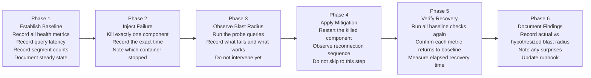
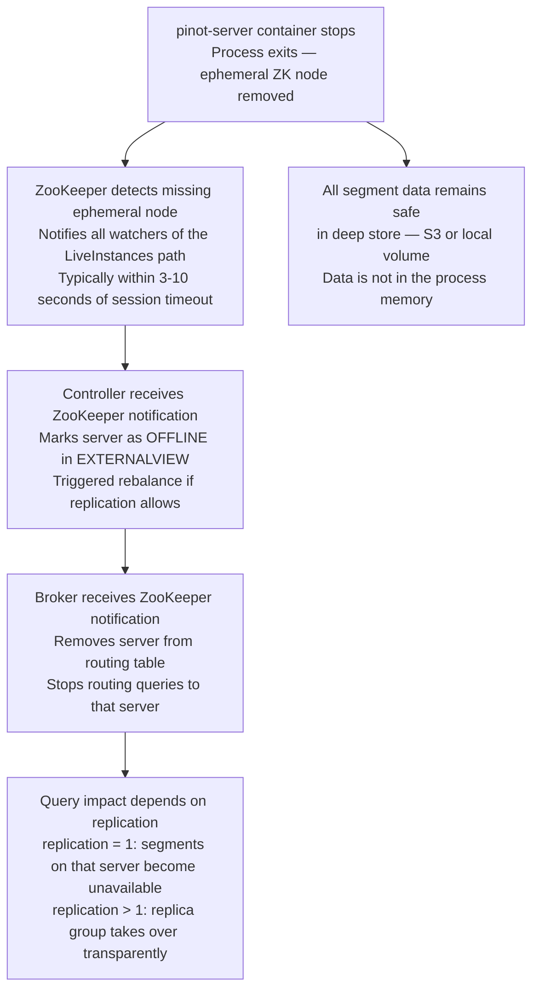
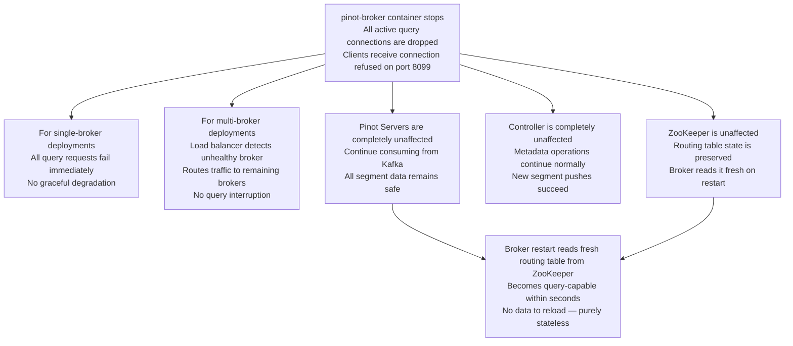
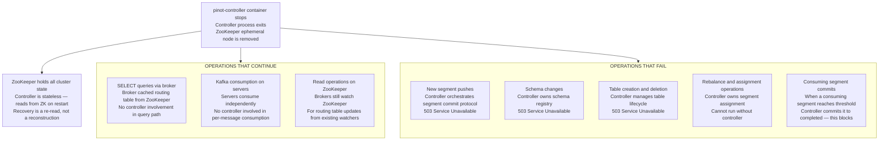
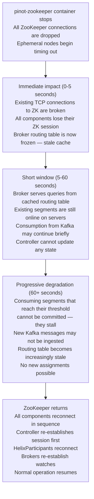

# Lab 13: Chaos Engineering and Cluster Recovery

## Overview

Resilience is not a property of the architecture diagram. It is a property of the system as it actually behaves under failure conditions. This lab treats that distinction seriously. You will establish a measurable baseline, then systematically kill each Pinot component one at a time, observe what breaks and what does not and follow a structured recovery procedure. Every experiment produces a recorded result. By the end, you will have first-hand evidence, not second-hand documentation, about how your cluster responds to each class of failure.

This lab follows the principles of chaos engineering as formalized by the chaos engineering community: start with a steady state, form a hypothesis, inject the failure, observe the actual outcome and compare it to the hypothesis. The gap between hypothesis and observation is where operational wisdom lives.

> [!NOTE]
> This lab requires all five containers from the local cluster — `pinot-zookeeper`, `pinot-kafka`, `pinot-controller`, `pinot-broker` and `pinot-server` — to be running with data loaded from Labs 1 through 3. Confirm cluster health before beginning any experiment.


## Learning Objectives

| Objective | Success Criterion |
|-----------|-------------------|
| Establish a pre-chaos baseline | All five health checks pass and baseline query latency is recorded |
| Characterize server failure blast radius | You can state which queries fail, which succeed and why, when the server is killed |
| Characterize broker failure blast radius | You can distinguish between data unavailability and query-path unavailability |
| Characterize controller failure blast radius | You can explain why SELECT queries continue but segment pushes fail during controller outage |
| Characterize ZooKeeper failure blast radius | You can explain the stale-cache window and why ZooKeeper monitoring is the highest priority |
| Execute recovery and measure recovery time | You have recorded time-to-recovery for all four experiments |
| Produce a blast radius summary | Your summary table contains accurate findings from all four experiments |


## The Chaos Engineering Methodology

Every experiment in this lab follows the same six-phase cycle. Skipping any phase, especially the observation phase, defeats the purpose. The observation step before applying mitigation is the most valuable and most frequently skipped step in production incident response.



The reason Phase 3 must precede Phase 4 is that observing the blast radius before intervening gives you real data about the failure mode. Teams that jump immediately to mitigation accumulate no knowledge about how their system actually fails. Chaos engineering is a knowledge-building practice first and a reliability practice second.


## Pre-Chaos Baseline Measurement

Run every command in this section and fill in your recorded values before starting any experiment. These values become your recovery verification targets. An experiment is not complete until the cluster returns to these baselines.

### Baseline Step 1 — Verify All Component Health

```bash
# Controller
curl -s http://localhost:9000/health

# Broker
curl -s http://localhost:8099/health

# Server
curl -s http://localhost:8098/health

# ZooKeeper — expects "imok" response
echo "ruok" | docker exec -i pinot-zookeeper nc localhost 2181

# Kafka — expects topic list
docker exec pinot-kafka kafka-topics --list --bootstrap-server localhost:9092
```

All five commands must return healthy signals before proceeding.

### Baseline Step 2 — Record Segment and Row Counts

Run these queries in the Pinot Query Console at **http://localhost:9000/#/query**.

```sql
SELECT COUNT(*) AS row_count FROM trip_events
```

```sql
SELECT COUNT(*) AS row_count FROM trip_state
```

```bash
# Segment count for trip_events
curl -s "http://localhost:9000/segments/trip_events_REALTIME" | python3 -m json.tool | python3 -c "import sys,json; d=json.load(sys.stdin); print(len(d.get('CONSUMING', []) + d.get('COMPLETED', [])))"

# Segment count for trip_state
curl -s "http://localhost:9000/segments/trip_state_REALTIME" | python3 -m json.tool | python3 -c "import sys,json; d=json.load(sys.stdin); print(len(d.get('CONSUMING', []) + d.get('COMPLETED', [])))"
```

### Baseline Step 3 — Record Query Latency Baseline

Run this query five times and record the `timeUsedMs` from Response Stats for each run. Calculate the average.

```sql
SELECT city, COUNT(*) AS trips, SUM(fare_amount) AS gmv
FROM trip_events
WHERE event_time_ms > NOW() - 86400000
GROUP BY city
ORDER BY gmv DESC
```

### Pre-Chaos Baseline Record

| Metric | Your Recorded Value |
|--------|---------------------|
| Controller health response | |
| Broker health response | |
| Server health response | |
| ZooKeeper `ruok` response | |
| `trip_events` row count | |
| `trip_state` row count | |
| `trip_events` segment count | |
| `trip_state` segment count | |
| Average query latency (`timeUsedMs`) | |
| Timestamp of baseline recording | |

Do not proceed until this table is complete.


## Experiment 1: Kill the Pinot Server

### What the Hypothesis Predicts

Before killing the server, write your prediction for each of these questions. Your actual observations may differ.

| Question | Your Hypothesis |
|----------|-----------------|
| Will SELECT queries succeed immediately after the server dies? | |
| What error will the broker return for affected segments? | |
| Will the controller UI still be accessible? | |
| Will the ZooKeeper EXTERNALVIEW change immediately? | |
| How long will recovery take after restart? | |

### What Actually Happens

When a Pinot Server disappears, four things happen in a specific sequence. Understanding the sequence is essential to interpreting what you observe.



The critical insight is that **data is never in the server process**. Segments are files on disk, loaded into memory for query acceleration. When the server process dies, the data files remain intact. Recovery is a reload operation, not a data reconstruction operation.

### Experiment 1 Execution

**Step 1.** Record the current time as `experiment_1_start`.

**Step 2.** Open the Controller UI at **http://localhost:9000** and navigate to Cluster Manager. Note the server in ONLINE state.

**Step 3.** Kill the server container.

```bash
docker stop pinot-server
```

**Step 4.** Immediately — within five seconds — run the probe queries below. Do not wait. Observation timing matters.

```sql
-- Probe query 1: Does the broker respond at all?
SELECT COUNT(*) FROM trip_events
```

```sql
-- Probe query 2: Does the broker return partial results or an error?
SELECT city, COUNT(*) AS trips
FROM trip_events
WHERE event_time_ms > NOW() - 86400000
GROUP BY city
ORDER BY trips DESC
```

```bash
-- Probe the broker health directly
curl -s http://localhost:8099/health
```

**Step 5.** Record what you observe. The broker itself remains healthy and returns a response. What that response contains depends on the replication factor. For a single-replica deployment, the BrokerResponse will include an `exceptions` array reporting that certain segments were not reachable. The `numSegmentsProcessed` count in the response will be lower than the baseline segment count.

**Step 6.** Navigate to the Controller UI Cluster Manager. After the ZooKeeper session timeout elapses, typically 30 to 60 seconds in the default configuration, the server's indicator will change from green to red. This is not an instant event. The ZooKeeper ephemeral node removal triggers the change.

**Step 7.** Inspect the EXTERNALVIEW in ZooKeeper.

```bash
docker exec pinot-zookeeper zkCli.sh -server localhost:2181 get /PinotCluster/EXTERNALVIEW/trip_events_REALTIME
```

The output is a JSON document mapping each segment to a server and its state. After the server goes offline, entries that were `ONLINE` against the dead server will transition to `OFFLINE`. This is the signal the broker reads to update its routing table.

**Step 8.** Fill in the observed blast radius for this experiment.

| Observation Point | What You Saw |
|-------------------|--------------|
| Broker health immediately after server kill | |
| Probe query 1 result (COUNT) | |
| Probe query 2 result (GROUP BY) | |
| BrokerResponse `exceptions` content | |
| Controller UI state after ZK timeout | |
| EXTERNALVIEW segment states | |

### Experiment 1 Recovery

**Step 9.** Start the server container and begin timing recovery.

```bash
docker start pinot-server
```

**Step 10.** Watch the server log to observe segment reload from deep store.

```bash
docker logs pinot-server --follow | grep -i "loaded\|loading\|consuming\|completed"
```

You will see log lines indicating each segment being loaded. Completed segments are loaded from the local volume. Consuming segments reconnect to Kafka and begin consuming from the committed offset.

**Step 11.** Poll the server health endpoint until it responds.

```bash
until curl -s http://localhost:8098/health | grep -q "OK"; do echo "Waiting for server..."; sleep 2; done; echo "Server is healthy"
```

**Step 12.** Run the full segment-count verification query against the Controller API and compare to your baseline.

```bash
curl -s "http://localhost:9000/segments/trip_events_REALTIME" | python3 -m json.tool | python3 -c "import sys,json; d=json.load(sys.stdin); print('COMPLETED:', len(d.get('COMPLETED', [])), 'CONSUMING:', len(d.get('CONSUMING', [])))"
```

**Step 13.** Record the recovery time and run all baseline queries to confirm full recovery.

| Recovery Metric | Value |
|-----------------|-------|
| Time from `docker start` to server health OK | |
| Time from health OK to all segments ONLINE in Controller UI | |
| Total experiment duration (kill to full recovery) | |
| `trip_events` row count after recovery | |
| Average query latency after recovery | |


## Experiment 2: Kill the Pinot Broker

### What Actually Happens

The broker failure is architecturally distinct from server failure because the broker is a stateless query router. It holds no data. Its entire routing state comes from ZooKeeper — a routing table it reads at startup and updates via ZooKeeper watch notifications.



The broker failure has the highest client impact for single-broker deployments but the lowest operational complexity for recovery. This asymmetry is a deliberate architectural choice. Keep query routing stateless so that broker restart is a sub-minute operation with zero data risk.

### Experiment 2 Execution

**Step 1.** Record the current time as `experiment_2_start`.

**Step 2.** Kill the broker container.

```bash
docker stop pinot-broker
```

**Step 3.** Attempt queries immediately from the Query Console. Note that the Query Console itself connects through the broker, so you will see a different failure mode than a raw curl request.

```bash
# Attempt a direct broker query via curl — this must fail with connection refused
curl -s -X POST \
  -H "Content-Type: application/json" \
  -d '{"sql": "SELECT COUNT(*) FROM trip_events"}' \
  http://localhost:8099/query/sql
```

**Step 4.** Verify that the controller and server remain unaffected.

```bash
# Controller must still respond
curl -s http://localhost:9000/health

# Server must still respond
curl -s http://localhost:8098/health
```

**Step 5.** Attempt to push a new segment to verify that admin operations through the controller are unaffected.

```bash
# The segment list endpoint — routed through controller, not broker
curl -s http://localhost:9000/segments/trip_events_REALTIME | python3 -m json.tool | head -20
```

This request succeeds because it goes to the controller on port 9000, not through the broker. Only analytical SQL queries require the broker.

**Step 6.** Record observations.

| Observation Point | What You Saw |
|-------------------|--------------|
| Curl query attempt result | |
| HTTP status code from broker port 8099 | |
| Controller health check result | |
| Server health check result | |
| Controller segment list result | |

### Experiment 2 Recovery

**Step 7.** Start the broker and begin timing.

```bash
docker start pinot-broker
```

**Step 8.** Watch the broker log for the routing table initialization sequence.

```bash
docker logs pinot-broker --follow | grep -i "routing\|instance\|started\|table" | head -30
```

The broker reads the full routing table from ZooKeeper immediately on startup. Unlike the server, there are no segments to load and no Kafka offset positions to recover. The broker is operationally ready within seconds of the process starting.

**Step 9.** Poll broker health and record the time to query availability.

```bash
until curl -s http://localhost:8099/health | grep -q "OK"; do echo "Waiting for broker..."; sleep 1; done; echo "Broker is healthy"
```

**Step 10.** Run a SELECT query immediately after the health check passes and confirm it returns results.

```sql
SELECT city, COUNT(*) AS trips FROM trip_events GROUP BY city ORDER BY trips DESC LIMIT 5
```

**Step 11.** Record recovery metrics.

| Recovery Metric | Value |
|-----------------|-------|
| Time from `docker start` to broker health OK | |
| Time from health OK to first successful query | |
| Total experiment duration (kill to first query) | |
| Contrast: how does this compare to server recovery time? | |


## Experiment 3: Kill the Pinot Controller

### What Actually Happens

The controller failure is the most operationally interesting experiment because it creates a split between two classes of operations: query serving and metadata management. Most users will not notice a controller failure immediately, because queries bypass the controller entirely.



The phrase "controller is stateless" deserves precision. The controller process itself holds no authoritative state — all cluster metadata lives in ZooKeeper. This design means controller recovery is fast: restart the process, reconnect to ZooKeeper, read current state, resume operation. No data migration, no manual reconciliation.

### Experiment 3 Execution

**Step 1.** Record the current time as `experiment_3_start`.

**Step 2.** Kill the controller container.

```bash
docker stop pinot-controller
```

**Step 3.** Immediately run a SELECT query. This is the most important observation in this experiment: queries must continue to work.

```sql
SELECT city, COUNT(*) AS trips, SUM(fare_amount) AS gmv
FROM trip_events
WHERE event_time_ms > NOW() - 86400000
GROUP BY city
ORDER BY trips DESC
```

Record whether the query succeeds, its `timeUsedMs` and whether the result matches the baseline values. In a correctly configured cluster, this query returns normally even with the controller offline.

**Step 4.** Attempt a segment push operation to confirm it fails.

```bash
# Attempt to reach the controller health endpoint
curl -s http://localhost:9000/health
```

**Step 5.** Attempt to add a new schema.

```bash
# This must fail with connection refused on port 9000
curl -s -X POST \
  -H "Content-Type: application/json" \
  -d '{"schemaName": "test_schema", "dimensionFieldSpecs": []}' \
  http://localhost:9000/schemas
```

**Step 6.** Attempt to list tables through the controller API.

```bash
curl -s http://localhost:9000/tables
```

**Step 7.** Record observations.

| Observation Point | What You Saw |
|-------------------|--------------|
| SELECT query result while controller is down | |
| SELECT query `timeUsedMs` while controller is down | |
| Controller health check HTTP status | |
| Schema push HTTP status | |
| Table list HTTP status | |
| Kafka consumption — did it continue? (check server logs) | |

To verify Kafka consumption continued, check the server log for ingestion activity.

```bash
docker logs pinot-server --tail=20 | grep -i "consuming\|ingested\|rows"
```

### Experiment 3 Recovery

**Step 8.** Start the controller and begin timing.

```bash
docker start pinot-controller
```

**Step 9.** Watch the controller log for the ZooKeeper reconnection and state re-read sequence.

```bash
docker logs pinot-controller --follow | grep -i "zookeeper\|state\|tables\|started\|helixmanager" | head -40
```

The controller connects to ZooKeeper, reads the current state of all tables and segments, reconstructs its in-memory view and begins processing the Helix state machine transitions that accumulated while it was offline. This reconciliation is automatic.

**Step 10.** Poll the controller health endpoint.

```bash
until curl -s http://localhost:9000/health | grep -q "OK"; do echo "Waiting for controller..."; sleep 2; done; echo "Controller is healthy"
```

**Step 11.** Verify that admin operations are restored.

```bash
# Must succeed after controller restarts
curl -s http://localhost:9000/tables | python3 -m json.tool
```

**Step 12.** Record recovery metrics.

| Recovery Metric | Value |
|-----------------|-------|
| Time from `docker start` to controller health OK | |
| Were queries affected during controller outage? | |
| Were queries affected during controller restart? | |
| Total experiment duration (kill to admin operations restored) | |


## Experiment 4: Kill ZooKeeper

### What Actually Happens

ZooKeeper failure is the most severe experiment. ZooKeeper is not a query component — queries do not pass through it — but it is the coordination substrate that every other component depends on for state updates. The failure manifests as progressive degradation rather than immediate outage.



The critical insight is that ZooKeeper failure degrades the system gradually rather than stopping it instantly. The system has built-in resilience through cached state, but that resilience has a time limit. After ZooKeeper is down long enough, components begin failing in cascade: consuming segments stall, routing tables become stale and the cluster loses its ability to adapt to changes.

### Experiment 4 Execution

**Step 1.** Record the current time as `experiment_4_start`. This experiment requires precise timing observations.

**Step 2.** Kill ZooKeeper.

```bash
docker stop pinot-zookeeper
```

**Step 3.** Run probe queries immediately — within 10 seconds of the kill.

```sql
SELECT city, COUNT(*) AS trips FROM trip_events GROUP BY city ORDER BY trips DESC LIMIT 5
```

Record the result and `timeUsedMs`. The query likely succeeds on cached routing.

**Step 4.** Wait 30 seconds without intervening. Run probe queries again.

```sql
SELECT COUNT(*) FROM trip_events
```

Record the result. Compare to the baseline.

**Step 5.** Check ZooKeeper connectivity from within the controller container.

```bash
docker logs pinot-controller --tail=30 | grep -i "zookeeper\|disconnected\|session\|error"
```

**Step 6.** Attempt a table list operation on the controller.

```bash
curl -s http://localhost:9000/tables
```

Record the result. The controller may return stale data from its in-memory cache or return an error depending on timing.

**Step 7.** Wait until 60 seconds have elapsed since the kill. Run probe queries a third time.

```sql
SELECT COUNT(*) FROM trip_events
```

Record whether behavior changed from the 30-second observation.

**Step 8.** Record your time-series observations.

| Time Since Kill | Query Result | Notes |
|-----------------|--------------|-------|
| 0-10 seconds | | |
| 30 seconds | | |
| 60 seconds | | |
| 90 seconds | | |

### Experiment 4 Recovery

**Step 9.** Start ZooKeeper and immediately begin watching the controller log for the reconnection cascade.

```bash
docker start pinot-zookeeper
docker logs pinot-controller --follow | grep -i "zookeeper\|reconnect\|connected\|session" | head -30
```

**Step 10.** After the controller reconnects, watch the broker log for its reconnection.

```bash
docker logs pinot-broker --follow | grep -i "zookeeper\|routing\|instance\|connected" | head -30
```

**Step 11.** Poll until all health endpoints are green.

```bash
until curl -s http://localhost:9000/health | grep -q "OK" && curl -s http://localhost:8099/health | grep -q "OK" && curl -s http://localhost:8098/health | grep -q "OK"; do echo "Waiting for full cluster recovery..."; sleep 3; done; echo "All components healthy"
```

**Step 12.** Run all baseline queries and record final recovery metrics.

| Recovery Metric | Value |
|-----------------|-------|
| Time from ZK restart to controller reconnected | |
| Time from ZK restart to broker reconnected | |
| Time from ZK restart to first successful query | |
| Total experiment duration (kill to full recovery) | |


## Blast Radius Summary

Complete this table after all four experiments are finished. These are your empirical findings — not the documentation's claims about how the system behaves, but what you actually observed in your cluster.

| Component Killed | Queries Affected | Admin Operations Affected | Data Safety | Observed Recovery Time | Recovery Action |
|------------------|:----------------:|:-------------------------:|:-----------:|:----------------------:|-----------------|
| `pinot-server` | | | | | |
| `pinot-broker` | | | | | |
| `pinot-controller` | | | | | |
| `pinot-zookeeper` | | | | | |

Fill in the Data Safety column with one of: **No risk** (data never in danger), **Reduced availability** (data on disk, temporarily inaccessible) or **Degraded freshness** (ingestion stalled, existing data safe).


## Chaos Gameday Planning Template

A chaos gameday is a structured, time-boxed session where an engineering team deliberately induces failures in a non-production environment and records what they learn. Use this template to plan your next gameday.

### Gameday Preparation

| Planning Item | Notes |
|---------------|-------|
| Target environment | Staging cluster, not production |
| Date and time window | During low-traffic period with engineering team available |
| Rollback procedure | Pre-verified before gameday begins |
| Monitoring dashboards | Open and displaying live metrics before first failure injection |
| Participants | At minimum: one engineer running experiments, one observing and recording |
| Communication channel | Team channel where observations are posted in real time |

### Experiment Runsheet Template

For each experiment, define the following before the day begins.

| Field | Definition |
|-------|------------|
| Experiment name | Short descriptive label |
| Hypothesis | What you predict will happen, stated precisely |
| Steady-state metric | The specific metric that confirms normal operation |
| Failure injection command | The exact command that will be run |
| Observation period | How long to observe before intervening |
| Abort conditions | If this happens during observation, stop and recover immediately |
| Recovery procedure | Exact steps to restore steady state |
| Success criteria | What must be true to declare the experiment complete |

### Post-Gameday Documentation

After each gameday, produce a findings document with the following sections.

1. For each experiment, the actual blast radius compared to the hypothesis.
2. Any behavior that was surprising or differed from documentation.
3. Monitoring gaps discovered — failure conditions that did not trigger any alert.
4. Runbook gaps discovered — recovery steps that were unclear or missing.
5. Action items with owners and target dates.


## Reflection Prompts

1. In Experiment 1, the ZooKeeper session timeout determines how quickly the broker updates its routing table after the server dies. The default ZooKeeper session timeout is 30 seconds. What are the trade-offs of reducing this to 5 seconds? What are the trade-offs of increasing it to 120 seconds?

2. In Experiment 3, SELECT queries continue to work during a controller outage because the broker caches its routing table. Describe a scenario where this cached routing becomes incorrect — that is, where the broker routes a query to a segment location that is no longer valid — and what the client observes when that happens.

3. You run Experiment 4 and observe that queries succeeded for 45 seconds after ZooKeeper was killed, then began failing. A colleague runs the same experiment on a different cluster and observes that queries began failing after only 8 seconds. What are the two most likely configuration differences that explain this discrepancy?

4. After completing all four experiments, rank the four components by their contribution to query availability and write a one-paragraph monitoring priority rationale that explains to a new team member which component deserves the most aggressive alerting and why the ranking is not simply based on "how fast queries fail."


[Previous: Lab 8 — SLO and Incident Drill](lab-08-slo-incident.md) | [Next: Lab 14 — Fraud Detection Analytics](lab-14-fraud-detection.md)
