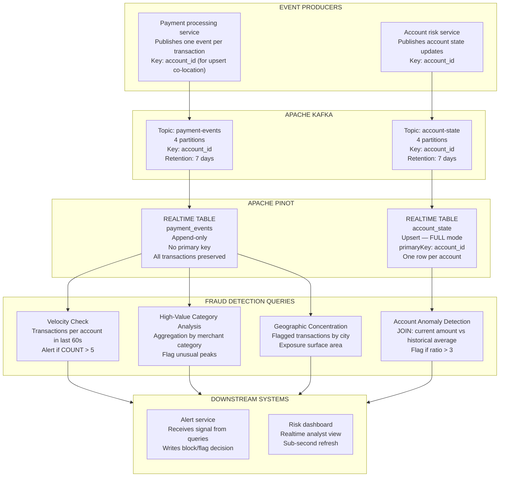

# Lab 14: Fraud Detection Analytics

## Overview

Every data engineering pattern taught in this series was introduced in the context of rides and commerce analytics. This lab breaks that frame deliberately. The goal is to demonstrate that the same architectural primitives, including append-only fact tables, upsert state tables, inverted indexes on categorical dimensions, real-time stream ingestion and sub-100ms aggregation queries, generalize cleanly to an entirely different problem domain.

The domain here is financial fraud detection. A payments platform needs to identify suspicious transaction patterns within seconds of occurrence: cards used too many times in a short window, amounts that are outliers against an account's own history, geographic concentration of flagged activity. These are analytically straightforward questions, but they must be answered in real time against a continuously arriving event stream, at the latency and freshness requirements of a fraud prevention system.

By the end of this lab, you will have a working schema, a running ingestion pipeline and four executable fraud detection queries. You will also have measured their latency and proposed the index configuration that meets the fraud SLO.

> [!NOTE]
> This lab introduces new Kafka topics and Pinot tables that do not exist in the preceding labs. Follow the setup steps in order. The payment data generator creates synthetic events. No real financial data is used.


## Learning Objectives

| Objective | Success Criterion |
|-----------|-------------------|
| Apply Pinot schema design to a new domain | You can explain each field type choice in the `payment_events` schema |
| Design an upsert state table for account-level context | Your `account_state` schema has a correct `primaryKeyColumns` declaration |
| Run real-time velocity detection | Query 1 returns accounts with transaction counts above the threshold within 60 seconds |
| Run account-level anomaly detection | Query 3 returns transactions with `amount_ratio` above 3 using a JOIN against `account_state` |
| Measure fraud query latency | Your latency table has recorded values for all four queries |
| Define a domain-specific SLO | You can state the freshness and latency SLOs for this fraud system and explain why those thresholds were chosen |
| Map the fraud pattern to other domains | You can describe how velocity detection maps to ad-tech, e-commerce and IoT use cases |


## The Fraud Detection Architecture

The architecture follows the same pipeline shape as the rides platform. Events arrive in Kafka, Pinot consumes them in real time and analytical queries run against Pinot. But the semantic roles of the tables are different. The `payment_events` table is the raw audit log of every transaction, structured for time-series aggregation. The `account_state` table is the mutable, upserted view of each account's current risk profile, structured for point lookups and joins.



The two Pinot tables serve different roles in fraud analytics. `payment_events` answers temporal aggregation questions: how many transactions occurred in this window, what was the distribution of amounts, where were they geographically. `account_state` answers account-context questions: what is the normal spending level for this account, what is its current risk flag status. Query 3 joins these two tables to compare real-time transaction amounts against each account's historical baseline.


## Schema Design Exercise

Before reading the solution, work through this exercise independently. The schema you design determines which queries are fast, which are possible at all and which will require reingestion to fix.

### The Design Challenge

You are building a Pinot schema for `payment_events`. The table must efficiently support the following four query patterns.

**Velocity checks.** Count how many transactions a given `account_id` generated in the last 60 seconds. This requires time-range filtering on `event_time_ms` and grouping by `account_id`.

**Geographic velocity.** Identify transactions where the same card was used in two geographically distant cities within a short time window. This requires filtering by `country` and `city` with temporal range predicates.

**Amount anomaly detection.** Compare a single transaction's `amount` against that account's 30-day rolling average. This amount will come from `account_state` via a JOIN, but the current transaction's `amount` must be a metric field in `payment_events`.

**Merchant category analysis.** Aggregate flagged transactions by `merchant_category` to identify which categories are seeing elevated fraud rates. This is a GROUP BY on a low-cardinality categorical dimension.

Answer the following questions before looking at the solution schema.

| Design Question | Your Answer |
|-----------------|-------------|
| What is the `dateTimeField` for this table? | |
| Which fields belong in `dimensionFieldSpecs`? | |
| Which fields belong in `metricFieldSpecs`? | |
| What is the data type for `amount`? | |
| What index would you put on `account_id`? Why? | |
| What index would you put on `merchant_category`? Why? | |
| What index would you put on `country` and `city`? Why? | |
| What index would you put on `event_time_ms`? Why? | |
| What index would you put on `transaction_id`? Why? | |
| Does this table need a `primaryKeyColumns` declaration? Why? | |

Fill in your answers before continuing to the solution.


## Schema Solution: payment_events

The solution schema below reflects the design decisions explained field by field in the table that follows.

```json
{
  "schemaName": "payment_events",
  "enableColumnBasedNullHandling": true,
  "dimensionFieldSpecs": [
    {
      "name": "transaction_id",
      "dataType": "STRING"
    },
    {
      "name": "account_id",
      "dataType": "STRING"
    },
    {
      "name": "card_token",
      "dataType": "STRING"
    },
    {
      "name": "merchant_id",
      "dataType": "STRING"
    },
    {
      "name": "merchant_category",
      "dataType": "STRING"
    },
    {
      "name": "merchant_name",
      "dataType": "STRING"
    },
    {
      "name": "country",
      "dataType": "STRING"
    },
    {
      "name": "city",
      "dataType": "STRING"
    },
    {
      "name": "currency",
      "dataType": "STRING"
    },
    {
      "name": "payment_method",
      "dataType": "STRING"
    },
    {
      "name": "transaction_status",
      "dataType": "STRING"
    },
    {
      "name": "is_flagged",
      "dataType": "BOOLEAN"
    },
    {
      "name": "flag_reason",
      "dataType": "STRING"
    },
    {
      "name": "device_fingerprint",
      "dataType": "STRING"
    },
    {
      "name": "ip_country",
      "dataType": "STRING"
    },
    {
      "name": "channel",
      "dataType": "STRING"
    }
  ],
  "metricFieldSpecs": [
    {
      "name": "amount",
      "dataType": "DOUBLE"
    },
    {
      "name": "amount_usd",
      "dataType": "DOUBLE"
    },
    {
      "name": "exchange_rate",
      "dataType": "DOUBLE"
    },
    {
      "name": "processing_latency_ms",
      "dataType": "INT"
    }
  ],
  "dateTimeFieldSpecs": [
    {
      "name": "event_time_ms",
      "dataType": "LONG",
      "format": "1:MILLISECONDS:EPOCH",
      "granularity": "1:MILLISECONDS"
    }
  ]
}
```

### Design Decision Rationale

| Field | Classification | Reasoning |
|-------|---------------|-----------|
| `transaction_id` | DIMENSION / STRING | High cardinality unique identifier. Bloom filter at the table level will enable segment elimination for point lookups. No inverted index — the cardinality is too high. |
| `account_id` | DIMENSION / STRING | The primary grouping key for velocity checks. Inverted index required for fast equality filtering. Also the JOIN key against `account_state`. |
| `merchant_category` | DIMENSION / STRING | Low cardinality (~20 categories). Inverted index maps each category value to its row set, making GROUP BY and equality filters sub-millisecond. |
| `country` / `city` | DIMENSION / STRING | Geographic filter dimensions used in Query 4. Inverted index on both. Cardinality is moderate (200 countries, thousands of cities). |
| `is_flagged` | DIMENSION / BOOLEAN | Used in WHERE predicates for geographic concentration queries. Inverted index on boolean columns is very compact and extremely fast. |
| `amount` | METRIC / DOUBLE | The transaction value being analyzed. Metric fields support SUM, AVG, MAX, MIN aggregations. Range index enables `amount > 1000` filters. |
| `amount_usd` | METRIC / DOUBLE | USD-normalized amount for cross-currency comparisons. Kept separate to avoid post-hoc conversion at query time. |
| `event_time_ms` | DATETIME | The primary time dimension. Millisecond epoch format aligns with Kafka message timestamps. Used for all time-window predicates and segment pruning. |
| `transaction_id` | No primary key | `payment_events` is an append-only audit table. Each transaction event is a new row. There is no upsert semantics because the historical record of every event must be preserved. |


## Schema Solution: account_state

The `account_state` table is the upsert counterpart to `payment_events`. It holds exactly one row per account and maintains the current risk profile for each account. When a new risk assessment arrives, the row for that account is updated in place.

```json
{
  "schemaName": "account_state",
  "enableColumnBasedNullHandling": true,
  "primaryKeyColumns": [
    "account_id"
  ],
  "dimensionFieldSpecs": [
    {
      "name": "account_id",
      "dataType": "STRING"
    },
    {
      "name": "account_holder_name",
      "dataType": "STRING"
    },
    {
      "name": "account_status",
      "dataType": "STRING"
    },
    {
      "name": "risk_tier",
      "dataType": "STRING"
    },
    {
      "name": "home_country",
      "dataType": "STRING"
    },
    {
      "name": "preferred_currency",
      "dataType": "STRING"
    },
    {
      "name": "is_blocked",
      "dataType": "BOOLEAN"
    },
    {
      "name": "block_reason",
      "dataType": "STRING"
    },
    {
      "name": "kyc_tier",
      "dataType": "STRING"
    }
  ],
  "metricFieldSpecs": [
    {
      "name": "avg_30d_amount",
      "dataType": "DOUBLE"
    },
    {
      "name": "avg_7d_amount",
      "dataType": "DOUBLE"
    },
    {
      "name": "tx_count_30d",
      "dataType": "INT"
    },
    {
      "name": "tx_count_7d",
      "dataType": "INT"
    },
    {
      "name": "total_flagged_30d",
      "dataType": "INT"
    },
    {
      "name": "max_single_tx_30d",
      "dataType": "DOUBLE"
    },
    {
      "name": "last_known_score",
      "dataType": "DOUBLE"
    },
    {
      "name": "state_version",
      "dataType": "LONG"
    }
  ],
  "dateTimeFieldSpecs": [
    {
      "name": "last_updated_ms",
      "dataType": "LONG",
      "format": "1:MILLISECONDS:EPOCH",
      "granularity": "1:MILLISECONDS"
    }
  ]
}
```

The `state_version` field serves as the `comparisonColumns` value in the upsert configuration. When two state updates arrive for the same `account_id`, the one with the higher `state_version` wins. This prevents a late-arriving stale update from overwriting a more recent assessment.

The `avg_30d_amount` field is the key enabler of Query 3. Rather than computing rolling averages at query time, which would require scanning all 30 days of `payment_events` on every fraud check, the account risk service pre-computes this value and publishes it as part of each state update. The query simply reads the pre-computed value and divides.


## Step 1: Create Kafka Topics

Run these commands to create the two topics for this lab.

```bash
# Create payment-events topic
docker exec pinot-kafka kafka-topics \
  --create \
  --topic payment-events \
  --bootstrap-server localhost:9092 \
  --partitions 4 \
  --replication-factor 1

# Create account-state topic
docker exec pinot-kafka kafka-topics \
  --create \
  --topic account-state \
  --bootstrap-server localhost:9092 \
  --partitions 4 \
  --replication-factor 1

# Verify both topics exist
docker exec pinot-kafka kafka-topics \
  --list \
  --bootstrap-server localhost:9092 | grep -E "payment|account"
```

Expected output.

```
account-state
payment-events
```


## Step 2: Create the Pinot Tables

Add the two schemas to Pinot, then create their corresponding table configurations.

```bash
# Add payment_events schema
curl -s -X POST \
  -H "Content-Type: application/json" \
  -d @schemas/payment_events.schema.json \
  http://localhost:9000/schemas | python3 -m json.tool

# Add account_state schema
curl -s -X POST \
  -H "Content-Type: application/json" \
  -d @schemas/account_state.schema.json \
  http://localhost:9000/schemas | python3 -m json.tool
```

Expected response for each.

```json
{
  "status": "payment_events successfully added"
}
```

```bash
# Create payment_events table
curl -s -X POST \
  -H "Content-Type: application/json" \
  -d @tables/payment_events_rt.table.json \
  http://localhost:9000/tables | python3 -m json.tool

# Create account_state table
curl -s -X POST \
  -H "Content-Type: application/json" \
  -d @tables/account_state_rt.table.json \
  http://localhost:9000/tables | python3 -m json.tool
```

Navigate to **http://localhost:9000** and verify that `payment_events_REALTIME` and `account_state_REALTIME` appear in the Tables list.


## Step 3: Generate Synthetic Payment Data

The data generator creates a continuous stream of realistic payment events and publishes them to both Kafka topics. Events include a mix of normal transactions and pre-seeded suspicious patterns: one account will generate 8 transactions in 60 seconds, several accounts will have transactions significantly above their 30-day average and flagged transactions will cluster in two cities.

```bash
python3 scripts/generate_payment_events.py \
  --bootstrap-server localhost:9092 \
  --payment-topic payment-events \
  --account-topic account-state \
  --num-accounts 500 \
  --events-per-second 20 \
  --duration-seconds 120
```

While the generator runs, watch ingestion progress in the Controller UI. Navigate to `payment_events_REALTIME` and click the Segments tab. The consuming segment row count will increment in real time.

You can also watch ingestion directly via the Query Console.

```sql
SELECT COUNT(*) AS events_ingested FROM payment_events
```

Re-run this query every 10 seconds. The count should grow at approximately 20 events per second.


## Step 4: Run the Fraud Detection Queries

Open the Pinot Query Console at **http://localhost:9000/#/query** and run each query below. After each query, expand Response Stats and record the values in the latency measurement table at the end of this section.

### Query 1 — Velocity Check

This query identifies accounts that have generated more than 5 transactions in the last 60 seconds. A real fraud system would parameterize both the window and the threshold, but the SQL pattern is identical.

```sql
SELECT
  account_id,
  COUNT(*) AS tx_count,
  SUM(amount) AS total_amount
FROM payment_events
WHERE event_time_ms > NOW() - 60000
GROUP BY account_id
HAVING COUNT(*) > 5
ORDER BY tx_count DESC
```

The velocity check is the simplest and most common fraud signal. It works because human card holders very rarely generate more than five transactions per minute, while bots and card-testing attacks generate dozens. The 60-second window ensures fresh results. Any account that stopped its burst activity more than a minute ago drops out of the result set automatically.

If you seeded the generator with the default parameters, at least one account in the result should show a `tx_count` of 8.

### Query 2 — High-Value Transactions by Category

This query aggregates transactions above USD 1,000 by merchant category over the last hour, surfacing categories with unusually high maximum amounts.

```sql
SELECT
  merchant_category,
  COUNT(*) AS tx_count,
  AVG(amount) AS avg_amount,
  MAX(amount) AS max_amount
FROM payment_events
WHERE event_time_ms > NOW() - 3600000
AND amount > 1000
GROUP BY merchant_category
ORDER BY max_amount DESC
```

The merchant category dimension is where fraud analysts start when investigating card-not-present fraud. Luxury goods, electronics and gift card categories consistently show the highest fraud rates because these items are easily resold. This query produces the category-level summary that a fraud analyst would review at the start of an investigation.

### Query 3 — Account-Level Anomaly Detection

This query joins the real-time transaction stream against the account state table to identify transactions whose amount is more than three times the account's 30-day average spending level.

```sql
SELECT
  p.account_id,
  p.amount,
  p.merchant_category,
  p.city,
  p.country,
  a.avg_30d_amount,
  ROUND(p.amount / a.avg_30d_amount, 2) AS amount_ratio
FROM payment_events p
JOIN account_state a ON p.account_id = a.account_id
WHERE p.event_time_ms > NOW() - 300000
AND a.avg_30d_amount > 0
HAVING amount_ratio > 3
ORDER BY amount_ratio DESC
```

This query requires the Multi-Stage Engine because it contains a JOIN. Enable the Multi-Stage setting in the Query Console before running it. If the single-stage engine is selected, the query will return an error.

The `HAVING amount_ratio > 3` clause filters to transactions where the amount is at least three times the account's historical average. This threshold is tunable. A threshold of 2 produces more alerts with a higher false-positive rate. A threshold of 5 produces fewer alerts but may miss borderline cases. For the synthetic dataset, the generator creates several accounts with anomalous transactions at ratios between 4 and 8.

### Query 4 — Geographic Concentration

This query surfaces cities with high concentrations of flagged transactions in the last 30 minutes, showing total exposure by city.

```sql
SELECT
  country,
  city,
  COUNT(*) AS suspicious_txns,
  SUM(amount) AS total_exposure
FROM payment_events
WHERE event_time_ms > NOW() - 1800000
AND is_flagged = true
GROUP BY country, city
ORDER BY suspicious_txns DESC
```

Geographic concentration analysis identifies regional fraud campaigns — attacks that target a specific city's merchant network or money mule networks operating from a specific location. The 30-minute window is chosen to distinguish active ongoing campaigns from historical activity. The `is_flagged` filter narrows the result to transactions already identified by upstream rule engines, so this query is an aggregation over confirmed signals rather than a raw detection.


## Latency Measurement Table

After running all four queries, record the execution statistics from Response Stats.

| Query | `timeUsedMs` | `numDocsScanned` | `numSegmentsQueried` | `numSegmentsMatched` | Indexes Used |
|-------|:------------:|:----------------:|:--------------------:|:--------------------:|--------------|
| Query 1 — Velocity Check | | | | | |
| Query 2 — High-Value Category | | | | | |
| Query 3 — Account Anomaly (JOIN) | | | | | |
| Query 4 — Geographic Concentration | | | | | |

Pay attention to the contrast between Query 3 (which uses the Multi-Stage Engine for the JOIN) and Queries 1, 2 and 4 (which use the single-stage engine). The JOIN adds shuffle overhead but enables a class of analysis that is impossible in the single-stage engine.


## Index Optimization Exercise

Before reading the recommended configuration below, answer the following questions based on the four queries you just ran.

| Question | Your Answer |
|----------|-------------|
| Which columns appear in WHERE equality predicates across all four queries? | |
| Which column appears in the most time-range predicates? | |
| Which column is the JOIN key in Query 3? | |
| Which column has the highest cardinality: `account_id`, `merchant_category` or `city`? | |
| Which index type would best serve a `WHERE is_flagged = true` predicate? | |
| Would a star-tree index help Query 2? What configuration would be required? | |
| Is a bloom filter on `transaction_id` useful for any of the four fraud queries? | |

Fill in your answers, then compare to the recommended configuration.

### Recommended Index Configuration for payment_events

```json
"tableIndexConfig": {
  "invertedIndexColumns": [
    "account_id",
    "merchant_category",
    "country",
    "city",
    "transaction_status",
    "is_flagged",
    "payment_method",
    "channel"
  ],
  "rangeIndexColumns": [
    "event_time_ms",
    "amount",
    "amount_usd"
  ],
  "bloomFilterColumns": [
    "transaction_id",
    "account_id",
    "card_token"
  ],
  "starTreeIndexConfigs": [
    {
      "dimensionsSplitOrder": [
        "merchant_category",
        "country",
        "city",
        "is_flagged"
      ],
      "functionColumnPairs": [
        "COUNT__*",
        "SUM__amount",
        "SUM__amount_usd",
        "MAX__amount"
      ],
      "maxLeafRecords": 10000
    }
  ]
}
```

### Configuration Decision Analysis

| Index | Applied To | Query Benefit | Reasoning |
|-------|-----------|---------------|-----------|
| Inverted | `account_id` | Query 1, Query 3 | The velocity check groups by `account_id` and the JOIN key benefits from fast equality matching. Cardinality is high but inverted index still accelerates equality predicates over full scans. |
| Inverted | `merchant_category` | Query 2 | Low cardinality (approximately 20 categories). Every GROUP BY on this column benefits. The row set per category is compact and retrieved without scanning. |
| Inverted | `country`, `city` | Query 4 | Geographic dimensions used in GROUP BY and WHERE equality predicates. Inverted index makes `WHERE country = 'US'` a bitmap lookup. |
| Inverted | `is_flagged` | Query 4 | Boolean column with exactly two values. The row set for `is_flagged = true` is a compact bitmap. This is one of the cheapest inverted indexes in terms of storage. |
| Range | `event_time_ms` | All four queries | Every fraud query uses a time window. The range index enables binary search on the time dimension. Combined with segment pruning, this eliminates most segments before server contact. |
| Range | `amount`, `amount_usd` | Query 2, Query 3 | Query 2 filters `amount > 1000`. Range index turns this into a binary search rather than a row-by-row comparison. |
| Bloom filter | `transaction_id` | Not the four fraud queries | Point lookups by transaction ID are common in fraud investigation (look up a specific transaction). The bloom filter eliminates segments that do not contain a given ID. |
| Bloom filter | `account_id` | Supplements inverted index | For point lookups of a single account's history, the bloom filter eliminates entire segments before the inverted index is applied. |
| Star-tree | `merchant_category`, `country`, `city`, `is_flagged` | Query 2, Query 4 | Pre-aggregates COUNT, SUM(amount) and MAX(amount) across the geographic and category dimensions. Query 2 and Query 4 read pre-computed nodes rather than scanning rows. |

The star-tree configuration above pre-aggregates the exact metrics used in Query 2 and Query 4. When those queries run, Pinot reads tree nodes instead of raw rows. For a table with 100 million events, this difference is the gap between a 300ms query and a 5ms query.

### Recommended Index Configuration for account_state

```json
"tableIndexConfig": {
  "invertedIndexColumns": [
    "account_status",
    "risk_tier",
    "home_country",
    "is_blocked",
    "kyc_tier"
  ],
  "rangeIndexColumns": [
    "last_updated_ms",
    "avg_30d_amount",
    "last_known_score"
  ],
  "bloomFilterColumns": [
    "account_id"
  ]
},
"routing": {
  "instanceSelectorType": "strictReplicaGroup"
}
```

The `strictReplicaGroup` routing is mandatory for upsert tables. Without it, a query might hit different replicas for different segments of `account_state`, which can return inconsistent views of the same account's state.


## The SLO for Fraud Detection

A fraud detection system has more demanding freshness and latency requirements than most analytics systems, because the value of a fraud signal decays with time. A signal delivered 30 seconds after a fraudulent transaction is more actionable than the same signal delivered 5 minutes later.

### Freshness SLO

| Field | Specification |
|-------|---------------|
| Objective | A completed payment transaction must be queryable in Pinot within 5 seconds of publication to Kafka |
| SLI | `(NOW() - MAX(event_time_ms)) / 1000` in seconds, measured against the `payment_events` table |
| Measurement query | `SELECT ROUND((NOW() - MAX(event_time_ms)) / 1000.0, 1) AS lag_seconds FROM payment_events` |
| Good threshold | `lag_seconds` below 5 |
| Alert threshold | `lag_seconds` above 10 for more than 30 seconds |
| Owner | Data Platform Engineering |
| Escalation | If lag exceeds 30 seconds, page on-call. Investigate Kafka consumer lag, server consuming segment status and Kafka broker health in that order. |

Run the freshness measurement now.

```sql
SELECT
  MAX(event_time_ms) AS latest_event_ms,
  NOW() AS current_time_ms,
  ROUND((NOW() - MAX(event_time_ms)) / 1000.0, 1) AS lag_seconds
FROM payment_events
```

For a live streaming workload with the generator running, `lag_seconds` should be below 5. For the synthetic dataset loaded without active streaming, the value reflects the time since the last event was generated.

### Latency SLO

| Fraud Query Type | p99 Latency Target | Rationale |
|------------------|--------------------|-----------|
| Velocity check (Query 1) | < 50ms | Called on every card authorization attempt by the real-time decisioning engine |
| Category analysis (Query 2) | < 100ms | Called by the fraud analyst dashboard refresh loop every 5 seconds |
| Account anomaly with JOIN (Query 3) | < 200ms | Called for flagged transactions requiring enriched context before blocking |
| Geographic concentration (Query 4) | < 100ms | Called by the risk operations dashboard at 10-second intervals |

The velocity check has the tightest latency requirement because it sits in the synchronous authorization path. The account anomaly query gets more latitude because it is triggered only for transactions already flagged by the velocity check, making it an asynchronous enrichment rather than a blocking gate.

### SLO Measurement

Record your measured `timeUsedMs` values against the targets.

| Query | p99 Target | Your Measured `timeUsedMs` | Within SLO? |
|-------|:----------:|:--------------------------:|:-----------:|
| Velocity Check | 50ms | | |
| High-Value Category | 100ms | | |
| Account Anomaly (JOIN) | 200ms | | |
| Geographic Concentration | 100ms | | |

If any query exceeds its target, return to the index optimization section and verify that the recommended configuration has been applied to the table.


## Applying the Fraud Pattern to Other Domains

The four query patterns introduced in this lab are not specific to financial fraud. They are general patterns for detecting anomalous behavior in event streams and they appear across every domain that Pinot is deployed in.

| Fraud Pattern | What It Detects | Ad-Tech Equivalent | E-Commerce Equivalent | IoT Equivalent |
|---------------|-----------------|--------------------|-----------------------|----------------|
| Velocity check (COUNT in window) | Too many transactions per account | Click velocity per user per ad campaign | Add-to-cart rate per session exceeding bot threshold | Sensor reading frequency above hardware maximum |
| High-value outlier by category | Unusual spend in specific merchant categories | CPM spike in a specific publisher category | Order value spike in a specific product category | Power consumption spike in a specific device class |
| Account-level anomaly (JOIN to state table) | Current transaction vs historical baseline for that account | Current CTR vs 30-day average CTR for that placement | Current session basket size vs customer's 90-day average | Current temperature reading vs device's calibration baseline |
| Geographic concentration of flagged events | Spatial clustering of confirmed fraud | Impression concentration in low-quality traffic geo | Return request concentration in specific fulfillment zone | Fault signal clustering in specific physical grid zone |

The schema patterns generalize equally well. An append-only fact table holds the immutable event stream. A upsert state table holds the current mutable context per entity (account, user, device, placement). The fraud detection queries become click fraud detection queries, inventory manipulation detection queries or sensor anomaly detection queries by substituting the domain-specific field names.

This generalization is the core lesson of this lab. The Pinot architectural patterns you have learned are not specific to any domain. They are a general-purpose framework for answering real-time analytical questions against continuously arriving event data.


## Reflection Prompts

1. Query 3 (account anomaly detection) uses a JOIN between `payment_events` and `account_state`. The `avg_30d_amount` in `account_state` is pre-computed by an upstream service and upserted as part of each account state update. What are the failure modes of this design — specifically, what happens to fraud detection quality if the account state update pipeline falls behind by 5 minutes? How would you detect this lag?

2. The velocity check window of 60 seconds is a design choice, not a physical constraint. Describe what happens to the `numDocsScanned` and `timeUsedMs` metrics if the window is changed from 60 seconds to 3600 seconds (one hour). What index configuration change would partially mitigate the performance impact?

3. The `is_flagged` boolean dimension is set by an upstream rule engine before the event is published to Kafka. This means that Query 4 is reporting on transactions that were already identified as suspicious, rather than detecting new fraud signals. Describe a detection approach using only the fields available in `payment_events` that does not depend on the upstream `is_flagged` signal.

4. You are asked to extend the fraud detection system to support geo-velocity detection: alerting when the same `card_token` is used in two cities that are more than 500 kilometers apart within a 30-minute window. Describe what changes to the schema, the ingestion pipeline and the query pattern would be required to implement this signal in Pinot and identify the parts of this problem that cannot be solved with Pinot SQL alone.


[Previous: Lab 13 — Chaos Engineering and Cluster Recovery](lab-13-chaos-engineering.md) | [Return to README](../README.md)
