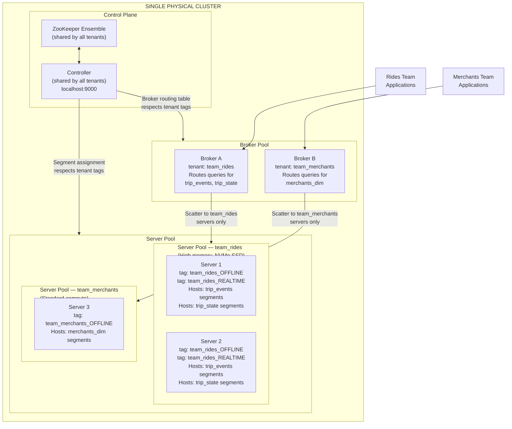

# Lab 15: Multi-Tenancy and Workload Isolation

## Overview

A production Apache Pinot cluster serves multiple teams simultaneously. An analytics team running hour-long exploration queries shares the same physical hardware as a product team serving sub-100ms dashboard requests. Without workload isolation, a single expensive query can saturate shared server CPU and destroy latency for every other caller on the cluster.

Pinot's tenant model solves this problem through tagged resource pools. Servers and brokers are assigned tenant names using the Controller API. Tables are then bound to specific tenant names so that their segments are placed exclusively on servers belonging to that tenant's pool, and their queries are routed exclusively through brokers belonging to that tenant's pool. The result is logical multi-tenancy on a single physical cluster. No separate clusters, no separate ZooKeeper, no duplicated infrastructure overhead.

This lab walks through the complete tenant setup process for a two-team scenario: `team_rides`, which owns the high-throughput realtime tables, and `team_merchants`, which owns the offline dimension table. You will tag servers and brokers, bind tables to tenant pools, verify segment placement through the Controller API, and observe query latency isolation under load.

> [!NOTE]
> This lab builds on the cluster and tables from Labs 1 through 4. The `trip_events`, `trip_state`, and `merchants_dim` tables must exist before beginning.

---

## Learning Objectives

| Objective | Success Criterion |
|-----------|-------------------|
| Understand the Pinot tenant model | You can explain the difference between a broker tenant and a server tenant and why each is needed |
| Tag instances with custom tenant names | `PUT /instances/{instanceName}/updateTags` returns HTTP 200 and the instance shows the new tag |
| Create a table assigned to a specific tenant | The table config specifies `tenants.server` and `tenants.broker` and the Controller accepts it |
| Verify segment placement through the API | `GET /segments/{tableName}/metadata` shows segments only on instances with the correct tenant tag |
| Observe workload isolation | Query latency on `team_merchants` remains stable while `team_rides` is under load |
| Choose between tenant isolation and cluster isolation | Given a set of business requirements, you can select the right strategy from the decision table |

---

## The Multi-Tenant Architecture

The diagram below shows the physical and logical structure of the multi-tenant cluster this lab configures. Two separate logical tenant pools share a single physical ZooKeeper ensemble and Controller deployment. Segment placement and query routing are strictly separated at the tenant boundary.



The critical property of this topology is that the two query paths never converge below the broker level. A long-running analytical query from the rides team saturates Server 1 and Server 2. Server 3, which belongs exclusively to the merchants tenant, is never touched by that query. The merchants team sees no latency degradation.

---

## Tenant vs Cluster Isolation Decision Table

Before implementing tenancy, evaluate whether tenant-level isolation satisfies your requirements or whether separate clusters are warranted. The following table captures the key decision criteria.

| Criterion | Tenant Isolation (Single Cluster) | Separate Cluster Isolation |
|-----------|-----------------------------------|---------------------------|
| Infrastructure overhead | Low — shared Controller and ZooKeeper | High — full cluster stack per team |
| Blast radius for Controller failure | All tenants affected | Isolated per cluster |
| Query isolation guarantee | Strong — no shared server execution | Complete — no shared components |
| Cross-tenant JOIN support | Yes, via Multi-Stage Engine | Not possible without data replication |
| Cost at 10-20 servers | Optimal | Prohibitive |
| Cost at 200+ servers per team | Acceptable | Justified if failure domains must be separate |
| Schema governance | Shared Controller manages all tables | Each cluster manages its own schema independently |
| Compliance requirement for data segregation | Insufficient if network-level isolation is required | Satisfies strict data segregation requirements |
| Operational complexity | Medium — one cluster to operate | High — N clusters to operate |

Choose tenant isolation when teams share the same compliance domain, the number of servers per team is under 100, and cross-tenant analytics have value. Choose separate clusters when regulatory requirements demand network-level data segregation or when one team's failure mode must be completely contained from another.

---

## Step 1: List Current Server and Broker Tenants

Before making any changes, inspect the current state of the cluster. Pinot provides a dedicated tenant API on the Controller.

```bash
curl -s http://localhost:9000/tenants | python3 -m json.tool
```

On a freshly started cluster, all instances belong to the default tenant. The response will resemble the following structure.

```json
{
  "SERVER_TENANTS": [
    "DefaultTenant"
  ],
  "BROKER_TENANTS": [
    "DefaultTenant"
  ]
}
```

Next, retrieve the full list of server instances and their current tags.

```bash
curl -s http://localhost:9000/instances?type=SERVER | python3 -m json.tool
```

Each instance entry includes a `tags` array. On a default cluster, all servers carry the tags `DefaultTenant_OFFLINE` and `DefaultTenant_REALTIME`. These tags are the mechanism Pinot uses to route segment assignments and query traffic. When you assign a table to `DefaultTenant`, the Controller places its segments on any server bearing a `DefaultTenant_OFFLINE` or `DefaultTenant_REALTIME` tag.

Record the instance names returned by this call. You will need them in Step 2.

| Instance Name (fill in) | Current Tags | Pool Assignment |
|-------------------------|-------------|-----------------|
|  |  | DefaultTenant |
|  |  | DefaultTenant |
|  |  | DefaultTenant |

---

## Step 2: Tag Servers with Custom Tenant Names

Tenant tags are applied to instances through the Controller's instance update endpoint. The tag format is `{tenantName}_OFFLINE` for servers hosting offline segments and `{tenantName}_REALTIME` for servers hosting consuming realtime segments.

The Docker Compose environment from Lab 1 starts Pinot with a single server. In a real production environment, each server instance would receive tags corresponding to its hardware class and team assignment. For this lab, you will apply both tenant tags to demonstrate the API call pattern and then verify the effect.

**Tag Server 1 as team_rides (replace `Server_localhost_8098` with your actual instance name).**

```bash
curl -s -X PUT \
  "http://localhost:9000/instances/Server_localhost_8098/updateTags?tags=team_rides_OFFLINE,team_rides_REALTIME" \
  -H "Content-Type: application/json" \
  | python3 -m json.tool
```

Expected response:

```json
{
  "status": "Updated tags: [team_rides_OFFLINE, team_rides_REALTIME] for instance: Server_localhost_8098"
}
```

**Tag the broker as team_rides.**

First, retrieve the broker instance name.

```bash
curl -s http://localhost:9000/instances?type=BROKER | python3 -m json.tool
```

Then apply the broker tag.

```bash
curl -s -X PUT \
  "http://localhost:9000/instances/Broker_localhost_8099/updateTags?tags=team_rides_BROKER" \
  -H "Content-Type: application/json" \
  | python3 -m json.tool
```

Expected response:

```json
{
  "status": "Updated tags: [team_rides_BROKER] for instance: Broker_localhost_8099"
}
```

**Verify the tags were applied.**

```bash
curl -s http://localhost:9000/instances/Server_localhost_8098 | python3 -m json.tool
```

Look for the `tags` field in the response. It should contain your new tenant tags alongside any system tags. The Controller reads these tags whenever it makes a segment assignment decision. The tags are the source of truth for placement.

> [!NOTE]
> In the local Docker environment, all components run on a single machine and there is typically one server instance. In a multi-node production cluster, you would apply `team_rides` tags to your high-memory NVMe nodes and `team_merchants` tags to standard compute nodes, creating distinct physical pools.

---

## Step 3: Create a Table Assigned to the Custom Tenant

The tenant assignment for a table is specified in the `tenants` block of the table configuration. The `server` field controls which tagged server pool receives this table's segments. The `broker` field controls which tagged broker pool routes this table's queries.

The following table configuration creates a new table `trip_events_premium` assigned exclusively to the `team_rides` tenant pool.

```json
{
  "tableName": "trip_events_premium",
  "tableType": "REALTIME",
  "tenants": {
    "broker": "team_rides",
    "server": "team_rides"
  },
  "segmentsConfig": {
    "timeColumnName": "event_time_ms",
    "timeType": "MILLISECONDS",
    "replication": "1",
    "replicasPerPartition": "1"
  },
  "tableIndexConfig": {
    "loadMode": "MMAP",
    "streamConfigs": {
      "streamType": "kafka",
      "stream.kafka.consumer.type": "lowlevel",
      "stream.kafka.topic.name": "trip-events",
      "stream.kafka.decoder.class.name": "org.apache.pinot.plugin.stream.kafka.KafkaJSONMessageDecoder",
      "stream.kafka.consumer.factory.class.name": "org.apache.pinot.plugin.stream.kafka20.KafkaConsumerFactory",
      "stream.kafka.broker.list": "kafka:9092",
      "realtime.segment.flush.threshold.rows": "50000",
      "realtime.segment.flush.threshold.time": "3600000"
    }
  },
  "schema": {
    "schemaName": "trip_events_premium"
  }
}
```

Submit this configuration to the Controller.

```bash
curl -s -X POST \
  "http://localhost:9000/tables" \
  -H "Content-Type: application/json" \
  -d @configs/trip_events_premium.table.json \
  | python3 -m json.tool
```

Expected response:

```json
{
  "status": "Table trip_events_premium_REALTIME successfully added"
}
```

The Controller immediately consults its tenant registry. Because `tenants.server` is `team_rides`, the Controller only considers instances bearing `team_rides_REALTIME` tags when deciding where to open consuming segments. No segment from this table will ever be placed on a `team_merchants`-tagged server.

**Verify that the tenant assignment is stored correctly.**

```bash
curl -s http://localhost:9000/tables/trip_events_premium/tableConfigs \
  | python3 -m json.tool \
  | grep -A 5 '"tenants"'
```

Expected output:

```
"tenants": {
  "broker": "team_rides",
  "server": "team_rides"
},
```

---

## Step 4: Verify Segment Placement

After the table is created and consuming begins, verify that Pinot has honored the tenant placement constraint by checking where segments were assigned.

```bash
curl -s http://localhost:9000/segments/trip_events_premium_REALTIME/metadata \
  | python3 -m json.tool
```

Each segment entry in the response includes a `segmentMetadata` block containing the server or servers hosting that segment. Scan the response for the `serverHosts` field.

```json
{
  "segmentName": "trip_events_premium__0__0__<timestamp>",
  "segmentMetadata": {
    "serverHosts": [
      "Server_localhost_8098"
    ]
  }
}
```

Confirm that every segment in the response lists only instance names that carry the `team_rides_REALTIME` tag. If any segment appears on an instance with a different tag, the tenant configuration was not applied correctly. Re-examine Step 2 and verify the instance tags before proceeding.

You can also verify this through the Controller UI. Navigate to **http://localhost:9000**, click Tables, select `trip_events_premium_REALTIME`, and click the Segments tab. Each segment row shows its hosting server. Cross-reference those server names against the instance tags you applied in Step 2.

**Expected placement verification output:**

| Segment Name | Hosting Server | Server Tenant Tag | Placement Correct |
|-------------|---------------|-------------------|:-----------------:|
| trip_events_premium__0__0__* | Server_localhost_8098 | team_rides_REALTIME | Yes |

---

## Step 5: Demonstrate Workload Isolation

This step demonstrates that query load on one tenant pool does not degrade query latency on another. In a multi-node production environment, you would run a concurrent load test against `trip_events` (team_rides servers) and measure `merchants_dim` latency simultaneously. In the local single-server environment, this step is structured as an observation exercise with a realistic production scenario description.

**Baseline: Measure merchants_dim query latency without load.**

Run the following query and record the `timeUsedMs` field from the BrokerResponse.

```sql
SELECT city, vertical, COUNT(*), SUM(monthly_orders), AVG(rating)
FROM merchants_dim
GROUP BY city, vertical
ORDER BY city
```

```bash
curl -s -X POST \
  "http://localhost:9000/query/sql" \
  -H "Content-Type: application/json" \
  -d '{"sql": "SELECT city, vertical, COUNT(*), SUM(monthly_orders), AVG(rating) FROM merchants_dim GROUP BY city, vertical ORDER BY city"}' \
  | python3 -m json.tool | grep timeUsedMs
```

Record the baseline latency:

| Measurement Point | Query | timeUsedMs |
|------------------|-------|:----------:|
| Baseline (no load) | merchants_dim GROUP BY city, vertical | |

**Simulate rides load: Run a resource-intensive scan on trip_events.**

In a separate terminal, run the following query in a loop to generate sustained load against the rides tenant servers.

```bash
for i in $(seq 1 20); do
  curl -s -X POST \
    "http://localhost:9000/query/sql" \
    -H "Content-Type: application/json" \
    -d '{"sql": "SELECT city, service_tier, COUNT(*), SUM(fare_amount), AVG(distance_km) FROM trip_events GROUP BY city, service_tier"}' \
    > /dev/null &
done
wait
```

**During load: Measure merchants_dim latency again.**

While the background queries are running, immediately execute the merchants_dim query again.

```bash
curl -s -X POST \
  "http://localhost:9000/query/sql" \
  -H "Content-Type: application/json" \
  -d '{"sql": "SELECT city, vertical, COUNT(*), SUM(monthly_orders), AVG(rating) FROM merchants_dim GROUP BY city, vertical ORDER BY city"}' \
  | python3 -m json.tool | grep timeUsedMs
```

**After load: Measure merchants_dim latency a third time.**

```bash
curl -s -X POST \
  "http://localhost:9000/query/sql" \
  -H "Content-Type: application/json" \
  -d '{"sql": "SELECT city, vertical, COUNT(*), SUM(monthly_orders), AVG(rating) FROM merchants_dim GROUP BY city, vertical ORDER BY city"}' \
  | python3 -m json.tool | grep timeUsedMs
```

Fill in the measurement table:

| Measurement Point | timeUsedMs | Latency Change |
|------------------|:----------:|:--------------:|
| Baseline — no rides load | | — |
| During rides load | | vs. baseline |
| After rides load subsides | | vs. baseline |

In a correctly configured multi-tenant cluster with separate physical server pools, the `During rides load` latency should be statistically indistinguishable from the baseline. In the local single-server environment, you may observe some contention because both tenant pools share one physical machine. This contention is the problem that physical server pool separation solves in production.

---

## Tenant Configuration Reference

The following table documents all tenant-related API endpoints on the Pinot Controller, organized by operation category.

| Endpoint | HTTP Method | Purpose | Key Parameters |
|----------|:-----------:|---------|---------------|
| `/tenants` | GET | List all tenant names for brokers and servers | `type=SERVER` or `type=BROKER` to filter |
| `/tenants` | POST | Create a new named tenant with instance count | `{"role": "SERVER", "tenantName": "name", "numberOfInstances": 2}` |
| `/tenants/{tenantName}` | GET | List all instances belonging to a specific tenant | `tenantName` must match a registered tag prefix |
| `/tenants/{tenantName}` | PUT | Update the instance count for an existing tenant | Triggers rebalance if instance count changes |
| `/tenants/{tenantName}` | DELETE | Remove all tenant associations | Does not delete instances, only removes tenant metadata |
| `/instances/{instanceName}/updateTags` | PUT | Apply one or more tags to a specific instance | `tags` query parameter, comma-separated |
| `/instances/{instanceName}` | GET | Retrieve full instance metadata including current tags | — |
| `/tables` | POST | Create a table with a specific tenant assignment | `tenants.server` and `tenants.broker` in body |
| `/tables/{tableName}/tableConfigs` | GET | Retrieve table config to verify tenant assignment | — |
| `/segments/{tableName}/metadata` | GET | List all segments and their hosting servers | Verify placement matches expected tenant servers |
| `/tables/{tableName}/rebalance` | POST | Trigger segment rebalance after tag changes | `reassignInstances=true` to move segments |

---

## The Resource Isolation Matrix

This matrix formalizes the trade-off between tenant isolation within a cluster and full cluster isolation. Use it when a business stakeholder asks why the platform chose one approach over the other, or when evaluating a new team's onboarding requirements.

| Dimension | Tenant Isolation | Separate Cluster |
|-----------|-----------------|-----------------|
| Failure domain | Shared Controller and ZooKeeper — Controller failure affects all tenants | Fully isolated — each cluster has an independent control plane |
| Query CPU isolation | Strong — separate server pools eliminate scan-level contention | Complete — no shared hardware below the network layer |
| Segment placement | Guaranteed by tag-based routing | Guaranteed by physical separation |
| Data governance | Suitable for teams in the same compliance boundary | Required when regulatory mandates prohibit co-location of data |
| Cross-tenant analytics | Supported through Multi-Stage Engine JOINs | Requires ETL pipeline to copy data between clusters |
| Time to onboard a new team | Minutes — tag instances and create tables | Days — provision new cluster, configure Kafka connectors |
| Operator headcount | One team operates one cluster | Scales linearly with number of clusters |
| Recommended team size | Up to 10-15 internal product teams | More than 15 teams, or any team with data sovereignty requirements |
| Infrastructure cost at 50 servers | Optimal — shared overhead | 2-5x higher — duplicated control planes |

---

## Reflection Prompts

1. A new team joins the platform and their most important query is a JOIN between `trip_state` (owned by `team_rides`) and a new `promotions_dim` table (owned by `team_promotions`). Both tables are assigned to separate tenant server pools. The JOIN succeeds but latency is higher than expected. What is the likely cause, and what architectural change would reduce it?

2. The Controller is a single shared component across all tenants in this lab's architecture. Describe the blast radius of a Controller failure. Which operations are affected immediately, which continue working from cached state, and which operations are unavailable until the Controller recovers?

3. You are onboarding a financial services team whose compliance requirements prohibit their query data from traversing the same network paths as other teams' data. Can Pinot's tenant model satisfy this requirement? Justify your answer with reference to the architecture diagram.

4. After applying tenant tags in Step 2, you trigger a segment rebalance using `POST /tables/trip_events/rebalance`. Describe what the Controller does during this operation and how it ensures segments are moved to the correct tenant pool without serving queries from partially relocated segments.

5. A server in the `team_rides` pool is decommissioned for hardware maintenance. The pool now has fewer instances than the table's configured replication factor. What does Pinot do, and what is the operator's next action to restore redundancy without disrupting query serving?

---

[Previous: Lab 8 — SLO and Incident Drill](lab-08-slo-incident.md) | [Next: Lab 16 — Star-Tree Index Design Workshop](lab-16-star-tree-workshop.md)
