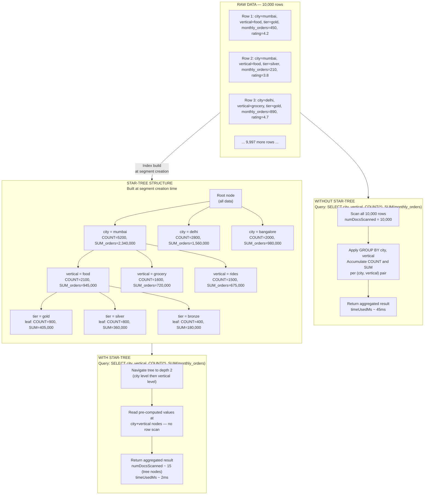

# Lab 16: Star-Tree Index Design Workshop

## Overview

The star-tree index is Apache Pinot's most powerful acceleration mechanism for aggregation-heavy workloads and it is also the one most frequently misconfigured. Unlike inverted or range indexes, which accelerate row-level filtering, the star-tree pre-materializes aggregation results at segment build time. A well-designed star-tree transforms a query that would scan hundreds of thousands of rows into a tree traversal that reads a handful of pre-computed leaf nodes. This often cuts `timeUsedMs` by one to two orders of magnitude.

The design challenge is that a star-tree is tightly coupled to a specific query pattern. The dimension split order, the function-column pairs and the leaf record threshold must be chosen deliberately based on the queries that will run most frequently against the table. A star-tree configured for one query shape provides no benefit and adds build-time overhead for queries outside that shape.

This lab is a structured design workshop. You will work through the complete star-tree design process for the `merchants_dim` table: analyzing candidate queries ordering dimensions by cardinality, selecting function-column pairs and then verifying the result through EXPLAIN PLAN and measured latency comparisons.

> [!NOTE]
> Lab 4 established the baseline `merchants_dim` configuration with an existing star-tree. This workshop redesigns it from first principles and replaces it with a configuration you design yourself before seeing the answer.


## Learning Objectives

| Objective | Success Criterion |
|-----------|-------------------|
| Explain how star-tree pre-aggregation works | You can describe the tree traversal path for a given GROUP BY query and contrast it with a full row scan |
| Complete the star-tree design process | You have filled in the design template table before viewing the solution |
| Apply the dimension ordering rule | You can explain why lower-cardinality dimensions should appear earlier in `dimensionsSplitOrder` |
| Verify star-tree selection via EXPLAIN PLAN | `StarTreeDocIdSet` appears in the plan output for all four candidate queries |
| Measure the speedup factor | You have recorded `timeUsedMs` and `numDocsScanned` before and after and calculated the speedup for each query |
| Identify queries that bypass the star-tree | Given a query, you can predict whether the star-tree will be selected |


## How Star-Tree Works

The following diagram traces the same logical query through two execution paths: a full row scan and a star-tree traversal. The data has three dimensions, `city`, `vertical` and `contract_tier` and the query requests `COUNT(*)` and `SUM(monthly_orders)` grouped by `city` and `vertical`.



The tree traversal finds the exact subtree matching the query's GROUP BY dimensions and reads the pre-aggregated values stored there. The query that scanned 10,000 rows now reads 15 tree nodes. The speedup compounds as data volume grows. At 100 million rows, the tree traversal still reads approximately the same number of nodes.

The query path for a deeper predicate such as `WHERE city = 'mumbai' AND vertical = 'food'` navigates directly to the `city=mumbai → vertical=food` subtree and reads the pre-computed `COUNT` and `SUM` values without touching any raw rows. Pinot confirms this path selection in EXPLAIN PLAN by reporting `StarTreeDocIdSet` instead of `FilteredDocIdSet` or `FullScanDocIdSet`.


## The Star-Tree Design Process

Follow this numbered methodology for any table where star-tree acceleration is being evaluated. Shortcutting any step produces a configuration that looks correct but underperforms or fails to accelerate the target queries.

1. **Identify your five to ten most frequent aggregation queries.** Pull this list from your query log or monitoring system. Star-tree investment is only justified when the target queries run hundreds or thousands of times per day.

2. **Extract all GROUP BY dimension sets from those queries.** List every distinct combination of GROUP BY columns. The star-tree must cover all of them or the uncovered queries will fall back to full row scans.

3. **Order the dimensions by cardinality, lowest first.** The dimension appearing first in `dimensionsSplitOrder` creates the fewest branches at the top of the tree, producing the most compact and memory-efficient structure. Higher-cardinality dimensions appear deeper in the tree where their branching affects fewer subtrees.

4. **List all aggregation functions and their target columns.** Every `functionColumnPairs` entry must exactly match the functions used in your target queries. A query requesting `AVG(rating)` requires both `SUM__rating` and `COUNT__*` to be present in the pairs, because Pinot computes `AVG` from the stored `SUM` and `COUNT` values.

5. **Set `maxLeafRecords` to control tree granularity.** A lower value forces the tree to subdivide more aggressively, storing finer-grained pre-aggregations. A higher value allows more rows per leaf, reducing build-time overhead but providing less granular pre-aggregation. The default of 10,000 is a reasonable starting point for dimension tables under 10 million rows.


## Design Exercise

The four queries below run approximately 1,000 times per day against `merchants_dim`. Before reading the solution in Step 1, work through the design process and fill in the template table.

**Query A**

```sql
SELECT city, COUNT(*), SUM(monthly_orders)
FROM merchants_dim
GROUP BY city
```

**Query B**

```sql
SELECT city, vertical, AVG(rating)
FROM merchants_dim
GROUP BY city, vertical
```

**Query C**

```sql
SELECT vertical, contract_tier, COUNT(*), SUM(monthly_orders)
FROM merchants_dim
GROUP BY vertical, contract_tier
```

**Query D**

```sql
SELECT city, vertical, contract_tier, COUNT(*)
FROM merchants_dim
GROUP BY city, vertical, contract_tier
```

Study the four queries and answer the following questions before filling in the template:

Which dimensions appear in GROUP BY across all four queries? What is the approximate cardinality of each dimension in the `merchants_dim` dataset? What aggregation functions appear across all four queries and which columns do they target?

Fill in your design before proceeding to Step 1.

| Design Element | Your Answer |
|---------------|-------------|
| Dimension Split Order (lowest cardinality first) | |
| Function Column Pairs (all functions all four queries need) | |
| Max Leaf Records | |


## Step 1: The Solution Configuration

The optimal star-tree configuration for these four queries is derived as follows.

**Dimension ordering by cardinality.** The `merchants_dim` table in this dataset contains data across 4 cities, 5 verticals and 3 contract tiers. The cardinality ordering is: `contract_tier` (3 values) then `vertical` (5 values) then `city` (4 values). But this ordering is by ascending cardinality, meaning the root has the fewest branches. However, since Queries A and B lead with `city` and it appears in three of the four queries, placing `city` first maximizes the number of queries that benefit from tree root navigation. This is a deliberate trade-off between pure cardinality ordering and query-pattern alignment: when one dimension appears in nearly every query as the leading GROUP BY, placing it first in the split order provides more consistent acceleration across the query set.

The resulting order is `city → vertical → contract_tier`, covering every combination of dimensions requested by Queries A through D.

**Function column pairs.** Query A needs `COUNT__*` and `SUM__monthly_orders`. Query B needs `AVG__rating`, which requires Pinot to store `SUM__rating` and `COUNT__*`. Query C needs `COUNT__*` and `SUM__monthly_orders`. Query D needs `COUNT__*`. The complete set is `COUNT__*`, `SUM__monthly_orders`, `SUM__rating` and `AVG__rating`.

The complete star-tree configuration:

```json
{
  "starTreeIndexConfigs": [
    {
      "dimensionsSplitOrder": [
        "city",
        "vertical",
        "contract_tier"
      ],
      "functionColumnPairs": [
        "COUNT__*",
        "SUM__monthly_orders",
        "SUM__rating",
        "AVG__rating"
      ],
      "maxLeafRecords": 10000,
      "skipStarNodeCreationForDimensions": []
    }
  ]
}
```

Each design choice explained:

| Choice | Rationale |
|--------|-----------|
| `city` first in split order | Appears in 3 of 4 queries as the leading GROUP BY; maximizes queries that benefit from root-level navigation |
| `vertical` second | Appears in 3 of 4 queries at the second GROUP BY position |
| `contract_tier` third | Appears in 2 of 4 queries; lowest-cardinality dimension but least frequently the sole grouping key |
| `COUNT__*` | Required by all four queries |
| `SUM__monthly_orders` | Required by Queries A and C |
| `SUM__rating` | Required by Pinot internally to compute `AVG__rating` for Query B |
| `AVG__rating` | Explicitly requested by Query B |
| `maxLeafRecords: 10000` | `merchants_dim` is a small dimension table; this threshold allows adequate tree subdivision without excessive build overhead |


## Step 2: Apply the Configuration

Update the `merchants_dim` table configuration with the new star-tree definition.

**Retrieve the current table configuration.**

```bash
curl -s http://localhost:9000/tables/merchants_dim_OFFLINE/tableConfigs \
  | python3 -m json.tool > /tmp/merchants_dim_current.json
```

**Edit the `tableIndexConfig.starTreeIndexConfigs` section** in the file to replace any existing star-tree configuration with the solution configuration from Step 1.

**Submit the updated configuration.**

```bash
curl -s -X PUT \
  "http://localhost:9000/tables/merchants_dim_OFFLINE" \
  -H "Content-Type: application/json" \
  -d @/tmp/merchants_dim_updated.json \
  | python3 -m json.tool
```

Expected response:

```json
{
  "status": "Table config updated for merchants_dim_OFFLINE"
}
```

**Reload all segments to rebuild the star-tree index.**

Updating the table configuration alone does not rebuild existing segments. The star-tree is built at segment creation time, so you must trigger a reload of all offline segments.

```bash
curl -s -X POST \
  "http://localhost:9000/segments/merchants_dim_OFFLINE/reload" \
  | python3 -m json.tool
```

Expected response:

```json
{
  "status": "Request to reload all segments of table merchants_dim_OFFLINE submitted"
}
```

**Confirm the reload completed.** Poll the segment reload status until all segments report `DONE`.

```bash
curl -s "http://localhost:9000/segments/merchants_dim_OFFLINE/loadingStatus" \
  | python3 -m json.tool
```

The reload typically completes within 30 to 60 seconds for small segments. When the status shows `DONE` for all segments, the star-tree index is rebuilt and queries will begin using it.


## Step 3: Verify Star-Tree Selection via EXPLAIN PLAN

Run EXPLAIN PLAN for each of the four candidate queries in the Query Console at **http://localhost:9000/#/query**. Confirm that `StarTreeDocIdSet` appears in the plan for each one.

**EXPLAIN for Query A:**

```sql
EXPLAIN PLAN FOR
SELECT city, COUNT(*), SUM(monthly_orders)
FROM merchants_dim
GROUP BY city
```

**EXPLAIN for Query B:**

```sql
EXPLAIN PLAN FOR
SELECT city, vertical, AVG(rating)
FROM merchants_dim
GROUP BY city, vertical
```

**EXPLAIN for Query C:**

```sql
EXPLAIN PLAN FOR
SELECT vertical, contract_tier, COUNT(*), SUM(monthly_orders)
FROM merchants_dim
GROUP BY vertical, contract_tier
```

**EXPLAIN for Query D:**

```sql
EXPLAIN PLAN FOR
SELECT city, vertical, contract_tier, COUNT(*)
FROM merchants_dim
GROUP BY city, vertical, contract_tier
```

For each plan, locate the `DocIdSet` operator. The star-tree is selected when you see output resembling:

```
FILTER_MATCH_ENTIRE_SEGMENT(docs:[200])
  StarTreeDocIdSet(star-tree: ALL_CHILDREN)
```

If you see `FilteredDocIdSet` or `FullScanDocIdSet`, the star-tree was not selected. The most common cause is a mismatch between the query's GROUP BY columns and the configured `dimensionsSplitOrder` or a requested aggregation function that is not listed in `functionColumnPairs`. Re-examine the query against the configuration and check that the segment reload completed successfully.

| Query | Expected DocIdSet Operator | Observed Operator (fill in) | Star-Tree Selected |
|-------|---------------------------|----------------------------|:-----------------:|
| A — city GROUP BY | StarTreeDocIdSet | | |
| B — city, vertical GROUP BY | StarTreeDocIdSet | | |
| C — vertical, contract_tier GROUP BY | StarTreeDocIdSet | | |
| D — all three dimensions GROUP BY | StarTreeDocIdSet | | |


## Step 4: Measure the Speedup

Record the baseline latency figures from Lab 4 for the same queries against `merchants_dim`. Then run each query again after the star-tree rebuild and record the new figures. Calculate the speedup factor as `before_ms / after_ms`.

Run each query and capture both `timeUsedMs` and `numDocsScanned` from the BrokerResponse.

```bash
curl -s -X POST \
  "http://localhost:9000/query/sql" \
  -H "Content-Type: application/json" \
  -d '{"sql": "SELECT city, COUNT(*), SUM(monthly_orders) FROM merchants_dim GROUP BY city"}' \
  | python3 -m json.tool | grep -E '"timeUsedMs"|"numDocsScanned"'
```

Repeat this curl command for Queries B, C and D, substituting the SQL accordingly.


## Measurement Workshop Table

Fill in this table after running all four queries in both baseline and post-star-tree conditions.

| Query | Before timeUsedMs | After timeUsedMs | Speedup Factor | Before numDocsScanned | After numDocsScanned |
|-------|:-----------------:|:----------------:|:--------------:|:---------------------:|:--------------------:|
| A — city GROUP BY | | | | | |
| B — city, vertical AVG(rating) | | | | | |
| C — vertical, contract_tier GROUP BY | | | | | |
| D — all three dimensions GROUP BY | | | | | |

The speedup factor is most dramatic for queries running against large offline segments where the star-tree eliminates nearly all row scanning. For the `merchants_dim` table with 200 rows in this lab environment, the absolute time values are small, but `numDocsScanned` tells the true story. The difference between scanning 200 rows and reading 5 to 15 pre-computed tree nodes represents a fundamentally different execution path that scales to billions of rows.


## When Star-Tree Does Not Help

The star-tree is bypassed silently when a query does not match the configured shape. No error is raised. The query succeeds but uses a full row scan instead. Understanding the bypass conditions prevents unexpected latency regressions when query patterns evolve.

| Query Pattern | Why Star-Tree Is Bypassed | Latency Impact |
|---------------|--------------------------|---------------|
| GROUP BY a column not in `dimensionsSplitOrder` | The tree has no subtree for this dimension; Pinot falls back to row scan | Full scan cost |
| Aggregation function not in `functionColumnPairs` | The pre-aggregated value for this function was not stored; Pinot cannot reconstruct it from the tree | Full scan cost |
| WHERE predicate on a non-dimension column | The tree cannot filter by non-split dimensions at the node level; Pinot scans raw rows to apply the filter | Full scan cost |
| HAVING clause with a function not in pairs | Post-aggregation filter requires a value the tree did not store | Full scan cost |
| Query against a REALTIME consuming segment | Star-tree is only built on sealed (committed) segments; consuming segments are always scanned | Partial scan of consuming segment, star-tree on sealed segments |
| `DISTINCT` aggregation | `COUNT_DISTINCT` requires a `DISTINCTCOUNT__column` pair; generic `COUNT(DISTINCT ...)` is not supported | Full scan cost |
| Filter on a metric column | Metric columns are not part of the tree structure; any WHERE predicate on a non-dimension column causes fallback | Full scan cost |

The most operationally important bypass case is the last one. A query such as `SELECT city, SUM(fare) FROM table WHERE rating > 4.0 GROUP BY city` will bypass the star-tree entirely if `rating` is a metric column rather than a dimension in `dimensionsSplitOrder`, even though `city` and `SUM(fare)` are both configured. The star-tree can only accelerate queries whose filter predicates are entirely on configured dimensions.


## Star-Tree Limits Reference Table

| Parameter | Effect of Lower Value | Effect of Higher Value | Recommended Starting Point |
|-----------|----------------------|----------------------|---------------------------|
| `maxLeafRecords` | Tree subdivides more aggressively; finer pre-aggregation granularity; larger index size | Coarser pre-aggregation; smaller index; faster segment build | 10,000 for dimension tables under 50M rows |
| Number of entries in `dimensionsSplitOrder` | Fewer tree levels; less memory; fewer query shapes covered | More levels; more query shapes covered; exponentially larger tree for high-cardinality dimensions | Include only dimensions that appear in your actual GROUP BY queries |
| Number of entries in `functionColumnPairs` | Fewer functions pre-materialized; less storage overhead | More functions covered; larger leaf node storage | Include only the exact functions and column combinations in your target queries |
| `skipStarNodeCreationForDimensions` | Not skipping: star nodes created for all dimensions — covers queries that omit a dimension | Skipping: no star node for listed dimensions — smaller tree, but queries omitting that dimension fall back to scan | Skip high-cardinality dimensions like IDs to avoid tree size explosion |
| Segment size | Smaller segments build faster trees; less memory per segment during serving | Larger segments amortize tree overhead better; fewer segments to manage | Follows table-level `segmentConfig` recommendation; star-tree design does not change segment sizing |


## Reflection Prompts

1. You configured the star-tree with `dimensionsSplitOrder: ["city", "vertical", "contract_tier"]`. A new query arrives that groups by `contract_tier` and `city` but not `vertical`. Does the star-tree accelerate this query? Explain the tree traversal path Pinot takes and whether it finds a usable pre-aggregated node.

2. A colleague argues that you should add every dimension in the table to `dimensionsSplitOrder` so that the star-tree covers all possible GROUP BY combinations. Explain why this approach is counterproductive for a dimension with cardinality greater than 1,000.

3. After applying the star-tree configuration, you run EXPLAIN PLAN and see `FullScanDocIdSet` instead of `StarTreeDocIdSet` for Query B. The query is `SELECT city, vertical, AVG(rating) FROM merchants_dim GROUP BY city, vertical`. List three possible causes and the diagnostic step you would take to confirm each one.

4. The `merchants_dim` table is updated daily with a new offline segment containing the previous day's merchant data. Describe the complete lifecycle of the star-tree for a segment: when it is built, what triggers it and when it is available for query acceleration.

5. A product team requests a new query: `SELECT city, vertical, MAX(monthly_orders) FROM merchants_dim GROUP BY city, vertical`. The current `functionColumnPairs` does not include `MAX__monthly_orders`. What change must you make and what operational step must follow before queries begin using the updated index?


[Previous: Lab 15 — Multi-Tenancy and Workload Isolation](lab-15-multi-tenancy.md) | [Next: Lab 17 — Real-Time Dashboard Integration with Grafana](lab-17-grafana-integration.md)
