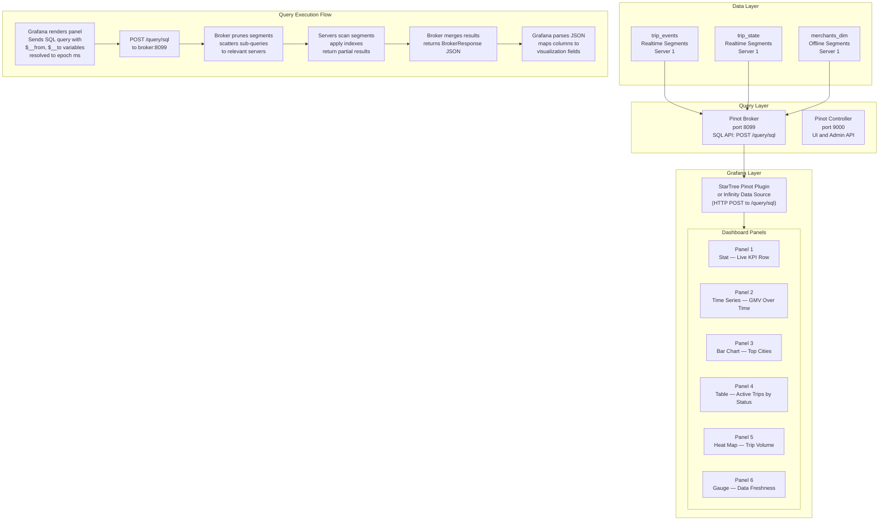

# Lab 17: Real-Time Dashboard Integration with Grafana

## Overview

Apache Pinot exposes a standard HTTP SQL API at port 8099. Any tool that can issue an HTTP POST request and parse a JSON response can query Pinot directly. Grafana is the most widely deployed visualization layer in this category, and the combination of Pinot's sub-second aggregation latency with Grafana's time-series rendering capabilities produces dashboards that update in near real time from event streams.

This lab connects a Grafana instance to the Pinot cluster, builds a six-panel operational dashboard for the ride-hailing data set, and teaches the query translation patterns that make Grafana dashboards performant rather than expensive. The gap between a well-designed Pinot-backed dashboard and a poorly designed one is not visual. It is entirely in the SQL, specifically in how time predicates, aggregation dimensions, and query granularity are specified.

By the end of this lab you will have a working dashboard with six panels spanning stat panels, time-series charts, bar charts, table panels, heat maps, and a data freshness gauge. You will also have a reusable query design reference for translating common dashboard requirements into optimized Pinot SQL.

> [!NOTE]
> Labs 1 through 5 must be complete and data must be present in `trip_events`, `trip_state`, and `merchants_dim` before building the dashboard panels.

---

## Learning Objectives

| Objective | Success Criterion |
|-----------|-------------------|
| Add Grafana to the Docker Compose stack | Grafana is accessible at http://localhost:3000 and reports healthy status |
| Configure the Pinot data source in Grafana | A test query against Pinot returns results without error in the data source configuration panel |
| Translate dashboard requirements to Pinot SQL | Each of the six panels runs a query that returns correct data within the expected latency budget |
| Use Grafana time variables in Pinot SQL | `$__from` and `$__to` appear in queries and the dashboard time picker correctly filters Pinot results |
| Create a parameterized dashboard variable | The `$city` dropdown is populated from a Pinot query and filters all relevant panels simultaneously |
| Measure dashboard query latency | You have recorded `timeUsedMs` for all six panel queries and can identify which ones need index optimization |

---

## The Dashboard Architecture

The following diagram shows the complete data flow from Pinot segments through the broker to Grafana panels. Understanding this architecture is essential for diagnosing latency issues because the bottleneck can occur at any layer.



Each panel in the dashboard issues an independent SQL query. There is no query batching or cursor-based streaming. Grafana fires all visible panel queries simultaneously when the dashboard loads or the time range changes. This means a dashboard with six panels generates six concurrent requests against the Pinot broker. Designing each query for low latency is not a nicety. It is required for the dashboard to feel responsive.

---

## Grafana Setup

### Step 1: Add Grafana to the Docker Compose Stack

Open the `docker-compose.yml` file from Lab 1 and add the following service block. Place it after the existing service definitions and before the final network declarations.

```yaml
  grafana:
    image: grafana/grafana:latest
    container_name: grafana
    ports:
      - "3000:3000"
    environment:
      - GF_SECURITY_ADMIN_PASSWORD=admin
      - GF_SECURITY_ADMIN_USER=admin
      - GF_USERS_ALLOW_SIGN_UP=false
    volumes:
      - grafana_data:/var/lib/grafana
    networks:
      - pinot-network
    depends_on:
      - pinot-broker
```

Also add the named volume declaration at the bottom of `docker-compose.yml` under the `volumes` top-level key.

```yaml
volumes:
  grafana_data:
```

If a `volumes` section already exists, add `grafana_data:` as a new entry within it.

### Step 2: Start the Updated Stack

```bash
docker compose up -d grafana
```

Expected output:

```
[+] Running 1/1
 ✔ Container grafana  Started
```

Verify that Grafana is healthy.

```bash
curl -s http://localhost:3000/api/health | python3 -m json.tool
```

Expected response:

```json
{
  "commit": "...",
  "database": "ok",
  "version": "..."
}
```

Open a browser and navigate to **http://localhost:3000**. Log in with username `admin` and password `admin`. Grafana will prompt you to change the password. You may skip this for the lab environment.

### Step 3: Install the Infinity Data Source Plugin

The StarTree Pinot plugin provides native Pinot-aware query building. If it is unavailable, the Infinity plugin provides a general HTTP data source that works equally well for this lab.

Navigate to **Administration → Plugins** in the left sidebar. Search for `Infinity`. Click the result and click `Install`. Wait for the installation to complete, then click `Enable`.

Alternatively, install via the Grafana CLI if you have shell access to the Grafana container.

```bash
docker exec grafana grafana-cli plugins install yesoreyeram-infinity-datasource
docker compose restart grafana
```

### Step 4: Add the Pinot Data Source

1. Navigate to **Connections → Data Sources** in the Grafana left sidebar.
2. Click `Add new data source`.
3. Search for `Infinity` and select it.
4. Set the **Name** field to `Apache Pinot`.
5. Under **Allowed Hosts**, add `http://pinot-broker:8099`.
6. Click `Save & Test`.

Grafana connects to the Pinot broker from within the Docker network using the service name `pinot-broker`. From your local machine browser, Pinot is accessible at `localhost:8099`, but within Docker's internal network the correct hostname is `pinot-broker`.

Expected test result: `Data source connected and labels found.`

---

## The Six Dashboard Panels

Create a new dashboard by navigating to **Dashboards → New Dashboard → Add visualization**. For each panel, select `Apache Pinot` as the data source and configure the query as described below.

---

### Panel 1: Live Trip Metrics (KPI Stat Row)

**Visualization type:** Stat

This panel provides the three most important operational numbers for the last hour: total trips, total gross merchandise value, and cancellation rate. Stat panels display a single large number with optional trend sparklines.

Add three queries within the same panel, labeling them A, B, and C.

**Query A — Total trips last hour**

```sql
SELECT COUNT(*) AS total_trips
FROM trip_events
WHERE event_time_ms >= $__from
  AND event_time_ms <= $__to
  AND event_type = 'trip_completed'
```

**Query B — Total GMV last hour**

```sql
SELECT ROUND(SUM(fare_amount), 2) AS total_gmv
FROM trip_events
WHERE event_time_ms >= $__from
  AND event_time_ms <= $__to
  AND event_type = 'trip_completed'
```

**Query C — Cancellation rate last hour**

```sql
SELECT
  ROUND(
    100.0 * SUM(CASE WHEN event_type = 'trip_cancelled' THEN 1 ELSE 0 END)
    / COUNT(*),
    1
  ) AS cancellation_rate_pct
FROM trip_events
WHERE event_time_ms >= $__from
  AND event_time_ms <= $__to
```

Grafana resolves `$__from` and `$__to` to Unix epoch milliseconds when the panel renders, matching Pinot's `event_time_ms` column format. Set the panel time range to **Last 1 hour** using the dashboard time picker.

Set the panel title to `Live Trip Metrics`. Under Field settings, set the unit for Query A to `short`, Query B to `currency: USD`, and Query C to `percent (0-100)`.

**Expected latency target:** Under 50ms for each of the three queries, given that `event_time_ms` has a range index and the time window prunes most segments.

---

### Panel 2: GMV Over Time (Time Series)

**Visualization type:** Time series

This panel shows gross merchandise value aggregated into five-minute buckets over the selected time range. It uses a bucket column that was pre-computed during ingestion.

```sql
SELECT
  last_event_minute_bucket_ms AS time,
  SUM(fare_amount) AS gmv
FROM trip_state
WHERE event_time_ms >= $__from
  AND event_time_ms <= $__to
GROUP BY last_event_minute_bucket_ms
ORDER BY time ASC
```

Set the panel title to `GMV Over Time`. In the Transform tab, add a `Convert field type` transformation to ensure the `time` column is interpreted as a time field. Set the `time` column type to `Time`.

Under Field overrides, set the `gmv` field unit to `currency: USD` and display name to `Gross Merchandise Value`.

**Why this query is efficient.** The `last_event_minute_bucket_ms` column is a pre-computed five-minute floor of the event timestamp, calculated at ingestion time. Grouping on this column avoids a `DATETIMECONVERT` expression in the GROUP BY, which Pinot cannot use a sorted index for. Pre-computing time buckets at ingest time is the recommended pattern for time-series panels.

**Expected latency target:** Under 100ms. The range index on `event_time_ms` prunes segments aggressively, and the `last_event_minute_bucket_ms` GROUP BY aggregates a bounded number of rows per five-minute bucket.

---

### Panel 3: Top Cities by Revenue (Bar Chart)

**Visualization type:** Bar chart

This panel shows the top ten cities ordered by total fare revenue over the selected time window. It is useful for identifying geographic revenue concentration.

```sql
SELECT
  city,
  ROUND(SUM(fare_amount), 2) AS total_revenue,
  COUNT(*) AS trip_count
FROM trip_events
WHERE event_time_ms >= $__from
  AND event_time_ms <= $__to
  AND event_type = 'trip_completed'
  AND city = '$city'
GROUP BY city
ORDER BY total_revenue DESC
LIMIT 10
```

The `AND city = '$city'` clause applies the dashboard variable filter defined in the Variable Setup section. When `$city` is set to `All` or is unset, remove this clause or use a Grafana conditional syntax depending on the plugin version. The cleanest approach for the Infinity plugin is to define two separate query variants and toggle them with the variable state.

Set the panel title to `Top Cities by Revenue`. Set the X axis to `city`, the Y axis to `total_revenue` with unit `currency: USD`, and enable value labels on bars.

**Expected latency target:** Under 80ms. The inverted index on `city` and range index on `event_time_ms` make this an efficient compound filter and aggregation.

---

### Panel 4: Active Trips by Status (Table Panel)

**Visualization type:** Table

This panel shows the current distribution of trips across status values in `trip_state`. Because `trip_state` is an upsert table storing only the latest state per trip, this query reflects the real-time operational state of the platform.

```sql
SELECT
  status,
  COUNT(*) AS trip_count,
  ROUND(SUM(fare_amount), 2) AS fare_total,
  ROUND(AVG(distance_km), 1) AS avg_distance_km
FROM trip_state
GROUP BY status
ORDER BY trip_count DESC
```

This query does not use a time filter because `trip_state` stores current state, not historical events. The upsert semantics guarantee that each `trip_id` appears exactly once in the latest-state view. A time filter would incorrectly exclude trips that started outside the window but are still active.

Set the panel title to `Active Trips by Status`. In the table column settings, set `trip_count` to display name `Trips`, `fare_total` to `Total Fare (USD)`, and `avg_distance_km` to `Avg Distance (km)`. Apply a threshold color to `trip_count` — green for below 100 active trips, yellow for 100 to 200, and red for above 200, representing capacity indicators.

**Expected latency target:** Under 30ms. This query has no time predicate to prune segments, but the table is compact and the inverted index on `status` handles the GROUP BY efficiently with star-tree acceleration if configured.

---

### Panel 5: Hourly Trip Volume by Day (Heat Map)

**Visualization type:** Heatmap

This panel visualizes trip density across hours of the day and days of the week, revealing usage patterns such as weekday morning peaks and weekend evening spikes.

```sql
SELECT
  last_event_day   AS day_bucket,
  last_event_hour  AS hour_bucket,
  COUNT(*)         AS trip_volume
FROM trip_state
WHERE event_time_ms >= $__from
  AND event_time_ms <= $__to
GROUP BY last_event_day, last_event_hour
ORDER BY day_bucket ASC, hour_bucket ASC
```

The `last_event_day` and `last_event_hour` columns must be present in the `trip_state` schema. If they are not, derive them using Pinot's date-time functions.

```sql
SELECT
  DATETIMECONVERT(last_event_time_ms, '1:MILLISECONDS:EPOCH',
    '1:DAYS:EPOCH', '1:DAYS') AS day_bucket,
  EXTRACT(HOUR FROM ToDateTime(last_event_time_ms, 'yyyy-MM-dd HH:mm:ss'))
    AS hour_bucket,
  COUNT(*) AS trip_volume
FROM trip_state
WHERE last_event_time_ms >= $__from
  AND last_event_time_ms <= $__to
GROUP BY day_bucket, hour_bucket
ORDER BY day_bucket ASC, hour_bucket ASC
```

Set the panel title to `Hourly Trip Volume by Day`. Configure the heatmap X axis as `day_bucket` (time axis) and Y axis as `hour_bucket` (0 through 23). Set the color scheme to a warm gradient from white through orange to red, where darker red indicates higher trip density.

**Expected latency target:** Under 150ms. The DATETIMECONVERT expression involves a function evaluation on every scanned row, which prevents range index acceleration. This is acceptable for this panel because it targets a broad time range and the heat map naturally tolerates slightly higher latency than KPI panels.

---

### Panel 6: Data Freshness Gauge

**Visualization type:** Gauge

This panel is the most operationally critical panel on the dashboard. It measures the lag between the most recent event in `trip_state` and the current wall-clock time, expressed in seconds. A rising lag indicates ingestion problems: Kafka consumer lag, server overload, or a paused consuming segment.

```sql
SELECT
  ROUND((NOW() - MAX(last_event_time_ms)) / 1000.0, 0) AS lag_seconds
FROM trip_state
```

Set the panel title to `Data Freshness`. Configure the gauge minimum as 0 and maximum as 300. Apply threshold bands: 0 to 30 seconds is green (healthy), 30 to 60 seconds is yellow (degraded), and above 60 seconds is red (SLO breach).

Under the gauge display options, enable the threshold color markers and set the value unit to `seconds`.

This query does not accept a time variable because it measures current lag. The comparison is always between `NOW()` and the latest ingested row regardless of the dashboard time picker setting. Document this distinction for dashboard consumers to prevent confusion when the time picker is set to a historical window.

**Expected latency target:** Under 20ms. `MAX(last_event_time_ms)` against an upsert table with a range index resolves quickly. If latency exceeds 100ms for this query, the Pinot server itself may be overloaded. The freshness gauge latency is itself a health signal.

---

## Grafana Variable Setup

Dashboard variables allow users to filter all panels simultaneously by selecting a value from a dropdown. The `$city` variable populates its options from a live Pinot query so that the dropdown always reflects the cities currently present in the data.

1. Open the dashboard settings by clicking the gear icon at the top right.
2. Navigate to **Variables → Add variable**.
3. Set the variable type to **Query**.
4. Set the variable name to `city`.
5. Set the data source to `Apache Pinot`.
6. Enter the following query in the Query field:

```sql
SELECT DISTINCT city FROM trip_events ORDER BY city
```

7. Enable **Include All option** and set the All value to `.*` for regex-based multi-select filtering.
8. Set **Refresh** to `On dashboard load` so the city list stays current with the data.
9. Click **Update** and return to the dashboard.

The `$city` variable will appear as a dropdown at the top of the dashboard. When a user selects a city, all panels that include `AND city = '$city'` in their SQL will re-execute with that filter applied. Panels that deliberately omit the city filter (such as the Data Freshness gauge) are unaffected.

**Verify the variable is working.** Select a specific city from the dropdown. The `Top Cities by Revenue` panel should update to show only that city's data. The `Data Freshness` gauge should not change.

---

## Dashboard JSON Export

Once all six panels are configured and validated, export the dashboard as a JSON artifact for version control.

1. Open the dashboard settings by clicking the gear icon.
2. Navigate to **JSON Model**.
3. Copy the entire JSON content.
4. Save it to the repository as `configs/grafana_dashboard.json`.

```bash
# Alternatively, use the Grafana HTTP API to export programmatically
curl -s \
  -u admin:admin \
  "http://localhost:3000/api/dashboards/uid/$(YOUR_DASHBOARD_UID)" \
  | python3 -m json.tool > configs/grafana_dashboard.json
```

The dashboard UID appears in the browser URL when the dashboard is open: `http://localhost:3000/d/{uid}/dashboard-title`. Substitute the actual UID in the curl command.

A committed `grafana_dashboard.json` file allows teammates to import the dashboard into their own Grafana instances without manual panel recreation. Treat this file as infrastructure code — include it in code review, version it alongside schema changes, and update it whenever panel queries change.

---

## Query Design Principles for Dashboards

The following table captures the recurring translation patterns between dashboard requirements and Pinot query design. Each pattern reflects a trade-off between query expressiveness and execution performance.

| Dashboard Pattern | Pinot Query Pattern | Why This Works |
|------------------|--------------------|--------------------|
| Time range filter from picker | `WHERE event_time_ms >= $__from AND event_time_ms <= $__to` | Grafana resolves variables to epoch milliseconds matching Pinot's column type; range index accelerates the predicate |
| Five-minute time buckets | Pre-computed `minute_bucket_ms` column in schema | Avoids FLOOR or DATETIMECONVERT at query time; GROUP BY on a plain column is always faster than on a function expression |
| Top N bar chart | `ORDER BY metric_col DESC LIMIT N` | Pinot applies LIMIT before returning to broker; reduces network transfer for large result sets |
| Current-state metric | Query against upsert `trip_state` without time filter | Upsert semantics guarantee one row per entity; no time filter needed and none should be applied |
| Data freshness | `ROUND((NOW() - MAX(timestamp_col)) / 1000.0, 0)` | `NOW()` is a broker-evaluated function; `MAX(timestamp_col)` benefits from range index min/max metadata without a row scan in many cases |
| Parameterized city filter | `AND city = '$city'` with Grafana variable | Inverted index on `city` resolves the equality predicate without a scan; variable changes trigger query re-execution |
| Heat map by hour and day | Pre-computed `last_event_hour` and `last_event_day` columns | Avoids EXTRACT and DATETIMECONVERT functions at query time; GROUP BY on integer columns is faster than on function results |
| Cancellation rate | `100.0 * SUM(CASE WHEN event_type = 'cancelled' THEN 1 ELSE 0 END) / COUNT(*)` | Single-pass aggregation computes numerator and denominator together; avoids a subquery or CTE |

---

## Latency Considerations for Dashboards

Dashboard panels execute queries on every render, time range change, and variable selection change. The table below defines the relationship between panel refresh frequency, acceptable query latency, and the time predicate structure that makes that latency achievable.

| Refresh Interval | Latency Budget per Panel | Required Time Predicate Pattern | Index Requirements |
|:----------------:|:------------------------:|--------------------------------|-------------------|
| 5 seconds | Under 20ms | `WHERE timestamp >= NOW() - 60000` — last 60 seconds only | Range index on timestamp; star-tree for aggregations |
| 30 seconds | Under 50ms | `WHERE timestamp >= $__from AND timestamp <= $__to` with time range up to 1 hour | Range index on timestamp; inverted index on filter dimensions |
| 5 minutes | Under 100ms | `WHERE timestamp >= $__from AND timestamp <= $__to` with time range up to 24 hours | Range index on timestamp; segment pruning eliminates most segments for recent ranges |
| 15 minutes | Under 200ms | `WHERE timestamp >= $__from AND timestamp <= $__to` with time range up to 7 days | Segment pruning covers most of the budget; inverted index on GROUP BY dimensions |
| 1 hour | Under 500ms | Full table scan acceptable with indexed aggregation dimensions | Star-tree required for aggregation-heavy queries at this range |

The most important constraint is the 5-second refresh case. A query latency of 20ms leaves almost no margin for network overhead, Grafana rendering, and plugin processing. Achieving this requires pre-computed aggregation columns or a star-tree index. Any query at this refresh rate that performs a full segment scan is at risk of causing visible lag in the dashboard.

The Data Freshness gauge panel in this lab operates at a 30-second refresh rate and targets under 20ms. It achieves this because `MAX(last_event_time_ms)` can be resolved from segment-level metadata in many cases without scanning rows.

---

## Reflection Prompts

1. The GMV Over Time panel (Panel 2) uses a pre-computed `last_event_minute_bucket_ms` column for time bucketing instead of `DATETIMECONVERT(event_time_ms, ...)` in the GROUP BY. Explain why the pre-computed column approach produces lower query latency and describe what would need to change in the ingestion pipeline to switch from a DATETIMECONVERT approach to a pre-computed column approach.

2. The Active Trips by Status panel (Panel 4) intentionally omits the dashboard time range filter from its query. A colleague insists on adding `WHERE last_event_time_ms >= $__from AND last_event_time_ms <= $__to` to make it "consistent with the other panels." What data accuracy problem does this change introduce, and how would you explain the omission to the colleague?

3. A new panel requirement arrives: show the p99 query latency for the last 24 hours, bucketed by hour. Pinot's SQL does not natively support `PERCENTILE` over time windows in the same way that a window function would. Describe at least two approaches for serving this dashboard panel from Pinot, with their respective trade-offs.

4. The `$city` dashboard variable is populated by `SELECT DISTINCT city FROM trip_events ORDER BY city`. As the dataset grows to billions of rows, this query begins taking over 500ms. Propose a query redesign or data model change that keeps the variable population query under 50ms regardless of data volume.

5. The Data Freshness gauge shows 0 seconds of lag even though you know the Kafka producer has been paused for 10 minutes. What does this tell you about how Pinot computes `MAX(last_event_time_ms)`, and how would you modify the query to detect a paused producer more reliably?

---

[Previous: Lab 16 — Star-Tree Index Design Workshop](lab-16-star-tree-workshop.md) | [Next: Lab 1 — Local Cluster Setup](lab-01-local-cluster.md)
