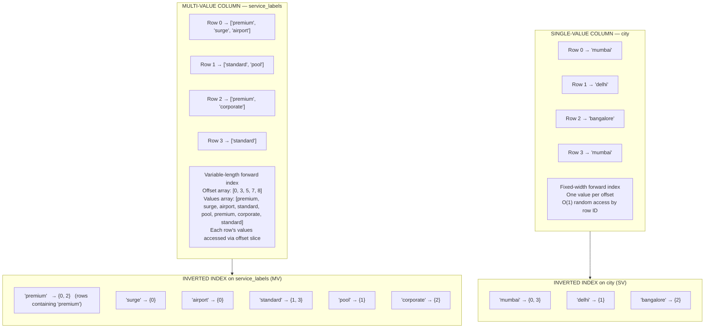

# Lab 18: Multi-Value Column Analytics

## Overview

Most database systems require a normalized child table to represent a one-to-many relationship between a row and a list of values. Apache Pinot offers a native alternative: the multi-value (MV) column. An MV column stores a variable-length array of values directly within a single row, eliminating the join and enabling a specialized set of aggregate and filter functions that operate across the entire array in a single pass.

The canonical use cases are tag arrays, label lists, route waypoint sequences, product category memberships and any scenario where a fact event naturally carries a set of scalar descriptors. In the ride-hailing dataset, each trip carries service labels such as `premium`, `surge`, `airport` and `corporate`. These are attributes that influence pricing, driver matching and downstream analytics. Storing these as an MV column keeps the row self-contained and makes both filtering and aggregation straightforward.

This lab adds two MV columns to the `trip_events` schema, ingests representative data and demonstrates the complete vocabulary of MV-specific query functions. By the end you will have measured the behavioral difference between grouping on a single-value column and grouping on an MV column and you will have the reference material needed to choose between MV columns and JSON columns for new data model decisions.

> [!NOTE]
> Lab 3 must be complete and data must be present in `trip_events` before this lab. The Kafka broker must be running at `localhost:9092`.


## Learning Objectives

| Objective | Success Criterion |
|-----------|-------------------|
| Understand the internal storage model of MV columns | You can explain variable-length forward index and MV inverted index in your own words |
| Add an MV column to an existing schema | The schema update API returns success and the new column appears in the schema response |
| Filter rows using MV-specific predicates | `valueIn()` queries return the correct subset of trips |
| Apply all aggregate MV functions | All functions in the reference table return non-null results against the sample data |
| Explain GROUP BY fan-out behavior on MV columns | You can predict how many result rows a GROUP BY on an MV column produces |
| Choose between MV columns and JSON columns | Given a new data requirement, you can state which storage model is more appropriate and why |


## MV Column Architecture

The following diagram contrasts the internal storage of a single-value column against an MV column and shows how the inverted index is extended to cover the MV case.



The inverted index on an MV column maps each distinct value in the value space to the set of row IDs that contain it somewhere in their array. A row with three labels contributes its row ID to three separate posting lists. When a query filters by `valueIn(service_labels, 'premium')`, Pinot looks up the `premium` posting list and immediately produces the matching row ID set without scanning any raw values. This is the same execution model as SV inverted index lookup. The extension is transparent to the query engine once the inverted index is built.


## Step 1: Add the `service_labels` MV Column to the Schema

Retrieve the current `trip_events` schema and save it locally.

```bash
curl -s http://localhost:9000/schemas/trip_events \
  | python3 -m json.tool > /tmp/trip_events_schema.json
```

Expected output (abbreviated):

```json
{
  "schemaName": "trip_events",
  "dimensionFieldSpecs": [ ... ],
  "metricFieldSpecs": [ ... ],
  "dateTimeFieldSpecs": [ ... ]
}
```

Open `/tmp/trip_events_schema.json` and add the following object to the `dimensionFieldSpecs` array. The `singleValueField: false` property is the switch that designates the column as multi-value.

```json
{
  "name": "service_labels",
  "dataType": "STRING",
  "singleValueField": false
}
```

Submit the updated schema.

```bash
curl -s -X PUT \
  "http://localhost:9000/schemas/trip_events" \
  -H "Content-Type: application/json" \
  -d @/tmp/trip_events_schema.json \
  | python3 -m json.tool
```

Expected output:

```json
{
  "status": "trip_events successfully added"
}
```

Confirm that the new column appears in the schema response.

```bash
curl -s http://localhost:9000/schemas/trip_events \
  | python3 -c "
import sys, json
schema = json.load(sys.stdin)
for f in schema.get('dimensionFieldSpecs', []):
    if f['name'] == 'service_labels':
        print(json.dumps(f, indent=2))
"
```

Expected output:

```json
{
  "name": "service_labels",
  "dataType": "STRING",
  "singleValueField": false
}
```

> [!NOTE]
> Adding a column to the schema makes it available for ingestion immediately. Existing segments that were created before the schema update will serve `null` for this column. Only newly ingested data will carry non-null MV values.


## Step 2: Ingest Sample Events with the MV Field

Save the following five JSON Lines records to `/tmp/mv_sample.jsonl`. Each record includes the new `service_labels` array alongside the standard `trip_events` fields.

```
{"trip_id":"trip_000001","city":"mumbai","fare_amount":245.5,"event_time_ms":1706745600000,"event_type":"trip_completed","service_labels":["premium","surge","airport"]}
{"trip_id":"trip_000002","city":"delhi","fare_amount":120.0,"event_time_ms":1706745610000,"event_type":"trip_completed","service_labels":["standard","pool"]}
{"trip_id":"trip_000003","city":"bangalore","fare_amount":189.0,"event_time_ms":1706745620000,"event_type":"trip_completed","service_labels":["premium","corporate"]}
{"trip_id":"trip_000004","city":"mumbai","fare_amount":67.5,"event_time_ms":1706745630000,"event_type":"trip_completed","service_labels":["standard"]}
{"trip_id":"trip_000005","city":"delhi","fare_amount":312.0,"event_time_ms":1706745640000,"event_type":"trip_completed","service_labels":["premium","surge","corporate"]}
```

Stream the records to the `trip-events` Kafka topic using the console producer.

```bash
docker exec -i kafka kafka-console-producer.sh \
  --bootstrap-server localhost:9092 \
  --topic trip-events \
  < /tmp/mv_sample.jsonl
```

Expected output: The command exits silently after streaming all five records. No output on success is normal for the Kafka console producer.

Verify ingestion by querying for the records.

```bash
curl -s -X POST \
  "http://localhost:9000/query/sql" \
  -H "Content-Type: application/json" \
  -d '{"sql":"SELECT trip_id, service_labels FROM trip_events WHERE trip_id IN ('"'"'trip_000001'"'"','"'"'trip_000005'"'"') LIMIT 5"}' \
  | python3 -m json.tool
```

Expected output (result rows section):

```json
{
  "resultTable": {
    "dataSchema": {
      "columnNames": ["trip_id", "service_labels"],
      "columnDataTypes": ["STRING", "STRING_ARRAY"]
    },
    "rows": [
      ["trip_000001", ["premium", "surge", "airport"]],
      ["trip_000005", ["premium", "surge", "corporate"]]
    ]
  }
}
```

The `columnDataTypes` field reporting `STRING_ARRAY` confirms that Pinot has recognized the column as multi-value.


## Step 3: Basic MV Queries

Run all queries in the Query Console at **http://localhost:9000/#/query** or via the curl pattern shown above.

### Count Total Label Occurrences

`countMV` counts the total number of individual values across all rows in the column, including duplicates. A single row with three labels contributes 3 to this count.

```sql
SELECT countMV(service_labels) AS total_label_count
FROM trip_events
```

Expected result: `9` for the five sample rows (3 + 2 + 2 + 1 + 3 = 11 total labels across all rows ingested so far, including any pre-existing data without labels counted as zero).

### Count Distinct Labels Across the Table

`distinctCountMV` returns the number of unique values found anywhere in the MV column across all rows.

```sql
SELECT distinctCountMV(service_labels) AS unique_labels
FROM trip_events
```

Expected result: `6` (premium, surge, airport, standard, pool, corporate).

### Number of Labels Per Trip

`arrayLength` returns the size of the array stored in each row.

```sql
SELECT trip_id, arrayLength(service_labels) AS label_count
FROM trip_events
ORDER BY label_count DESC
LIMIT 10
```

Expected result:

| trip_id     | label_count |
|-------------|:-----------:|
| trip_000001 | 3           |
| trip_000005 | 3           |
| trip_000002 | 2           |
| trip_000003 | 2           |
| trip_000004 | 1           |

### Filter Trips That Carry a Specific Label

`valueIn` filters the array values of each row to those that match the provided value list. The result is itself an array. The equality predicate `= 'premium'` evaluates to true when the filtered array contains that value.

```sql
SELECT trip_id, city, fare_amount, service_labels
FROM trip_events
WHERE valueIn(service_labels, 'premium') = 'premium'
ORDER BY fare_amount DESC
LIMIT 10
```

Expected result:

| trip_id     | city      | fare_amount | service_labels                   |
|-------------|-----------|:-----------:|----------------------------------|
| trip_000005 | delhi     | 312.0       | [premium, surge, corporate]      |
| trip_000001 | mumbai    | 245.5       | [premium, surge, airport]        |
| trip_000003 | bangalore | 189.0       | [premium, corporate]             |

### Filter Trips Carrying Premium or Surge

To match rows that contain at least one of multiple labels, pass all target values to `valueIn` and check that the resulting array is non-empty using `arrayLength`.

```sql
SELECT trip_id, city, service_labels
FROM trip_events
WHERE arrayLength(valueIn(service_labels, 'premium', 'surge')) > 0
LIMIT 10
```

Expected result: All three trips that carry `premium`, `surge` or both — `trip_000001`, `trip_000003` and `trip_000005`.


## Step 4: Aggregate MV Functions on a Numeric MV Column

Add an `hourly_fares` column of type `DOUBLE` with `singleValueField: false` to the schema. This column simulates multiple fare components recorded for a single trip. For example, base fare, surge component and toll component can be stored together.

```json
{
  "name": "hourly_fares",
  "dataType": "DOUBLE",
  "singleValueField": false
}
```

Submit the updated schema.

```bash
curl -s -X PUT \
  "http://localhost:9000/schemas/trip_events" \
  -H "Content-Type: application/json" \
  -d @/tmp/trip_events_schema_with_fares.json \
  | python3 -m json.tool
```

Expected output:

```json
{
  "status": "trip_events successfully added"
}
```

Ingest sample records that include `hourly_fares` arrays.

```
{"trip_id":"trip_000006","city":"mumbai","fare_amount":105.5,"event_time_ms":1706745650000,"event_type":"trip_completed","service_labels":["premium"],"hourly_fares":[45.0,32.5,28.0]}
{"trip_id":"trip_000007","city":"delhi","fare_amount":88.0,"event_time_ms":1706745660000,"event_type":"trip_completed","service_labels":["standard","pool"],"hourly_fares":[40.0,48.0]}
{"trip_id":"trip_000008","city":"bangalore","fare_amount":230.0,"event_time_ms":1706745670000,"event_type":"trip_completed","service_labels":["corporate"],"hourly_fares":[80.0,90.0,60.0]}
```

### Sum, Average, Min and Max Across MV Values

```sql
SELECT
  trip_id,
  sumMV(hourly_fares)   AS total,
  avgMV(hourly_fares)   AS avg_fare,
  minMV(hourly_fares)   AS min_component,
  maxMV(hourly_fares)   AS max_component
FROM trip_events
WHERE trip_id IN ('trip_000006', 'trip_000007', 'trip_000008')
LIMIT 5
```

Expected result:

| trip_id     | total | avg_fare           | min_component | max_component |
|-------------|------:|--------------------|:-------------:|:-------------:|
| trip_000006 | 105.5 | 35.166666666666664 | 28.0          | 45.0          |
| trip_000007 | 88.0  | 44.0               | 40.0          | 48.0          |
| trip_000008 | 230.0 | 76.666666666666664 | 60.0          | 90.0          |

### Percentile of MV Values

`percentileMV` computes the exact percentile across all values in the MV column for each row.

```sql
SELECT
  trip_id,
  percentileMV(hourly_fares, 90) AS p90_fare
FROM trip_events
WHERE trip_id IN ('trip_000006', 'trip_000007', 'trip_000008')
LIMIT 5
```

Expected result: The 90th percentile of each trip's component array. For `trip_000006` with values `[28.0, 32.5, 45.0]`, the p90 is `45.0`.

### Min-Max Range of MV Values

`minMaxRangeMV` returns `maxMV - minMV` in a single function, which is useful for measuring component spread.

```sql
SELECT
  trip_id,
  minMaxRangeMV(hourly_fares) AS fare_range
FROM trip_events
WHERE trip_id IN ('trip_000006', 'trip_000007', 'trip_000008')
LIMIT 5
```

Expected result:

| trip_id     | fare_range |
|-------------|:----------:|
| trip_000006 | 17.0       |
| trip_000007 | 8.0        |
| trip_000008 | 30.0       |


## Step 5: GROUP BY with MV Columns

Grouping by an MV column produces fan-out behavior. Each value in a row's array creates a separate group entry and the row's metric values are attributed to every group entry for that row. A row with three labels and a `fare_amount` of 312.0 contributes 312.0 to the `SUM(fare_amount)` for each of its three label groups independently.

```sql
SELECT
  service_labels,
  COUNT(*)         AS trip_count,
  SUM(fare_amount) AS gmv
FROM trip_events
GROUP BY service_labels
ORDER BY trip_count DESC
LIMIT 10
```

Expected result:

| service_labels | trip_count | gmv   |
|----------------|:----------:|------:|
| premium        | 3          | 746.5 |
| standard       | 2          | 187.5 |
| surge          | 2          | 557.5 |
| corporate      | 2          | 501.0 |
| airport        | 1          | 245.5 |
| pool           | 1          | 120.0 |

Observe that `trip_000005` (fare: 312.0, labels: premium, surge, corporate) contributes 312.0 to the `gmv` of `premium`, `surge` and `corporate` independently. The total of all `gmv` values in this result set therefore exceeds the actual sum of all trip fares. This is expected and intentional — when you group by an MV column, you are asking for attribution per label, not a deduplicated sum.

### Group By City and Label Together

```sql
SELECT
  city,
  service_labels,
  COUNT(*) AS trips
FROM trip_events
GROUP BY city, service_labels
ORDER BY trips DESC
LIMIT 20
```

Expected result: Each unique (city, label) pair appears as a separate row. Mumbai + premium appears once because `trip_000001` is the only Mumbai trip carrying the `premium` label in the sample dataset. Delhi + premium appears once (from `trip_000005`).


## Step 6: `distinctCountMV` vs `distinctCountBitmapMV`

Pinot provides two implementations of distinct count for MV columns with different accuracy and performance characteristics.

`distinctCountMV` uses a bitmap-based exact count. Every observed value is recorded in a Roaring Bitmap structure. The result is always exact, but the memory cost scales with the number of distinct values.

`distinctCountBitmapMV` uses a HyperLogLog sketch. The result is an approximation with a default error rate of approximately 2 percent. The memory cost is bounded and does not grow with cardinality, making it suitable for columns with millions of distinct values where an exact count is not required.

```sql
SELECT
  distinctCountMV(service_labels)       AS exact_count,
  distinctCountBitmapMV(service_labels) AS bitmap_approx_count
FROM trip_events
```

Expected result:

| exact_count | bitmap_approx_count |
|:-----------:|:-------------------:|
| 6           | 6                   |

For six distinct labels, both functions agree. At large scale — millions of distinct values — the bitmap approximation will show a small deviation from the exact count. Run both against a high-cardinality column in your production data and compare them directly to calibrate the approximation error for your specific distribution.

| Condition | Use `distinctCountMV` | Use `distinctCountBitmapMV` |
|-----------|:---------------------:|:---------------------------:|
| Distinct count < 100,000 | Yes | Either |
| Distinct count > 1,000,000 | Memory pressure possible | Yes |
| Exact count required by SLA | Yes | No |
| Aggregation inside a star-tree | Configure `DISTINCTCOUNT__col` | Configure `DISTINCTCOUNTBITMAP__col` |


## MV Function Reference Table

The table below covers every MV-specific function available in Apache Pinot SQL, with its syntax, description and the single-value equivalent where one exists.

| Function | Syntax | Description | SV Equivalent |
|----------|--------|-------------|---------------|
| `countMV` | `countMV(col)` | Total count of all individual values across all rows, including duplicates | `COUNT(col)` |
| `sumMV` | `sumMV(col)` | Sum of all individual values across all rows of a numeric MV column | `SUM(col)` |
| `avgMV` | `avgMV(col)` | Average of all individual values across all rows | `AVG(col)` |
| `minMV` | `minMV(col)` | Minimum value found anywhere in the MV column across all rows | `MIN(col)` |
| `maxMV` | `maxMV(col)` | Maximum value found anywhere in the MV column across all rows | `MAX(col)` |
| `minMaxRangeMV` | `minMaxRangeMV(col)` | Difference between `maxMV` and `minMV` in a single pass | None — computed from `MAX(col) - MIN(col)` |
| `percentileMV` | `percentileMV(col, pct)` | Exact percentile of values in the MV column; `pct` is 0 to 100 | `PERCENTILE(col, pct)` |
| `percentileEstMV` | `percentileEstMV(col, pct)` | Approximate percentile using quantile digest sketch; lower memory than exact | `PERCENTILEEST(col, pct)` |
| `percentileTDigestMV` | `percentileTDigestMV(col, pct)` | Approximate percentile using t-digest sketch; better tail accuracy than quantile digest | `PERCENTILETDIGEST(col, pct)` |
| `distinctCountMV` | `distinctCountMV(col)` | Exact count of distinct values across the entire MV column | `DISTINCTCOUNT(col)` |
| `distinctCountBitmapMV` | `distinctCountBitmapMV(col)` | Approximate distinct count using HyperLogLog; memory-bounded | `DISTINCTCOUNTBITMAP(col)` |
| `arrayLength` | `arrayLength(col)` | Number of elements in the array stored in each row; returns an integer per row | None — no equivalent for SV |
| `valueIn` | `valueIn(col, v1, v2, ...)` | Returns a filtered sub-array containing only the specified values; used in WHERE predicates and as an expression | None — use equality for SV |


## When to Use MV Columns vs JSON Columns

Both MV columns and JSON columns can represent variable-length structured data attached to a fact row. The choice between them has significant consequences for query expressibility, index support and schema flexibility.

| Characteristic | MV Column | JSON Column |
|----------------|-----------|-------------|
| Value types | All values in the array must share the same data type | Values at different JSON paths can have different types |
| Schema requirement | Column and type declared at schema definition time | Column declared, but internal path structure is schema-free |
| Inverted index support | Full inverted index on MV values; `valueIn` uses the index directly | JSON index maps paths to values; `json_match` uses it |
| Aggregate functions | Full set: `sumMV`, `avgMV`, `percentileMV` and others | No native aggregate functions; `jsonExtractScalar` extracts before aggregating |
| Filter ergonomics | `WHERE valueIn(col, 'val') = 'val'` — direct predicate | `WHERE json_match(col, '"$.path" = ''val''')` — path syntax required |
| GROUP BY behavior | Fan-out: each array value creates a separate group entry | Requires `jsonExtractScalar` in GROUP BY; no fan-out |
| Ideal use case | Tags, labels, categories, waypoints — uniform type, analytics-heavy | Nested payment metadata, device info, arbitrary event properties |
| Schema evolution | Adding values to the array requires no schema change; adding a new MV column requires schema update | New JSON paths can appear without schema change |
| Storage overhead | Variable-length forward index plus optional inverted index | Raw string storage plus optional JSON index; typically larger per row |

The guidance is: use an MV column when the data is a flat set of homogeneous values that will be filtered and aggregated directly. Use a JSON column when the data is a nested document with heterogeneous types or paths that are not known in advance.


## Reflection Prompts

1. The GROUP BY query in Step 5 shows that `trip_000005` contributes its `fare_amount` to three separate label groups. A business analyst interprets this as meaning that the company earned three times the actual fare from that trip. Explain the correct interpretation of attribution in MV GROUP BY results and describe the query pattern that would give the analyst an accurate per-label GMV figure that avoids double-counting.

2. The `valueIn(service_labels, 'premium')` predicate can use the MV inverted index, while `arrayLength(service_labels) > 1` cannot use any index and requires scanning the forward index for every row. Explain why this is the case in terms of how the inverted index is structured for MV columns.

3. You have a new requirement: store the sequence of GPS waypoints for each trip as a multi-value column of DOUBLE pairs (latitude, longitude). Why is an MV column of DOUBLE inadequate for this purpose and what alternative data model would you propose?

4. `percentileMV(hourly_fares, 90)` computes the 90th percentile across the values within a single row's array. If you instead need the 90th percentile of the `maxMV` value across all rows in the table, write the SQL that achieves this and explain why a simple `percentileMV` on the table cannot produce that result.


[Previous: Lab 17 — Real-Time Dashboard Integration with Grafana](lab-17-grafana-integration.md) | [Next: Lab 19 — JSON Index and Full-Text Search](lab-19-json-text-index.md)
