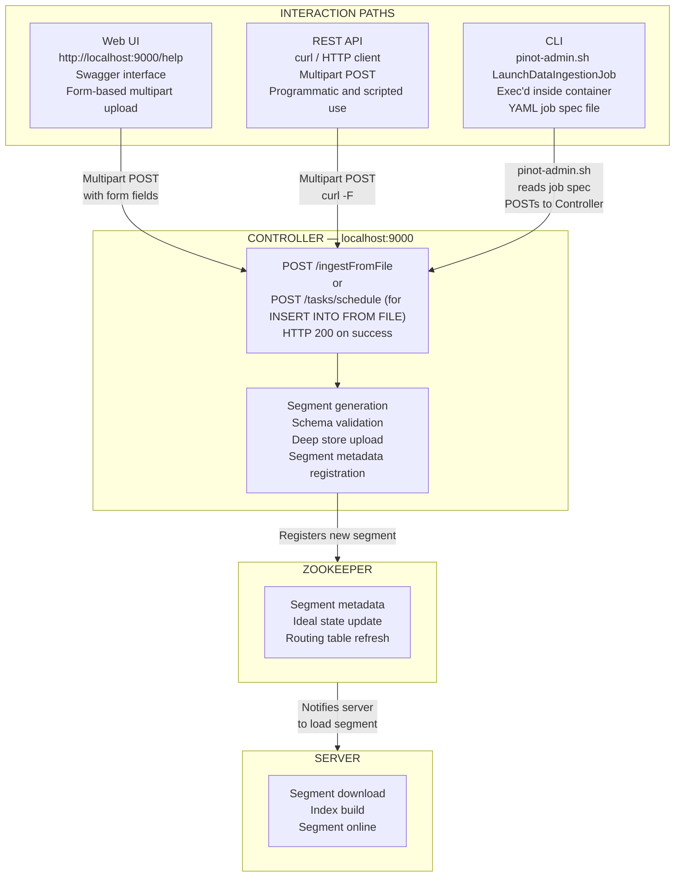

# Lab 20: Ingestion Methods and Transform Functions

## Overview

Every ingestion operation in Apache Pinot can be initiated through three distinct interaction paths: the REST API accessed via curl, the command-line interface provided by `pinot-admin.sh` and the browser-based Swagger UI embedded in the Controller. In production environments, any one of these paths may be unavailable due to network policy, tooling restrictions or operational context. An engineer who knows only one path is brittle; an engineer who knows all three can always complete the work.

This lab performs the same batch ingestion operation three ways, using a `merchants_dim` CSV file as the source. It then covers Pinot's complete transform function vocabulary, which runs at ingestion time rather than query time and finishes with Groovy UDF support and the timestamp index — a pre-computation mechanism that makes time-bucketing GROUP BY queries significantly faster.

> [!NOTE]
> Labs 1 and 2 must be complete and the `merchants_dim` table must exist before running the ingestion steps. The `trip_events` realtime table must be populated before the transform function steps, as those steps reference its existing configuration.


## Learning Objectives

| Objective | Success Criterion |
|-----------|-------------------|
| Invoke an ingestion operation through all three interaction paths | Each of the three methods in Part A returns a 200 response or its equivalent success indicator |
| Explain the difference between the `ingestFromFile` endpoint and `INSERT INTO FROM FILE` | You can state which is synchronous, which delegates to Minion and which supports cloud URIs |
| Read and explain every transform function in `trip_events_rt.table.json` | You can describe the input, output and failure behavior of each configured transform |
| Write a Groovy transform that classifies a numeric column | The `surge_tier` column appears in query results with the correct tier values |
| Run a Groovy expression inside a SELECT query | The query returns correct `fare_tier` classifications without a schema change |
| Add a timestamp index with multiple granularities | EXPLAIN PLAN reports `$DAY(event_time_ms)` resolving against a pre-computed column rather than computing at scan time |


## The Three Interaction Paths

All three interaction methods route through the same Controller HTTP endpoint. The path taken to reach that endpoint differs, but the request body, the processing logic and the response format are identical. Knowing this equivalence eliminates the uncertainty that arises when one path is unavailable.



The response from the Controller is identical regardless of which client issued the request. A `200 OK` with a JSON body confirming the table name and the number of records loaded is the success indicator for all three paths.


## Part A: Three Ways to Ingest Batch Data

The following steps each load the same `merchants.csv` file into the `merchants_dim_OFFLINE` table. Run each method independently and verify the expected response before proceeding to the next.


### Step 1: Via the Web UI (Swagger)

Navigate to `http://localhost:9000/help` in a browser. This is the Swagger UI embedded in the Pinot Controller. It exposes every Controller REST endpoint as an interactive form.

Locate the **Ingestion** section in the left navigation panel of the Swagger UI or use the browser's search function to find `ingestFromFile`. Click the endpoint to expand it, then click `Try it out`.

The form presents the following fields. Fill them in exactly as specified.

| Field | Value to Enter |
|-------|---------------|
| `tableNameWithType` | `merchants_dim_OFFLINE` |
| `batchConfigMapStr` | See the JSON block below |
| `file` | Select `data/merchants.csv` from your local filesystem using the file picker |

Enter the following value in the `batchConfigMapStr` field:

```json
{
  "inputFormat": "csv",
  "recordReaderSpec": {
    "dataFormat": "csv",
    "className": "org.apache.pinot.plugin.inputformat.csv.CSVRecordReader",
    "configClassName": "org.apache.pinot.plugin.inputformat.csv.CSVRecordReaderConfig"
  }
}
```

Click `Execute`. Swagger renders the request as a multipart POST and displays the raw response beneath the form.

Expected response body:

```json
{
  "status": "Successfully ingested file into table: merchants_dim_OFFLINE",
  "numRowsIngested": 200
}
```

The UI approach is well-suited for ad hoc exploration and for situations where you need to inspect the available parameters interactively. It is not suitable for automation because it requires a browser session.


### Step 2: Via the REST API (curl)

The curl command below replicates exactly what Swagger submitted in Step 1. The `batchConfigMapStr` parameter is URL-encoded because it contains characters that are not valid in a query string.

```bash
curl -X POST \
  -F "file=@data/merchants.csv" \
  -H "Content-Type: multipart/form-data" \
  "http://localhost:9000/ingestFromFile?tableNameWithType=merchants_dim_OFFLINE&batchConfigMapStr=%7B%22inputFormat%22%3A%22csv%22%7D"
```

The URL encoding translates `{` to `%7B`, `"` to `%22` and `:` to `%3A`. The simplified `batchConfigMapStr` value used here — `{"inputFormat":"csv"}` — is sufficient for standard CSV files. Pinot uses the `inputFormat` key to select the appropriate record reader and applies sensible defaults for the remaining parameters.

To pass the full `batchConfigMapStr` from Step 1 via curl without manual URL encoding, use the `--data-urlencode` flag:

```bash
curl -X POST \
  -F "file=@data/merchants.csv" \
  --data-urlencode 'batchConfigMapStr={"inputFormat":"csv","recordReaderSpec":{"dataFormat":"csv","className":"org.apache.pinot.plugin.inputformat.csv.CSVRecordReader","configClassName":"org.apache.pinot.plugin.inputformat.csv.CSVRecordReaderConfig"}}' \
  "http://localhost:9000/ingestFromFile?tableNameWithType=merchants_dim_OFFLINE"
```

Expected response:

```json
{
  "status": "Successfully ingested file into table: merchants_dim_OFFLINE",
  "numRowsIngested": 200
}
```

The curl approach is the standard method for automation scripts, CI/CD pipelines and any context where a browser is unavailable. It produces identical results to the Swagger UI because both submit a multipart POST to the same endpoint.


### Step 3: Via the CLI (pinot-admin.sh)

The `pinot-admin.sh` CLI, installed inside the Pinot container at `/opt/pinot/bin/pinot-admin.sh`, provides a `LaunchDataIngestionJob` subcommand that reads a job specification from a YAML file. This path is commonly used in containerized batch workflows where the ingestion logic is codified as a versioned YAML artifact.

First, create the job specification file at `scripts/merchants_job.yaml`:

```yaml
executionFrameworkSpec:
  name: standalone
  segmentGenerationJobRunnerClassName: >
    org.apache.pinot.plugin.ingestion.batch.standalone.SegmentGenerationJobRunner
  segmentTarPushJobRunnerClassName: >
    org.apache.pinot.plugin.ingestion.batch.standalone.SegmentTarPushJobRunner

jobType: SegmentCreationAndTarPush

inputDirURI: file:///data
includeFileNamePattern: glob:**/merchants.csv
outputDirURI: file:///tmp/merchants_segments

pinotFSSpecs:
  - scheme: file
    className: org.apache.pinot.spi.filesystem.LocalPinotFS

recordReaderSpec:
  dataFormat: csv
  className: org.apache.pinot.plugin.inputformat.csv.CSVRecordReader
  configClassName: org.apache.pinot.plugin.inputformat.csv.CSVRecordReaderConfig

tableSpec:
  tableName: merchants_dim
  schemaURI: http://pinot-controller:9000/schemas/merchants_dim
  tableConfigURI: http://pinot-controller:9000/tables/merchants_dim_OFFLINE

pinotClusterSpecs:
  - controllerURI: http://pinot-controller:9000
```

Copy this file into the running Controller container and execute the job:

```bash
docker cp scripts/merchants_job.yaml pinot-controller:/scripts/merchants_job.yaml

docker exec pinot-controller \
  /opt/pinot/bin/pinot-admin.sh LaunchDataIngestionJob \
  -jobSpecFile /scripts/merchants_job.yaml
```

Expected output in the terminal (abbreviated):

```
2024/03/01 10:15:22.431 INFO [SegmentGenerationJobRunner] Starting segment generation for table: merchants_dim
2024/03/01 10:15:23.112 INFO [CSVRecordReader] Total rows read: 200
2024/03/01 10:15:24.088 INFO [SegmentGenerationJobRunner] Successfully generated segment: merchants_dim_OFFLINE_0
2024/03/01 10:15:24.901 INFO [SegmentTarPushJobRunner] Successfully pushed segment: merchants_dim_OFFLINE_0 to controller
```

The CLI approach produces the same ingested segment as the other two methods. Its advantage is that the job specification is a plain text YAML file that can be version-controlled, reviewed and executed deterministically across environments.


### Step 4: INSERT INTO FROM FILE Syntax (Modern Approach)

Pinot supports a SQL-style ingestion statement that integrates directly with the Query Console and delegates execution to a Minion task. This approach is recommended for cloud-native deployments because the URI in the `FROM FILE` clause can reference any filesystem that Pinot supports, including S3, GCS, HDFS and Azure Blob Storage.

Open the Query Console at `http://localhost:9000/#/query` and run the following:

```sql
SET taskName = 'merchants-load-v2';
SET input.fs.className = 'org.apache.pinot.spi.filesystem.LocalPinotFS';

INSERT INTO "merchants_dim"
FROM FILE 'file:///data/merchants.csv'
```

Expected response from the Query Console:

```json
{
  "resultTable": {
    "dataSchema": {
      "columnNames": ["numRowsIngested", "taskId"],
      "columnDataTypes": ["LONG", "STRING"]
    },
    "rows": [
      [200, "Task_SegmentGenerationAndPushTask_merchants_dim_OFFLINE_1234567890"]
    ]
  }
}
```

The `INSERT INTO FROM FILE` statement submits a `SegmentGenerationAndPushTask` to Minion rather than performing the ingestion synchronously. The query returns immediately with a task ID. Track task progress using:

```bash
curl -s "http://localhost:9000/tasks/taskstates/Task_SegmentGenerationAndPushTask_merchants_dim_OFFLINE_1234567890" \
  | python3 -m json.tool
```

To target an S3 source instead of the local filesystem, change the SET parameters and the FROM FILE URI:

```sql
SET taskName = 'merchants-load-s3';
SET input.fs.className = 'org.apache.pinot.plugin.filesystem.S3PinotFS';
SET input.fs.prop.region = 'us-east-1';

INSERT INTO "merchants_dim"
FROM FILE 's3://my-bucket/data/merchants.csv'
```

No other change is required. The same `INSERT INTO FROM FILE` syntax works across all supported storage backends.


### Step 5: Ingestion Method Comparison

| Method | Best For | Limitations | Auth Required |
|--------|---------|-------------|:-------------:|
| Web UI (Swagger) | Interactive exploration, ad hoc testing, parameter discovery | Requires browser; not scriptable; file must be on the client machine | No (if cluster has no auth) |
| REST API (curl) | Automation scripts, CI/CD pipelines, programmatic ingestion from any host | File must be accessible from the machine running curl; synchronous, blocks until complete | Optional via header |
| CLI (pinot-admin.sh) | Containerized batch pipelines, reproducible job specs, local file ingestion inside the container | Requires shell access to the container or a mounted volume; YAML file must be pre-placed | No (uses container network) |
| INSERT INTO FROM FILE | Cloud-native batch ingestion, S3/GCS/HDFS sources, integration with Minion task lifecycle | Asynchronous — does not block; requires Minion to be running; task failures must be monitored separately | Optional via cluster auth |


## Part B: Transform Functions

Transform functions execute at ingestion time. They run before the row is written into a segment and produce derived column values that are stored as first-class columns. Because the transformation happens once, at ingestion, there is no per-query cost. A query that filters or groups by a transformed column pays exactly the same execution cost as a query against a column that was present verbatim in the source data.

Transforms are configured in the `ingestionConfig.transformConfigs` array inside the table configuration JSON. Each entry maps a destination column name to a transform expression using Pinot's function vocabulary.


### Step 6: Inspect the Transform Configuration in trip_events_rt.table.json

Retrieve the current table configuration:

```bash
curl -s http://localhost:9000/tables/trip_events_REALTIME/tableConfigs \
  | python3 -m json.tool > /tmp/trip_events_config.json
```

Locate the `ingestionConfig.transformConfigs` block. It will resemble the following:

```json
{
  "ingestionConfig": {
    "transformConfigs": [
      {
        "columnName": "payment_method",
        "transformFunction": "jsonPathString(attributes, '$.payment.method', 'unknown')"
      },
      {
        "columnName": "route_json",
        "transformFunction": "jsonFormat(route)"
      },
      {
        "columnName": "waypoints",
        "transformFunction": "jsonPathArrayDefaultEmpty(route, '$.waypoints[*].name')"
      },
      {
        "columnName": "event_time_ms",
        "transformFunction": "toEpochMillis(event_time)"
      },
      {
        "columnName": "city_normalized",
        "transformFunction": "lower(city)"
      }
    ]
  }
}
```

Each function is explained in the following sections.

**`jsonPathString`** extracts a single scalar string value from a JSON blob column using a JSONPath expression. The third argument is the default value to use when the path does not exist in the document. In this configuration, the `attributes` column is a JSON string; the transform extracts the nested `payment.method` field and stores it as `payment_method`. Documents where the path is absent receive the value `'unknown'`.

```json
{
  "columnName": "payment_method",
  "transformFunction": "jsonPathString(attributes, '$.payment.method', 'unknown')"
}
```

**`jsonFormat`** serializes an entire structured column (a map or nested object) into a JSON string. This is useful when a source record contains a nested structure that you want to preserve as a queryable string for later extraction, without expanding it into individual flat columns at ingest time.

```json
{
  "columnName": "route_json",
  "transformFunction": "jsonFormat(route)"
}
```

**`jsonPathArrayDefaultEmpty`** extracts an array of values matching a JSONPath wildcard expression. When the path is absent, the function returns an empty array rather than null or an error. The `waypoints` column will contain a multi-value string array holding the name of each waypoint from the route document.

```json
{
  "columnName": "waypoints",
  "transformFunction": "jsonPathArrayDefaultEmpty(route, '$.waypoints[*].name')"
}
```

**`toEpochMillis`** converts a date or timestamp string in the source record into a Unix epoch millisecond long value. The source column `event_time` is a human-readable ISO 8601 string; the resulting `event_time_ms` column is a long that Pinot can use for range pruning, time boundary resolution and timestamp index operations.

```json
{
  "columnName": "event_time_ms",
  "transformFunction": "toEpochMillis(event_time)"
}
```

**`lower`** lowercases the entire string value of the input column. The source `city` column may arrive with inconsistent capitalization from upstream producers. The derived `city_normalized` column normalizes this variation so that inverted index lookups and GROUP BY operations produce consistent results.

```json
{
  "columnName": "city_normalized",
  "transformFunction": "lower(city)"
}
```


### Transform Function Reference Table

The following table is a complete reference for the transform functions available in Pinot's ingestion transform vocabulary. Functions in the last row are addressed separately in Part C.

| Function | Syntax | Return Type | Example | Use Case |
|----------|--------|-------------|---------|----------|
| `jsonPathString` | `jsonPathString(col, path, default)` | STRING | `jsonPathString(attrs, '$.user.name', 'anon')` | Extract a string scalar from a JSON blob column |
| `jsonPathLong` | `jsonPathLong(col, path, default)` | LONG | `jsonPathLong(attrs, '$.ride.distance_m', 0)` | Extract a long integer from a JSON blob column |
| `jsonPathDouble` | `jsonPathDouble(col, path, default)` | DOUBLE | `jsonPathDouble(attrs, '$.fare.amount', 0.0)` | Extract a floating-point value from a JSON blob column |
| `jsonPathArray` | `jsonPathArray(col, path)` | STRING ARRAY | `jsonPathArray(tags, '$.items[*]')` | Extract an array of values; returns null if path absent |
| `jsonPathArrayDefaultEmpty` | `jsonPathArrayDefaultEmpty(col, path)` | STRING ARRAY | `jsonPathArrayDefaultEmpty(route, '$.waypoints[*].id')` | Extract an array of values; returns empty array if path absent |
| `jsonFormat` | `jsonFormat(col)` | STRING | `jsonFormat(metadata)` | Serialize a nested object to a JSON string |
| `toEpochMillis` | `toEpochMillis(col)` | LONG | `toEpochMillis(created_at)` | Convert an ISO 8601 string to epoch milliseconds |
| `toEpochSeconds` | `toEpochSeconds(col)` | LONG | `toEpochSeconds(created_at)` | Convert an ISO 8601 string to epoch seconds |
| `toEpochDays` | `toEpochDays(col)` | LONG | `toEpochDays(date_str)` | Convert a date string to the number of days since epoch |
| `lower` | `lower(col)` | STRING | `lower(status)` | Lowercase the entire string value |
| `upper` | `upper(col)` | STRING | `upper(country_code)` | Uppercase the entire string value |
| `concat` | `concat(col1, separator, col2)` | STRING | `concat(first_name, ' ', last_name)` | Concatenate two columns with a separator |
| `add` | `add(col1, col2)` | DOUBLE | `add(base_fare, tip_amount)` | Arithmetic addition of two numeric columns |
| `sub` | `sub(col1, col2)` | DOUBLE | `sub(drop_time_ms, pickup_time_ms)` | Arithmetic subtraction |
| `mult` | `mult(col1, col2)` | DOUBLE | `mult(distance_km, rate_per_km)` | Arithmetic multiplication |
| `div` | `div(col1, col2)` | DOUBLE | `div(fare_amount, distance_km)` | Arithmetic division; undefined behavior if divisor is zero |
| `groovy` | `groovy(typeDescriptor, script, inputCols...)` | Configured type | See Part C | Arbitrary transformation logic; any return type |


## Part C: Groovy Transform

When no built-in function covers the required transformation logic, Pinot supports embedding Groovy scripts directly in transform configurations. The Groovy transform is the most expressive option available — it can evaluate any logic expressible in Groovy, including conditionals, loops, string operations and arithmetic combinations.

The Groovy function signature takes three components: a JSON type descriptor that defines the output type, the Groovy script body as a string and one or more input column references. Inside the script body, input columns are referenced as `arg0`, `arg1`, `arg2` and so on, in the order they appear in the argument list.


### Step 7: Add a Groovy Transform for surge_tier

The `surge_tier` column classifies each trip into one of four surge pricing tiers based on the `surge_multiplier` value. Add the following entry to the `transformConfigs` array in `trip_events_rt.table.json`:

```json
{
  "columnName": "surge_tier",
  "transformFunction": "groovy({\"returnType\":\"STRING\",\"isSingleValue\":true}, 'if (arg0 < 1.2) return \"none\"; else if (arg0 < 1.5) return \"low\"; else if (arg0 < 2.0) return \"medium\"; return \"high\"', surge_multiplier)"
}
```

The three components are:

1. `{"returnType":"STRING","isSingleValue":true}` — the type descriptor, serialized as a JSON object. `returnType` accepts any Pinot column type: `STRING`, `LONG`, `DOUBLE`, `BOOLEAN`, `INT`, `FLOAT`. `isSingleValue` must be `true` for scalar outputs and `false` for multi-value array outputs.

2. The Groovy script body: `'if (arg0 < 1.2) return "none"; else if (arg0 < 1.5) return "low"; else if (arg0 < 2.0) return "medium"; return "high"'` — a single Groovy expression that evaluates `arg0` (the `surge_multiplier` column) and returns a string tier label.

3. `surge_multiplier` — the input column reference. This becomes `arg0` inside the script.

Submit the updated table configuration:

```bash
curl -X PUT \
  -H "Content-Type: application/json" \
  -d @/tmp/trip_events_config_updated.json \
  "http://localhost:9000/tables/trip_events_REALTIME" \
  | python3 -m json.tool
```

Expected response:

```json
{
  "status": "Table config updated for trip_events_REALTIME"
}
```

New events arriving through Kafka after this point will include the `surge_tier` column. Existing segments do not retroactively apply the transform — they must be reloaded or replaced with new segments to populate the column.

Verify the transform is working by querying recent events:

```sql
SELECT surge_multiplier, surge_tier, COUNT(*) AS trips
FROM trip_events
WHERE event_time_ms > NOW() - 3600000
GROUP BY surge_multiplier, surge_tier
ORDER BY surge_multiplier
LIMIT 20
```

Expected output pattern:

| surge_multiplier | surge_tier | trips |
|:----------------:|:----------:|:-----:|
| 1.0 | none | 142 |
| 1.3 | low | 67 |
| 1.7 | medium | 38 |
| 2.2 | high | 11 |


### Step 8: Groovy in Queries

Groovy expressions are not limited to ingestion transforms. They can also be used directly inside SELECT queries when runtime classification is needed without a schema change. This is useful for prototyping or for applying transient classifications that are not worth persisting to segments.

Run the following query in the Query Console at `http://localhost:9000/#/query`:

```sql
SELECT
  groovy(
    '{"returnType":"STRING","isSingleValue":true}',
    'if (arg0 > 200) return "high_value"; else if (arg0 > 100) return "medium_value"; return "low_value"',
    fare_amount
  ) AS fare_tier,
  COUNT(*) AS trips
FROM trip_events
GROUP BY fare_tier
ORDER BY trips DESC
```

Expected output:

| fare_tier | trips |
|:----------:|:-----:|
| low_value | 8431 |
| medium_value | 2107 |
| high_value | 461 |

> [!NOTE]
> Groovy execution in queries requires explicit enablement in the server configuration. Add the following property to the server's `pinot-server.properties` file or to the server's environment configuration: `pinot.server.query.executor.enable.groovy=true`. Without this flag, a query containing a Groovy expression returns an error with the message `Groovy is not enabled on the server`. Groovy in ingestion transforms does not require this flag — it applies only to query-time execution.


## Part D: Timestamp Index

The timestamp index pre-computes truncated time values at one or more granularities — DAY, WEEK, MONTH or HOUR — at segment creation time. Instead of computing `FLOOR(event_time_ms / 86400000) * 86400000` at query time for every scanned row, Pinot reads the pre-computed day-boundary value from a stored column. This transforms a compute-intensive expression over potentially millions of rows into a simple column read.

The timestamp index is most impactful for dashboards and reports that aggregate data by calendar day, week or month over large segments.


### Step 9: Add a Timestamp Index with Multiple Granularities

Add the following field configuration to the `tableIndexConfig.fieldConfigList` array in `trip_events_rt.table.json`:

```json
{
  "name": "event_time_ms",
  "encodingType": "DICTIONARY",
  "indexTypes": ["TIMESTAMP"],
  "timestampConfig": {
    "granularities": ["DAY", "WEEK", "MONTH"]
  }
}
```

This instructs Pinot to store three additional columns inside each segment at creation time: `$DAY(event_time_ms)`, `$WEEK(event_time_ms)` and `$MONTH(event_time_ms)`. Each contains the epoch millisecond value truncated to the respective calendar boundary. These columns are internal to the segment and do not appear in the schema — they are referenced through the special `$GRANULARITY(column)` syntax in SQL.

Submit the updated configuration and reload segments:

```bash
curl -X PUT \
  -H "Content-Type: application/json" \
  -d @/tmp/trip_events_config_updated.json \
  "http://localhost:9000/tables/trip_events_REALTIME" \
  | python3 -m json.tool

curl -X POST \
  "http://localhost:9000/segments/trip_events_REALTIME/reload" \
  | python3 -m json.tool
```

Expected reload response:

```json
{
  "status": "Request to reload all segments of table trip_events_REALTIME submitted"
}
```

Once the reload completes (typically 30 to 60 seconds), run the following query using the pre-computed daily granularity:

```sql
SELECT
  $DAY(event_time_ms) AS day_bucket,
  COUNT(*) AS trips,
  ROUND(SUM(fare_amount), 2) AS daily_revenue
FROM trip_events
WHERE event_time_ms > NOW() - 30 * 86400000
GROUP BY day_bucket
ORDER BY day_bucket
```

Expected output (values vary by dataset):

| day_bucket | trips | daily_revenue |
|:----------:|:-----:|:-------------:|
| 1709251200000 | 3241 | 52847.50 |
| 1709337600000 | 3089 | 49230.75 |
| 1709424000000 | 3512 | 57188.20 |

Verify that the timestamp index is being used by examining EXPLAIN PLAN:

```sql
EXPLAIN PLAN FOR
SELECT $DAY(event_time_ms) AS day_bucket, COUNT(*) AS trips
FROM trip_events
WHERE event_time_ms > NOW() - 30 * 86400000
GROUP BY day_bucket
ORDER BY day_bucket
```

The plan should show `$DAY(event_time_ms)` resolving to a direct column read rather than a function evaluation expression. The key indicator in the plan output is the absence of any `TransformOperator` or `FunctionEvaluation` node for the time bucketing operation.

The timestamp index granularities and their query syntax are summarized below.

| Granularity | Stored Column Name | Truncation Boundary | Example day_bucket Value |
|:-----------:|:------------------:|---------------------|:------------------------:|
| `HOUR` | `$HOUR(col)` | Start of the calendar hour | 1709254800000 (2024-03-01 01:00:00 UTC) |
| `DAY` | `$DAY(col)` | Start of the calendar day (UTC midnight) | 1709251200000 (2024-03-01 00:00:00 UTC) |
| `WEEK` | `$WEEK(col)` | Start of the Monday-anchored ISO week | 1708905600000 (2024-02-26 00:00:00 UTC) |
| `MONTH` | `$MONTH(col)` | Start of the calendar month | 1709251200000 (2024-03-01 00:00:00 UTC) |


## Reflection Prompts

1. Steps 1, 2 and 3 each successfully ingested data using a different interaction path. The segment count in `merchants_dim_OFFLINE` after all three steps will exceed the expected row count. Explain why this happens, what mechanism Pinot uses to identify duplicate segments and what operation you would run to consolidate the result.

2. The `lower(city)` transform in Step 6 creates a derived column `city_normalized`, but the original `city` column is also retained in the schema. Describe a scenario where retaining both columns is the correct design choice and a scenario where it wastes storage. What table configuration change would remove the raw `city` column from ingested segments?

3. The Groovy transform in Step 7 is evaluated once at ingestion time and stored in the segment. The equivalent Groovy expression in Step 8 is evaluated at query time against every scanned row. For a table with 500 million rows queried 1,000 times per day, calculate the approximate number of Groovy script evaluations per day for each approach and explain why the ingestion-time approach is the correct architectural choice for a stable classification rule.

4. The timestamp index configured in Step 9 specifies `DAY`, `WEEK` and `MONTH` granularities. A new dashboard requirement arrives that needs hourly trip counts. Without adding `HOUR` to the timestamp index, what is the SQL approach for computing hourly buckets? What is the performance trade-off compared to adding `HOUR` to the index?


[Previous: Lab 17 — Real-Time Dashboard Integration with Grafana](lab-17-grafana-integration.md) | [Next: Lab 21 — Storage Tiers and Cold Data Management](lab-21-storage-tiers.md)
