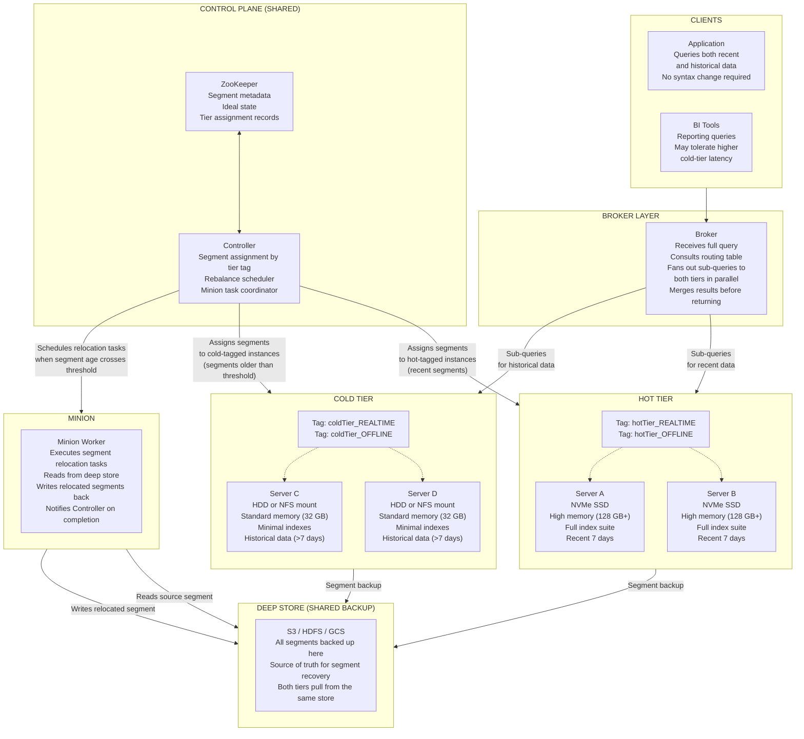
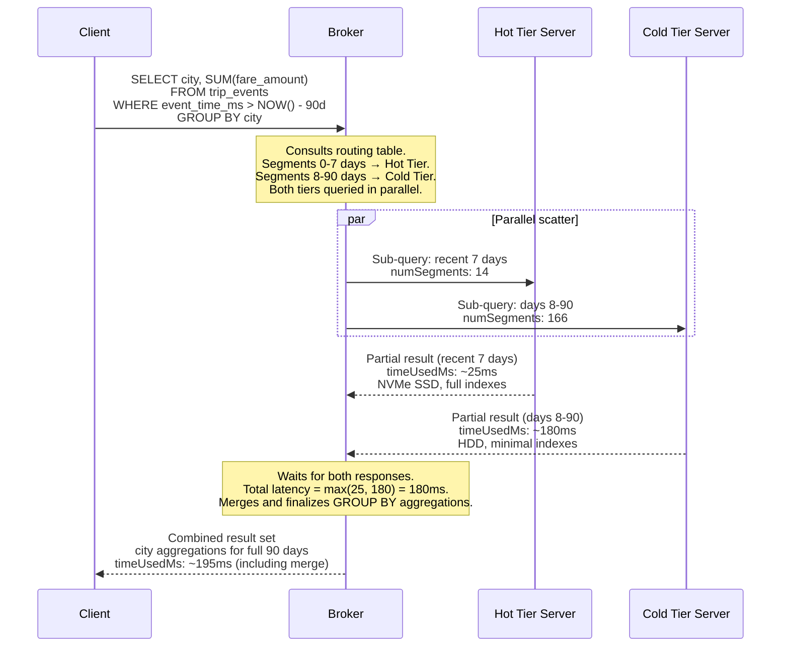

# Lab 21: Storage Tiers and Cold Data Management

## Overview

A production Pinot deployment accumulates data continuously. After several months, the majority of data in a large table is historical — queried infrequently, mostly for reporting, and never subject to point lookups or real-time dashboard traffic. Serving that historical data from the same SSD-backed, fully-indexed server pool as today's data wastes expensive fast storage and inflates infrastructure cost without improving the latency of any query that actually matters.

Pinot's storage tier system addresses this asymmetry. You define a hot tier — servers with NVMe SSDs, high memory, and the full index suite — and a cold tier — servers with HDDs or object-backed filesystems and only the indexes needed for infrequent analytical queries. The Controller automatically moves segments from hot to cold based on time thresholds you configure. The Broker routes each query to the correct tier or tiers transparently, without any change to the query syntax.

This lab configures a two-tier system for the `trip_events` realtime table: a hot tier retaining the most recent seven days and a cold tier serving all historical data. It also covers per-tier index overrides, segment relocation verification, and the cost and latency trade-offs that determine when tiered storage is the right architectural choice.

> [!NOTE]
> This lab builds on Labs 1 through 4. The `trip_events` realtime table must be populated with committed segments before the tier assignment steps will produce observable results. Minion must be running because the Minion-based `RealtimeToOfflineSegmentsTask` is the standard mechanism for moving data between tiers in hybrid configurations.

---

## Learning Objectives

| Objective | Success Criterion |
|-----------|-------------------|
| Explain the data flow from hot to cold tier | You can describe the role of each component in the tier transition without reference to the diagram |
| Tag server instances with tier labels | `GET /instances/{instanceName}` returns the expected tier tags after `PUT /instances/{instanceName}/updateTags` |
| Add `tierConfigs` to a table configuration | The updated table config is accepted by the Controller and `tierConfigs` appears in the retrieved config |
| Add `tierOverwrites` for per-tier index configurations | The cold tier uses fewer indexes than the hot tier, as specified in the `tierOverwrites` block |
| Verify segment tier assignment via the REST API | `GET /segments/{tableName}/metadata` shows the `tier` field for each segment |
| Run a query that spans both tiers | The query returns a combined result set without any syntax change or client modification |
| Trigger a manual segment rebalance | `POST /tables/{tableName}/rebalance` returns a task ID and segments move to the correct tier |
| Articulate the cost and latency trade-offs | You can populate the storage cost table with estimates for your workload's data volume and access pattern |

---

## The Tier Architecture

The following diagram shows the full topology of a two-tier Pinot deployment. Hot and cold tiers share a single Controller, ZooKeeper ensemble, and deep store. The logical separation is maintained through instance tags: the Controller assigns segments to tagged instances, and the Broker resolves routing to the correct tagged server pool for each query.



The deep store is not a tier — it is the shared backup layer that both tiers use for segment persistence. When a segment is relocated from hot to cold, Minion writes a version of that segment (potentially with a different index configuration) back to the deep store, and the cold-tier server loads it from there. The hot-tier server then unloads the segment. At no point during this transition does the segment become unqueryable — the Broker continues routing to the hot-tier server until the cold-tier server confirms the new segment is online.

---

## The Tiered Query Path

A query that spans a time range covering both recent and historical data is handled by the Broker in a single scatter-gather operation. The Broker does not need to know which segments are on which tier — it consults the routing table, which the Controller maintains as segment assignments change, and fans out sub-queries to all instances that hold relevant segments.



The overall query latency is bounded by the slower tier. This is the fundamental trade-off in tiered storage: queries that touch only recent data are as fast as a hot-tier-only deployment, while queries spanning historical data are bounded by cold-tier latency. For workloads where historical queries are infrequent and latency requirements are relaxed, this trade-off is highly favorable.

---

## Step 1: Tag Servers with Tier Labels

Server tier tags are the mechanism by which the Controller decides which server receives which segment. The tag format is `{tierName}_REALTIME` for servers hosting consuming or committed realtime segments and `{tierName}_OFFLINE` for servers hosting offline segments.

First, retrieve the current server instance names:

```bash
curl -s "http://localhost:9000/instances?type=SERVER" | python3 -m json.tool
```

Note the instance name or names returned — the format is typically `Server_<hostname>_<port>`. Use the actual instance name from your environment in the commands below.

Apply hot tier tags to the first server:

```bash
curl -X PUT \
  "http://localhost:9000/instances/Server_localhost_8098/updateTags" \
  -H "Content-Type: application/json" \
  -d '{"tags":["hotTier_REALTIME","hotTier_OFFLINE"]}' \
  | python3 -m json.tool
```

Expected response:

```json
{
  "status": "Updated tags: [hotTier_REALTIME, hotTier_OFFLINE] for instance: Server_localhost_8098"
}
```

In a production environment with dedicated cold-tier hardware, you would apply cold tier tags to a separate server instance. For this lab's single-server Docker environment, apply both hot and cold tags to the same instance so that the configuration can be demonstrated and validated without requiring additional hardware:

```bash
curl -X PUT \
  "http://localhost:9000/instances/Server_localhost_8098/updateTags" \
  -H "Content-Type: application/json" \
  -d '{"tags":["hotTier_REALTIME","hotTier_OFFLINE","coldTier_REALTIME","coldTier_OFFLINE"]}' \
  | python3 -m json.tool
```

Expected response:

```json
{
  "status": "Updated tags: [hotTier_REALTIME, hotTier_OFFLINE, coldTier_REALTIME, coldTier_OFFLINE] for instance: Server_localhost_8098"
}
```

Applying both hot and cold tags to the same instance is valid for learning the configuration. In production, the tags would be split across distinct server pools. A server tagged for both tiers will receive segments from both tier configurations, which means it provides no physical isolation — only the logical routing behavior can be observed.

Verify that the tags were applied:

```bash
curl -s "http://localhost:9000/instances/Server_localhost_8098" \
  | python3 -m json.tool | grep -A 8 '"tags"'
```

Expected output:

```json
"tags": [
  "hotTier_REALTIME",
  "hotTier_OFFLINE",
  "coldTier_REALTIME",
  "coldTier_OFFLINE"
]
```

---

## Step 2: Add Tier Configuration to trip_events_rt.table.json

Retrieve the current table configuration:

```bash
curl -s "http://localhost:9000/tables/trip_events_REALTIME/tableConfigs" \
  | python3 -m json.tool > /tmp/trip_events_config.json
```

Add the `tierConfigs` array at the top level of the table configuration object, as a sibling of `tableIndexConfig`, `tenants`, and `segmentsConfig`:

```json
{
  "tierConfigs": [
    {
      "name": "hotTier",
      "segmentSelectorType": "time",
      "segmentAge": "7d",
      "storageType": "pinot_server",
      "serverTag": "hotTier_REALTIME"
    },
    {
      "name": "coldTier",
      "segmentSelectorType": "time",
      "segmentAge": "30d",
      "storageType": "pinot_server",
      "serverTag": "coldTier_REALTIME"
    }
  ]
}
```

The `segmentAge` field defines the minimum age a segment must reach before it becomes eligible for this tier. A segment created today is 0 days old. When it reaches 7 days of age, the Controller's tier assignment logic moves it from the hot tier to the cold tier. When it reaches 30 days of age, it transitions again — in this configuration, from the cold tier to a deeper cold tier or to object storage if a third tier were defined.

Submit the updated configuration:

```bash
curl -X PUT \
  -H "Content-Type: application/json" \
  -d @/tmp/trip_events_config_updated.json \
  "http://localhost:9000/tables/trip_events_REALTIME" \
  | python3 -m json.tool
```

Expected response:

```json
{
  "status": "Table config updated for trip_events_REALTIME"
}
```

Verify the tier configuration was stored:

```bash
curl -s "http://localhost:9000/tables/trip_events_REALTIME/tableConfigs" \
  | python3 -m json.tool | grep -A 20 '"tierConfigs"'
```

The response should contain the `tierConfigs` block exactly as submitted.

---

## Step 3: Add Per-Tier Index Overrides Using tierOverwrites

The hot tier serves recent data that is frequently queried by dashboards, real-time alerts, and operational queries. It warrants a full index suite: inverted indexes for equality filtering on dimension columns, bloom filters for point lookups by trip and driver ID, and range indexes for numeric and time-based predicates.

The cold tier serves historical data accessed primarily by batch reports and analytical queries. These queries tend to be broader range scans rather than point lookups. Maintaining bloom filters on cold-tier segments wastes storage without providing meaningful acceleration for those access patterns.

Add the `tierOverwrites` block to the table configuration, as a sibling of `tierConfigs`:

```json
{
  "tierOverwrites": {
    "hotTier": {
      "tableIndexConfig": {
        "invertedIndexColumns": ["city", "status", "merchant_id", "service_tier"],
        "bloomFilterColumns": ["trip_id", "driver_id"],
        "rangeIndexColumns": ["fare_amount", "event_time_ms"]
      }
    },
    "coldTier": {
      "tableIndexConfig": {
        "invertedIndexColumns": ["city", "status"],
        "rangeIndexColumns": ["event_time_ms"]
      }
    }
  }
}
```

The hot tier retains four inverted index columns, two bloom filter columns, and two range index columns. The cold tier drops the bloom filters entirely and retains only the two most broadly useful inverted index columns and the time range index.

The rationale for each removal in the cold tier is as follows. Bloom filters are designed for point lookup queries of the form `WHERE trip_id = 'abc123'`. Historical trip lookups are rare — most historical queries aggregate data by city, status, or time window, not by individual trip identifier. The storage cost of bloom filter bitmaps across hundreds of cold segments is not justified by the frequency of point lookups against them. The `merchant_id` and `service_tier` inverted indexes are also removed because historical reports typically group by `city` and `status`, not by merchant. Removing these indexes reduces the cold tier segment size, which directly reduces storage cost and speeds up cold tier segment loading.

Submit the updated configuration with both `tierConfigs` and `tierOverwrites`:

```bash
curl -X PUT \
  -H "Content-Type: application/json" \
  -d @/tmp/trip_events_config_with_tiers.json \
  "http://localhost:9000/tables/trip_events_REALTIME" \
  | python3 -m json.tool
```

Expected response:

```json
{
  "status": "Table config updated for trip_events_REALTIME"
}
```

The `tierOverwrites` configuration takes effect when segments are moved to each tier. Segments already assigned to the cold tier need to be reloaded to rebuild indexes according to the cold-tier specification.

---

## Step 4: Verify Segment Tier Assignment

Once the tier configuration is applied and segments have had time to age past the configured thresholds, inspect the segment metadata to confirm tier assignments.

```bash
curl -s "http://localhost:9000/segments/trip_events_REALTIME/metadata" \
  | python3 -m json.tool | python3 -c "
import sys, json
data = json.load(sys.stdin)
for seg in data:
    name = seg.get('segmentName', 'unknown')
    tier = seg.get('segmentMetadata', {}).get('custom.tier', 'not assigned')
    start = seg.get('segmentMetadata', {}).get('segment.start.time', 'unknown')
    print(f'{name:60s}  tier={tier}  start={start}')
"
```

Expected output (values vary by dataset and elapsed time):

```
trip_events__0__165__20240301T000000Z  tier=hotTier   start=1709251200000
trip_events__0__164__20240224T000000Z  tier=coldTier  start=1708732800000
trip_events__0__163__20240217T000000Z  tier=coldTier  start=1708128000000
```

Segments whose creation time falls within the last seven days appear in the hot tier. Older segments appear in the cold tier. If all segments show `tier=not assigned`, the segment age has not yet crossed the threshold — you can artificially lower `segmentAge` in the tier config to `1h` for testing, or inspect segment creation times to confirm their age.

You can also verify tier placement through the Controller UI. Navigate to `http://localhost:9000`, click Tables, select `trip_events_REALTIME`, and open the Segments tab. Each row in the segment list includes a hosting server column — confirm that hot-tier segments are on hotTier-tagged instances and cold-tier segments are on coldTier-tagged instances.

---

## Step 5: Query Both Tiers

Time-spanning queries that cover both recent and historical data work without any syntax change. The Broker resolves tier routing internally based on the segment metadata in its routing table.

Run the following query from the Query Console at `http://localhost:9000/#/query`:

```sql
SELECT
  $DAY(event_time_ms) AS day_bucket,
  city,
  COUNT(*) AS trips,
  ROUND(SUM(fare_amount), 2) AS daily_revenue
FROM trip_events
WHERE event_time_ms > NOW() - 90 * 86400000
GROUP BY day_bucket, city
ORDER BY day_bucket DESC, daily_revenue DESC
LIMIT 30
```

The query covers 90 days of data, spanning both the hot tier (last 7 days) and the cold tier (days 8 through 90). The result set combines data from both tiers, and the query syntax is identical to what you would write against a single-tier table.

Inspect the BrokerResponse statistics to confirm that both tiers contributed:

```bash
curl -s -X POST \
  "http://localhost:9000/query/sql" \
  -H "Content-Type: application/json" \
  -d '{
    "sql": "SELECT COUNT(*) AS total_trips, MIN(event_time_ms) AS oldest_event FROM trip_events WHERE event_time_ms > NOW() - 90 * 86400000"
  }' \
  | python3 -m json.tool
```

Expected BrokerResponse fields to examine:

| Field | What It Tells You |
|-------|------------------|
| `numSegmentsQueried` | Total segments queried across both tiers |
| `numSegmentsMatched` | Segments that contained data matching the time predicate |
| `timeUsedMs` | Total query time, bounded by the slower tier |
| `minConsumingFreshnessTimeMs` | Age of the oldest consuming segment, confirming hot tier is being read |

If `numSegmentsQueried` is low and the result set is missing expected historical data, the cold tier may not yet have segments assigned to it — verify the segment ages and tier thresholds from Step 4.

---

## Step 6: Manually Trigger Segment Relocation

The Controller's tier assignment scheduler runs periodically according to the cluster-level task scheduling configuration. To trigger an immediate evaluation and relocation of segments to their correct tiers without waiting for the scheduled cycle, use the rebalance endpoint:

```bash
curl -s -X POST \
  "http://localhost:9000/tables/trip_events/rebalance?reassignInstances=true&includeConsuming=false" \
  | python3 -m json.tool
```

Expected response:

```json
{
  "rebalanceResult": "DONE",
  "description": "Rebalance completed. Segments reassigned to correct instances based on current tier configuration.",
  "jobId": "rebalance_trip_events_1709251200000"
}
```

The `reassignInstances=true` parameter instructs the Controller to re-evaluate all segment placements against the current tier configuration and move any segment that is on the wrong tier. The `includeConsuming=false` parameter excludes consuming segments from the rebalance — consuming segments are always hosted on the server where the Kafka partition consumer is running and should not be relocated.

Monitor rebalance progress:

```bash
curl -s "http://localhost:9000/tables/trip_events/rebalanceStatus" \
  | python3 -m json.tool
```

After the rebalance completes, repeat the segment metadata inspection from Step 4 to confirm all segments are on the expected tier.

---

## Tier Configuration Reference

The following table documents every field in the `tierConfigs` array and the `tierOverwrites` object, with their types, requirements, and valid values.

| Field | Location | Type | Required | Description | Example Value |
|-------|----------|------|:--------:|-------------|---------------|
| `name` | `tierConfigs[]` | STRING | Yes | Unique identifier for this tier; referenced in `tierOverwrites` and server tag convention | `"hotTier"` |
| `segmentSelectorType` | `tierConfigs[]` | STRING | Yes | Strategy for deciding which segments belong to this tier; only `time` is supported currently | `"time"` |
| `segmentAge` | `tierConfigs[]` | STRING | Yes (when `segmentSelectorType=time`) | Minimum segment age for eligibility; format is `Nd` for days, `Nh` for hours | `"7d"`, `"30d"`, `"12h"` |
| `storageType` | `tierConfigs[]` | STRING | Yes | Where the tier stores segments; `pinot_server` for local disk; `pinot_filesystem` for object storage | `"pinot_server"` |
| `serverTag` | `tierConfigs[]` | STRING | Yes (when `storageType=pinot_server`) | The instance tag that identifies servers belonging to this tier | `"hotTier_REALTIME"` |
| `fsScheme` | `tierConfigs[]` | STRING | Yes (when `storageType=pinot_filesystem`) | URI scheme for the object storage backend | `"s3"`, `"gs"`, `"hdfs"` |
| `fsDirURI` | `tierConfigs[]` | STRING | Yes (when `storageType=pinot_filesystem`) | Base URI for cold segment storage on object storage | `"s3://my-bucket/cold-segments/"` |
| `tableIndexConfig` | `tierOverwrites.{tierName}` | OBJECT | No | Overrides the base table index configuration for segments on this tier | See Step 3 |
| `invertedIndexColumns` | `tierOverwrites.{tierName}.tableIndexConfig` | STRING ARRAY | No | Columns to build inverted indexes on for this tier's segments | `["city","status"]` |
| `bloomFilterColumns` | `tierOverwrites.{tierName}.tableIndexConfig` | STRING ARRAY | No | Columns to build bloom filter indexes on for this tier's segments | `["trip_id","driver_id"]` |
| `rangeIndexColumns` | `tierOverwrites.{tierName}.tableIndexConfig` | STRING ARRAY | No | Columns to build range indexes on for this tier's segments | `["fare_amount","event_time_ms"]` |
| `noDictionaryColumns` | `tierOverwrites.{tierName}.tableIndexConfig` | STRING ARRAY | No | Columns to store without dictionary encoding on this tier; reduces memory for high-cardinality string columns on cold tier | `["trip_id","driver_id"]` |

---

## Storage Cost Analysis

The following table compares the estimated infrastructure cost and query latency characteristics for four storage configurations applied to the same 90-day dataset. The values are illustrative and scale linearly with data volume — adjust the row count and bytes-per-row for your workload.

Assumptions: 500 million rows, 200 bytes per row average, 90 days of retention, full index suite adds approximately 40% overhead to raw data size.

| Configuration | Storage Medium | Estimated Storage Cost | Hot Query Latency (last 7 days) | Cold Query Latency (7-90 days) | Best For |
|---------------|---------------|:---------------------:|:-------------------------------:|:------------------------------:|---------|
| All data on hot tier (SSD) | NVMe SSD throughout | Highest — 100% of data on most expensive medium; approx. 140 GB at 200 bytes/row with full indexes | 25-50ms | 25-50ms (same tier) | Tables under 10 GB total; latency requirements below 50ms for all time ranges |
| Hot/cold split at 7 days | NVMe SSD (recent) and HDD (historical) | Balanced — recent 7 days on SSD (~11 GB), historical 83 days on HDD (~129 GB); HDD cost is typically 4-8x lower per GB than NVMe | 25-50ms | 150-400ms | Most production workloads; the dominant use case for tiered storage |
| Hot/cold split at 30 days | NVMe SSD (recent) and HDD (historical) | Moderate — recent 30 days on SSD (~47 GB), historical 60 days on HDD (~94 GB) | 25-50ms | 200-500ms | Workloads with 30-day reporting windows that require consistent latency |
| Object storage (S3 pinot filesystem) | S3 or equivalent for cold tier | Lowest — cold tier cost on S3 is typically 10-20x lower than HDD-backed servers; ideal for large historical archives | 25-50ms | 500ms-5s on cache miss; 100-200ms on warm cache | Workloads with very infrequent cold tier queries; cost-sensitive deployments with large historical data volumes |

Object storage as a cold tier introduces cache miss latency because segment files must be fetched from the object store before they can be scanned. Pinot provides a local disk cache on the serving node to mitigate this, but the first access to a cold segment after a server restart or cache eviction incurs the full network transfer cost. For workloads where a 5-second occasional query is acceptable in exchange for dramatically lower storage costs, this trade-off is favorable.

---

## When to Use Tiers vs Retention

Tiered storage and retention policies both address the problem of aging data. They are not mutually exclusive — many production deployments use both. The following table defines when each mechanism is the correct choice.

| Dimension | Storage Tiers | Retention Policy |
|-----------|--------------|-----------------|
| Primary purpose | Reduce cost of storing data you want to keep | Remove data you no longer need to store at all |
| Data availability after configuration | Data remains queryable on the cold tier | Data is permanently deleted and cannot be recovered |
| Query latency impact | Cold tier queries are slower than hot tier queries | No impact on surviving data — all remaining data is served from the same tier |
| Compliance use case | Retain 5-year history cost-effectively for audit trails | Enforce 90-day data retention to comply with privacy regulations |
| Granularity | Tier transitions are time-based (segment age) | Retention is time-based (data age relative to time column) |
| Reversibility | Segments can be moved back from cold to hot by rebalancing | Deleted rows cannot be recovered without re-ingesting from the original source |
| Operational complexity | Requires tagging servers and configuring tier thresholds | Requires configuring `retentionTimeUnit` and `retentionTimeValue` in `segmentsConfig` |
| Recommended for | Large historical datasets queried infrequently; cost reduction without data loss | Data minimization, GDPR compliance, and workloads where historical data genuinely has no value |

The pattern used in most production deployments is: configure retention to discard data older than the compliance or business requirement window, and configure tiers to separate the recent queryable window (hot tier) from the older-but-retained window (cold tier). For example, a retention policy of 2 years plus a hot/cold split at 7 days means the most recent 7 days are served at full speed from SSD, days 8 through 730 are served at acceptable latency from HDD, and nothing older than 2 years occupies any storage at all.

---

## Reflection Prompts

1. The tiered query sequence diagram shows that the overall query latency is bounded by the slower tier. A colleague suggests that queries should be rewritten with explicit time predicates to avoid the cold tier when only recent data is needed. Describe the operational risk of encoding tier awareness into application queries, and explain why transparent tier routing in the Broker is the architecturally superior design even when it occasionally queries both tiers unnecessarily.

2. The `tierOverwrites` configuration in Step 3 removes bloom filters from the cold tier. A reporting query arrives that filters the historical data by `trip_id`: `WHERE trip_id = 'T-98712345'`. Describe what Pinot does at the cold tier when no bloom filter is present for `trip_id`, and quantify the performance difference between a cold-tier point lookup with and without the bloom filter.

3. The local Docker environment in this lab applies both `hotTier` and `coldTier` tags to the same physical server. A production deployment must separate these onto distinct physical servers. Design the instance tagging and `tierConfigs` configuration for a cluster with three NVMe SSD servers and two HDD servers. Specify which tags each server receives and explain what happens if one of the hot-tier servers fails while cold-tier servers remain healthy.

4. A business requirement arrives: data between 30 and 90 days old must be retained but can be stored on object storage (S3), while data between 0 and 30 days must remain on local disk for latency reasons. Extend the `tierConfigs` configuration from Step 2 to add a third tier using `storageType: pinot_filesystem` with an S3 URI. Identify which fields from the Tier Configuration Reference table you need and write the complete three-tier `tierConfigs` block.

---

[Previous: Lab 20 — Ingestion Methods and Transform Functions](lab-20-ingestion-methods.md) | [Next: Lab 1 — Local Cluster Setup](lab-01-local-cluster.md)
